# Query Factory Documentation

This document explains the Query Factory pattern used in CNC Portal for creating standardized TanStack Query hooks.

## Table of Contents

- [Overview](#overview)
- [Architecture](#architecture)
- [Type System](#type-system)
- [Factory Functions](#factory-functions)
- [Utility Functions](#utility-functions)
- [Query Presets](#query-presets)
- [Usage Examples](#usage-examples)
- [Migration Guide](#migration-guide)

---

## Overview

The Query Factory provides generic builder functions that reduce boilerplate when creating TanStack Query hooks while maintaining full type safety and Vue reactivity support.

### Benefits

- **~80% less code** per hook (from ~50 lines to ~10 lines)
- **Consistent patterns** across all API interactions
- **Type-safe** with full TypeScript inference
- **Reactive** with automatic `MaybeRefOrGetter` unwrapping
- **Centralized** cache invalidation logic

### High-Level Flow

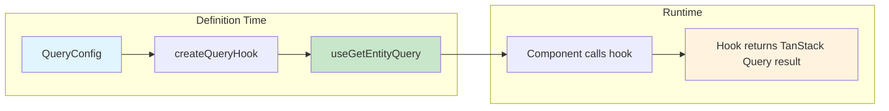

---

## Architecture

### Component Diagram

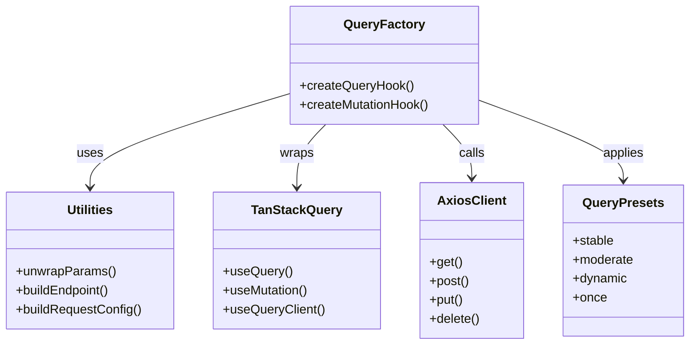

### Request Flow - Query

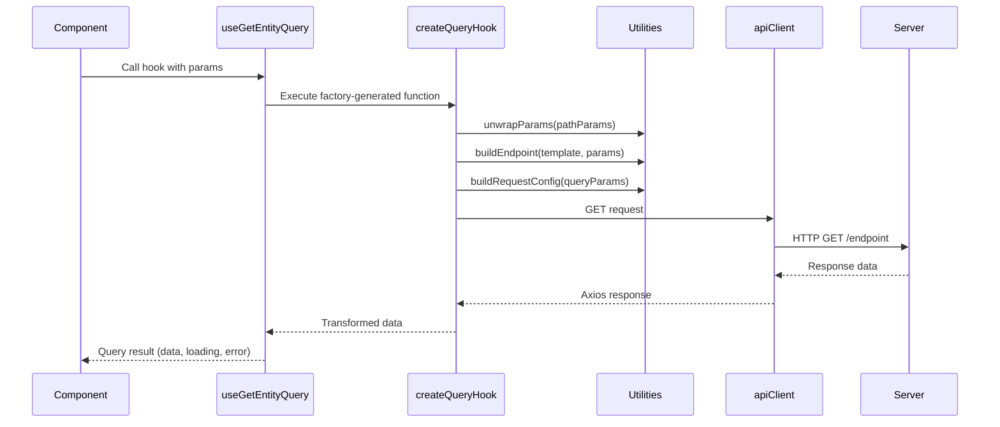

### Request Flow - Mutation

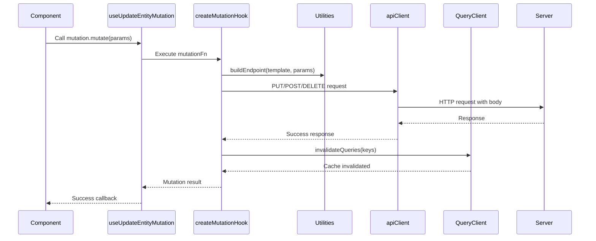

---

## Type System

### Type Hierarchy

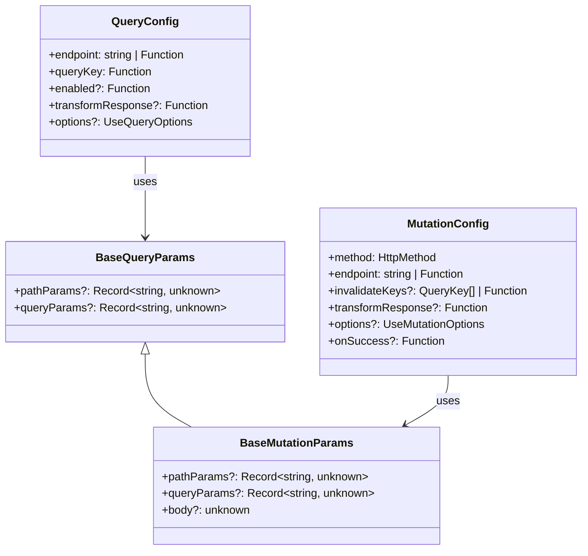

### Generic Type Parameters (Simplified)

The factory now uses only **2 generic parameters**, making it simpler to use:

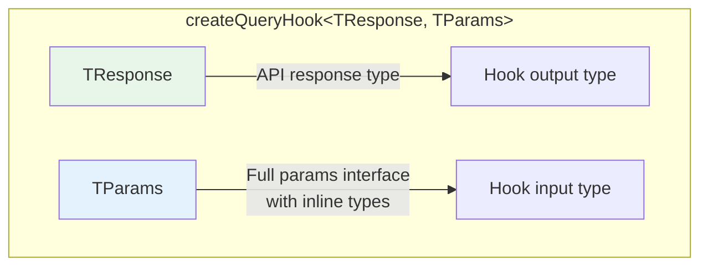

### Parameter Structure

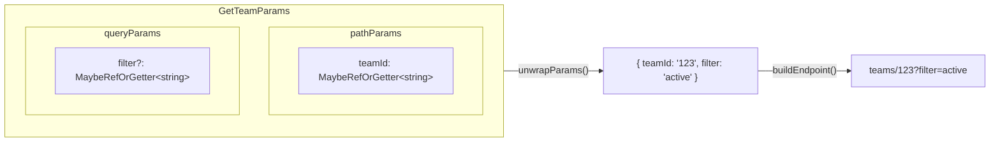

---

## Factory Functions

### createQueryHook

Creates a typed `useQuery` hook for GET requests.

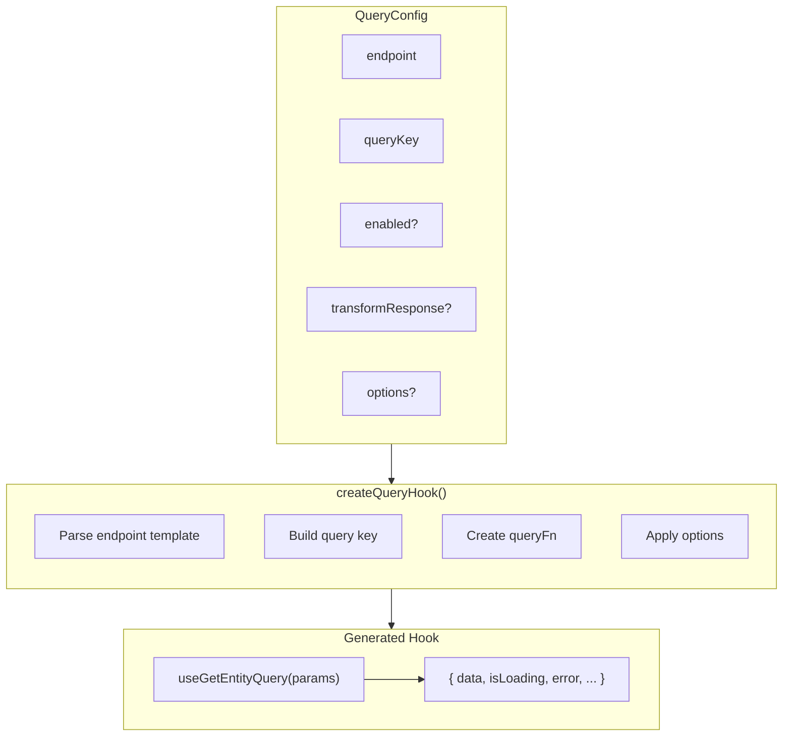

**Signature:**

```typescript
function createQueryHook<
  TResponse, // API response type
  TParams extends BaseQueryParams // Hook parameters type (with inline pathParams/queryParams)
>(config: QueryConfig): (params: TParams) => UseQueryReturnType
```

### createMutationHook

Creates a typed `useMutation` hook for POST/PUT/PATCH/DELETE requests.

```mermaid
flowchart TB
    subgraph Input["MutationConfig"]
        M[method: POST|PUT|DELETE]
        E[endpoint]
        IK[invalidateKeys?]
        OS[onSuccess?]
        O[options?]
    end

    subgraph Factory["createMutationHook()"]
        direction TB
        P1[Create mutationFn]
        P2[Setup cache invalidation]
        P3[Wire onSuccess callback]
    end

    subgraph Output["Generated Hook"]
        H["useUpdateEntityMutation()"]
        R["{ mutate, mutateAsync, isPending, ... }"]
    end

    Input --> Factory
    Factory --> Output
    H --> R
```

**Signature:**

```typescript
function createMutationHook<
  TResponse, // API response type
  TParams extends BaseMutationParams // Mutation parameters type (with inline pathParams/queryParams/body)
>(config: MutationConfig): () => UseMutationReturnType
```

---

## Utility Functions

### Data Flow Through Utilities

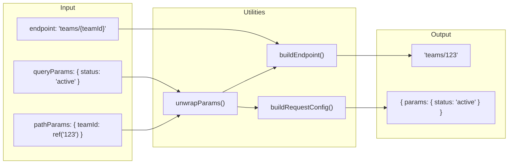

### unwrapParams()

Converts reactive `MaybeRefOrGetter` values to plain values.

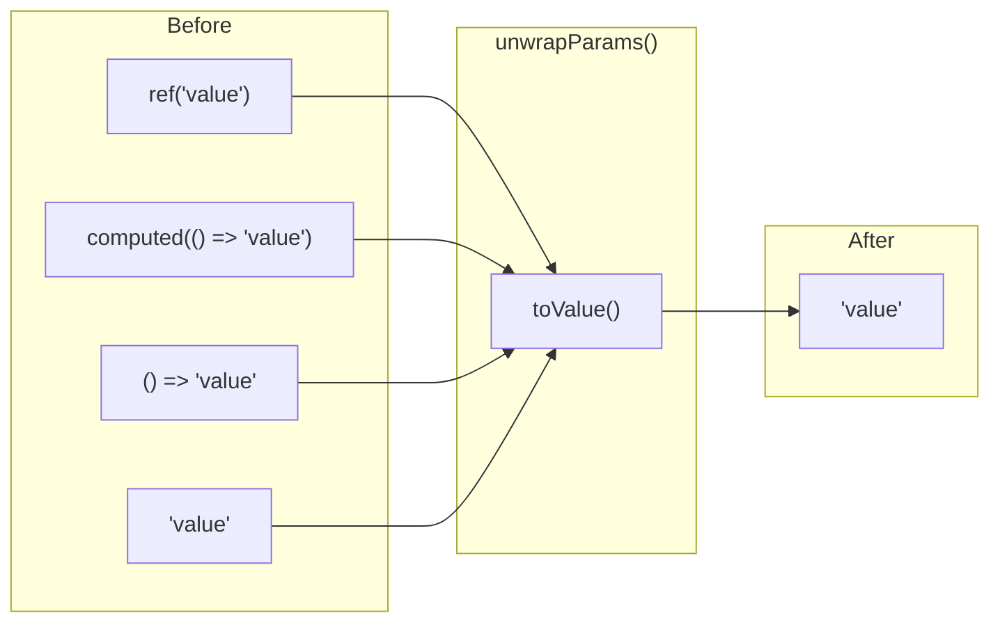

### buildEndpoint()

Replaces `{param}` placeholders with actual values.

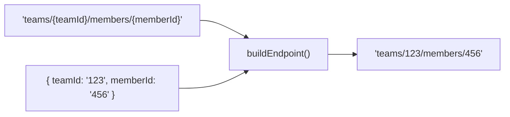

### buildRequestConfig()

Creates Axios config from query parameters.

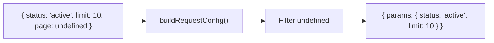

---

## Query Presets

Pre-configured options for common use cases.

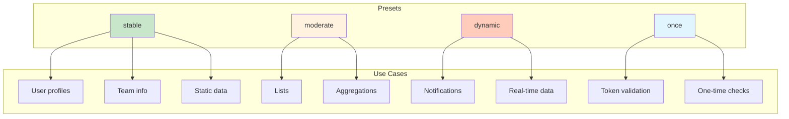

| Preset     | staleTime | gcTime | refetchOnWindowFocus | Use Case             |
| ---------- | --------- | ------ | -------------------- | -------------------- |
| `stable`   | 3 min     | 5 min  | false                | Rarely changing data |
| `moderate` | 1 min     | 2 min  | false                | Moderately changing  |
| `dynamic`  | 10 sec    | 1 min  | true                 | Frequently changing  |
| `once`     | Infinity  | -      | false                | One-time fetches     |

---

## Usage Examples

### Simple Query (No Parameters)

```typescript
// health.queries.ts
export const useGetBackendHealthQuery = createQueryHook<HealthResponse, {}>({
  endpoint: 'health',
  queryKey: () => healthKeys.all,
  options: queryPresets.once
})
```

### Query with Path Parameters

```typescript
// team.queries.ts
// Define params with inline types - no separate interface needed
interface GetTeamParams {
  pathParams: { teamId: MaybeRefOrGetter<number | null> }
}

export const useGetTeamQuery = createQueryHook<Team, GetTeamParams>({
  endpoint: 'teams/{teamId}',
  queryKey: (params) => teamKeys.detail(toValue(params.pathParams?.teamId)),
  enabled: (params) => !!toValue(params.pathParams?.teamId),
  options: queryPresets.stable
})
```

### Query with Query Parameters

```typescript
// action.queries.ts
// Define params with inline types
interface GetActionsParams {
  queryParams: {
    teamId: MaybeRefOrGetter<string | null>
    isExecuted?: MaybeRefOrGetter<boolean>
  }
}

export const useGetActionsQuery = createQueryHook<Action[], GetActionsParams>({
  endpoint: 'actions',
  queryKey: (params) =>
    actionKeys.list(toValue(params.queryParams?.teamId), toValue(params.queryParams?.isExecuted)),
  enabled: (params) => !!toValue(params.queryParams?.teamId),
  options: queryPresets.moderate
})
```

### Mutation with Cache Invalidation

```typescript
// team.queries.ts
// Define params with inline types - simpler!
interface UpdateTeamParams {
  pathParams: { id: number }
  body: { name?: string; description?: string }
}

export const useUpdateTeamMutation = createMutationHook<Team, UpdateTeamParams>({
  method: 'PUT',
  endpoint: 'teams/{id}',
  invalidateKeys: (params) => [teamKeys.detail(params.pathParams.id), teamKeys.all]
})
```

### Mutation with Dynamic Endpoint

```typescript
// contract.queries.ts
interface CreateContractParams {
  body: { teamId: number; contractType: string; address: string }
}

export const useCreateContractMutation = createMutationHook<void, CreateContractParams>({
  method: 'POST',
  endpoint: (params) => `teams/${params.body?.teamId}/contracts`,
  invalidateKeys: [contractKeys.all, ['teams']]
})
```

---

## Migration Guide

### Before (Manual Hook)

```typescript
export const useGetTeamQuery = (params: GetTeamParams) => {
  const { pathParams } = params

  return useQuery<Team, AxiosError>({
    queryKey: teamKeys.detail(toValue(pathParams.teamId)),
    queryFn: async () => {
      const teamId = toValue(pathParams.teamId)
      const { data } = await apiClient.get<Team>(`teams/${teamId}`)
      return data
    },
    enabled: () => !!toValue(pathParams.teamId),
    staleTime: 180000,
    gcTime: 300000,
    refetchOnWindowFocus: false,
    refetchOnMount: false
  })
}
```

### After (Factory Hook)

```typescript
// Only 2 generics needed: Response type and Params type
interface GetTeamParams {
  pathParams: { teamId: MaybeRefOrGetter<number | null> }
}

export const useGetTeamQuery = createQueryHook<Team, GetTeamParams>({
  endpoint: 'teams/{teamId}',
  queryKey: (params) => teamKeys.detail(toValue(params.pathParams?.teamId)),
  enabled: (params) => !!toValue(params.pathParams?.teamId),
  options: queryPresets.stable
})
```

### Migration Checklist

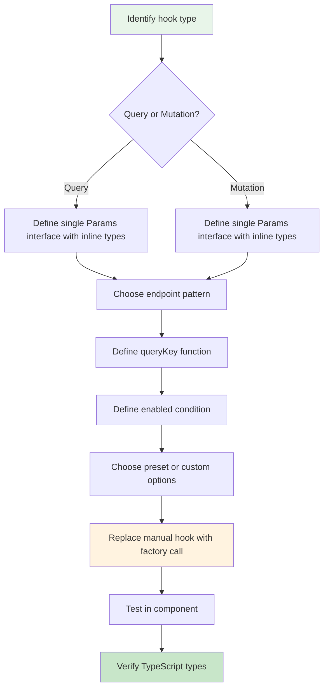

---

## Decision Tree

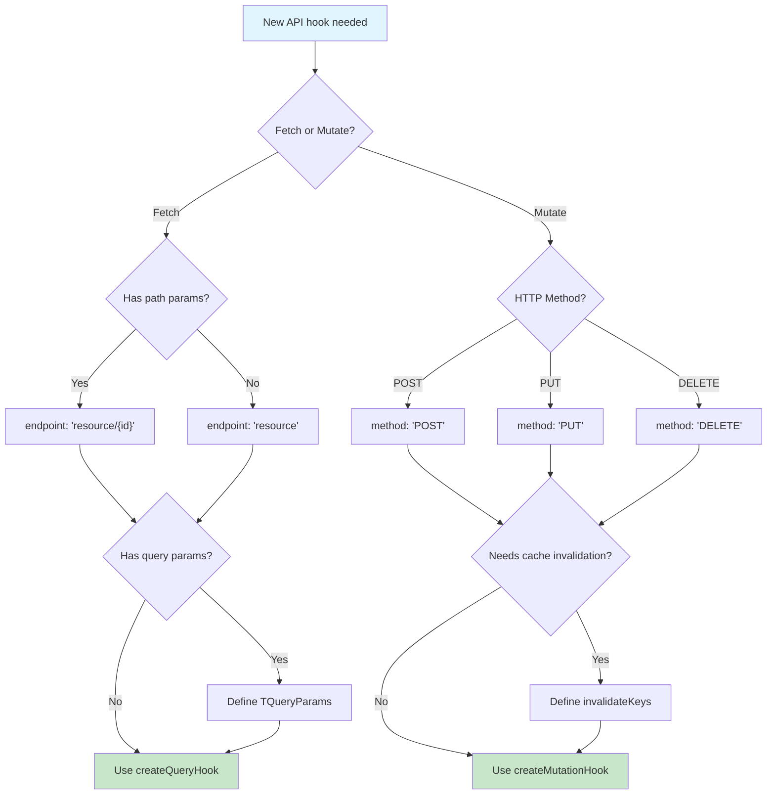
