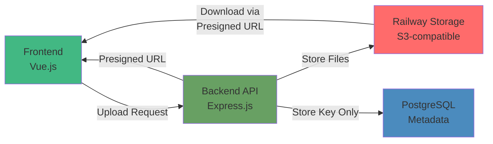
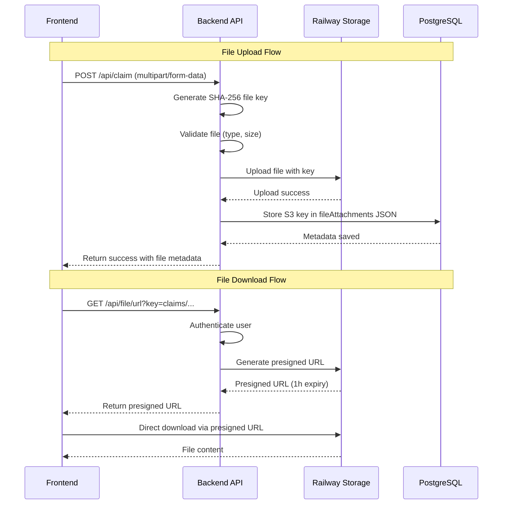
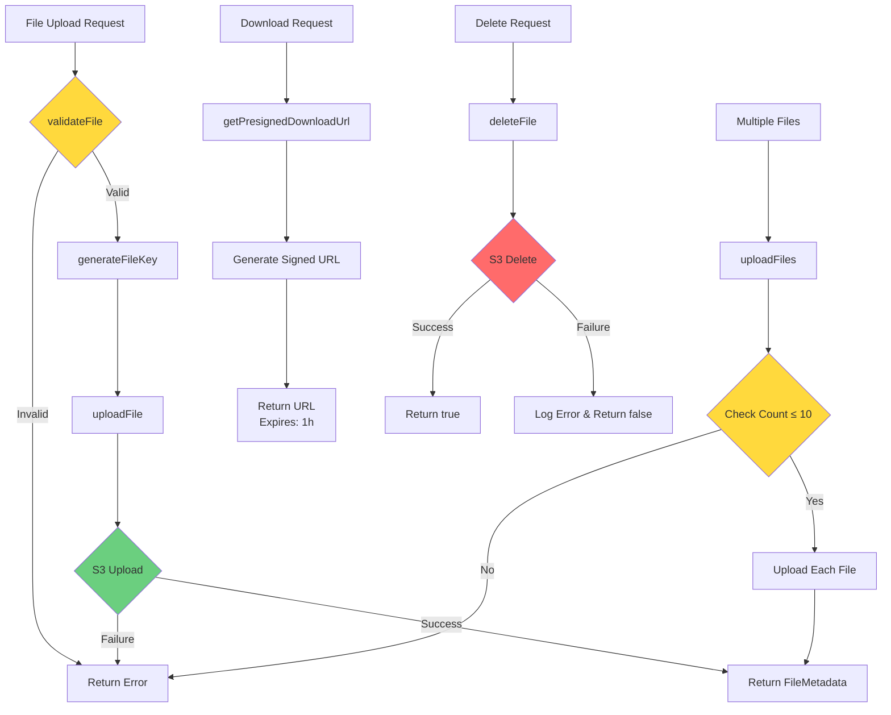
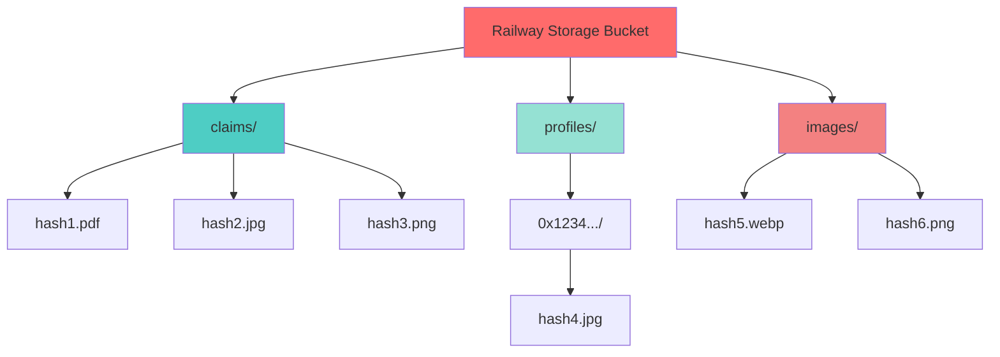
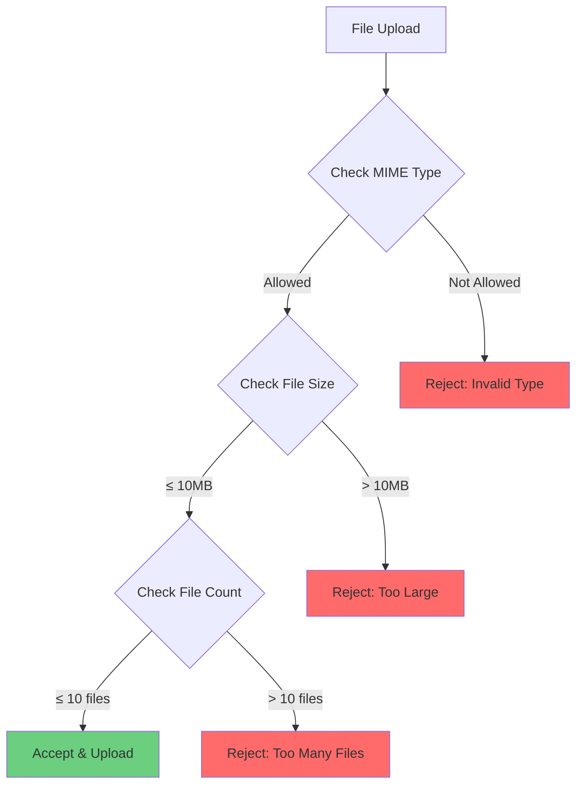
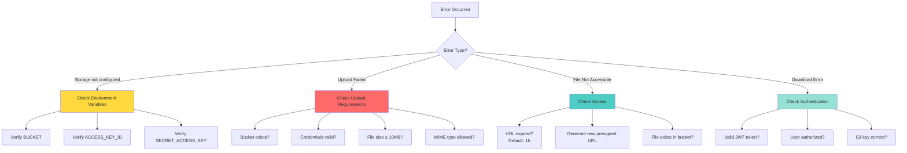
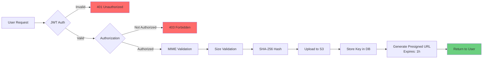
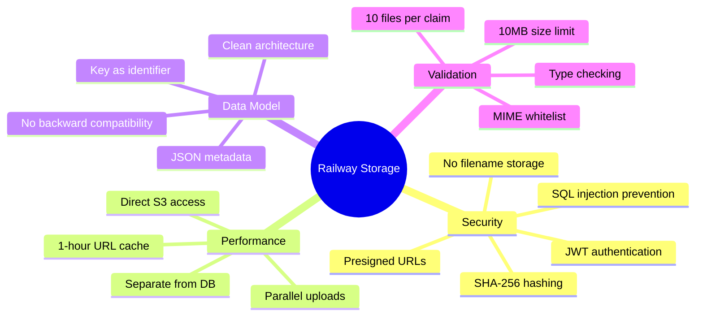

# Railway Storage Setup Guide

This document explains how to configure and use Railway Object Storage (S3-compatible) for file uploads in the CNC Portal backend.

## Overview

The CNC Portal uses Railway Storage for storing files (images and documents) instead of storing them directly in the database. This approach offers:

- **Better Performance**: Files are served directly from S3, reducing database load
- **Scalability**: Object storage scales independently from the database
- **Cost Efficiency**: Object storage is optimized for file storage
- **Reduced Database Size**: Only the S3 object key is stored in the database
- **Security**: Protection against SQL injection via filename sanitization

## Architecture



### Data Flow



## Railway Storage Setup

### 1. Create a Storage Bucket in Railway

1. Go to your Railway project dashboard
2. Click **Create** → **Bucket**
3. Select a region close to your users
4. Name your bucket (e.g., `cnc-portal-storage`)

### 2. Get Credentials

After creating the bucket, go to the **Credentials** tab to find:

- `BUCKET` - The globally unique bucket name
- `ACCESS_KEY_ID` - The S3 access key ID
- `SECRET_ACCESS_KEY` - The S3 secret access key
- `REGION` - Usually `auto`
- `ENDPOINT` - Usually `https://storage.railway.app`

### 3. Configure Environment Variables

Add these variables to your Railway service (or `.env` file for local development):

```bash
# Railway Storage Configuration
BUCKET=your-bucket-name-abc123
ACCESS_KEY_ID=your-access-key-id
SECRET_ACCESS_KEY=your-secret-access-key
REGION=auto
ENDPOINT=https://storage.railway.app
```

### 4. Using Variable References (Recommended)

Railway supports variable references between services. In your backend service:

1. Go to **Variables** tab
2. Add references to the bucket variables:

```
BUCKET=${{Bucket.BUCKET}}
ACCESS_KEY_ID=${{Bucket.ACCESS_KEY_ID}}
SECRET_ACCESS_KEY=${{Bucket.SECRET_ACCESS_KEY}}
REGION=${{Bucket.REGION}}
ENDPOINT=${{Bucket.ENDPOINT}}
```

## Core Functions

The storage service provides essential functions for file management:

| Function                    | Description                                             | Use Case                           |
| --------------------------- | ------------------------------------------------------- | ---------------------------------- |
| `uploadFile()`              | Upload single file to S3 with SHA-256 hashed filename   | General file uploads               |
| `uploadFiles()`             | Upload multiple files (max 10 per claim)                | Claim documents upload             |
| `getPresignedDownloadUrl()` | Generate time-limited presigned URL for secure download | File download authorization        |
| `deleteFile()`              | Delete file from S3 storage                             | Cleanup when claim/data is removed |
| `isStorageConfigured()`     | Check if Railway Storage environment variables are set  | Runtime configuration validation   |
| `validateFile()`            | Validate file type (MIME) and size before upload        | Input validation and security      |
| `generateFileKey()`         | Generate SHA-256 hashed key from timestamp + filename   | Unique file identification         |

### Function Details

#### File Upload Functions

**`uploadFile(file, folder)`** - Uploads a single file to Railway Storage

- Validates file type and size
- Generates unique SHA-256 hashed key
- Stores in specified folder (e.g., `claims/`, `profiles/`)
- Returns file metadata with S3 key

**`uploadFiles(files, folder)`** - Batch upload for multiple files

- Enforces 10-file limit per claim
- Calls `uploadFile()` for each file
- Returns array of upload results

#### Download & Access Functions

**`getPresignedDownloadUrl(fileKey, expiresIn)`** - Generates secure download URL

- Default expiry: 1 hour (3600 seconds)
- URL can only be used for download, not modification
- Requires valid S3 key

#### Storage Management Functions

**`deleteFile(fileKey)`** - Removes file from storage

- Used when claims are deleted
- Returns success/failure boolean
- Logs errors for monitoring

**`isStorageConfigured()`** - Configuration check

- Returns `true` if all required env vars are set
- Returns `false` if storage is not configured
- Used for graceful degradation

#### Validation & Security Functions

**`validateFile(file, allowedTypes, maxSize)`** - File validation

- Checks MIME type against whitelist
- Enforces size limit (default: 10MB)
- Returns validation result with error message

**`generateFileKey(folder, originalName)`** - Secure key generation

- Uses SHA-256 hash of `${timestamp}-${originalName}`
- Preserves file extension
- Prevents filename conflicts and SQL injection
- Format: `folder/hash.ext`

## Storage Service API

### Core Functions Overview



## API Endpoints

### Upload Files (Claims)

Files are uploaded as part of claim creation/update:

```http
POST /api/claim
Content-Type: multipart/form-data
Authorization: Bearer <token>

Body:
  files: [File1, File2, ...]  # Max 10 files
  hoursWorked: 8
  memo: "Work description"
  teamId: 1
```

**Response:**

```json
{
  "success": true,
  "claim": {
    "id": 123,
    "hoursWorked": 8,
    "memo": "Work description",
    "fileAttachments": [
      {
        "key": "claims/a1b2c3d4e5f6...hash.pdf",
        "fileType": "application/pdf",
        "fileSize": 524288
      }
    ]
  }
}
```

### Upload Profile Image

```http
PUT /api/user/:address
Content-Type: multipart/form-data
Authorization: Bearer <token>

Body:
  profileImage: [File]  # Single image file
  name: "John Doe"
```

**Response:**

```json
{
  "success": true,
  "user": {
    "address": "0x1234...",
    "name": "John Doe",
    "imageUrl": "profiles/0x1234.../hash.jpg"
  }
}
```

### Get File Download URL

```http
GET /api/file/url?key=claims/hash.pdf&expiresIn=3600
Authorization: Bearer <token>
```

**Response:**

```json
{
  "url": "https://storage.railway.app/...?signature=...",
  "expiresIn": 3600
}
```

### Direct File Download (Redirect)

```http
GET /api/file/download/claims/hash.pdf
Authorization: Bearer <token>

Response: 302 Redirect to presigned URL
```

## Database Storage

### File Metadata Structure

The S3 object key is stored in the database. For claims, file metadata is stored in the `fileAttachments` JSON field:

```typescript
// Stored in Claim.fileAttachments (PostgreSQL JSON field)
interface FileMetadata {
  key: string; // S3 object key - THIS IS THE UNIQUE IDENTIFIER
  fileType: string; // MIME type (e.g., "application/pdf")
  fileSize: number; // Size in bytes
}
```

**Important Security Notes:**

- ✅ **Only the S3 key is stored** in the database
- ✅ **Original filename is NOT stored** to prevent SQL injection
- ✅ **The key serves as both identifier and storage path**
- ✅ **SHA-256 hashing prevents filename conflicts**

### Database Schema (Prisma)

```prisma
model User {
  address   String  @id @unique
  name      String?
  imageUrl  String? // Stores S3 key: "profiles/0x.../hash.jpg"
  // ...
}

model Claim {
  id              Int      @id @default(autoincrement())
  hoursWorked     Int
  memo            String?
  fileAttachments Json?    // Array of FileMetadata objects
  // ...
}
```

### Example Data in PostgreSQL

```json
// User.imageUrl field
"profiles/0x1234567890abcdef/a1b2c3d4e5f6g7h8i9j0.jpg"

// Claim.fileAttachments field
[
  {
    "key": "claims/f9e8d7c6b5a4321098765432.pdf",
    "fileType": "application/pdf",
    "fileSize": 524288
  },
  {
    "key": "claims/1a2b3c4d5e6f7890abcdef12.jpg",
    "fileType": "image/jpeg",
    "fileSize": 153600
  }
]
```

## Folder Structure in Storage

Files are organized by folder with SHA-256 hashed filenames:



```text
bucket/
├── claims/
│   ├── a1b2c3d4e5f6...hash1.pdf
│   ├── f9e8d7c6b5a4...hash2.jpg
│   └── 1a2b3c4d5e6f...hash3.png
├── profiles/
│   └── 0x1234567890abcdef/
│       └── 9f8e7d6c5b4a...hash4.jpg
└── images/
    ├── 2e3f4a5b6c7d...hash5.webp
    └── 8d9e0f1a2b3c...hash6.png
```

**Note:** Files are hashed with SHA-256(`${timestamp}-${originalName}`) to ensure uniqueness and security.

## Configuration Options

| Environment Variable | Required | Default                       | Description                 |
| -------------------- | -------- | ----------------------------- | --------------------------- |
| `BUCKET`             | Yes      | -                             | Railway Storage bucket name |
| `ACCESS_KEY_ID`      | Yes      | -                             | S3 access key ID            |
| `SECRET_ACCESS_KEY`  | Yes      | -                             | S3 secret access key        |
| `REGION`             | No       | `auto`                        | S3 region                   |
| `ENDPOINT`           | No       | `https://storage.railway.app` | S3 endpoint URL             |

## File Validation

### Validation Flow



### Allowed MIME Types

**Images:**

- `image/png`
- `image/jpeg`
- `image/jpg`
- `image/webp`

**Documents:**

- `application/pdf`
- `text/plain`
- `application/zip`
- `application/x-zip-compressed`
- `application/vnd.openxmlformats-officedocument.wordprocessingml.document` (docx)

### Limits

- **Maximum file size**: 10MB per file
- **Maximum files per claim**: 10 files
- **Filename**: Original name is hashed, NOT stored in database
- **Storage**: Only S3 key is stored in PostgreSQL

## Troubleshooting



### "Storage not configured" Error

Ensure all required environment variables are set:

```bash
BUCKET=your-bucket-name
ACCESS_KEY_ID=your-access-key
SECRET_ACCESS_KEY=your-secret-key
```

Verify with:

```bash
echo $BUCKET
echo $ACCESS_KEY_ID
echo $SECRET_ACCESS_KEY
```

### "Failed to upload file" Error

1. ✅ Check if the bucket exists in Railway dashboard
2. ✅ Verify credentials are correct (try listing bucket contents)
3. ✅ Check file size doesn't exceed 10MB
4. ✅ Verify file MIME type is in the allowed list
5. ✅ Check network connectivity to Railway Storage endpoint

### Files Not Accessible

1. **Presigned URLs expire** (default: 1 hour)
   - Use `/api/file/url` endpoint to get a new presigned URL
2. **Check if file exists** in the bucket using Railway dashboard
3. **Verify S3 key** is correct in database (check `fileAttachments` JSON)
4. **Authentication required** - ensure JWT token is valid

### SQL Injection Prevention

✅ **Original filenames are never used directly**

- Files are identified by SHA-256 hashed keys
- Original filename is only used for hash generation, not storage
- Database stores only the S3 key (hash + extension)
- No user input is directly used in SQL queries

## Security Considerations



### Security Layers

1. **Authentication** 🔐
   - All file endpoints require JWT authentication
   - Invalid tokens are rejected with 401 Unauthorized

2. **Authorization** 🛡️
   - Users can only access files from their own claims/profile
   - Team-based access control for team claims
   - Ownership verification before file operations

3. **Presigned URLs** ⏰
   - Files are accessed via presigned URLs that expire (default: 1 hour)
   - URLs are single-use and time-limited
   - Cannot be reused after expiration

4. **Input Validation** ✅
   - MIME type validation (whitelist approach)
   - File size limits (10MB per file)
   - Maximum file count per claim (10 files)

5. **SQL Injection Prevention** 🔒
   - Original filenames are NEVER stored in database
   - SHA-256 hashing of filenames
   - Only S3 keys stored in PostgreSQL JSON fields
   - No user input directly in SQL queries

6. **File Naming** 🏷️
   - Files are identified by SHA-256 hash
   - Format: `folder/hash.extension`
   - Prevents filename conflicts
   - No special characters in storage keys

## Implementation Summary

### Key Design Decisions



### Benefits

✅ **Security First**

- Original filenames never touch the database
- SHA-256 ensures unique, safe identifiers
- Time-limited presigned URLs
- Complete SQL injection protection

✅ **Scalability**

- Object storage scales independently
- Database only stores small JSON metadata
- CDN-ready architecture
- Efficient file serving

✅ **Developer Experience**

- Simple API: `uploadFile()`, `uploadFiles()`
- Clear error messages
- Type-safe with TypeScript
- Comprehensive validation

✅ **Maintainability**

- No legacy compatibility baggage
- Clean separation of concerns
- Easy to test and debug
- Well-documented architecture

## Quick Start Checklist

- [ ] Create Railway Storage bucket
- [ ] Configure environment variables (`BUCKET`, `ACCESS_KEY_ID`, `SECRET_ACCESS_KEY`)
- [ ] Test storage with `isStorageConfigured()`
- [ ] Upload test file via `/api/claim` endpoint
- [ ] Verify file in Railway dashboard
- [ ] Test download via presigned URL
- [ ] Verify S3 key stored in database (not filename!)

## References

### Official Documentation

- [Railway Storage Documentation](https://docs.railway.com/guides/storage-buckets) - Complete guide for Railway Object Storage
- [AWS S3 SDK for JavaScript v3](https://docs.aws.amazon.com/AWSJavaScriptSDK/v3/latest/clients/client-s3/) - S3 client API reference
- [Prisma JSON Field Types](https://www.prisma.io/docs/concepts/components/prisma-schema/data-model#json-type) - Working with JSON in Prisma

### Related CNC Portal Documentation

- `backend/src/services/storageService.ts` - Storage service implementation
- `backend/src/routes/storageRoute.ts` - Storage API routes
- `backend/prisma/schema.prisma` - Database schema with file metadata

### Security Resources

- [OWASP File Upload Security](https://owasp.org/www-community/vulnerabilities/Unrestricted_File_Upload)
- [AWS S3 Presigned URLs Best Practices](https://docs.aws.amazon.com/AmazonS3/latest/userguide/ShareObjectPreSignedURL.html)
- [SQL Injection Prevention](https://owasp.org/www-community/attacks/SQL_Injection)
