# 🏛️ CNC Portal & TechDAO — Full Scenario

> _The story of a platform that rises, and a team that builds, governs, and grows together._
> _Every public function of every contract appears at least once in this scenario._

---

## 🎭 The Characters

|     | Name            | Role                                                                              |
| --- | --------------- | --------------------------------------------------------------------------------- |
| 🏗️  | **CNC Team**    | Deployers and maintainers of the CNC Portal platform                              |
| 👩‍💼  | **Alice**       | Founder of TechDAO — sole owner until the Board of Directors is elected           |
| 👨‍💻  | **Bob**         | Senior developer, paid in mixed ETH + SHER                                        |
| 🧑‍💻  | **Charlie**     | Junior developer, paid in mixed ETH + SHER, leaves at month 4                    |
| 👩‍⚖️  | **Diana**       | Team member elected to the Board of Directors                                     |
| 👩‍⚖️  | **Eve**         | Team member elected to the Board of Directors                                     |
| 👨‍⚖️  | **Frank**       | Team member elected to the Board of Directors                                     |
| 💰  | **Investor1**   | External investor acquiring SHER tokens                                           |
| 📣  | **Advertiser**  | External advertiser funding an ad campaign                                        |

---

## 🗺️ Ecosystem Map

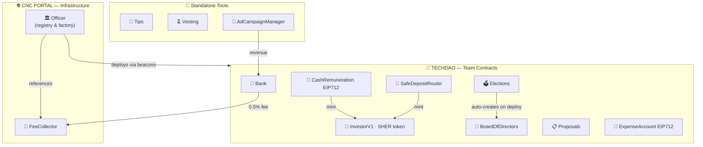

---

## 📅 Full Timeline

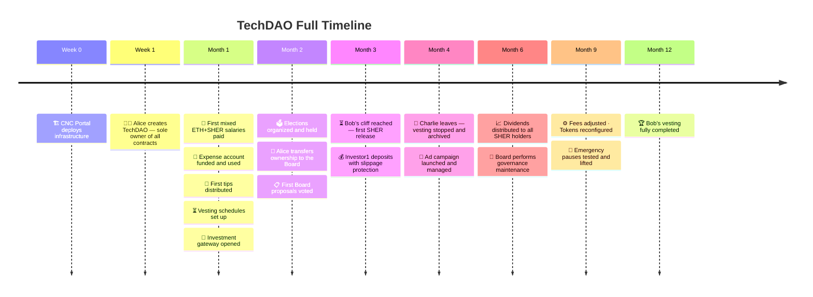

---

## Prologue — 🏗️ CNC Portal builds the foundation

### The infrastructure goes live

The CNC team deploys the platform. First, a **global fee vault** — the FeeCollector — is initialized with a 0.5% rate on bank transfers and support for USDC and USDT.

```mermaid
sequenceDiagram
    actor CNC as 🏗️ CNC Team
    participant FC as 💼 FeeCollector
    participant OFF as 🏛️ Officer

    CNC->>FC: initialize(owner, [{BANK: 0.5%}], [USDC, USDT])
    Note over FC: Fee vault active

    Note over CNC: A new chain is onboarded — DAI needs fee support
    CNC->>FC: addTokenSupport(DAI)
    CNC->>FC: getAllFeeConfigs()
    Note over FC: Returns [{BANK: 50bps}]
    CNC->>FC: getBalance()
    CNC->>FC: getTokenBalance(USDC)

    CNC->>OFF: deploy Officer(feeCollector)
    CNC->>OFF: initialize(beaconAdmin, 8 beaconConfigs, [], false)
    CNC->>OFF: getConfiguredContractTypes()
    Note over OFF: Returns [Bank, Elections, BoardOfDirectors,<br/>Proposals, InvestorV1, CashRemuneration,<br/>SafeDepositRouter, ExpenseAccountEIP712]
```

> 💡 Each implementation is registered as a **beacon** — if CNC Portal improves a contract, all teams benefit from the upgrade automatically.

---

### The platform adds a new contract type mid-flight

Six months later, CNC Portal ships a new contract type. Rather than redeploying the entire Officer, they add a single beacon.

```mermaid
sequenceDiagram
    actor CNC as 🏗️ CNC Team
    participant OFF as 🏛️ Officer

    CNC->>OFF: configureBeacon("StreamingPayroll", newBeaconAddress)
    CNC->>OFF: getConfiguredContractTypes()
    Note over OFF: Now includes StreamingPayroll
```

---

### Fees flow from all teams, CNC withdraws

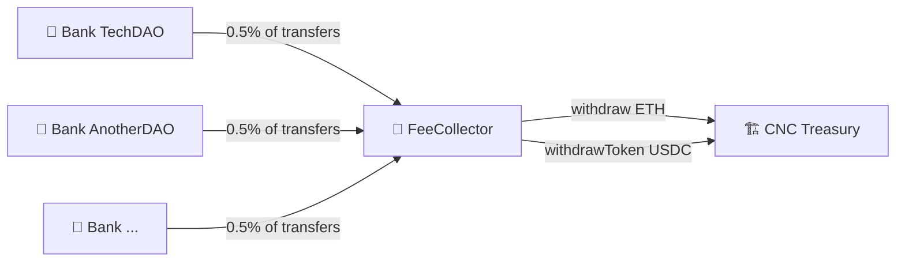

Later, DAI is no longer used on this chain. CNC removes it from the vault.

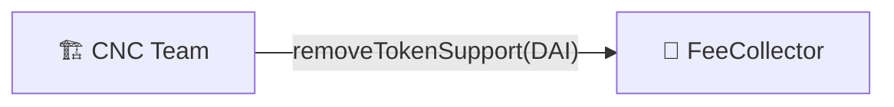

---

## Act I — 🌐 Alice creates TechDAO

### 👩‍💼 Alice deploys all team contracts at once

Alice uses `deployAllContracts` to bootstrap her entire team in a single call, then queries the Officer to confirm everything is live.

```mermaid
sequenceDiagram
    actor Alice as 👩‍💼 Alice
    participant OFF as 🏛️ Officer

    Alice->>OFF: deployAllContracts([Bank, InvestorV1, CashRemuneration,<br/>SafeDepositRouter, Elections, Proposals, ExpenseAccount])
    Note over OFF: All 7 proxies deployed<br/>BoardOfDirectors auto-created by Elections
    Alice->>OFF: getTeam()
    Note over OFF: Returns array of all 8 deployed contracts
    Alice->>OFF: getDeployedContracts()

    Note over Alice: Alice is sole owner of every contract
```

After deployment, Alice adds USDT to the Bank (not included in the initial list) and raises the Tips push limit for her larger team.

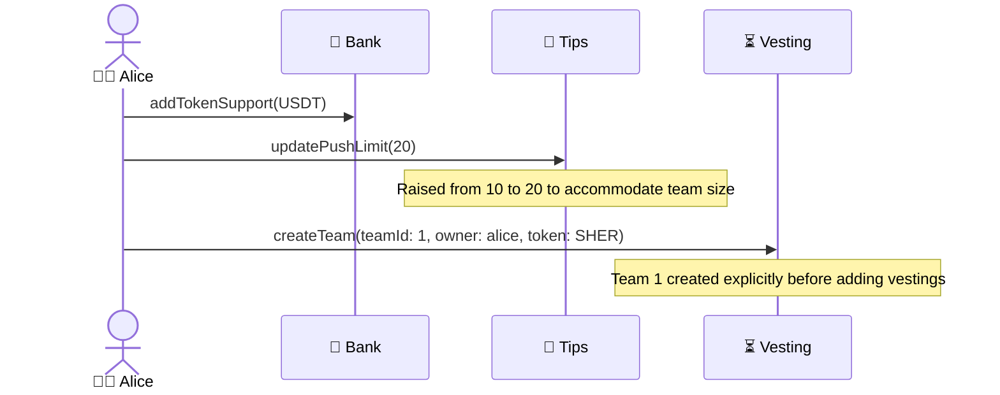

---

## Act II — 💸 The team gets paid — Mixed ETH + SHER

### Pre-election payroll

Before elections, Alice is the sole owner of CashRemuneration and signs all wage claims herself. Every team member receives **a mix of ETH and SHER** in a single claim.

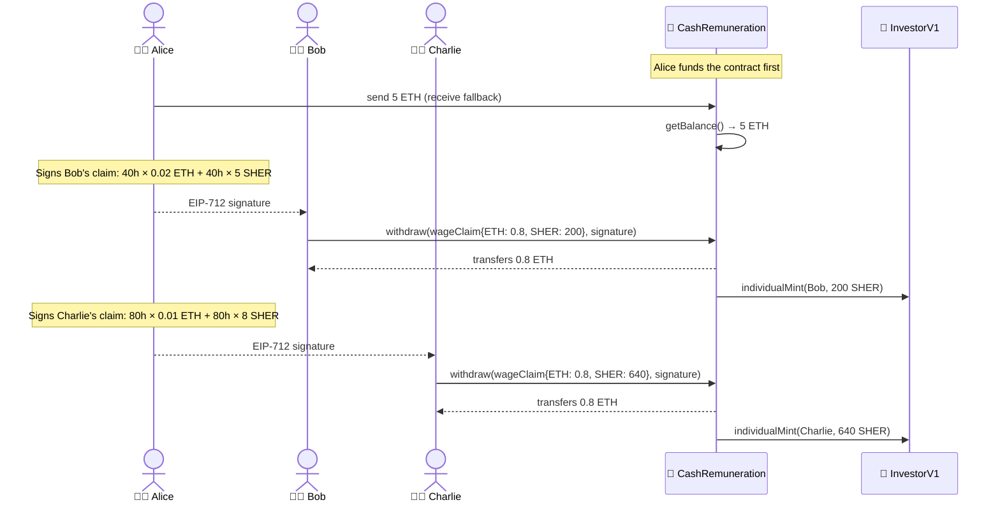

> 💡 SHER is **minted on demand** when the claim is processed — no SHER pre-funding needed. The ETH is transferred from the contract's balance.

---

### A mistaken claim is issued and revoked

Alice accidentally signs a claim with the wrong amount. She immediately disables it before anyone uses it. Later, once the correct claim is issued, she re-enables the original to confirm it stays blocked.

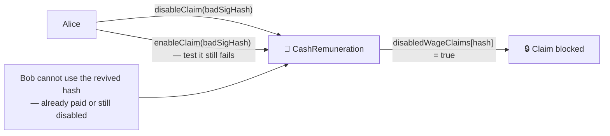

---

### Adding a new token to CashRemuneration

The team negotiates a USDC salary component starting month 2. Alice adds USDC to the supported tokens and later removes it when the team switches back to pure SHER/ETH.

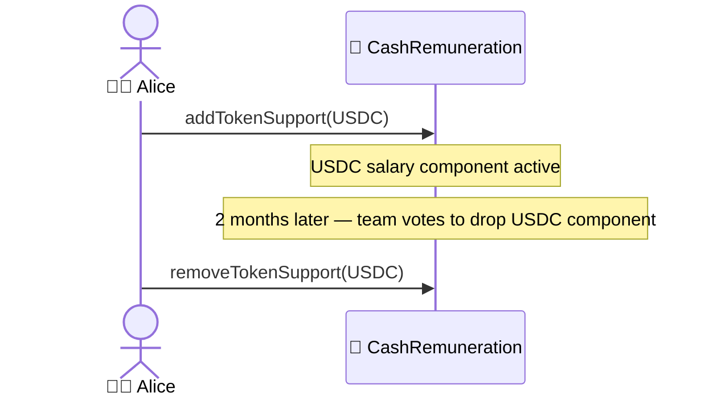

---

## Act III — 🧾 Expense Account in action

### Bob's monthly cloud server budget (recurring)

The Board funds the ExpenseAccount and Alice signs Bob a **monthly** budget to cover cloud infrastructure costs. The signature can be reused every month within its validity window.

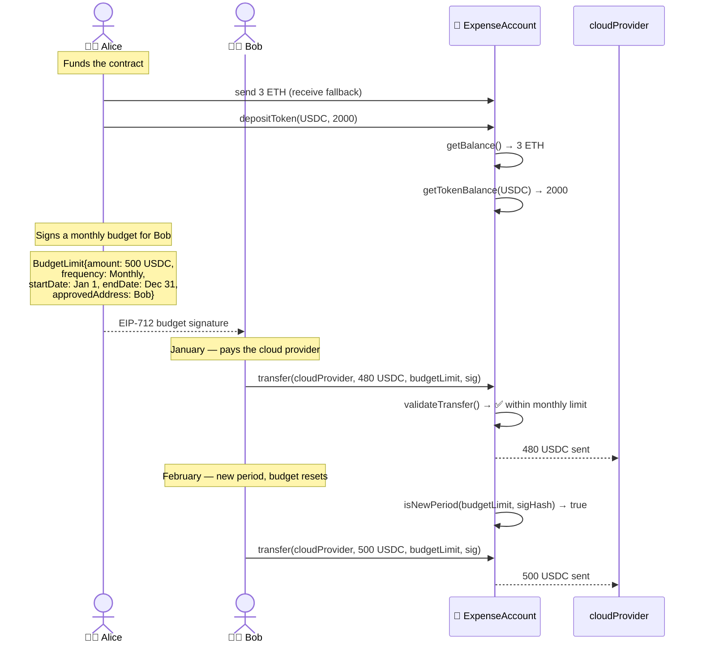

---

### Diana's one-time conference ticket

Diana needs to attend a web3 conference. Alice signs a **one-time** ETH budget for her.

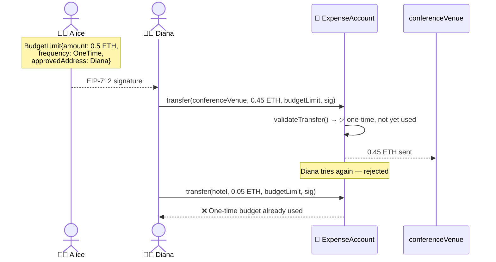

---

### A budget approval is deactivated and reinstated

The Board decides to freeze all expense budgets during a financial audit, then reinstates them.

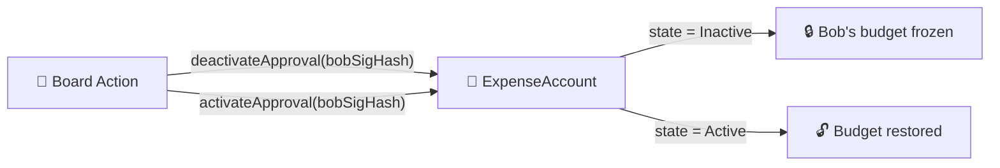

---

### Token management on ExpenseAccount

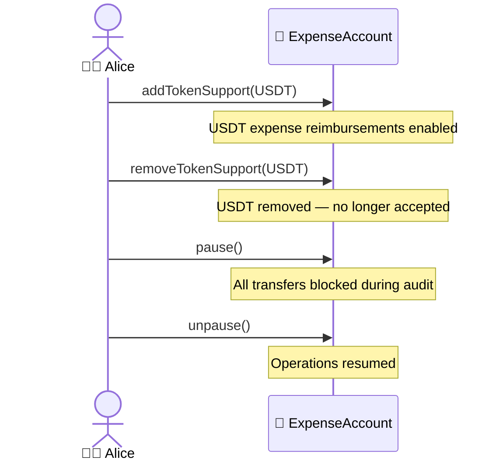

---

## Act IV — 🎁 Community tips

### Two modes of tipping

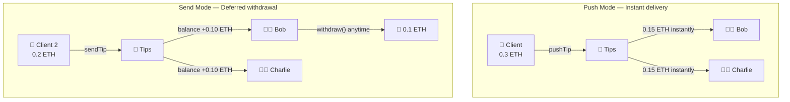

Bob checks his pending balance before withdrawing. Alice checks the total contract balance.

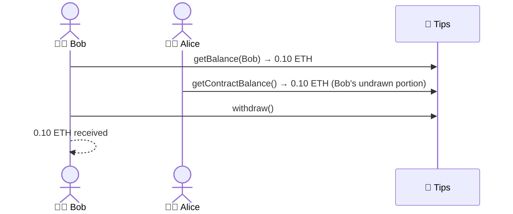

---

### Tips management

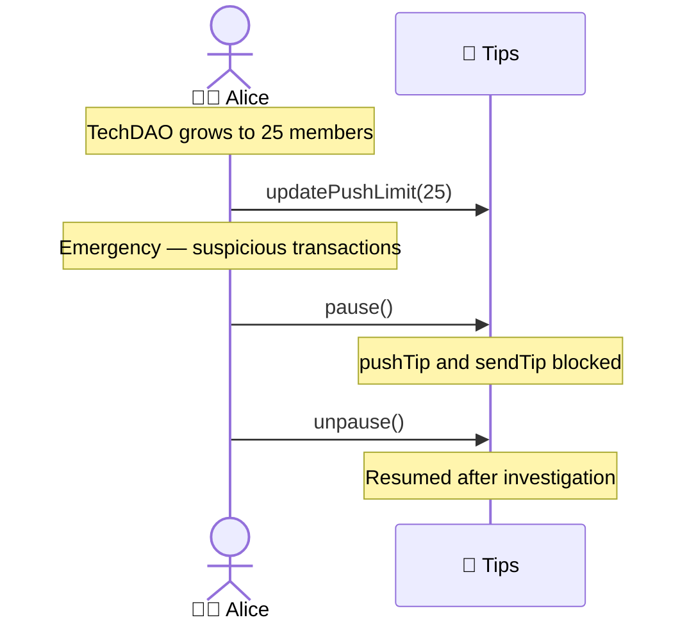

---

## Act V — ⏳ Vesting

### Setting up Bob's long-term commitment

Alice calls `createTeam` explicitly (already done in Act I), then adds Bob and Charlie's vesting schedules.

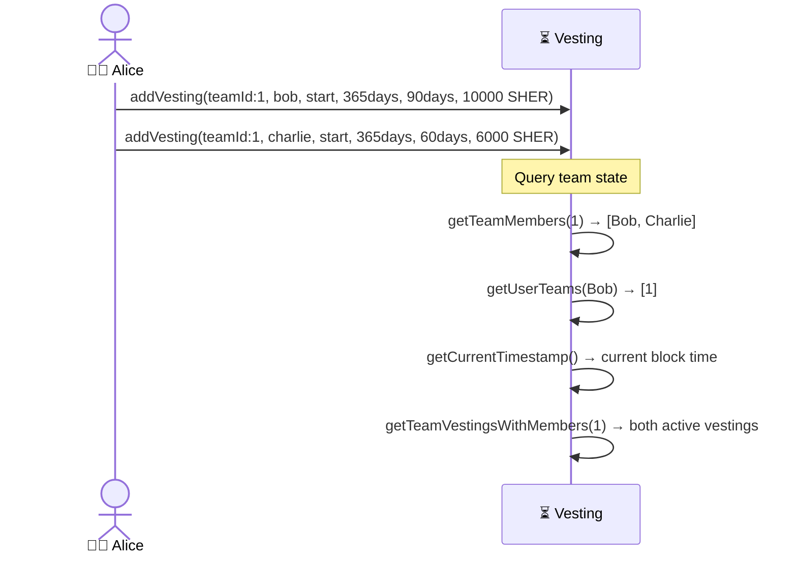

---

### Bob checks his vesting and releases after the cliff

Three months pass. Bob's cliff is reached. He checks his accrued amount before withdrawing.

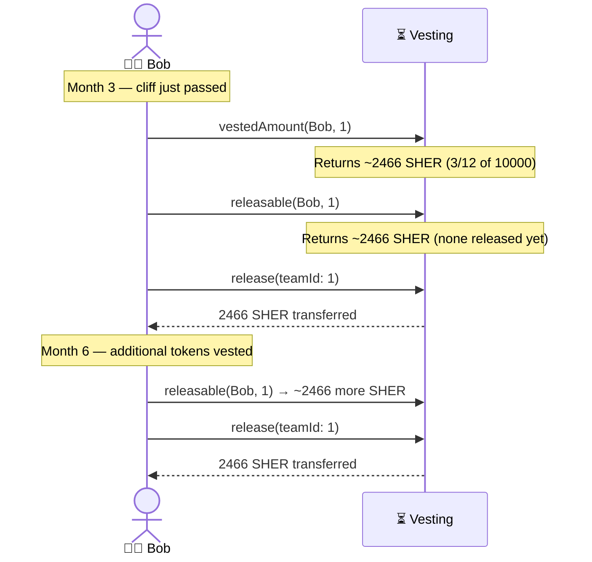

---

### Charlie leaves at month 4

```mermaid
sequenceDiagram
    actor Alice as 👩‍💼 Alice
    actor Charlie as 🧑‍💻 Charlie
    participant Vest as ⏳ Vesting

    Note over Alice: Charlie resigns — stop his vesting
    Alice->>Vest: stopVesting(Charlie, teamId: 1)
    Note over Vest: Calculates: ~1973 SHER vested → Charlie<br/>~4027 SHER unvested → Alice (team owner)
    Vest-->>Charlie: 1973 SHER transferred
    Vest-->>Alice: 4027 SHER returned

    Note over Alice: Review archived history
    Alice->>Vest: getTeamAllArchivedVestingsFlat(1)
    Note over Vest: Returns Charlie's archived vesting entry

    Note over Alice: Emergency pause during legal dispute
    Alice->>Vest: pause()
    Alice->>Vest: unpause()
```

---

## Act VI — 🔀 Investment Gateway

### Investor1 deposits with slippage protection

Alice enables deposits and configures the gateway before opening it to investors.

```mermaid
sequenceDiagram
    actor Alice as 👩‍💼 Alice
    actor Inv as 💰 Investor1
    participant SDR as 🔀 SafeDepositRouter
    participant SHER as 💎 InvestorV1

    Alice->>SDR: addTokenSupport(USDT)
    Alice->>SDR: enableDeposits()

    Note over Inv: Check expected compensation before depositing
    Inv->>SDR: calculateCompensation(USDC, 500) → 500 SHER (at 1x)

    Note over Inv: Deposit with minimum guarantee
    Inv->>SDR: depositWithSlippage(USDC, 500, minOut: 490 SHER)
    SDR->>Safe: 500 USDC transferred
    SDR->>SHER: individualMint(Investor1, 500 SHER)
    SHER-->>Inv: 500 SHER received

    Note over Alice: Promotion — 2x multiplier
    Alice->>SDR: setMultiplier(2e18)

    Note over Inv: Standard deposit under promo
    Inv->>SDR: deposit(USDC, 100)
    Note over SDR: 100 USDC → 200 SHER
    SHER-->>Inv: 200 SHER received
```

---

### Gateway maintenance

```mermaid
sequenceDiagram
    actor Alice as 👩‍💼 Alice
    participant SDR as 🔀 SafeDepositRouter

    Note over Alice: Team multi-sig changes address
    Alice->>SDR: setSafeAddress(newMultisig)

    Note over Alice: USDT no longer needed
    Alice->>SDR: removeTokenSupport(USDT)

    Note over Alice: A user accidentally sent tokens directly to the contract
    Alice->>SDR: recoverERC20(DAI, amount)
    Note over SDR: DAI recovered and sent to Safe

    Note over Alice: Pause deposits temporarily
    Alice->>SDR: disableDeposits()
    Alice->>SDR: pause()
    Alice->>SDR: unpause()
    Alice->>SDR: enableDeposits()
```

---

## Act VII — 🗳️ Elections & Birth of the Board

### Alice creates the election

After one month of operations, TechDAO is ready for democratic governance. Alice opens a formal election.

```mermaid
sequenceDiagram
    actor Alice as 👩‍💼 Alice
    participant ELEC as 🗳️ Elections

    Alice->>ELEC: getNextElectionId() → 1
    Alice->>ELEC: createElection(title: "First BOD Election",<br/>seats: 3, candidates: [Diana,Eve,Frank,Grace],<br/>voters: [Bob,Charlie,Diana,Eve,Frank,Grace])
    Note over ELEC: Election #1 created
    Alice->>ELEC: getElection(1)
    Alice->>ELEC: getElectionCandidates(1) → [Diana,Eve,Frank,Grace]
    Alice->>ELEC: getElectionEligibleVoters(1)
```

---

### The team votes

```mermaid
sequenceDiagram
    actor Bob as 👨‍💻 Bob
    actor Charlie as 🧑‍💻 Charlie
    actor Diana as 👩‍⚖️ Diana
    actor Eve as 👩‍⚖️ Eve
    actor Frank as 👨‍⚖️ Frank
    participant ELEC as 🗳️ Elections

    ELEC->>ELEC: isEligibleVoter(1, Bob) → true
    Bob->>ELEC: castVote(electionId:1, Diana)
    Charlie->>ELEC: castVote(electionId:1, Eve)
    Diana->>ELEC: castVote(electionId:1, Diana)
    Eve->>ELEC: castVote(electionId:1, Frank)
    Frank->>ELEC: castVote(electionId:1, Eve)

    ELEC->>ELEC: hasVoted(1, Bob) → true
    ELEC->>ELEC: getVoteCount(1) → 5
    ELEC->>ELEC: getElectionResults(1) → [Diana, Eve, Frank]

    Note over Alice: Election period ends — Alice publishes
    Alice->>ELEC: publishResults(1)
    Note over ELEC: BOD.setBoardOfDirectors([Diana,Eve,Frank]) called
    ELEC->>ELEC: getElectionWinners(1) → [Diana, Eve, Frank]
    ELEC->>ELEC: getVoterChoice(1, Bob) → Diana
```

---

### 🔑 Alice transfers ownership to the Board

With the Board officially formed, Alice hands over full authority.

```mermaid
sequenceDiagram
    actor Alice as 👩‍💼 Alice
    participant BOD as 🎩 BoardOfDirectors
    participant Bank as 🏦 Bank
    participant CR as 💸 CashRemuneration
    participant SDR as 🔀 SafeDepositRouter
    participant SHER as 💎 InvestorV1
    participant EXP as 🧾 ExpenseAccount

    BOD->>BOD: getOwners() → [Elections contract]
    BOD->>BOD: getBoardOfDirectors() → [Diana, Eve, Frank]
    BOD->>BOD: isMember(Diana) → true

    Alice->>Bank: transferOwnership(BOD)
    Alice->>CR: transferOwnership(BOD)
    Alice->>SDR: transferOwnership(BOD)
    Alice->>SHER: transferOwnership(BOD)
    Alice->>EXP: transferOwnership(BOD)

    Note over BOD: The Board now owns all team contracts
    Note over Alice: Alice is now a regular member
```

---

## Act VIII — 🎩 The Board governs

### A revoked action (Diana submits a mistake)

Diana submits an action with the wrong amount, realizes the error before anyone else votes, and revokes it.

```mermaid
sequenceDiagram
    actor Diana as 👩‍⚖️ Diana
    participant BOD as 🎩 BoardOfDirectors

    Diana->>BOD: addAction(Bank, "Transfer 50 ETH to Bob", transfer(Bob, 50 ETH))
    Note over BOD: actionCount=0, Diana auto-approved, count=1
    BOD->>BOD: approvalCount(0) → 1
    BOD->>BOD: isApproved(0, Diana) → true

    Note over Diana: Realizes: amount should be 5 ETH, not 50
    Diana->>BOD: revoke(actionId: 0)
    Note over BOD: Diana's approval removed, count=0

    BOD->>BOD: isActionExecuted(0) → false
```

---

### The correct action passes

```mermaid
sequenceDiagram
    actor Diana as 👩‍⚖️ Diana
    actor Eve as 👩‍⚖️ Eve
    participant BOD as 🎩 BoardOfDirectors
    participant Bank as 🏦 Bank
    actor Bob as 👨‍💻 Bob

    Diana->>BOD: addAction(Bank, "Hardware for Bob — 5 ETH", transfer(Bob, 5 ETH))
    Note over BOD: actionCount=1, Diana auto-approved, count=1
    Eve->>BOD: approve(actionId: 1)
    Note over BOD: count=2 ≥ (3/2)+1=2 ✅ Quorum reached
    BOD->>Bank: transfer(Bob, 5 ETH)
    Bank-->>Bob: 5 ETH received
    BOD->>BOD: isActionExecuted(1) → true
```

---

### The Board updates its own ownership structure

When a new strategic partner joins, the Board votes to add them as an owner of the BOD itself (a self-referential action).

```mermaid
sequenceDiagram
    actor Diana as 👩‍⚖️ Diana
    actor Eve as 👩‍⚖️ Eve
    participant BOD as 🎩 BoardOfDirectors

    Diana->>BOD: addAction(BOD, "Add partner as owner", BOD.addOwner(partnerAddr))
    Eve->>BOD: approve(actionId)
    Note over BOD: Quorum → BOD.addOwner(partnerAddr) executed
    BOD->>BOD: getOwners() → [Elections, partnerAddr]

    Note over Diana: Later — partner exits, remove their ownership
    Diana->>BOD: addAction(BOD, "Remove partner", BOD.removeOwner(partnerAddr))
    Eve->>BOD: approve(actionId)
    BOD->>BOD: getOwners() → [Elections]

    Note over Diana: Full reset of ownership if needed
    Diana->>BOD: addAction(BOD, "Reset owners", BOD.setOwners([Elections, alice]))
    Eve->>BOD: approve(actionId)
```

---

## Act IX — 📋 Proposals

### The Board votes on a remote work policy

Diana creates a formal policy proposal. All three Board members vote. Results are tallied automatically when the last vote is cast.

```mermaid
sequenceDiagram
    actor Diana as 👩‍⚖️ Diana
    actor Eve as 👩‍⚖️ Eve
    actor Frank as 👨‍⚖️ Frank
    participant PROP as 📋 Proposals

    Diana->>PROP: createProposal("Remote Work Policy",<br/>"Allow full remote — no office required",<br/>type: "Policy", start: now, end: +7days)
    Note over PROP: Proposal #1 created

    PROP->>PROP: getProposal(1) → Active
    PROP->>PROP: getBoardOfDirectors() → [Diana, Eve, Frank]

    Diana->>PROP: castVote(1, Yes)
    PROP->>PROP: hasVoted(1, Diana) → true
    Eve->>PROP: castVote(1, Yes)
    Frank->>PROP: castVote(1, Abstain)
    Note over PROP: All 3 voted → tallyResults() auto-called
    Note over PROP: 2 Yes, 0 No, 1 Abstain → Succeeded ✅
```

---

### A contested proposal ends in a tie

```mermaid
sequenceDiagram
    actor Diana as 👩‍⚖️ Diana
    actor Eve as 👩‍⚖️ Eve
    actor Frank as 👨‍⚖️ Frank
    participant PROP as 📋 Proposals

    Diana->>PROP: createProposal("Office Lease", "Rent downtown office", "Budget", ...)
    Diana->>PROP: castVote(2, Yes)
    Eve->>PROP: castVote(2, No)
    Frank->>PROP: castVote(2, No)
    Note over PROP: 1 Yes, 2 No → Defeated ❌
    PROP->>PROP: getProposal(2) → Defeated

    Note over PROP: A third proposal ends in exact tie → Expired
    Diana->>PROP: tallyResults(3)
    Note over PROP: 1 Yes, 1 No, 1 Abstain → Expired ⏰
```

---

## Act X — 🏦 Bank Operations

### Clients deposit, Board manages the treasury

```mermaid
sequenceDiagram
    actor Client as 👤 Client
    participant Bank as 🏦 Bank
    participant BOD as 🎩 BoardOfDirectors

    Client->>Bank: send 10 ETH (receive fallback)
    Client->>Bank: depositToken(USDC, 5000)

    Bank->>Bank: getBalance() → 10 ETH
    Bank->>Bank: getTokenBalance(USDC) → 5000

    Note over BOD: Board votes to add USDT support
    BOD->>BOD: addAction(Bank, "Add USDT", Bank.addTokenSupport(USDT))
    BOD->>Bank: addTokenSupport(USDT)

    Note over BOD: Later — USDT liquidity dried up, remove it
    BOD->>BOD: addAction(Bank, "Remove USDT", Bank.removeTokenSupport(USDT))
    BOD->>Bank: removeTokenSupport(USDT)
```

---

### Transfers with automatic platform fees

```mermaid
flowchart LR
    Bank["🏦 Bank TechDAO"]
    Bank -->|"0.01 ETH (0.5%)"| FC["💼 FeeCollector"]
    Bank -->|"1.99 ETH net"| Contractor["👤 Contractor"]
    Bank -->|"5 USDC (0.5%)"| FC
    Bank -->|"995 USDC net"| Bob["👨‍💻 Bob"]
```

---

### Emergency pause of the Bank

```mermaid
sequenceDiagram
    participant BOD as 🎩 BoardOfDirectors
    participant Bank as 🏦 Bank

    Note over BOD: Suspicious draining activity detected
    BOD->>BOD: addAction(Bank, "Emergency pause", Bank.pause())
    BOD->>Bank: pause()
    Note over Bank: All transfers/deposits blocked

    Note over BOD: Issue resolved after investigation
    BOD->>BOD: addAction(Bank, "Resume", Bank.unpause())
    BOD->>Bank: unpause()
```

---

## Act XI — 📈 Dividends for SHER holders

### The Board distributes profits

```mermaid
flowchart TD
    Bank["🏦 Bank TechDAO"]
    Bank -->|"distributeNativeDividends(1 ETH)"| SHER["💎 InvestorV1"]
    Bank -->|"distributeTokenDividends(USDC, 2000)"| SHER

    SHER -->|"proportional to SHER held"| Inv["💰 Investor1"]
    SHER -->|"proportional to SHER held"| Bob["👨‍💻 Bob"]
    SHER -->|"proportional to SHER held"| Diana["👩‍⚖️ Diana"]
```

> 💡 Bob and Diana both accumulated SHER through their mixed ETH+SHER salaries. Every SHER holder benefits at dividend time — employees, Board members, and external investors alike.

---

## Act XII — 📣 Ad Campaigns

### Advertiser lifecycle with admin management

```mermaid
sequenceDiagram
    actor Alice as 👩‍💼 Alice
    actor Adv as 📣 Advertiser
    participant ADS as 📣 AdCampaignManager

    Note over Alice: Delegate campaign management to Bob
    Alice->>ADS: addAdmin(Bob)
    ADS->>ADS: getAdminList() → [Bob]
    ADS->>ADS: setCostPerClick(0.002 ETH)
    ADS->>ADS: setCostPerImpression(0.0002 ETH)

    Adv->>ADS: createAdCampaign{value: 1 ETH}
    ADS->>ADS: getAdCampaignByCode("CAMPAIGN-...") → Active
    Note over ADS: Weeks pass — clicks and impressions

    Bob->>ADS: claimPayment("CAMPAIGN-...", 0.3 ETH)
    ADS-->>Bank: 0.3 ETH revenue transferred

    Note over Alice: Bank address changed — update the manager
    Alice->>ADS: setBankContractAddress(newBankAddr)

    Adv->>ADS: requestAndApproveWithdrawal("CAMPAIGN-...", 0.4 ETH)
    ADS-->>Adv: 0.6 ETH refunded
    ADS-->>Bank: 0.1 ETH final revenue

    Note over Alice: Remove Bob from admin — he left the team
    Alice->>ADS: removeAdmin(Bob)
    ADS->>ADS: getAdminList() → []

    Note over Alice: Pause during legal review
    Alice->>ADS: pause()
    Alice->>ADS: unpause()
```

---

## Act XIII — ⚙️ Platform-level governance

### The Board adjusts platform fees

```mermaid
sequenceDiagram
    actor Diana as 👩‍⚖️ Diana
    actor Eve as 👩‍⚖️ Eve
    participant BOD as 🎩 BoardOfDirectors
    participant FC as 💼 FeeCollector
    participant OFF as 🏛️ Officer

    Diana->>BOD: addAction(FeeCollector, "Raise BANK fee to 1%", setFee("BANK", 100))
    Eve->>BOD: approve(actionId)
    BOD->>FC: setFee("BANK", 100)
    Note over FC: 0.5% ──► 1.0%

    Note over CNC: CNC team pauses Officer during a migration
    OFF->>OFF: pause()
    Note over OFF: No new beacon proxies can be deployed
    OFF->>OFF: unpause()
    Note over OFF: Deployments resume
```

---

## 🏆 Epilogue — Two resilient organizations

### Function coverage summary

| Contract | Key functions exercised |
|---|---|
| 💼 **FeeCollector** | initialize, addTokenSupport, removeTokenSupport, getAllFeeConfigs, getBalance, getTokenBalance, setFee, withdraw, withdrawToken, receive |
| 🏛️ **Officer** | initialize, deployAllContracts, deployBeaconProxy, getTeam, getDeployedContracts, getConfiguredContractTypes, configureBeacon, findDeployedContract, getFeeFor, getFeeCollector, isFeeCollectorToken, pause, unpause |
| 🏦 **Bank** | initialize, addTokenSupport, removeTokenSupport, getBalance, getTokenBalance, receive, depositToken, transfer, transferToken, distributeNativeDividends, distributeTokenDividends, pause, unpause |
| 🎩 **BoardOfDirectors** | initialize, addAction, approve, revoke, setBoardOfDirectors, isActionExecuted, isApproved, approvalCount, getOwners, getBoardOfDirectors, isMember, addOwner, removeOwner, setOwners |
| 💸 **CashRemuneration** | initialize, withdraw, addTokenSupport, removeTokenSupport, enableClaim, disableClaim, getBalance, receive, pause, unpause |
| 🔀 **SafeDepositRouter** | initialize, deposit, depositWithSlippage, calculateCompensation, addTokenSupport, removeTokenSupport, enableDeposits, disableDeposits, setSafeAddress, setMultiplier, recoverERC20, pause, unpause |
| 🧾 **ExpenseAccount** | initialize, receive, depositToken, transfer, validateTransfer, getCurrentPeriod, isNewPeriod, deactivateApproval, activateApproval, addTokenSupport, removeTokenSupport, getBalance, getTokenBalance, pause, unpause |
| 🗳️ **Elections** | initialize, createElection, castVote, publishResults, getElection, getElectionCandidates, getElectionEligibleVoters, getElectionWinners, getElectionResults, getVoterChoice, hasVoted, isEligibleVoter, getVoteCount, getNextElectionId, pause, unpause |
| 📋 **Proposals** | initialize, createProposal, castVote (Yes/No/Abstain), getProposal, tallyResults, getBoardOfDirectors, hasVoted |
| 🎁 **Tips** | initialize, pushTip, sendTip, withdraw, getBalance, getContractBalance, updatePushLimit, pause, unpause |
| ⏳ **Vesting** | initialize, createTeam, addVesting, stopVesting, vestedAmount, releasable, release, getTeamMembers, getUserTeams, getTeamVestingsWithMembers, getTeamAllArchivedVestingsFlat, getCurrentTimestamp, pause, unpause |
| 📣 **AdCampaignManager** | constructor, createAdCampaign, claimPayment, requestAndApproveWithdrawal, addAdmin, removeAdmin, setBankContractAddress, setCostPerClick, setCostPerImpression, getAdCampaignByCode, getAdminList, pause, unpause, receive |

---

### 🔄 The full value flow

```mermaid
flowchart TD
    Adv["📣 Advertiser"] -->|"ETH ad budget"| ADS["📣 AdCampaignManager"]
    ADS -->|"campaign revenue"| Bank["🏦 Bank TechDAO"]

    Inv["💰 Investor1"] -->|"USDC"| SDR["🔀 SafeDepositRouter"]
    SDR -->|"USDC"| Safe["🔐 Team Safe"]
    SDR -->|"mint SHER"| Inv

    Client["👤 Client"] -->|"ETH + USDC"| Bank

    Bank -->|"0.5–1% fee"| FC["💼 FeeCollector"]
    FC -->|"withdrawal"| CNC["🏗️ CNC Portal"]

    Bank -->|"ETH+USDC dividends"| SHER["💎 InvestorV1"]
    SHER -->|"proportional"| Inv
    SHER -->|"proportional"| Bob["👨‍💻 Bob"]
    SHER -->|"proportional"| Diana["👩‍⚖️ Diana"]

    Bank -->|"net transfers"| Partners["👤 Partners"]

    CR["💸 CashRemuneration"] -->|"ETH + mint SHER"| Bob
    CR -->|"ETH + mint SHER"| Charlie["🧑‍💻 Charlie"]

    EXP["🧾 ExpenseAccount"] -->|"ETH + USDC"| Bob
    EXP -->|"ETH"| Diana

    Vest["⏳ Vesting"] -->|"SHER gradually"| Bob

    Tips["🎁 Tips"] -->|"ETH"| Bob
    Tips -->|"ETH"| Charlie
```

---

> _CNC Portal is the infrastructure. TechDAO is the use case. Together, they form a coherent ecosystem where value flows transparently, without any trusted intermediary._
