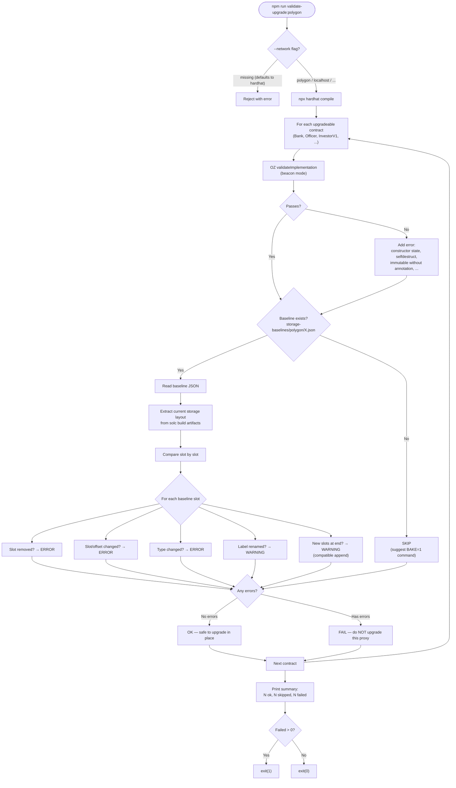
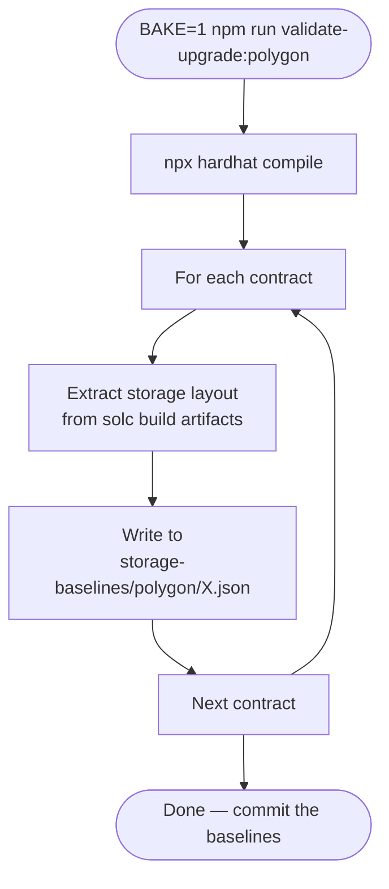
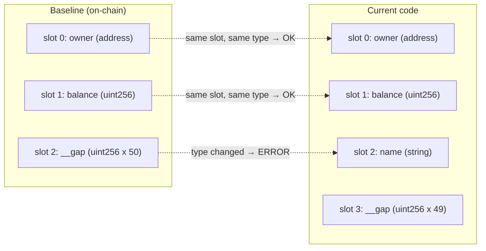

# validate-upgrade

Script that checks whether upgradeable contracts can be safely upgraded in place
on a given network, or whether a redeployment is required.

## How it works



## Bake mode

When `BAKE=1` is set, the script skips validation and instead **writes** the
current storage layout as the new baseline for that network.



## Storage layout comparison detail

The slot-by-slot comparison catches the most common upgrade-breaking changes:



In this example, inserting `name` at slot 2 pushed `__gap` down — the script
catches the type change at slot 2 and reports `FAIL`. The safe version would
consume one `__gap` slot and append `name` at the end.

## Commands

| Command                                              | Description                                      |
| ---------------------------------------------------- | ------------------------------------------------ |
| `npm run validate-upgrade:polygon`                   | Validate all contracts against polygon baselines |
| `npm run validate-upgrade:local`                     | Validate against localhost baselines             |
| `CONTRACT=X npm run validate-upgrade:polygon`        | Validate a single contract                       |
| `BAKE=1 npm run validate-upgrade:polygon`            | Bake all baselines for polygon                   |
| `BAKE=1 CONTRACT=X npm run validate-upgrade:polygon` | Bake one baseline                                |

## File structure

```
storage-baselines/
  polygon/
    Bank.json
    Officer.json
    InvestorV1.json
    ...
  localhost/
    Bank.json
    ...
```

Each JSON file contains the raw solc `storageLayout` output: the `storage` array
(list of slots with label, type, offset) and the `types` map. These files are
committed to git and serve as the source of truth for what is deployed on that
network.
