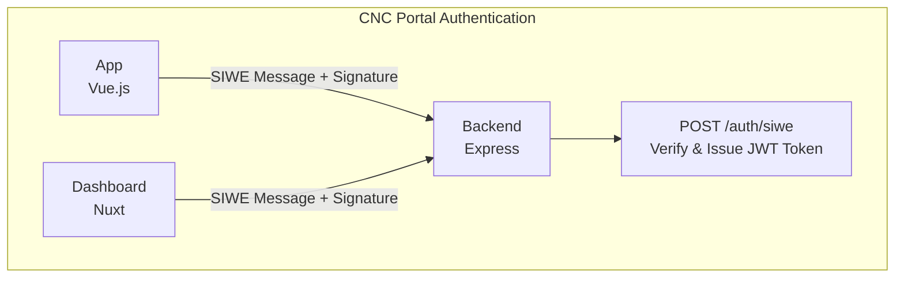
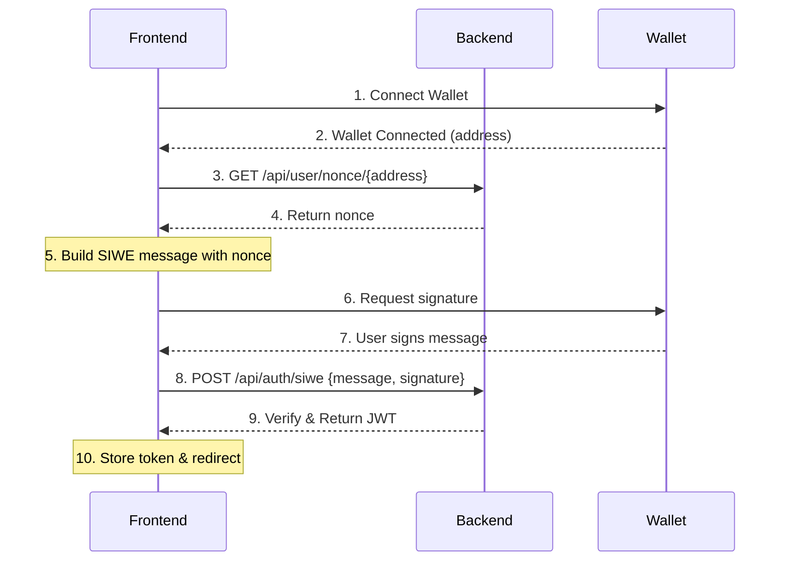

# CNC Portal Authentication

This documentation covers the authentication system used across the CNC Portal platform. All components use **Sign-In with Ethereum (SIWE)** for secure, wallet-based authentication.

## Overview

CNC Portal uses SIWE (EIP-4361) to authenticate users across all frontend applications. This approach allows users to prove ownership of their Ethereum wallet without exposing private keys, providing a secure and decentralized authentication mechanism.

## Architecture



## SIWE Authentication Flow

The authentication flow is the same for both the App and Dashboard:



## API Endpoints

The backend provides the following authentication endpoints:

| Endpoint | Method | Description |
|----------|--------|-------------|
| `/api/user/nonce/{address}` | GET | Get or create nonce for wallet address |
| `/api/auth/siwe` | POST | Authenticate with SIWE message and signature |
| `/api/auth/token` | GET | Validate existing JWT token |

### POST /api/auth/siwe

**Request Body:**
```json
{
  "message": "localhost wants you to sign in with your Ethereum account:\n0x...",
  "signature": "0x..."
}
```

**Response (Success):**
```json
{
  "accessToken": "eyJhbGciOiJIUzI1NiIsInR5cCI6IkpXVCJ9..."
}
```

## Security Features

1. **Nonce-based Protection** - Each authentication requires a fresh nonce, preventing replay attacks
2. **Wallet Signature** - Only the private key holder can produce a valid signature
3. **JWT Expiration** - Tokens expire after 24 hours
4. **Domain Binding** - SIWE messages include the domain to prevent phishing
5. **No Private Key Exposure** - Private keys never leave the user's wallet

## Detailed Documentation

- **[App Authentication](./app-authentication.md)** - Vue.js frontend authentication implementation
- **[Dashboard Authentication](./dashboard-authentication.md)** - Nuxt dashboard authentication implementation

## Quick Start

### For the App (Vue.js)

```typescript
import { useSiwe } from '@/composables/useSiwe'

const { siwe, isProcessing } = useSiwe()
await siwe() // Initiates the full SIWE flow
```

### For the Dashboard (Nuxt)

```typescript
const { useSiwe } = await import('~/composables/useSiwe')
const { signIn } = useSiwe()
await signIn() // Initiates the full SIWE flow
```

## Environment Configuration

### Backend
```env
SECRET_KEY=your-jwt-secret-key
```

### App (Vue.js)
```env
VITE_APP_BACKEND_URL=http://localhost:3000
```

### Dashboard (Nuxt)
```env
NUXT_PUBLIC_BACKEND_URL=http://localhost:3000
```
