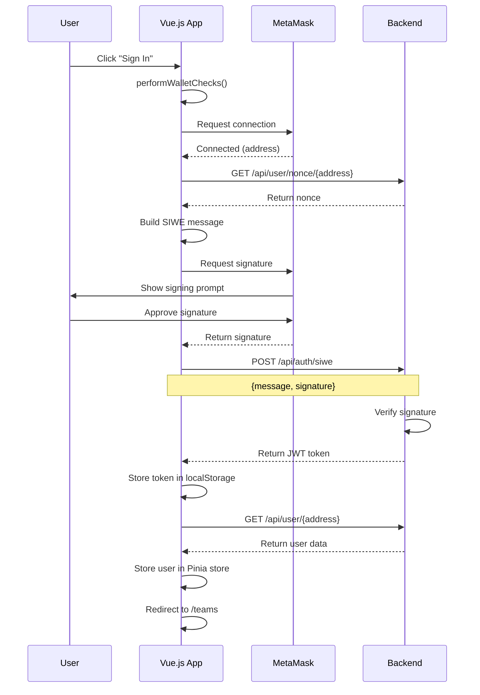
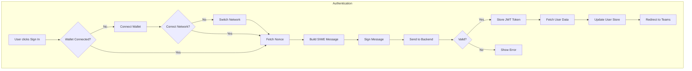
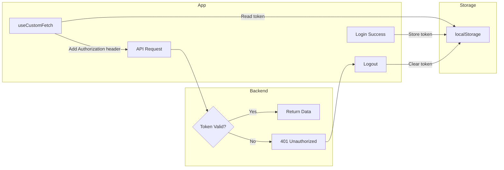

# App Authentication (Vue.js)

This document describes the SIWE authentication implementation in the CNC Portal main application (Vue.js frontend).

## Overview

The app uses SIWE (Sign-In with Ethereum) via the `useSiwe` composable to authenticate users. After successful authentication, the user is redirected to the teams page.

## Key Files

| File | Description |
|------|-------------|
| `app/src/composables/useSiwe.ts` | Core SIWE authentication logic |
| `app/src/composables/useCustomFetch.ts` | Authenticated HTTP requests |
| `app/src/stores/user.ts` | User data store |
| `app/src/constant/index.ts` | Backend URL configuration |

## Authentication Flow Diagram



## State Management Flow



## Authentication Flow

### 1. Initiate Sign-In

```typescript
import { useSiwe } from '@/composables/useSiwe'

const { siwe, isProcessing } = useSiwe()

// Call to start authentication
await siwe()
```

### 2. Wallet Checks

Before authentication, the app performs wallet checks using `useWalletChecks`:
- Verifies wallet is connected
- Ensures correct network is selected

### 3. Fetch Nonce

```typescript
const fetchNonceEndpoint = computed(() => `${BACKEND_URL}/api/user/nonce/${address.value}`)
await executeFetchUserNonce()
```

### 4. Build SIWE Message

```typescript
const siweMessage = new SiweMessage({
  address: address.value as string,
  statement: 'Sign in with Ethereum to the app.',
  nonce: nonce.value.nonce,
  chainId: chainId.value,
  uri: window.location.origin,
  domain: window.location.origin,
  version: '1'
})
authData.value.message = siweMessage.prepareMessage()
```

### 5. Sign Message

```typescript
await signMessageAsync({ message: authData.value.message })
authData.value.signature = signature.value
```

### 6. Authenticate with Backend

```typescript
await executeAddAuthData() // POST /api/auth/siwe
const token = siweData.value?.accessToken
```

### 7. Store Token & User Data

```typescript
// Store JWT token
const storageToken = useStorage('authToken', token)
storageToken.value = token

// Fetch and store user data
await executeFetchUser()
userDataStore.setUserData(
  userData.name,
  userData.address,
  userData.nonce,
  userData.imageUrl
)
userDataStore.setAuthStatus(true)

// Redirect to teams page
router.push('/teams')
```

## Token Management



### Storage

The JWT token is stored in localStorage under the key `authToken`:

```typescript
const storageToken = useStorage('authToken', token)
```

### Authenticated Requests

Use `useCustomFetch` for authenticated API calls:

```typescript
import { useCustomFetch } from '@/composables/useCustomFetch'

const { data, error, execute } = useCustomFetch('endpoint', { immediate: false })
  .get()
  .json()
```

The `useCustomFetch` composable automatically:
- Adds the `Authorization: Bearer <token>` header
- Handles 401 errors by logging out the user

### Token Validation

```typescript
import { useAuth } from '@/composables/useAuth'

const { validateToken } = useAuth()
const isValid = await validateToken()
```

## Logout

```typescript
import { useAuth } from '@/composables/useAuth'

const { logout } = useAuth()
logout() // Clears user data and redirects to login
```

## Error Handling

The composable handles various error scenarios:

| Error | Message |
|-------|---------|
| Nonce fetch failed | "Failed to fetch nonce" |
| User rejected signature | "Message sign rejected: You need to sign the message to Sign in the CNC Portal" |
| Signature failed | "Something went wrong: Unable to sign SIWE message" |
| Authentication failed | "Failed to get authentication token" |
| User data fetch failed | "Failed to fetch user data" |

## Environment Configuration

```env
VITE_APP_BACKEND_URL=http://localhost:3000
```

## Dependencies

- `siwe` - SIWE message parsing and construction
- `@wagmi/vue` - Wallet connection and signing
- `@vueuse/core` - Storage and fetch utilities
- `pinia` - State management

## Example Component Usage

```vue
<script setup lang="ts">
import { useSiwe } from '@/composables/useSiwe'

const { siwe, isProcessing } = useSiwe()

const handleLogin = async () => {
  await siwe()
}
</script>

<template>
  <button 
    @click="handleLogin" 
    :disabled="isProcessing"
  >
    {{ isProcessing ? 'Signing in...' : 'Sign in with Ethereum' }}
  </button>
</template>
```

## Related Documentation

- [Authentication Overview](./README.md)
- [Dashboard Authentication](./dashboard-authentication.md)
