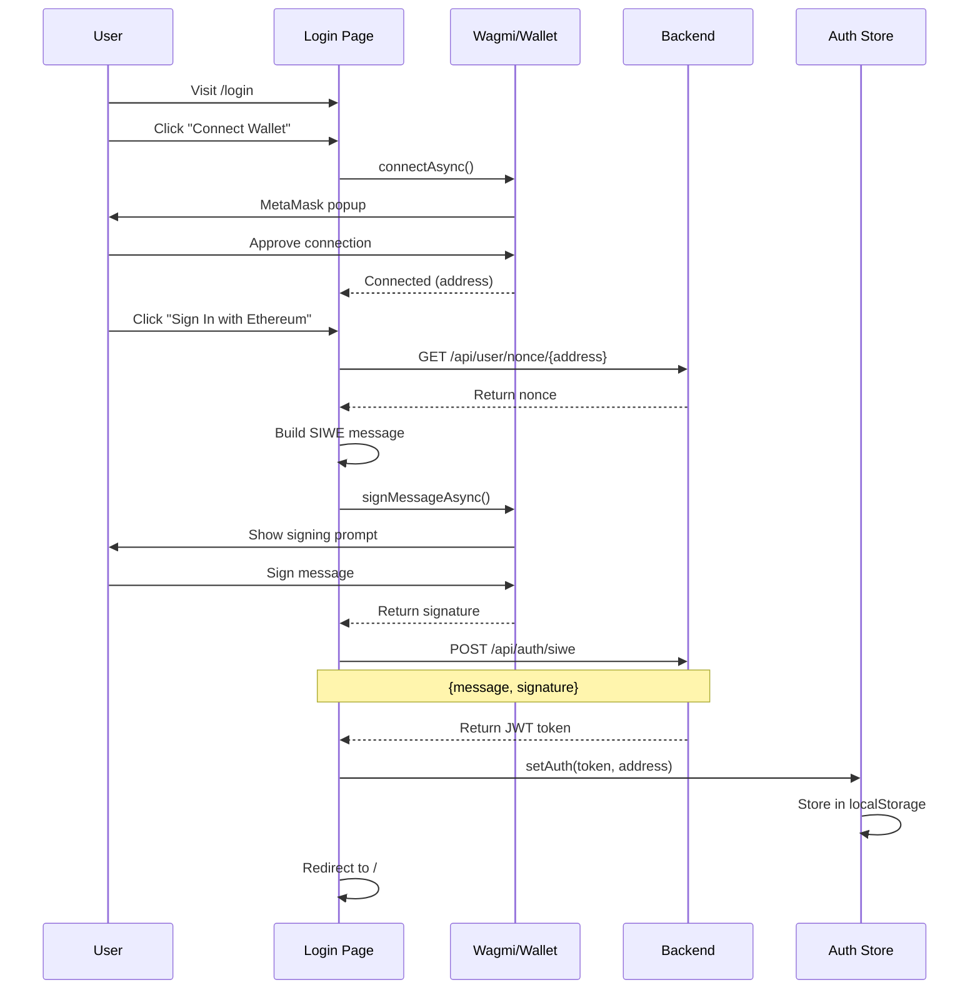
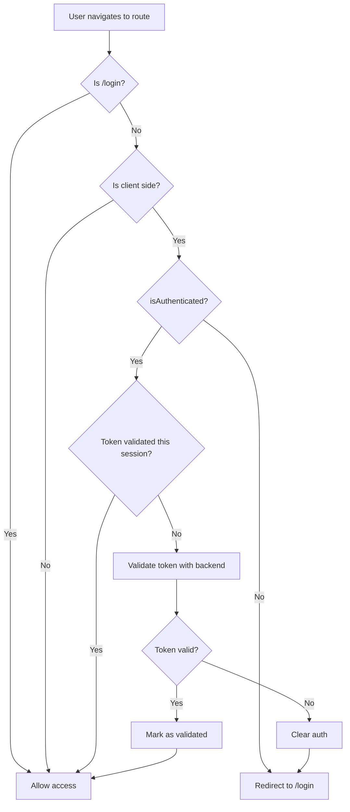
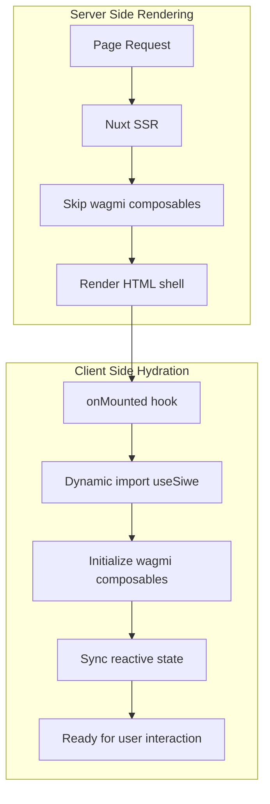
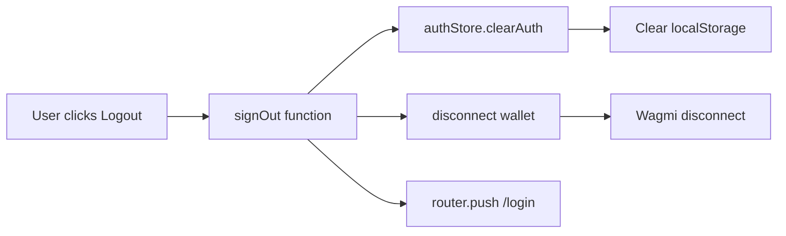

# Dashboard Authentication (Nuxt)

This document describes the SIWE authentication implementation in the CNC Portal Admin Dashboard (Nuxt frontend).

## Overview

The admin dashboard uses SIWE (Sign-In with Ethereum) to authenticate administrators. The implementation is SSR-compatible, with wagmi composables loaded only on the client side.

## Key Files

| File | Description |
|------|-------------|
| `dashboard/app/composables/useSiwe.ts` | Core SIWE authentication logic |
| `dashboard/app/stores/useAuthStore.ts` | Authentication state management |
| `dashboard/app/middleware/auth.global.ts` | Route protection middleware |
| `dashboard/app/pages/login.vue` | Login page UI |
| `dashboard/app/plugins/wagmi.client.ts` | Client-side wagmi setup |
| `dashboard/app/utils/wagmi.config.ts` | Wagmi chain configuration |

## Authentication Flow Diagram



## Route Protection Flow



## SSR Compatibility Flow



## Authentication Flow

### 1. Connect Wallet

```typescript
const { connect, connectors } = useConnect()
const injectedConnector = connectors.value.find(c => c.id === 'injected')
await connect({ connector: injectedConnector })
```

### 2. Fetch Nonce

```typescript
const fetchNonce = async (userAddress: string): Promise<string | null> => {
  const response = await fetch(`${backendUrl}/api/user/nonce/${userAddress}`)
  const data = await response.json()
  return data.nonce
}
```

### 3. Build SIWE Message

```typescript
const siweMessage = new SiweMessage({
  address: address.value,
  statement: 'Sign in to CNC Portal Admin Dashboard with Ethereum.',
  nonce,
  chainId: chainId.value,
  uri: window.location.origin,
  domain: window.location.host,
  version: '1'
})
const messageToSign = siweMessage.prepareMessage()
```

### 4. Sign Message

```typescript
const signature = await signMessageAsync({ message: messageToSign })
```

### 5. Authenticate with Backend

```typescript
const authenticateWithSiwe = async (message: string, signature: string) => {
  const response = await fetch(`${backendUrl}/api/auth/siwe`, {
    method: 'POST',
    headers: { 'Content-Type': 'application/json' },
    body: JSON.stringify({ message, signature })
  })
  const data = await response.json()
  return data.accessToken
}
```

### 6. Store Authentication

```typescript
authStore.setAuth(token, address.value)
```

## SSR Compatibility

The dashboard is built with Nuxt, which requires special handling for client-only code. The wagmi composables are loaded dynamically on the client side:

### Login Page

```typescript
// app/pages/login.vue
onMounted(async () => {
  const { useSiwe } = await import('~/composables/useSiwe')
  const siwe = useSiwe()
  // Use siwe functions
})
```

### UserMenu Component

```typescript
// app/components/UserMenu.vue
onMounted(async () => {
  const { useSiwe } = await import('~/composables/useSiwe')
  const siwe = useSiwe()
  signOutFn = siwe.signOut
})
```

## Route Protection

The `auth.global.ts` middleware protects all routes except `/login`:

```typescript
export default defineNuxtRouteMiddleware(async (to) => {
  if (to.path === '/login') return

  if (import.meta.client) {
    const authStore = useAuthStore()
    
    if (!authStore.isAuthenticated.value) {
      return navigateTo('/login')
    }

    // Validate token on initial load
    const hasValidatedToken = useState('hasValidatedToken', () => false)
    if (!hasValidatedToken.value) {
      hasValidatedToken.value = true
      const { useSiwe } = await import('~/composables/useSiwe')
      const { validateToken } = useSiwe()
      const isValid = await validateToken()
      if (!isValid) {
        authStore.clearAuth()
        return navigateTo('/login')
      }
    }
  }
})
```

## Authentication Store

The `useAuthStore` manages authentication state with localStorage persistence:

```typescript
const _useAuthStore = () => {
  const token = useLocalStorage<string | null>('dashboard-auth-token', null)
  const address = useLocalStorage<string | null>('dashboard-auth-address', null)

  const isAuthenticated = computed(() => !!token.value && !!address.value)

  const setAuth = (authToken: string, userAddress: string) => {
    token.value = authToken
    address.value = userAddress
  }

  const clearAuth = () => {
    token.value = null
    address.value = null
  }

  return { token, address, isAuthenticated, setAuth, clearAuth, getToken }
}

export const useAuthStore = createSharedComposable(_useAuthStore)
```

## Token Validation

The `validateToken` function checks if the stored token is still valid:

```typescript
const validateToken = async (): Promise<boolean> => {
  const token = authStore.getToken()
  if (!token) return false

  const response = await fetch(`${backendUrl}/api/auth/token`, {
    headers: { Authorization: `Bearer ${token}` }
  })

  if (!response.ok) {
    if (response.status === 401) {
      authStore.clearAuth() // Clear invalid token
    }
    return false
  }
  return true
}
```

## Logout



```typescript
const signOut = () => {
  authStore.clearAuth()
  disconnect() // Disconnect wallet
}

// In component
const handleLogout = () => {
  signOut()
  router.push('/login')
}
```

## Login Page UI

The login page provides:
- "Connect Wallet" button - Connects MetaMask or other injected wallet
- "Sign In with Ethereum" button - Appears after wallet connection
- Error display for failed authentication attempts
- Link to learn about SIWE

## Environment Configuration

```env
NUXT_PUBLIC_BACKEND_URL=http://localhost:3000
```

This is configured in `nuxt.config.ts`:

```typescript
export default defineNuxtConfig({
  runtimeConfig: {
    public: {
      backendUrl: process.env.NUXT_PUBLIC_BACKEND_URL || 'http://localhost:3000'
    }
  }
})
```

## Dependencies

- `siwe` - SIWE message parsing and construction
- `@wagmi/vue` - Wallet connection and signing
- `@tanstack/vue-query` - Query management for wagmi
- `viem` - Ethereum utilities
- `ethers` - Required peer dependency for siwe
- `@vueuse/core` - Storage utilities

## Error Handling

| Error | User Message |
|-------|--------------|
| Wallet not connected | "Please connect your wallet first" |
| Nonce fetch failed | "Failed to get nonce from server" |
| User rejected signature | "You rejected the signature request. Please sign to authenticate." |
| Signature failed | "Failed to sign message" |
| Authentication failed | "Authentication failed. Please try again." |

## Related Documentation

- [Authentication Overview](./README.md)
- [App Authentication](./app-authentication.md)
