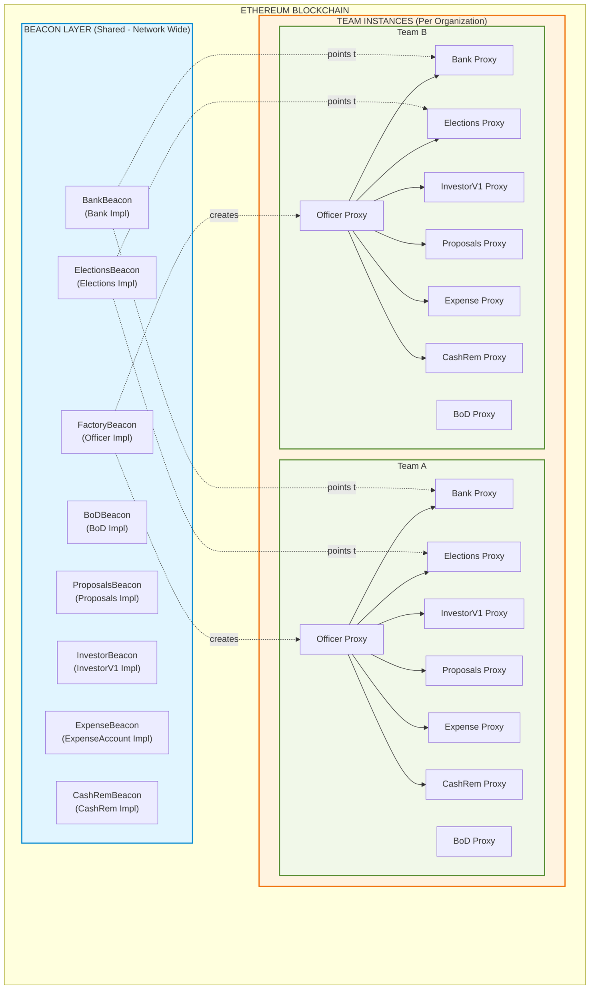
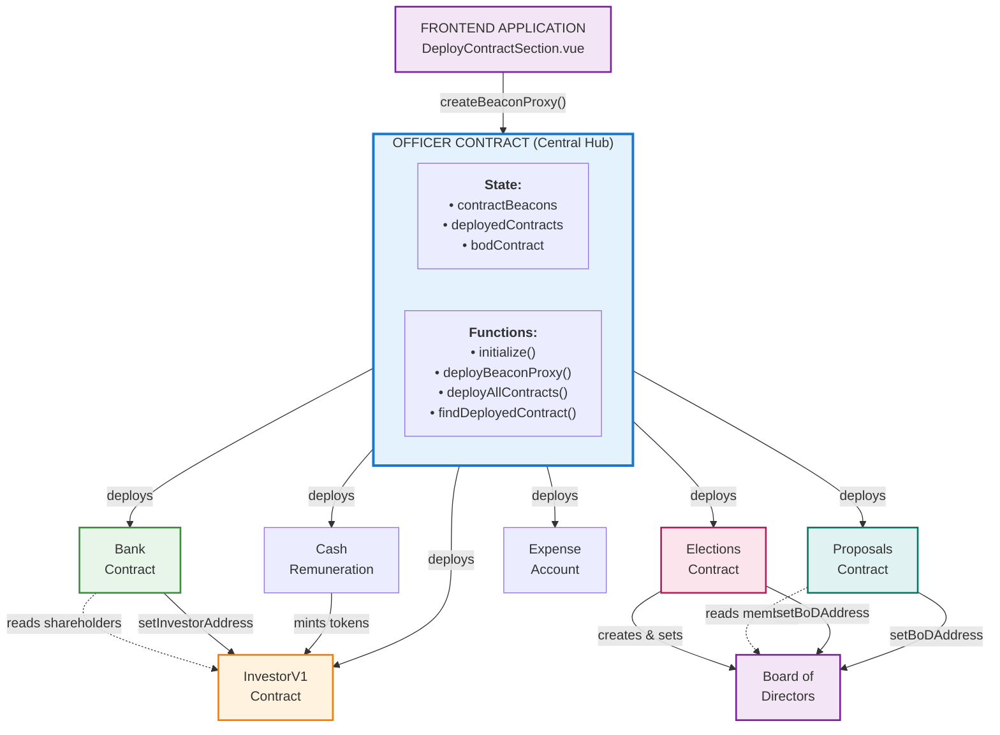
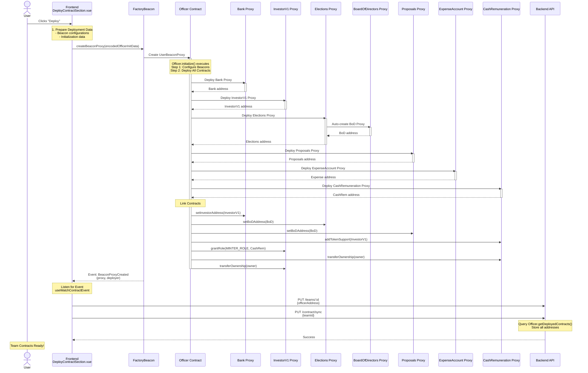
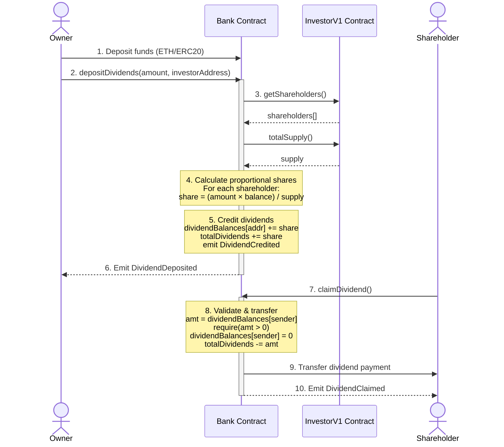
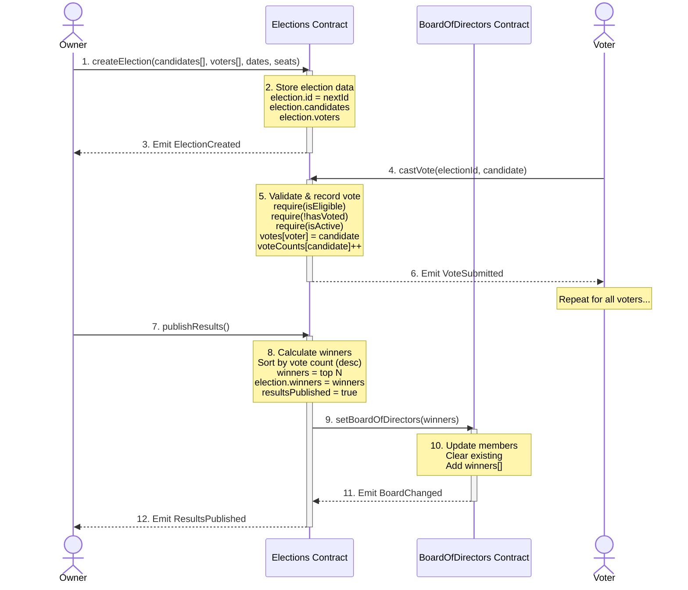
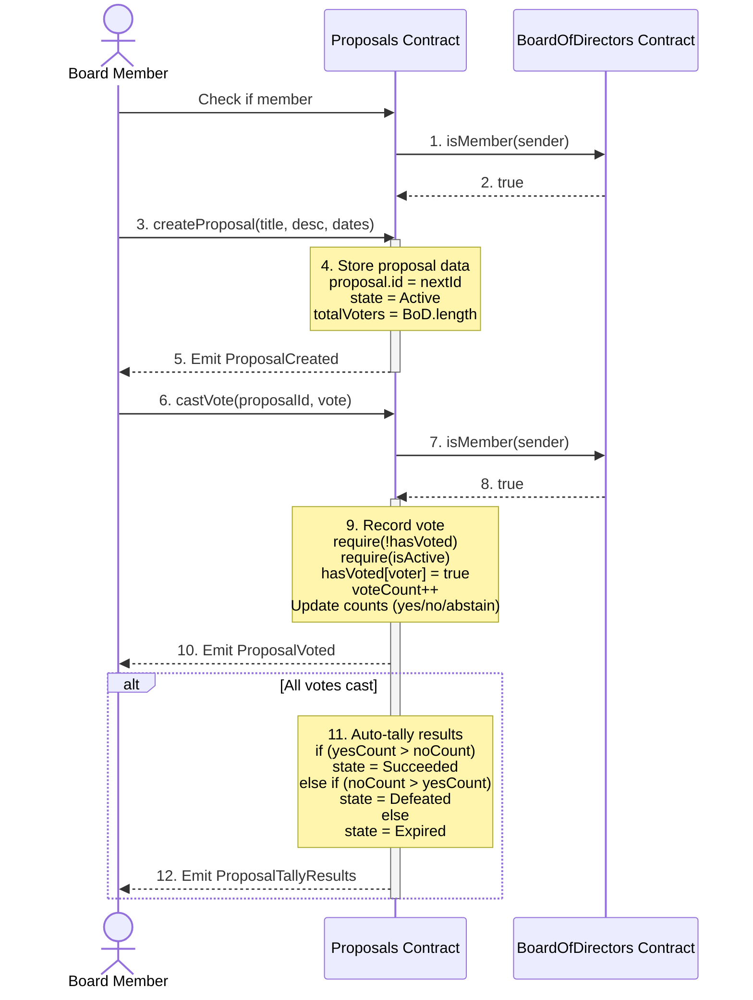
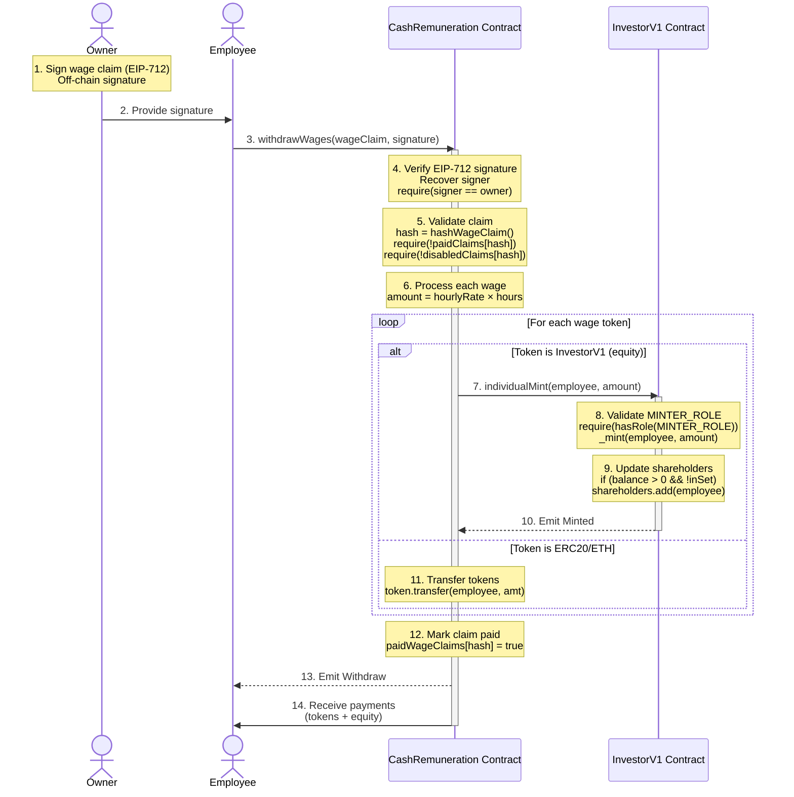

# CNC Portal - Smart Contracts Architecture Diagrams

## High-Level System Architecture



---

## Detailed Contract Interaction Map



### Legend:
- `deploys`: Officer creates contract instance
- `reads`: Contract queries data from another
- `sets`: Contract updates another contract's state
- `mints`: Contract has permission to mint tokens
- `creates`: Contract creates and initializes another

---

## Contract Deployment Sequence



---

## Data Flow: Dividend Distribution



---

## Data Flow: Board Election



---

## Data Flow: Proposal Voting



---

## Data Flow: Wage Payment with Equity



---

## Storage Layout (Upgradeable Contracts)

### Why Storage Layout Matters

When upgrading contracts via beacons, new implementations must maintain compatible storage layout:

```
OLD IMPLEMENTATION                NEW IMPLEMENTATION
┌─────────────────┐             ┌─────────────────┐
│ Slot 0: owner   │             │ Slot 0: owner   │  ✓ Same
│ Slot 1: paused  │             │ Slot 1: paused  │  ✓ Same
│ Slot 2: counter │             │ Slot 2: counter │  ✓ Same
│                 │             │ Slot 3: newVar  │  ✓ New slot OK
└─────────────────┘             └─────────────────┘

WRONG UPGRADE                    RIGHT UPGRADE
┌─────────────────┐             ┌─────────────────┐
│ Slot 0: owner   │             │ Slot 0: owner   │
│ Slot 1: newVar  │  ✗ Changed! │ Slot 1: paused  │
│ Slot 2: paused  │             │ Slot 2: counter │
│ Slot 3: counter │             │ Slot 3: newVar  │
└─────────────────┘             └─────────────────┘
```

### Storage Gaps

All upgradeable contracts include storage gaps for future variables:

```solidity
contract InvestorV1 {
    // Existing storage
    EnumerableSet.AddressSet private shareholders;  // Slot 0-N
    
    // Storage gap (reserves 50 slots)
    uint256[50] private __gap;                      // For future use
}
```

This allows adding new variables in future upgrades without breaking existing data.

---

*Document Version: 1.0*  
*Last Updated: November 23, 2024*  
*Maintained by: CNC Portal Team*
