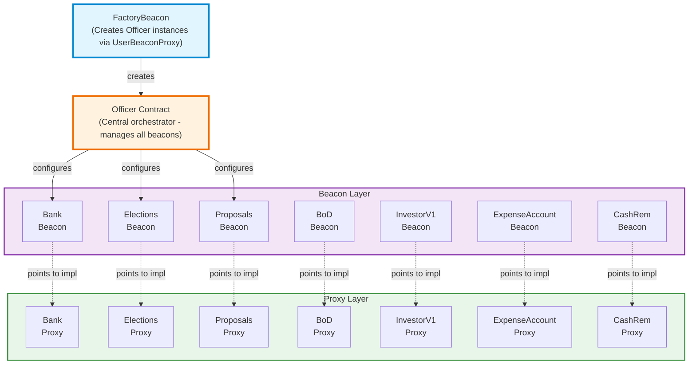
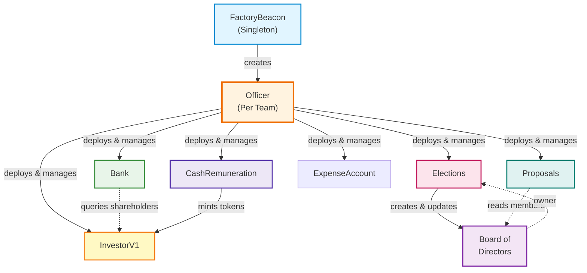

# CNC Portal - Smart Contracts Technical Architecture

## Table of Contents
1. [Overview](#overview)
2. [Architecture Pattern](#architecture-pattern)
3. [Core Contracts](#core-contracts)
4. [Contract Relationships](#contract-relationships)
5. [Deployment Flow](#deployment-flow)
6. [Data Flow](#data-flow)
7. [User Stories](#user-stories)
8. [Technical Details](#technical-details)

---

## Overview

The CNC Portal smart contract system is a comprehensive organizational governance and financial management platform built on Ethereum. It enables decentralized teams to manage:
- **Financial Operations**: Banking, dividends, expense accounts, and cash remuneration
- **Governance**: Elections, proposals, and board of directors management
- **Equity**: Investor token management with shareholder tracking
- **Upgradability**: Beacon proxy pattern for seamless contract upgrades

### Key Design Principles
- **Upgradability**: All contracts use the Beacon Proxy pattern for future-proof upgrades
- **Modularity**: Each contract handles a specific domain concern
- **Security**: OpenZeppelin's battle-tested upgradeable contracts
- **Governance**: Multi-signature approval and voting mechanisms

---

## Architecture Pattern

### Beacon Proxy Pattern

The system uses the **Beacon Proxy Pattern** for upgradeability:



**Benefits:**
1. **Shared Implementation**: Multiple proxies point to single implementation
2. **Upgradable**: Update implementation without changing proxy addresses
3. **Gas Efficient**: Deployment of new instances is cheaper
4. **Centralized Management**: Officer contract manages all beacons

---

## Core Contracts

### 1. Officer Contract
**Path**: `/contract/contracts/Officer.sol`

**Purpose**: Central orchestrator and factory for all organizational contracts.

**Key Responsibilities**:
- Manages beacon configurations for all contract types
- Deploys contract instances via beacon proxies
- Orchestrates contract initialization and linking
- Tracks deployed contracts per organization
- Handles cross-contract permission setup

**Key Functions**:
```solidity
// Configure a beacon for a contract type
function configureBeacon(string contractType, address beaconAddress)

// Deploy a single contract via beacon proxy
function deployBeaconProxy(string contractType, bytes initializerData) → address

// Deploy all contracts at once
function deployAllContracts(DeploymentData[] deployments) → address[]

// Find deployed contract by type
function findDeployedContract(string contractType) → address
```

**State Variables**:
- `contractBeacons`: Mapping of contract type → beacon address
- `deployedContracts`: Array of deployed contract info (type + address)
- `bodContract`: Reference to BoardOfDirectors contract

**Special Logic**:
- Elections automatically deploys BoardOfDirectors when created
- Bank and InvestorV1 are auto-linked when both exist
- CashRemuneration gets permissions on InvestorV1 token

---

### 2. Bank Contract
**Path**: `/contract/contracts/Bank.sol`

**Purpose**: Treasury management and dividend distribution system.

**Key Responsibilities**:
- Manages organizational funds (ETH and ERC20 tokens)
- Distributes dividends to shareholders proportionally
- Separates locked (dividend) vs unlocked funds
- Integrates with InvestorV1 for shareholder data

**Key Functions**:
```solidity
// Deposit dividends and allocate to shareholders
function depositDividends(uint256 amount, address investorAddress)
function depositTokenDividends(address token, uint256 amount, address investorAddress)

// Shareholders claim their dividends
function claimDividend()
function claimTokenDividend(address token)

// Transfer unlocked funds (owner only)
function transfer(address to, uint256 amount)
function transferToken(address token, address to, uint256 amount)

// Set investor contract reference
function setInvestorAddress(address investorAddress)
```

**Key Concepts**:
- **Locked Balance**: Dividends allocated but not yet claimed
- **Unlocked Balance**: Available for owner transfers
- **Proportional Distribution**: Based on shareholdings from InvestorV1

**Integration Points**:
- **InvestorV1**: Gets shareholder list and token balances
- **Officer**: Automatically linked during deployment

---

### 3. InvestorV1 Contract
**Path**: `/contract/contracts/Investor/InvestorV1.sol`

**Purpose**: ERC20 token representing organizational equity/shares.

**Key Responsibilities**:
- Mints equity tokens to shareholders
- Tracks all shareholders automatically
- Provides shareholder data to Bank for dividends
- Role-based minting (MINTER_ROLE)

**Key Functions**:
```solidity
// Mint tokens to multiple shareholders (owner only)
function distributeMint(Shareholder[] shareholders)

// Mint tokens to individual (MINTER_ROLE)
function individualMint(address shareholder, uint256 amount)

// Get all current shareholders with balances
function getShareholders() → Shareholder[]
```

**Key Features**:
- **Auto-tracking**: Shareholders automatically added/removed on transfers
- **Role-based Access**: CashRemuneration gets MINTER_ROLE for wage payments
- **Dividend Integration**: Automatic ETH dividend distribution on receive

**Integration Points**:
- **Bank**: Provides shareholder data for dividend distribution
- **CashRemuneration**: Granted MINTER_ROLE to mint tokens as payment
- **Officer**: Configured during deployment

---

### 4. Elections Contract
**Path**: `/contract/contracts/Elections/Elections.sol`

**Purpose**: Democratic election system for Board of Directors.

**Key Responsibilities**:
- Create elections with candidates and eligible voters
- Handle vote casting with eligibility checks
- Calculate election results automatically
- Update BoardOfDirectors with winners

**Key Functions**:
```solidity
// Create new election (owner only)
function createElection(
    string title,
    string description, 
    uint256 startDate,
    uint256 endDate,
    uint256 seatCount,
    address[] candidates,
    address[] eligibleVoters
) → uint256 electionId

// Cast a vote (eligible voters only)
function castVote(uint256 electionId, address candidate)

// Publish results and update BoD (owner only)
function publishResults(uint256 electionId)

// Get election results
function getElectionResults(uint256 electionId) → address[]
```

**Key Concepts**:
- **Seat Count**: Must be odd number for tie-breaking
- **Eligible Voters**: Pre-defined list of addresses who can vote
- **Result Calculation**: Sorts candidates by vote count
- **Automatic BoD Update**: Winners become board members

**Special Logic**:
- Only one election can be ongoing at a time
- Elections contract automatically creates BoardOfDirectors proxy on first deployment
- Results are published after voting ends or all voters have voted

**Integration Points**:
- **BoardOfDirectors**: Created automatically, updated with winners
- **Officer**: Special deployment logic creates BoD when Elections deploys

---

### 5. BoardOfDirectors Contract
**Path**: `/contract/contracts/BoardOfDirectors.sol`

**Purpose**: Multi-signature governance and action approval system.

**Key Responsibilities**:
- Manages board members (set by Elections)
- Creates actions requiring approval
- Majority voting on actions
- Executes approved actions automatically

**Key Functions**:
```solidity
// Add action requiring approval (board members only)
function addAction(address target, string description, bytes data) → uint256

// Approve an action (board members only)
function approve(uint256 actionId)

// Revoke approval (board members only)
function revoke(uint256 actionId)

// Set board members (owner only - Elections contract)
function setBoardOfDirectors(address[] boardMembers)
```

**Key Concepts**:
- **Actions**: Encoded function calls to be executed
- **Majority Approval**: Requires > 50% board approval
- **Auto-execution**: Executes when majority reached
- **Self-governance**: Can modify its own owners through actions

**Integration Points**:
- **Elections**: Sets board members after election
- **Proposals**: Uses board members for proposal voting
- **Officer**: Deployed automatically with Elections

---

### 6. Proposals Contract
**Path**: `/contract/contracts/Proposals/Proposals.sol`

**Purpose**: Formal proposal voting system for board decisions.

**Key Responsibilities**:
- Create proposals with descriptions and voting periods
- Board member voting (Yes/No/Abstain)
- Automatic result calculation
- Track proposal lifecycle

**Key Functions**:
```solidity
// Create proposal (board members only)
function createProposal(
    string title,
    string description,
    string proposalType,
    uint256 startDate,
    uint256 endDate
) → uint256

// Cast vote (board members only)
function castVote(uint256 proposalId, VoteOption vote)

// Tally results (board members only, auto after all votes)
function tallyResults(uint256 proposalId)
```

**Proposal States**:
- `Active`: Currently accepting votes
- `Succeeded`: Yes votes > No votes
- `Defeated`: No votes > Yes votes  
- `Expired`: Tie or inconclusive

**Integration Points**:
- **BoardOfDirectors**: Gets board member list for voting
- **Officer**: Linked to BoD contract during deployment

---

### 7. ExpenseAccountEIP712 Contract
**Path**: `/contract/contracts/expense-account/ExpenseAccountEIP712.sol`

**Purpose**: EIP-712 signed expense approval and payment system.

**Key Responsibilities**:
- Process expense payments with owner signatures
- Enforce budget constraints via EIP-712
- Support multiple tokens
- Track expense history

**Key Functions**:
```solidity
// Submit expense with budget signature
function submitExpense(
    address payable recipient,
    uint256 amount,
    BudgetLimit budgetLimit,
    bytes signature
)

// Support/remove tokens
function addTokenSupport(address token)
function removeTokenSupport(address token)
```

**Budget Types**:
- `TransactionsPerPeriod`: Limit number of transactions
- `AmountPerPeriod`: Limit total amount per period
- `AmountPerTransaction`: Limit per-transaction amount

**Key Concepts**:
- **EIP-712 Signatures**: Off-chain approval by owner
- **Budget Enforcement**: On-chain validation of constraints
- **Token Support**: Multiple ERC20 tokens + ETH

---

### 8. CashRemunerationEIP712 Contract
**Path**: `/contract/contracts/CashRemunerationEIP712.sol`

**Purpose**: Wage payment system with EIP-712 signatures.

**Key Responsibilities**:
- Process wage claims with owner approval
- Calculate payments from hours × hourly rate
- Support multiple token payments simultaneously
- Mint InvestorV1 tokens as part of compensation

**Key Functions**:
```solidity
// Withdraw wages with signature
function withdrawWages(
    WageClaim wageClaim,
    bytes signature
)

// Enable/disable wage claims
function enableWageClaim(WageClaim wageClaim)
function disableWageClaim(bytes32 signatureHash)
```

**Key Concepts**:
- **Multi-token Wages**: Pay in multiple tokens in one transaction
- **Token Minting**: Can mint InvestorV1 tokens as equity compensation
- **Signature Expiry**: Claims include timestamp to prevent replay
- **Claim Tracking**: Prevents double-payment of same claim

**Integration Points**:
- **InvestorV1**: Granted MINTER_ROLE to mint equity tokens
- **Officer**: Sets up permissions during deployment

---

## Contract Relationships

### Dependency Graph



### Key Relationships

#### 1. Officer ↔ All Contracts
- **Direction**: Officer → Others
- **Type**: Factory/Registry
- **Purpose**: Officer creates and tracks all contracts
- **Data**: Beacon addresses, deployed contract addresses

#### 2. Elections → BoardOfDirectors
- **Direction**: Elections → BoD (creates, updates)
- **Type**: Creator/Updater
- **Purpose**: Elections creates BoD and updates membership
- **Data**: Winner addresses become board members

#### 3. BoardOfDirectors ↔ Proposals
- **Direction**: Proposals → BoD (reads)
- **Type**: Read-only integration
- **Purpose**: Proposals checks board membership for voting
- **Data**: Board member addresses

#### 4. Bank ↔ InvestorV1
- **Direction**: Bank → InvestorV1 (reads)
- **Type**: Read-only integration
- **Purpose**: Bank gets shareholder data for dividends
- **Data**: Shareholder addresses and token balances

#### 5. InvestorV1 ↔ CashRemuneration
- **Direction**: CashRemuneration → InvestorV1 (writes)
- **Type**: Minter integration
- **Purpose**: CashRemuneration mints equity tokens as wages
- **Data**: Minting transactions via MINTER_ROLE

#### 6. ExpenseAccountEIP712 (Independent)
- **Direction**: None
- **Type**: Standalone
- **Purpose**: Expense management independent of other contracts
- **Data**: Budget signatures, expense history

---

## Deployment Flow

### Phase 1: Beacon Deployment (One-time, Network-wide)

These are deployed once per network and shared across all teams:

```
1. Deploy Implementation Contracts
   ├─ Officer.sol
   ├─ Bank.sol
   ├─ Elections.sol
   ├─ BoardOfDirectors.sol
   ├─ Proposals.sol
   ├─ InvestorV1.sol
   ├─ ExpenseAccountEIP712.sol
   └─ CashRemunerationEIP712.sol

2. Deploy Beacon Contracts (pointing to implementations)
   ├─ Beacon(Officer) → FactoryBeacon
   ├─ Beacon(Bank)
   ├─ Beacon(Elections)
   ├─ Beacon(BoardOfDirectors)
   ├─ Beacon(Proposals)
   ├─ Beacon(InvestorV1)
   ├─ Beacon(ExpenseAccountEIP712)
   └─ Beacon(CashRemunerationEIP712)
```

**Code**: `/contract/ignition/modules/*BeaconModule.ts`

### Phase 2: Team Instance Deployment

Each team deploys their own set of contract instances:

```
1. User Clicks "Deploy Contracts" in Frontend
   └─ Triggers: DeployContractSection.vue

2. Frontend Calls FactoryBeacon.createBeaconProxy()
   ├─ Parameters:
   │  ├─ Beacon configurations (all contract types)
   │  └─ Deployment data (initialization parameters)
   │
   └─ FactoryBeacon creates UserBeaconProxy(Officer)

3. Officer.initialize() Executes
   ├─ Configures all beacons
   ├─ If _isDeployAllContracts == true:
   │  └─ Calls deployAllContracts()
   └─ Sets up cross-contract permissions

4. Officer.deployAllContracts() Deploys:
   ├─ Bank Proxy
   ├─ InvestorV1 Proxy  
   ├─ Elections Proxy
   │  └─ Auto-creates BoardOfDirectors Proxy
   ├─ Proposals Proxy
   ├─ ExpenseAccountEIP712 Proxy
   └─ CashRemunerationEIP712 Proxy

5. Officer Links Contracts
   ├─ Bank.setInvestorAddress(InvestorV1)
   ├─ Elections.setBoardOfDirectorsContractAddress(BoD)
   ├─ Proposals.setBoardOfDirectorsContractAddress(BoD)
   ├─ CashRemuneration.addTokenSupport(InvestorV1)
   ├─ InvestorV1.grantRole(MINTER_ROLE, CashRemuneration)
   └─ Transfer ownership to team owner
```

### Phase 3: Post-Deployment

```
1. BeaconProxyCreated Event Emitted
   └─ Contains: proxy address, deployer address

2. Frontend Listens for Event
   └─ Confirms deployer matches current user

3. Backend Updated
   ├─ Store officerAddress in teams table
   └─ Sync all contract addresses via /contract/sync

4. Team Can Now Use All Contracts
```

### Deployment Code Locations

| Component | Path |
|-----------|------|
| Beacon Modules | `/contract/ignition/modules/*BeaconModule.ts` |
| Officer Module | `/contract/ignition/modules/OfficerModule.ts` |
| Frontend Deploy | `/app/src/components/sections/TeamView/forms/DeployContractSection.vue` |
| Constants | `/app/src/constant.ts` |

---

## Data Flow

### 1. Dividend Distribution Flow

```
Owner → Bank.depositDividends(amount, investorAddress)
         │
         ├─> Bank.allocateDividends(amount, investorAddress)
         │    │
         │    ├─> InvestorV1.getShareholders() 
         │    │   └─> Returns: [Shareholder{address, amount}]
         │    │
         │    └─> Calculate proportional dividends
         │         └─> Credit dividendBalances[shareholder]
         │
Shareholder → Bank.claimDividend()
              │
              └─> Transfer dividend amount to shareholder
```

**Data Accessed**:
- Bank reads: `InvestorV1.getShareholders()`, `InvestorV1.totalSupply()`
- Bank writes: `dividendBalances[address]`, `totalDividends`

### 2. Election Flow

```
Owner → Elections.createElection(...)
        │
        ├─> Store election data
        └─> Emit ElectionCreated

Voters → Elections.castVote(electionId, candidate)
         │
         ├─> Validate eligibility
         ├─> Record vote
         └─> Increment vote counts

Owner/Auto → Elections.publishResults(electionId)
             │
             ├─> Calculate winners (top N by votes)
             │
             └─> BoardOfDirectors.setBoardOfDirectors(winners)
                 │
                 └─> Update board member list
```

**Data Accessed**:
- Elections writes: Voter choices, vote counts
- BoardOfDirectors writes: Board member list
- Proposals reads: Board member list

### 3. Proposal Voting Flow

```
Board Member → Proposals.createProposal(...)
               │
               ├─> BoardOfDirectors.isMember(sender) ✓
               │
               └─> Store proposal data

Board Members → Proposals.castVote(proposalId, vote)
                │
                ├─> BoardOfDirectors.isMember(sender) ✓
                ├─> Record vote
                ├─> Update counts (yes/no/abstain)
                │
                └─> If all voted → tallyResults()
                    │
                    └─> Set proposal state (Succeeded/Defeated/Expired)
```

**Data Accessed**:
- Proposals reads: `BoardOfDirectors.isMember()`, `BoardOfDirectors.getBoardOfDirectors()`
- Proposals writes: Proposal votes, counts, state

### 4. Wage Payment Flow

```
Employee → CashRemuneration.withdrawWages(wageClaim, signature)
           │
           ├─> Verify EIP-712 signature from owner ✓
           │
           ├─> Validate claim not already paid
           │
           ├─> For each wage in wageClaim:
           │    ├─> If token == InvestorV1:
           │    │   └─> InvestorV1.individualMint(employee, amount)
           │    │       └─> Mints equity tokens to employee
           │    │
           │    └─> Else:
           │        └─> Transfer ERC20/ETH to employee
           │
           └─> Mark claim as paid
```

**Data Accessed**:
- CashRemuneration reads: `paidWageClaims[hash]`
- CashRemuneration writes: Transfers tokens, updates claim status
- InvestorV1 writes: Mints tokens (via MINTER_ROLE)

### 5. Expense Payment Flow

```
Employee → ExpenseAccount.submitExpense(recipient, amount, budgetLimit, signature)
           │
           ├─> Verify EIP-712 signature from owner ✓
           │
           ├─> Validate budget constraints:
           │    ├─> TransactionsPerPeriod: Count < limit?
           │    ├─> AmountPerPeriod: Total < limit?
           │    └─> AmountPerTransaction: Amount < limit?
           │
           ├─> Update usage tracking
           │
           └─> Transfer funds to recipient
```

**Data Accessed**:
- ExpenseAccount reads: Budget signatures, usage data
- ExpenseAccount writes: Usage tracking, transfers

---

## User Stories

### For Team Owners

**US-1: Deploy Team Contracts**
```
As a team owner
I want to deploy all necessary smart contracts with one click
So that I can quickly set up my organization's infrastructure

Acceptance Criteria:
- ✓ Single transaction deploys all 8 contracts
- ✓ Contracts are automatically linked together
- ✓ Owner receives appropriate permissions
- ✓ Contract addresses stored in database
```

**US-2: Manage Organization Funds**
```
As a team owner
I want to deposit and manage organizational funds
So that I can pay expenses and distribute dividends

Acceptance Criteria:
- ✓ Deposit ETH and supported ERC20 tokens to Bank
- ✓ Transfer funds to vendors/contractors
- ✓ View locked (dividend) vs unlocked balances
- ✓ Allocate dividends to shareholders
```

**US-3: Create Elections**
```
As a team owner
I want to create elections for board positions
So that we can democratically select leadership

Acceptance Criteria:
- ✓ Define election parameters (dates, seat count)
- ✓ Specify candidates and eligible voters
- ✓ Enforce odd seat count for tie-breaking
- ✓ One election at a time limit
```

**US-4: Approve Wages & Expenses**
```
As a team owner
I want to approve wages and expenses off-chain
So that employees can withdraw approved amounts

Acceptance Criteria:
- ✓ Sign wage claims with EIP-712
- ✓ Set budget constraints for expenses
- ✓ Approve multiple tokens in single claim
- ✓ Include equity (InvestorV1) tokens as compensation
```

---

### For Board Members

**US-5: Create Proposals**
```
As a board member
I want to create proposals for team decisions
So that we can vote on important matters

Acceptance Criteria:
- ✓ Create proposal with title and description
- ✓ Set voting period
- ✓ Only board members can create proposals
- ✓ Proposal automatically opens for voting
```

**US-6: Vote on Proposals**
```
As a board member
I want to vote Yes/No/Abstain on proposals
So that I can participate in governance

Acceptance Criteria:
- ✓ Cast vote during voting period
- ✓ Cannot vote twice
- ✓ Results auto-calculated after all votes
- ✓ View proposal status and vote counts
```

**US-7: Approve Multi-sig Actions**
```
As a board member
I want to approve important contract actions
So that critical operations require majority consent

Acceptance Criteria:
- ✓ Create actions with target and encoded data
- ✓ Approve/revoke approval on actions
- ✓ Auto-execute when majority reached
- ✓ View action approval status
```

---

### For Shareholders/Investors

**US-8: Receive Dividends**
```
As a shareholder
I want to automatically receive dividend allocations
So that I can benefit from company profits

Acceptance Criteria:
- ✓ Dividends allocated proportionally to holdings
- ✓ Support ETH and ERC20 token dividends
- ✓ Claim dividends at any time
- ✓ Track unclaimed dividend balance
```

**US-9: Participate in Elections**
```
As an eligible voter
I want to vote in board elections
So that I can influence organizational leadership

Acceptance Criteria:
- ✓ Vote for one candidate per election
- ✓ Vote only during election period
- ✓ Cannot vote twice in same election
- ✓ Results published after voting ends
```

**US-10: Trade Equity Tokens**
```
As a shareholder
I want to transfer my equity tokens
So that I can sell or gift my stake

Acceptance Criteria:
- ✓ Transfer InvestorV1 tokens to another address
- ✓ Recipient automatically tracked as shareholder
- ✓ Dividend allocation updated on next distribution
- ✓ Zero-balance holders removed from shareholder list
```

---

### For Employees

**US-11: Submit Wage Claims**
```
As an employee
I want to submit signed wage claims
So that I can receive payment for hours worked

Acceptance Criteria:
- ✓ Submit owner-signed wage claim
- ✓ Receive payment in multiple tokens
- ✓ Receive equity tokens as part of compensation
- ✓ Cannot resubmit same claim
```

**US-12: Submit Expenses**
```
As an employee
I want to submit approved expenses
So that I can get reimbursed for work-related costs

Acceptance Criteria:
- ✓ Submit expense with budget signature
- ✓ System enforces budget constraints
- ✓ Support multiple token types
- ✓ Automatic payment on valid submission
```

---

## Technical Details

### Access Control Patterns

#### 1. Ownable Pattern
**Contracts**: Officer, Bank, Elections, Proposals, ExpenseAccount, CashRemuneration

```solidity
// OpenZeppelin OwnableUpgradeable
modifier onlyOwner() {
    require(owner() == msg.sender, "Ownable: caller is not the owner");
    _;
}
```

**Use Cases**:
- Configure critical settings
- Deploy new contract instances
- Pause/unpause operations

#### 2. Role-Based Access (AccessControl)
**Contracts**: InvestorV1

```solidity
bytes32 public constant MINTER_ROLE = keccak256("MINTER_ROLE");

modifier onlyRole(bytes32 role) {
    require(hasRole(role, msg.sender), "AccessControl: unauthorized");
    _;
}
```

**Roles**:
- `DEFAULT_ADMIN_ROLE`: Full admin privileges
- `MINTER_ROLE`: Can mint InvestorV1 tokens (granted to CashRemuneration)

#### 3. Board Member Check
**Contracts**: BoardOfDirectors, Proposals

```solidity
modifier onlyBoardOfDirectors() {
    require(
        boardOfDirectors.contains(msg.sender),
        "Only board of directors can call"
    );
    _;
}
```

**Use Cases**:
- Create/vote on proposals
- Approve multi-sig actions

#### 4. Self-Only Pattern
**Contracts**: BoardOfDirectors

```solidity
modifier onlySelf() {
    require(msg.sender == address(this), "Only self can call");
    _;
}
```

**Use Cases**:
- Modify owners through approved multi-sig actions

---

### Upgradeability Mechanism

#### Beacon Contract Structure
```solidity
// Beacon stores implementation address
contract Beacon is UpgradeableBeacon {
    address public implementation;
    
    function upgradeTo(address newImplementation) external onlyOwner {
        implementation = newImplementation;
    }
}

// Proxy delegates to beacon's implementation
contract UserBeaconProxy {
    constructor(address beacon, bytes memory data) {
        // Initialize with beacon address
        // Call initialize on implementation
    }
    
    fallback() external payable {
        address impl = Beacon(beacon).implementation();
        // Delegatecall to implementation
    }
}
```

#### Upgrade Process
1. Deploy new implementation contract
2. Call `Beacon.upgradeTo(newImplementation)`
3. All existing proxies automatically use new logic
4. No data migration needed (storage layout compatible)

**Upgrade Modules**: `/contract/ignition/modules/*UpgradeModule.ts`

---

### Security Features

#### 1. Reentrancy Protection
All state-changing functions use ReentrancyGuard:
```solidity
function claimDividend() external nonReentrant {
    // Checks
    uint256 amt = dividendBalances[msg.sender];
    require(amt > 0);
    
    // Effects
    dividendBalances[msg.sender] = 0;
    totalDividends -= amt;
    
    // Interactions
    payable(msg.sender).call{value: amt}("");
}
```

#### 2. Pausable Operations
Contracts can be paused in emergencies:
```solidity
function pause() external onlyOwner {
    _pause();
}

function someFunction() external whenNotPaused {
    // Function logic
}
```

#### 3. EIP-712 Signatures
Off-chain approvals with typed data:
```solidity
// Domain separator ensures signatures unique per chain/contract
bytes32 domainSeparator = keccak256(
    abi.encode(
        keccak256("EIP712Domain(string name,string version,uint256 chainId,address verifyingContract)"),
        keccak256(bytes(name)),
        keccak256(bytes(version)),
        chainId,
        address(this)
    )
);

// Typed data ensures clear signing UX
bytes32 structHash = keccak256(
    abi.encode(
        WAGE_CLAIM_TYPEHASH,
        wageClaim.employeeAddress,
        wageClaim.hoursWorked,
        wagesHash,
        wageClaim.date
    )
);

// Verify signature
address signer = ECDSA.recover(digest, signature);
require(signer == owner(), "Invalid signature");
```

#### 4. Input Validation
Comprehensive validation throughout:
```solidity
// Elections.sol
require(startDate > block.timestamp, "Start date must be in future");
require(endDate > startDate, "End date must be after start");
require(seatCount > 0 && seatCount % 2 == 1, "Seat count must be odd");
require(candidates.length >= seatCount, "Not enough candidates");
```

---

### Gas Optimization Techniques

#### 1. Storage Optimization
```solidity
// Pack multiple values in single slot
struct Proposal {
    uint256 id;              // Slot 1
    uint256 startDate;       // Slot 2
    uint256 endDate;         // Slot 3
    uint8 yesCount;          // \
    uint8 noCount;           //  } Slot 4 (packed)
    uint8 abstainCount;      // /
    bool isExecuted;         // /
}
```

#### 2. Batch Operations
```solidity
// Deploy all contracts in single transaction
function deployAllContracts(DeploymentData[] calldata deployments)

// Mint to multiple shareholders at once
function distributeMint(Shareholder[] memory shareholders)
```

#### 3. Events Over Storage
Events for historical data, storage for current state:
```solidity
// Store only current state
mapping(address => uint256) public dividendBalances;

// Historical record via events
event DividendCredited(address indexed account, uint256 amount);
event DividendClaimed(address indexed account, uint256 amount);
```

---

### Testing Strategy

#### Contract Tests Location
- `/contract/test/`
- Using Hardhat + TypeScript

#### Test Categories

**1. Unit Tests**
- Individual contract functions
- Access control checks
- Input validation
- State changes

**2. Integration Tests**
- Cross-contract interactions
- Deployment flows
- Data synchronization

**3. Upgrade Tests**
- Storage layout compatibility
- Beacon proxy upgrades
- Data persistence

**4. Security Tests**
- Reentrancy attempts
- Signature replay attacks
- Authorization bypasses

---

## Deployment Checklist

### Pre-Deployment
- [ ] Deploy all implementation contracts
- [ ] Deploy all beacon contracts pointing to implementations
- [ ] Deploy FactoryBeacon pointing to Officer implementation
- [ ] Verify all contract source code on blockchain explorer
- [ ] Store beacon addresses in frontend constants
- [ ] Configure supported token addresses (USDC, USDT, etc.)

### Team Deployment
- [ ] User creates team in database
- [ ] Frontend calls FactoryBeacon.createBeaconProxy()
- [ ] Wait for BeaconProxyCreated event
- [ ] Store Officer proxy address in database
- [ ] Call backend `/contract/sync` to retrieve all contract addresses
- [ ] Verify all contracts deployed correctly

### Post-Deployment
- [ ] Test basic operations (deposit, transfer)
- [ ] Create test election
- [ ] Create test proposal
- [ ] Submit test expense
- [ ] Submit test wage claim
- [ ] Verify all integrations working

---

## Troubleshooting Guide

### Issue: Contract Deployment Fails

**Symptoms**: Transaction reverts during deployment

**Possible Causes**:
1. Beacon not configured for contract type
2. Invalid initialization parameters
3. Insufficient gas
4. BeaconProxy creation failed

**Solutions**:
```solidity
// Check beacon configured
address beaconAddr = officer.contractBeacons("Bank");
require(beaconAddr != address(0), "Beacon not configured");

// Validate init data
require(initializerData.length > 0, "Missing initializer");

// Increase gas limit in transaction
```

### Issue: Dividend Distribution Incorrect

**Symptoms**: Shareholders receive wrong amounts

**Possible Causes**:
1. InvestorV1 address not set in Bank
2. Shareholder balances changed between allocation and claim
3. Rounding errors in division

**Solutions**:
```solidity
// Verify investor address set
require(investorAddress != address(0), "Investor not set");

// Check shareholder data
IInvestorView.Shareholder[] memory holders = investor.getShareholders();
uint256 supply = investor.totalSupply();

// Last shareholder gets remainder to handle rounding
if (i == shareholderCount - 1) {
    share = remaining; // Exact sum
}
```

### Issue: Elections Results Wrong

**Symptoms**: Wrong candidates become board members

**Possible Causes**:
1. Tie-breaking not deterministic
2. Vote count calculation error
3. Results published before all votes

**Solutions**:
```solidity
// Ensure deterministic tie-breaking
if (allCandidates[j].voteCount == allCandidates[j + 1].voteCount &&
    allCandidates[j].candidateAddress > allCandidates[j + 1].candidateAddress) {
    // Swap - lower address wins in ties
}

// Wait for all votes or end date
require(
    election.voteCount == election.voterList.length ||
    block.timestamp > election.endDate,
    "Results not ready"
);
```

### Issue: Wage Claim Rejected

**Symptoms**: Transaction reverts on withdrawWages()

**Possible Causes**:
1. Invalid EIP-712 signature
2. Claim already paid
3. Claim disabled
4. Insufficient contract balance

**Solutions**:
```solidity
// Verify signature matches owner
address signer = ECDSA.recover(digest, signature);
require(signer == owner(), "Invalid signature");

// Check claim not paid
bytes32 claimHash = hashWageClaim(wageClaim);
require(!paidWageClaims[claimHash], "Already paid");

// Verify sufficient balance
for (uint256 i = 0; i < wages.length; i++) {
    uint256 amount = (wages[i].hourlyRate * hoursWorked);
    if (wages[i].tokenAddress == address(0)) {
        require(address(this).balance >= amount, "Insufficient ETH");
    } else {
        require(
            IERC20(wages[i].tokenAddress).balanceOf(address(this)) >= amount,
            "Insufficient token balance"
        );
    }
}
```

---

## Appendix

### Contract Addresses (Example - Replace with Actual)

#### Mainnet
```
FactoryBeacon:           0x... (TBD)
BankBeacon:              0x... (TBD)
ElectionsBeacon:         0x... (TBD)
ProposalsBeacon:         0x... (TBD)
BoardOfDirectorsBeacon:  0x... (TBD)
InvestorV1Beacon:        0x... (TBD)
ExpenseAccountBeacon:    0x... (TBD)
CashRemunerationBeacon:  0x... (TBD)
```

### External Dependencies

| Dependency | Purpose | Version |
|------------|---------|---------|
| OpenZeppelin Upgradeable | Base contracts, security | v5.0+ |
| OpenZeppelin Contracts | ERC20, utilities | v5.0+ |
| Hardhat | Development framework | Latest |
| Ethers.js | Blockchain interaction | v6.x |

### Useful Links

- **Repository**: https://github.com/globe-and-citizen/cnc-portal
- **OpenZeppelin Docs**: https://docs.openzeppelin.com/contracts
- **EIP-712**: https://eips.ethereum.org/EIPS/eip-712
- **Beacon Proxy Pattern**: https://docs.openzeppelin.com/contracts/api/proxy#beacon

---

## Glossary

| Term | Definition |
|------|------------|
| **Beacon** | Contract storing implementation address for proxies |
| **Proxy** | Contract delegating calls to implementation via beacon |
| **Implementation** | Contract containing actual logic (not called directly) |
| **BoD** | Board of Directors |
| **EIP-712** | Ethereum standard for typed structured data signing |
| **Dividend** | Profit distribution to shareholders proportionally |
| **Shareholder** | Holder of InvestorV1 equity tokens |
| **Action** | Multi-sig proposal requiring board approval |
| **Proposal** | Formal decision requiring board voting |
| **Election** | Democratic selection of board members |
| **Wage Claim** | Employee request for hour-based payment |
| **Expense** | Reimbursement request with budget constraints |
| **MINTER_ROLE** | AccessControl role allowing token minting |

---

*Document Version: 1.0*  
*Last Updated: November 23, 2024*  
*Maintained by: CNC Portal Team*
