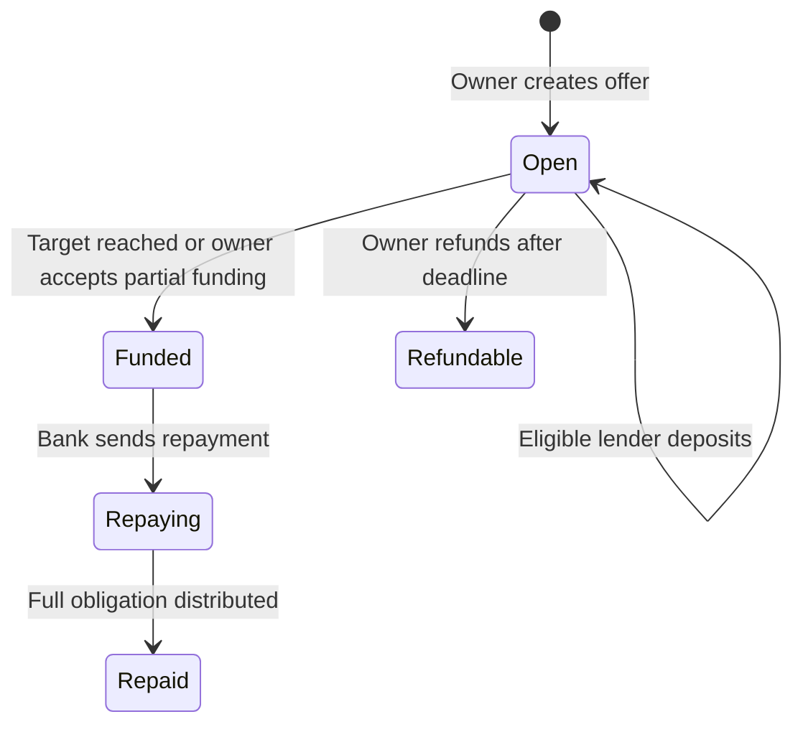

# Contract: FixedReturn

**Contract File:** `contract/contracts/FixedReturn.sol`

**Last verified:** 2026-09-23

FixedReturn owns the on-chain lending-offer lifecycle used by Community Credit. Product terminology, routes, and human validation remain in
[Community Credit](../../../features/community-credit/README.md).

## Lifecycle

## Contract Invariants

- Only the owner creates offers, maintains supported tokens, refunds an underfunded offer, or accepts partial funding.
- Deposits require an open offer, a positive amount, remaining target capacity, and the configured general cap or restricted allocation.
- Reaching the target transfers the complete funded principal to the company Bank.
- Refund and partial acceptance are mutually exclusive resolutions after an underfunded deadline.
- Repayment enters through the configured Bank, never directly from the FixedReturn owner, and distributes cumulative proportional lender
  entitlement without retaining final rounding dust.
- Offer lender enumeration lists each depositor once, even after repeated deposits.

## Failure and Scale Boundaries

- Invalid owners, tokens, dates, caps, duplicate whitelist addresses, and insufficient fully capped allocations revert.
- Refund, partial acceptance, deposit, and repayment reject incompatible lifecycle states and repeated finalization.
- The payout gas benchmark protects the supported fan-out size against the configured block gas limit.
- Beacon tests own proxy initialization, ownership, state preservation, and upgrade authorization rather than product acceptance.

## Implementation Evidence

**Implementation evidence reviewed against:** `272d6bd8d455cf09e681192f3b9c6c284b63b4fa`

- [FixedReturn contract](../../../../contract/contracts/FixedReturn.sol) and
  [contract behavior tests](../../../../contract/test/FixedReturn.spec.ts)
- [Payout gas benchmark](../../../../contract/test/FixedReturnPayoutGasBenchmark.spec.ts)
- [FixedReturn beacon tests](../../../../contract/test/FixedReturnBeacon.spec.ts)

## Related Documentation

- [Community Credit](../../../features/community-credit/README.md)
- [Contract Infrastructure](../infrastructure/README.md)
