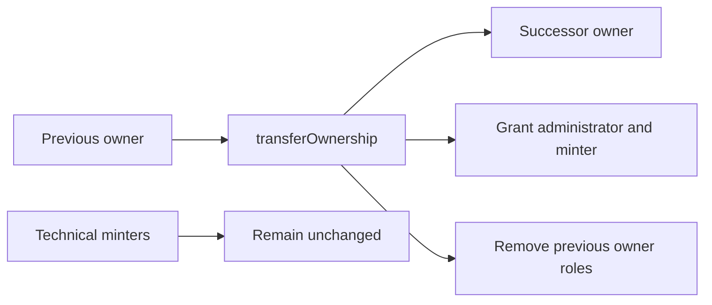

# Contract: Investor

**Responsibility:** Maintain the current share-token register, control issuance, distribute funded dividends, and receive shareholder
migration claims. **Contract:** [`Investor.sol`](../../../../contract/contracts/Investor/Investor.sol) **Upgradeable:** Yes (Beacon)
**Current implementation version:** `2.0.1` **Last verified:** 2026-09-27

This document describes the current Investor line. [`InvestorV1`](../investor-v1/README.md) remains a historical contract reference and does
not own current Investor behaviour.

## Authority Model

| Authority                | Capability                                                                       |
| ------------------------ | -------------------------------------------------------------------------------- |
| Owner                    | Bulk issuance, migration root and closure, pause control, and ownership transfer |
| `DEFAULT_ADMIN_ROLE`     | Grant and revoke AccessControl roles                                             |
| `MINTER_ROLE`            | Individual share-token issuance                                                  |
| Bank resolved by Officer | Trigger funded native-token or ERC-20 dividend distribution                      |

The current owner must always hold both human-control roles. `transferOwnership` grants `DEFAULT_ADMIN_ROLE` and `MINTER_ROLE` to the
successor, transfers ownership, then removes those roles from the previous owner. Technical minters not involved in the ownership transfer
remain authorized. Ownership renunciation and removal of either required role from the current owner revert.

## Officer Deployment Boundary

Investor initially grants ownership and both authority roles to the deploying Officer proxy. During suite setup, Officer grants the required
technical minters, then calls Investor ownership transfer. The transfer leaves the company owner as owner, administrator, and minter while
removing Officer's temporary administrator and minter roles.

The currently configured technical minting relationships are:

- Cash Remuneration for share-denominated payroll claims;
- Safe Deposit Router for investment-backed issuance;
- Vesting for released share grants.

## Operational Rules

- `individualMint` requires `MINTER_ROLE`; portal controls read that role directly before enabling either individual-issuance entry point.
- `distributeMint`, migration configuration, pause control, and migration settlement remain owner-only.
- Transfers, minting, and burning are blocked while Investor is paused.
- Shareholders are tracked from non-zero balances through the ERC-20 update hook.
- Dividend distribution is Bank-only and remains frozen while a committed shareholder migration is incomplete.
- Role-holder enumeration is reconstructed from `RoleGranted` and `RoleRevoked` events and verified against current `hasRole` reads because
  OpenZeppelin AccessControl is not enumerable.

## Upgrade Boundary

Version `2.0.1` changes logic only and adds no storage. Production upgrade validation must still pass against the deployed baseline before
an implementation upgrade is proposed. This change does not update upgrade baselines and does not deploy or upgrade a live proxy.

## Implementation Evidence

**Implementation evidence reviewed against:** `90b8aa77b592db8175e328d59c7d711c614f66f2`

- [Current Investor implementation](../../../../contract/contracts/Investor/Investor.sol)
- [Officer permission setup](../../../../contract/contracts/Officer.sol)
- [Investor authority tests](../../../../contract/test/Investor.spec.ts)
- [Officer deployment tests](../../../../contract/test/Officer.spec.ts)
- [Generated client ABI](../../../../app/src/artifacts/abi/generated.ts)
- [Investor permission query](../../../../app/src/queries/investorPermissions.queries.ts)

## Related Documentation

- [Shareholder Management](../../../features/shareholder-management/README.md)
- [Contract Management](../../../features/contract-management/README.md)
- [Shareholder migration flow](../shareholder-migration-flow.md)
- [Officer contract behaviour](../officer/README.md)

_[← Back to contract behaviour index](../README.md)_
