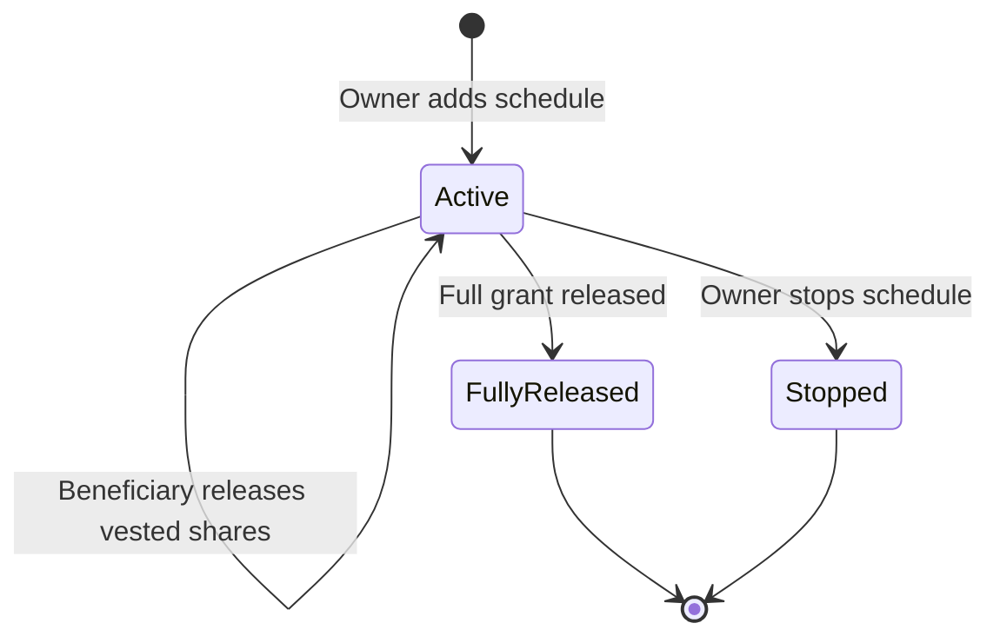

# Contract: Vesting

**Purpose:** Record per-team share grants, accrue them linearly, and mint only the vested shares. **Contract version:** `2.0.0`
**Upgradeable:** Yes (Beacon) **Last updated:** 2026-08-21

The product acceptance criteria live in the [Vesting user stories](../../../features/vesting/README.md). This document describes the current
contract behaviour that supports them.

## Model

- The Officer deploys one Vesting proxy per team and transfers ownership to the team owner.
- A schedule is an agreement; creation neither transfers nor locks tokens.
- The current Investor share contract is resolved through the Officer when shares must be minted.
- One beneficiary may have several schedules. Each schedule keeps its array index permanently.
- Stopping a schedule sets `active` to `false`; it does not delete or move the schedule.



## Write Behaviour

| Function                                             | Caller      | Observable result                                      |
| ---------------------------------------------------- | ----------- | ------------------------------------------------------ |
| `addVesting(member, start, duration, cliff, amount)` | Owner       | Appends an active schedule; mints nothing              |
| `release(index)`                                     | Beneficiary | Mints the selected schedule's current releasable share |
| `stopVesting(member, index)`                         | Owner       | Mints the releasable share and stops future accrual    |
| `pause()` / `unpause()`                              | Owner       | Blocks or restores schedule writes                     |

Every write is blocked while paused. `release` and `stopVesting` are non-reentrant, update schedule state before minting, and target one
schedule by index.

## Accrual Rules

For a schedule with allocation `A`, start `S`, cliff duration `C`, total duration `D`, and current timestamp `T`:

```text
T < S + C        => vested = 0
T >= S + D       => vested = A
otherwise        => vested = A * (T - S) / D
releasable       => vested - released
```

The cliff blocks release but does not shift the linear accrual origin. At the cliff boundary, the amount accrued since the start becomes
releasable.

Stopping before the cliff mints nothing. Stopping after the cliff mints the current releasable amount and drops the unvested remainder.

## Read Behaviour

- `vestedAmount(member, index)` returns the current vested amount for an active schedule.
- `releasable(member, index)` returns vested shares not already minted.
- `getVestingsWithMembers()` returns parallel member, index, and schedule arrays for active schedules.
- `getAllArchivedVestingsFlat()` returns the same shape for stopped schedules.
- `getVestings(member)` and `getVestingCount(member)` expose the append-only schedule history.
- `version()` returns `2.0.0`.

For a stopped schedule, `vestedAmount` returns zero because accrual has ended. Its stored `released` amount is the final settlement, and
`totalAmount - released` is the cancelled remainder.

## Access and Minting Preconditions

- Only the owner can create, stop, pause, or unpause schedules.
- Only the beneficiary can call `release` for their schedule index.
- The beneficiary must be non-zero and the cliff cannot exceed the duration.
- Release reverts when nothing is currently releasable.
- The Officer must resolve the current Investor contract.
- Vesting must hold the Investor minter role before a settlement can mint shares.

## Implementation Evidence

- [Vesting contract](../../../../contract/contracts/Vesting.sol)
- [Vesting interface](../../../../contract/contracts/interfaces/IVesting.sol)
- [Contract behaviour tests](../../../../contract/test/Vesting.spec.ts)
- [Frontend user stories](../../../features/vesting/README.md)
- [Frontend schedule model](../../../../app/src/utils/vesting/schedule.ts)

_[← Back to contract behaviour index](../README.md)_
