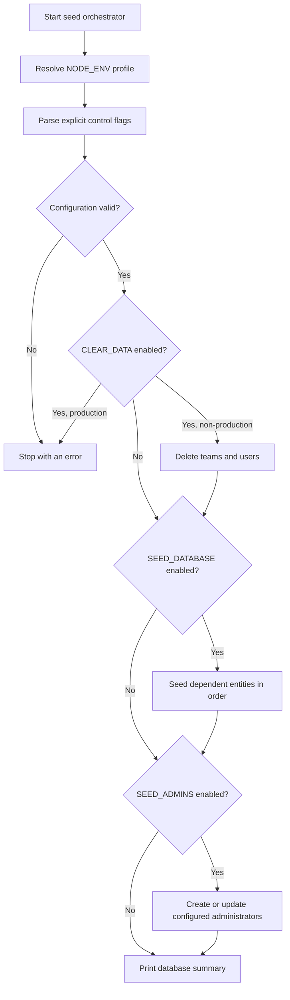
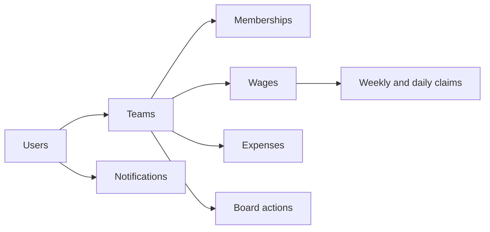

# Database Seeding

**Scope:** Developer and operational tooling for controlled Prisma seed execution

**Last verified:** 2026-08-21

Database seeding is not a user-accessible product feature. This guide owns the current execution
flags and safety boundaries implemented by the backend seed orchestrator.

## Current Invocation Model

Run commands from `backend/`. Selecting an environment does not enable data creation by itself;
`SEED_DATABASE=true` is required for entity seeding.

```bash
# Development profile
SEED_DATABASE=true npm run seed:dev

# Test profile
SEED_DATABASE=true npm run seed:test

# Staging profile
SEED_DATABASE=true npm run seed:staging

# Add configured administrator roles without generating product data
SEED_ADMINS=true \
ADMIN_ADDRESSES="<comma-separated-wallet-addresses>" \
ADMIN_ROLES="<matching-comma-separated-roles>" \
npm run seed
```

The valid administrator roles are `ROLE_ADMIN` and `ROLE_SUPER_ADMIN`. Address and role lists must
contain the same number of entries.

## Execution Flow



## Safety Boundaries

- `CLEAR_DATA=true` is rejected when `NODE_ENV=production`.
- Production execution requires `SEED_DATABASE=true` or `SEED_ADMINS=true`.
- Data and administrator seeding are independently controlled.
- Administrator seeding validates every wallet address and role before assignment.
- The production volume profile contains zero generated entities; explicit enablement alone does not
  define production data.
- `seed:reset` invokes a forced Prisma migration reset and then runs the seed script without setting
  `SEED_DATABASE=true`; treat it as destructive tooling and do not assume it repopulates data.

## Entity Dependency Order



The current orchestrator calls users, teams, wages, claims, expenses, board actions, and
notifications. Team contract records are not called directly by the current `seed.ts` entry point.

## Preserved Historical References

The following files preserve the December 2025 documentation snapshot. Their commands, metrics,
completion claims, and file counts have not been revalidated against the current implementation; use
this README and current source for operational decisions.

- [Legacy quick start](./QUICK_START.md)
- [Legacy functional specification](./functional-specification.md)
- [Legacy implementation summary](./IMPLEMENTATION_SUMMARY.md)

## Implementation Evidence

- [Seed orchestrator](../../../backend/prisma/seed.ts)
- [Environment profiles](../../../backend/prisma/seeders/config.ts)
- [Administrator seeder](../../../backend/prisma/seeders/admin.ts)
- [Backend scripts](../../../backend/package.json)

## Related Documentation

- [Development Guide](../README.md)
- [Architectural Capability Inventory](../../implementation/README.md)
