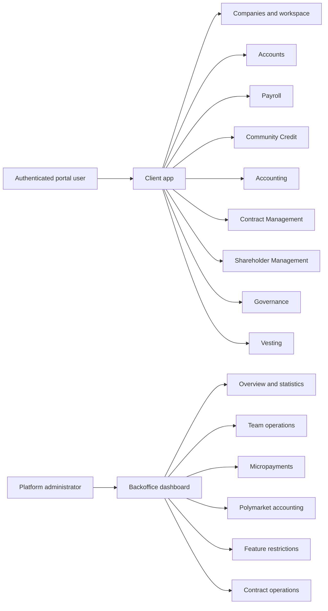

# Product Feature Inventory

**Status:** Navigation-derived inventory

**Last verified:** 2026-08-24

This inventory names the product capabilities that a user can currently reach in the CNC Portal client or its administrator dashboard. It is
derived from the current navigation, routes, access guards, and linked product actions. The presence of a source directory, API, contract,
or standalone route does not make something a product feature.

Documentation coverage is recorded separately from product access. A missing or legacy document does not mean that the corresponding product
surface is absent, and a document does not prove that the feature has passed human review.

## Client Features

The client inventory follows the [sidebar navigation](../../app/src/composables/useSidebarNavItems.ts), its linked
[routes](../../app/src/router/index.ts), and the authentication entry journey.

| User capability         | Current entry points                                    | Documentation coverage                                  |
| ----------------------- | ------------------------------------------------------- | ------------------------------------------------------- |
| Authentication          | `/login` and wallet session actions                     | [Canonical stories](./authentication/README.md)         |
| Companies and workspace | `/teams`, `/teams/:id`                                  | [Canonical stories](./companies/README.md)              |
| Accounts                | Bank, Safe, and Expense Account routes                  | [Canonical stories](./accounts/README.md)               |
| Payroll                 | Payroll account, history, company payroll, compensation | [Canonical stories](./payroll/README.md)                |
| Community Credit        | Rounds, new credit calls, and round details             | [Canonical stories](./community-credit/README.md)       |
| Accounting              | Summary, income, balance, trial balance, and ledger     | [Canonical stories](./accounting/README.md)             |
| Contract Management     | `/teams/:id/contract-management`                        | [Canonical stories](./contract-management/README.md)    |
| Shareholder Management  | `/teams/:id/sher-token`                                 | [Canonical stories](./shareholder-management/README.md) |
| Governance              | Board elections, election details, and proposals        | Canonical stories not yet written                       |
| Vesting                 | `/teams/:id/vesting`                                    | [Canonical stories](./vesting/README.md)                |

## Backoffice Features

All administrator-dashboard capabilities are grouped under [`docs/features/backoffice/`](./backoffice/README.md). They are not separate
top-level product features.

| Administrator capability | Current entry points                        | Documentation coverage                                           |
| ------------------------ | ------------------------------------------- | ---------------------------------------------------------------- |
| Overview and statistics  | `/`                                         | [Canonical stories](./backoffice/statistics/README.md)           |
| Team operations          | `/teams`, `/teams/:id`                      | Canonical stories not yet written                                |
| Micropayments            | `/micropayments`                            | Canonical stories not yet written                                |
| Polymarket accounting    | `/accounting`                               | Canonical stories not yet written                                |
| Feature restrictions     | `/features`, `/features/:id`                | [Canonical stories](./backoffice/feature-restrictions/README.md) |
| Contract operations      | `/contracts/history`, `/contracts/versions` | Canonical stories not yet written                                |

## Excluded from the Product Inventory

- Smart-contract packages and contract-specific documentation describe implementation behaviour under `docs/contracts/`; they are not portal
  features by themselves.
- RBAC and runtime wake-up are architectural capabilities under `docs/implementation/`. Database seeding is development tooling. None is a
  direct user goal.
- Login guards, access-denied pages, error pages, and development playgrounds are journey states or tooling, not standalone features.
- The dashboard's customer, inbox, profile, notification, and member-settings screens still use template or static fixture data. They are
  not CNC Portal features until a real product journey exposes them.
- The dashboard `/contracts` landing page is a placeholder. The implemented history and Officer version-sync journeys are grouped as
  Contract operations.
- The dashboard `/stats` route duplicates the statistics already exposed at `/` but is not linked from the current navigation. It does not
  define another capability.

## Updating This Inventory

Follow the [Feature Documentation Guide](../platform/feature-specification-guide.md#feature-eligibility-and-grouping). Verify current
navigation, linked routes, access guards, and meaningful user actions before adding, renaming, regrouping, or retiring a capability.
