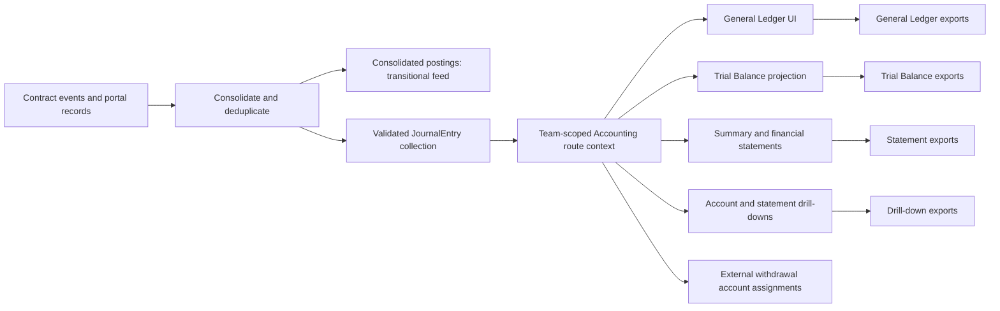

# Accounting — User Stories

**Scope:** The complete company Accounting journey exposed by the portal

**Last reviewed:** Not yet reviewed

These acceptance criteria follow the
[feature documentation review contract](../../platform/feature-specification-guide.md#human-review-contract).

## Product Model

- Accounting presents one consolidated set of double-entry books for the company across its money-moving contracts and relevant portal
  records.
- One team-scoped Accounting route owns the journal while members move between Summary, General Ledger, Trial Balance, Balance Sheet, Income
  Statement, and Account Assignments. Each report keeps its own filters and projects the shared journal on demand.
- The General Ledger, Trial Balance, summary, income statement, balance sheet, drill-downs, and their exports project the validated
  `JournalEntry` collection. A drill-down keeps every line of an entry that touches its selected concrete account or account family.
- The Balance Sheet reuses the Trial Balance's concrete account rows and separates them into assets, liabilities, and equity. A redeployed
  or unresolved account remains a separate report line and drill-down; only report totals deliberately aggregate those accounts. The current
  result appears as `Earnings to date`, with each contributing income and expense account shown separately.
- Monetary entries are reported in USD while retaining their original currency, exact token base units, token decimals, and rate of record.
  Journal assembly accepts only rate-stamped source postings and derives their USD value from the exact base units and rate. The journal and
  every report aggregate fixed-scale integers without rounding; only presentation and export boundaries convert those exact values into
  human-readable amounts.
- Payroll is recognized on an accrual basis. Expense Account spending is recognized on a cash basis.
- Transfers between the company's own accounts are internal movements, not revenue or expenses.
- Accounting includes every known contract generation. Individual account pages intentionally remain scoped to their current contract.
- Off-platform activity without a connected data source, including infrastructure bills, is outside the current automated books.

- **Contracts in scope:** Bank, FeeCollector, CashRemunerationEIP712, ExpenseAccountEIP712, InvestorV1, SafeDepositRouter, Vesting — the
  contracts the CNC actually uses.
- **Key rules:** payroll is **accrual** (via a `Wage Payable` liability); expenses are **cash basis**; investing returns **SHER shares**
  booked to `Investor Equity`; a direct mint with nothing behind it issues shares straight to equity; a Bank protocol fee is a
  `Transaction Fee Expense` line in the Bank outflow that caused it; the global FeeCollector is not a company-owned cash pocket; **share
  vesting** books the **whole award when the schedule is defined** and issues it as shares are released (a restricted-stock grant, off the
  income statement). The precise use-case templates and verified current gaps are in the
  [Accounting Journal Entry Catalogue](./journal-entry-catalogue.md).
- **Direct treasury deposits:** an external deposit into Bank or Safe with no matching SafeDepositRouter operation credits
  `Service Revenue`, regardless of the sender address. A SafeDepositRouter operation that issues SHER owns the Cash — Safe and
  `Investor Equity` lines for its transaction hash; the matching Safe transfer is duplicate source evidence, not revenue. A movement between
  company pockets remains internal. Safe history starts when the asynchronously loaded company Safe address becomes available. The address
  is checksum-normalized before cache keys and Transaction Service requests, and the history includes every page returned by the service;
  the configured request limit is a page size, not a history cap.
- **Manual account assignments** apply directly to the counter-account line of an eligible external Bank/Safe withdrawal. The transaction
  hash is the assignment identity, and the selected value is a concrete chart-of-accounts family rather than an intermediate category.
  Direct deposits and movements between company pockets retain the accounts determined by their source evidence. Account Assignments shows
  the complete journal entry with the same accounts, currencies, debits, credits, and fees as the General Ledger. A compound entry remains
  read-only because one selected counter-account cannot safely describe several source movements.
- **The books balance at every level:** journal, trial balance, and `Assets = Liabilities + Equity`.
- **Journal-entry assembly:** Accounting constructs a validated double-entry `JournalEntry` collection and preserves concrete accounts
  across redeployments. The source-operation model, canonical account terminology, report-projection boundary, and verified optimisation
  considerations are owned by the [Accounting Read Model](../../implementation/accounting-read-model/README.md).
- **Runtime assembly boundary:** The application calls the explicit raw-mapping and evidence-aware assembly stages. Fixture conveniences and
  implementation helpers are private, so production accounting APIs represent real read-model boundaries rather than test setup.
- **Source mapping boundary:** Each accounting domain exposes one mapper. Bank includes transaction-bound fees, Payroll includes weekly
  accrual and settlement, and Expense includes indexed payouts plus its portal fallback; support transforms remain private to those
  boundaries or to assembly.

## Lifecycle

## Status Overview

| User Story  | Title                                      | Actor          | Status         |
| ----------- | ------------------------------------------ | -------------- | -------------- |
| US-ACCT-001 | Review the consolidated accounting summary | Company member | 🚧 In Progress |
| US-ACCT-002 | Explore the general ledger                 | Company member | 🚧 In Progress |
| US-ACCT-003 | Review the financial statements            | Company member | 🧪 Validation  |
| US-ACCT-004 | Export accounting reports                  | Company member | 🧪 Validation  |
| US-ACCT-005 | Preserve books across contract migrations  | Company member | 🚧 In Progress |
| US-ACCT-006 | Assign an eligible withdrawal account      | Company owner  | 🧪 Validation  |

## US-ACCT-001: Review the Consolidated Accounting Summary

**As a** company member\
**I want to** review the company's consolidated accounting summary\
**So that** I can understand its current financial position

### Acceptance Criteria

#### Happy Path

- [x] The summary reports revenue, expenses, net income, assets, liabilities, equity, and debt from one consolidated `JournalEntry`
      collection.
- [x] The summary reports whether assets equal liabilities plus equity and whether total debits equal total credits.
- [x] Refreshing Accounting reloads the underlying books and recalculates every report from the same entries.

#### Business Rules

- [x] Every journal posting has equal debit and credit totals.
- [x] USD-pegged tokens use a one-dollar rate, while native tokens and SHER use their configured rates of record.
- [x] Every monetary journal line retains its token movement in exact base units and uses one shared fixed-scale USD amount for validation
      and reporting.
- [x] A monetary source posting without a rate of record is rejected before journal assembly; the transitional `amountUsd` number is never
      used as a reporting fallback.
- [x] A non-zero token movement remains in the books even when its displayed USD value rounds to zero at the selected display precision.
- [x] Payroll obligations are recognized when an eligible work week ends, before settlement.
- [x] Internal transfers between known company accounts do not change revenue or expenses.
- [ ] Reported closing cash balances are reconciled against the corresponding on-chain balances.

#### Edge & Error Cases

- [x] A company with no accounting activity produces balanced zero-value books.
- [x] Failure to load the company prevents Accounting from presenting books for an unknown contract set.
- [x] A failed contract-generation scan preserves available books and identifies the affected source as incomplete.
- [x] Safe operations from every available history page are included after the company Safe address resolves.
- [ ] Every unavailable optional or enrichment source that can make the books incomplete is identified to the reviewer.

**Dependencies:** Current company, contract-event providers, and accounting enrichment records

## US-ACCT-002: Explore the General Ledger

**As a** company member\
**I want to** explore the company's journal entries\
**So that** I can trace each reported amount to its accounting movements

### Acceptance Criteria

#### Happy Path

- [x] The ledger exposes each transaction-backed entry's hash, date, activity, accounts, currency, quantity, rate, debit, and credit
      amounts; a synthetic entry has no transaction hash.
- [x] A transaction-backed hash opens the configured network block explorer in a separate tab, while a synthetic entry has no explorer link.
- [x] A company member can filter entries by reporting period, available currencies, and one or more concrete accounts.
- [x] A company member can inspect the entries and running balance for one account from a report line.
- [x] Selecting an account on a ledger entry opens that account's transactions in the trial-balance drill-down.
- [x] A known activity destination can be followed to its owning product journey.

#### Business Rules

- [x] Pagination does not change the totals for the complete filtered ledger.
- [x] Filtering the ledger by account or currency keeps whole `JournalEntry` records, so each shown entry still carries every debit and
      credit line.
- [x] An account or statement drill-down selects complete `JournalEntry` records and updates a running balance only from the selected
      concrete account or account family lines.
- [x] An internal-transfer activity identifies its concrete source and destination accounts, including a later deployment or an unresolved
      account.
- [x] The selected General Ledger export retains each transaction-backed entry's full transaction hash.
- [x] The General Ledger has no `Fee` pseudo-category. A Bank transfer and its protocol fee in the same transaction form one complete
      `JournalEntry`, with an ordinary `Transaction Fee Expense` line.
- [x] A protocol fee is never displayed or exported as a `JournalEntry` without the Bank outflow that caused it; unmatched fee evidence is
      withheld and surfaced as a reconciliation warning.
- [x] Every on-chain transaction with a transaction hash is represented by one complete `JournalEntry`, even when it produces several source
      events.
- [x] A SafeDepositRouter investment and its matching Safe token transfer share one transaction hash and produce only Cash — Safe and
      Investor Equity lines; a non-matching direct Safe deposit credits Service Revenue.
- [x] A distribution paid to several recipients in one transaction — a dividend across shareholders, a multi-currency wage, a
      community-credit round — is shown as one ledger entry with aggregated compatible account lines; recipient-level evidence remains
      traceable through the transaction.
- [x] Protocol fees remain identifiable as expenses rather than neutral transfers.
- [x] One on-chain event is not counted more than once in the consolidated ledger.

#### Edge & Error Cases

- [x] A filter with no matching entries produces an empty ledger with zero totals.
- [x] Changing a filter resets pagination to a valid result page.
- [x] An account with activity before the selected period carries its opening balance into the drill-down.

**Dependencies:** US-ACCT-001

## US-ACCT-003: Review the Financial Statements

**As a** company member\
**I want to** review the company's financial statements\
**So that** I can assess performance, position, and ledger balance

### Acceptance Criteria

#### Happy Path

- [x] The income statement reports revenue, expenses, and net income for the selected reporting period.
- [x] The balance sheet reports assets, liabilities, and equity as of the selected date.
- [x] The trial balance reports each account on its normal debit or credit side as of the selected date.
- [x] A company member can inspect the ledger entries behind a statement line.

#### Business Rules

- [x] The balance sheet preserves the identity `Assets = Liabilities + Equity` for balanced books.
- [x] Trial-balance debit and credit totals remain equal for balanced books.
- [x] The summary, income statement, balance sheet, and their exports project the same validated `JournalEntry` collection as the General
      Ledger.
- [x] The General Ledger, Trial Balance, summary, income statement, and balance sheet aggregate exact journal amounts and test their
      accounting identities without per-line, per-account, or per-family rounding.
- [x] Earnings to date equals income-account contributions minus expense-account contributions through the selected date; it is distinct
      from any posted `Retained Earnings` equity account.
- [x] The Balance Sheet reuses the Trial Balance's concrete account rows for assets, liabilities, equity, and contra-equity. The account
      family provides the chart class and normal balance without merging a later deployment or unresolved account.
- [x] Each Balance Sheet account line opens the drill-down for that concrete `Account`, while `Earnings to date` opens the union of its
      contributing income and expense accounts.
- [x] Statement drill-downs use the same reporting boundary as their parent statement.

#### Edge & Error Cases

- [x] A reporting period without revenue or expenses reports zero totals without inventing entries.
- [x] A statement line without underlying entries does not expose an empty drill-down as evidence.
- [x] A point-in-time statement excludes entries after its selected date.

**Dependencies:** US-ACCT-001 and US-ACCT-002

## US-ACCT-004: Export Accounting Reports

**As a** company member\
**I want to** export accounting reports\
**So that** I can review or share the same financial information outside the portal

### Acceptance Criteria

#### Happy Path

- [x] A company member can export the general ledger and each financial statement to Excel.
- [x] A company member can export the general ledger and each financial statement to PDF.
- [x] A summary export can include multiple selected accounting sections in one report.
- [x] A statement-line drill-down can be exported independently.

#### Business Rules

- [x] A General Ledger export applies the selected concrete accounts, period, currencies, and columns while retaining complete journal
      entries.
- [x] A drill-down export preserves the complete `JournalEntry` records and the same concrete-account or account-family scope as the
      reviewed drill-down.
- [x] A statement export applies the same period or as-of date as the reviewed statement.
- [x] A Balance Sheet export preserves the displayed concrete account rows and includes the income and expense account contributions that
      explain `Earnings to date`.
- [x] An export is generated from one snapshot of the current `JournalEntry` collection.
- [x] An export converts and rounds monetary values only after the exact journal snapshot and report totals have been calculated.
- [x] The full-ledger export count follows the journal's operations, including memo-only operations, rather than the number of source events
      or debit and credit lines.

#### Edge & Error Cases

- [x] An export failure is reported without changing the accounting books.
- [x] Exporting an empty report produces the selected report structure without inventing entries.
- [x] Refreshing or clearing the books updates the full-ledger export count.

**Dependencies:** US-ACCT-002 or US-ACCT-003

## US-ACCT-005: Preserve Books Across Contract Migrations

**As a** company member\
**I want to** keep historical accounting entries after contract migrations\
**So that** redeploying company contracts does not erase or misclassify the company's books

### Acceptance Criteria

#### Happy Path

- [x] Accounting consolidates entries from every known contract generation into the same books.
- [x] Each contract generation is scanned from its own deployment boundary.
- [x] Transactions made before and after a migration contribute to the same reports.
- [x] A treasury sweep between old and replacement company contracts remains an internal transfer.
- [x] The trial balance presents each resolved Bank, Payroll, Expense, or Credit deployment as its own account row, and drilling a
      deployment's row shows only that deployment's entries.
- [x] The general ledger names the contract generation on every posting of a redeployed cash pocket, under the same numbering the trial
      balance uses, and jumping from such a posting opens that generation's trial-balance line.

#### Business Rules

- [x] Contracts from every known generation are recognized as company-owned when classifying internal transfers.
- [x] The persistent company Safe and other officerless accounts are included once across generations.
- [x] Merged generation events are deduplicated by their on-chain identity.
- [ ] Historical Community Credit terms and SHER valuation inputs are resolved from their owning contract generation.

#### Edge & Error Cases

- [x] When Officer history is unavailable, Accounting falls back to the current contract set.
- [x] A generation with no events does not remove events from other generations.
- [x] A failed generation scan preserves the other generations and reports a reconciliation gap.
- [x] A deployment-specific leg without proof of a matching known company contract remains a separate unresolved Trial Balance account; its
      drill-down and export select JournalEntry records that touch that unresolved account, retain every line of those entries, and never
      fall back to an older deployment.

**Dependencies:** Contract deployment history and US-ACCT-001

## US-ACCT-006: Assign an Eligible Withdrawal Account

**As a** company owner\
**I want to** assign the economic account of an eligible external Bank or Safe withdrawal\
**So that** the books record why the company paid money out

### Acceptance Criteria

#### Happy Path

- [x] The company owner can assign one supported chart-of-accounts family and an optional memo to a transaction-backed, single-source
      external Bank or Safe withdrawal.
- [x] Account Assignments shows every debit and credit line of each eligible journal entry, including protocol fees, with the same amounts
      and concrete accounts as the General Ledger.
- [x] A saved assignment replaces only the eligible withdrawal's inferred counter-account and remains visible after the books are refreshed.
- [x] The company owner can remove an assignment to restore the account inferred from source evidence.

#### Business Rules

- [x] One assignment is uniquely keyed by company and lowercase transaction hash, which is also the transaction-backed `JournalEntry`
      identity.
- [x] Owners can select only Operating Expense, Owner Capital, Payroll Expense, Interest Expense, or Dividend Expense.
- [x] An assignment changes neither the cash line nor a transaction-bound `Transaction Fee Expense` line, so the journal remains balanced.
- [x] Direct deposits, internal transfers, standalone fees, and system-owned payouts retain their source-evidence accounts and cannot be
      assigned manually.
- [x] A compound journal entry is shown once with all of its lines but remains read-only rather than applying one account to part of the
      operation.
- [x] Only the company owner can create, replace, or remove an assignment; a company member can inspect the journal and saved decision only.

#### Edge & Error Cases

- [x] A malformed transaction hash or unsupported account is rejected without changing the existing assignment.
- [x] A persisted record is ignored unless it matches an eligible current journal entry and an allowed account.
- [x] A failed save or removal leaves the previous journal visible and reports that the change was not applied.

**Dependencies:** US-ACCT-002, a company-owned Bank or Safe withdrawal, and the journal account-assignment API

## Known Gaps

- Accounting does not reconcile ledger closing cash balances against live on-chain balances (`US-ACCT-001`).
- Safe feeds and off-chain enrichment failures can omit entries without an incomplete-books warning (`US-ACCT-001`).
- Historical Community Credit terms and SHER valuation inputs are read from current-generation contracts (`US-ACCT-005`).
- Off-platform activity without a connected data source is absent from the automated books.
- JournalEntry assembly withholds a Bank fee log without matching Bank-outflow evidence and shows it as incomplete evidence until the source
  feed can be reconciled (`US-ACCT-002`).

## Implementation Evidence

**Implementation evidence reviewed against:** `aad4fb72035cd939690f8757382ac95179953d9a`

- [Account Assignments route view](../../../app/src/views/team/%5Bid%5D/Accounting/AccountAssignmentsView.vue) and
  [ledger account-assignment cell](../../../app/src/components/sections/AccountingView/LedgerAccountAssignmentCell.vue)
- [Accounting page orchestration](../../../app/src/components/sections/AccountingView/AccountingPage.vue),
  [Accounting view components](../../../app/src/components/sections/AccountingView/), and
  [nested Accounting routes](../../../app/src/router/index.ts),
  [accounting data layer](../../../app/src/composables/accounting/useCNCAccounting.ts),
  [reactive paginated Safe history queries](../../../app/src/queries/safe.queries.ts),
  [SafeDepositRouter event feed](../../../app/src/composables/investor/useSafeDepositRouterEventsViaLogs.ts), and
  [Safe transfer adapter](../../../app/src/utils/accounting/safeTransfers.ts)
- [Pure internal-address rules](../../../app/src/utils/accounting/internalAddresses.ts)
- [Journal account-assignment query](../../../app/src/queries/journalAccountAssignment.queries.ts),
  [account-assignment types](../../../app/src/types/journal-account-assignment.ts),
  [journal assignment boundary](../../../app/src/utils/accounting/journalAccountAssignment.ts), and
  [assignment presenter](../../../app/src/utils/accounting/journalAccountAssignmentPresenter.ts)
- [Journal assignment tests](../../../app/src/utils/accounting/__tests__/assemble.accountAssignment.spec.ts),
  [assignment presenter tests](../../../app/src/utils/accounting/__tests__/journalAccountAssignmentPresenter.spec.ts), and
  [owner and member interactions](../../../app/src/views/team/%5Bid%5D/Accounting/__tests__/AccountAssignmentsView.spec.ts)
- [Journal account-assignment controller](../../../backend/src/controllers/journalAccountAssignmentController.ts),
  [account-assignment route](../../../backend/src/routes/journalAccountAssignmentRoute.ts),
  [account-assignment validation](../../../backend/src/validation/schemas/journalAccountAssignment.ts), and
  [validation registry](../../../backend/src/validation/index.ts)
- [Account-assignment persistence schema](../../../backend/prisma/schema.prisma),
  [classification-to-assignment migration](../../../backend/prisma/migrations/20260908000000_migrate_journal_account_assignments/), and
  [assignment controller tests](../../../backend/src/controllers/__tests__/journalAccountAssignmentController.test.ts)
- [Statement-line drill-down](../../../app/src/composables/accounting/useLedgerDrilldown.ts)
- [Ledger Activity destination resolver](../../../app/src/composables/accounting/useActivityDestination.ts)
- [Share-vesting event feed (getLogs)](../../../app/src/composables/vesting/useVestingEventsViaLogs.ts) and
  [vesting source mapper](../../../app/src/utils/accounting/mappers/vesting.ts)
- [Accounting export pipeline](../../../app/src/composables/accounting/useAccountingExport.ts),
  [journal-only export snapshot](../../../app/src/utils/accounting/exportSpec.ts),
  [Summary presenter](../../../app/src/utils/accounting/summaryCards.ts),
  [per-section export](../../../app/src/composables/accounting/useSectionExport.ts), and
  [transaction-evidence resolver](../../../app/src/composables/accounting/useTransactionEvidence.ts)
- [Summary export count](../../../app/src/views/team/%5Bid%5D/Accounting/SummaryView.vue) and
  [journal-count interaction tests](../../../app/src/views/team/%5Bid%5D/Accounting/__tests__/SummaryView.spec.ts)
- [Reusable multi-select filter](../../../app/src/components/ui/MultiSelectFilter.vue) and its
  [facet-filter composable](../../../app/src/composables/useFacetFilter.ts) — shared by the ledger's account and currency filters
- [Accounting assembly](../../../app/src/utils/accounting/assemble.ts),
  [source-mapper orchestrator](../../../app/src/utils/accounting/mappers/index.ts),
  [Bank mapper](../../../app/src/utils/accounting/mappers/bank.ts), [Payroll mapper](../../../app/src/utils/accounting/mappers/payroll.ts),
  [Expense mapper](../../../app/src/utils/accounting/mappers/expenseAccount.ts),
  [SHER realization settlement](../../../app/src/utils/accounting/sherIssuance.ts),
  [shared Accounting domain contracts](../../../app/src/utils/accounting/types.ts),
  [fixed-scale monetary domain](../../../app/src/utils/accounting/monetaryAmount.ts),
  [canonical account-family chart](../../../app/src/utils/accounting/chartOfAccounts.ts),
  [canonical Account registry](../../../app/src/utils/accounting/accountRegistry.ts),
  [concrete-account journal balances](../../../app/src/utils/accounting/journalBalances.ts),
  [exact-precision regression tests](../../../app/src/utils/accounting/__tests__/exactPrecision.spec.ts),
  [account-instance evidence resolver](../../../app/src/utils/accounting/accountInstances.ts),
  [transaction identity helper](../../../app/src/utils/accounting/ledgerEntry.ts),
  [validated JournalEntry model](../../../app/src/utils/accounting/journalEntry.ts),
  [journal assembly and Trial Balance projection](../../../app/src/utils/accounting/generalLedger.ts), and
  [General Ledger journal presenter](../../../app/src/utils/accounting/journalLedgerPresenter.ts)
- [Family-level income statement](../../../app/src/utils/accounting/incomeStatement.ts),
  [concrete-account Balance Sheet](../../../app/src/utils/accounting/balanceSheet.ts), and
  [statement presenter](../../../app/src/utils/accounting/presenter.ts)
- [Balance Sheet route view](../../../app/src/views/team/%5Bid%5D/Accounting/BalanceSheetView.vue) and
  [Balance Sheet table](../../../app/src/components/sections/AccountingView/BalanceSheetTable.vue)
- [Current Bank source inference](../../../app/src/utils/accounting/mappers/bank.ts) and
  [Bank mapper tests](../../../app/src/utils/accounting/__tests__/bank.spec.ts)
- [Accounting report tests](../../../app/src/views/team/%5Bid%5D/Accounting/__tests__/AccountingReports.spec.ts),
  [Balance Sheet table tests](../../../app/src/components/sections/AccountingView/__tests__/BalanceSheetTable.spec.ts),
  [General Ledger table](../../../app/src/components/sections/AccountingView/LedgerTable.vue),
  [General Ledger column header](../../../app/src/components/sections/AccountingView/LedgerColumnHeader.vue),
  [General Ledger table tests](../../../app/src/components/sections/AccountingView/__tests__/LedgerRedeployLabel.spec.ts),
  [accounting data tests](../../../app/src/composables/accounting/__tests__/useCNCAccounting.spec.ts), and
  [Safe history query tests](../../../app/src/queries/__tests__/safe.queries.spec.ts),
  [Safe address reactivity test](../../../app/src/queries/__tests__/safe.queries.integration.spec.ts),
  [account-instance evidence tests](../../../app/src/utils/accounting/__tests__/accountInstances.spec.ts),
  [transaction evidence tests](../../../app/src/composables/accounting/__tests__/useTransactionEvidence.spec.ts),
  [journal General Ledger tests](../../../app/src/utils/accounting/__tests__/journalLedgerPresenter.spec.ts) and
  [accounting rule tests](../../../app/src/utils/accounting/__tests__)
- [Contract-migration accounting tests](../../../app/src/composables/accounting/__tests__/useCNCAccounting.migration.spec.ts)

## Related Documentation

- [Client Navigation implementation](../../implementation/client-navigation/README.md)
- [Contract Event Feeds implementation](../../implementation/contract-event-feeds/README.md)
- [Date Picker implementation](../../implementation/date-picker/README.md)
- [Accounting Read Model](../../implementation/accounting-read-model/README.md)
- [Accounting Journal Entry Catalogue](./journal-entry-catalogue.md)
- [Money Flow Catalogue](./money-flow-catalogue.md)
- [Share Vesting Accounting — Restricted-Stock grant](./vesting-accounting-restricted-stock.md)
- [Accounting Specification and Scope](./cnc-accounting-spec.md)
- [Contract Migration History](./contract-migration-history.md)
- [Full Accounting Test Scenario](./accounting-test-plan.md)
- [Accounts](../accounts/README.md)
- [Payroll & Cash Remuneration](../payroll/README.md)
- [Community Credit](../community-credit/README.md)

_[← Back to feature inventory](../README.md)_
