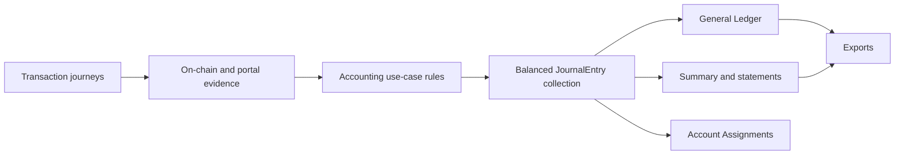

# Accounting — User Stories

**Scope:** The company Accounting journey exposed by the portal

**Last reviewed:** Not yet reviewed

These acceptance criteria follow the
[feature documentation review contract](../../platform/feature-specification-guide.md#human-review-contract).

## Product Model

- Accounting presents one team-scoped set of double-entry books across Bank, Safe, Payroll, Expense, Community Credit, Shareholder, and
  Vesting activity.
- Every report and export projects the same validated `JournalEntry` collection. Account and currency filters keep complete entries so the
  debit and credit context is never lost.
- Monetary lines retain their original currency and exact quantity. Reports use a rate of record and aggregate exact fixed-scale USD values
  before display rounding.
- Payroll is accrued when an eligible work week ends. Expense Account spending is recognized when cash moves. Transfers between known
  company pockets are not revenue or expense.
- Accounting includes every known contract generation. Each deployment remains a distinct cash account even when report totals aggregate the
  same account family.
- Reports are available only when every applicable source is ready. Loading, partial, failed, missing-timestamp, and missing-rate states are
  explicit; Accounting does not present incomplete books as final.
- [Understanding Accounting through six questions](./accounting-model.md) provides a progressive visual explanation of treasury pockets,
  balanced entries, redeployments, multi-generation assembly, completeness, and report derivation.
- The [Accounting rule catalogue](./journal-entry-catalogue.md) maps transaction stories to domain use cases, generic posting rules, journal
  components, and General Ledger output. The [Accounting Read Model](../../implementation/accounting-read-model/README.md) owns the shared
  processing architecture.

## Lifecycle

## Status Overview

| User Story  | Title                                  | Actor          | Status         |
| ----------- | -------------------------------------- | -------------- | -------------- |
| US-ACCT-001 | View the Accounting overview           | Company member | 🚧 In Progress |
| US-ACCT-002 | Trace operations in the General Ledger | Company member | 🧪 Validation  |
| US-ACCT-003 | Review financial statements            | Company member | 🧪 Validation  |
| US-ACCT-004 | Export accounting reports              | Company member | 🧪 Validation  |
| US-ACCT-005 | Review historical contract activity    | Company member | 🚧 In Progress |
| US-ACCT-006 | Classify an external withdrawal        | Company owner  | 🧪 Validation  |

## Test Coverage Overview

| User Story  | E2E Status | Owning Path |
| ----------- | ---------- | ----------- |
| US-ACCT-001 | 📋 Planned | E2E-PATH-15 |
| US-ACCT-002 | 📋 Planned | E2E-PATH-15 |
| US-ACCT-003 | 📋 Planned | E2E-PATH-15 |
| US-ACCT-004 | 📋 Planned | E2E-PATH-16 |
| US-ACCT-005 | 📋 Planned | E2E-PATH-15 |
| US-ACCT-006 | 📋 Planned | E2E-PATH-16 |

## US-ACCT-001: View the Accounting Overview

**As a** company member\
**I want to** view a consolidated accounting overview\
**So that** I can understand the company's financial position and whether its books are complete

### Acceptance Criteria

#### Happy Path

- [x] `AC-US-ACCT-001-01` The overview reports revenue, expenses, net income, assets, liabilities, equity, and debt from one `JournalEntry`
      collection.
- [x] `AC-US-ACCT-001-02` The overview shows whether total debits equal total credits and whether assets equal liabilities plus equity.
- [x] `AC-US-ACCT-001-03` Refreshing Accounting reloads the source evidence and recalculates every report from the same journal snapshot.

#### Business Rules

- [x] `AC-US-ACCT-001-04` Every posted journal entry balances.
- [x] `AC-US-ACCT-001-05` USD-pegged tokens use a one-dollar rate, native tokens use their immutable transaction-date snapshot, and SHER
      uses its compensation valuation policy.
- [x] `AC-US-ACCT-001-06` Payroll obligations are recognized when an eligible work week ends, before settlement.
- [x] `AC-US-ACCT-001-07` Transfers between known company accounts do not change revenue or expenses.
- [ ] `AC-US-ACCT-001-08` Closing cash balances are reconciled with the corresponding on-chain balances.

#### Edge & Error Cases

- [x] `AC-US-ACCT-001-09` A company with no activity produces balanced zero-value books.
- [x] `AC-US-ACCT-001-10` Reports remain withheld while an applicable source is loading, partial, or failed.
- [x] `AC-US-ACCT-001-11` A missing block timestamp withholds the affected event instead of creating a zero-date entry.
- [x] `AC-US-ACCT-001-12` A missing rate retains the non-zero movement and reports `rate-unavailable` instead of substituting a current
      price.

**Dependencies:** Current company, accounting source providers, and valuation sources

## US-ACCT-002: Trace Operations in the General Ledger

**As a** company member\
**I want to** trace each accounting operation in the General Ledger\
**So that** I can understand the evidence, accounts, and amounts behind the books

### Acceptance Criteria

#### Happy Path

- [x] `AC-US-ACCT-002-04` Each ledger operation exposes its date, activity, accounts, currency, quantity, rate, debit, credit, and
      transaction hash when one exists.
- [x] `AC-US-ACCT-002-05` A transaction hash opens the configured network explorer; a synthetic operation has no explorer link.
- [x] `AC-US-ACCT-002-06` A member can filter by period, currency, and concrete account, then open the relevant product journey or account
      drill-down.

#### Business Rules

- [x] `AC-US-ACCT-002-01` One source operation produces at most one ledger entry, even when several events or recipient payments support it.
- [x] `AC-US-ACCT-002-02` Account and currency filters retain every line of each matching `JournalEntry`.
- [x] `AC-US-ACCT-002-03` A Bank fee appears as `Transaction Fee Expense` inside its matched Bank outflow, never as an orphan fee entry.
- [x] `AC-US-ACCT-002-07` Internal transfers identify both concrete deployment accounts without creating revenue or expense.
- [x] `AC-US-ACCT-002-08` Pagination changes visible rows, not filtered totals.
- [x] `AC-US-ACCT-002-09` Labels and accounts follow the canonical [Accounting rule catalogue](./journal-entry-catalogue.md).

#### Edge & Error Cases

- [x] `AC-US-ACCT-002-10` A filter with no matching entries returns an empty ledger with zero totals.
- [x] `AC-US-ACCT-002-11` Changing a filter resets pagination to a valid page.
- [x] `AC-US-ACCT-002-12` An account drill-down carries its opening balance from activity before the selected period.

**Dependencies:** US-ACCT-001

## US-ACCT-003: Review Financial Statements

**As a** company member\
**I want to** review the income statement, balance sheet, and trial balance\
**So that** I can assess performance, financial position, and ledger balance

### Acceptance Criteria

#### Happy Path

- [x] `AC-US-ACCT-003-01` The income statement reports revenue, expenses, and net income for the selected period.
- [x] `AC-US-ACCT-003-02` The balance sheet reports assets, liabilities, and equity as of the selected date.
- [x] `AC-US-ACCT-003-03` The trial balance reports each concrete account on its normal debit or credit side as of the selected date.
- [x] `AC-US-ACCT-003-04` A member can inspect the complete journal entries behind a statement line.

#### Business Rules

- [x] `AC-US-ACCT-003-05` Every statement uses the same exact journal amounts as the General Ledger.
- [x] `AC-US-ACCT-003-06` Trial-balance debits equal credits, and the balance sheet preserves `Assets = Liabilities + Equity` for balanced
      books.
- [x] `AC-US-ACCT-003-07` `Earnings to date` equals income less expenses through the selected date and remains distinct from posted equity
      accounts.
- [x] `AC-US-ACCT-003-08` Redeployed and unresolved accounts remain separate rows and preserve their own drill-down scope.

#### Edge & Error Cases

- [x] `AC-US-ACCT-003-09` A period without activity reports zero totals without inventing entries.
- [x] `AC-US-ACCT-003-10` Point-in-time statements exclude later entries.
- [x] `AC-US-ACCT-003-11` A statement line without evidence does not expose an empty drill-down as supporting detail.

**Dependencies:** US-ACCT-001 and US-ACCT-002

## US-ACCT-004: Export Accounting Reports

**As a** company member\
**I want to** export the report I am reviewing\
**So that** I can use the same accounting information outside the portal

### Acceptance Criteria

#### Happy Path

- [x] `AC-US-ACCT-004-01` A member can export the General Ledger and each financial statement to Excel or PDF.
- [x] `AC-US-ACCT-004-02` A summary export can include several selected sections.
- [x] `AC-US-ACCT-004-03` A statement or account drill-down can be exported independently.

#### Business Rules

- [x] `AC-US-ACCT-004-04` An export uses one snapshot of the current `JournalEntry` collection and the same filters as the reviewed report.
- [x] `AC-US-ACCT-004-05` Ledger and drill-down exports retain complete matching entries and full transaction hashes.
- [x] `AC-US-ACCT-004-06` Balance Sheet exports retain concrete account rows and the account contributions behind `Earnings to date`.
- [x] `AC-US-ACCT-004-07` Monetary display conversion and rounding happen after exact journal and report totals are calculated.

#### Edge & Error Cases

- [x] `AC-US-ACCT-004-08` An export failure is reported without changing the books.
- [x] `AC-US-ACCT-004-09` An empty export keeps the selected report structure without inventing entries.

**Dependencies:** US-ACCT-002 or US-ACCT-003

## US-ACCT-005: Review Historical Contract Activity

**As a** company member\
**I want to** review activity from every contract generation in the same books\
**So that** redeployments do not erase or misclassify company history

### Acceptance Criteria

#### Happy Path

- [x] `AC-US-ACCT-005-01` Accounting scans every known generation from its own deployment boundary and consolidates the resulting entries.
- [x] `AC-US-ACCT-005-02` Pre- and post-migration operations contribute to the same reports.
- [x] `AC-US-ACCT-005-03` Legacy and current Bank fees remain attached to the generation and outflow that paid them.
- [x] `AC-US-ACCT-005-04` Treasury sweeps between old and replacement company contracts remain internal transfers.
- [x] `AC-US-ACCT-005-05` Each redeployed cash account has its own Trial Balance row, General Ledger label, and drill-down.

#### Business Rules

- [x] `AC-US-ACCT-005-06` Event cache identity includes normalized deployment address and effective boundary.
- [x] `AC-US-ACCT-005-07` Known contracts from every generation participate in internal-transfer classification.
- [x] `AC-US-ACCT-005-08` Current Investor identity takes precedence over `InvestorV1`; the legacy contract remains the fallback when no
      current Investor exists.
- [x] `AC-US-ACCT-005-09` Duplicate generation events are removed by their on-chain identity.
- [ ] `AC-US-ACCT-005-10` Historical Community Credit terms and SHER valuation inputs resolve from their owning generation.

#### Edge & Error Cases

- [x] `AC-US-ACCT-005-11` When deployment history is unavailable, Accounting falls back to the current contract set.
- [x] `AC-US-ACCT-005-12` One empty or failed generation does not remove available activity from other generations.
- [x] `AC-US-ACCT-005-13` An unproven deployment leg remains a separate unresolved account instead of being assigned to an older deployment.

**Dependencies:** Contract deployment history and US-ACCT-001

## US-ACCT-006: Classify an External Withdrawal

**As a** company owner\
**I want to** classify an eligible Bank or Safe withdrawal\
**So that** the books record why the company paid money out

### Acceptance Criteria

#### Happy Path

- [x] `AC-US-ACCT-006-01` The owner can assign one supported account family and an optional memo to an eligible single-source external
      withdrawal.
- [x] `AC-US-ACCT-006-02` Saving replaces only the inferred counter-account and remains visible after refresh.
- [x] `AC-US-ACCT-006-03` Removing an assignment restores the account inferred from source evidence.
- [x] `AC-US-ACCT-006-04` Account Assignments shows the same complete entry as the General Ledger, including transaction fees.

#### Business Rules

- [x] `AC-US-ACCT-006-05` An assignment is keyed by company and lowercase transaction hash.
- [x] `AC-US-ACCT-006-06` Supported accounts are `Operating Expense`, `Owner Capital`, `Payroll Expense`, `Interest Expense`, and
      `Dividend Expense`.
- [x] `AC-US-ACCT-006-07` An assignment changes neither the cash line nor a `Transaction Fee Expense` line.
- [x] `AC-US-ACCT-006-08` Direct deposits, internal transfers, system-owned payouts, and compound entries are read-only.
- [x] `AC-US-ACCT-006-09` Members may inspect assignments, but only the company owner may create, replace, or remove them.

#### Edge & Error Cases

- [x] `AC-US-ACCT-006-10` A malformed hash, unsupported account, or ineligible persisted record is rejected or ignored without changing the
      journal.
- [x] `AC-US-ACCT-006-11` A failed save or removal leaves the previous entry visible and reports that the change was not applied.

**Dependencies:** US-ACCT-002 and the journal account-assignment API

## Known Gaps

- Closing cash balances are not reconciled with live on-chain balances (`US-ACCT-001`).
- Historical Community Credit terms and SHER valuation inputs still use current-generation sources (`US-ACCT-005`).
- Off-platform activity without a connected data source is absent from the automated books.
- Safe outgoing evidence does not infer cash movements hidden inside MultiSend, module, or custom calls.
- A Bank fee without matching outflow evidence is withheld until the source feed can be reconciled (`US-ACCT-002`).

## Implementation Evidence

**Implementation evidence reviewed against:** `006685cb46c8408101e785b258482092a1e63f70`

- [Accounting page](../../../app/src/components/sections/AccountingView/AccountingPage.vue),
  [team routes](../../../app/src/router/index.ts), and [Accounting data layer](../../../app/src/composables/accounting/useCNCAccounting.ts)
- [Source completeness](../../../app/src/utils/accounting/accountingCompleteness.ts),
  [block timestamps](../../../app/src/queries/blockTimestamp.queries.ts), and
  [historical valuation](../../../app/src/queries/historicalTokenRate.queries.ts)
- [Accounting assembly](../../../app/src/utils/accounting/assemble.ts),
  [journal finalization](../../../app/src/utils/accounting/journalEntry.ts), and
  [General Ledger presenter](../../../app/src/utils/accounting/journalLedgerPresenter.ts)
- [Trial Balance](../../../app/src/utils/accounting/generalLedger.ts),
  [income statement](../../../app/src/utils/accounting/incomeStatement.ts),
  [balance sheet](../../../app/src/utils/accounting/balanceSheet.ts), and [report presenter](../../../app/src/utils/accounting/presenter.ts)
- [Account assignment boundary](../../../app/src/utils/accounting/journalAccountAssignment.ts),
  [assignment route](../../../app/src/views/team/%5Bid%5D/Accounting/AccountAssignmentsView.vue), and
  [assignment API](../../../backend/src/controllers/journalAccountAssignmentController.ts)
- [Accounting exports](../../../app/src/composables/accounting/useAccountingExport.ts) and
  [journal export snapshot](../../../app/src/utils/accounting/exportSpec.ts)
- [Accounting rule tests](../../../app/src/utils/accounting/__tests/),
  [report tests](../../../app/src/views/team/%5Bid%5D/Accounting/__tests__/AccountingReports.spec.ts), and
  [migration tests](../../../app/src/composables/accounting/__tests__/useCNCAccounting.migration.spec.ts)

## Related Documentation

- [Understanding Accounting through six questions](./accounting-model.md)
- [Accounting use cases, posting rules, and journal entries](./journal-entry-catalogue.md)
- [Accounting Read Model](../../implementation/accounting-read-model/README.md)
- [Vesting accounting policy](./vesting-accounting-restricted-stock.md)
- [Accounts](../accounts/README.md)
- [Payroll](../payroll/README.md)
- [Community Credit](../community-credit/README.md)
- [Shareholder Management](../shareholder-management/README.md)
- [Vesting](../vesting/README.md)

_[← Back to feature inventory](../README.md)_
