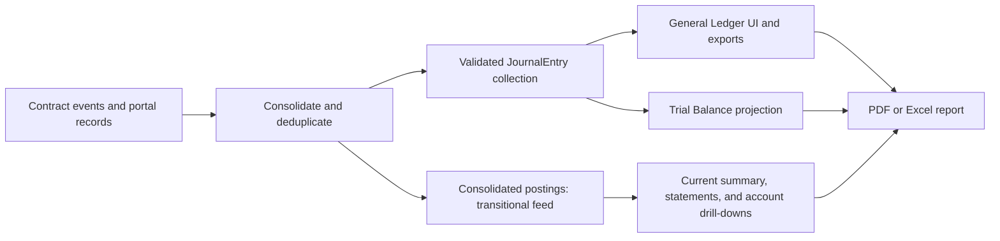

# Accounting — User Stories

**Scope:** The complete company Accounting journey exposed by the portal

**Last reviewed:** Not yet reviewed

These acceptance criteria follow the
[feature documentation review contract](../../platform/feature-specification-guide.md#human-review-contract).

## Product Model

- Accounting presents one consolidated set of double-entry books for the company across its money-moving contracts and relevant portal
  records.
- The General Ledger and Trial Balance project the validated `JournalEntry` collection. The summary, income statement, balance sheet, and
  account drill-downs remain transitional `LedgerEntry` projections.
- Monetary entries are reported in USD while retaining their original currency, quantity, and rate of record.
- Payroll is recognized on an accrual basis. Expense Account spending is recognized on a cash basis.
- Transfers between the company's own accounts are internal movements, not revenue or expenses.
- Accounting includes every known contract generation. Individual account pages intentionally remain scoped to their current contract.
- Off-platform activity without a connected data source, including infrastructure bills, is outside the current automated books.

- **Contracts in scope:** Bank, FeeCollector, CashRemunerationEIP712, ExpenseAccountEIP712, InvestorV1, SafeDepositRouter, Vesting — the
  contracts the CNC actually uses.
- **Key rules:** payroll is **accrual** (via a `Wage Payable` liability); expenses are **cash basis**; investing returns **SHER shares**
  booked to `Investor Equity`; a direct mint with nothing behind it issues shares straight to equity; a Bank protocol fee is a
  `Transaction Fee Expense` line in the Bank outflow that caused it; the global FeeCollector is not a company-owned cash pocket; **share
  vesting** books the **whole award when the schedule is defined** and issues it as shares are released (a restricted-stock grant, off the
  income statement). The precise use-case templates and verified current gaps are in the
  [Accounting Journal Entry Catalogue](./journal-entry-catalogue.md).
- **Bank/Safe deposits and withdrawals** are booked from address inference by default, but a company owner can **manually classify** each
  one into a supported accounting category (revenue, an expense — operating/payroll/interest/dividend, owner capital, or a shareholder loan)
  — persisted, shared, and reversible; see catalogue §5.5 ([#2457](https://github.com/globe-and-citizen/cnc-portal/issues/2457)).
- **The books balance at every level:** journal, trial balance, and `Assets = Liabilities + Equity`.
- **Journal-entry assembly:** Accounting constructs a validated double-entry `JournalEntry` collection and preserves concrete accounts
  across redeployments. The source-operation model, canonical account terminology, report-projection boundary, and verified optimisation
  considerations are owned by the [Accounting Read Model](../../implementation/accounting-read-model/README.md).

## Lifecycle

## Status Overview

| User Story  | Title                                      | Actor          | Status         |
| ----------- | ------------------------------------------ | -------------- | -------------- |
| US-ACCT-001 | Review the consolidated accounting summary | Company member | 🚧 In Progress |
| US-ACCT-002 | Explore the general ledger                 | Company member | 🚧 In Progress |
| US-ACCT-003 | Review the financial statements            | Company member | 🧪 Validation  |
| US-ACCT-004 | Export accounting reports                  | Company member | 🧪 Validation  |
| US-ACCT-005 | Preserve books across contract migrations  | Company member | 🚧 In Progress |
| US-ACCT-006 | Classify a Bank transaction                | Company owner  | 📝 Draft       |

## US-ACCT-001: Review the Consolidated Accounting Summary

**As a** company member\
**I want to** review the company's consolidated accounting summary\
**So that** I can understand its current financial position

### Acceptance Criteria

#### Happy Path

- [x] The summary reports revenue, expenses, net income, assets, liabilities, equity, and debt from one consolidated ledger.
- [x] The summary reports whether assets equal liabilities plus equity and whether total debits equal total credits.
- [x] Refreshing Accounting reloads the underlying books and recalculates every report from the same entries.

#### Business Rules

- [x] Every journal posting has equal debit and credit totals.
- [x] USD-pegged tokens use a one-dollar rate, while native tokens and SHER use their configured rates of record.
- [x] Payroll obligations are recognized when an eligible work week ends, before settlement.
- [x] Internal transfers between known company accounts do not change revenue or expenses.
- [ ] Reported closing cash balances are reconciled against the corresponding on-chain balances.

#### Edge & Error Cases

- [x] A company with no accounting activity produces balanced zero-value books.
- [x] Failure to load the company prevents Accounting from presenting books for an unknown contract set.
- [x] A failed contract-generation scan preserves available books and identifies the affected source as incomplete.
- [ ] Every unavailable optional or enrichment source that can make the books incomplete is identified to the reviewer.

**Dependencies:** Current company, contract-event providers, and accounting enrichment records

## US-ACCT-002: Explore the General Ledger

**As a** company member\
**I want to** explore the company's journal entries\
**So that** I can trace each reported amount to its accounting movements

### Acceptance Criteria

#### Happy Path

- [x] The ledger exposes each posting's date, activity, accounts, currency, quantity, rate, debit, and credit amounts.
- [x] A company member can filter entries by reporting period, available currencies, and one or more concrete accounts.
- [x] A company member can inspect the entries and running balance for one account from a report line.
- [x] Selecting an account on a ledger entry opens that account's transactions in the trial-balance drill-down.
- [x] A known activity destination can be followed to its owning product journey.

#### Business Rules

- [x] Pagination does not change the totals for the complete filtered ledger.
- [x] Filtering the ledger by account or currency keeps whole `JournalEntry` records, so each shown entry still carries every debit and
      credit line.
- [x] The General Ledger has no `Fee` pseudo-category. A Bank transfer and its protocol fee in the same transaction form one complete
      `JournalEntry`, with an ordinary `Transaction Fee Expense` line.
- [x] A protocol fee is never displayed or exported as a `JournalEntry` without the Bank outflow that caused it; unmatched fee evidence is
      withheld and surfaced as a reconciliation warning.
- [ ] Every economic operation that produces several source events is represented by one complete `JournalEntry`.
- [ ] A distribution paid to several recipients in one transaction — a dividend across shareholders, a multi-currency wage, a
      community-credit round — is shown as one ledger entry with every recipient's debit or credit line and one credit for the total.
- [x] Protocol fees remain identifiable as expenses rather than neutral transfers.
- [x] One on-chain event is not counted more than once in the consolidated ledger.

#### Edge & Error Cases

- [x] A filter with no matching entries produces an empty ledger with zero totals.
- [x] Changing a filter resets pagination to a valid result page.
- [x] An account with activity before the selected period carries its opening balance into the drill-down.

**Dependencies:** US-ACCT-001

## US-ACCT-003: Review the Financial Statements

**As a** company member\
**I want to** review the company's financial statements\
**So that** I can assess performance, position, and ledger balance

### Acceptance Criteria

#### Happy Path

- [x] The income statement reports revenue, expenses, and net income for the selected reporting period.
- [x] The balance sheet reports assets, liabilities, and equity as of the selected date.
- [x] The trial balance reports each account on its normal debit or credit side as of the selected date.
- [x] A company member can inspect the ledger entries behind a statement line.

#### Business Rules

- [x] The balance sheet preserves the identity `Assets = Liabilities + Equity` for balanced books.
- [x] Trial-balance debit and credit totals remain equal for balanced books.
- [x] Retained earnings aggregates the income and expense accounts included through the selected date.
- [x] Statement drill-downs use the same reporting boundary as their parent statement.

#### Edge & Error Cases

- [x] A reporting period without revenue or expenses reports zero totals without inventing entries.
- [x] A statement line without underlying entries does not expose an empty drill-down as evidence.
- [x] A point-in-time statement excludes entries after its selected date.

**Dependencies:** US-ACCT-001 and US-ACCT-002

## US-ACCT-004: Export Accounting Reports

**As a** company member\
**I want to** export accounting reports\
**So that** I can review or share the same financial information outside the portal

### Acceptance Criteria

#### Happy Path

- [x] A company member can export the general ledger and each financial statement to Excel.
- [x] A company member can export the general ledger and each financial statement to PDF.
- [x] A summary export can include multiple selected accounting sections in one report.
- [x] A statement-line drill-down can be exported independently.

#### Business Rules

- [x] A General Ledger export applies the selected concrete accounts, period, currencies, and columns while retaining complete journal
      entries.
- [x] A statement export applies the same period or as-of date as the reviewed statement.
- [x] An export is generated from one snapshot of the current accounting books.

#### Edge & Error Cases

- [x] An export failure is reported without changing the accounting books.
- [x] Exporting an empty report produces the selected report structure without inventing entries.

**Dependencies:** US-ACCT-002 or US-ACCT-003

## US-ACCT-005: Preserve Books Across Contract Migrations

**As a** company member\
**I want to** keep historical accounting entries after contract migrations\
**So that** redeploying company contracts does not erase or misclassify the company's books

### Acceptance Criteria

#### Happy Path

- [x] Accounting consolidates entries from every known contract generation into the same books.
- [x] Each contract generation is scanned from its own deployment boundary.
- [x] Transactions made before and after a migration contribute to the same reports.
- [x] A treasury sweep between old and replacement company contracts remains an internal transfer.
- [x] The trial balance presents each resolved Bank, Payroll, Expense, or Credit deployment as its own account row, and drilling a
      deployment's row shows only that deployment's entries.
- [x] The general ledger names the contract generation on every posting of a redeployed cash pocket, under the same numbering the trial
      balance uses, and jumping from such a posting opens that generation's trial-balance line.

#### Business Rules

- [x] Contracts from every known generation are recognized as company-owned when classifying internal transfers.
- [x] The persistent company Safe and other officerless accounts are included once across generations.
- [x] Merged generation events are deduplicated by their on-chain identity.
- [ ] Historical Community Credit terms and SHER valuation inputs are resolved from their owning contract generation.

#### Edge & Error Cases

- [x] When Officer history is unavailable, Accounting falls back to the current contract set.
- [x] A generation with no events does not remove events from other generations.
- [x] A failed generation scan preserves the other generations and reports a reconciliation gap.
- [x] A deployment-specific source leg without a contract address remains a separate unresolved Trial Balance account; its drill-down and
      export scope the selected account to unaddressed legs and never fall back to an older deployment.

**Dependencies:** Contract deployment history and US-ACCT-001

## US-ACCT-006: Classify a Bank Transaction

**As a** company owner\
**I want to** assign the economic classification of a Bank deposit or withdrawal\
**So that** the books record why funds moved instead of assuming it from the on-chain address

### Acceptance Criteria

#### Happy Path

- [ ] The company owner can classify a Bank transaction with a supported accounting category and an optional memo.
- [ ] The company owner can deposit funds received off-chain from a client and classify the Bank deposit as Service Revenue (`UC-BANK-02`).
- [ ] The company owner who is the economic client can classify their own Bank deposit as Service Revenue (`UC-BANK-02`).
- [ ] The company owner can classify a contribution that receives no SHER as Owner Capital (`UC-BANK-01`).
- [ ] A saved classification remains visible in the accounting books after a refresh.

#### Business Rules

- [ ] A classification is stored against a stable on-chain transaction identity and deterministically produces balanced ledger entries.
- [ ] Address-based inference remains visible only when no manual classification exists.
- [ ] A guaranteed transfer between company-owned pockets remains an internal transfer and cannot be reclassified as income or expense.
- [ ] The classification action is available for supported native-token and ERC-20 Bank deposits and withdrawals.
- [ ] Only the company owner can create or change a classification.

#### Edge & Error Cases

- [ ] An unknown transaction, invalid category, duplicate submission, or concurrent edit is rejected without changing the existing books.
- [ ] A failed save leaves the previous classification visible and explains that the change was not applied.

**Dependencies:** US-ACCT-002, a company-owned Bank transaction, and the planned Bank-classification delivery

## Known Gaps

- Accounting does not reconcile ledger closing cash balances against live on-chain balances (`US-ACCT-001`).
- Safe feeds and off-chain enrichment failures can omit entries without an incomplete-books warning (`US-ACCT-001`).
- Historical Community Credit terms and SHER valuation inputs are read from current-generation contracts (`US-ACCT-005`).
- Off-platform activity without a connected data source is absent from the automated books.
- Bank classifications currently rely on address-based inference, so an owner cannot record an off-chain client payment or their own client
  payment as Service Revenue (`US-ACCT-006`).
- Some compound operations do not yet propagate one shared source-operation identity, so the General Ledger can display their related
  postings as separate journal entries (`US-ACCT-002`).
- A Bank fee log without matching Bank-outflow evidence is withheld from the books and shown as incomplete evidence until the source feed
  can be reconciled (`US-ACCT-002`).

## Implementation Evidence

**Implementation evidence reviewed against:** `5112b4e1126d5de95d3ceb8dffebeba182c9ae87`

- [Classification view](../../../app/src/views/team/%5Bid%5D/Accounting/ClassificationView.vue),
  [classification table](../../../app/src/components/sections/AccountingView/ClassificationTable.vue), and
  [ledger classification cell](../../../app/src/components/sections/AccountingView/LedgerClassificationCell.vue)
- [Accounting page orchestration](../../../app/src/components/sections/AccountingView/AccountingPage.vue),
  [Accounting view components](../../../app/src/components/sections/AccountingView/), and
  [accounting data layer](../../../app/src/composables/accounting/useCNCAccounting.ts)
- [Accounting backend feeds](../../../app/src/composables/accounting/useAccountingBackendFeeds.ts)
- [Classification query](../../../app/src/queries/classification.queries.ts),
  [classification types](../../../app/src/types/accounting-classification.ts), and
  [classification assembly](../../../app/src/utils/accounting/classification.ts)
- [Classification controller](../../../backend/src/controllers/classificationController.ts),
  [classification route](../../../backend/src/routes/classificationRoute.ts),
  [classification validation](../../../backend/src/validation/schemas/classification.ts), and
  [validation registry](../../../backend/src/validation/index.ts)
- [Classification persistence schema](../../../backend/prisma/schema.prisma) and
  [classification migrations](../../../backend/prisma/migrations/20260821000000_add_transaction_classification/)
- [Statement-line drill-down](../../../app/src/composables/accounting/useLedgerDrilldown.ts)
- [Ledger Activity destination resolver](../../../app/src/composables/accounting/useActivityDestination.ts)
- [Share-vesting event feed (getLogs)](../../../app/src/composables/vesting/useVestingEventsViaLogs.ts) and
  [vesting source mapper](../../../app/src/utils/accounting/mappers/vesting.ts)
- [Accounting export pipeline](../../../app/src/composables/accounting/useAccountingExport.ts),
  [per-section export](../../../app/src/composables/accounting/useSectionExport.ts), and
  [transfer-initiator resolver](../../../app/src/composables/accounting/useTransferInitiators.ts)
- [Reusable multi-select filter](../../../app/src/components/ui/MultiSelectFilter.vue) and its
  [facet-filter composable](../../../app/src/composables/useFacetFilter.ts) — shared by the ledger's account and currency filters
- [Accounting assembly](../../../app/src/utils/accounting/assemble.ts),
  [canonical account-family chart](../../../app/src/utils/accounting/chartOfAccounts.ts),
  [canonical Account registry](../../../app/src/utils/accounting/accountRegistry.ts),
  [validated JournalEntry model](../../../app/src/utils/accounting/journalEntry.ts),
  [journal assembly and Trial Balance projection](../../../app/src/utils/accounting/generalLedger.ts), and
  [General Ledger journal presenter](../../../app/src/utils/accounting/journalLedgerPresenter.ts)
- [Family-level income statement](../../../app/src/utils/accounting/incomeStatement.ts) and
  [balance sheet](../../../app/src/utils/accounting/balanceSheet.ts)
- [Current Bank classification inference](../../../app/src/utils/accounting/mappers/bank.ts) and
  [Bank mapper tests](../../../app/src/utils/accounting/__tests__/bank.spec.ts)
- [Accounting component tests](../../../app/src/components/sections/AccountingView/__tests__/AccountingView.spec.ts),
  [accounting data tests](../../../app/src/composables/accounting/__tests__/useCNCAccounting.spec.ts), and
  [journal General Ledger tests](../../../app/src/utils/accounting/__tests__/journalLedgerPresenter.spec.ts) and
  [accounting rule tests](../../../app/src/utils/accounting/__tests__)
- [Contract-migration accounting tests](../../../app/src/composables/accounting/__tests__/useCNCAccounting.migration.spec.ts)

## Related Documentation

- [Client Navigation implementation](../../implementation/client-navigation/README.md)
- [Date Picker implementation](../../implementation/date-picker/README.md)
- [Accounting Read Model](../../implementation/accounting-read-model/README.md)
- [Accounting Journal Entry Catalogue](./journal-entry-catalogue.md)
- [Money Flow Catalogue](./money-flow-catalogue.md)
- [Share Vesting Accounting — Restricted-Stock grant](./vesting-accounting-restricted-stock.md)
- [Accounting Specification and Scope](./cnc-accounting-spec.md)
- [Contract Migration History](./contract-migration-history.md)
- [Full Accounting Test Scenario](./accounting-test-plan.md)
- [Accounts](../accounts/README.md)
- [Payroll & Cash Remuneration](../payroll/README.md)
- [Community Credit](../community-credit/README.md)

_[← Back to feature inventory](../README.md)_
