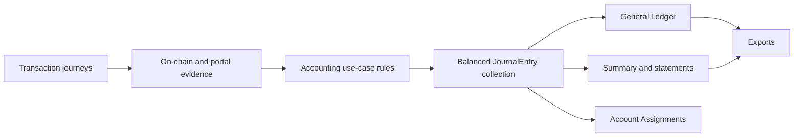

# Accounting — User Stories

**Scope:** The company Accounting journey exposed by the portal

**Last reviewed:** Not yet reviewed

These acceptance criteria follow the
[feature documentation review contract](../../platform/feature-specification-guide.md#human-review-contract).

## Product Model

- Accounting presents one team-scoped set of double-entry books across Bank, Safe, Payroll, Expense, Community Credit, Shareholder, and
  Vesting activity.
- Every report and export projects the same validated `JournalEntry` collection. Account and currency filters keep complete entries so the
  debit and credit context is never lost.
- Monetary lines retain their original currency and exact quantity. Reports use a rate of record and aggregate exact fixed-scale USD values
  before display rounding.
- Ledger quantities and recorded rates display up to six decimals with trailing zeros trimmed. Complete quantities and recorded rates remain
  inspectable by hover, keyboard focus, or tap; positive quantities that would display as zero are identified as below display precision.
  Display formatting does not change journal calculations or the existing export quantities.
- Payroll is accrued when an eligible work week ends. Expense Account spending is recognized when cash moves. Transfers between known
  company pockets are not revenue or expense.
- Accounting includes every known contract generation. Each deployment remains a distinct cash account even when report totals aggregate the
  same account family.
- Reports are available only when every applicable source is ready. Loading, partial, failed, missing-timestamp, and missing-rate states are
  explicit; Accounting does not present incomplete books as final.
- [Understanding Accounting through six questions](./accounting-model.md) provides a progressive visual explanation of treasury pockets,
  balanced entries, redeployments, multi-generation assembly, completeness, and report derivation.
- The [Accounting rule catalogue](./journal-entry-catalogue.md) covers events that produce accounting entries, organizing economic use cases
  by selection condition with related transaction stories, posting rules, and complete journal entries. Internal/external/fee rules describe
  the applicable treasury movements. Its runtime correspondence section records the currently implemented identifiers and migration
  boundaries. The [Accounting Read Model](../../implementation/accounting-read-model/README.md) owns the shared processing architecture.
- The [Accounting test script](./accounting-test-script.md) gives a manual scenario checklist for the proposed accounting model, including
  source-independent pocket transfers, evidence-based treatment of external cash, fee composition, and report reconciliation. Its proposed
  identifiers remain illustrative until the runtime migration is implemented.

## External Safe Asset Exchanges

Accounting uses complete Safe transfer history to recognize actual assets received and disposed, including allowance-driven settlements. An
ERC-20 is identified by its network and contract address; its original currency and exact quantity remain on the journal lines. Token
discovery does not expand the tokens allowed in CNC payment forms.

A simple exchange requires opposing different-asset legs sharing a transaction and external settlement counterparty. The acquired asset is
debited at its own historical market rate and the disposed asset credited at its weighted-average carrying value. The difference is an
`Asset Exchange Gain` or `Asset Exchange Loss`, never `Service Revenue`. Stablecoin spent does not set the acquired asset's unit price or
hide an exchange loss in its carrying value. Current portfolio prices never replace historical accounting evidence.

Ancillary mints and ambiguous batches require classification. Missing decimals, rate, or acquisition basis keeps Accounting incomplete.
Cross-transaction intents and arbitrary DeFi actions need additional protocol evidence. See the
[Accounting Read Model](../../implementation/accounting-read-model/README.md#safe-assets-and-exchanges) for these boundaries and the
[exchange regression suite](../../../app/src/utils/accounting/__tests__/safeExchanges.spec.ts) and
[market-rate regressions](../../../app/src/utils/accounting/__tests__/safeExchanges.marketRates.spec.ts) for current executable evidence.
Human validation of external swap journeys remains pending. Use the [manual Safe exchange checks](./safe-swap-test-script.md). The
[direct asset movement product contract](./direct-movement-policy.md) defines company custody, unsolicited receipts, historical coverage,
classification, and reconciliation across domains. Its target behaviour remains pending implementation; new ACs are unchecked.

### Product Transition

Existing checked criteria and their test references retain the currently implemented event-feed and client-processing scope.
`US-ACCT-007–010` define the additional target behaviour. In that target, report completeness refers to the verified snapshot being
presented; a failed candidate refresh retains the previous complete snapshot under `US-ACCT-008`. Receipt classification follows
`US-ACCT-010`; the restrictions in `US-ACCT-006` continue to apply to the withdrawal-assignment workflow. The later implementation must
revalidate these relationships and migrate the affected evidence before marking the new criteria complete.

## Lifecycle

```mermaid
flowchart LR
    Transactions[Transaction journeys] --> Evidence[On-chain and portal evidence]
    Evidence --> Rules[Accounting use-case rules]
    Rules --> Journal[Balanced JournalEntry collection]
    Journal --> Ledger[General Ledger]
    Journal --> Statements[Summary and statements]
    Journal --> Assignments[Account Assignments]
    Ledger --> Exports[Exports]
    Statements --> Exports
```

## Status Overview

| User Story  | Title                                    | Actor          | Status         |
| ----------- | ---------------------------------------- | -------------- | -------------- |
| US-ACCT-001 | View the Accounting overview             | Company member | 🚧 In Progress |
| US-ACCT-002 | Trace operations in the General Ledger   | Company member | 🧪 Validation  |
| US-ACCT-003 | Review financial statements              | Company member | 🧪 Validation  |
| US-ACCT-004 | Export accounting reports                | Company member | 🧪 Validation  |
| US-ACCT-005 | Review historical contract activity      | Company member | 🚧 In Progress |
| US-ACCT-006 | Classify an external withdrawal          | Company owner  | 🧪 Validation  |
| US-ACCT-007 | Review direct treasury movements         | Company member | 🚧 In Progress |
| US-ACCT-008 | Access synchronized company books        | Company member | 🚧 In Progress |
| US-ACCT-009 | Investigate treasury balance differences | Company member | 🚧 In Progress |
| US-ACCT-010 | Classify direct external receipts        | Company owner  | 🚧 In Progress |

## Test Coverage Overview

Coverage targets compare each criterion's required evidence with direct `AC-US-*` references in tracked tests. They do not represent the
latest pass/fail result, which belongs to CI or the generated local report. Gaps identify criteria whose required evidence is missing or
insufficient; the detailed evidence distribution remains available in the generated report instead of being repeated here.

| User Story  | Main Journey  | Coverage Target | Gaps                                                                                                                                                                                                                                                                                                                                                                                                          |
| ----------- | ------------- | --------------- | ------------------------------------------------------------------------------------------------------------------------------------------------------------------------------------------------------------------------------------------------------------------------------------------------------------------------------------------------------------------------------------------------------------- |
| US-ACCT-001 | ✅ Integrated | ⚠️ 11/12 met    | `AC-US-ACCT-001-08`                                                                                                                                                                                                                                                                                                                                                                                           |
| US-ACCT-002 | ✅ Integrated | ✅ 13/13        | —                                                                                                                                                                                                                                                                                                                                                                                                             |
| US-ACCT-003 | ✅ Integrated | ✅ 11/11        | —                                                                                                                                                                                                                                                                                                                                                                                                             |
| US-ACCT-004 | ✅ Integrated | ✅ 9/9          | —                                                                                                                                                                                                                                                                                                                                                                                                             |
| US-ACCT-005 | ✅ Integrated | ✅ 13/13 met    | —                                                                                                                                                                                                                                                                                                                                                                                                             |
| US-ACCT-006 | ✅ Integrated | ⚠️ 6/11 met     | `AC-US-ACCT-006-01`, `AC-US-ACCT-006-02`, `AC-US-ACCT-006-03`, `AC-US-ACCT-006-05`, `AC-US-ACCT-006-09`                                                                                                                                                                                                                                                                                                       |
| US-ACCT-007 | ⬜ Planned    | ❌ 0/17 met     | `AC-US-ACCT-007-01`, `AC-US-ACCT-007-02`, `AC-US-ACCT-007-03`, `AC-US-ACCT-007-04`, `AC-US-ACCT-007-05`, `AC-US-ACCT-007-06`, `AC-US-ACCT-007-07`, `AC-US-ACCT-007-08`, `AC-US-ACCT-007-09`, `AC-US-ACCT-007-10`, `AC-US-ACCT-007-11`, `AC-US-ACCT-007-12`, `AC-US-ACCT-007-13`, `AC-US-ACCT-007-14`, `AC-US-ACCT-007-15`, `AC-US-ACCT-007-16`, `AC-US-ACCT-007-17`                                           |
| US-ACCT-008 | ⬜ Planned    | ❌ 0/10 met     | `AC-US-ACCT-008-01`, `AC-US-ACCT-008-02`, `AC-US-ACCT-008-03`, `AC-US-ACCT-008-04`, `AC-US-ACCT-008-05`, `AC-US-ACCT-008-06`, `AC-US-ACCT-008-07`, `AC-US-ACCT-008-08`, `AC-US-ACCT-008-09`, `AC-US-ACCT-008-10`                                                                                                                                                                                              |
| US-ACCT-009 | ⬜ Planned    | ❌ 0/9 met      | `AC-US-ACCT-009-01`, `AC-US-ACCT-009-02`, `AC-US-ACCT-009-03`, `AC-US-ACCT-009-04`, `AC-US-ACCT-009-05`, `AC-US-ACCT-009-06`, `AC-US-ACCT-009-07`, `AC-US-ACCT-009-08`, `AC-US-ACCT-009-09`                                                                                                                                                                                                                   |
| US-ACCT-010 | ⬜ Planned    | ❌ 0/19 met     | `AC-US-ACCT-010-01`, `AC-US-ACCT-010-02`, `AC-US-ACCT-010-03`, `AC-US-ACCT-010-04`, `AC-US-ACCT-010-05`, `AC-US-ACCT-010-06`, `AC-US-ACCT-010-07`, `AC-US-ACCT-010-08`, `AC-US-ACCT-010-09`, `AC-US-ACCT-010-10`, `AC-US-ACCT-010-11`, `AC-US-ACCT-010-12`, `AC-US-ACCT-010-13`, `AC-US-ACCT-010-14`, `AC-US-ACCT-010-15`, `AC-US-ACCT-010-16`, `AC-US-ACCT-010-17`, `AC-US-ACCT-010-18`, `AC-US-ACCT-010-19` |

### Accounting Use-Case Test Evidence

The story matrix tracks user-visible acceptance criteria. This table links the active accounting rules in the
[rule catalogue](./journal-entry-catalogue.md) to their representative mapper tests. These are frontend unit tests; the integrated journeys
exercise representative company operations, not every rule. The catalogue's declared inactive identifiers are intentionally not counted as
implemented use cases.

| Use-Case Family        | Active Rules                                                           | Representative Tests                                                                                                                                                                                                                                                                                                                                                                                                                               |
| ---------------------- | ---------------------------------------------------------------------- | -------------------------------------------------------------------------------------------------------------------------------------------------------------------------------------------------------------------------------------------------------------------------------------------------------------------------------------------------------------------------------------------------------------------------------------------------- |
| Treasury and Safe cash | `UC-BANK-02`, `UC-BANK-03`, `INTERNAL`, `CASH-OUT`, `FEE`, `SAFE-SWAP` | [bank.spec.ts](../../../app/src/utils/accounting/__tests__/bank.spec.ts), [safe.spec.ts](../../../app/src/utils/accounting/__tests__/safe.spec.ts), [bankFeeAssembly.spec.ts](../../../app/src/utils/accounting/__tests__/bankFeeAssembly.spec.ts), [internalAddresses.spec.ts](../../../app/src/utils/accounting/__tests__/internalAddresses.spec.ts), [safeExchanges.spec.ts](../../../app/src/utils/accounting/__tests__/safeExchanges.spec.ts) |
| Payroll                | `UC-CASH-02`, `UC-CASH-03`                                             | [payrollAccrual.spec.ts](../../../app/src/utils/accounting/__tests__/payrollAccrual.spec.ts), [payroll.spec.ts](../../../app/src/utils/accounting/__tests__/payroll.spec.ts), [sherAccrualRate.spec.ts](../../../app/src/utils/accounting/__tests__/sherAccrualRate.spec.ts), [sherIssuance.spec.ts](../../../app/src/utils/accounting/__tests__/sherIssuance.spec.ts)                                                                             |
| Expense payout         | `UC-EXP-01`                                                            | [expenseAccount.spec.ts](../../../app/src/utils/accounting/__tests__/expenseAccount.spec.ts), [enrichment.spec.ts](../../../app/src/utils/accounting/__tests__/enrichment.spec.ts), [orchestrator.spec.ts](../../../app/src/utils/accounting/__tests__/orchestrator.spec.ts)                                                                                                                                                                       |
| Community Credit       | `UC-CREDIT-01`, `UC-CREDIT-03`, `UC-CREDIT-05`                         | [fixedReturn.spec.ts](../../../app/src/utils/accounting/__tests__/fixedReturn.spec.ts), [fixedReturn.interest.spec.ts](../../../app/src/utils/accounting/__tests__/fixedReturn.interest.spec.ts), [assemble.fixedReturn.spec.ts](../../../app/src/utils/accounting/__tests__/assemble.fixedReturn.spec.ts), [generation migration spec](../../../app/src/composables/accounting/__tests__/useCNCAccounting.migration.spec.ts)                      |
| Investor               | `UC-SDR-01`, `UC-INV-01`, `DEFAULT-D`                                  | [safeDepositRouter.spec.ts](../../../app/src/utils/accounting/__tests__/safeDepositRouter.spec.ts), [investor.spec.ts](../../../app/src/utils/accounting/__tests__/investor.spec.ts), [sherIssuance.spec.ts](../../../app/src/utils/accounting/__tests__/sherIssuance.spec.ts)                                                                                                                                                                     |
| Vesting                | `UC-VEST-01`, `UC-VEST-02`, `UC-VEST-03`                               | [vesting.spec.ts](../../../app/src/utils/accounting/__tests__/vesting.spec.ts), [sherIssuance.spec.ts](../../../app/src/utils/accounting/__tests__/sherIssuance.spec.ts)                                                                                                                                                                                                                                                                           |

The real-operation evidence is in the [Accounting journey](../../../app/test/e2e/accounting/accounting-journey.integrated.spec.ts) and
[contract-generation journey](../../../app/test/e2e/accounting/accounting-generations.integrated.spec.ts). Their current execution status is
reported by CI and is separate from the test evidence listed above. The Accounting journey publishes and fully funds its own zero-interest
Community Credit round, matches the funding transaction to one balanced `UC-CREDIT-01` entry, and checks the same entry after a reload.

Proof obligations use the [shared proof-strategy registry](../../testing/proof-strategies.md). Multiple IDs for one AC are cumulative.

## US-ACCT-001: View the Accounting Overview

**As a** company member\
**I want to** view a consolidated accounting overview\
**So that** I can understand the company's financial position and whether its books are complete

### Acceptance Criteria

#### Happy Path

- [x] `AC-US-ACCT-001-01` The overview reports revenue, expenses, net income, assets, liabilities, equity, and debt from one `JournalEntry`
      collection.
- [x] `AC-US-ACCT-001-02` The overview shows whether total debits equal total credits and whether assets equal liabilities plus equity.
- [x] `AC-US-ACCT-001-03` Refreshing Accounting reloads the source evidence and recalculates every report from the same journal snapshot.

#### Business Rules

- [x] `AC-US-ACCT-001-04` Every posted journal entry balances.
- [x] `AC-US-ACCT-001-05` USD-pegged tokens use a one-dollar rate, native tokens use their immutable transaction-date snapshot, and SHER
      uses its compensation valuation policy. Discovered assets use their own contract-based historical price source; exchange consideration
      never substitutes for a missing market rate.
- [x] `AC-US-ACCT-001-06` Payroll obligations are recognized when an eligible work week ends, before settlement.
- [x] `AC-US-ACCT-001-07` Transfers between known company accounts do not change revenue or expenses.
- [ ] `AC-US-ACCT-001-08` Closing cash balances are reconciled with the corresponding on-chain balances.

#### Edge & Error Cases

- [x] `AC-US-ACCT-001-09` A company with no activity produces balanced zero-value books.
- [x] `AC-US-ACCT-001-10` Reports remain withheld while an applicable source is loading, partial, or failed.
- [x] `AC-US-ACCT-001-11` A missing block timestamp withholds the affected event instead of creating a zero-date entry.
- [x] `AC-US-ACCT-001-12` A missing rate retains the non-zero movement and reports `rate-unavailable` instead of substituting a current
      price.

### Test Coverage

| Acceptance Criterion | Proof Strategy           | Current Evidence          | Status     |
| -------------------- | ------------------------ | ------------------------- | ---------- |
| `AC-US-ACCT-001-01`  | `PS-FRONTEND-INTEGRATED` | Integrated E2E + Frontend | ✅ Met     |
| `AC-US-ACCT-001-02`  | `PS-FRONTEND-INTEGRATED` | Integrated E2E            | ✅ Met     |
| `AC-US-ACCT-001-03`  | `PS-FRONTEND-INTEGRATED` | Integrated E2E            | ✅ Met     |
| `AC-US-ACCT-001-04`  | `PS-FRONTEND-INTEGRATED` | Integrated E2E            | ✅ Met     |
| `AC-US-ACCT-001-05`  | `PS-FRONTEND`            | Frontend                  | ✅ Met     |
| `AC-US-ACCT-001-06`  | `PS-FRONTEND`            | Frontend                  | ✅ Met     |
| `AC-US-ACCT-001-07`  | `PS-FRONTEND-INTEGRATED` | Integrated E2E            | ✅ Met     |
| `AC-US-ACCT-001-08`  | `PS-FRONTEND`            | None linked               | ❌ Missing |
| `AC-US-ACCT-001-09`  | `PS-FRONTEND`            | Frontend                  | ✅ Met     |
| `AC-US-ACCT-001-10`  | `PS-FRONTEND`            | Frontend                  | ✅ Met     |
| `AC-US-ACCT-001-11`  | `PS-FRONTEND`            | Frontend                  | ✅ Met     |
| `AC-US-ACCT-001-12`  | `PS-FRONTEND`            | Frontend                  | ✅ Met     |

**Dependencies:** Current company, accounting source providers, and valuation sources

## US-ACCT-002: Trace Operations in the General Ledger

**As a** company member\
**I want to** trace each accounting operation in the General Ledger\
**So that** I can understand the evidence, accounts, and amounts behind the books

### Acceptance Criteria

#### Happy Path

- [x] `AC-US-ACCT-002-04` Each ledger operation exposes its date, activity, accounts, currency, quantity, rate, debit, credit, and
      transaction hash when one exists.
- [x] `AC-US-ACCT-002-05` A transaction hash opens the configured network explorer; a synthetic operation has no explorer link.
- [x] `AC-US-ACCT-002-06` A member can filter by period, currency, and concrete account, then open the relevant product journey or account
      drill-down.

#### Business Rules

- [x] `AC-US-ACCT-002-01` One source operation produces at most one ledger entry, even when several events or recipient payments support it.
- [x] `AC-US-ACCT-002-02` Account and currency filters retain every line of each matching `JournalEntry`.
- [x] `AC-US-ACCT-002-03` A Bank fee appears as `Transaction Fee Expense` inside its matched Bank outflow, never as an orphan fee entry.
- [x] `AC-US-ACCT-002-07` Internal transfers identify both concrete deployment accounts without creating revenue or expense.
- [x] `AC-US-ACCT-002-08` Pagination changes visible rows, not filtered totals.
- [x] `AC-US-ACCT-002-09` Labels and accounts follow the canonical [Accounting rule catalogue](./journal-entry-catalogue.md).
- [x] `AC-US-ACCT-002-13` An evidenced Safe asset exchange preserves both asset quantities and realizes the difference from carrying basis
      without creating service revenue.

#### Edge & Error Cases

- [x] `AC-US-ACCT-002-10` A filter with no matching entries returns an empty ledger with zero totals.
- [x] `AC-US-ACCT-002-11` Changing a filter resets pagination to a valid page.
- [x] `AC-US-ACCT-002-12` An account drill-down carries its opening balance from activity before the selected period.

### Test Coverage

| Acceptance Criterion | Proof Strategy           | Current Evidence          | Status |
| -------------------- | ------------------------ | ------------------------- | ------ |
| `AC-US-ACCT-002-01`  | `PS-FRONTEND-INTEGRATED` | Integrated E2E + Frontend | ✅ Met |
| `AC-US-ACCT-002-02`  | `PS-FRONTEND-INTEGRATED` | Integrated E2E + Frontend | ✅ Met |
| `AC-US-ACCT-002-03`  | `PS-FRONTEND-INTEGRATED` | Integrated E2E + Frontend | ✅ Met |
| `AC-US-ACCT-002-04`  | `PS-FRONTEND-INTEGRATED` | Integrated E2E + Frontend | ✅ Met |
| `AC-US-ACCT-002-05`  | `PS-FRONTEND`            | Frontend                  | ✅ Met |
| `AC-US-ACCT-002-06`  | `PS-FRONTEND-INTEGRATED` | Integrated E2E + Frontend | ✅ Met |
| `AC-US-ACCT-002-07`  | `PS-FRONTEND-INTEGRATED` | Integrated E2E            | ✅ Met |
| `AC-US-ACCT-002-08`  | `PS-FRONTEND`            | Frontend                  | ✅ Met |
| `AC-US-ACCT-002-09`  | `PS-FRONTEND-INTEGRATED` | Integrated E2E            | ✅ Met |
| `AC-US-ACCT-002-10`  | `PS-FRONTEND`            | Frontend                  | ✅ Met |
| `AC-US-ACCT-002-11`  | `PS-FRONTEND`            | Frontend                  | ✅ Met |
| `AC-US-ACCT-002-12`  | `PS-FRONTEND`            | Frontend                  | ✅ Met |
| `AC-US-ACCT-002-13`  | `PS-FRONTEND`            | Frontend                  | ✅ Met |

**Dependencies:** US-ACCT-001

## US-ACCT-003: Review Financial Statements

**As a** company member\
**I want to** review the income statement, balance sheet, and trial balance\
**So that** I can assess performance, financial position, and ledger balance

### Acceptance Criteria

#### Happy Path

- [x] `AC-US-ACCT-003-01` The income statement reports revenue, expenses, and net income for the selected period.
- [x] `AC-US-ACCT-003-02` The balance sheet reports assets, liabilities, and equity as of the selected date.
- [x] `AC-US-ACCT-003-03` The trial balance reports each concrete account on its normal debit or credit side as of the selected date.
- [x] `AC-US-ACCT-003-04` A member can inspect the complete journal entries behind a statement line.

#### Business Rules

- [x] `AC-US-ACCT-003-05` Every statement uses the same exact journal amounts as the General Ledger.
- [x] `AC-US-ACCT-003-06` Trial-balance debits equal credits, and the balance sheet preserves `Assets = Liabilities + Equity` for balanced
      books.
- [x] `AC-US-ACCT-003-07` `Earnings to date` equals income less expenses through the selected date and remains distinct from posted equity
      accounts.
- [x] `AC-US-ACCT-003-08` Redeployed and unresolved accounts remain separate rows and preserve their own drill-down scope.

#### Edge & Error Cases

- [x] `AC-US-ACCT-003-09` A period without activity reports zero totals without inventing entries.
- [x] `AC-US-ACCT-003-10` Point-in-time statements exclude later entries.
- [x] `AC-US-ACCT-003-11` A statement line without evidence does not expose an empty drill-down as supporting detail.

### Test Coverage

| Acceptance Criterion | Proof Strategy           | Current Evidence          | Status |
| -------------------- | ------------------------ | ------------------------- | ------ |
| `AC-US-ACCT-003-01`  | `PS-FRONTEND-INTEGRATED` | Integrated E2E + Frontend | ✅ Met |
| `AC-US-ACCT-003-02`  | `PS-FRONTEND-INTEGRATED` | Integrated E2E + Frontend | ✅ Met |
| `AC-US-ACCT-003-03`  | `PS-FRONTEND-INTEGRATED` | Integrated E2E + Frontend | ✅ Met |
| `AC-US-ACCT-003-04`  | `PS-FRONTEND`            | Frontend                  | ✅ Met |
| `AC-US-ACCT-003-05`  | `PS-FRONTEND-INTEGRATED` | Integrated E2E            | ✅ Met |
| `AC-US-ACCT-003-06`  | `PS-FRONTEND-INTEGRATED` | Integrated E2E            | ✅ Met |
| `AC-US-ACCT-003-07`  | `PS-FRONTEND-INTEGRATED` | Integrated E2E            | ✅ Met |
| `AC-US-ACCT-003-08`  | `PS-FRONTEND`            | Frontend                  | ✅ Met |
| `AC-US-ACCT-003-09`  | `PS-FRONTEND`            | Frontend                  | ✅ Met |
| `AC-US-ACCT-003-10`  | `PS-FRONTEND`            | Frontend                  | ✅ Met |
| `AC-US-ACCT-003-11`  | `PS-FRONTEND`            | Frontend                  | ✅ Met |

**Dependencies:** US-ACCT-001 and US-ACCT-002

## US-ACCT-004: Export Accounting Reports

**As a** company member\
**I want to** export the report I am reviewing\
**So that** I can use the same accounting information outside the portal

### Acceptance Criteria

#### Happy Path

- [x] `AC-US-ACCT-004-01` A member can export the General Ledger and each financial statement to Excel or PDF.
- [x] `AC-US-ACCT-004-02` A summary export can include several selected sections.
- [x] `AC-US-ACCT-004-03` A statement or account drill-down can be exported independently.

#### Business Rules

- [x] `AC-US-ACCT-004-04` An export uses one snapshot of the current `JournalEntry` collection and the same filters as the reviewed report.
- [x] `AC-US-ACCT-004-05` Ledger and drill-down exports retain complete matching entries and full transaction hashes.
- [x] `AC-US-ACCT-004-06` Balance Sheet exports retain concrete account rows and the account contributions behind `Earnings to date`.
- [x] `AC-US-ACCT-004-07` Monetary display conversion and rounding happen after exact journal and report totals are calculated.

#### Edge & Error Cases

- [x] `AC-US-ACCT-004-08` An export failure is reported without changing the books.
- [x] `AC-US-ACCT-004-09` An empty export keeps the selected report structure without inventing entries.

### Test Coverage

| Acceptance Criterion | Proof Strategy           | Current Evidence          | Status |
| -------------------- | ------------------------ | ------------------------- | ------ |
| `AC-US-ACCT-004-01`  | `PS-FRONTEND-INTEGRATED` | Integrated E2E + Frontend | ✅ Met |
| `AC-US-ACCT-004-02`  | `PS-FRONTEND-INTEGRATED` | Integrated E2E            | ✅ Met |
| `AC-US-ACCT-004-03`  | `PS-FRONTEND`            | Frontend                  | ✅ Met |
| `AC-US-ACCT-004-04`  | `PS-FRONTEND-INTEGRATED` | Integrated E2E + Frontend | ✅ Met |
| `AC-US-ACCT-004-05`  | `PS-FRONTEND-INTEGRATED` | Integrated E2E            | ✅ Met |
| `AC-US-ACCT-004-06`  | `PS-FRONTEND`            | Frontend                  | ✅ Met |
| `AC-US-ACCT-004-07`  | `PS-FRONTEND`            | Frontend                  | ✅ Met |
| `AC-US-ACCT-004-08`  | `PS-FRONTEND`            | Frontend                  | ✅ Met |
| `AC-US-ACCT-004-09`  | `PS-FRONTEND`            | Frontend                  | ✅ Met |

**Dependencies:** US-ACCT-002 or US-ACCT-003

## US-ACCT-005: Review Historical Contract Activity

**As a** company member\
**I want to** review activity from every contract generation in the same books\
**So that** redeployments do not erase or misclassify company history

### Acceptance Criteria

#### Happy Path

- [x] `AC-US-ACCT-005-01` Accounting scans every known generation from its own deployment boundary and consolidates the resulting entries.
- [x] `AC-US-ACCT-005-02` Pre- and post-migration operations contribute to the same reports.
- [x] `AC-US-ACCT-005-03` Legacy and current Bank fees remain attached to the generation and outflow that paid them.
- [x] `AC-US-ACCT-005-04` Treasury sweeps between old and replacement company contracts remain internal transfers.
- [x] `AC-US-ACCT-005-05` Each redeployed cash account has its own Trial Balance row, General Ledger label, and drill-down.

#### Business Rules

- [x] `AC-US-ACCT-005-06` Event cache identity includes normalized deployment address and effective boundary.
- [x] `AC-US-ACCT-005-07` Known contracts from every generation participate in internal-transfer classification.
- [x] `AC-US-ACCT-005-08` Current Investor identity takes precedence over `InvestorV1`; the legacy contract remains the fallback when no
      current Investor exists.
- [x] `AC-US-ACCT-005-09` Duplicate generation events are removed by their on-chain identity.
- [x] `AC-US-ACCT-005-10` Historical Community Credit terms resolve from their owning FixedReturn generation; SHER valuation replays
      timestamped multiplier changes and uses the current router's constructor multiplier when no change event exists. Resolving the
      constructor multiplier of a retired router with no change event is outside this criterion.

#### Edge & Error Cases

- [x] `AC-US-ACCT-005-11` When deployment history is unavailable, Accounting falls back to the current contract set.
- [x] `AC-US-ACCT-005-12` One empty or failed generation does not remove available activity from other generations.
- [x] `AC-US-ACCT-005-13` An unproven deployment leg remains a separate unresolved account instead of being assigned to an older deployment.

### Test Coverage

| Acceptance Criterion | Proof Strategy           | Current Evidence          | Status |
| -------------------- | ------------------------ | ------------------------- | ------ |
| `AC-US-ACCT-005-01`  | `PS-FRONTEND-INTEGRATED` | Integrated E2E + Frontend | ✅ Met |
| `AC-US-ACCT-005-02`  | `PS-FRONTEND-INTEGRATED` | Integrated E2E            | ✅ Met |
| `AC-US-ACCT-005-03`  | `PS-FRONTEND`            | Frontend                  | ✅ Met |
| `AC-US-ACCT-005-04`  | `PS-FRONTEND`            | Frontend                  | ✅ Met |
| `AC-US-ACCT-005-05`  | `PS-FRONTEND-INTEGRATED` | Integrated E2E + Frontend | ✅ Met |
| `AC-US-ACCT-005-06`  | `PS-FRONTEND`            | Frontend                  | ✅ Met |
| `AC-US-ACCT-005-07`  | `PS-FRONTEND`            | Frontend                  | ✅ Met |
| `AC-US-ACCT-005-08`  | `PS-FRONTEND`            | Frontend                  | ✅ Met |
| `AC-US-ACCT-005-09`  | `PS-FRONTEND-INTEGRATED` | Integrated E2E            | ✅ Met |
| `AC-US-ACCT-005-10`  | `PS-FRONTEND`            | Frontend                  | ✅ Met |
| `AC-US-ACCT-005-11`  | `PS-FRONTEND`            | Frontend                  | ✅ Met |
| `AC-US-ACCT-005-12`  | `PS-FRONTEND`            | Frontend                  | ✅ Met |
| `AC-US-ACCT-005-13`  | `PS-FRONTEND`            | Frontend                  | ✅ Met |

**Representative regression tests for `AC-US-ACCT-005-10`:**
[Community Credit generation terms](../../../app/src/utils/accounting/__tests__/fixedReturn.interest.spec.ts),
[SHER change history](../../../app/src/utils/accounting/__tests__/sherRate.spec.ts), and
[the current router's constructor-time SHER multiplier](../../../app/src/utils/accounting/__tests__/assemble.sherMultiplier.spec.ts). The
Community Credit mapper keys each offer's terms by its lowercase FixedReturn address and offer id, because a live read from the current
deployment cannot describe retired offers. SHER valuation uses timestamped multiplier changes, with the constructor value covered before the
first change and for the current router when no change event exists.

**Dependencies:** Contract deployment history and US-ACCT-001

## US-ACCT-006: Classify an External Withdrawal

**As a** company owner\
**I want to** classify an eligible Bank or Safe withdrawal\
**So that** the books record why the company paid money out

### Acceptance Criteria

#### Happy Path

- [x] `AC-US-ACCT-006-01` The owner can assign one supported account family and an optional memo to an eligible single-source external
      withdrawal.
- [x] `AC-US-ACCT-006-02` Saving replaces only the inferred counter-account and remains visible after refresh.
- [x] `AC-US-ACCT-006-03` Removing an assignment restores the account inferred from source evidence.
- [x] `AC-US-ACCT-006-04` Account Assignments shows the same complete entry as the General Ledger, including transaction fees.

#### Business Rules

- [x] `AC-US-ACCT-006-05` An assignment is keyed by company and lowercase transaction hash.
- [x] `AC-US-ACCT-006-06` Supported accounts are `Operating Expense`, `Owner Capital`, `Payroll Expense`, `Interest Expense`, and
      `Dividend Expense`.
- [x] `AC-US-ACCT-006-07` An assignment changes neither the cash line nor a `Transaction Fee Expense` line.
- [x] `AC-US-ACCT-006-08` Direct deposits, internal transfers, system-owned payouts, and compound entries are read-only.
- [x] `AC-US-ACCT-006-09` Members may inspect assignments, but only the company owner may create, replace, or remove them.

#### Edge & Error Cases

- [x] `AC-US-ACCT-006-10` A malformed hash, unsupported account, or ineligible persisted record is rejected or ignored without changing the
      journal.
- [x] `AC-US-ACCT-006-11` A failed save or removal leaves the previous entry visible and reports that the change was not applied.

### Test Coverage

| Acceptance Criterion | Proof Strategy           | Current Evidence          | Status          |
| -------------------- | ------------------------ | ------------------------- | --------------- |
| `AC-US-ACCT-006-01`  | `PS-API-INTEGRATED`      | Integrated E2E            | ✅ Met          |
| `AC-US-ACCT-006-01`  | `PS-BACKEND`             | Integrated E2E            | ⚠️ Insufficient |
| `AC-US-ACCT-006-02`  | `PS-API-INTEGRATED`      | Integrated E2E + Frontend | ✅ Met          |
| `AC-US-ACCT-006-02`  | `PS-BACKEND`             | Integrated E2E + Frontend | ⚠️ Insufficient |
| `AC-US-ACCT-006-03`  | `PS-API-INTEGRATED`      | Integrated E2E + Frontend | ✅ Met          |
| `AC-US-ACCT-006-03`  | `PS-BACKEND`             | Integrated E2E + Frontend | ⚠️ Insufficient |
| `AC-US-ACCT-006-04`  | `PS-FRONTEND-INTEGRATED` | Integrated E2E + Frontend | ✅ Met          |
| `AC-US-ACCT-006-05`  | `PS-API-INTEGRATED`      | Integrated E2E            | ✅ Met          |
| `AC-US-ACCT-006-05`  | `PS-BACKEND`             | Integrated E2E            | ⚠️ Insufficient |
| `AC-US-ACCT-006-06`  | `PS-BACKEND`             | Backend                   | ✅ Met          |
| `AC-US-ACCT-006-07`  | `PS-FRONTEND-INTEGRATED` | Integrated E2E            | ✅ Met          |
| `AC-US-ACCT-006-08`  | `PS-FRONTEND`            | Frontend                  | ✅ Met          |
| `AC-US-ACCT-006-09`  | `PS-API-INTEGRATED`      | Integrated E2E + Frontend | ✅ Met          |
| `AC-US-ACCT-006-09`  | `PS-BACKEND`             | Integrated E2E + Frontend | ⚠️ Insufficient |
| `AC-US-ACCT-006-10`  | `PS-BACKEND`             | Backend                   | ✅ Met          |
| `AC-US-ACCT-006-11`  | `PS-FRONTEND`            | Frontend                  | ✅ Met          |

**Dependencies:** US-ACCT-002 and the journal account-assignment API

## US-ACCT-007: Review Direct Treasury Movements

**As a** company member\
**I want to** review direct movements affecting company treasury addresses\
**So that** the books and contract histories include funds moved without using a contract function

### Acceptance Criteria

#### Happy Path

- [ ] `AC-US-ACCT-007-01` A direct native-token movement into or out of a verified company-held address is recorded when sufficient chain
      evidence identifies it, even when the contract emits no business event.
- [ ] `AC-US-ACCT-007-02` A direct ERC-20 movement into or out of a verified company-held address is recorded even when the contract emits
      no business event.
- [ ] `AC-US-ACCT-007-03` A recorded direct movement appears in the General Ledger and in the relevant domain or contract activity history
      with the same transaction evidence.
- [ ] `AC-US-ACCT-007-12` Holdings at auxiliary company contracts retain their own deployment account and disclose restricted or unknown
      spendability.

#### Business Rules

- [ ] `AC-US-ACCT-007-04` Direct movements from every known treasury contract generation are included from that generation's deployment
      boundary.
- [ ] `AC-US-ACCT-007-05` A token initially supported, added, or later removed from a contract remains in the historical coverage of the
      period in which it was relevant.
- [ ] `AC-US-ACCT-007-06` A movement between known company accounts remains an internal transfer and creates no revenue or expense.
- [ ] `AC-US-ACCT-007-07` A movement already represented by a contract event is not posted or displayed a second time.
- [ ] `AC-US-ACCT-007-08` Distinct movements within one blockchain transaction retain distinct identities.
- [ ] `AC-US-ACCT-007-11` Each movement identifies the company custody evidence and deployment applicable at the time of the movement.
- [ ] `AC-US-ACCT-007-14` A raw receipt alone creates no credit-round allocation, wage settlement, spending approval, share issuance,
      vesting entitlement, or campaign budget.
- [ ] `AC-US-ACCT-007-15` Shared infrastructure balances are excluded from company assets unless an evidenced company claim establishes
      their inclusion.
- [ ] `AC-US-ACCT-007-17` Own-company SHER and NFTs discovered at a contract remain distinguishable from valued cash assets.

#### Edge & Error Cases

- [ ] `AC-US-ACCT-007-09` A directly received ERC-20 outside the recognized asset catalogue is identified as outside the valued accounting
      scope rather than silently treated as a supported asset.
- [ ] `AC-US-ACCT-007-10` When available chain evidence cannot establish a native movement, the affected coverage is marked incomplete and
      no movement is invented.
- [ ] `AC-US-ACCT-007-13` A reverted transfer attempt creates no received movement.
- [ ] `AC-US-ACCT-007-16` An unresolved custody relationship is reported as incomplete coverage without assigning its balance to a guessed
      company account.

### Test Coverage

| Acceptance Criterion | Proof Strategy             | Current Evidence | Status     |
| -------------------- | -------------------------- | ---------------- | ---------- |
| `AC-US-ACCT-007-01`  | `PS-BACKEND`               | None linked      | ❌ Missing |
| `AC-US-ACCT-007-01`  | `PS-FULL-STACK-INTEGRATED` | None linked      | ❌ Missing |
| `AC-US-ACCT-007-02`  | `PS-BACKEND`               | None linked      | ❌ Missing |
| `AC-US-ACCT-007-02`  | `PS-FULL-STACK-INTEGRATED` | None linked      | ❌ Missing |
| `AC-US-ACCT-007-03`  | `PS-BACKEND`               | None linked      | ❌ Missing |
| `AC-US-ACCT-007-03`  | `PS-FULL-STACK-INTEGRATED` | None linked      | ❌ Missing |
| `AC-US-ACCT-007-04`  | `PS-BACKEND`               | None linked      | ❌ Missing |
| `AC-US-ACCT-007-04`  | `PS-FULL-STACK-INTEGRATED` | None linked      | ❌ Missing |
| `AC-US-ACCT-007-05`  | `PS-BACKEND`               | None linked      | ❌ Missing |
| `AC-US-ACCT-007-05`  | `PS-FULL-STACK-INTEGRATED` | None linked      | ❌ Missing |
| `AC-US-ACCT-007-06`  | `PS-BACKEND`               | None linked      | ❌ Missing |
| `AC-US-ACCT-007-06`  | `PS-FULL-STACK-INTEGRATED` | None linked      | ❌ Missing |
| `AC-US-ACCT-007-07`  | `PS-BACKEND`               | None linked      | ❌ Missing |
| `AC-US-ACCT-007-07`  | `PS-FULL-STACK-INTEGRATED` | None linked      | ❌ Missing |
| `AC-US-ACCT-007-08`  | `PS-BACKEND`               | None linked      | ❌ Missing |
| `AC-US-ACCT-007-08`  | `PS-FULL-STACK-INTEGRATED` | None linked      | ❌ Missing |
| `AC-US-ACCT-007-09`  | `PS-BACKEND`               | None linked      | ❌ Missing |
| `AC-US-ACCT-007-09`  | `PS-FULL-STACK-INTEGRATED` | None linked      | ❌ Missing |
| `AC-US-ACCT-007-10`  | `PS-BACKEND`               | None linked      | ❌ Missing |
| `AC-US-ACCT-007-10`  | `PS-FULL-STACK-INTEGRATED` | None linked      | ❌ Missing |
| `AC-US-ACCT-007-11`  | `PS-BACKEND`               | None linked      | ❌ Missing |
| `AC-US-ACCT-007-11`  | `PS-FULL-STACK-INTEGRATED` | None linked      | ❌ Missing |
| `AC-US-ACCT-007-12`  | `PS-BACKEND`               | None linked      | ❌ Missing |
| `AC-US-ACCT-007-12`  | `PS-FULL-STACK-INTEGRATED` | None linked      | ❌ Missing |
| `AC-US-ACCT-007-13`  | `PS-BACKEND`               | None linked      | ❌ Missing |
| `AC-US-ACCT-007-13`  | `PS-FULL-STACK-INTEGRATED` | None linked      | ❌ Missing |
| `AC-US-ACCT-007-14`  | `PS-BACKEND`               | None linked      | ❌ Missing |
| `AC-US-ACCT-007-14`  | `PS-FULL-STACK-INTEGRATED` | None linked      | ❌ Missing |
| `AC-US-ACCT-007-15`  | `PS-BACKEND`               | None linked      | ❌ Missing |
| `AC-US-ACCT-007-15`  | `PS-FULL-STACK-INTEGRATED` | None linked      | ❌ Missing |
| `AC-US-ACCT-007-16`  | `PS-BACKEND`               | None linked      | ❌ Missing |
| `AC-US-ACCT-007-16`  | `PS-FULL-STACK-INTEGRATED` | None linked      | ❌ Missing |
| `AC-US-ACCT-007-17`  | `PS-BACKEND`               | None linked      | ❌ Missing |
| `AC-US-ACCT-007-17`  | `PS-FULL-STACK-INTEGRATED` | None linked      | ❌ Missing |

**Dependencies:** US-ACCT-008 for the shared source of accounting data.

### Direct Movement Scenarios

Target behaviour follows the [direct movement policy](direct-movement-policy.md). Each row represents the same evidenced movement across the
participating stories.

| Scenario                                                                                                                                                                                                                | This story owns                                                              | Related stories and roles                                                                                                                                                                                                                                                                                                                                                                                                                              |
| ----------------------------------------------------------------------------------------------------------------------------------------------------------------------------------------------------------------------- | ---------------------------------------------------------------------------- | ------------------------------------------------------------------------------------------------------------------------------------------------------------------------------------------------------------------------------------------------------------------------------------------------------------------------------------------------------------------------------------------------------------------------------------------------------ |
| External wallet funds Bank without established purpose or facture evidence. [UC-TREASURY-002](journal-entry-catalogue.md#uc-treasury-002--external-receipt-pending-classification)                                      | Owns movement evidence and identity.                                         | [US-BANK-001](../accounts/README.md#us-bank-001-fund-the-bank) — owns received funding; [US-BANK-003](../accounts/README.md#us-bank-003-review-the-bank-position-and-history) — owns Bank history; [US-PAYGATE-004](../payment-gate/README.md#us-paygate-004-review-payment-history) — keeps unmatched receipts outside invoice history; [US-ACCT-010](README.md#us-acct-010-classify-direct-external-receipts) — owns eligible receipt classification |
| External wallet funds Safe without established purpose or investment evidence. [UC-TREASURY-002](journal-entry-catalogue.md#uc-treasury-002--external-receipt-pending-classification)                                   | Owns movement evidence and identity.                                         | [US-SAFE-003](../accounts/README.md#us-safe-003-manage-safe-funds) — owns funding; [US-SAFE-002](../accounts/README.md#us-safe-002-inspect-safe-details) — owns Safe asset history; [US-ACCT-010](README.md#us-acct-010-classify-direct-external-receipts) — owns eligible receipt classification                                                                                                                                                      |
| External wallet funds Payroll without established business purpose. [UC-TREASURY-002](journal-entry-catalogue.md#uc-treasury-002--external-receipt-pending-classification)                                              | Owns movement evidence and identity.                                         | [US-PAYROLL-003](../payroll/README.md#us-payroll-003-fund-the-payroll-contract) — owns received funding and payment availability; [US-PAYROLL-013](../payroll/README.md#us-payroll-013-review-the-payroll-account-position) — owns Payroll position and history; [US-ACCT-010](README.md#us-acct-010-classify-direct-external-receipts) — owns eligible receipt classification                                                                         |
| External wallet funds Expense without established business purpose. [UC-TREASURY-002](journal-entry-catalogue.md#uc-treasury-002--external-receipt-pending-classification)                                              | Owns movement evidence and identity.                                         | [US-EXP-005](../accounts/README.md#us-exp-005-fund-the-expense-account) — owns received funding and spending availability; [US-EXP-004](../accounts/README.md#us-exp-004-review-the-expense-account-and-its-history) — owns Expense position and history; [US-ACCT-010](README.md#us-acct-010-classify-direct-external-receipts) — owns eligible receipt classification                                                                                |
| External tokens reach FixedReturn without a credit-round operation or established purpose. [UC-TREASURY-002](journal-entry-catalogue.md#uc-treasury-002--external-receipt-pending-classification)                       | Owns movement evidence and identity.                                         | [US-CC-001](../community-credit/README.md#us-cc-001-inspect-the-credit-account) — separates unallocated holdings from credit rounds; [US-ACCT-010](README.md#us-acct-010-classify-direct-external-receipts) — owns eligible receipt classification                                                                                                                                                                                                     |
| External assets reach Investor or SafeDepositRouter without an investment, distribution, or established purpose. [UC-TREASURY-002](journal-entry-catalogue.md#uc-treasury-002--external-receipt-pending-classification) | Owns movement evidence and identity.                                         | [US-SHER-003](../shareholder-management/README.md#us-sher-003-review-shareholder-position-and-activity) — separates direct holdings from shares and dividends; [US-CONTRACT-001](../contract-management/README.md#us-contract-001-review-the-current-contract-suite) — exposes custody and recovery limits; [US-ACCT-010](README.md#us-acct-010-classify-direct-external-receipts) — owns eligible receipt classification                              |
| External assets reach AdCampaignManager without a campaign operation or established purpose. [UC-TREASURY-002](journal-entry-catalogue.md#uc-treasury-002--external-receipt-pending-classification)                     | Owns movement evidence and identity.                                         | [US-CONTRACT-003](../contract-management/README.md#us-contract-003-manage-advertising-campaigns) — separates unallocated holdings from campaign budgets; [US-ACCT-010](README.md#us-acct-010-classify-direct-external-receipts) — owns eligible receipt classification                                                                                                                                                                                 |
| External tokens reach Vesting without a grant operation or established purpose. [UC-TREASURY-002](journal-entry-catalogue.md#uc-treasury-002--external-receipt-pending-classification)                                  | Owns movement evidence and identity.                                         | [US-VESTING-002](../vesting/README.md#us-vesting-002-view-schedules-and-aggregate-totals) — separates holdings from granted and claimable shares; [US-CONTRACT-001](../contract-management/README.md#us-contract-001-review-the-current-contract-suite) — exposes custody and recovery limits; [US-ACCT-010](README.md#us-acct-010-classify-direct-external-receipts) — owns eligible receipt classification                                           |
| External tokens reach another verified company-held contract without an established purpose. [UC-TREASURY-002](journal-entry-catalogue.md#uc-treasury-002--external-receipt-pending-classification)                     | Owns movement evidence and identity.                                         | [US-CONTRACT-001](../contract-management/README.md#us-contract-001-review-the-current-contract-suite) — owns auxiliary contract inspection; [US-ACCT-010](README.md#us-acct-010-classify-direct-external-receipts) — owns eligible receipt classification                                                                                                                                                                                              |
| Owner-authorized Router recovery moves held tokens to the same company Safe. [UC-TREASURY-001](journal-entry-catalogue.md#uc-treasury-001--internal-company-pocket-transfer)                                            | Correlates source and destination without a second receipt or sher issuance. | [US-SHER-003](../shareholder-management/README.md#us-sher-003-review-shareholder-position-and-activity) — traces the Router receipt and recovery; [US-SAFE-002](../accounts/README.md#us-safe-002-inspect-safe-details) — owns receiving Safe history                                                                                                                                                                                                  |
| A verified auxiliary company contract makes an evidenced external payment without established purpose. [UC-TREASURY-003](journal-entry-catalogue.md#uc-treasury-003--external-payment-pending-classification)           | Owns evidence and pending-payment identity.                                  | [US-CONTRACT-001](../contract-management/README.md#us-contract-001-review-the-current-contract-suite) — exposes the contract movement                                                                                                                                                                                                                                                                                                                  |

## US-ACCT-008: Access Synchronized Company Books

**As a** company member\
**I want to** access a shared, verified accounting snapshot\
**So that** opening reports does not repeatedly rebuild the company's full history

### Acceptance Criteria

#### Happy Path

- [ ] `AC-US-ACCT-008-01` Accounting reports for a company use the same verified journal snapshot.
- [ ] `AC-US-ACCT-008-02` A requested refresh incorporates newly available activity while retaining previously verified activity without
      duplication.
- [ ] `AC-US-ACCT-008-03` A deposit confirmed through the platform invalidates the affected company's snapshot and requests a refresh.
- [ ] `AC-US-ACCT-008-04` After a new snapshot is verified, other members actively viewing the company receive the updated data without
      manually refreshing.

#### Business Rules

- [ ] `AC-US-ACCT-008-05` A snapshot identifies its last verified block, verification time, and completeness state.
- [ ] `AC-US-ACCT-008-06` An off-platform movement becomes eligible for discovery at the next requested synchronization; until then, the
      last verified block remains visible.
- [ ] `AC-US-ACCT-008-07` Ordinary requests reuse verified history and synchronize only the chain ranges that may contain new or revised
      evidence.

#### Edge & Error Cases

- [ ] `AC-US-ACCT-008-08` A failed or partial refresh does not replace the last complete snapshot; its age and failure state remain visible.
- [ ] `AC-US-ACCT-008-09` If no complete snapshot exists, incomplete evidence is not presented as final accounting reports.
- [ ] `AC-US-ACCT-008-10` Revised chain evidence invalidates the affected snapshot before another version is marked verified.

### Test Coverage

| Acceptance Criterion | Proof Strategy             | Current Evidence | Status     |
| -------------------- | -------------------------- | ---------------- | ---------- |
| `AC-US-ACCT-008-01`  | `PS-BACKEND`               | None linked      | ❌ Missing |
| `AC-US-ACCT-008-01`  | `PS-FULL-STACK-INTEGRATED` | None linked      | ❌ Missing |
| `AC-US-ACCT-008-02`  | `PS-BACKEND`               | None linked      | ❌ Missing |
| `AC-US-ACCT-008-02`  | `PS-FULL-STACK-INTEGRATED` | None linked      | ❌ Missing |
| `AC-US-ACCT-008-03`  | `PS-BACKEND`               | None linked      | ❌ Missing |
| `AC-US-ACCT-008-03`  | `PS-FULL-STACK-INTEGRATED` | None linked      | ❌ Missing |
| `AC-US-ACCT-008-04`  | `PS-BACKEND`               | None linked      | ❌ Missing |
| `AC-US-ACCT-008-04`  | `PS-FULL-STACK-INTEGRATED` | None linked      | ❌ Missing |
| `AC-US-ACCT-008-05`  | `PS-BACKEND`               | None linked      | ❌ Missing |
| `AC-US-ACCT-008-05`  | `PS-FULL-STACK-INTEGRATED` | None linked      | ❌ Missing |
| `AC-US-ACCT-008-06`  | `PS-BACKEND`               | None linked      | ❌ Missing |
| `AC-US-ACCT-008-06`  | `PS-FULL-STACK-INTEGRATED` | None linked      | ❌ Missing |
| `AC-US-ACCT-008-07`  | `PS-BACKEND`               | None linked      | ❌ Missing |
| `AC-US-ACCT-008-07`  | `PS-FULL-STACK-INTEGRATED` | None linked      | ❌ Missing |
| `AC-US-ACCT-008-08`  | `PS-BACKEND`               | None linked      | ❌ Missing |
| `AC-US-ACCT-008-08`  | `PS-FULL-STACK-INTEGRATED` | None linked      | ❌ Missing |
| `AC-US-ACCT-008-09`  | `PS-BACKEND`               | None linked      | ❌ Missing |
| `AC-US-ACCT-008-09`  | `PS-FULL-STACK-INTEGRATED` | None linked      | ❌ Missing |
| `AC-US-ACCT-008-10`  | `PS-BACKEND`               | None linked      | ❌ Missing |
| `AC-US-ACCT-008-10`  | `PS-FULL-STACK-INTEGRATED` | None linked      | ❌ Missing |

**Dependencies:** Company identity, deployment history, chain evidence, and accounting rules.

## US-ACCT-009: Investigate Treasury Balance Differences

**As a** company member\
**I want to** locate where recorded and on-chain treasury balances diverge\
**So that** I can investigate the missing or incorrect movement

### Acceptance Criteria

#### Happy Path

- [ ] `AC-US-ACCT-009-01` For each covered treasury address and asset, the member can see the accounting quantity, on-chain quantity,
      difference, and common comparison block.
- [ ] `AC-US-ACCT-009-02` The investigation shows the last verified matching checkpoint and the first verified differing checkpoint.
- [ ] `AC-US-ACCT-009-03` When historical on-chain state permits it, the investigation identifies the first divergent block; otherwise it
      reports the bounded interval supported by the evidence.

#### Business Rules

- [ ] `AC-US-ACCT-009-04` Reconciliation compares asset quantities before any USD valuation or display rounding.
- [ ] `AC-US-ACCT-009-05` A detected difference does not create an automatic balancing journal entry.
- [ ] `AC-US-ACCT-009-09` Reconciliation distinguishes restricted or unallocated holdings from amounts available for the destination
      domain's obligations.

#### Edge & Error Cases

- [ ] `AC-US-ACCT-009-06` Missing historical state or incomplete movement coverage is reported without claiming an exact divergence point.
- [ ] `AC-US-ACCT-009-07` If no matching checkpoint exists, the investigation states that the divergence may precede the first verified
      comparison.
- [ ] `AC-US-ACCT-009-08` Missing valuation does not erase the original asset quantity from reconciliation.

### Test Coverage

| Acceptance Criterion | Proof Strategy             | Current Evidence | Status     |
| -------------------- | -------------------------- | ---------------- | ---------- |
| `AC-US-ACCT-009-01`  | `PS-BACKEND`               | None linked      | ❌ Missing |
| `AC-US-ACCT-009-01`  | `PS-FULL-STACK-INTEGRATED` | None linked      | ❌ Missing |
| `AC-US-ACCT-009-02`  | `PS-BACKEND`               | None linked      | ❌ Missing |
| `AC-US-ACCT-009-02`  | `PS-FULL-STACK-INTEGRATED` | None linked      | ❌ Missing |
| `AC-US-ACCT-009-03`  | `PS-BACKEND`               | None linked      | ❌ Missing |
| `AC-US-ACCT-009-03`  | `PS-FULL-STACK-INTEGRATED` | None linked      | ❌ Missing |
| `AC-US-ACCT-009-04`  | `PS-BACKEND`               | None linked      | ❌ Missing |
| `AC-US-ACCT-009-04`  | `PS-FULL-STACK-INTEGRATED` | None linked      | ❌ Missing |
| `AC-US-ACCT-009-05`  | `PS-BACKEND`               | None linked      | ❌ Missing |
| `AC-US-ACCT-009-05`  | `PS-FULL-STACK-INTEGRATED` | None linked      | ❌ Missing |
| `AC-US-ACCT-009-06`  | `PS-BACKEND`               | None linked      | ❌ Missing |
| `AC-US-ACCT-009-06`  | `PS-FULL-STACK-INTEGRATED` | None linked      | ❌ Missing |
| `AC-US-ACCT-009-07`  | `PS-BACKEND`               | None linked      | ❌ Missing |
| `AC-US-ACCT-009-07`  | `PS-FULL-STACK-INTEGRATED` | None linked      | ❌ Missing |
| `AC-US-ACCT-009-08`  | `PS-BACKEND`               | None linked      | ❌ Missing |
| `AC-US-ACCT-009-08`  | `PS-FULL-STACK-INTEGRATED` | None linked      | ❌ Missing |
| `AC-US-ACCT-009-09`  | `PS-BACKEND`               | None linked      | ❌ Missing |
| `AC-US-ACCT-009-09`  | `PS-FULL-STACK-INTEGRATED` | None linked      | ❌ Missing |

**Dependencies:** US-ACCT-007 and US-ACCT-008.

## US-ACCT-010: Classify Direct External Receipts

**As a** company owner\
**I want to** control the classification of direct external receipts\
**So that** their accounting category reflects their purpose without treating an unknown receipt as revenue

### Acceptance Criteria

#### Happy Path

- [ ] `AC-US-ACCT-010-01` An eligible receipt without a reliable accounting category is initially recorded against Unclassified Receipts and
      remains pending classification.
- [ ] `AC-US-ACCT-010-02` The owner can select an eligible default counter-account for future direct external receipts.
- [ ] `AC-US-ACCT-010-03` The owner can choose automatic classification or review of each receipt.
- [ ] `AC-US-ACCT-010-04` In automatic mode, a new eligible receipt uses the configured default account.
- [ ] `AC-US-ACCT-010-05` In review mode, a new eligible receipt remains in Unclassified Receipts until the owner classifies it.
- [ ] `AC-US-ACCT-010-06` The owner can reclassify one eligible receipt independently of other receipts.

#### Business Rules

- [ ] `AC-US-ACCT-010-07` A classification change records who made it, when it was made, and the movement it affects.
- [ ] `AC-US-ACCT-010-08` Changing the default policy does not silently change previously posted classifications.
- [ ] `AC-US-ACCT-010-09` Classification changes neither the cash movement nor its asset quantity, valuation evidence, or transaction
      reference.
- [ ] `AC-US-ACCT-010-10` Internal transfers and receipts governed by a more specific accounting rule are not eligible for this fallback
      classification.
- [ ] `AC-US-ACCT-010-11` Company members can inspect classifications, but only the owner can change the policy or classify a receipt.
- [ ] `AC-US-ACCT-010-12` Distinct eligible receipts in one blockchain transaction can be classified independently.
- [ ] `AC-US-ACCT-010-14` Enabling receipt classification preserves previously posted classifications until an explicit audited owner
      reclassification.
- [ ] `AC-US-ACCT-010-15` Eligible receipt defaults are Service Revenue, Owner Capital, or Loan Payable; other cash, expense, and
      share-issuance accounts are rejected.
- [ ] `AC-US-ACCT-010-16` Without an explicitly selected automatic policy, an unidentified receipt remains pending classification.
- [ ] `AC-US-ACCT-010-17` An older newly discovered receipt retains its original transaction date and remains pending unless an explicitly
      applicable policy establishes its classification.
- [ ] `AC-US-ACCT-010-19` A reclassification records the previous account, new account, and reason alongside its actor, time, and movement
      reference.

#### Edge & Error Cases

- [ ] `AC-US-ACCT-010-13` An unsupported account or failed classification change leaves the previous journal state intact and reports the
      failure.
- [ ] `AC-US-ACCT-010-18` Revised or invalidated movement evidence invalidates its dependent classification without losing the prior audit
      trail.

### Test Coverage

| Acceptance Criterion | Proof Strategy             | Current Evidence | Status     |
| -------------------- | -------------------------- | ---------------- | ---------- |
| `AC-US-ACCT-010-01`  | `PS-BACKEND`               | None linked      | ❌ Missing |
| `AC-US-ACCT-010-01`  | `PS-FULL-STACK-INTEGRATED` | None linked      | ❌ Missing |
| `AC-US-ACCT-010-02`  | `PS-BACKEND`               | None linked      | ❌ Missing |
| `AC-US-ACCT-010-02`  | `PS-FULL-STACK-INTEGRATED` | None linked      | ❌ Missing |
| `AC-US-ACCT-010-03`  | `PS-BACKEND`               | None linked      | ❌ Missing |
| `AC-US-ACCT-010-03`  | `PS-FULL-STACK-INTEGRATED` | None linked      | ❌ Missing |
| `AC-US-ACCT-010-04`  | `PS-BACKEND`               | None linked      | ❌ Missing |
| `AC-US-ACCT-010-04`  | `PS-FULL-STACK-INTEGRATED` | None linked      | ❌ Missing |
| `AC-US-ACCT-010-05`  | `PS-BACKEND`               | None linked      | ❌ Missing |
| `AC-US-ACCT-010-05`  | `PS-FULL-STACK-INTEGRATED` | None linked      | ❌ Missing |
| `AC-US-ACCT-010-06`  | `PS-BACKEND`               | None linked      | ❌ Missing |
| `AC-US-ACCT-010-06`  | `PS-FULL-STACK-INTEGRATED` | None linked      | ❌ Missing |
| `AC-US-ACCT-010-07`  | `PS-BACKEND`               | None linked      | ❌ Missing |
| `AC-US-ACCT-010-07`  | `PS-FULL-STACK-INTEGRATED` | None linked      | ❌ Missing |
| `AC-US-ACCT-010-08`  | `PS-BACKEND`               | None linked      | ❌ Missing |
| `AC-US-ACCT-010-08`  | `PS-FULL-STACK-INTEGRATED` | None linked      | ❌ Missing |
| `AC-US-ACCT-010-09`  | `PS-BACKEND`               | None linked      | ❌ Missing |
| `AC-US-ACCT-010-09`  | `PS-FULL-STACK-INTEGRATED` | None linked      | ❌ Missing |
| `AC-US-ACCT-010-10`  | `PS-BACKEND`               | None linked      | ❌ Missing |
| `AC-US-ACCT-010-10`  | `PS-FULL-STACK-INTEGRATED` | None linked      | ❌ Missing |
| `AC-US-ACCT-010-11`  | `PS-BACKEND`               | None linked      | ❌ Missing |
| `AC-US-ACCT-010-11`  | `PS-FULL-STACK-INTEGRATED` | None linked      | ❌ Missing |
| `AC-US-ACCT-010-12`  | `PS-BACKEND`               | None linked      | ❌ Missing |
| `AC-US-ACCT-010-12`  | `PS-FULL-STACK-INTEGRATED` | None linked      | ❌ Missing |
| `AC-US-ACCT-010-13`  | `PS-BACKEND`               | None linked      | ❌ Missing |
| `AC-US-ACCT-010-13`  | `PS-FULL-STACK-INTEGRATED` | None linked      | ❌ Missing |
| `AC-US-ACCT-010-14`  | `PS-BACKEND`               | None linked      | ❌ Missing |
| `AC-US-ACCT-010-14`  | `PS-FULL-STACK-INTEGRATED` | None linked      | ❌ Missing |
| `AC-US-ACCT-010-15`  | `PS-BACKEND`               | None linked      | ❌ Missing |
| `AC-US-ACCT-010-15`  | `PS-FULL-STACK-INTEGRATED` | None linked      | ❌ Missing |
| `AC-US-ACCT-010-16`  | `PS-BACKEND`               | None linked      | ❌ Missing |
| `AC-US-ACCT-010-16`  | `PS-FULL-STACK-INTEGRATED` | None linked      | ❌ Missing |
| `AC-US-ACCT-010-17`  | `PS-BACKEND`               | None linked      | ❌ Missing |
| `AC-US-ACCT-010-17`  | `PS-FULL-STACK-INTEGRATED` | None linked      | ❌ Missing |
| `AC-US-ACCT-010-18`  | `PS-BACKEND`               | None linked      | ❌ Missing |
| `AC-US-ACCT-010-18`  | `PS-FULL-STACK-INTEGRATED` | None linked      | ❌ Missing |
| `AC-US-ACCT-010-19`  | `PS-BACKEND`               | None linked      | ❌ Missing |
| `AC-US-ACCT-010-19`  | `PS-FULL-STACK-INTEGRATED` | None linked      | ❌ Missing |

**Dependencies:** US-ACCT-007, US-ACCT-008, and UC-TREASURY-002.

### Direct Movement Scenarios

Target behaviour follows the [direct movement policy](direct-movement-policy.md). Each row represents the same evidenced movement across the
participating stories.

| Scenario                                                                                                                                                                                                                | This story owns                       | Related stories and roles                                                                                                                                                                                                                                                                                                                                                                                                                            |
| ----------------------------------------------------------------------------------------------------------------------------------------------------------------------------------------------------------------------- | ------------------------------------- | ---------------------------------------------------------------------------------------------------------------------------------------------------------------------------------------------------------------------------------------------------------------------------------------------------------------------------------------------------------------------------------------------------------------------------------------------------- |
| External wallet funds Bank without established purpose or facture evidence. [UC-TREASURY-002](journal-entry-catalogue.md#uc-treasury-002--external-receipt-pending-classification)                                      | Owns eligible receipt classification. | [US-BANK-001](../accounts/README.md#us-bank-001-fund-the-bank) — owns received funding; [US-BANK-003](../accounts/README.md#us-bank-003-review-the-bank-position-and-history) — owns Bank history; [US-PAYGATE-004](../payment-gate/README.md#us-paygate-004-review-payment-history) — keeps unmatched receipts outside invoice history; [US-ACCT-007](README.md#us-acct-007-review-direct-treasury-movements) — owns movement evidence and identity |
| External wallet funds Safe without established purpose or investment evidence. [UC-TREASURY-002](journal-entry-catalogue.md#uc-treasury-002--external-receipt-pending-classification)                                   | Owns eligible receipt classification. | [US-SAFE-003](../accounts/README.md#us-safe-003-manage-safe-funds) — owns funding; [US-SAFE-002](../accounts/README.md#us-safe-002-inspect-safe-details) — owns Safe asset history; [US-ACCT-007](README.md#us-acct-007-review-direct-treasury-movements) — owns movement evidence and identity                                                                                                                                                      |
| External wallet funds Payroll without established business purpose. [UC-TREASURY-002](journal-entry-catalogue.md#uc-treasury-002--external-receipt-pending-classification)                                              | Owns eligible receipt classification. | [US-PAYROLL-003](../payroll/README.md#us-payroll-003-fund-the-payroll-contract) — owns received funding and payment availability; [US-PAYROLL-013](../payroll/README.md#us-payroll-013-review-the-payroll-account-position) — owns Payroll position and history; [US-ACCT-007](README.md#us-acct-007-review-direct-treasury-movements) — owns movement evidence and identity                                                                         |
| External wallet funds Expense without established business purpose. [UC-TREASURY-002](journal-entry-catalogue.md#uc-treasury-002--external-receipt-pending-classification)                                              | Owns eligible receipt classification. | [US-EXP-005](../accounts/README.md#us-exp-005-fund-the-expense-account) — owns received funding and spending availability; [US-EXP-004](../accounts/README.md#us-exp-004-review-the-expense-account-and-its-history) — owns Expense position and history; [US-ACCT-007](README.md#us-acct-007-review-direct-treasury-movements) — owns movement evidence and identity                                                                                |
| External tokens reach FixedReturn without a credit-round operation or established purpose. [UC-TREASURY-002](journal-entry-catalogue.md#uc-treasury-002--external-receipt-pending-classification)                       | Owns eligible receipt classification. | [US-CC-001](../community-credit/README.md#us-cc-001-inspect-the-credit-account) — separates unallocated holdings from credit rounds; [US-ACCT-007](README.md#us-acct-007-review-direct-treasury-movements) — owns movement evidence and identity                                                                                                                                                                                                     |
| External assets reach Investor or SafeDepositRouter without an investment, distribution, or established purpose. [UC-TREASURY-002](journal-entry-catalogue.md#uc-treasury-002--external-receipt-pending-classification) | Owns eligible receipt classification. | [US-SHER-003](../shareholder-management/README.md#us-sher-003-review-shareholder-position-and-activity) — separates direct holdings from shares and dividends; [US-CONTRACT-001](../contract-management/README.md#us-contract-001-review-the-current-contract-suite) — exposes custody and recovery limits; [US-ACCT-007](README.md#us-acct-007-review-direct-treasury-movements) — owns movement evidence and identity                              |
| External assets reach AdCampaignManager without a campaign operation or established purpose. [UC-TREASURY-002](journal-entry-catalogue.md#uc-treasury-002--external-receipt-pending-classification)                     | Owns eligible receipt classification. | [US-CONTRACT-003](../contract-management/README.md#us-contract-003-manage-advertising-campaigns) — separates unallocated holdings from campaign budgets; [US-ACCT-007](README.md#us-acct-007-review-direct-treasury-movements) — owns movement evidence and identity                                                                                                                                                                                 |
| External tokens reach Vesting without a grant operation or established purpose. [UC-TREASURY-002](journal-entry-catalogue.md#uc-treasury-002--external-receipt-pending-classification)                                  | Owns eligible receipt classification. | [US-VESTING-002](../vesting/README.md#us-vesting-002-view-schedules-and-aggregate-totals) — separates holdings from granted and claimable shares; [US-CONTRACT-001](../contract-management/README.md#us-contract-001-review-the-current-contract-suite) — exposes custody and recovery limits; [US-ACCT-007](README.md#us-acct-007-review-direct-treasury-movements) — owns movement evidence and identity                                           |
| External tokens reach another verified company-held contract without an established purpose. [UC-TREASURY-002](journal-entry-catalogue.md#uc-treasury-002--external-receipt-pending-classification)                     | Owns eligible receipt classification. | [US-CONTRACT-001](../contract-management/README.md#us-contract-001-review-the-current-contract-suite) — owns auxiliary contract inspection; [US-ACCT-007](README.md#us-acct-007-review-direct-treasury-movements) — owns movement evidence and identity                                                                                                                                                                                              |

## Human Validation

Not yet completed. The feature owner must run the Accounting `@integrated` journeys through Playwright against the prepared local G7 stack,
then review the overview, General Ledger, statements, exports, contract generations, and withdrawal classification before marking the
applicable stories `Done`.

## Known Gaps

- The direct-movement target (`US-ACCT-007–010`) has no shared backend snapshot, complete cross-contract discovery, receipt-classification
  policy, or quantity reconciliation yet. Raw Bank token rows stop at history; Payroll/Expense deposit mapping assumes internal funding and
  can leave an unresolved Bank counter-account for an external wallet. Auxiliary custody accounts are absent. Existing criteria and test
  references retain their implemented scope; new target criteria have no representative proof yet.

- Closing cash balances are not reconciled with live on-chain balances (`US-ACCT-001`).
- Off-platform activity without a connected data source is absent from the automated books.
- Safe outgoing evidence does not infer cash movements hidden inside MultiSend, module, or custom calls.
- A Bank fee without matching outflow evidence is withheld until the source feed can be reconciled (`US-ACCT-002`).

## Implementation Evidence

Safe history applies the [confirmed-spam policy](../../implementation/client-data-access/README.md#confirmed-safe-spam) before accounting
mapping and historical valuation requests. Confirmed counterfeit events cannot create journal movements or valuation gaps; real movements in
the same transaction remain included. Unknown tokens and unavailable prices keep their existing completeness rules. Raw spam evidence
remains in the browser query cache. See
[cached and paginated query-to-accounting tests](../../../app/src/queries/__tests__/safe.queries.integration.spec.ts). Live product review
of this exclusion remains pending.

**Implementation evidence reviewed against:** `22058afcf7c39f6320537c622bcb33b74dbc9ec9`

- [Accounting page](../../../app/src/components/sections/AccountingView/AccountingPage.vue),
  [team routes](../../../app/src/router/index.ts), and [Accounting data layer](../../../app/src/composables/accounting/useCNCAccounting.ts)
- [Source completeness](../../../app/src/utils/accounting/accountingCompleteness.ts),
  [block timestamps](../../../app/src/queries/blockTimestamp.queries.ts), and
  [historical valuation](../../../app/src/queries/coingecko.queries.ts) (the
  [CoinGecko request policy](../../../app/src/queries/coingecko.request-policy.ts) shares six-second admission spacing and a 429 pause that
  survives new source dates and explicit refresh; successful date snapshots are immutable; unchanged missing-date sets with unavailable
  prices retry daily or on explicit refresh; throttled batches stop and resume after at least one minute), with
  [pure contract and historical-response validation](../../../app/src/utils/tokens/coingecko.ts)
- [Accounting assembly](../../../app/src/utils/accounting/assemble.ts),
  [journal finalization](../../../app/src/utils/accounting/journalEntry.ts), and
  [General Ledger presenter](../../../app/src/utils/accounting/journalLedgerPresenter.ts)
- [Trial Balance](../../../app/src/utils/accounting/generalLedger.ts),
  [income statement](../../../app/src/utils/accounting/incomeStatement.ts),
  [balance sheet](../../../app/src/utils/accounting/balanceSheet.ts), and [report presenter](../../../app/src/utils/accounting/presenter.ts)
- [Account assignment boundary](../../../app/src/utils/accounting/journalAccountAssignment.ts),
  [assignment route](../../../app/src/views/team/%5Bid%5D/Accounting/AccountAssignmentsView.vue), and
  [assignment API](../../../backend/src/controllers/journalAccountAssignmentController.ts)
- [Accounting exports](../../../app/src/composables/accounting/useAccountingExport.ts) and
  [journal export snapshot](../../../app/src/utils/accounting/exportSpec.ts)
- [Report interaction tests](../../../app/src/views/team/%5Bid%5D/Accounting/__tests__/AccountingReports.spec.ts),
  [Balance Sheet drill-down tests](../../../app/src/views/team/%5Bid%5D/Accounting/__tests__/BalanceSheetDrilldown.spec.ts),
  [General Ledger filter tests](../../../app/src/views/team/%5Bid%5D/Accounting/__tests__/GeneralLedgerFilters.spec.ts),
  [account-assignment journey tests](../../../app/src/views/team/%5Bid%5D/Accounting/__tests__/AccountAssignmentsView.spec.ts), and
  [multi-generation journey tests](../../../app/src/composables/accounting/__tests__/useCNCAccounting.migration.spec.ts)

### Test-suite ownership

- [Accounting availability tests](../../../app/src/components/sections/AccountingView/__tests__/AccountingPage.spec.ts),
  [redeployed-ledger presentation tests](../../../app/src/components/sections/AccountingView/__tests__/LedgerRedeployLabel.spec.ts),
  [accounting export journey tests](../../../app/src/composables/accounting/__tests__/useAccountingExport.spec.ts), and
  [General Ledger interaction tests](../../../app/src/views/team/%5Bid%5D/Accounting/__tests__/GeneralLedgerInteractions.spec.ts)
- Degraded-source evidence: [event-scan gap tests](../../../app/src/composables/__tests__/eventsViaLogs.spec.ts) and
  [missing-rate tests](../../../app/src/composables/accounting/__tests__/useCNCAccounting.spec.ts)
- Report-scope evidence: [statement presenter tests](../../../app/src/utils/accounting/__tests__/presenter.spec.ts),
  [Trial Balance account tests](../../../app/src/utils/accounting/__tests__/generalLedger.spec.ts),
  [Balance Sheet account tests](../../../app/src/utils/accounting/__tests__/balanceSheet.spec.ts), and
  [export workbook tests](../../../app/src/lib/accounting/__tests__/spreadsheet.spec.ts)
- Account-assignment API evidence:
  [assignment controller tests](../../../backend/src/controllers/__tests__/journalAccountAssignmentController.test.ts)
- Valuation and recognition evidence: [USD normalization tests](../../../app/src/utils/accounting/__tests__/toUsd.spec.ts),
  [payroll accrual tests](../../../app/src/utils/accounting/__tests__/payrollAccrual.spec.ts), and
  [exact-precision tests](../../../app/src/utils/accounting/__tests__/exactPrecision.spec.ts)
- Multi-generation evidence: [internal-address tests](../../../app/src/utils/accounting/__tests__/internalAddresses.spec.ts),
  [treasury-sweep tests](../../../app/src/utils/accounting/__tests__/bank.spec.ts), and
  [legacy Bank fee tests](../../../app/src/utils/accounting/__tests__/bankFeeAssembly.spec.ts)
- Drill-down export evidence: [ledger drill-down tests](../../../app/src/composables/accounting/__tests__/useLedgerDrilldown.spec.ts)

## Related Documentation

- [Understanding Accounting through six questions](./accounting-model.md)
- [Accounting use cases, posting rules, and journal entries](./journal-entry-catalogue.md)
- [Accounting Read Model](../../implementation/accounting-read-model/README.md)
- [Vesting accounting policy](./vesting-accounting-restricted-stock.md)
- [Accounts](../accounts/README.md)
- [Payroll](../payroll/README.md)
- [Community Credit](../community-credit/README.md)
- [Shareholder Management](../shareholder-management/README.md)
- [Vesting](../vesting/README.md)

_[← Back to feature inventory](../README.md)_
