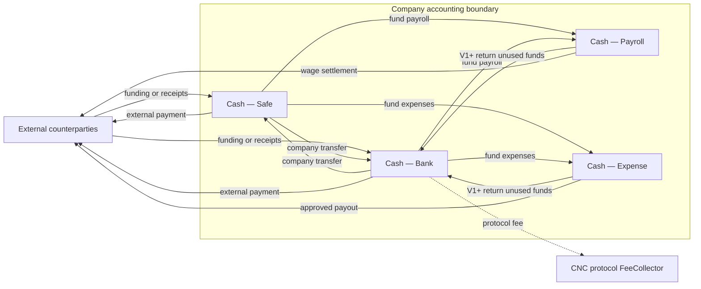
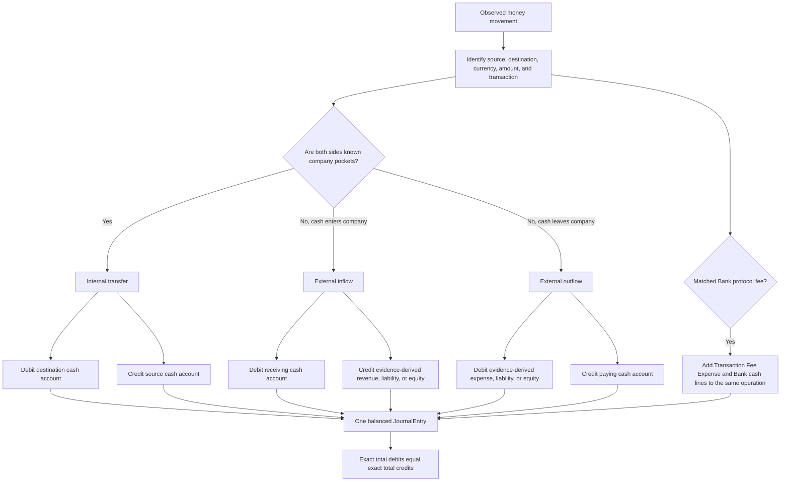
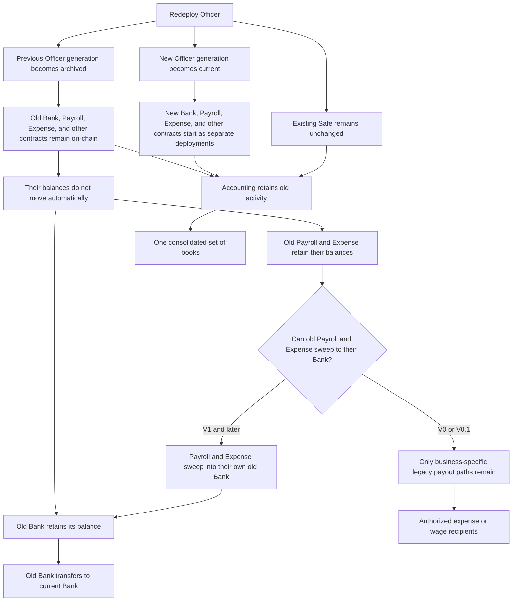
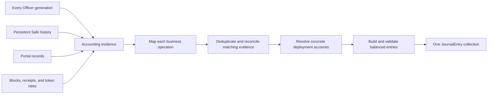
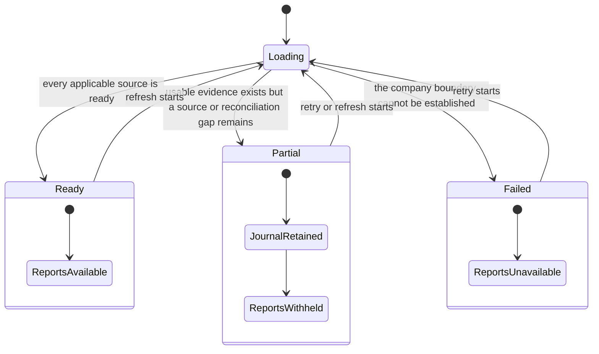
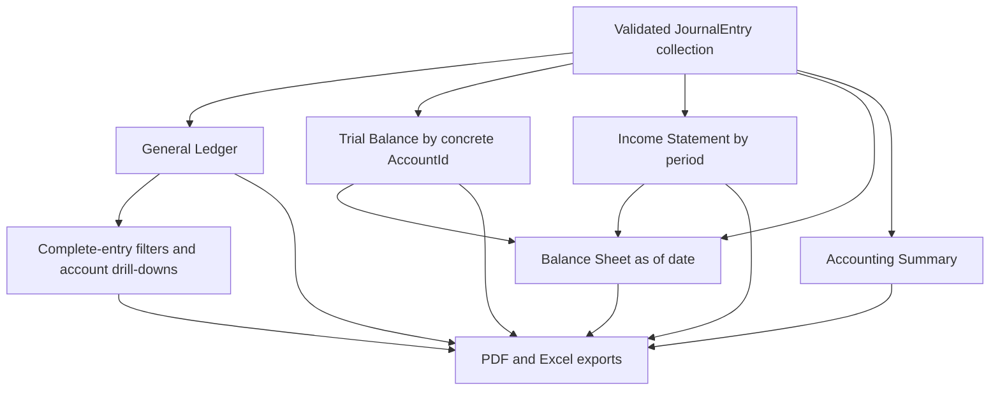

# Understanding Accounting Through Six Questions

**Scope:** A progressive explanation of the company Accounting model, from cash location to report derivation

**Last verified:** 2026-09-12

This guide uses two reading levels:

- **Business overview** answers the question without requiring implementation knowledge.
- **Technical detail** is linked only when treasury boundaries, contract generations, or journal assembly need deeper review.

The technical view is the canonical implementation reference. The business view is a smaller projection of the same current behaviour, not
an alternative model.

## 1. Where Can the Company's Money Sit and Move?

### Business Overview

Safe, Bank, Payroll, and Expense are company-owned cash pockets. A movement between two known company pockets changes where cash is held but
does not create revenue or expense. FeeCollector is outside this boundary: a Bank fee is a company `Transaction Fee Expense` and CNC
protocol revenue, not an internal transfer.

See the [technical treasury boundary](../../implementation/accounting-read-model/README.md#treasury-boundary-and-transfer-classification)
for deployment-specific pockets and the currently recognized Safe transaction shapes.

## 2. How Does a Movement Become a Balanced Journal Entry?

### Business Overview

For example, Safe to Payroll debits `Cash — Payroll` and credits `Cash — Safe`; Payroll to Bank debits `Cash — Bank` and credits
`Cash — Payroll`. Every filter, drill-down, and export keeps the complete entry so those two sides remain traceable together.

The [Accounting use-case catalogue](./journal-entry-catalogue.md) owns the complete booking rules and examples.

## 3. What Changes When the Contracts Are Redeployed?

### Business Overview

Redeployment creates new contracts; it does not upgrade the balances held by an older Officer generation. V1 and later Payroll and Expense
contracts can return all supported cash to the Bank of their own generation before that Bank transfers it to the current Bank. V0 and V0.1
do not expose that source-to-Bank sweep; only their business-specific expense-budget or wage-claim payout paths remain. Their Bank can still
transfer its own balance to the current Bank. Shareholder migration is a separate contract-management workflow and does not transfer
treasury cash.

See the
[technical generation lifecycle](../../implementation/accounting-read-model/README.md#contract-generation-lifecycle-and-cash-recovery) for
the ordered recovery paths and Accounting consequences.

## 4. How Does CNC Reconstruct One Journal From Every Source and Generation?

### Business Overview

Each Officer generation is scanned from its own deployment boundary. Safe and other Officer-less sources are added once, while portal
records, block timestamps, rates, receipts, and account assignments enrich the same assembly. The result is one journal, not one set of
books per generation.

See the [technical multi-generation assembly](../../implementation/accounting-read-model/README.md#multi-generation-source-assembly) for the
source registry, account-resolution, and reconciliation boundaries.

## 5. When Can the Books Be Trusted as Complete?

### Business Overview

Only `ready` represents final books. A failed generation scan, Safe page, receipt, timestamp, rate, or required portal source keeps
available entries internally but withholds every report. A source that does not apply to the company does not reduce completeness.

## 6. How Does the Journal Produce Every Report?

### Business Overview

Reports do not assemble independent accounting data. They project the same validated journal snapshot. Deployment-scoped accounts remain
separate General Ledger and Trial Balance identities, while internal transfers change cash location without changing total company cash or
profit and loss.

## Current Boundaries

- Safe outgoing evidence currently recognizes successful direct native transfers and decoded ERC-20 `transfer` calls. Complex MultiSend,
  module, or custom calls are not inferred as cash movements by this adapter.
- Closing cash balances are not yet reconciled with live on-chain balances.
- Historical Community Credit terms and SHER valuation inputs still use current-generation sources.

## Implementation Evidence

**Implementation evidence reviewed against:** `51b89731ae01941c367b49b2cf03f763693ea150`

- [Accounting data layer](../../../app/src/composables/accounting/useCNCAccounting.ts),
  [source completeness](../../../app/src/composables/accounting/useAccountingStatus.ts), and
  [Accounting assembly](../../../app/src/utils/accounting/assemble.ts)
- [Safe transaction adapter](../../../app/src/utils/accounting/safeTransfers.ts),
  [Safe mapper](../../../app/src/utils/accounting/mappers/safe.ts), [Payroll mapper](../../../app/src/utils/accounting/mappers/payroll.ts),
  and [Expense mapper](../../../app/src/utils/accounting/mappers/expenseAccount.ts)
- [Archived-generation cash recovery](../../../app/src/composables/cashOut/legacyGeneration.ts),
  [cash-out orchestration](../../../app/src/composables/cashOut/useCashOutAll.ts), and
  [Officer redeployment](../../../app/src/composables/contracts/useOfficerRedeploy.ts)
- [General Ledger and Trial Balance](../../../app/src/utils/accounting/generalLedger.ts),
  [Income Statement](../../../app/src/utils/accounting/incomeStatement.ts), and
  [Balance Sheet](../../../app/src/utils/accounting/balanceSheet.ts)

## Related Documentation

- [Accounting user stories](./README.md)
- [Accounting use-case catalogue](./journal-entry-catalogue.md)
- [Accounting Read Model](../../implementation/accounting-read-model/README.md)
- [Contract Management](../contract-management/README.md)

_[← Back to Accounting](./README.md)_
