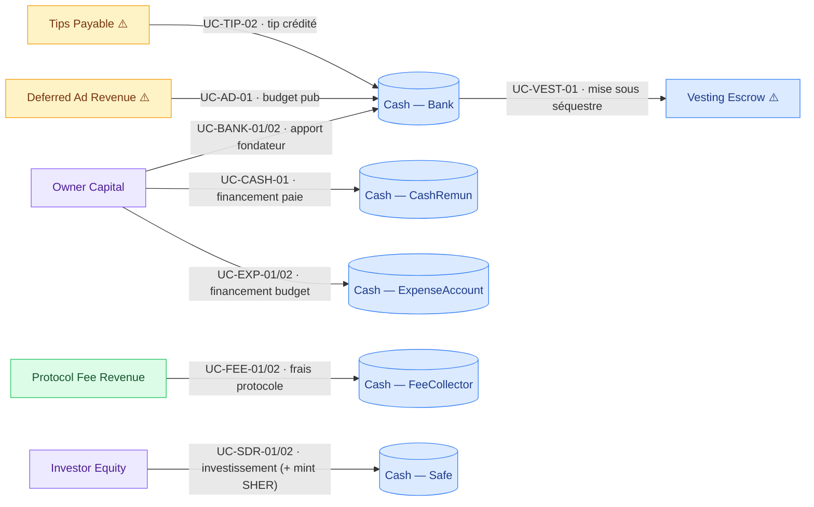
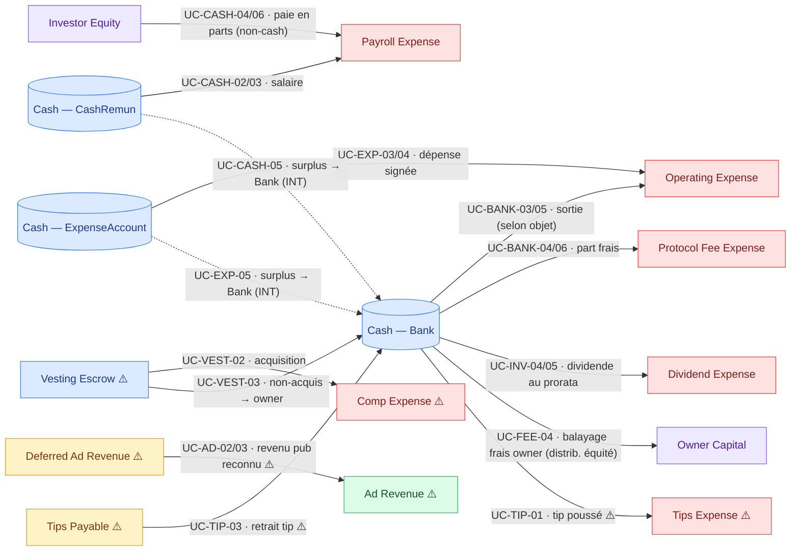
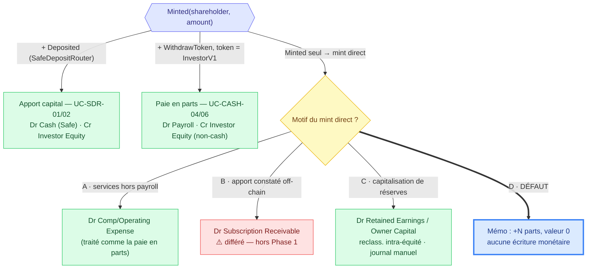
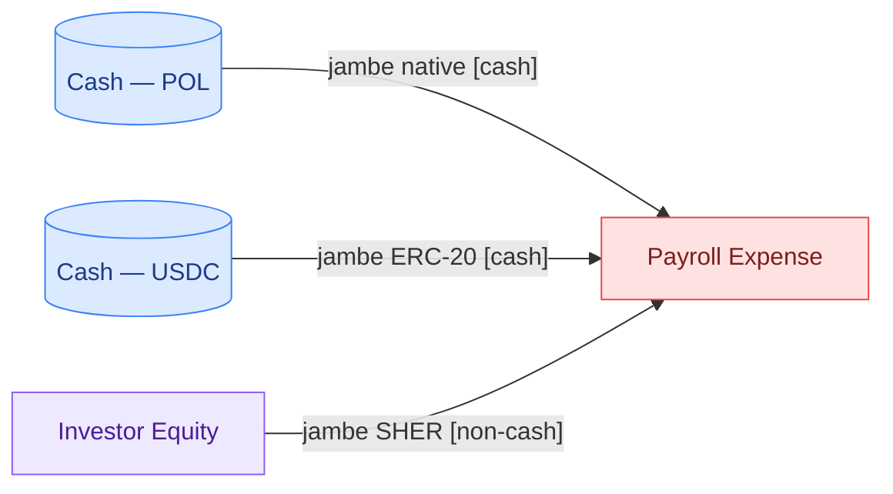
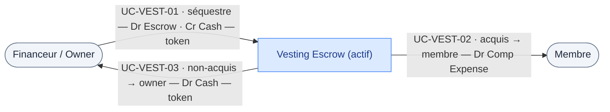

# CNC — Catalogue exhaustif des flux monétaires & réconciliation comptable

**Statut :** Draft (contrôle de complétude)

> **v1.1 (2026-06-14)** — Précisions issues de la revue des contrats : §3.3 récapitulatif consolidé des mints SHER (défaut **D** pour les mints directs), UC-CASH-04 reformulé en *paiement fondé sur des actions* au taux fixe du `SafeDepositRouter`, nouveau **UC-CASH-06** (claim multi-actifs), §3.4 vesting à deux régimes (cash vs SHER), et clarification de réconciliation « Σ `Minted` en parts, pas en valeur ».
> **Tracking :** Objectif [#1887](https://github.com/globe-and-citizen/cnc-portal/issues/1887) · Étapes [#2113](https://github.com/globe-and-citizen/cnc-portal/issues/2113) (treasury) · [#2114](https://github.com/globe-and-citizen/cnc-portal/issues/2114) (payroll/expense) · [#2115](https://github.com/globe-and-citizen/cnc-portal/issues/2115) (equity/fees) · Plan comptable [#2111](https://github.com/globe-and-citizen/cnc-portal/issues/2111) · Spec [#1890](https://github.com/globe-and-citizen/cnc-portal/issues/1890)

> **But du document.** Le pipeline #1887 mappe contrat par contrat vers le grand livre (#2113–#2115). Avant de faire confiance aux états financiers, il faut un **contrôle de complétude descendant** : un catalogue exhaustif de **chaque interaction monétaire** que les contrats CNC permettent, pour prouver que rien de ce qu'un CNC peut réellement faire ne manque dans les comptes. Des contrats qui déplacent de l'argent — `Tips`, `AdCampaignManager`, `Vesting` — n'apparaissent dans aucune des étapes #2113–#2115 : ce document les met en évidence.

---

## 0. Méthode — comment réaliser les critères d'acceptation (en suivant le schéma)

Ton schéma manuscrit se lit en **3 zones**, et chaque zone correspond à une étape de la méthode :

| Zone du schéma                                                                                                           | Signification comptable                                                            | Critère d'acceptation couvert                         |
| ------------------------------------------------------------------------------------------------------------------------ | ---------------------------------------------------------------------------------- | ----------------------------------------------------- |
| **1 – Flow de transaction de tout CNC** (Bank, Safe account, Expense account, Cash renumeration, My payroll, Sher token) | Les **points d'entrée/sortie** de chaque contrat                                   | C1 Inventaire · C2 Interactions                       |
| **2 – Actif du CNC** (Fees, Bank, Cash renumeration, Expense account, Safe account, Investor)                            | Les **comptes de trésorerie/actif** qui détiennent la valeur (« où est l'argent ») | C4 Plan comptable (côté actif)                        |
| **3 – Out du CNC** (Payroll history, Expense withdraw, Vesting, Dividend, Retrait owner)                                 | Les **sorties de valeur** → charges, distributions, dividendes                     | C4 Écritures (côté charge/équité) · C5 Réconciliation |

**Marche à suivre (5 étapes = les 5 critères) :**

1. **Inventorier les contrats** — partir des adresses déployées (`app/src/artifacts/deployed_addresses/chain-*.json`) et confirmer la liste réelle, pas la liste théorique. → §1
2. **Énumérer les interactions monétaires** — pour chaque contrat, lister tout point qui déplace de la valeur (deposit, withdraw, transfer, claim, pay, mint, dividend, fee, tip, refund). → §2
3. **Écrire les use cases** — un par interaction ; quand une interaction a des variantes (natif vs ERC-20, total vs partiel, succès vs revert/refund, unitaire vs batch), chaque variante est un use case. → §3
4. **Exercice comptable** — pour chaque use case, l'écriture (débit/crédit) alignée sur le plan comptable. → §3 (colonne écriture) + §4 (plan comptable)
5. **Réconciliation de couverture** — croiser chaque use case avec le grand livre / compte de résultat / bilan ; signaler toute interaction sans foyer comptable pour la booker ou l'exclure consciemment. → §5

**Convention de nommage** : chaque use case porte un identifiant `UC-<CONTRAT>-NN` réutilisable dans les issues d'implémentation et les tests.

---

## 1. Inventaire des contrats (C1)

Source : `app/src/artifacts/deployed_addresses/chain-31337.json` + `contract/contracts/`. Confirmé contre le déployé.

| #   | Contrat                    | Déplace de la valeur ? | Natif | ERC-20 | Indexé Ponder ?     | Périmètre entité CNC (spec §3) |
| --- | -------------------------- | ---------------------- | ----- | ------ | ------------------- | ------------------------------ |
| 1   | **Bank**                   | ✅                      | ✅     | ✅      | ✅                   | Trésorerie d'exploitation CNC  |
| 2   | **FeeCollector**           | ✅                      | ✅     | ✅      | ✅                   | Trésorerie des frais protocole |
| 3   | **CashRemunerationEIP712** | ✅                      | ✅     | ✅      | ✅                   | Paie CNC                       |
| 4   | **ExpenseAccountEIP712**   | ✅                      | ✅     | ✅      | ✅                   | Budget de dépenses CNC         |
| 5   | **InvestorV1**             | ✅                      | ✅     | ✅      | ✅                   | Capital / dividendes CNC       |
| 6   | **SafeDepositRouter**      | ✅                      | ❌     | ✅      | ✅ (topologie seule) | **Hors scope Phase 1**         |
| 7   | **Vesting**                | ✅                      | ❌     | ✅      | ❌ **non indexé**    | ⚠️ **Gap**                     |
| 8   | **Tips**                   | ✅                      | ✅     | ❌      | ❌ **non indexé**    | ⚠️ **Gap**                     |
| 9   | **AdCampaignManager**      | ✅                      | ✅     | ❌      | ❌ **non indexé**    | ⚠️ **Gap**                     |

Contrats déployés **qui ne déplacent pas de valeur** (gouvernance / topologie, exclus du catalogue) : `BoardOfDirectors`, `Proposals`, `Elections`, `Officer`, `Proxies`/beacons, `Voting`. `Officer` est lu (frais via `getFeeFor`) mais ne détient pas de fonds.

**Résultat C1 :** 9 contrats déplacent de la valeur. 5 sont déjà cadrés par #2113–#2115. **4 ne le sont pas** (SafeDepositRouter, Vesting, Tips, AdCampaignManager) — c'est le cœur du contrôle de complétude.

---

## 2. Interactions monétaires par contrat (C2)

Direction : **IN** (entrée), **OUT** (sortie), **INT** (transfert interne entre comptes CNC), **MINT** (création de parts).

### 2.1 Bank — trésorerie

| Fonction                      | Asset  | Direction                          | Appelant  | Frais ?            | Event                           |
| ----------------------------- | ------ | ---------------------------------- | --------- | ------------------ | ------------------------------- |
| `receive()`                   | natif  | IN                                 | quiconque | non                | `Deposited`                     |
| `depositToken()`              | ERC-20 | IN                                 | quiconque | non                | `TokenDeposited`                |
| `transfer()`                  | natif  | OUT (+ frais)                      | owner     | oui → FeeCollector | `Transfer` + `FeePaid`          |
| `transferToken()`             | ERC-20 | OUT (+ frais sur tokens éligibles) | owner     | oui (USDC/USDT)    | `TokenTransfer` + `FeePaid`     |
| `distributeNativeDividends()` | natif  | INT → InvestorV1                   | owner     | non                | `DividendDistributionTriggered` |
| `distributeTokenDividends()`  | ERC-20 | INT → InvestorV1                   | owner     | non                | `DividendDistributionTriggered` |

### 2.2 FeeCollector — frais protocole

| Fonction        | Asset          | Direction          | Appelant          | Event                         |
| --------------- | -------------- | ------------------ | ----------------- | ----------------------------- |
| `payFee()`      | natif          | IN                 | contrat facturant | `FeePaid`                     |
| `payFeeToken()` | ERC-20         | IN                 | contrat facturant | `FeePaid`                     |
| `receive()`     | natif          | IN                 | quiconque         | —                             |
| `withdraw()`    | natif + ERC-20 | OUT → bénéficiaire | owner             | `Withdrawn`, `TokenWithdrawn` |

### 2.3 CashRemunerationEIP712 — paie

| Fonction                   | Asset                                      | Direction  | Appelant              | Event                               |
| -------------------------- | ------------------------------------------ | ---------- | --------------------- | ----------------------------------- |
| `receive()`                | natif                                      | IN         | quiconque             | `Deposited`                         |
| `withdraw()`               | natif **ou** ERC-20 **ou** mint InvestorV1 | OUT / MINT | employé (claim signé) | `Withdraw` / `WithdrawToken`        |
| `ownerWithdrawAllToBank()` | natif + ERC-20                             | INT → Bank | owner                 | `OwnerTreasuryWithdrawNative/Token` |

### 2.4 ExpenseAccountEIP712 — budget de dépenses

| Fonction                   | Asset               | Direction  | Appelant                        | Event                               |
| -------------------------- | ------------------- | ---------- | ------------------------------- | ----------------------------------- |
| `receive()`                | natif               | IN         | quiconque                       | `Deposited`                         |
| `depositToken()`           | ERC-20              | IN         | quiconque                       | `TokenDeposited`                    |
| `transfer()`               | natif **ou** ERC-20 | OUT        | spender approuvé (budget signé) | `Transfer` / `TokenTransfer`        |
| `ownerWithdrawAllToBank()` | natif + ERC-20      | INT → Bank | owner                           | `OwnerTreasuryWithdrawNative/Token` |

### 2.5 InvestorV1 — capital & dividendes

| Fonction                      | Asset      | Direction                  | Appelant       | Event                                 |
| ----------------------------- | ---------- | -------------------------- | -------------- | ------------------------------------- |
| `receive()`                   | natif      | IN (financement dividende) | quiconque/Bank | —                                     |
| `distributeMint()`            | parts SHER | MINT (batch)               | owner          | `Minted`                              |
| `individualMint()`            | parts SHER | MINT (unitaire)            | MINTER_ROLE    | `Minted`                              |
| `distributeNativeDividends()` | natif      | OUT (au prorata)           | Bank           | `DividendDistributed`, `DividendPaid` |
| `distributeTokenDividends()`  | ERC-20     | OUT (au prorata)           | Bank           | `DividendDistributed`, `DividendPaid` |

### 2.6 SafeDepositRouter — investissement → mint SHER

| Fonction                | Asset  | Direction                                 | Appelant  | Event             |
| ----------------------- | ------ | ----------------------------------------- | --------- | ----------------- |
| `deposit()`             | ERC-20 | IN → Safe + MINT SHER                     | quiconque | `Deposited`       |
| `depositWithSlippage()` | ERC-20 | IN → Safe + MINT SHER (avec `minSherOut`) | quiconque | `Deposited`       |
| `recoverERC20()`        | ERC-20 | OUT (récupération)                        | owner     | `TokensRecovered` |

### 2.7 Vesting — acquisition différée *(non indexé)*

| Fonction        | Asset  | Direction                                   | Appelant       | Event                                 |
| --------------- | ------ | ------------------------------------------- | -------------- | ------------------------------------- |
| `addVesting()`  | ERC-20 | IN (mise sous séquestre)                    | owner d'équipe | `VestingCreated`                      |
| `release()`     | ERC-20 | OUT → membre                                | membre         | `TokensReleased`                      |
| `stopVesting()` | ERC-20 | OUT → membre **+** OUT → owner (non acquis) | owner d'équipe | `TokensReleased`, `UnvestedWithdrawn` |

### 2.8 Tips — pourboires *(non indexé)*

| Fonction     | Asset | Direction             | Appelant     | Event           |
| ------------ | ----- | --------------------- | ------------ | --------------- |
| `pushTip()`  | natif | OUT (push direct)     | quiconque    | `PushTip`       |
| `sendTip()`  | natif | IN (solde crédité)    | quiconque    | `SendTip`       |
| `withdraw()` | natif | OUT (retrait crédité) | bénéficiaire | `TipWithdrawal` |
| `receive()`  | natif | IN                    | quiconque    | —               |

### 2.9 AdCampaignManager — campagnes publicitaires *(non indexé)*

| Fonction                        | Asset | Direction                                                | Appelant              | Event                                                  |
| ------------------------------- | ----- | -------------------------------------------------------- | --------------------- | ------------------------------------------------------ |
| `createAdCampaign()`            | natif | IN (budget)                                              | annonceur             | `AdCampaignCreated`                                    |
| `claimPayment()`                | natif | OUT → Bank                                               | admin/owner           | `PaymentReleased`                                      |
| `requestAndApproveWithdrawal()` | natif | OUT → annonceur (non dépensé) **+** OUT → Bank (dépensé) | annonceur/admin/owner | `BudgetWithdrawn`, `PaymentReleasedOnWithdrawApproval` |
| `receive()`                     | natif | IN                                                       | quiconque             | —                                                      |

---

## 3. Use cases + exercice comptable (C3 + C4)

Écritures alignées sur le plan comptable §4. Devise = unité de token natif (mémo USD optionnel). **CNC = entité protocole** (spec §3) : les comptes d'équité « Owner Capital » et « Investor Equity » sont ceux du CNC.

> Légende : `Dr` = débit, `Cr` = crédit. Le compte **Cash — {token}** se décline ETH / USDC / USDT / Other.

### 3.1 Zone 1 & 2 — Entrées (financement de la trésorerie / actif)

> **Lecture du graphe :** la flèche va du compte **crédité** (origine de la valeur) vers le compte **débité** (emploi de la valeur) — c'est le sens du flux. Couleurs = classe de compte : 🟦 Actif · 🟪 Équité · 🟩 Produit · 🟥 Charge · 🟨 Passif (Actif/Passif/Équité → **Bilan** ; Charge/Produit → **Résultat**). `⚠️` = compte à créer (§4.2). Label d'arête = `UC · interaction`.

> `UC-INV-02/03` (mint direct) n'apparaît pas ci-dessus : **défaut D**, aucun flux monétaire (suivi des parts uniquement) — voir §3.3.

### 3.2 Zone 3 — Sorties (charges, distributions, dividendes, retraits)

> Même convention (crédité → débité). Arête **pointillée** = transfert interne entre comptes CNC (à éliminer en consolidation).

> Sans flux dans le graphe : `UC-INV-06` (échec de dividende → **mémo**) et `UC-SDR-03` (`recoverERC20` → ⚪ hors scope Phase 1).

**Variantes systématiques à tester** (chaque ligne ci-dessus se décline) :

- **Asset** : natif vs chaque ERC-20 whitelisté (USDC, USDT, USDCe, token d'équipe).
- **Issue** : succès vs **revert/refund** (ex. `withdraw` au-delà du budget, `DividendPaymentFailed`).
- **Cardinalité** : unitaire vs **batch** (`distributeMint`, dividendes multi-actionnaires, reste/poussière d'arrondi attribué au dernier actionnaire).
- **Frais** : token éligible aux frais (USDC/USDT) vs non éligible (frais non prélevé).

---

### 3.3 Mints SHER — récapitulatif consolidé (4 chemins, 1 seul `Minted`)

Tout mint crédite **toujours `Investor Equity` en parts** ; ce qui change, c'est le **débit** — la contrepartie de ce que l'entité reçoit. Quatre chemins produisent le même event `Minted(shareholder, amount)` ; l'indexeur les distingue par **corrélation dans la même transaction** :

**Valorisation (apport & paie).** Taux fixe du `SafeDepositRouter` (`multiplier`) : `SHER mintés = normalized(montant) × multiplier ÷ 10^sherDec`. Juste valeur d'un SHER (inverse) = `sherAmount × 10^sherDec ÷ multiplier`. La jambe paie est **taguée non-cash / equity-settled** et **exclue de l'identité PAYROLL_CASH** (aucun décaissement on-chain).

> **Règle Phase 1 :** tout `individualMint` / `distributeMint` direct → **défaut D** (suivi des parts, aucune écriture monétaire automatique). Le cas **C** est un journal manuel ponctuel, le jour où le board capitalise réellement des réserves. **Jamais d'auto-crédit d'équité sans débit économique réel.**

**UC-CASH-06 — claim multi-actifs (écriture composée).** Un seul `withdraw` boucle sur `Wage[]` et peut régler POL + USDC + SHER en **une transaction atomique** (tout réussit ou tout revert). Piège indexeur : USDC et SHER émettent **le même event `WithdrawToken`** — seul `tokenAddress == InvestorV1` distingue le **mint** (équité) du **cash out** (ERC-20).

Réconciliation **éclatée par jambe** : POL + USDC → **PAYROLL_CASH** ; SHER → **MINT_SHARES** (§5.2). Une même transaction alimente donc deux identités différentes.

### 3.4 Vesting — deux régimes selon le token séquestré

`Vesting` est un **escrow pré-financé** : `addVesting` transfère la **totalité** des tokens du financeur vers le contrat **dès le grant** (`transferFrom(msg.sender, address(this), totalAmount)`). La charge ne naît **pas** au grant (rien n'est encore acquis) mais **au `release`** (base caisse). Le token de l'équipe (`teams[teamId].token`) décide du régime — discriminant indexeur : `== InvestorV1` → Régime 2, sinon Régime 1.

**Régime 1 — token CASH (USDC…) : rémunération différée en cash.**

*(Cr Cash au grant = sortie de trésorerie ; ou Owner Capital si apport en nature de l'owner.)*

**Régime 2 — token SHER : paiement en actions différé (equity-settled).** Le SHER est minté en amont (défaut D, parts trésorerie sans valeur) puis bloqué.

- **UC-VEST-01** : déplacement parts trésorerie → escrow = **mémo, pas d'écriture**.
- **UC-VEST-02** (*point de reconnaissance*) : `Dr Comp Expense · Cr Investor Equity` au taux fixe, **non-cash** — c'est UC-CASH-04 déclenché par `release`.
- **UC-VEST-03** non-acquis : retour parts en trésorerie = **mémo**.

> **Prérequis bloquant :** `Vesting` n'est **pas indexé** par Ponder (§1). Aucune de ces écritures n'est possible avant d'ajouter un indexeur pour `VestingCreated` / `TokensReleased` / `UnvestedWithdrawn` / `VestingStopped`.

---

## 4. Plan comptable (C4) — référence et extensions nécessaires

### 4.1 Plan comptable existant (spec §5 / #2111)

ACTIF : `Cash — ETH/USDC/USDT/Other`, `Protocol Fee Receivable` · ÉQUITÉ : `Investor Equity`, `Retained Earnings`, `Owner Capital / Treasury` · PRODUITS : `Protocol Fee Revenue` · CHARGES : `Payroll Expense`, `Operating Expense`, `Infra Expense`, `Interest Expense`, `Dividend Expense`, `Protocol Fee Expense`.

**Note de consolidation (spec §5)** : `bank_fee_paid` (charge côté Bank, UC-BANK-04/06) et `fee_collector_fee_paid` (produit côté FeeCollector, UC-FEE-01/02) sont **le même événement économique**. Au niveau **protocole**, reconnaître le **produit au FeeCollector uniquement** et traiter la jambe Bank comme transfert inter-comptes (à éliminer en consolidation).

### 4.2 Comptes manquants révélés par le contrôle de complétude ⚠️

Le plan actuel **ne couvre pas** 4 contrats. Comptes à ajouter (ou exclusion à acter) :

| Compte proposé                                                   | Classe  | Solde normal | Utilisé par          |
| ---------------------------------------------------------------- | ------- | ------------ | -------------------- |
| **Tips Payable**                                                 | PASSIF  | Crédit       | UC-TIP-02, UC-TIP-03 |
| **Tips Expense**                                                 | CHARGE  | Débit        | UC-TIP-01            |
| **Deferred Ad Revenue** (produit constaté d'avance)              | PASSIF  | Crédit       | UC-AD-01, UC-AD-03   |
| **Ad Revenue**                                                   | PRODUIT | Crédit       | UC-AD-02, UC-AD-03   |
| **Vesting Escrow**                                               | ACTIF   | Débit        | UC-VEST-01/02/03     |
| **Deferred Compensation** (optionnel, comptabilité d'engagement) | PASSIF  | Crédit       | UC-VEST-01           |

> Le plan comptable n'a **aucune classe PASSIF** aujourd'hui (bilan Phase 1 : « Liabilities = 0 »). Or `Tips.sendTip`, `AdCampaignManager.createAdCampaign` et le vesting créent **de véritables obligations envers des tiers**. C'est la principale lacune structurelle.

---

## 5. Réconciliation de couverture (C5)

Croisement de **chaque use case** contre l'état financier qui l'accueille. Statut :
✅ **Booké** (indexé + règle dans spec §6) · 🟡 **À booker** (interaction réelle, indexée, mais pas de règle explicite) · 🔴 **Lacune** (non indexé → aucun foyer comptable) · ⚪ **Exclu consciemment** (hors périmètre entité CNC).

| UC               | Foyer comptable                   | GL  | Compte de résultat | Bilan | Statut                                                                     |
| ---------------- | --------------------------------- | --- | ------------------ | ----- | -------------------------------------------------------------------------- |
| UC-FEE-01/02     | Protocol Fee Revenue              | ✅   | ✅                  | ✅     | ✅ Booké                                                                    |
| UC-FEE-04        | Owner Capital ↓                   | ✅   | —                  | ✅     | ✅ Booké                                                                    |
| UC-BANK-01/02    | Owner Capital                     | ✅   | —                  | ✅     | ✅ Booké                                                                    |
| UC-BANK-03/05    | Cash out                          | ✅   | selon objet        | ✅     | 🟡 À qualifier (objet du transfert)                                        |
| UC-BANK-04/06    | Protocol Fee Expense              | ✅   | ✅                  | —     | ✅ Booké (élim. conso)                                                      |
| UC-BANK-07/08    | Financement dividende             | ✅   | —                  | ✅     | 🟡 À booker (transfert INT vers InvestorV1)                                |
| UC-CASH-01       | Owner Capital                     | ✅   | —                  | ✅     | ✅ Booké                                                                    |
| UC-CASH-02/03    | Payroll Expense                   | ✅   | ✅                  | ✅     | ✅ Booké                                                                    |
| UC-CASH-04 / 06  | Payroll Expense + Investor Equity | ✅   | ✅                  | ✅     | 🟡 Paiement fondé sur des actions (non-cash, exclu de PAYROLL_CASH — §3.3) |
| UC-CASH-05       | Transfert INT → Bank              | ✅   | —                  | ✅     | ✅ Booké (Owner treasury withdraw)                                          |
| UC-EXP-01/02     | Owner Capital                     | ✅   | —                  | ✅     | ✅ Booké                                                                    |
| UC-EXP-03/04     | Operating Expense                 | ✅   | ✅                  | ✅     | ✅ Booké                                                                    |
| UC-EXP-05        | Transfert INT → Bank              | ✅   | —                  | ✅     | ✅ Booké                                                                    |
| UC-INV-02/03     | Mémo parts (défaut D)             | 🟡  | —                  | 🟡    | 🟡 Parts suivies, valeur non bookée (défaut D — §3.3)                      |
| UC-INV-04/05     | Dividend Expense                  | ✅   | ✅                  | ✅     | ✅ Booké                                                                    |
| UC-INV-06        | Mémo (échec)                      | 🟡  | —                  | —     | 🟡 À journaliser en note                                                   |
| UC-SDR-01/02/03  | Investor Equity / Cash            | —   | —                  | ✅     | ⚪ Exclu Phase 1 (topologie seule)                                          |
| UC-VEST-01/02/03 | Vesting Escrow / Comp Expense     | 🔴  | 🔴                 | 🔴    | 🔴 **Lacune — non indexé**                                                 |
| UC-TIP-01/02/03  | Tips Expense / Tips Payable       | 🔴  | 🔴                 | 🔴    | 🔴 **Lacune — non indexé**                                                 |
| UC-AD-01/02/03   | Ad Revenue / Deferred Ad Revenue  | 🔴  | 🔴                 | 🔴    | 🔴 **Lacune — non indexé**                                                 |

### 5.1 Synthèse des lacunes à arbitrer

1. **Vesting** (UC-VEST-) — rémunération différée en tokens : ni indexeur Ponder, ni compte. **Décision attendue** : indexer + ajouter `Vesting Escrow` / `Deferred Compensation`, ou exclure explicitement (et documenter pourquoi le coût de la paie en vesting n'apparaît pas).
2. **Tips** (UC-TIP-) — flux natif réel avec solde crédité (passif). **Décision** : indexer + comptes `Tips Payable`/`Tips Expense`, ou exclure.
3. **AdCampaignManager** (UC-AD-) — **produit** potentiel (revenu publicitaire) + passif (produit constaté d'avance). **Décision** : indexer ; c'est le seul flux de **revenu** non-frais → impact direct sur le compte de résultat s'il est réel.
4. **Absence de classe PASSIF** dans le plan comptable — bloquant pour Tips, Ad, et le vesting en comptabilité d'engagement.
5. **UC-BANK-03/05** (transferts génériques Bank) — l'objet (charge ? remboursement ? transfert vers un autre contrat CNC ?) n'est pas déductible de l'event seul ; nécessite une **table de contreparties** (`accountingIdentities`) pour qualifier le débit.

### 5.2 Identités de réconciliation à étendre

Aux 8 identités de la spec §8, ce catalogue ajoute :

- **TIPS_CASH** : Σ `sendTip` − Σ `withdraw` (Tips) = solde `Tips Payable` on-chain.
- **AD_BUDGET** : Σ `createAdCampaign` − Σ (`claimPayment` + refunds) = budget résiduel on-chain de `AdCampaignManager`.
- **VESTING_ESCROW** : Σ `addVesting` − Σ `release` − Σ unvested-withdrawn = tokens encore sous séquestre.
- **MINT_SHARES** : Σ `Minted` (InvestorV1) = total supply SHER on-chain — **identité en parts, pas en valeur**. La valeur d'`Investor Equity` bookée n'inclut que les mints à contrepartie réelle (apport SDR, paie UC-CASH-04/06, capitalisation C) ; les mints directs en défaut D suivent les parts à **valeur nulle**.

---

## 6. Conclusion — état des critères d'acceptation

| Critère                               | Couverture                                                                                                              |
| ------------------------------------- | ----------------------------------------------------------------------------------------------------------------------- |
| **C1 — Inventaire des contrats**      | ✅ 9 contrats à valeur identifiés vs déployé (§1)                                                                        |
| **C2 — Interactions monétaires**      | ✅ ~30 points d'entrée/sortie listés (§2)                                                                                |
| **C3 — Use cases**                    | ✅ ~40 use cases `UC-`* (dont UC-CASH-06 claim multi-actifs) + §3.3 récap mints (défaut D) / §3.4 vesting à deux régimes |
| **C4 — Exercice comptable**           | ✅ Écriture par use case + 6 comptes manquants identifiés (§3, §4)                                                       |
| **C5 — Réconciliation de couverture** | ✅ Chaque UC tracé vers GL/IS/BS ; 3 contrats signalés comme lacunes + 3 nouvelles identités (§5)                        |

**Verdict de complétude :** le pipeline #2113–#2115 couvre correctement Bank, FeeCollector, CashRemuneration, ExpenseAccount et InvestorV1. **Trois contrats déplacent réellement de la valeur sans aucun foyer comptable aujourd'hui — Vesting, Tips, AdCampaignManager** — et le plan comptable manque d'une classe PASSIF. Ces points doivent être soit indexés et bookés, soit explicitement exclus avec justification.