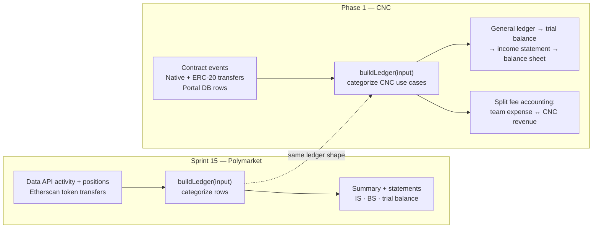

# CNC Accounting — Spec & Scope (Phase 1)

This document defines the **scope** and **spec** for CNC accounting: treating the CNC as a
company and producing its financial statements (general ledger → income statement →
balance sheet) from data **already available** on-chain and in the portal, reusing the
Sprint 15 pipeline. The shared `FeeCollector` is the CNC protocol's global treasury:
each team pays a usage fee into it when using CNC services.

It builds on the [money-flow catalogue](./money-flow-catalogue.md), which establishes the
chart of accounts and the use-case → journal-entry mapping. This spec answers the next
question: **which concrete data sources we already have feed those entries, and what is
still missing.**

---

## 1. Scope

### In scope — the CNC's own books

We keep **one consolidated set of books for the CNC entity**: its treasury contracts plus
its equity contract (see [money-flow-catalogue §1](./money-flow-catalogue.md)). Phase 1
produces the three statements from data we **already capture today** — on-chain contract
activity and portal records — with no new data collection required to get a first end-to-end
result.

### Explicitly out of scope (deferred)

- **Polymarket / GC:Trader activity.** A CNC team effectively has a GC:Trader account, so
  the CNC's _total_ accounting should eventually fold in the GC:Trader (Polymarket) books.
  This is **deferred** — both because of effort and because the surface for Polymarket
  accounting (a GC:Trader project vs. a dedicated app) is itself undecided
  ([#2078](https://github.com/globe-and-citizen/cnc-portal/issues/2078)). In the worked
  example the `Trading account` / `Trading Gain` / `Trading Loss` lines stand in for an
  external trader at cost; the live Polymarket position feed is **not** consolidated here.
- **Governance / wiring contracts** that move no money: `BoardOfDirectors`, `Proposals`,
  `Elections`, `Officer`, `Voting`, proxies/beacons. `Officer` is read-only (fee lookup).
- **Deployed-but-unused contracts.** Only contracts the CNC actually uses are catalogued.

### Reporting boundary

| Question            | Phase 1 answer                                                                                                                                                                                                                                                                                                                 |
| ------------------- | ------------------------------------------------------------------------------------------------------------------------------------------------------------------------------------------------------------------------------------------------------------------------------------------------------------------------------ |
| Entity              | The CNC protocol entity (global fee treasury + equity contracts), with a separate operational ledger for each team's contract set.                                                                                                                                                                                             |
| Per-team vs. global | **Both layers** — team activity is attributed per team, while the shared `FeeCollector` is global. A team-to-CNC usage fee is a cross-entity charge, not an internal move within the team.                                                                                                                                     |
| Currency            | USD reporting currency. **POL** at its current live price (CoinGecko); **SHER** at the router multiplier — a withdrawal frozen at its own date, a pending accrual floating at the current rate; **USDC/USDT** pegged $1. See [catalogue → Currency & valuation](./money-flow-catalogue.md#currency--valuation-rate-of-record). |
| Period              | A reporting period (the worked example uses 1–28 March 2026).                                                                                                                                                                                                                                                                  |
| Basis               | Payroll = **accrual** (`Wage Payable` / `Shares to be issued`); everything else = **cash basis**.                                                                                                                                                                                                                              |

---

## 2. Reusing the Sprint 15 pipeline

Sprint 15 ([#1862](https://github.com/globe-and-citizen/cnc-portal/issues/1862)) built a
pipeline that reconstructs accounting for a Polymarket wallet from raw feeds. The shape is
reusable; only the **feeds** and the **categorisation** change.



Concretely, the existing `buildLedger` / `LedgerEntry` / `AccountingSummary` model in
`[dashboard/app/utils/accounting.ts](../../../dashboard/app/utils/accounting.ts)` and the
statement components in
`[dashboard/app/components/accounting/](../../../dashboard/app/components/accounting/)`
(`AccountingLedger`, `AccountingTrialBalance`, `AccountingIncomeStatement`,
`AccountingBalanceSheet`) are the target rendering layer. Phase 1 work is to:

1. Add **CNC feeds** (contract events + the portal DB rows) alongside the existing
   transfer proxy.
2. Replace the Polymarket `LedgerCategory` set with the CNC **use-case categories** from
   the money-flow catalogue (`UC-BANK-01…`, `UC-CASH-02/03`, `UC-EXP-01`, `UC-INV-01`,
   `UC-SDR-01`, team funding moves, and cross-entity fee payments).
3. Map each entry to its **debit/credit accounts** per [catalogue §5](./money-flow-catalogue.md)
   and let the existing trial-balance / IS / BS components roll them up.

---

## 3. Data inventory — what we already have

Two source families feed the ledger today.

### 3.1 On-chain (events + transfers)

Every monetary interaction in [catalogue §3](./money-flow-catalogue.md) emits an event, and
every value move is also an on-chain transfer. Source of truth = the chain; the dashboard
already proxies transfer history via
`[server/api/polygonscan/transfers.get.ts](../../../dashboard/server/api/polygonscan/transfers.get.ts)`
(Etherscan API V2, native + ERC-20). Contract addresses come from
`app/src/artifacts/deployed_addresses/` and the `TeamContract` table.

| Contract                   | Key events available                                                                        | What it tells the ledger                                                                  |
| -------------------------- | ------------------------------------------------------------------------------------------- | ----------------------------------------------------------------------------------------- |
| **Bank**                   | `Deposited`, `TokenDeposited`, `Transfer`, `TokenTransfer`, `DividendDistributionTriggered` | Deposits in, transfers out (+ fee), dividend funding, internal funding of payroll/expense |
| **FeeCollector**           | `FeePaid`, `Withdrawn`, `TokenWithdrawn`                                                    | Fees paid by team contracts into the global CNC treasury, and fee-treasury withdrawals    |
| **CashRemunerationEIP712** | `Deposited`, `Withdraw`, `WithdrawToken`, `OwnerTreasuryWithdraw`\*                         | Payroll funding, wage withdrawals (cash / token / SHER mint)                              |
| **ExpenseAccountEIP712**   | `Deposited`, `TokenDeposited`, `Transfer`, `TokenTransfer`, `OwnerTreasuryWithdraw`\*       | Expense-budget funding and approved payouts                                               |
| **InvestorV1**             | `Minted`, `DividendDistributed`, `DividendPaid`                                             | SHER mints (3 paths), pro-rata dividend distribution                                      |
| **SafeDepositRouter**      | `Deposited`                                                                                 | Invest → SHER mint (cash lands in Safe)                                                   |

> The `**Minted` event** alone is ambiguous (capital raise vs. wage-in-shares vs. direct
> mint) — it must be correlated with `Deposited` (SafeDepositRouter) or `WithdrawToken`
> (CashRemuneration) to pick the right journal entry, per
> [catalogue §5.4](./money-flow-catalogue.md). A `Minted` with neither is **Default D** —
> a direct mint booked **Dr Shares to be issued · Cr Investor Equity\*\* at the SHER rate.

### 3.2 Portal database (accrual + classification context)

The chain records _when money moved_; the portal records _what it was for_ and the accrual
side payroll needs. From `[backend/prisma/schema.prisma](../../../backend/prisma/schema.prisma)`:

| Model            | Feeds                                                            | Notes                                                                                                               |
| ---------------- | ---------------------------------------------------------------- | ------------------------------------------------------------------------------------------------------------------- |
| **Wage**         | rate per hour (cash / usdc / token), overtime, active-wage chain | Defines the per-member cost basis used to value claims                                                              |
| **WeeklyClaim**  | `status`, `weekStart`, signature, `signedAgainstContractAddress` | The **accrual trigger**: a signed weekly claim is the "wage earned" event (UC-CASH-02) before the on-chain withdraw |
| **Claim**        | hours/minutes worked, memo, attachments                          | Detail behind a weekly claim; supports the payroll-expense amount                                                   |
| **Expense**      | `data` (JSON), `status`, signature, `userAddress`                | The approved budget / category context behind an ExpenseAccount payout (UC-EXP-01)                                  |
| **TeamContract** | contract `address`, `type`, `teamId`                             | Resolves which on-chain addresses belong to which team's books                                                      |

> The **accrual gap** matters: a wage is _earned_ when the weekly claim is signed (portal,
> UC-CASH-02) but _paid_ when the employee withdraws (chain, UC-CASH-03). Booking both
> requires joining the portal `WeeklyClaim`/`Claim` rows to the on-chain `Withdraw` /
> `WithdrawToken` events.

---

## 4. Source → statement line-item mapping

Each available source maps to a journal entry (catalogue §5) and thus to a statement line.
**IS** = income statement, **BS** = balance sheet.

| Source (event / record)                                          | Use case   | Journal entry                                                                                          | Statement line(s)                                                       |
| ---------------------------------------------------------------- | ---------- | ------------------------------------------------------------------------------------------------------ | ----------------------------------------------------------------------- |
| Bank `Deposited` / `TokenDeposited` from a founder (no shares)   | UC-BANK-01 | Dr Cash — Bank · Cr Owner Capital                                                                      | BS: Cash ↑, Owner Capital ↑                                             |
| Bank `Deposited` / `TokenDeposited` from a client                | UC-BANK-02 | Dr Cash — Bank · Cr Service Revenue                                                                    | IS: Service Revenue; BS: Cash ↑                                         |
| SafeDepositRouter `Deposited` + InvestorV1 `Minted`              | UC-SDR-01  | Dr Cash — Safe · Cr Investor Equity                                                                    | BS: Cash ↑, Investor Equity ↑                                           |
| Bank `Transfer` / `TokenTransfer` (fund payroll/expense)         | UC-BANK-03 | Dr Cash — Payroll/Expense · Cr Cash — Bank                                                             | BS: internal team cash move (no IS impact)                              |
| WeeklyClaim signed (portal)                                      | UC-CASH-02 | Dr Payroll Expense · Cr Wage Payable · Cr Shares to be issued                                          | IS: Payroll Expense; BS: liabilities ↑                                  |
| CashRemuneration `Withdraw` / `WithdrawToken` (+ `Minted`)       | UC-CASH-03 | Dr Wage Payable · Cr Cash — Payroll · Dr Shares to be issued · Cr Investor Equity                      | BS: liability settled, Cash ↓, Investor Equity ↑                        |
| ExpenseAccount `Transfer` / `TokenTransfer` (+ Expense record)   | UC-EXP-01  | Dr Operating Expense · Cr Cash — Expense                                                               | IS: Operating Expense; BS: Cash ↓                                       |
| Bank `DividendDistributionTriggered` / InvestorV1 `DividendPaid` | UC-INV-01  | Dr Dividend Expense · Cr Cash — Bank                                                                   | IS: Dividend Expense; BS: Cash ↓                                        |
| InvestorV1 `Minted` alone (direct mint)                          | Default D  | Dr Shares to be issued · Cr Investor Equity (at the SHER rate, frozen at mint date)                    | BS: Investor Equity ↑ (unbacked mint drives Shares to be issued contra) |
| Bank transfer + FeeCollector `FeePaid` (team usage fee)          | UC-FEE-01  | Team: Dr CNC Usage Fee Expense · Cr Cash — Bank; CNC: Dr Cash — FeeCollector · Cr Protocol Fee Revenue | Team IS: expense; CNC IS: protocol-fee revenue; both BS: cash movement  |

> **Trading lines** (`Trading account`, `Trading Gain`, `Trading Loss`, UC-TRD-) are in the
> chart of accounts and the worked example, but their live feed is the deferred
> Polymarket/GC:Trader integration — see §1. In Phase 1 they are only exercised by manual /
> dogfood entries, not an automated source.

---

## 5. How fees and expenses are booked

### 5.1 Fees

A fee on a Bank transfer is paid by the team's `Bank` to the shared global `FeeCollector`.
It is therefore a **cross-entity charge**, not an internal move within the team. The team
books a CNC usage expense; the CNC protocol books protocol-fee revenue.

```
TEAM BOOKS
Dr CNC Usage Fee Expense   (fee)
   Cr Cash — Bank          (fee)

CNC BOOKS
Dr Cash — FeeCollector     (fee)
   Cr Protocol Fee Revenue (fee)
```

The `FeePaid` event identifies the contract type and payer. The payer's `TeamContract`
association supplies the team attribution for the team-side expense, while the
`FeeCollector` event supplies the CNC-side revenue and cash entry.

### 5.2 Expense categories

Expenses are recognised **cash basis** (when paid), Dr `Operating Expense` · Cr the funding
pocket. The goal issue calls out explicit categories so the income statement breaks expenses
down rather than lumping them into one line:

| Category                       | What it covers                          | Source today                                                    | Phase                                               |
| ------------------------------ | --------------------------------------- | --------------------------------------------------------------- | --------------------------------------------------- |
| **Payroll**                    | Wages earned by members (accrual)       | `Wage` / `WeeklyClaim` / `Claim` + CashRemuneration events      | Phase 1 (`Payroll Expense`)                         |
| **Operating (ExpenseAccount)** | Approved member expense payouts         | `Expense` record + ExpenseAccount `Transfer`                    | Phase 1 (`Operating Expense`)                       |
| **Ponder (infra)**             | Indexer / hosting / infrastructure cost | **not captured on-chain** — paid off-platform                   | Phase 2                                             |
| **Debt (interest)**            | Cost of borrowing from the members      | FixedReturn (Community Credit) events + `getLendingOffer` terms | Phase 1 (`Interest Expense`, recognised at funding) |

Phase 1 books **payroll**, **operating** and **debt (interest)** expenses from existing data.
**Ponder (infra)** is named here for the chart of accounts but has no data feed yet — it is a
gap (§6). Until then it requires manual journal entries if reported at all.

---

## 6. Gaps — data a complete company accounting needs (Phase 2)

What complete company accounting needs that we **don't yet capture**:

| Gap                                               | Why it matters                                                                                                                    | Proposed Phase 2 capture                                                                                                                                                                                                                                                                                                                                                                                                                                                                                                                                                                                                                                                                                                                                                                                                                                                                                                                                                                                                                                                                                                                                                                                                                                                                                                                                                                                                                                                                                                                                                                                                                                                                                                                                    |
| ------------------------------------------------- | --------------------------------------------------------------------------------------------------------------------------------- | ----------------------------------------------------------------------------------------------------------------------------------------------------------------------------------------------------------------------------------------------------------------------------------------------------------------------------------------------------------------------------------------------------------------------------------------------------------------------------------------------------------------------------------------------------------------------------------------------------------------------------------------------------------------------------------------------------------------------------------------------------------------------------------------------------------------------------------------------------------------------------------------------------------------------------------------------------------------------------------------------------------------------------------------------------------------------------------------------------------------------------------------------------------------------------------------------------------------------------------------------------------------------------------------------------------------------------------------------------------------------------------------------------------------------------------------------------------------------------------------------------------------------------------------------------------------------------------------------------------------------------------------------------------------------------------------------------------------------------------------------------------- |
| **Infra / Ponder cost**                           | A real expense paid off-platform (indexer, hosting) never hits a CNC contract, so it's invisible to an on-chain ledger            | Manual expense entry or an off-chain bill record feeding `Operating Expense — Infra`                                                                                                                                                                                                                                                                                                                                                                                                                                                                                                                                                                                                                                                                                                                                                                                                                                                                                                                                                                                                                                                                                                                                                                                                                                                                                                                                                                                                                                                                                                                                                                                                                                                                        |
| **Debt & interest** _(resolved)_                  | Borrowed money must raise a liability, and the cost of borrowing must land in the period that earned it, not the one that paid it | **Done:** Community Credit (`FixedReturn.sol`) is the borrowing feature, wired through the `mappers/fixedReturn` source mapper. The credit contract is treated as **external** to the books: a lender's deposit is not the team's money while the offer is still filling, so it is not posted. The loan is recognised only when the round **funds** and the principal actually lands in the Bank — `Dr Cash — Bank · Cr Loan Payable` (`UC-CREDIT-01`), one leg per lender so the journal still reads who is owed — and `Loan Payable` is debited as principal is repaid (`UC-CREDIT-03`). This keeps one posting where the old model wrote two (a deposit into a `Cash — Credit` pocket, then an internal sweep of that same money out to Bank). A round that never funds and is refunded to its lenders produces **no posting at all** — the deposits were never the team's money. The fixed return is recognised **in full the moment the round funds** (`UC-CREDIT-05`, `Dr Interest Expense · Cr Interest Payable`, one posting per lender — see `mappers/creditTimeline`), because `repayLenders` fixes the obligation at `totalFunded × (1 + rate)` and never prorates it: settling early still costs the whole flat fee, so spreading it across the term would understate the debt every day until maturity. A repayment then clears `Interest Payable`; only a fee that was never recognised falls through to `Interest Expense` at payment. The rate does not reach the mapper through the event feed, so it is read from `getLendingOffer`; without that read the mapper falls back to expensing the fixed return at payment. Wording: a "borrowing round," not "debt issuance" — members lend to their own team, nothing is issued to a market. |
| **Team/CNC fee attribution** _(resolved)_         | Team usage fees must be split between the paying team's expense and the CNC protocol's revenue                                    | **Done:** `FeePaid.payer` is joined to `TeamContract`; the team books `CNC Usage Fee Expense`, and the global `FeeCollector` books `Protocol Fee Revenue`                                                                                                                                                                                                                                                                                                                                                                                                                                                                                                                                                                                                                                                                                                                                                                                                                                                                                                                                                                                                                                                                                                                                                                                                                                                                                                                                                                                                                                                                                                                                                                                                   |
| **FX / price-of-record** _(resolved)_             | POL→USD and SHER valuation need a defined rate source                                                                             | **Done:** POL at the current live price (CoinGecko), SHER at the router multiplier (withdrawal frozen at its date, pending accrual floats). Remaining: both refresh on the query lifecycle, not auto-watched on-chain — a live-refresh (block / `MultiplierUpdated`) is still open.                                                                                                                                                                                                                                                                                                                                                                                                                                                                                                                                                                                                                                                                                                                                                                                                                                                                                                                                                                                                                                                                                                                                                                                                                                                                                                                                                                                                                                                                         |
| **Cost classification of expenses**               | `Expense.data` JSON has category context but it isn't normalised into accounting categories                                       | Map `Expense.data` categories → chart-of-accounts expense lines                                                                                                                                                                                                                                                                                                                                                                                                                                                                                                                                                                                                                                                                                                                                                                                                                                                                                                                                                                                                                                                                                                                                                                                                                                                                                                                                                                                                                                                                                                                                                                                                                                                                                             |
| **Polymarket / GC:Trader consolidation**          | The CNC's _total_ result should fold in trading P&L                                                                               | Deferred — surface (GC:Trader project vs. dedicated app) undecided ([#2078](https://github.com/globe-and-citizen/cnc-portal/issues/2078))                                                                                                                                                                                                                                                                                                                                                                                                                                                                                                                                                                                                                                                                                                                                                                                                                                                                                                                                                                                                                                                                                                                                                                                                                                                                                                                                                                                                                                                                                                                                                                                                                   |
| **Period close / retained earnings roll-forward** | Multi-period reporting needs net income to close into retained earnings                                                           | Define period boundaries and a close step in the pipeline                                                                                                                                                                                                                                                                                                                                                                                                                                                                                                                                                                                                                                                                                                                                                                                                                                                                                                                                                                                                                                                                                                                                                                                                                                                                                                                                                                                                                                                                                                                                                                                                                                                                                                   |
| **Real-money dogfood validation**                 | Statements are validated against a worked example, not live data                                                                  | Deposit + invest in ETH as a team (per goal issue) to generate real data and validate end to end                                                                                                                                                                                                                                                                                                                                                                                                                                                                                                                                                                                                                                                                                                                                                                                                                                                                                                                                                                                                                                                                                                                                                                                                                                                                                                                                                                                                                                                                                                                                                                                                                                                            |

---

## 7. Deliverables checklist (this spec)

- [x] **Scope confirmed** — CNC's own books only; Polymarket / GC:Trader excluded (§1).
- [x] **Data inventory** — on-chain events + transfers and portal DB rows that feed GL/IS/BS,
  ```
  reusing the Sprint 15 pipeline (§2–§3).
  ```
- [x] **Source → statement-line mapping** — each available source mapped to a journal entry
  ```
  and statement line (§4).
  ```
- [x] **Fees & expenses booking** — team CNC usage fees as cross-entity charges; expense categories incl. Ponder
  ```
  (infra), payroll, debt (interest) (§5).
  ```
- [x] **Gaps listed** — what complete company accounting needs that we don't yet capture (§6).
