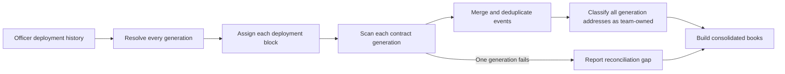

# Accounting History Across Contract Migrations

This focused document explains how Accounting consolidates contract generations. The canonical user journey and acceptance criteria are
owned by [`US-ACCT-005`](./README.md#us-acct-005-preserve-books-across-contract-migrations).

## Model

- A **generation** is one Officer deployment and its associated team contracts, with a deployment block that bounds event scanning.
- The **current generation** contains the contracts used by direct account pages and new product actions.
- Accounting includes current and historical generations in one ledger.
- The team **Safe** and any other officerless money pocket survive Officer redeployment and are included once.
- A **treasury sweep** moves funds between team-owned accounts. It is an internal movement, not revenue or an expense.
- A **redeployed cash pocket** (Bank, Payroll, Expense, or Credit) has one concrete account per source contract address. The Trial Balance
  shows each resolved deployment on its own row. The Safe is not deployment-scoped — its address is persistent. The original resolved
  deployment keeps the plain account name; later ones are numbered (`Cash — Bank 2`, `Cash — Bank 3`) and carry a redeploy hint.
- A deployment-specific source leg without a contract address is an explicit **unresolved** account. It is not a generation and is never
  assigned to the earliest or most recently active deployment.

## Consolidation Flow

## Current Rules

1. The Officer-history endpoint supplies known generations and their deployment boundaries.
2. Each money-moving contract is scanned from the deployment block of its own generation.
3. If Officer history is unavailable, the current contracts form one boundary-less fallback generation.
4. Officerless accounts are added once after the governed addresses have been identified.
5. Events are merged, sorted, and deduplicated by their on-chain transaction and log identity.
6. Every current and historical money-pocket address participates in internal-transfer classification.
7. A failed generation scan does not discard successful generations; Accounting reports the affected source as a reconciliation gap.
8. The canonical account registry resolves Bank, Payroll, Expense, and Credit lines from each source operation's contract address. Each
   address has a distinct `AccountId` in one concrete `Account` object, while the reusable `AccountFamily` supplies the stable family key,
   display name, classification, normal side, and deployment scope.
9. The assembled JournalEntry collection and Trial Balance preserve that concrete identity. Resolved rows are ordered by first activity only
   for display numbering; activity order never decides account identity.
10. A source leg with no contract address remains an unresolved account. Its Trial Balance drill-down and export scope the selected account
    to unaddressed legs while retaining each posting's balanced context; no historical-instance fallback is permitted.
11. The current General Ledger UI, summary, Income Statement, and Balance Sheet are still family-level projections of the transitional
    posting feed. Their JournalEntry migration is separate work.

## Verification Journey

1. Create accounting activity across more than one money-moving contract.
2. Redeploy the team's Officer and create activity on the replacement contracts.
3. Confirm that Accounting contains the pre-migration and post-migration entries exactly once.
4. Move funds from an old team contract to its replacement.
5. Confirm that the movement changes the account pockets without changing revenue, expenses, or total team cash.
6. Open the trial balance and confirm the redeployed pocket reads as separate resolved rows — the original keeps its plain name, later
   deployments are numbered and show a redeploy hint — and that drilling each row lists only that deployment's entries.
7. Confirm that a deployment-specific source leg without a contract address appears as an unresolved row and its drill-down does not use a
   resolved deployment's account leg.
8. Repeat the migration to verify consolidation across more than two generations.
9. Simulate one failed generation scan and confirm that the remaining books load with an incomplete-history warning.

## Known Limitations

- Ledger closing cash balances are not reconciled against live on-chain balances.
- Money-moving events introduced by a future contract version require a compatible event decoder and accounting mapper.
- Community Credit terms and SHER valuation inputs are read from current-generation contracts; historical rounds can fall back to less
  precise accounting treatment.

## Implementation Evidence

**Implementation evidence reviewed against:** `7c399520fab89791bec1a36c81162621c0a11421`

- [Accounting data layer](../../../app/src/composables/accounting/useCNCAccounting.ts)
- [Migration wiring tests](../../../app/src/composables/accounting/__tests__/useCNCAccounting.migration.spec.ts)
- [Internal-address rules](../../../app/src/utils/accounting/internalAddresses.ts)
- [Internal-address tests](../../../app/src/utils/accounting/__tests__/internalAddresses.spec.ts)
- [Canonical account-family chart](../../../app/src/utils/accounting/chartOfAccounts.ts) and
  [Account registry](../../../app/src/utils/accounting/accountRegistry.ts)
- [Validated JournalEntry model](../../../app/src/utils/accounting/journalEntry.ts)
- [Concrete-account Trial Balance projection](../../../app/src/utils/accounting/generalLedger.ts) and
  [presentation](../../../app/src/utils/accounting/presenter.ts)
- [Trial-balance card and redeploy hint](../../../app/src/components/sections/AccountingView/TrialBalanceCard.vue)
- [Instance-scoped drill-down](../../../app/src/utils/accounting/accountLedger.ts)
- [Split and drill-down tests](../../../app/src/utils/accounting/__tests__/generalLedger.spec.ts)

_[← Back to Accounting](./README.md)_
