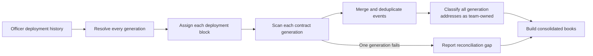

# Accounting History Across Contract Migrations

This focused document explains how Accounting consolidates contract generations. The canonical user journey and acceptance criteria are
owned by [`US-ACCT-005`](./README.md#us-acct-005-preserve-books-across-contract-migrations).

## Model

- A **generation** is one Officer deployment and its associated team contracts, with a deployment block that bounds event scanning.
- The **current generation** contains the contracts used by direct account pages and new product actions.
- Accounting includes current and historical generations in one ledger.
- The team **Safe** and any other officerless money pocket survive Officer redeployment and are included once.
- A **treasury sweep** moves funds between team-owned accounts. It is an internal movement, not revenue or an expense.

## Consolidation Flow

## Current Rules

1. The Officer-history endpoint supplies known generations and their deployment boundaries.
2. Each money-moving contract is scanned from the deployment block of its own generation.
3. If Officer history is unavailable, the current contracts form one boundary-less fallback generation.
4. Officerless accounts are added once after the governed addresses have been identified.
5. Events are merged, sorted, and deduplicated by their on-chain transaction and log identity.
6. Every current and historical money-pocket address participates in internal-transfer classification.
7. A failed generation scan does not discard successful generations; Accounting reports the affected source as a reconciliation gap.

## Verification Journey

1. Create accounting activity across more than one money-moving contract.
2. Redeploy the team's Officer and create activity on the replacement contracts.
3. Confirm that Accounting contains the pre-migration and post-migration entries exactly once.
4. Move funds from an old team contract to its replacement.
5. Confirm that the movement changes the account pockets without changing revenue, expenses, or total team cash.
6. Repeat the migration to verify consolidation across more than two generations.
7. Simulate one failed generation scan and confirm that the remaining books load with an incomplete-history warning.

## Known Limitations

- Ledger closing cash balances are not reconciled against live on-chain balances.
- Money-moving events introduced by a future contract version require a compatible event decoder and accounting mapper.
- Community Credit terms and SHER valuation inputs are read from current-generation contracts; historical rounds can fall back to less
  precise accounting treatment.

## Implementation Evidence

- [Accounting data layer](../../../app/src/composables/accounting/useCNCAccounting.ts)
- [Migration wiring tests](../../../app/src/composables/accounting/__tests__/useCNCAccounting.migration.spec.ts)
- [Internal-address rules](../../../app/src/utils/accounting/internalAddresses.ts)
- [Internal-address tests](../../../app/src/utils/accounting/__tests__/internalAddresses.spec.ts)

_[← Back to Accounting](./README.md)_
