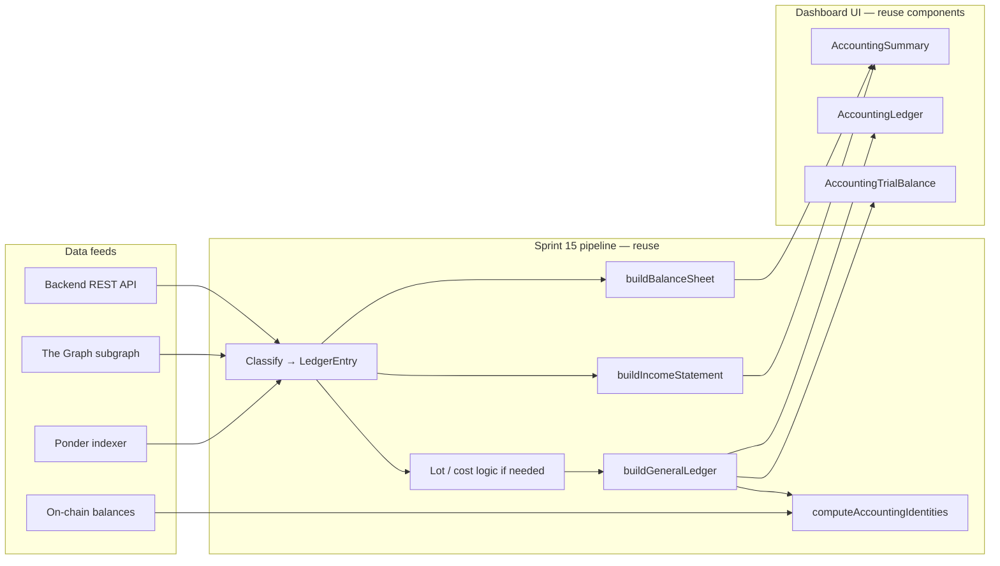

# CNC Accounting — Functional Specification

**Version:** 1.0.0  
**Date:** 2026-06-12  
**Status:** Draft (scoping)  
**Tracking:** Closes [#1890](https://github.com/globe-and-citizen/cnc-portal/issues/1890) · Goal [#1887](https://github.com/globe-and-citizen/cnc-portal/issues/1887) · Sprint plan [#2078](https://github.com/globe-and-citizen/cnc-portal/issues/2078)

---

## 1. Executive Summary

### 1.1 Purpose

Treat the CNC protocol as a **company** and produce its financial statements — general ledger, income statement, and balance sheet — using the same layered accounting pipeline built in Sprint 15 for Polymarket wallet accounting (issues #1882–#1884).

Today the dashboard `/accounting` page reconstructs P&L and balance-sheet positions for a **single Polymarket proxy wallet**. This spec defines how to apply that architecture to **CNC-native** data already available on-chain (via Ponder / The Graph) and in the portal backend, without folding in Polymarket / GC:Trader activity.

### 1.2 Scope

**In scope (Phase 1 — this sprint)**

- CNC **protocol-level** books: revenue from protocol fees, treasury cash movements, CNC-operating payroll and expense payouts, and equity/dividend events that belong to the CNC entity.
- Inventory of all data sources that can feed the three statements.
- Proposed chart of accounts, booking rules, and source-to-line-item mapping.
- Reconciliation identities (adapted from the Polymarket pipeline).
- Dashboard surface: new **CNC Accounting** section (separate from existing Polymarket Accounting).

**Explicitly excluded (deferred)**

| Exclusion | Rationale |
|-----------|-----------|
| Polymarket / GC:Trader wallet activity | Per [#1887](https://github.com/globe-and-citizen/cnc-portal/issues/1887); surface for GC:Trader vs dedicated app undecided ([#2078](https://github.com/globe-and-citizen/cnc-portal/issues/2078)) |
| Per-team treasury consolidation | Team `Bank` contracts are **team** books, not CNC company books (see §3) |
| Off-chain infra invoices (Ponder hosting, cloud) | No on-chain capture today — Phase 2 manual journal entries |
| Debt / loan principal and interest | No debt contracts exist on-chain — Phase 2 or manual |
| Vesting, Tips, AdCampaignManager | ABIs exist; **not indexed** in Ponder today |
| Multi-currency FX / mark-to-market | Phase 2; Phase 1 books native token amounts with optional USD memo |

### 1.3 Stakeholders

- **Protocol owner / CNC founders:** Validate CNC company books; dogfood with real deposits ([#1887](https://github.com/globe-and-citizen/cnc-portal/issues/1887)).
- **Platform administrators:** Reconcile on-chain treasury with statements via dashboard identities.
- **Developers:** Implement `useCncAccounting` composable and Ponder/subgraph query layer reusing Sprint 15 utils.

---

## 2. Reference Architecture — Sprint 15 Pipeline

Sprint 15 (parent [#1862](https://github.com/globe-and-citizen/cnc-portal/issues/1862)) delivered a **client-side double-entry pipeline** in `dashboard/app/`. CNC accounting reuses the same layers with different feeds.

| Layer | Polymarket (implemented) | CNC (to build) |
|-------|--------------------------|----------------|
| Composable | `useAccounting(address)` | `useCncAccounting(config)` |
| Classifier | `buildLedger()` in `accounting.ts` | `buildCncLedger()` — new |
| Income statement | `buildIncomeStatement()` / `computeRealizedTrades()` | `buildCncIncomeStatement()` — fee revenue, payroll, opex |
| Balance sheet | `buildBalanceSheet()` | `buildCncBalanceSheet()` — treasury cash, retained earnings |
| General ledger | `buildGeneralLedger()` | `buildCncGeneralLedger()` — new COA |
| Identities | `computeAccountingIdentities()` (8 checks) | `computeCncAccountingIdentities()` — adapted set |
| UI page | `/accounting` (Polymarket) | `/cnc-accounting` (proposed) |

**Key files to generalize (not duplicate):**

- `dashboard/app/utils/generalLedger.ts` — double-entry journal + trial balance pattern
- `dashboard/app/utils/accountingIdentities.ts` — reconciliation framework
- `dashboard/app/components/accounting/*` — retarget labels and account names via props

---

## 3. Entity Boundary

The CNC "company" is the **protocol legal/financial entity**, not the union of all team treasuries.

### 3.1 Included contracts / wallets

| Entity component | On-chain artifact | Identification |
|------------------|-------------------|----------------|
| Protocol fee treasury | `FeeCollector` singleton | Deployed address in `app/src/artifacts/deployed_addresses/chain-*.json` |
| CNC operating treasury | CNC team's `Bank` | Team flagged as protocol/CNC team in backend, or configured `CNC_TEAM_ID` env in dashboard |
| CNC payroll | CNC team's `CashRemunerationEIP712` | Resolved via Officer → team contracts |
| CNC expense budget | CNC team's `ExpenseAccountEIP712` | Resolved via Officer → team contracts |
| CNC equity | CNC team's `InvestorV1` | Share mints, dividend distributions |
| Owner treasury moves | `*_owner_treasury_withdraw_*` events on payroll/expense contracts | Protocol owner pulling surplus |

### 3.2 Excluded from CNC company books

- Other teams' `Bank`, `CashRemuneration`, `ExpenseAccount` instances (team-level P&L).
- Polymarket proxy wallets and GC:Trader positions.
- User personal wallets (except as counterparty on CNC treasury transfers).

### 3.3 Open decision

**How to identify the CNC team** among all teams: recommend a backend `Team.isProtocolTeam` flag or dashboard env `NUXT_CNC_TEAM_ID` for Phase 1. Dogfood test ([#1887](https://github.com/globe-and-citizen/cnc-portal/issues/1887)) uses Hermann's founding team.

---

## 4. Data Source Inventory

### 4.1 Ponder indexer (`ponder/`)

Primary read path for CNC accounting. Schema: `ponder/ponder.schema.ts`. Handlers: `ponder/src/index.ts`.

#### Protocol revenue & treasury

| Ponder table | Source event | Fields of interest |
|--------------|--------------|-------------------|
| `fee_collector_fee_paid` | `FeePaid` | `payer`, `contractType`, `token`, `amount`, `timestamp`, `txHash` |
| `fee_collector_withdrawn` | `Withdrawn` | `recipient`, `amount` (ETH) |
| `fee_collector_token_withdrawn` | `TokenWithdrawn` | `recipient`, `token`, `amount` |
| `fee_collector_beneficiary_updated` | `FeeBeneficiaryUpdated` | Beneficiary address changes |

#### CNC team treasury (when scoped to CNC team Bank)

| Ponder table | Source event | Fields of interest |
|--------------|--------------|-------------------|
| `bank_deposit` | `Deposited` | ETH inflows |
| `bank_token_deposit` | `TokenDeposited` | ERC20 inflows |
| `bank_transfer` | `Transfer` | ETH outflows (net of fee) |
| `bank_token_transfer` | `TokenTransfer` | ERC20 outflows |
| `bank_fee_paid` | `FeePaid` | Protocol fee **expense** at team level (mirror of `fee_collector_fee_paid` revenue) |
| `bank_dividend_distribution_triggered` | `DividendDistributionTriggered` | Dividend funding events |

#### Payroll

| Ponder table | Source event | Fields of interest |
|--------------|--------------|-------------------|
| `cash_remuneration_deposit` | deposit events | Treasury funding |
| `cash_remuneration_withdraw` | `withdraw` | ETH wage payout |
| `cash_remuneration_withdraw_token` | token withdraw | ERC20 wage payout |
| `cash_remuneration_wage_claim` | claim enable/disable | Claim window metadata |
| `cash_remuneration_owner_treasury_withdraw_native` | owner pull | Surplus to protocol owner |
| `cash_remuneration_owner_treasury_withdraw_token` | owner pull | Surplus tokens |

#### Operating expenses

| Ponder table | Source event | Fields of interest |
|--------------|--------------|-------------------|
| `expense_deposit` / `expense_token_deposit` | deposits | Budget funding |
| `expense_transfer` / `expense_token_transfer` | transfers | Signed expense payouts |
| `expense_approval` | approvals | Budget authorization (no cash movement) |
| `expense_owner_treasury_withdraw_*` | owner pull | Surplus to protocol owner |

#### Equity

| Ponder table | Source event | Fields of interest |
|--------------|--------------|-------------------|
| `investor_mint` | mint | Share issuance |
| `investor_dividend_distributed` | distribution | Dividend declaration |
| `investor_dividend_paid` | paid | Cash to shareholders |
| `investor_dividend_payment_failed` | failed | Failed payout (memo) |

#### Indexed but out of Phase 1 scope

`safe_deposit_router_*`, governance elections/proposals, `beacon_proxy_created` — topology only, no statement mapping in Phase 1.

#### Not indexed (gap)

`Tips`, `Vesting`, `AdCampaignManager` — ABIs in `contract/` but no Ponder tables.

### 4.2 The Graph subgraph (`the-graph/`)

Secondary / validation path. Entities: `Transaction`, `Transfer`, `Deposited`, `TokenTransfer`, `TokenDeposited` from Bank, CashRemuneration, ExpenseAccount, InvestorV1, ERC20 handlers.

**Phase 1 recommendation:** Prefer Ponder (SQL API, richer schema). Use subgraph for cross-check identity audits, not as primary feed.

### 4.3 Backend REST API (`backend/`)

Off-chain workflow metadata. **Not** a substitute for on-chain cash movements; join by signature hash / team id / timestamp.

| Endpoint | Model | Accounting use |
|----------|-------|----------------|
| `GET /claim`, `GET /weeklyClaim` | `Claim`, `WeeklyClaim` | Accrued payroll hours; status `pending` / `signed` / `withdrawn` |
| `GET /wage` | `Wage` | Hourly rates by token type |
| `GET /expense` | `Expense` | Expense request metadata (`data` JSON) |
| `GET /api/stats/*` | aggregates | Sanity checks only — not double-entry |

Prisma models: `backend/prisma/schema.prisma` — `Claim`, `WeeklyClaim`, `Wage`, `Expense`.

### 4.4 On-chain balance reads

| Read | Contract | Purpose |
|------|----------|---------|
| `getBalance()` / `getTokenBalance()` | `FeeCollector` | Cash identity: on-chain vs ledger |
| `getBalance()` / `getTokenBalance()` | CNC team `Bank` | Operating cash |
| ERC20 `balanceOf` | USDC, USDT, team tokens | Multi-token treasury positions |

---

## 5. Proposed Chart of Accounts

Phase 1 COA for CNC company books. Amounts booked in **native token units**; USD memo optional.

| Account | Class | Normal balance | Description |
|---------|-------|----------------|-------------|
| **Cash — ETH** | ASSET | Debit | ETH held in FeeCollector + CNC Bank |
| **Cash — USDC** | ASSET | Debit | USDC balances |
| **Cash — USDT** | ASSET | Debit | USDT balances |
| **Cash — Other tokens** | ASSET | Debit | Whitelisted ERC20 fee tokens |
| **Protocol Fee Receivable** | ASSET | Debit | Accrued but not yet withdrawn fees (optional memo; normally fees are instant) |
| **Investor Equity** | EQUITY | Credit | Share capital (mints) |
| **Retained Earnings** | EQUITY | Credit | Cumulative net income |
| **Owner Capital / Treasury** | EQUITY | Credit | Founder deposits, owner treasury withdrawals |
| **Protocol Fee Revenue** | INCOME | Credit | `fee_collector_fee_paid` inflows |
| **Payroll Expense** | EXPENSE | Debit | Wage payouts from CashRemuneration |
| **Operating Expense** | EXPENSE | Debit | ExpenseAccount payouts (default category) |
| **Infra Expense (Ponder)** | EXPENSE | Debit | Manual / imported — Phase 2 |
| **Interest Expense** | EXPENSE | Debit | Manual / imported — Phase 2 |
| **Dividend Expense** | EXPENSE | Debit | Equity distributions to shareholders |
| **Protocol Fee Expense** | EXPENSE | Debit | `bank_fee_paid` when booking CNC Bank side (internal transfer to FeeCollector — eliminate on consolidation) |

**Consolidation note:** When producing **protocol-level** statements, `bank_fee_paid` (expense at Bank) and `fee_collector_fee_paid` (revenue at FeeCollector) are the same economic event. Book revenue at FeeCollector only; treat Bank fee as inter-account transfer (Dr FeeCollector cash, Cr Bank cash) or exclude Bank from scope if FeeCollector is the sole revenue recognition point.

---

## 6. Source → Ledger → Statement Mapping

### 6.1 General ledger journal rules

| Event | Debit | Credit | Description |
|-------|-------|--------|-------------|
| Fee received (`fee_collector_fee_paid`) | Cash — {token} | Protocol Fee Revenue | Protocol fee income |
| Fee withdrawal (`fee_collector_withdrawn`) | Owner Capital / external | Cash — ETH | Treasury distribution |
| Token fee withdrawal (`fee_collector_token_withdrawn`) | Owner Capital / external | Cash — {token} | Treasury distribution |
| Bank deposit (founder capital) | Cash — {token} | Owner Capital | CNC team treasury funding |
| Wage payout (`cash_remuneration_withdraw*`) | Payroll Expense | Cash — {token} | Payroll cash basis |
| Expense payout (`expense_transfer*`) | Operating Expense | Cash — {token} | Signed expense |
| Dividend paid (`investor_dividend_paid`) | Dividend Expense | Cash — {token} | Return to shareholders |
| Share mint (`investor_mint`) | Cash or memo | Investor Equity | Capital raise (amount per mint terms) |
| Owner treasury withdraw | Owner Capital | Cash — {token} | Surplus sweep to owner |
| Infra invoice (manual) | Infra Expense | Cash / Accounts Payable | Phase 2 |
| Interest payment (manual) | Interest Expense | Cash | Phase 2 |

### 6.2 Income statement line items

| Line item | Source | Calculation |
|-----------|--------|-------------|
| **Protocol fee revenue** | `fee_collector_fee_paid` | Σ amounts in period, by token |
| **Other revenue** | — | Zero in Phase 1 |
| **Payroll expense** | `cash_remuneration_withdraw*` (CNC team) | Σ payout amounts in period |
| **Operating expenses** | `expense_transfer*` (CNC team) | Σ payout amounts in period |
| **Infra expense (Ponder)** | Manual journal | Σ manual entries tagged `infra` |
| **Interest expense** | Manual journal | Σ manual entries tagged `debt_interest` |
| **Dividend expense** | `investor_dividend_paid` | Σ in period |
| **Net income** | — | Revenue − expenses |
| **Comprehensive net income** | — | Net income ± equity adjustments (Phase 1: ≈ net income) |

### 6.3 Balance sheet line items

| Line item | Source | Calculation |
|-----------|--------|-------------|
| **Assets — Cash** | On-chain balances + ledger roll-forward | Per-token balances in FeeCollector + CNC Bank as of date |
| **Assets — Total** | — | Σ cash accounts |
| **Liabilities** | — | **Zero in Phase 1** (no debt contracts; accrued wages optional memo) |
| **Equity — Investor equity** | `investor_mint` | Cumulative share capital |
| **Equity — Owner capital** | Deposits − owner withdrawals | Net founder/protocol-owner funding |
| **Equity — Retained earnings** | — | Cumulative net income |
| **Equity — Total** | — | Investor + Owner + Retained |
| **Identity** | — | Assets = Liabilities + Equity |

### 6.4 Ledger entry categories (`CncLedgerCategory`)

Proposed enum for `buildCncLedger()` classifier:

`FEE_REVENUE`, `FEE_WITHDRAWAL`, `TREASURY_DEPOSIT`, `TREASURY_TRANSFER`, `PAYROLL_PAYOUT`, `EXPENSE_PAYOUT`, `DIVIDEND_PAID`, `SHARE_MINT`, `OWNER_TREASURY_WITHDRAW`, `MANUAL_JOURNAL`, `OTHER`

---

## 7. Fees and Expenses — Booking Policy

### 7.1 Protocol fees (on-chain — fully automatable)

**Recognition:** Cash basis at `FeePaid` event timestamp.

1. Team contract (e.g. Bank) computes fee via `Officer.getFeeFor(contractType)` and sends to FeeCollector.
2. Ponder records `bank_fee_paid` (team) and `fee_collector_fee_paid` (protocol).
3. **CNC company books** recognize **revenue** only on `fee_collector_fee_paid`.
4. **Withdrawals** by protocol owner are **equity distributions** (Cr Cash, Dr Owner Capital), not expenses.

Fee rates are configurable per contract type (bps) — see [FeeCollector docs](../contracts/fee-collector/README.md).

### 7.2 Payroll (on-chain + backend join)

**Recognition:** Cash basis at `cash_remuneration_withdraw*` timestamp.

| Stage | System | Booked? |
|-------|--------|---------|
| Member logs hours | Backend `Claim` | No — memo / accrual optional |
| Weekly claim signed | Backend `WeeklyClaim` | No — obligation memo |
| Wage withdrawn on-chain | Ponder withdraw events | **Yes** — Dr Payroll Expense, Cr Cash |

**Join key:** `WeeklyClaim.signature` ↔ on-chain EIP-712 claim hash where available; fallback: team id + member + week window + amount tolerance.

**Category:** Always `Payroll Expense` for Phase 1. Sub-categories (contractors vs employees) deferred.

### 7.3 Operating expenses (on-chain + backend join)

**Recognition:** Cash basis at `expense_transfer*` timestamp.

| Stage | System | Booked? |
|-------|--------|---------|
| Expense submitted | Backend `Expense` | No |
| Expense approved on-chain | `expense_approval` | No — authorization memo |
| Expense paid on-chain | `expense_transfer*` | **Yes** — Dr Operating Expense, Cr Cash |

**Category mapping (Phase 1):** Default `Operating Expense`. Backend `Expense.data` may carry a `category` field in future; until then, all signed payouts use one account.

### 7.4 Infra — Ponder / hosting (off-chain — Phase 2 manual)

No on-chain or backend capture of cloud/Ponder invoices today.

**Phase 2 booking:**

- Dr **Infra Expense (Ponder)**
- Cr **Cash** (if paid) or **Accounts Payable** (if accrued)

**Import mechanism (TBD):** CSV upload or admin journal API in dashboard.

### 7.5 Debt interest (off-chain — Phase 2 manual)

No `Debt` or `Loan` Solidity contracts in `contract/`. Interest expense from [#1890](https://github.com/globe-and-citizen/cnc-portal/issues/1890) is **manual journal entries** until a debt instrument is modeled on-chain or in backend.

- Dr **Interest Expense**
- Cr **Cash**

---

## 8. Reconciliation Identities

Adapt the eight Polymarket identities (`accountingIdentities.ts`) for CNC:

| # | Identity | Check |
|---|----------|-------|
| 1 | **CASH_ONCHAIN** | On-chain FeeCollector + CNC Bank balances = Σ ledger cash movements per token |
| 2 | **FEE_REVENUE** | Σ `fee_collector_fee_paid` = Protocol Fee Revenue GL account |
| 3 | **BALANCE_SHEET** | Assets = Liabilities + Equity |
| 4 | **PAYROLL_CASH** | Σ payroll withdraw events = Payroll Expense (cash basis) |
| 5 | **EXPENSE_CASH** | Σ expense transfer events = Operating Expense (cash basis) |
| 6 | **TRIAL_BALANCE** | Σ debits = Σ credits |
| 7 | **INCOME_TO_RETAINED** | Period net income rolls into retained earnings |
| 8 | **WITHDRAWALS** | Σ owner treasury withdraws + fee collector withdraws = Δ Owner Capital |

---

## 9. Phase 2 Gaps

Data or capabilities needed for **complete** company accounting not available in Phase 1:

| Gap | Impact | Proposed resolution |
|-----|--------|---------------------|
| Polymarket / GC:Trader P&L | CNC total return incomplete | Fold GC:Trader books when surface decided ([#2078](https://github.com/globe-and-citizen/cnc-portal/issues/2078)) |
| Ponder / cloud infra costs | Opex understated | Manual journal import + `Infra Expense` account |
| Debt principal & interest | No liability / interest expense | Backend debt schedule or manual journals |
| Accrued payroll (unpaid claims) | Balance sheet missing wage liability | Accrual mode: book on `WeeklyClaim.signed` |
| Expense categories | Single `Operating Expense` bucket | Extend `Expense.data.category` + classifier |
| Multi-token USD reporting | Statements in native units only | Price oracle / daily FX table |
| Vesting, Tips, AdCampaign | Revenue/expense blind spots | Add Ponder indexers |
| Team Banks (all teams) | No consolidated protocol view | Separate "Protocol" vs "Ecosystem" report |
| MTM for token holdings | Balance sheet at cost only | Oracle integration |
| Audit trail / immutability | Client-side reconstruction only | Optional backend `JournalEntry` persistence |
| Unit tests | Zero coverage for CNC accounting | Port Polymarket test patterns to `buildCncLedger` |
| CNC team identification | Ambiguous entity boundary | `Team.isProtocolTeam` or env config |

---

## 10. Implementation Outline (post-spec)

Not in scope for #1890 but sequenced for #1887:

1. **Ponder GraphQL client** in dashboard — query scoped tables for CNC team + FeeCollector.
2. **`buildCncLedger()`** — classify Ponder rows → `CncLedgerEntry[]`.
3. **`buildCncGeneralLedger()` / `buildCncIncomeStatement()` / `buildCncBalanceSheet()`** — parallel to Polymarket utils.
4. **`useCncAccounting()`** composable — wire queries + builders.
5. **`/cnc-accounting` page** — reuse `AccountingSummary`, `AccountingIncomeStatement`, `AccountingBalanceSheet`, `AccountingLedger`, `AccountingIdentitiesCard` with CNC-specific labels.
6. **Dogfood validation** — real ETH deposit + invest per [#1887](https://github.com/globe-and-citizen/cnc-portal/issues/1887).

---

## 11. Success Metrics

### 11.1 Deliverables for #1890 (this document)

- [x] Scope confirmed: CNC own books; Polymarket excluded
- [x] Data sources inventoried (Ponder, subgraph, backend, on-chain reads)
- [x] Source → statement line item mapping documented
- [x] Fee and expense booking rules defined (protocol fees, payroll, opex, infra, interest)
- [x] Phase 2 gaps listed

### 11.2 Acceptance criteria for Phase 1 implementation (follow-on)

- [ ] Dashboard displays CNC income statement, balance sheet, and general ledger for a configurable period
- [ ] All seven reconciliation identities pass on dogfood data
- [ ] Trial balance debits equal credits
- [ ] Polymarket `/accounting` page unchanged and clearly labeled

---

## 12. Related Documentation

**Feature-specific**

- [FeeCollector contract](../contracts/fee-collector/README.md)
- [Bank contract](../contracts/bank/README.md)
- [CashRemuneration contract](../contracts/cash-remuneration/README.md)
- [ExpenseAccount contract](../contracts/expense-account/README.md)
- [InvestorV1 contract](../contracts/investor-v1/README.md)

**Reference implementation (Polymarket — Sprint 15)**

- `dashboard/app/composables/useAccounting.ts`
- `dashboard/app/utils/accounting.ts` — classifier
- `dashboard/app/utils/generalLedger.ts` — #1884
- `dashboard/app/utils/incomeStatement.ts` — #1882
- `dashboard/app/utils/balanceSheet.ts` — #1883
- `dashboard/app/utils/accountingIdentities.ts`

**Platform**

- [Architecture](../../platform/architecture.md)
- [Statistics feature](../stats/functional-specification.md) — aggregate stats (not double-entry)

---

## 13. Version History

### Version 1.0.0 — 2026-06-12

- Initial scoping spec for #1890
- Entity boundary, COA, booking rules, and gap analysis
