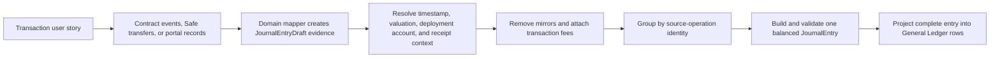

# Accounting Use Cases and Journal Entries

**Scope:** Canonical bridge from transaction user stories to Accounting use cases, processing rules, and General Ledger output

**Last reviewed:** Not yet reviewed

This catalogue answers one question for every supported transaction journey: **what evidence becomes which balanced journal entry, and how
does that entry appear in the General Ledger?** Transaction feature documentation owns the user action. This document owns its accounting
interpretation. The [Accounting Read Model](../../implementation/accounting-read-model/README.md) owns the shared implementation mechanics.

## Reading the Catalogue

- A user story describes a product action. An Accounting use-case ID identifies the booking rule applied to evidence from that action.
- One user action may produce several use cases over time. For example, Community Credit funding recognizes principal and interest, while a
  later repayment settles them.
- One on-chain transaction becomes at most one finalized `JournalEntry`. Compatible lines from several events are grouped by the source
  operation; duplicate mirrors are removed.
- When grouped evidence carries several use-case IDs, the entry label comes from its primary non-fee draft while every compatible line stays
  visible.
- Every journal entry balances. Account and currency filters retain the complete entry, not isolated lines.
- `FEE` is component evidence. When a Bank outflow paid the fee, the fee line is merged into that outflow's entry and does not become a
  standalone General Ledger operation.

## End-to-End Processing

Synthetic entries, such as a weekly wage accrual, use a deterministic portal identity and have no transaction hash. On-chain entries use the
transaction hash as their source-operation identity. If required source, timestamp, or valuation evidence is incomplete, Accounting reports
that state instead of presenting the affected books as final.

## Story-to-Use-Case Map

| Transaction journey                                                                                              | Accounting use case                              | Posting moment                                      | General Ledger result                                       |
| ---------------------------------------------------------------------------------------------------------------- | ------------------------------------------------ | --------------------------------------------------- | ----------------------------------------------------------- |
| [Fund the Bank](../accounts/README.md#us-bank-001-fund-the-bank)                                                 | `UC-BANK-02`                                     | External funds reach Bank                           | Service revenue receipt                                     |
| [Transfer Bank funds](../accounts/README.md#us-bank-002-transfer-bank-funds)                                     | `UC-BANK-03`, `CASH-OUT`, `FEE`, or `INTERNAL`   | Bank transfer executes                              | Treasury funding, external payment, and any transaction fee |
| [Cash out treasury funds](../accounts/README.md#us-bank-004-cash-out-available-treasury-funds)                   | `INTERNAL`, then `CASH-OUT` and optional `FEE`   | Each cash-out step executes                         | Pocket sweep followed by external payment                   |
| [Spend from Expense](../accounts/README.md#us-exp-002-spend-from-the-expense-account)                            | `UC-EXP-01` or `INTERNAL`                        | Approved transfer executes                          | Operating expense or pocket transfer                        |
| [Manage Safe funds](../accounts/README.md#us-safe-003-manage-safe-funds)                                         | `UC-BANK-02`, `CASH-OUT`, or `INTERNAL`          | Confirmed Safe transfer is indexed                  | Receipt, external payment, or pocket transfer               |
| [Fund Payroll](../payroll/README.md#us-payroll-003-fund-the-payroll-contract)                                    | `UC-BANK-03` or `INTERNAL`                       | Funds reach Payroll                                 | Treasury funding transfer                                   |
| [Submit a daily claim](../payroll/README.md#us-payroll-005-submit-a-daily-claim)                                 | `UC-CASH-02`                                     | The containing work week ends while eligible        | Wage accrual                                                |
| [Disable or re-enable a claim](../payroll/README.md#us-payroll-009-disable-or-re-enable-a-signed-weekly-claim)   | `UC-CASH-02` eligibility                         | Claim status changes                                | Disabled claims are excluded; eligible claims accrue        |
| [Withdraw a weekly claim](../payroll/README.md#us-payroll-010-withdraw-an-approved-weekly-claim)                 | `UC-CASH-03`                                     | Withdrawal executes                                 | Wage or SHER settlement                                     |
| [Publish a credit call](../community-credit/README.md#us-cc-002-publish-a-credit-call)                           | No posting                                       | Terms are created without company funds moving      | No ledger entry                                             |
| [Lend to a round](../community-credit/README.md#us-cc-003-lend-to-an-open-round)                                 | No posting until funding                         | Lender funds remain in the round                    | No company entry yet                                        |
| [Resolve a stalled round](../community-credit/README.md#us-cc-004-resolve-a-stalled-round)                       | `UC-CREDIT-01` and `UC-CREDIT-05`, or no posting | A partial raise is accepted; a refund is not posted | Principal receipt and interest obligation                   |
| [Repay lenders](../community-credit/README.md#us-cc-005-repay-lenders)                                           | `UC-CREDIT-03`                                   | Repayment is distributed                            | Principal and interest settlement                           |
| [Invest through the router](../shareholder-management/README.md#us-sher-001-invest-in-the-safe-and-receive-sher) | `UC-SDR-01`                                      | Router deposit and SHER mint execute                | Investor contribution                                       |
| [Distribute dividends](../shareholder-management/README.md#us-sher-002-distribute-dividends-to-shareholders)     | `UC-INV-01`                                      | Investor pays shareholders                          | Dividend expense and cash outflow                           |
| [Issue SHER directly](../shareholder-management/README.md#us-sher-004-issue-sher-to-a-shareholder)               | `DEFAULT-D`                                      | Unbacked mint executes                              | Share issuance                                              |
| [Create a vesting schedule](../vesting/README.md#us-vesting-001-create-a-minute-precise-vesting-schedule)        | `UC-VEST-01`                                     | Grant is created                                    | Restricted-stock commitment                                 |
| [Release vested shares](../vesting/README.md#us-vesting-003-release-accrued-shares)                              | `UC-VEST-02`                                     | Shares are released                                 | Promised shares become issued equity                        |
| [Stop a vesting schedule](../vesting/README.md#us-vesting-004-stop-an-active-vesting-schedule)                   | `UC-VEST-02` and/or `UC-VEST-03`                 | Stop executes                                       | Accrued release and unvested cancellation                   |

## Treasury and Cash Use Cases

### `UC-BANK-02` — External Cash Receipt

**Source stories:** [US-BANK-001](../accounts/README.md#us-bank-001-fund-the-bank) and
[US-SAFE-003](../accounts/README.md#us-safe-003-manage-safe-funds).

- **Input:** A Bank deposit event or confirmed Safe inflow whose sender is not a known company pocket.
- **Processing:** The mapper resolves the receiving deployment account. A SafeDepositRouter-backed Safe inflow is removed here because
  `UC-SDR-01` owns that operation.
- **Journal entry:** Debit the receiving `Cash — Bank` or `Cash — Safe` account; credit `Service Revenue`.
- **General Ledger:** Label `Service revenue`; activity links to the receiving Bank or Safe. The entry retains the original currency,
  quantity, rate, and transaction hash.

An external wallet may belong to a company member; that alone does not make the receipt an internal transfer.

### `UC-BANK-03` — Bank Funds a Company Pocket

**Source stories:** [US-BANK-002](../accounts/README.md#us-bank-002-transfer-bank-funds) and
[US-PAYROLL-003](../payroll/README.md#us-payroll-003-fund-the-payroll-contract).

- **Input:** A Bank transfer whose destination resolves to another known company cash pocket.
- **Processing:** The Bank event establishes the source operation. Mirrored destination evidence is removed; a same-transaction fee is
  attached before finalization.
- **Journal entry:** Debit the destination cash account; credit the source `Cash — Bank` account; debit `Transaction Fee Expense` and credit
  `Cash — Bank` when a fee was paid.
- **General Ledger:** Label `Treasury funding`; activity links to the funded pocket. All transfer and fee lines appear in one entry.

### `INTERNAL` — Other Company-Pocket Transfer

**Source stories:** [US-BANK-004](../accounts/README.md#us-bank-004-cash-out-available-treasury-funds),
[US-EXP-002](../accounts/README.md#us-exp-002-spend-from-the-expense-account), and
[US-SAFE-003](../accounts/README.md#us-safe-003-manage-safe-funds).

- **Input:** A confirmed movement between two known company pockets that is not owned by a more specific rule.
- **Processing:** Source and destination deployments are resolved separately. Mirrored evidence is deduplicated only when it describes the
  same operation and complementary movement.
- **Journal entry:** Debit destination cash; credit source cash.
- **General Ledger:** Label `Internal transfer`; activity links to the most specific owning journey. No revenue or expense is recognized.

### `CASH-OUT` — External Bank or Safe Payment

**Source stories:** [US-BANK-002](../accounts/README.md#us-bank-002-transfer-bank-funds),
[US-BANK-004](../accounts/README.md#us-bank-004-cash-out-available-treasury-funds), and
[US-SAFE-003](../accounts/README.md#us-safe-003-manage-safe-funds).

- **Input:** A Bank or Safe outflow to an address that is not a known company pocket.
- **Processing:** The mapper initially classifies the counter-account as `Operating Expense`. A valid account assignment may replace it with
  `Owner Capital`, `Payroll Expense`, `Interest Expense`, or `Dividend Expense`. Compound entries remain read-only.
- **Journal entry:** Debit the selected or inferred counter-account; credit the source cash account. Attach any matching Bank fee without
  changing the assigned line.
- **General Ledger:** Label `Cash payment`; activity links to Bank or Safe. Account Assignments and the ledger show the same complete entry.

### `FEE` — Transaction-Fee Component

**Source story:** [US-BANK-002](../accounts/README.md#us-bank-002-transfer-bank-funds).

- **Input:** A generation-aware `FeePaid` event matched to a Bank outflow from the same source operation.
- **Processing:** Legacy local Bank fee events and current FeeCollector events are normalized, then attached to the parent transfer. An
  unmatched fee is withheld and reported as incomplete evidence.
- **Journal lines:** Debit `Transaction Fee Expense`; credit the paying `Cash — Bank` account.
- **General Ledger:** The lines appear inside the parent `UC-BANK-03` or `CASH-OUT` entry. `FEE` is used as a standalone label only by the
  presenter contract; valid assembled books do not expose an orphan fee entry.

## Payroll and Expense Use Cases

### `UC-CASH-02` — Weekly Wage Accrual

**Source stories:** [US-PAYROLL-005](../payroll/README.md#us-payroll-005-submit-a-daily-claim) and
[US-PAYROLL-009](../payroll/README.md#us-payroll-009-disable-or-re-enable-a-signed-weekly-claim).

- **Input:** An ended weekly claim, its daily hours, applicable wage terms, overtime policy, and current eligibility status.
- **Processing:** Accounting calculates the canonical weekly amount at the week-end timestamp. A disabled claim is excluded; signing is not
  the accrual trigger. The entry is synthetic and has no transaction hash.
- **Journal entry:** For cash wages, debit `Payroll Expense` and credit `Wage Payable`. For SHER wages, debit `Deferred SHER Compensation`
  and credit `SHERS To Be Issued`.
- **General Ledger:** Label `Wage accrual`; activity `Payroll: Claim`; date is the end of the work week.

Edits or deletions made before the week ends change the source amount; they do not create separate accounting operations.

### `UC-CASH-03` — Wage Settlement

**Source story:** [US-PAYROLL-010](../payroll/README.md#us-payroll-010-withdraw-an-approved-weekly-claim).

- **Input:** A Payroll withdrawal event enriched with the matching weekly claim.
- **Processing:** Cash and SHER settlement paths are distinguished by currency. A matching Investor mint from SHER settlement is removed as
  duplicate evidence.
- **Journal entry:** For cash, debit `Wage Payable` and credit `Cash — Payroll`. For SHER, debit `SHERS To Be Issued` and credit
  `Investor Equity`.
- **General Ledger:** Label `Wage settlement`; activity `Payroll: Withdraw`; the transaction hash traces the settlement.

### `UC-EXP-01` — Approved Expense Payout

**Source story:** [US-EXP-002](../accounts/README.md#us-exp-002-spend-from-the-expense-account).

- **Input:** An Expense Account transfer to an external recipient and, when available, its approved portal budget.
- **Processing:** The mapper reconstructs the approval cap and remaining amount for the operation. When indexed payout events are entirely
  unavailable, the approved record's current drawn balance supplies one synthetic fallback entry per budget. An internal destination uses
  `INTERNAL` instead.
- **Journal entry:** Debit `Operating Expense`; credit `Cash — Expense`.
- **General Ledger:** Label `Operating expense`; activity links to the Expense journey. Indexed entries retain their transaction hash;
  fallback entries identify their synthetic source.

Creating, deactivating, or reactivating an approval changes spending authority but moves no money, so it creates no journal entry.

## Community Credit Use Cases

### `UC-CREDIT-01` — Funded Principal

**Source stories:** [US-CC-003](../community-credit/README.md#us-cc-003-lend-to-an-open-round) and
[US-CC-004](../community-credit/README.md#us-cc-004-resolve-a-stalled-round).

- **Input:** A funded-round event, lender contributions, creation terms, and token identity.
- **Processing:** `FundsLent` events are held as contribution evidence while funds remain in the round. When the round funds or a partial
  raise is accepted, contributions are grouped by funding operation. A missing token or creation record produces memo-only evidence rather
  than a fabricated valuation.
- **Journal entry:** Debit `Cash — Bank`; credit `Loan Payable`, with compatible lender lines aggregated in the finalized operation.
- **General Ledger:** A zero-interest funding operation is labelled `Credit funds lent`. When fixed return is recognized in the same source
  operation, the principal and interest lines remain one entry under the primary use-case label.

A published, open, refunded, or not-yet-funded round does not change the company's books.

### `UC-CREDIT-05` — Fixed Return Recognized

**Source stories:** [US-CC-003](../community-credit/README.md#us-cc-003-lend-to-an-open-round) and
[US-CC-004](../community-credit/README.md#us-cc-004-resolve-a-stalled-round).

- **Input:** The funded principal and the offer's flat-interest terms.
- **Processing:** Accounting calculates each lender's fixed return when the round becomes funded. This synthetic obligation is grouped by
  lender but remains traceable to the funded offer.
- **Journal entry:** Debit `Interest Expense`; credit `Interest Payable`.
- **General Ledger:** The interest lines share the funding operation with `UC-CREDIT-01`; the current primary label is
  `Credit interest owed`. The obligation is visible before cash repayment without creating a second funding entry.

### `UC-CREDIT-03` — Principal and Interest Repaid

**Source story:** [US-CC-005](../community-credit/README.md#us-cc-005-repay-lenders).

- **Input:** Lender repayment events and the principal and interest already recognized for the offer.
- **Processing:** Payments settle principal first, then recognized interest. Any interest not covered by a prior accrual is recognized as
  `Interest Expense` in the repayment operation. Multiple lender events from one transaction are grouped.
- **Journal entry:** Debit `Loan Payable` for principal and `Interest Payable` for accrued interest; debit `Interest Expense` only for an
  unrecognized interest remainder; credit `Cash — Bank` for the total paid.
- **General Ledger:** Label `Credit repayment`; activity links to Community Credit; one repayment transaction remains one entry.

## Shareholder and Vesting Use Cases

### `UC-SDR-01` — Investor Contribution

**Source story:** [US-SHER-001](../shareholder-management/README.md#us-sher-001-invest-in-the-safe-and-receive-sher).

- **Input:** A SafeDepositRouter deposit, its Safe receipt, and the matching Investor mint.
- **Processing:** The router operation owns the accounting entry. Matching Safe transfer and Investor mint evidence are removed so the
  investment is neither revenue nor a second share issuance.
- **Journal entry:** Debit `Cash — Safe`; credit `Investor Equity`.
- **General Ledger:** Label `Investor contribution`; activity links to the shareholder investment journey.

### `UC-INV-01` — Dividend Paid

**Source story:** [US-SHER-002](../shareholder-management/README.md#us-sher-002-distribute-dividends-to-shareholders).

- **Input:** Per-shareholder `DividendPaid` events emitted by Investor.
- **Processing:** Bank's distribution-trigger summary is ignored to avoid double counting. Compatible shareholder payments in the same
  transaction are aggregated.
- **Journal entry:** Debit `Dividend Expense`; credit `Cash — Bank`.
- **General Ledger:** Label `Dividend paid`; activity links to the shareholder journey. Recipient evidence remains available through the
  transaction even though the ledger presents the grouped operation.

### `DEFAULT-D` — Direct SHER Issuance

**Source story:** [US-SHER-004](../shareholder-management/README.md#us-sher-004-issue-sher-to-a-shareholder).

- **Input:** An Investor `Minted` event not matched to a router investment, Payroll settlement, or Vesting release.
- **Processing:** Known backed mint paths are removed first. Only the remaining direct mint uses this default rule.
- **Journal entry:** Debit `SHERS To Be Issued`; credit `Investor Equity`.
- **General Ledger:** Label `Share issuance`; activity links to the shareholder journey.

Shareholder migration claims are ownership migration evidence, not new issuance, and do not create this entry.

### `UC-VEST-01` — Vesting Grant

**Source story:** [US-VESTING-001](../vesting/README.md#us-vesting-001-create-a-minute-precise-vesting-schedule).

- **Input:** A vesting-schedule creation event with beneficiary, grant, and schedule identity.
- **Processing:** The full restricted-stock commitment is recognized when defined; no shares are minted at this point.
- **Journal entry:** Debit `Deferred SHER Compensation`; credit `SHERS To Be Issued`.
- **General Ledger:** Label `Vesting grant`; activity links to Vesting. The entry affects equity accounts, not profit.

### `UC-VEST-02` — Vested SHER Released

**Source stories:** [US-VESTING-003](../vesting/README.md#us-vesting-003-release-accrued-shares) and
[US-VESTING-004](../vesting/README.md#us-vesting-004-stop-an-active-vesting-schedule).

- **Input:** A vesting release event and its matching Investor mint.
- **Processing:** The Vesting event owns the entry; the matching Investor mint is removed. A stop may release accrued shares in the same
  transaction.
- **Journal entry:** Debit `SHERS To Be Issued`; credit `Investor Equity`.
- **General Ledger:** Label `Vesting released`; activity links to the affected schedule.

### `UC-VEST-03` — Unvested Grant Cancelled

**Source story:** [US-VESTING-004](../vesting/README.md#us-vesting-004-stop-an-active-vesting-schedule).

- **Input:** A vesting stop event and the schedule's unvested remainder.
- **Processing:** Accounting reverses only the stopped schedule's unvested quantity. If nothing remains, no cancellation lines are posted.
  Any same-transaction accrued release is grouped with `UC-VEST-02`.
- **Journal entry:** Debit `SHERS To Be Issued`; credit `Deferred SHER Compensation`.
- **General Ledger:** A cancellation-only operation is labelled `Vesting stopped`. When the stop also releases accrued shares, both use
  cases remain one complete entry under the primary release-or-stop label.

The focused [Vesting accounting policy](./vesting-accounting-restricted-stock.md) explains why these entries remain outside the income
statement.

## Declared but Inactive Identifiers

The shared type still declares `UC-CREDIT-02`, `UC-CREDIT-04`, and `CASH-IN`, but no current source mapper emits them. They are not active
booking rules and must not be used to infer ledger coverage. New or reactivated identifiers require an implementation-backed rule, tests,
and an update to this catalogue.

## Shared General Ledger Rules

- The first visible row carries the operation date, label, transaction hash when present, activity, and action category. Every row carries
  its concrete account, debit or credit amount, currency, quantity, and rate.
- Action categories are derived from the finalized accounts and use case, not copied from a source event label.
- Redeployed cash accounts remain distinct concrete rows. General Ledger and Trial Balance navigation preserves that deployment identity.
- Memo-only operations explain incomplete economic evidence but do not invent debit or credit lines.
- A source feed marked loading, partial, or failed withholds final reports. A missing timestamp is never replaced with epoch time, and a
  missing valuation is never replaced with a current price.

## Implementation Evidence

**Implementation evidence reviewed against:** `99b6b283d84f1b5013ff5d19707a8df638968a89`

- [Accounting assembly](../../../app/src/utils/accounting/assemble.ts),
  [source mapper boundary](../../../app/src/utils/accounting/mappers/index.ts),
  [draft identity and use-case types](../../../app/src/utils/accounting/journalEntryDraft.ts), and
  [journal finalization](../../../app/src/utils/accounting/journalEntry.ts)
- [Bank mapper](../../../app/src/utils/accounting/mappers/bank.ts), [Safe mapper](../../../app/src/utils/accounting/mappers/safe.ts),
  [Payroll mapper](../../../app/src/utils/accounting/mappers/payroll.ts),
  [Expense mapper](../../../app/src/utils/accounting/mappers/expenseAccount.ts),
  [Community Credit mapper](../../../app/src/utils/accounting/mappers/fixedReturn.ts),
  [Investor mapper](../../../app/src/utils/accounting/mappers/investor.ts), and
  [Vesting mapper](../../../app/src/utils/accounting/mappers/vesting.ts)
- [General Ledger presenter](../../../app/src/utils/accounting/journalLedgerPresenter.ts),
  [ledger action categories](../../../app/src/utils/accounting/ledgerCategory.ts), and
  [activity destinations](../../../app/src/composables/accounting/useActivityDestination.ts)
- [Accounting rule tests](../../../app/src/utils/accounting/__tests/) and
  [contract-generation accounting tests](../../../app/src/composables/accounting/__tests__/useCNCAccounting.migration.spec.ts)

## Related Documentation

- [Accounting user stories](./README.md)
- [Accounting Read Model](../../implementation/accounting-read-model/README.md)
- [Vesting accounting policy](./vesting-accounting-restricted-stock.md)
- [Accounts](../accounts/README.md)
- [Payroll](../payroll/README.md)
- [Community Credit](../community-credit/README.md)
- [Shareholder Management](../shareholder-management/README.md)
- [Vesting](../vesting/README.md)
