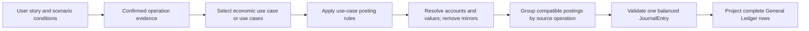

# Accounting Use Cases, Posting Rules, and Journal Entries

**Scope:** Economic use cases that produce company accounting entries, with selection conditions, related user stories, and posting rules

**Status:** Proposed catalogue model; current-runtime correspondence is documented separately below

**Last reviewed:** Not yet reviewed

This catalogue covers **events that produce accounting entries**. Identify the economic use case from operation evidence, then find its
**related user stories, applicable rules, and journal entry**. Transaction feature documentation owns user actions and permissions. This
document owns their accounting interpretation. The [Accounting Read Model](../../implementation/accounting-read-model/README.md) owns shared
implementation mechanics.

The `UC-<DOMAIN>-<NNN>` and `RULE-*` identifiers below define the proposed model, not current runtime values. Domain posting examples
preserve existing behaviour unless a change is explicitly identified. Separating use cases from reusable rules and introducing suspense
accounts require a runtime migration. See
[Runtime Correspondence and Migration Boundaries](#runtime-correspondence-and-migration-boundaries) before interpreting these examples as
implemented behaviour. The [manual validation script](./accounting-test-script.md) checks this target.

## Reading the Catalogue

An event belongs in this catalogue when its economic effect requires a debit/credit entry in the company's books. This criterion applies to
transfers, expenses, obligations, contributions, and share commitments or issuances. Events that change only authority, configuration, or
workflow status have no use case here unless they produce an accounting entry. Cash movement is one possible accounting effect.

| Concept             | Question answered                          | Responsibility                                                   |
| ------------------- | ------------------------------------------ | ---------------------------------------------------------------- |
| User story          | What does the user do?                     | Product action, permissions, and acceptance criteria             |
| Accounting use case | What economic event occurred?              | Trigger, business evidence, counter-accounts, and domain posting |
| Posting rule        | Which debits and credits are recorded?     | Domain posting definition and applicable movement treatment      |
| Journal entry       | What is recorded for the source operation? | Group compatible postings into one balanced entry                |

- One story can select several use cases depending on operation evidence. One use case can serve several stories.
- A use case defines its rules and conditions. A movement rule alone does not establish revenue, expense, capital, or debt.
- `RULE-INTERNAL` and `RULE-EXTERNAL` classify each non-fee cash movement. `RULE-FEE` can accompany either for a confirmed Bank fee.
- A source operation can contain several movements and use cases. Compatible postings remain separately traceable within its single journal
  entry. A workflow involving several transactions creates separate entries for those transactions.
- Every included use case defines an accounting entry and its posting rules. Wage accrual, interest recognition, share issuance, and Vesting
  qualify because they produce debit/credit entries.
- Every journal entry balances. Account and currency filters retain the complete entry, not isolated lines.

Examples use illustrative USD values. Each monetary line also retains original currency, quantity, and rate of record. A cash pocket is a
company-controlled account with an evidenced deployment identity; a member's personal wallet is not a company pocket.

## Identifier Convention

| Kind                   | Format              | Example          | Use                                                                      |
| ---------------------- | ------------------- | ---------------- | ------------------------------------------------------------------------ |
| Economic use case      | `UC-<DOMAIN>-<NNN>` | `UC-PAYROLL-001` | A defined economic scenario with source stories and a posting definition |
| Reusable movement rule | `RULE-<KIND>`       | `RULE-INTERNAL`  | A movement treatment applied by several use cases                        |

Domains describe economic meaning, not the emitting contract. Sequences are local to each domain. There is no `COMP-*` family: fees use
`RULE-FEE` within the parent operation. Pending-classification receipts and payments have their own treasury use cases and apply
`RULE-EXTERNAL`; that rule is also used by identified business events.

## Posting Rule Reference

### `RULE-INTERNAL` — Company-Pocket Movement

- **Applies when:** Both sides of a confirmed cash movement resolve to company-controlled pockets.
- **Posting:** Debit destination cash; credit source cash for the same token quantity and value.
- **Evidence:** Resolve both deployment accounts and remove complementary mirrored evidence for that movement.
- **Business effect:** The transfer alone creates no revenue or expense. A separately confirmed fee can create an expense.
- **Precedence:** Do not add a generic transfer posting when a more specific use case already owns the same movement.

### `RULE-EXTERNAL` — Movement Across the Company Boundary

- **Applies when:** Confirmed cash enters from or leaves to a party outside the company's cash pockets.
- **Direction `in`:** Debit receiving cash; credit the counter-account defined by the use case.
- **Direction `out`:** Debit the counter-account defined by the use case; credit paying cash.
- **Business evidence:** An external address alone establishes neither revenue nor expense. Use the business event's counter-account, or a
  pending-classification treasury use case when no supported purpose can be established.
- **Scope:** `in` and `out` are directions of one rule, not separate identifiers. Share issuance has its own domain posting rule.

### `RULE-FEE` — Confirmed Bank Transaction Fee

- **Applies when:** Generation-aware fee evidence matches a Bank outflow in the same source operation.
- **Posting:** Debit Transaction Fee Expense; credit the exact Bank cash account for the confirmed fee amount.
- **Composition:** Attach these lines to the parent operation applying `RULE-INTERNAL` or `RULE-EXTERNAL`; do not create a standalone fee
  entry.
- **Evidence:** Normalize legacy Bank and current FeeCollector evidence; withhold unmatched fees and report incomplete evidence.
- **Boundary:** Safe transfers do not generate the Bank protocol fee. Do not infer fees from balance differences, gas costs, or loan
  interest. Community Credit fixed return has its own interest-recognition use case.

`RULE-INTERNAL`, `RULE-EXTERNAL`, and `RULE-FEE` define reusable treasury treatments within a use case's posting rules. Each use case also
specifies its account recognition or settlement rule: wage accrual, interest recognition, share issuance, grant recognition, release, or
cancellation. Each use-case section names the rules that generate the entry, rather than using cash movement as the inclusion criterion.

## Use-Case Overview

Start with the operation's economic evidence and posting moment to identify the applicable UC. Follow its link for the condition, posting
rules, and table of related user stories. Each story row explains the specific scenario or receiving outcome that belongs to that UC; a
story ID alone does not select the accounting treatment.

| Accounting use case                                                            | Selection condition / posting moment                                                                                                                                                        |
| ------------------------------------------------------------------------------ | ------------------------------------------------------------------------------------------------------------------------------------------------------------------------------------------- |
| [`UC-TREASURY-001`](#uc-treasury-001--internal-company-pocket-transfer)        | Confirmed movement between company pockets without a more specific business event: funding, transfer, sweep into Bank, or return to the source generation's Bank.                           |
| [`UC-TREASURY-002`](#uc-treasury-002--external-receipt-pending-classification) | External cash reaches Bank or Safe without established business-purpose evidence.                                                                                                           |
| [`UC-TREASURY-003`](#uc-treasury-003--external-payment-pending-classification) | External payment from Bank or Safe without established purpose, including the final payment of a Bank cash-out journey.                                                                     |
| [`UC-PAYROLL-001`](#uc-payroll-001--weekly-wage-accrual)                       | The work week containing submitted daily claims ends while eligible. Claim status determines eligibility; a status change creates no separate entry.                                        |
| [`UC-PAYROLL-002`](#uc-payroll-002--wage-settlement)                           | A confirmed withdrawal settles cash wages and/or SHER wages for an approved weekly claim.                                                                                                   |
| [`UC-EXPENSE-001`](#uc-expense-001--operating-expense-payment)                 | Approved Expense Account payout to an external recipient, or external Bank/Safe payment with valid operating-expense evidence or classification, including the final Bank cash-out payment. |
| [`UC-CREDIT-001`](#uc-credit-001--funded-principal)                            | A credit round becomes funded, or a positive partial raise is accepted; recognize funded principal.                                                                                         |
| [`UC-CREDIT-002`](#uc-credit-002--fixed-return-recognized)                     | The same funding or accepted partial raise establishes a non-zero fixed return; recognize interest alongside `UC-CREDIT-001`.                                                               |
| [`UC-CREDIT-003`](#uc-credit-003--principal-and-interest-repaid)               | Confirmed repayment settles lender principal and/or interest.                                                                                                                               |
| [`UC-EQUITY-001`](#uc-equity-001--investor-contribution)                       | Confirmed router investment backs a SHER mint.                                                                                                                                              |
| [`UC-EQUITY-002`](#uc-equity-002--dividend-paid)                               | Confirmed dividend payments reach shareholders.                                                                                                                                             |
| [`UC-EQUITY-003`](#uc-equity-003--direct-sher-issuance)                        | Direct SHER mint not owned by investment, Payroll, or Vesting.                                                                                                                              |
| [`UC-VESTING-001`](#uc-vesting-001--vesting-grant)                             | A restricted-stock Vesting grant is created.                                                                                                                                                |
| [`UC-VESTING-002`](#uc-vesting-002--vested-sher-released)                      | Accrued shares are released directly or during a stop operation.                                                                                                                            |
| [`UC-VESTING-003`](#uc-vesting-003--unvested-grant-cancelled)                  | A stop operation cancels an unvested remainder; it can also release accrued shares through `UC-VESTING-002`.                                                                                |

One story can relate to alternative use cases depending on its operation evidence. A specific business event takes precedence over a
pending-classification use case: a router-backed Safe receipt belongs to `UC-EQUITY-001`, not also `UC-TREASURY-002`; an evidenced expense
replaces `UC-TREASURY-003` with `UC-EXPENSE-001` for the same cash movement. Account assignments alone do not prove a Payroll settlement,
loan repayment, or dividend: those use cases require their own business evidence. Do not force an unsupported purpose into a supported use
case.

Some use cases apply together to distinct economic effects in one operation. Principal and fixed return can combine `UC-CREDIT-001` and
`UC-CREDIT-002`; a Vesting stop can combine `UC-VESTING-002` and `UC-VESTING-003`. Compatible postings share one journal entry. Add
`RULE-FEE` only when a Bank outflow has a confirmed fee in the same operation.

For Bank → Payroll funding, `UC-TREASURY-001` links both `US-BANK-002` (transfer authorization, amount, and fee) and `US-PAYROLL-003`
(credited balance and payment availability). These stories describe the initiating and receiving sides of one movement, not two entries. The
[treasury flow map](../accounts/treasury-flow-map.md) records the canonical acceptance owners.

### Events Without Accounting Entries

These boundaries explain why the actions below do not create accounting use cases of their own. A later economic event is mapped above when
it produces an entry.

| Source stories / action                                                                                                                                              | Accounting boundary                                                              |
| -------------------------------------------------------------------------------------------------------------------------------------------------------------------- | -------------------------------------------------------------------------------- |
| [US-EXP-001](../accounts/README.md#us-exp-001-grant-a-signed-spending-approval), [US-EXP-003](../accounts/README.md#us-exp-003-deactivate-or-reactivate-an-approval) | Spending authority creates no entry; actual spending posts                       |
| [US-PAYROLL-006](../payroll/README.md#us-payroll-006-edit-a-daily-claim), [US-PAYROLL-007](../payroll/README.md#us-payroll-007-delete-a-daily-claim)                 | Edits before week end change the future accrual amount; no separate operation    |
| [US-PAYROLL-008](../payroll/README.md#us-payroll-008-sign-a-completed-weekly-claim)                                                                                  | Signing enables withdrawal; it is not the accrual trigger                        |
| [US-CC-002](../community-credit/README.md#us-cc-002-publish-a-credit-call)                                                                                           | Publishing terms creates no funded-loan entry                                    |
| [US-CC-003](../community-credit/README.md#us-cc-003-lend-to-an-open-round), [US-CC-004](../community-credit/README.md#us-cc-004-resolve-a-stalled-round)             | Open-round contributions and refunds before funding remain outside company books |
| [US-SHER-006](../shareholder-management/README.md#us-sher-006-claim-a-migrated-shareholding)                                                                         | Migrated ownership is not new issuance or capital                                |

## Treasury Use Cases

### `UC-TREASURY-001` — Internal Company-Pocket Transfer

**Condition:** Confirmed movement between company pockets without a more specific business event: funding, transfer, sweep into Bank, or
return to the source generation's Bank.

**Posting rules:** `RULE-INTERNAL`; add `RULE-FEE` only for an independently confirmed Bank fee.

**Related user stories:**

| User story                                                                                                                 | Scenario covered by this use case                                                                                                        |
| -------------------------------------------------------------------------------------------------------------------------- | ---------------------------------------------------------------------------------------------------------------------------------------- |
| [US-BANK-001 — Fund the Bank](../accounts/README.md#us-bank-001-fund-the-bank)                                             | Bank receives funds from another known company pocket.                                                                                   |
| [US-BANK-002 — Transfer Bank Funds](../accounts/README.md#us-bank-002-transfer-bank-funds)                                 | The Bank transfer sends funds to another known company pocket.                                                                           |
| [US-BANK-004 — Cash Out Available Treasury Funds](../accounts/README.md#us-bank-004-cash-out-available-treasury-funds)     | A consolidation step returns source-account funds to Bank or forwards a historical Bank balance to the current Bank.                     |
| [US-EXP-002 — Spend From the Expense Account](../accounts/README.md#us-exp-002-spend-from-the-expense-account)             | The approved Expense Account payout sends funds to another known company pocket.                                                         |
| [US-EXP-005 — Fund the Expense Account](../accounts/README.md#us-exp-005-fund-the-expense-account)                         | The Expense Account receives funding from another known company pocket; this row covers the receiving balance and spending availability. |
| [US-EXP-006 — Return Expense Account Funds to Bank](../accounts/README.md#us-exp-006-return-expense-account-funds-to-bank) | The Expense Account returns funds to its own contract generation's Bank.                                                                 |
| [US-SAFE-003 — Manage Safe Funds](../accounts/README.md#us-safe-003-manage-safe-funds)                                     | Safe sends funds to, or receives funds from, another known company pocket.                                                               |
| [US-PAYROLL-003 — Fund the Payroll Contract](../payroll/README.md#us-payroll-003-fund-the-payroll-contract)                | Payroll receives funding from another known company pocket; this row covers the receiving balance and wage-payment availability.         |
| [US-PAYROLL-014 — Return Payroll Funds to Bank](../payroll/README.md#us-payroll-014-return-payroll-funds-to-bank)          | Payroll returns funds to its own contract generation's Bank.                                                                             |

- **Domain posting:** Actual source/destination deployments determine the cash accounts. Bank, Safe, Payroll, and Expense share the same
  economic interpretation; complementary movement evidence is deduplicated.
- **Journal result:** One internal-transfer entry. The transfer itself has no income-statement effect; a confirmed fee remains an expense.

For $100 moved from Safe to Payroll:

| Account        | Debit (USD) | Credit (USD) |
| -------------- | ----------: | -----------: |
| Cash — Payroll |         100 |              |
| Cash — Safe    |             |          100 |

For $100 received by Payroll from Bank with a confirmed $1 fee:

| Account                 | Debit (USD) | Credit (USD) |
| ----------------------- | ----------: | -----------: |
| Cash — Payroll          |         100 |              |
| Transaction Fee Expense |           1 |              |
| Cash — Bank             |             |          101 |

### `UC-TREASURY-002` — External Receipt Pending Classification

**Condition:** External cash reaches Bank or Safe without established business-purpose evidence.

**Posting rules:** `RULE-EXTERNAL`, direction `in`.

**Related user stories:**

| User story                                                                             | Scenario covered by this use case                                                                                                   |
| -------------------------------------------------------------------------------------- | ----------------------------------------------------------------------------------------------------------------------------------- |
| [US-BANK-001 — Fund the Bank](../accounts/README.md#us-bank-001-fund-the-bank)         | Bank receives funds from an external wallet without evidence establishing their business purpose.                                   |
| [US-SAFE-003 — Manage Safe Funds](../accounts/README.md#us-safe-003-manage-safe-funds) | Safe receives external funds without evidence establishing their business purpose; a router-backed investment uses `UC-EQUITY-001`. |

- **Domain posting:** Credit the proposed Unclassified Receipts account until evidence supplies a business use case and counter-account.
  Sender member/founder role alone establishes neither revenue nor capital.
- **Journal result:** One receipt pending classification; later classification reuses its cash movement instead of duplicating it.
- **Implementation boundary:** Suspense treatment is proposed. Current direct external receipts credit Service Revenue.

For an unidentified $100 external Bank receipt:

| Account               | Debit (USD) | Credit (USD) |
| --------------------- | ----------: | -----------: |
| Cash — Bank           |         100 |              |
| Unclassified Receipts |             |          100 |

### `UC-TREASURY-003` — External Payment Pending Classification

**Condition:** External payment from Bank or Safe without established purpose, including the final payment of a Bank cash-out journey.

**Posting rules:** `RULE-EXTERNAL`, direction `out`; add `RULE-FEE` only for a confirmed Bank fee.

**Related user stories:**

| User story                                                                                                             | Scenario covered by this use case                                                                                                               |
| ---------------------------------------------------------------------------------------------------------------------- | ----------------------------------------------------------------------------------------------------------------------------------------------- |
| [US-BANK-002 — Transfer Bank Funds](../accounts/README.md#us-bank-002-transfer-bank-funds)                             | Bank pays an external recipient without evidence establishing the payment purpose.                                                              |
| [US-BANK-004 — Cash Out Available Treasury Funds](../accounts/README.md#us-bank-004-cash-out-available-treasury-funds) | The final Bank payment leaves the company pockets without an established purpose; preceding internal consolidation steps use `UC-TREASURY-001`. |
| [US-SAFE-003 — Manage Safe Funds](../accounts/README.md#us-safe-003-manage-safe-funds)                                 | Safe pays an external recipient without evidence establishing the payment purpose.                                                              |

- **Domain posting:** Debit the proposed Unclassified Payments account until evidence supplies a business use case and counter-account.
- **Journal result:** One pending-classification payment with any matched fee. Classification does not duplicate the cash movement.
- **Implementation boundary:** Current unassigned payments provisionally debit Operating Expense. Suspense accounts and their classification
  lifecycle require implementation.

For an unidentified $80 Safe payment:

| Account               | Debit (USD) | Credit (USD) |
| --------------------- | ----------: | -----------: |
| Unclassified Payments |          80 |              |
| Cash — Safe           |             |           80 |

## Payroll and Expense Use Cases

### `UC-PAYROLL-001` — Weekly Wage Accrual

**Condition:** The work week containing submitted daily claims ends while eligible. Claim status determines eligibility; a status change
creates no separate entry.

**Posting rules:** The domain accrual rule recognizes earned cash wages against Wage Payable and earned SHER wages against SHERS To Be
Issued without moving cash.

**Related user stories:**

| User story                                                                                                                                    | Scenario covered by this use case                                                                                      |
| --------------------------------------------------------------------------------------------------------------------------------------------- | ---------------------------------------------------------------------------------------------------------------------- |
| [US-PAYROLL-005 — Submit a Daily Claim](../payroll/README.md#us-payroll-005-submit-a-daily-claim)                                             | Submitted daily claims determine the amount accrued when their eligible work week ends.                                |
| [US-PAYROLL-009 — Disable or Re-enable a Signed Weekly Claim](../payroll/README.md#us-payroll-009-disable-or-re-enable-a-signed-weekly-claim) | The claim status determines whether the ended week is eligible for accrual; changing status creates no separate entry. |

- **Input:** An ended weekly claim, its daily hours, applicable wage terms, overtime policy, and current eligibility status.
- **Processing:** Accounting calculates the canonical weekly amount at the week-end timestamp. A disabled claim is excluded; signing is not
  the accrual trigger. The entry is synthetic and has no transaction hash.
- **General Ledger:** Label `Wage accrual`; activity `Payroll: Claim`; date is the end of the work week.

For an ended eligible week with $80 of cash wages and $20 of SHER wages:

| Account                    | Debit (USD) | Credit (USD) |
| -------------------------- | ----------: | -----------: |
| Payroll Expense            |          80 |              |
| Deferred SHER Compensation |          20 |              |
| Wage Payable               |             |           80 |
| SHERS To Be Issued         |             |           20 |

Edits or deletions made before the week ends change the source amount; they do not create separate accounting operations.

### `UC-PAYROLL-002` — Wage Settlement

**Condition:** A confirmed withdrawal settles cash wages and/or SHER wages for an approved weekly claim.

**Posting rules:** `RULE-EXTERNAL`, direction `out`, for cash wages. The share-issuance rule settles promised shares into Investor Equity.
Do not expense wages again.

**Related user stories:**

| User story                                                                                                                  | Scenario covered by this use case                                                                   |
| --------------------------------------------------------------------------------------------------------------------------- | --------------------------------------------------------------------------------------------------- |
| [US-PAYROLL-010 — Withdraw an Approved Weekly Claim](../payroll/README.md#us-payroll-010-withdraw-an-approved-weekly-claim) | A confirmed withdrawal of an approved weekly claim settles the accrued cash and/or SHER obligation. |

- **Input:** A Payroll withdrawal event enriched with the matching weekly claim.
- **Processing:** Cash and SHER settlement paths are distinguished by currency. Portions in the same transaction share one entry; separate
  withdrawals remain separate operations. A matching Investor mint from SHER settlement is removed as duplicate evidence.
- **General Ledger:** Label `Wage settlement`; activity `Payroll: Withdraw`; the transaction hash traces the settlement.

For settlement of $80 in cash wages and $20 in SHER wages in one operation:

| Account            | Debit (USD) | Credit (USD) |
| ------------------ | ----------: | -----------: |
| Wage Payable       |          80 |              |
| SHERS To Be Issued |          20 |              |
| Cash — Payroll     |             |           80 |
| Investor Equity    |             |           20 |

### `UC-EXPENSE-001` — Operating Expense Payment

**Condition:** Approved Expense Account payout to an external recipient, or external Bank/Safe payment with valid operating-expense evidence
or classification, including the final Bank cash-out payment.

**Posting rules:** `RULE-EXTERNAL`, direction `out`; add `RULE-FEE` only for a confirmed Bank fee. The domain rule debits Operating Expense
when supported business evidence identifies the payment.

**Related user stories:**

| User story                                                                                                             | Scenario covered by this use case                                                                                                            |
| ---------------------------------------------------------------------------------------------------------------------- | -------------------------------------------------------------------------------------------------------------------------------------------- |
| [US-BANK-002 — Transfer Bank Funds](../accounts/README.md#us-bank-002-transfer-bank-funds)                             | Bank pays an external recipient with valid operating-expense evidence or classification.                                                     |
| [US-BANK-004 — Cash Out Available Treasury Funds](../accounts/README.md#us-bank-004-cash-out-available-treasury-funds) | The final Bank payment has valid operating-expense evidence or classification; preceding internal consolidation steps use `UC-TREASURY-001`. |
| [US-EXP-002 — Spend From the Expense Account](../accounts/README.md#us-exp-002-spend-from-the-expense-account)         | An approved Expense Account payout reaches an external recipient; a company-pocket destination uses `UC-TREASURY-001`.                       |
| [US-SAFE-003 — Manage Safe Funds](../accounts/README.md#us-safe-003-manage-safe-funds)                                 | Safe pays an external recipient with valid operating-expense evidence or classification.                                                     |

- **Input:** An Expense Account transfer to an external recipient and its approved portal budget when available, or a Bank/Safe external
  payment validly classified as an operating expense.
- **Processing:** For approved Expense payouts, the mapper reconstructs the approval cap and remaining amount for the operation. When
  indexed payout events are entirely unavailable, the approved record's current drawn balance supplies one synthetic fallback entry per
  budget. An internal destination uses `UC-TREASURY-001` instead. Bank/Safe payments require evidence establishing the operating-expense
  counter-account.
- **General Ledger:** Proposed label `Operating expense`; activity links to the owning Expense, Bank, or Safe journey. Indexed entries
  retain their transaction hash; fallback entries identify their synthetic source.

For a $100 approved payout to an external recipient:

| Account           | Debit (USD) | Credit (USD) |
| ----------------- | ----------: | -----------: |
| Operating Expense |         100 |              |
| Cash — Expense    |             |          100 |

For an $80 Bank operating-expense payment with a confirmed $2 fee, the same use case applies `RULE-EXTERNAL` out and `RULE-FEE`:

| Account                 | Debit (USD) | Credit (USD) |
| ----------------------- | ----------: | -----------: |
| Operating Expense       |          80 |              |
| Transaction Fee Expense |           2 |              |
| Cash — Bank             |             |           82 |

Approved Expense payouts currently use `UC-EXP-01`; classified Bank/Safe payments remain `CASH-OUT`. Unifying their economic identifier
requires migration. Creating, deactivating, or reactivating an approval changes spending authority but moves no money, so it creates no
journal entry.

## Community Credit Use Cases

### `UC-CREDIT-001` — Funded Principal

**Condition:** A credit round becomes funded, or a positive partial raise is accepted; recognize funded principal.

**Posting rules:** `RULE-EXTERNAL`, direction `in`. Lender funds are external financing even if delivered through the credit contract; do
not also book their delivery to Bank as a generic pocket transfer.

**Related user stories:**

| User story                                                                                             | Scenario covered by this use case                                                                                             |
| ------------------------------------------------------------------------------------------------------ | ----------------------------------------------------------------------------------------------------------------------------- |
| [US-CC-003 — Lend to an Open Round](../community-credit/README.md#us-cc-003-lend-to-an-open-round)     | The round becomes funded and its accepted lender contributions establish the principal; open-round contributions do not post. |
| [US-CC-004 — Resolve a Stalled Round](../community-credit/README.md#us-cc-004-resolve-a-stalled-round) | Accepting a positive partial raise establishes funded principal; cancelling or refunding an unfunded round does not post.     |

- **Input:** A funded-round event, lender contributions, creation terms, and token identity.
- **Processing:** `FundsLent` events are held as contribution evidence while funds remain in the round. When the round funds or a partial
  raise is accepted, contributions are grouped by funding operation. A missing token or creation record produces memo-only evidence rather
  than a fabricated valuation.
- **General Ledger:** A zero-interest funding operation is labelled `Credit funds lent`. When fixed return is recognized in the same source
  operation, the principal and interest lines remain one entry under the primary use-case label.

For a funded principal of $100:

| Account      | Debit (USD) | Credit (USD) |
| ------------ | ----------: | -----------: |
| Cash — Bank  |         100 |              |
| Loan Payable |             |          100 |

A published, open, refunded, or not-yet-funded round does not change the company's books.

### `UC-CREDIT-002` — Fixed Return Recognized

**Condition:** The same funding or accepted partial raise establishes a non-zero fixed return; recognize interest alongside `UC-CREDIT-001`.

**Posting rules:** The domain interest-accrual rule debits Interest Expense and credits Interest Payable when funded. Fixed return is not
`RULE-FEE`; zero interest creates no interest lines.

**Related user stories:**

| User story                                                                                             | Scenario covered by this use case                                                                                  |
| ------------------------------------------------------------------------------------------------------ | ------------------------------------------------------------------------------------------------------------------ |
| [US-CC-003 — Lend to an Open Round](../community-credit/README.md#us-cc-003-lend-to-an-open-round)     | Completed round funding establishes a non-zero fixed return alongside the principal in `UC-CREDIT-001`.            |
| [US-CC-004 — Resolve a Stalled Round](../community-credit/README.md#us-cc-004-resolve-a-stalled-round) | An accepted positive partial raise establishes a non-zero fixed return alongside the principal in `UC-CREDIT-001`. |

- **Input:** The funded principal and the offer's flat-interest terms.
- **Processing:** Accounting calculates each lender's fixed return when the round becomes funded. This synthetic obligation is grouped by
  lender but remains traceable to the funded offer.
- **General Ledger:** The interest lines share the funding operation with `UC-CREDIT-001`; the current primary label is
  `Credit interest owed`. The obligation is visible before cash repayment without creating a second funding entry.

For a $10 fixed return recognized when the round funds:

| Account          | Debit (USD) | Credit (USD) |
| ---------------- | ----------: | -----------: |
| Interest Expense |          10 |              |
| Interest Payable |             |           10 |

### `UC-CREDIT-003` — Principal and Interest Repaid

**Condition:** Confirmed repayment settles lender principal and/or interest.

**Posting rules:** `RULE-EXTERNAL`, direction `out`. The domain settlement rule selects Loan Payable, Interest Payable, or Interest Expense
from the recognized obligations.

**Related user stories:**

| User story                                                                         | Scenario covered by this use case                                            |
| ---------------------------------------------------------------------------------- | ---------------------------------------------------------------------------- |
| [US-CC-005 — Repay Lenders](../community-credit/README.md#us-cc-005-repay-lenders) | A confirmed repayment reaches lenders and settles principal and/or interest. |

- **Input:** Lender repayment events and the principal and interest already recognized for the offer.
- **Processing:** Payments settle principal first, then recognized interest. Any interest not covered by a prior accrual is recognized as
  `Interest Expense` in the repayment operation. Multiple lender events from one transaction are grouped.
- **General Ledger:** Label `Credit repayment`; activity links to Community Credit; one repayment transaction remains one entry.

For repayment of $100 principal and $10 of previously recognized interest:

| Account          | Debit (USD) | Credit (USD) |
| ---------------- | ----------: | -----------: |
| Loan Payable     |         100 |              |
| Interest Payable |          10 |              |
| Cash — Bank      |             |          110 |

If interest was not recognized earlier because its valuation evidence was unavailable, that amount debits `Interest Expense` instead of
`Interest Payable`.

## Shareholder and Vesting Rules

### `UC-EQUITY-001` — Investor Contribution

**Condition:** Confirmed router investment backs a SHER mint.

**Posting rules:** `RULE-EXTERNAL`, direction `in`. Investment evidence establishes Investor Equity as the counter-account, rather than
revenue or an unidentified receipt.

**Related user stories:**

| User story                                                                                                                               | Scenario covered by this use case                                                                                        |
| ---------------------------------------------------------------------------------------------------------------------------------------- | ------------------------------------------------------------------------------------------------------------------------ |
| [US-SHER-001 — Invest in the Safe and Receive SHER](../shareholder-management/README.md#us-sher-001-invest-in-the-safe-and-receive-sher) | A confirmed SafeDepositRouter investment produces the Safe receipt and its backed SHER mint as one accounting operation. |

- **Input:** A SafeDepositRouter deposit, its Safe receipt, and the matching Investor mint.
- **Processing:** The router operation owns the accounting entry. Matching Safe transfer and Investor mint evidence are removed so the
  investment is neither revenue nor a second share issuance.
- **General Ledger:** Label `Investor contribution`; activity links to the shareholder investment journey.

For a router investment valued at $100:

| Account         | Debit (USD) | Credit (USD) |
| --------------- | ----------: | -----------: |
| Cash — Safe     |         100 |              |
| Investor Equity |             |          100 |

### `UC-EQUITY-002` — Dividend Paid

**Condition:** Confirmed dividend payments reach shareholders.

**Posting rules:** `RULE-EXTERNAL`, direction `out`. Preserve the current Dividend Expense counter-account; this refactor does not change
the dividend accounting policy.

**Related user stories:**

| User story                                                                                                                                 | Scenario covered by this use case                                                                          |
| ------------------------------------------------------------------------------------------------------------------------------------------ | ---------------------------------------------------------------------------------------------------------- |
| [US-SHER-002 — Distribute Dividends to Shareholders](../shareholder-management/README.md#us-sher-002-distribute-dividends-to-shareholders) | Confirmed dividend payments reach shareholders; the triggering Bank summary does not create another entry. |

- **Input:** Per-shareholder `DividendPaid` events emitted by Investor.
- **Processing:** Bank's distribution-trigger summary is ignored to avoid double counting. Compatible shareholder payments in the same
  transaction are aggregated.
- **General Ledger:** Label `Dividend paid`; activity links to the shareholder journey. Recipient evidence remains available through the
  transaction even though the ledger presents the grouped operation.

For a $100 dividend distribution:

| Account          | Debit (USD) | Credit (USD) |
| ---------------- | ----------: | -----------: |
| Dividend Expense |         100 |              |
| Cash — Bank      |             |          100 |

### `UC-EQUITY-003` — Direct SHER Issuance

**Condition:** Direct SHER mint not owned by investment, Payroll, or Vesting.

**Posting rules:** The domain issuance rule debits SHERS To Be Issued and credits Investor Equity for the issued shares.

**Related user stories:**

| User story                                                                                                               | Scenario covered by this use case                                                                 |
| ------------------------------------------------------------------------------------------------------------------------ | ------------------------------------------------------------------------------------------------- |
| [US-SHER-004 — Issue SHER to a Shareholder](../shareholder-management/README.md#us-sher-004-issue-sher-to-a-shareholder) | Direct issuance mints SHER without a matching investment, Payroll settlement, or Vesting release. |

- **Input:** An Investor `Minted` event not matched to a router investment, Payroll settlement, or Vesting release.
- **Processing:** Known backed mint paths are removed first. Only the remaining direct mint uses this default rule.
- **General Ledger:** Label `Share issuance`; activity links to the shareholder journey.

For directly issued SHER valued at $100:

| Account            | Debit (USD) | Credit (USD) |
| ------------------ | ----------: | -----------: |
| SHERS To Be Issued |         100 |              |
| Investor Equity    |             |          100 |

Shareholder migration claims are ownership migration evidence, not new issuance, and do not create this entry.

### `UC-VESTING-001` — Vesting Grant

**Condition:** A restricted-stock Vesting grant is created.

**Posting rules:** The domain grant rule recognizes the full restricted-stock commitment in Deferred SHER Compensation and SHERS To Be
Issued without minting.

**Related user stories:**

| User story                                                                                                                                | Scenario covered by this use case                                                                          |
| ----------------------------------------------------------------------------------------------------------------------------------------- | ---------------------------------------------------------------------------------------------------------- |
| [US-VESTING-001 — Create a Minute-Precise Vesting Schedule](../vesting/README.md#us-vesting-001-create-a-minute-precise-vesting-schedule) | Creating a restricted-stock schedule establishes the full grant commitment before any shares are released. |

- **Input:** A vesting-schedule creation event with beneficiary, grant, and schedule identity.
- **Processing:** The full restricted-stock commitment is recognized when defined; no shares are minted at this point.
- **General Ledger:** Label `Vesting grant`; activity links to Vesting. The entry affects equity accounts, not profit.

For a restricted-stock grant valued at $100:

| Account                    | Debit (USD) | Credit (USD) |
| -------------------------- | ----------: | -----------: |
| Deferred SHER Compensation |         100 |              |
| SHERS To Be Issued         |             |          100 |

### `UC-VESTING-002` — Vested SHER Released

**Condition:** Accrued shares are released directly or during a stop operation.

**Posting rules:** The domain release rule settles SHERS To Be Issued into Investor Equity for the released shares.

**Related user stories:**

| User story                                                                                                              | Scenario covered by this use case                                                                                             |
| ----------------------------------------------------------------------------------------------------------------------- | ----------------------------------------------------------------------------------------------------------------------------- |
| [US-VESTING-003 — Release Accrued Shares](../vesting/README.md#us-vesting-003-release-accrued-shares)                   | A direct release delivers accrued shares and settles the corresponding grant commitment.                                      |
| [US-VESTING-004 — Stop an Active Vesting Schedule](../vesting/README.md#us-vesting-004-stop-an-active-vesting-schedule) | Stopping the schedule releases accrued shares; any unvested cancellation also applies `UC-VESTING-003` in the same operation. |

- **Input:** A vesting release event and its matching Investor mint.
- **Processing:** The Vesting event owns the entry; the matching Investor mint is removed. A stop may release accrued shares in the same
  transaction.
- **General Ledger:** Label `Vesting released`; activity links to the affected schedule.

For released SHER valued at $40:

| Account            | Debit (USD) | Credit (USD) |
| ------------------ | ----------: | -----------: |
| SHERS To Be Issued |          40 |              |
| Investor Equity    |             |           40 |

### `UC-VESTING-003` — Unvested Grant Cancelled

**Condition:** A stop operation cancels an unvested remainder; it can also release accrued shares through `UC-VESTING-002`.

**Posting rules:** The domain cancellation rule reverses only the unvested remainder into Deferred SHER Compensation; same-operation
releases are not reversed twice.

**Related user stories:**

| User story                                                                                                              | Scenario covered by this use case                                                                                                     |
| ----------------------------------------------------------------------------------------------------------------------- | ------------------------------------------------------------------------------------------------------------------------------------- |
| [US-VESTING-004 — Stop an Active Vesting Schedule](../vesting/README.md#us-vesting-004-stop-an-active-vesting-schedule) | Stopping the schedule cancels a non-zero unvested remainder; any accrued release also applies `UC-VESTING-002` in the same operation. |

- **Input:** A vesting stop event and the schedule's unvested remainder.
- **Processing:** Accounting reverses only the stopped schedule's unvested quantity. If nothing remains, no cancellation lines are posted.
  Any same-transaction accrued release is grouped with `UC-VESTING-002`.
- **General Ledger:** A cancellation-only operation is labelled `Vesting stopped`. When the stop also releases accrued shares, both use
  cases remain one complete entry under the primary release-or-stop label.

For cancellation of an unvested remainder valued at $60:

| Account                    | Debit (USD) | Credit (USD) |
| -------------------------- | ----------: | -----------: |
| SHERS To Be Issued         |          60 |              |
| Deferred SHER Compensation |             |           60 |

If one stop releases $40 and cancels $60, both use cases share this complete entry:

| Account                    | Debit (USD) | Credit (USD) |
| -------------------------- | ----------: | -----------: |
| SHERS To Be Issued         |         100 |              |
| Investor Equity            |             |           40 |
| Deferred SHER Compensation |             |           60 |

The focused [Vesting accounting policy](./vesting-accounting-restricted-stock.md) explains why these entries remain outside the income
statement.

## Journal Assembly and General Ledger Output

```mermaid
flowchart LR
    Story[User story and scenario conditions] --> Evidence[Confirmed operation evidence]
    Evidence --> UC[Select economic use case or use cases]
    UC --> Rules[Apply use-case posting rules]
    Rules --> Reconcile[Resolve accounts and values; remove mirrors]
    Reconcile --> Group[Group compatible postings by source operation]
    Group --> Validate[Validate one balanced JournalEntry]
    Validate --> Ledger[Project complete General Ledger rows]
```

Applying a rule adds postings inside an operation, not another transaction. On-chain entries use their transaction hash as the
source-operation identity. Synthetic entries, such as weekly accruals, use deterministic portal identities without a fabricated transaction
hash. The current entry label comes from its primary non-fee draft while every compatible line remains visible.

## Shared General Ledger Rules

- The first visible row carries the operation date, label, transaction hash when present, activity, and action category. Every row carries
  its concrete account, debit or credit amount, currency, quantity, and rate.
- Action categories are derived from the finalized accounts and use case, not copied from a source event label.
- Redeployed cash accounts remain distinct concrete rows. General Ledger and Trial Balance navigation preserves that deployment identity.
- Memo-only operations explain incomplete economic evidence but do not invent debit or credit lines.
- A source feed marked loading, partial, or failed withholds final reports. A missing timestamp is never replaced with epoch time, and a
  missing valuation is never replaced with a current price.

## Runtime Correspondence and Migration Boundaries

The current runtime `UseCase` type mixes economic events, generic movements, and fees. The correspondence table and compatibility sections
below retain their actual meaning and existing documentation anchors. They do not prove that the target identifiers or rule association are
deployed.

| Current emitted identifier               | Target use case / rule                                              | Boundary                                                                          |
| ---------------------------------------- | ------------------------------------------------------------------- | --------------------------------------------------------------------------------- |
| `UC-BANK-02`                             | `UC-TREASURY-002` + `RULE-EXTERNAL` in when purpose is unidentified | Current direct receipts credit Service Revenue; target suspense changes behaviour |
| `UC-BANK-03`, `INTERNAL`                 | `UC-TREASURY-001` + `RULE-INTERNAL`                                 | Source-independent economic identity is proposed                                  |
| `CASH-OUT`                               | `UC-TREASURY-003` or an evidenced domain UC + `RULE-EXTERNAL` out   | Current fallback debits Operating Expense; proposed fallback uses suspense        |
| `FEE`                                    | `RULE-FEE` within the parent use case                               | Current finalization already attaches matched fees and withholds orphans          |
| `UC-CASH-02`                             | `UC-PAYROLL-001`, wage-accrual rule                                 | Preserve ended-week eligibility and compensation obligations                      |
| `UC-CASH-03`                             | `UC-PAYROLL-002`, cash-out and/or share-issuance rule               | Preserve settlement and backed-mint deduplication                                 |
| `UC-EXP-01`                              | `UC-EXPENSE-001` + `RULE-EXTERNAL` out                              | Bank/Safe expense classifications currently remain `CASH-OUT`                     |
| `UC-CREDIT-01`                           | `UC-CREDIT-001` + `RULE-EXTERNAL` in                                | Preserve funded principal                                                         |
| `UC-CREDIT-05`                           | `UC-CREDIT-002`, interest-recognition rule                          | Preserve fixed return owed                                                        |
| `UC-CREDIT-03`                           | `UC-CREDIT-003` + `RULE-EXTERNAL` out                               | Preserve principal/interest repayment                                             |
| `UC-SDR-01`                              | `UC-EQUITY-001` + `RULE-EXTERNAL` in                                | Preserve ownership of investment evidence                                         |
| `UC-INV-01`                              | `UC-EQUITY-002` + `RULE-EXTERNAL` out                               | Preserve current dividend policy                                                  |
| `DEFAULT-D`                              | `UC-EQUITY-003`, share-issuance rule                                | Preserve direct issuance after backed mints are removed                           |
| `UC-VEST-01`, `UC-VEST-02`, `UC-VEST-03` | `UC-VESTING-001`, `UC-VESTING-002`, `UC-VESTING-003`                | Preserve grant, release, and cancellation                                         |

Migration must introduce the new identifiers and rule associations, define suspense accounts and supported classification flows, and align
labels, action categories, activity destinations, and representative tests. This documentation refactor changes no runtime or story
acceptance status. Target suspense scenarios remain blocked for manual validation until implemented.

### `UC-BANK-02` — External Cash Receipt

Current direct Bank/Safe receipts debit receiving cash and credit Service Revenue, labelled `Service revenue`. Router-backed receipts are
removed because `UC-SDR-01` owns them. Target `UC-TREASURY-002` suspense treatment changes this behaviour.

### `UC-BANK-03` — Bank Funds a Company Pocket

Current Bank funding debits destination cash and credits Bank cash, labelled `Treasury funding`; matched fees share the entry. Target
`UC-TREASURY-001` applies `RULE-INTERNAL` and conditional `RULE-FEE`.

Bank-origin funding serves `US-BANK-002`, `US-EXP-005`, and `US-PAYROLL-003`. Direct wallet funding of Expense Account or Payroll still
requires complete source discovery and classification; a wallet outside the company's pockets must not be treated as an internal source. The
[treasury flow map](../accounts/treasury-flow-map.md) records these receiving-story boundaries and the discovery gaps.

### `INTERNAL` — Other Company-Pocket Transfer

Current other pocket movements debit destination cash and credit source cash, labelled `Internal transfer`. Target `UC-TREASURY-001` uses
the same economic identity as Bank funding; Safe movements generate no Bank protocol fee.

Source-account returns in `US-EXP-006` and `US-PAYROLL-014` belong to this treatment once source discovery is complete. Their
direct-movement discovery and reconciliation remain planned in [#2878](https://github.com/globe-and-citizen/cnc-portal/issues/2878); the
target tables of related user stories do not establish implemented coverage.

### `CASH-OUT` — External Bank or Safe Payment

Current unassigned payments provisionally debit Operating Expense, labelled `Cash payment`. A valid account assignment may select Owner
Capital, Payroll Expense, Interest Expense, or Dividend Expense instead; compound entries remain read-only. Target suspense and
economic-use-case classification require migration.

### `FEE` — Transaction-Fee Component

This legacy identifier records matched fee evidence, not a standalone finalized operation. Its Transaction Fee Expense and Bank cash lines
attach to the parent outflow. Target `RULE-FEE` expresses that role without a component identifier family.

### `UC-CASH-02` — Weekly Wage Accrual

Current `Wage accrual` corresponds to target `UC-PAYROLL-001`: eligible ended-week cash and SHER amounts accrue without moving cash.

### `UC-CASH-03` — Wage Settlement

Current `Wage settlement` corresponds to target `UC-PAYROLL-002`: settle Wage Payable for cash and SHERS To Be Issued for issued shares.

### `UC-EXP-01` — Approved Expense Payout

Current `Operating expense` corresponds to the approved-payout scenario of `UC-EXPENSE-001`. Internal destinations use `INTERNAL`; approval
changes alone create no entry.

### `UC-CREDIT-01` — Funded Principal

Current funded principal corresponds to `UC-CREDIT-001`. Zero-interest funding is labelled `Credit funds lent`; compatible principal and
interest postings share the funding entry.

### `UC-CREDIT-05` — Fixed Return Recognized

Current `Credit interest owed` corresponds to `UC-CREDIT-002`. Interest is recognized when funded and grouped with principal; it is not a
transaction fee.

### `UC-CREDIT-03` — Principal and Interest Repaid

Current `Credit repayment` corresponds to `UC-CREDIT-003`. Recognized interest settles Interest Payable; previously unrecognized interest
debits Interest Expense.

### `UC-SDR-01` — Investor Contribution

Current `Investor contribution` corresponds to `UC-EQUITY-001`. Router evidence owns the investment; Safe receipts and backed Investor mints
are removed as mirrors.

### `UC-INV-01` — Dividend Paid

Current `Dividend paid` corresponds to `UC-EQUITY-002`, retaining the Dividend Expense counter-account.

### `DEFAULT-D` — Direct SHER Issuance

Current `Share issuance` corresponds to `UC-EQUITY-003`. Backed mints and migrated ownership do not create additional issuance.

### `UC-VEST-01` — Vesting Grant

Current `Vesting grant` corresponds to `UC-VESTING-001`: recognize the full restricted-stock commitment without minting.

### `UC-VEST-02` — Vested SHER Released

Current `Vesting released` corresponds to `UC-VESTING-002`: settle promised shares into equity and remove backed-mint mirrors.

### `UC-VEST-03` — Unvested Grant Cancelled

Current cancellation-only operations are labelled `Vesting stopped`, corresponding to `UC-VESTING-003`. Releases and cancellations in one
stop transaction share the primary release-or-stop label.

### Declared but Inactive Identifiers

The current type declares `UC-CREDIT-02`, `UC-CREDIT-04`, and `CASH-IN`, but no current mapper emits them; they do not prove implemented
coverage. The former `UC-BANK-01` founder-address inference was retired. These legacy values do not implicitly define other target use
cases.

## Implementation Evidence

**Implementation evidence reviewed against:** `f3144ed5dc47f4b21801535a79fd157177a3a545`

These sources support current-runtime correspondence and preserved domain postings, not implementation of proposed identifiers or suspense
accounts.

- [Accounting assembly](../../../app/src/utils/accounting/assemble.ts),
  [source mapper boundary](../../../app/src/utils/accounting/mappers/index.ts),
  [draft identity and use-case types](../../../app/src/utils/accounting/journalEntryDraft.ts), and
  [journal finalization](../../../app/src/utils/accounting/journalEntry.ts)
- [Bank mapper](../../../app/src/utils/accounting/mappers/bank.ts), [Safe mapper](../../../app/src/utils/accounting/mappers/safe.ts),
  [Payroll mapper](../../../app/src/utils/accounting/mappers/payroll.ts),
  [Expense mapper](../../../app/src/utils/accounting/mappers/expenseAccount.ts),
  [Community Credit mapper](../../../app/src/utils/accounting/mappers/fixedReturn.ts),
  [Investor mapper](../../../app/src/utils/accounting/mappers/investor.ts), and
  [Vesting mapper](../../../app/src/utils/accounting/mappers/vesting.ts)
- [General Ledger presenter](../../../app/src/utils/accounting/journalLedgerPresenter.ts),
  [ledger action categories](../../../app/src/utils/accounting/ledgerCategory.ts), and
  [activity destinations](../../../app/src/composables/accounting/useActivityDestination.ts)
- [Accounting rule tests](../../../app/src/utils/accounting/__tests__/) and
  [contract-generation accounting tests](../../../app/src/composables/accounting/__tests__/useCNCAccounting.migration.spec.ts)

## Related Documentation

- [Accounting user stories](./README.md)
- [Accounting Read Model](../../implementation/accounting-read-model/README.md)
- [Manual validation script](./accounting-test-script.md)
- [Vesting accounting policy](./vesting-accounting-restricted-stock.md)
- [Accounts](../accounts/README.md)
- [Payroll](../payroll/README.md)
- [Community Credit](../community-credit/README.md)
- [Shareholder Management](../shareholder-management/README.md)
- [Vesting](../vesting/README.md)
