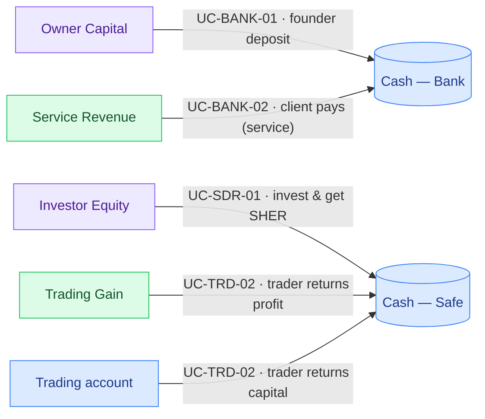
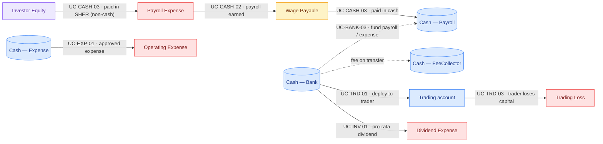
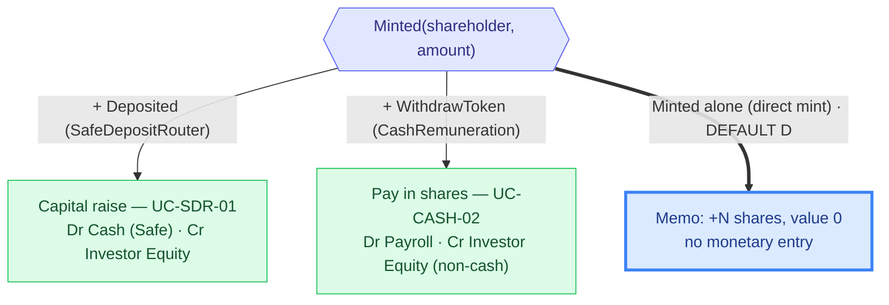

# CNC — Money-Flow Catalogue & Accounting Exercise

This document stands on its own. It lists **every way money can move** across the CNC contracts, maps each one to a journal entry, and then runs a **full worked example** end to end: general ledger → T-accounts → trial balance → income statement → balance sheet.

> **Scope note.** Only the contracts the CNC actually uses today are catalogued; deployed-but-unused contracts are out of scope.

---

## Glossary (read this first)

Plain-English meaning of the terms used throughout, so anyone on the team can follow.

| Term                         | Meaning                                                                                                                                               |
| ---------------------------- | ----------------------------------------------------------------------------------------------------------------------------------------------------- |
| **Use case (UC)**            | One specific way money moves, with an ID like `UC-BANK-01`, reusable in tickets and tests.                                                            |
| **Debit (Dr) / Credit (Cr)** | The two sides of every entry. Every entry has equal debits and credits — that is what keeps the books balanced.                                       |
| **Account types**            | **Asset** (what the CNC owns), **Liability** (what it owes), **Equity** (the owners' stake), **Income** (revenue/gains), **Expense** (costs/losses).  |
| **Normal balance**           | Assets & Expenses sit on the **debit** side; Liabilities, Equity & Income sit on the **credit** side.                                                 |
| **Mint**                     | Creating new **SHER** units. SHER is the CNC ownership token (a share), issued by `InvestorV1`.                                                       |
| **Native vs ERC-20**         | _Native_ = the chain's own coin (POL on Polygon). _ERC-20_ = a token such as USDC or USDT.                                                            |
| **Cash basis vs accrual**    | _Cash basis_ = recorded when money actually moves on-chain. _Accrual_ = recorded when earned/owed (used for payroll, via a `Wage Payable` liability). |
| **GL / IS / BS**             | General ledger (the journal) / income statement (profit & loss) / balance sheet.                                                                      |

---

## 1. The CNC entity

The CNC "company" is the **protocol entity**: its treasury contracts plus its equity contract. We keep **one consolidated set of books** for it; cash is tracked per on-chain account ("pocket"), but they all roll up into total Cash.

| Inside the CNC books  | On-chain home            |
| --------------------- | ------------------------ |
| Operating treasury    | `Bank`                   |
| Protocol fee treasury | `FeeCollector`           |
| Payroll               | `CashRemunerationEIP712` |
| Expense budget        | `ExpenseAccountEIP712`   |
| Equity / dividends    | `InvestorV1` (SHER)      |
| Capital raises → Safe | `SafeDepositRouter`      |

---

## 2. Contracts that move money (Step 1)

Source: `app/src/artifacts/deployed_addresses/chain-31337.json` + `contract/contracts/`. Confirmed against what is actually deployed **and used**.

| #   | Contract                   | Native | ERC-20 | Role                                                                         |
| --- | -------------------------- | :----: | :----: | ---------------------------------------------------------------------------- |
| 1   | **Bank**                   |   ✅   |   ✅   | Operating treasury (deposits, transfers, dividend funding)                   |
| 2   | **FeeCollector**           |   ✅   |   ✅   | Collects protocol fees on Bank transfers                                     |
| 3   | **CashRemunerationEIP712** |   ✅   |   ✅   | Payroll — signed wage claims (cash and/or SHER)                              |
| 4   | **ExpenseAccountEIP712**   |   ✅   |   ✅   | Expense budget — signed payouts                                              |
| 5   | **InvestorV1**             |   ✅   |   ✅   | Equity (SHER mints) and dividend distribution                                |
| 6   | **SafeDepositRouter**      |   ❌   |   ✅   | "Invest & get SHER" — deposits land in the Safe, mints SHER at a fixed price |

Deployed contracts that **do not move money** (governance / wiring, out of scope): `BoardOfDirectors`, `Proposals`, `Elections`, `Officer`, proxies/beacons, `Voting`. `Officer` is only read (fee lookup via `getFeeFor`); it holds no funds.

---

## 3. Monetary interactions per contract (Step 2)

Direction: **IN** (money in), **OUT** (money out), **INT** (internal transfer between CNC accounts), **MINT** (creates new shares).

### 3.1 Bank — treasury

| Function                      | Asset  | Direction                      | Caller | Fee?               | Event                           |
| ----------------------------- | ------ | ------------------------------ | ------ | ------------------ | ------------------------------- |
| `receive()`                   | native | IN                             | anyone | no                 | `Deposited`                     |
| `depositToken()`              | ERC-20 | IN                             | anyone | no                 | `TokenDeposited`                |
| `transfer()`                  | native | OUT (+ fee)                    | owner  | yes → FeeCollector | `Transfer` + `FeePaid`          |
| `transferToken()`             | ERC-20 | OUT (+ fee on eligible tokens) | owner  | yes (USDC/USDT)    | `TokenTransfer` + `FeePaid`     |
| `distributeNativeDividends()` | native | INT → InvestorV1               | owner  | no                 | `DividendDistributionTriggered` |
| `distributeTokenDividends()`  | ERC-20 | INT → InvestorV1               | owner  | no                 | `DividendDistributionTriggered` |

### 3.2 FeeCollector — protocol fees

| Function                     | Asset           | Direction         | Caller           | Event                         |
| ---------------------------- | --------------- | ----------------- | ---------------- | ----------------------------- |
| `payFee()` / `payFeeToken()` | native / ERC-20 | IN                | billing contract | `FeePaid`                     |
| `withdraw()`                 | native + ERC-20 | OUT → beneficiary | owner            | `Withdrawn`, `TokenWithdrawn` |

### 3.3 CashRemunerationEIP712 — payroll

| Function                   | Asset                                       | Direction  | Caller                  | Event                        |
| -------------------------- | ------------------------------------------- | ---------- | ----------------------- | ---------------------------- |
| `receive()`                | native                                      | IN         | anyone                  | `Deposited`                  |
| `withdraw()`               | native **or** ERC-20 **or** InvestorV1 mint | OUT / MINT | employee (signed claim) | `Withdraw` / `WithdrawToken` |
| `ownerWithdrawAllToBank()` | native + ERC-20                             | INT → Bank | owner                   | `OwnerTreasuryWithdraw*`     |

### 3.4 ExpenseAccountEIP712 — expense budget

| Function                       | Asset                | Direction  | Caller                           | Event                          |
| ------------------------------ | -------------------- | ---------- | -------------------------------- | ------------------------------ |
| `receive()` / `depositToken()` | native / ERC-20      | IN         | anyone                           | `Deposited` / `TokenDeposited` |
| `transfer()`                   | native **or** ERC-20 | OUT        | approved spender (signed budget) | `Transfer` / `TokenTransfer`   |
| `ownerWithdrawAllToBank()`     | native + ERC-20      | INT → Bank | owner                            | `OwnerTreasuryWithdraw*`       |

### 3.5 InvestorV1 — equity & dividends

| Function                                                     | Asset           | Direction      | Caller              | Event                                 |
| ------------------------------------------------------------ | --------------- | -------------- | ------------------- | ------------------------------------- |
| `distributeMint()` / `individualMint()`                      | SHER shares     | MINT           | owner / MINTER_ROLE | `Minted`                              |
| `distributeNativeDividends()` / `distributeTokenDividends()` | native / ERC-20 | OUT (pro-rata) | Bank                | `DividendDistributed`, `DividendPaid` |

### 3.6 SafeDepositRouter — invest → SHER mint

| Function                              | Asset  | Direction             | Caller | Event       |
| ------------------------------------- | ------ | --------------------- | ------ | ----------- |
| `deposit()` / `depositWithSlippage()` | ERC-20 | IN → Safe + MINT SHER | anyone | `Deposited` |

---

## 4. Chart of accounts (Step 4)

The accounts used across the use cases and the worked example.

| Account                                                   | Type      | Normal balance | Notes                                                     |
| --------------------------------------------------------- | --------- | -------------- | --------------------------------------------------------- |
| **Cash — Bank / Safe / Payroll / Expense / FeeCollector** | Asset     | Debit          | One pocket per on-chain account; rolls up into total Cash |
| **Trading account**                                       | Asset     | Debit          | Capital deployed to an external trader, carried at cost   |
| **Wage Payable**                                          | Liability | Credit         | Payroll earned but not yet paid (accrual)                 |
| **Owner Capital**                                         | Equity    | Credit         | Founder deposits with no shares in return                 |
| **Investor Equity**                                       | Equity    | Credit         | SHER share capital (mints with real value behind them)    |
| **Retained Earnings**                                     | Equity    | Credit         | Cumulative net income                                     |
| **Service Revenue**                                       | Income    | Credit         | Payment from a client for a service                       |
| **Trading Gain**                                          | Income    | Credit         | Profit returned by the trader                             |
| **Payroll Expense**                                       | Expense   | Debit          | Wages earned                                              |
| **Operating Expense**                                     | Expense   | Debit          | Approved expense payouts                                  |
| **Trading Loss**                                          | Expense   | Debit          | Loss on capital deployed to the trader                    |
| **Dividend Expense**                                      | Expense   | Debit          | Dividend distributed to shareholders                      |

> **Fees.** A fee on a Bank transfer moves cash from Bank to `Cash — FeeCollector` — both are CNC pockets, so it is an **internal move**, not revenue. (If you ever bill an external team, recognise it as `Protocol Fee Revenue` at FeeCollector instead.)

---

## 5. Use cases + journal entries (Step 3)

**How to read the graphs:** the arrow goes from the **credited** account (where the value comes from) to the **debited** account (where it lands) — the direction of the money. Colour = account type: 🟦 Asset · 🟪 Equity · 🟩 Income · 🟥 Expense · 🟨 Liability. A **dotted** arrow = an internal transfer between CNC pockets.

### 5.1 Money coming in



| UC             | Interaction                             | Journal entry                                                            |
| -------------- | --------------------------------------- | ------------------------------------------------------------------------ |
| **UC-BANK-01** | founder deposits capital (no shares)    | Dr Cash — Bank · Cr Owner Capital                                        |
| **UC-BANK-02** | client pays for a service               | Dr Cash — Bank · Cr Service Revenue                                      |
| **UC-SDR-01**  | invest & get SHER (owner **or** member) | Dr Cash — Safe · Cr Investor Equity                                      |
| **UC-TRD-02**  | trader returns capital + profit         | Dr Cash — Safe · Cr Trading account (capital) · Cr Trading Gain (profit) |

> **Owner Capital vs Investor Equity.** A founder _depositing_ money (no shares) → Owner Capital. Anyone (owner **or** member) who _invests and receives SHER_ → Investor Equity, because they get shares. The same person can do both.

### 5.2 Money going out



| UC             | Interaction                            | Journal entry                                                                     |
| -------------- | -------------------------------------- | --------------------------------------------------------------------------------- |
| **UC-CASH-02** | wage earned (accrual, at claim)        | Dr Payroll Expense · Cr Wage Payable (cash part) · Cr Investor Equity (SHER part) |
| **UC-CASH-03** | wage paid (at withdraw)                | Dr Wage Payable · Cr Cash — Payroll                                               |
| **UC-EXP-01**  | approved expense paid (cash basis)     | Dr Operating Expense · Cr Cash — Expense                                          |
| **UC-INV-01**  | dividend paid pro-rata                 | Dr Dividend Expense · Cr Cash — Bank                                              |
| **UC-BANK-03** | fund payroll/expense from Bank (+ fee) | Dr Cash — Payroll/Expense · Dr Cash — FeeCollector (fee) · Cr Cash — Bank         |
| **UC-TRD-01**  | deploy capital to trader               | Dr Trading account · Cr Cash — Bank                                               |
| **UC-TRD-03**  | trader loses part of the capital       | Dr Cash (returned) · Dr Trading Loss · Cr Trading account                         |

### 5.3 Payroll is accrual; expense is cash basis

Payroll is recognised **when earned** (the claim), against a `Wage Payable` liability, then settled at the withdraw. Expense is recognised **only when paid**. The SHER part of a wage is **equity-settled**: it goes straight to `Investor Equity`, never to `Wage Payable`.

```
CLAIM    Dr Payroll Expense   X
            Cr Wage Payable        (cash + POL part)
            Cr Investor Equity     (SHER part)
WITHDRAW Dr Wage Payable      (cash + POL part)
            Cr Cash — Payroll
```

### 5.4 SHER mints — three paths, one `Minted` event

Every mint **credits `Investor Equity` in shares**; what changes is the **debit** (what the CNC received):



> **Default D.** A direct `individualMint` / `distributeMint` with no cash and no service behind it → **no monetary entry**; only the share count moves. Reconcile shares (`Σ Minted` = on-chain supply) separately from value (`Investor Equity` only holds mints with real value behind them).

---

## 6. Worked example — a full period

This is the scenario in the companion spreadsheet, booked end to end. Amounts in USD (POL converted; SHER valued at the agreed price). It balances at every level.

### 6.1 The events

1. Ravi invests $100 & gets SHER · 2. Geor invests $10 & gets SHER · 3. Client pays $100 (service) · 4. Deploy $30 to trader · 5. Trader returns $30 + $15 profit · 6. Transfer $71.75 Safe → Bank (fund operations) · 7. Ravi funds payroll $50.02 (fee $0.02) · 8. Ravi funds payroll 22 POL (fee $0.01) · 9. Geor claims $40 + 10 POL + 10 SHER · 10. Geor withdraws the same · 11. Ravi funds expense $50 (fee $0.20) · 12. Geor withdraws $20 expense · 13. Redeploy $30 to trader · 14. Trader returns $10 & loses $20 · 15. HR invests $10 & gets SHER · 16. GRG invests $8 & gets SHER · 17. Ravi mints 30 SHER for himself (Default D) · 18. Ravi pays $20 dividend.

### 6.2 General ledger (journal)

| Flux                                   | Account                     |      Debit |     Credit |
| -------------------------------------- | --------------------------- | ---------: | ---------: |
| Ravi invests $100 & gets SHER          | Cash — Safe                 |        100 |            |
|                                        | Investor Equity             |            |        100 |
| Geor invests $10 & gets SHER           | Cash — Safe                 |         10 |            |
|                                        | Investor Equity             |            |         10 |
| Client pays $100 (service)             | Cash — Bank                 |        100 |            |
|                                        | Service Revenue             |            |        100 |
| Deploy $30 to trader                   | Trading account             |         30 |            |
|                                        | Cash — Bank                 |            |         30 |
| Trader returns $30 + $15 profit        | Cash — Safe                 |         45 |            |
|                                        | Trading account             |            |         30 |
|                                        | Trading Gain                |            |         15 |
| Transfer Safe → Bank (fund operations) | Cash — Bank                 |      71.75 |            |
|                                        | Cash — Safe                 |            |      71.75 |
| Ravi funds payroll $50.02              | Cash — Payroll              |         50 |            |
|                                        | Cash — FeeCollector         |       0.02 |            |
|                                        | Cash — Bank                 |            |      50.02 |
| Ravi funds payroll 22 POL              | Cash — Payroll              |       1.72 |            |
|                                        | Cash — FeeCollector         |       0.01 |            |
|                                        | Cash — Bank                 |            |       1.73 |
| Geor claims $40 + 10 POL + 10 SHER     | Payroll Expense             |       50.8 |            |
|                                        | Wage Payable                |            |       40.8 |
|                                        | Investor Equity (10 SHER)   |            |         10 |
| Geor withdraws $40 + 10 POL + 10 SHER  | Wage Payable                |       40.8 |            |
|                                        | Cash — Payroll              |            |       40.8 |
| Ravi funds expense $50                 | Cash — Expense              |       49.8 |            |
|                                        | Cash — FeeCollector         |        0.2 |            |
|                                        | Cash — Bank                 |            |         50 |
| Geor withdraws $20 expense             | Operating Expense           |         20 |            |
|                                        | Cash — Expense              |            |         20 |
| Redeploy $30 to trader                 | Trading account             |         30 |            |
|                                        | Cash — Bank                 |            |         30 |
| Trader returns $10 & loses $20         | Cash — Bank                 |         10 |            |
|                                        | Trading Loss                |         20 |            |
|                                        | Trading account             |            |         30 |
| HR invests $10 & gets SHER             | Cash — Safe                 |         10 |            |
|                                        | Investor Equity             |            |         10 |
| GRG invests $8 & gets SHER             | Cash — Safe                 |          8 |            |
|                                        | Investor Equity             |            |          8 |
| Ravi mints 30 SHER (Default D)         | — no entry (memo: +30 SHER) |            |            |
| Ravi pays $20 dividend                 | Dividend Expense            |         20 |            |
|                                        | Cash — Bank                 |            |         20 |
| **TOTAL**                              |                             | **668.10** | **668.10** |

### 6.3 T-accounts (per account)

```
Cash — Safe                              Cash — Bank
Dr                | Cr                    Dr                  | Cr
Ravi invest  100  | → Bank      71.75     client paie    100  | → trader        30
geor invest   10  |                       trader return   10  | → payroll    50.02
trader ret    45  |                       from Safe    71.75  | → payroll POL 1.73
hr invest     10  |                                           | → expense       50
grg invest     8  |                                           | → trader rede.  30
                  |                                           | dividend        20
Solde (Dr) 101.25 |                       Solde            0  |

Cash — Payroll              Cash — FeeCollector       Cash — Expense
Dr           | Cr           Dr             | Cr        Dr          | Cr
from Bank 50 | geor w. 40.8 fee payroll 0.02|          from Bank 49.8| geor exp 20
from POL 1.72|              fee POL    0.01 |          Solde 29.8   |
Solde 10.92  |              fee expense 0.2 |
                            Solde (Dr) 0.23 |

Trading account                 Investor Equity         Service Revenue
Dr           | Cr              Dr | Cr                  Dr | Cr
→ trader  30 | return    30        | Ravi      100          | client   100
redeploy  30 | loss ret. 30        | geor       10      Solde (Cr) 100
Solde      0 |                      | geor wage  10
                                   | hr         10      Trading Gain
Wage Payable                       | grg         8      Dr | Cr
Dr        | Cr                  Solde (Cr) 138              | trader  15
geor w.40.8| geor claim 40.8                            Solde (Cr) 15
Solde    0 |

Payroll Expense (Dr) 50.8   Operating Expense (Dr) 20
Trading Loss   (Dr)   20    Dividend Expense  (Dr) 20
Owner Capital        0 (empty — everyone got shares or it was revenue)
```

### 6.4 Trial balance

| Account           | Type      |      Debit |     Credit |
| ----------------- | --------- | ---------: | ---------: |
| Cash              | Asset     |     142.20 |            |
| Trading account   | Asset     |          0 |            |
| Owner Capital     | Equity    |            |          0 |
| Investor Equity   | Equity    |            |        138 |
| Service Revenue   | Income    |            |        100 |
| Trading Gain      | Income    |            |         15 |
| Wage Payable      | Liability |          0 |          0 |
| Payroll Expense   | Expense   |      50.80 |            |
| Operating Expense | Expense   |         20 |            |
| Trading Loss      | Expense   |         20 |            |
| Dividend Expense  | Expense   |         20 |            |
| **TOTAL**         |           | **253.00** | **253.00** |

### 6.5 Income statement

|                         |           $ |
| ----------------------- | ----------: |
| Service Revenue         |     +100.00 |
| Trading Gain            |      +15.00 |
| **Total revenue**       | **+115.00** |
| Payroll Expense         |      −50.80 |
| Operating Expense       |      −20.00 |
| Trading Loss            |      −20.00 |
| Dividend Expense        |      −20.00 |
| **Total expenses**      | **−110.80** |
| **Net income (profit)** |   **+4.20** |

### 6.6 Balance sheet

|                                   |                      $ |
| --------------------------------- | ---------------------: |
| **ASSETS**                        |                        |
| Cash (USDC + POL)                 |                 142.20 |
| Trading account (at cost)         |                   0.00 |
| **Total assets**                  |             **142.20** |
| **LIABILITIES**                   |                        |
| None (Wage Payable settled)       |                   0.00 |
| **Total liabilities**             |               **0.00** |
| **EQUITY**                        |                        |
| Owner capital                     |                   0.00 |
| Investor equity (SHER)            |                 138.00 |
| Retained earnings (net profit)    |                   4.20 |
| **Total equity**                  |             **142.20** |
| **Assets = Liabilities + Equity** | **142.20 = 142.20** ✅ |

---

## 7. Reconciliation & notes

- **It balances at every level:** journal 668.10 = 668.10 · trial balance 253 = 253 · assets 142.20 = equity 142.20.
- **Internal transfers don't touch the statements.** Funding payroll/expense from Bank, and the Safe → Bank transfer, only move cash between pockets — no effect on the income statement, balance-sheet totals, or net trial balance. The Safe → Bank transfer of 71.75 exists only because operating payments (payroll, expense, dividend, trader) leave from Bank while the funding (investments) lands in Safe.
- **Fees stay inside Cash.** The $0.23 of fees moved from Bank to FeeCollector — both CNC pockets — so no revenue is recognised here.
- **Shares vs value.** `Investor Equity` ($138) only counts mints with real value behind them (investments + the SHER paid as wages). Ravi's 30-SHER direct mint is **Default D** — tracked as +30 shares at **$0**, so it never inflates equity value.
- **Owner Capital is $0** in this period: everyone who put money in either received shares (Investor Equity) or it was a client payment (Service Revenue) — nobody made a pure founder deposit.

### Coverage scorecard

| Step                          | Coverage                                                |
| ----------------------------- | ------------------------------------------------------- |
| 1 — Contracts that move money | ✅ 6 used contracts (§2)                                |
| 2 — Monetary interactions     | ✅ listed per contract (§3)                             |
| 3 — Use cases + entries       | ✅ UC-BANK / SDR / CASH / EXP / INV / TRD (§5)          |
| 4 — Chart of accounts         | ✅ asset / liability / equity / income / expense (§4)   |
| 5 — Reconciliation            | ✅ full worked example, balanced at every level (§6–§7) |
