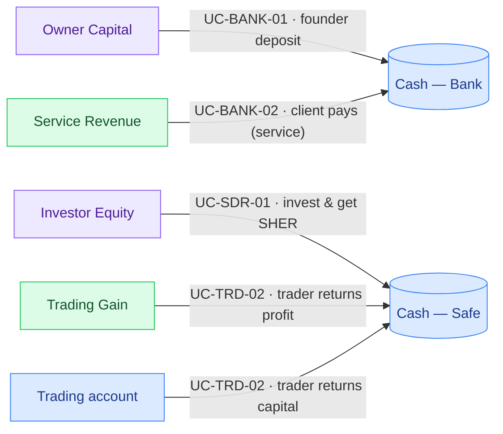
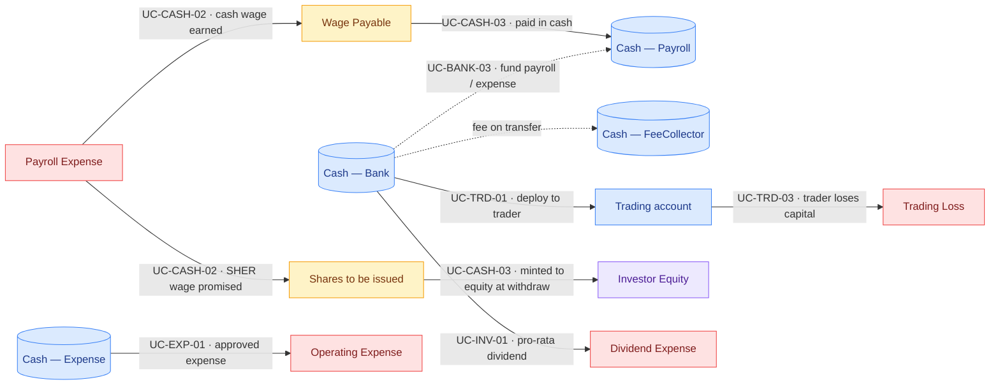
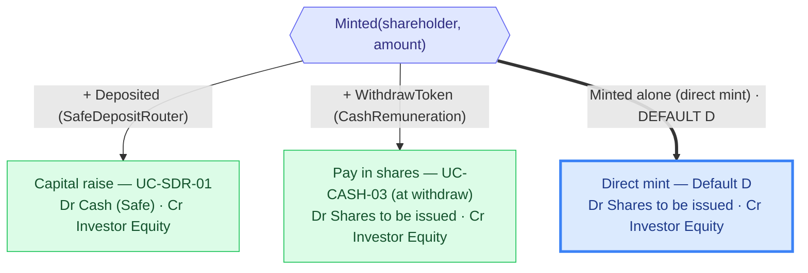

# CNC — Money-Flow Catalogue & Accounting Exercise

This document stands on its own. It lists **every way money can move** across the CNC contracts, maps each one to a journal entry, and then runs a **full worked example** end to end: general ledger → T-accounts → trial balance → income statement → balance sheet.

> **Scope note.** Only the contracts the CNC actually uses today are catalogued; deployed-but-unused contracts are out of scope.

---

## Glossary (read this first)

Plain-English meaning of the terms used throughout, so anyone on the team can follow.

| Term                         | Meaning                                                                                                                                               |
| ---------------------------- | ----------------------------------------------------------------------------------------------------------------------------------------------------- |
| **Use case (UC)**            | One specific way money moves, with an ID like `UC-BANK-01`, reusable in tickets and tests.                                                            |
| **Debit (Dr) / Credit (Cr)** | The two sides of every entry. Every entry has equal debits and credits — that is what keeps the books balanced.                                       |
| **Account types**            | **Asset** (what the CNC owns), **Liability** (what it owes), **Equity** (the owners' stake), **Income** (revenue/gains), **Expense** (costs/losses).  |
| **Normal balance**           | Assets & Expenses sit on the **debit** side; Liabilities, Equity & Income sit on the **credit** side.                                                 |
| **Mint**                     | Creating new **SHER** units. SHER is the CNC ownership token (a share), issued by `InvestorV1`.                                                       |
| **Native vs ERC-20**         | _Native_ = the chain's own coin (POL on Polygon). _ERC-20_ = a token such as USDC or USDT.                                                            |
| **Cash basis vs accrual**    | _Cash basis_ = recorded when money actually moves on-chain. _Accrual_ = recorded when earned/owed (used for payroll, via a `Wage Payable` liability). |
| **GL / IS / BS**             | General ledger (the journal) / income statement (profit & loss) / balance sheet.                                                                      |

---

## 1. The CNC entity

The CNC "company" is the **protocol entity**: its treasury contracts plus its equity contract. We keep **one consolidated set of books** for it; cash is tracked per on-chain account ("pocket"), but they all roll up into total Cash.

| Inside the CNC books  | On-chain home            |
| --------------------- | ------------------------ |
| Operating treasury    | `Bank`                   |
| Protocol fee treasury | `FeeCollector`           |
| Payroll               | `CashRemunerationEIP712` |
| Expense budget        | `ExpenseAccountEIP712`   |
| Equity / dividends    | `InvestorV1` (SHER)      |
| Capital raises → Safe | `SafeDepositRouter`      |

---

## 2. Contracts that move money (Step 1)

Source: `app/src/artifacts/deployed_addresses/chain-31337.json` + `contract/contracts/`. Confirmed against what is actually deployed **and used**.

| #   | Contract                   | Native | ERC-20 | Role                                                                         |
| --- | -------------------------- | :----: | :----: | ---------------------------------------------------------------------------- |
| 1   | **Bank**                   |   ✅   |   ✅   | Operating treasury (deposits, transfers, dividend funding)                   |
| 2   | **FeeCollector**           |   ✅   |   ✅   | Collects protocol fees on Bank transfers                                     |
| 3   | **CashRemunerationEIP712** |   ✅   |   ✅   | Payroll — signed wage claims (cash and/or SHER)                              |
| 4   | **ExpenseAccountEIP712**   |   ✅   |   ✅   | Expense budget — signed payouts                                              |
| 5   | **InvestorV1**             |   ✅   |   ✅   | Equity (SHER mints) and dividend distribution                                |
| 6   | **SafeDepositRouter**      |   ❌   |   ✅   | "Invest & get SHER" — deposits land in the Safe, mints SHER at a fixed price |

Deployed contracts that **do not move money** (governance / wiring, out of scope): `BoardOfDirectors`, `Proposals`, `Elections`, `Officer`, proxies/beacons, `Voting`. `Officer` is only read (fee lookup via `getFeeFor`); it holds no funds.

---

## 3. Monetary interactions per contract (Step 2)

Direction: **IN** (money in), **OUT** (money out), **INT** (internal transfer between CNC accounts), **MINT** (creates new shares).

### 3.1 Bank — treasury

| Function                      | Asset  | Direction                      | Caller | Fee?               | Event                           |
| ----------------------------- | ------ | ------------------------------ | ------ | ------------------ | ------------------------------- |
| `receive()`                   | native | IN                             | anyone | no                 | `Deposited`                     |
| `depositToken()`              | ERC-20 | IN                             | anyone | no                 | `TokenDeposited`                |
| `transfer()`                  | native | OUT (+ fee)                    | owner  | yes → FeeCollector | `Transfer` + `FeePaid`          |
| `transferToken()`             | ERC-20 | OUT (+ fee on eligible tokens) | owner  | yes (USDC/USDT)    | `TokenTransfer` + `FeePaid`     |
| `distributeNativeDividends()` | native | INT → InvestorV1               | owner  | no                 | `DividendDistributionTriggered` |
| `distributeTokenDividends()`  | ERC-20 | INT → InvestorV1               | owner  | no                 | `DividendDistributionTriggered` |

### 3.2 FeeCollector — protocol fees

| Function                     | Asset           | Direction         | Caller           | Event                         |
| ---------------------------- | --------------- | ----------------- | ---------------- | ----------------------------- |
| `payFee()` / `payFeeToken()` | native / ERC-20 | IN                | billing contract | `FeePaid`                     |
| `withdraw()`                 | native + ERC-20 | OUT → beneficiary | owner            | `Withdrawn`, `TokenWithdrawn` |

### 3.3 CashRemunerationEIP712 — payroll

| Function                   | Asset                                       | Direction  | Caller                  | Event                        |
| -------------------------- | ------------------------------------------- | ---------- | ----------------------- | ---------------------------- |
| `receive()`                | native                                      | IN         | anyone                  | `Deposited`                  |
| `withdraw()`               | native **or** ERC-20 **or** InvestorV1 mint | OUT / MINT | employee (signed claim) | `Withdraw` / `WithdrawToken` |
| `ownerWithdrawAllToBank()` | native + ERC-20                             | INT → Bank | owner                   | `OwnerTreasuryWithdraw*`     |

### 3.4 ExpenseAccountEIP712 — expense budget

| Function                       | Asset                | Direction  | Caller                           | Event                          |
| ------------------------------ | -------------------- | ---------- | -------------------------------- | ------------------------------ |
| `receive()` / `depositToken()` | native / ERC-20      | IN         | anyone                           | `Deposited` / `TokenDeposited` |
| `transfer()`                   | native **or** ERC-20 | OUT        | approved spender (signed budget) | `Transfer` / `TokenTransfer`   |
| `ownerWithdrawAllToBank()`     | native + ERC-20      | INT → Bank | owner                            | `OwnerTreasuryWithdraw*`       |

### 3.5 InvestorV1 — equity & dividends

| Function                                                     | Asset           | Direction      | Caller              | Event                                 |
| ------------------------------------------------------------ | --------------- | -------------- | ------------------- | ------------------------------------- |
| `distributeMint()` / `individualMint()`                      | SHER shares     | MINT           | owner / MINTER_ROLE | `Minted`                              |
| `distributeNativeDividends()` / `distributeTokenDividends()` | native / ERC-20 | OUT (pro-rata) | Bank                | `DividendDistributed`, `DividendPaid` |

### 3.6 SafeDepositRouter — invest → SHER mint

| Function                              | Asset  | Direction             | Caller | Event       |
| ------------------------------------- | ------ | --------------------- | ------ | ----------- |
| `deposit()` / `depositWithSlippage()` | ERC-20 | IN → Safe + MINT SHER | anyone | `Deposited` |

---

## 4. Chart of accounts (Step 4)

The accounts used across the use cases and the worked example.

| Account                                                   | Type      | Normal balance | Notes                                                       |
| --------------------------------------------------------- | --------- | -------------- | ----------------------------------------------------------- |
| **Cash — Bank / Safe / Payroll / Expense / FeeCollector** | Asset     | Debit          | One pocket per on-chain account; rolls up into total Cash   |
| **Trading account**                                       | Asset     | Debit          | Capital deployed to an external trader, carried at cost     |
| **Wage Payable**                                          | Liability | Credit         | Payroll earned but not yet paid (accrual)                   |
| **Shares to be issued**                                   | Liability | Credit         | SHER earned but not yet taken; floats at the current multiplier while pending, then clears into equity frozen at the withdraw-date value |
| **Owner Capital**                                         | Equity    | Credit         | Founder deposits with no shares in return                   |
| **Investor Equity**                                       | Equity    | Credit         | SHER share capital — capital raises, wages paid in shares, and direct mints |
| **Retained Earnings**                                     | Equity    | Credit         | Cumulative net income                                       |
| **Service Revenue**                                       | Income    | Credit         | Payment from a client for a service                         |
| **Trading Gain**                                          | Income    | Credit         | Profit returned by the trader                               |
| **Payroll Expense**                                       | Expense   | Debit          | Wages earned                                                |
| **Operating Expense**                                     | Expense   | Debit          | Approved expense payouts                                    |
| **Trading Loss**                                          | Expense   | Debit          | Loss on capital deployed to the trader                      |
| **Dividend Expense**                                      | Expense   | Debit          | Dividend distributed to shareholders                        |

> **Fees.** A fee on a Bank transfer moves cash from Bank to `Cash — FeeCollector` — both are CNC pockets, so it is an **internal move**, not revenue. (If you ever bill an external team, recognise it as `Protocol Fee Revenue` at FeeCollector instead.)

### Currency & valuation (rate of record)

Every entry is reported in **USD**. The **quantity** of each currency is what actually moved on-chain and never changes; only its USD equivalence does. How each currency is converted:

| Currency          | Rate of record                                     | Behaviour when the rate moves                                                                                                                                                                                          |
| ----------------- | -------------------------------------------------- | --------------------------------------------------------------------------------------------------------------------------------------------------------------------------------------------------------------------- |
| **USDC / USDT**   | pegged **$1.00**                                    | never moves                                                                                                                                                                                                            |
| **POL (native)**  | the **current live price** (CoinGecko)             | The POL quantity is fixed; only its USD value moves. **Every** POL posting — past and present — is shown at **today's** price, so the whole POL book re-values together and stays balanced (no per-date historical rate). |
| **SHER**          | the router **compensation multiplier** (1 SHER = `1 / multiplier` USD) | **Realization model** — a *taken* leg freezes, a *pending* leg floats (see below).                                                                                                     |

**SHER — freeze at withdrawal, float while pending.** A wage is a **fixed quantity of SHER** (e.g. 10 h × 5 SHER/h = 50 SHER, whatever the multiplier is); the multiplier only changes its USD value, never the number of SHER minted. So:

- a **withdrawal / mint** (UC-CASH-03 / Default D) is **frozen at the multiplier of its own date** — the value at which the shares were *taken* — and never moves again;
- a **pending accrual** (SHER earned but not yet withdrawn, held in `Shares to be issued`, UC-CASH-02) **floats at the current multiplier** — re-valued every time the multiplier moves, until it is withdrawn.

When a withdrawal settles an accrual, both legs carry the **withdrawal-date** value, so `Shares to be issued` nets to zero with no revaluation account. A partly-withdrawn accrual is quantity-weighted: the withdrawn part frozen, the rest still floating.

> **Why POL and SHER differ.** Pending SHER is a *promise* the company still owes (a liability), so marking it to the current rate just restates what is owed; once withdrawn it is *realized* equity and locks. POL is cash the company *holds* — its dollar-equivalence is simply recomputed at the current price, and because both sides of every POL entry move together the books never fall out of balance.

---

## 5. Use cases + journal entries (Step 3)

**How to read the graphs:** the arrow goes from the **credited** account (where the value comes from) to the **debited** account (where it lands) — the direction of the money. Colour = account type: 🟦 Asset · 🟪 Equity · 🟩 Income · 🟥 Expense · 🟨 Liability. A **dotted** arrow = an internal transfer between CNC pockets.

### 5.1 Money coming in



| UC             | Interaction                             | Journal entry                                                            |
| -------------- | --------------------------------------- | ------------------------------------------------------------------------ |
| **UC-BANK-01** | founder deposits capital (no shares)    | Dr Cash — Bank · Cr Owner Capital                                        |
| **UC-BANK-02** | client pays for a service               | Dr Cash — Bank · Cr Service Revenue                                      |
| **UC-SDR-01**  | invest & get SHER (owner **or** member) | Dr Cash — Safe · Cr Investor Equity                                      |
| **UC-TRD-02**  | trader returns capital + profit         | Dr Cash — Safe · Cr Trading account (capital) · Cr Trading Gain (profit) |

> **Owner Capital vs Investor Equity.** A founder _depositing_ money (no shares) → Owner Capital. Anyone (owner **or** member) who _invests and receives SHER_ → Investor Equity, because they get shares. The same person can do both.

### 5.2 Money going out



| UC             | Interaction                            | Journal entry                                                                                   |
| -------------- | -------------------------------------- | ----------------------------------------------------------------------------------------------- |
| **UC-CASH-02** | wage earned (accrual, at claim)        | Dr Payroll Expense · Cr Wage Payable (cash part) · Cr Shares to be issued (SHER part)           |
| **UC-CASH-03** | wage paid (at withdraw)                | Dr Wage Payable · Cr Cash — Payroll · Dr Shares to be issued · Cr Investor Equity (SHER minted) |
| **UC-EXP-01**  | approved expense paid (cash basis)     | Dr Operating Expense · Cr Cash — Expense                                                        |
| **UC-INV-01**  | dividend paid pro-rata                 | Dr Dividend Expense · Cr Cash — Bank                                                            |
| **UC-BANK-03** | fund payroll/expense from Bank (+ fee) | Dr Cash — Payroll/Expense · Dr Cash — FeeCollector (fee) · Cr Cash — Bank                       |
| **UC-TRD-01**  | deploy capital to trader               | Dr Trading account · Cr Cash — Bank                                                             |
| **UC-TRD-03**  | trader loses part of the capital       | Dr Cash (returned) · Dr Trading Loss · Cr Trading account                                       |

### 5.3 Payroll is accrual; expense is cash basis

Payroll is recognised **when earned** (the claim), against a `Wage Payable` liability, then settled at the withdraw. Expense is recognised **only when paid**. The SHER part of a wage is **not** booked to equity at the claim: the contract only mints (`individualMint`) when the employee calls `withdraw()`. So the SHER promised sits in a `Shares to be issued` liability from claim to withdraw, and becomes `Investor Equity` **only at withdraw** — matching the on-chain `WithdrawToken` / `Minted` events. It never touches `Wage Payable`.

```
CLAIM    Dr Payroll Expense        X
            Cr Wage Payable             (cash + POL part)
            Cr Shares to be issued      (SHER part)
WITHDRAW Dr Wage Payable             (cash + POL part)
            Cr Cash — Payroll
         Dr Shares to be issued      (SHER part)
            Cr Investor Equity          (minted at withdraw)
```

### 5.4 SHER mints — three paths, one `Minted` event

Every mint **credits `Investor Equity` in shares**; what changes is the **debit** (what the CNC received):



> **Default D.** A direct `individualMint` / `distributeMint` issues shares straight to equity — **Dr Shares to be issued · Cr Investor Equity**, valued at the SHER rate frozen at the mint date. When the mint corresponds to earlier wage accruals it clears them out of `Shares to be issued`; a mint with **no accrual behind it** debits `Shares to be issued` into a **contra (negative) balance** — a known edge to reconcile (`Σ Minted` = on-chain supply, checked against the value in `Investor Equity`).

---

## 6. Worked example — a full period

This is the scenario in the companion spreadsheet, booked end to end. Amounts in USD — POL at its current price, SHER at the router multiplier (see [Currency & valuation](#currency--valuation-rate-of-record)). This period has **no rate change**, so every SHER is valued at $1 and every POL amount is stable; the realization/float rules only bite once a rate moves. It balances at every level.

### 6.1 The events

The period runs **1 – 28 March 2026**. Each transaction is dated below, and the same dates drive the general-ledger journal in §6.2.

| #   | Date       | Event                                         |
| --- | ---------- | --------------------------------------------- |
| 1   | 2026-03-01 | Ravi invests $100 & gets SHER                 |
| 2   | 2026-03-01 | Geor invests $10 & gets SHER                  |
| 3   | 2026-03-03 | Client pays $100 (service)                    |
| 4   | 2026-03-04 | Deploy $30 to trader                          |
| 5   | 2026-03-10 | Trader returns $30 + $15 profit               |
| 6   | 2026-03-11 | Transfer $71.75 Safe → Bank (fund operations) |
| 7   | 2026-03-12 | Ravi funds payroll $50.02 (fee $0.02)         |
| 8   | 2026-03-12 | Ravi funds payroll 22 POL (fee $0.01)         |
| 9   | 2026-03-13 | Geor claims $40 + 10 POL + 10 SHER            |
| 10  | 2026-03-15 | Geor withdraws the same                       |
| 11  | 2026-03-16 | Ravi funds expense $50 (fee $0.20)            |
| 12  | 2026-03-17 | Geor withdraws $20 expense                    |
| 13  | 2026-03-18 | Redeploy $30 to trader                        |
| 14  | 2026-03-24 | Trader returns $10 & loses $20                |
| 15  | 2026-03-25 | HR invests $10 & gets SHER                    |
| 16  | 2026-03-25 | GRG invests $8 & gets SHER                    |
| 17  | 2026-03-26 | Ravi mints 30 SHER for himself (Default D)    |
| 18  | 2026-03-28 | Ravi pays $20 dividend                        |

> **Claim vs withdraw timing.** Geor's wage claim (#9, 13 Mar) and withdrawal (#10, 15 Mar) are two days apart. The cash + POL owed sits in `Wage Payable` and the SHER promised sits in `Shares to be issued` until the withdrawal settles both — see §5.3.

### 6.2 General ledger (journal)

| Date       | Flux                                   | Account                          |      Debit |     Credit |
| ---------- | -------------------------------------- | -------------------------------- | ---------: | ---------: |
| 2026-03-01 | Ravi invests $100 & gets SHER          | Cash — Safe                      |        100 |            |
|            |                                        | Investor Equity                  |            |        100 |
| 2026-03-01 | Geor invests $10 & gets SHER           | Cash — Safe                      |         10 |            |
|            |                                        | Investor Equity                  |            |         10 |
| 2026-03-03 | Client pays $100 (service)             | Cash — Bank                      |        100 |            |
|            |                                        | Service Revenue                  |            |        100 |
| 2026-03-04 | Deploy $30 to trader                   | Trading account                  |         30 |            |
|            |                                        | Cash — Bank                      |            |         30 |
| 2026-03-10 | Trader returns $30 + $15 profit        | Cash — Safe                      |         45 |            |
|            |                                        | Trading account                  |            |         30 |
|            |                                        | Trading Gain                     |            |         15 |
| 2026-03-11 | Transfer Safe → Bank (fund operations) | Cash — Bank                      |      71.75 |            |
|            |                                        | Cash — Safe                      |            |      71.75 |
| 2026-03-12 | Ravi funds payroll $50.02              | Cash — Payroll                   |         50 |            |
|            |                                        | Cash — FeeCollector              |       0.02 |            |
|            |                                        | Cash — Bank                      |            |      50.02 |
| 2026-03-12 | Ravi funds payroll 22 POL              | Cash — Payroll                   |       1.72 |            |
|            |                                        | Cash — FeeCollector              |       0.01 |            |
|            |                                        | Cash — Bank                      |            |       1.73 |
| 2026-03-13 | Geor claims $40 + 10 POL + 10 SHER     | Payroll Expense                  |       50.8 |            |
|            |                                        | Wage Payable                     |            |       40.8 |
|            |                                        | Shares to be issued (10 SHER)    |            |         10 |
| 2026-03-15 | Geor withdraws $40 + 10 POL + 10 SHER  | Wage Payable                     |       40.8 |            |
|            |                                        | Cash — Payroll                   |            |       40.8 |
|            |                                        | Shares to be issued              |         10 |            |
|            |                                        | Investor Equity (10 SHER minted) |            |         10 |
| 2026-03-16 | Ravi funds expense $50                 | Cash — Expense                   |       49.8 |            |
|            |                                        | Cash — FeeCollector              |        0.2 |            |
|            |                                        | Cash — Bank                      |            |         50 |
| 2026-03-17 | Geor withdraws $20 expense             | Operating Expense                |         20 |            |
|            |                                        | Cash — Expense                   |            |         20 |
| 2026-03-18 | Redeploy $30 to trader                 | Trading account                  |         30 |            |
|            |                                        | Cash — Bank                      |            |         30 |
| 2026-03-24 | Trader returns $10 & loses $20         | Cash — Bank                      |         10 |            |
|            |                                        | Trading Loss                     |         20 |            |
|            |                                        | Trading account                  |            |         30 |
| 2026-03-25 | HR invests $10 & gets SHER             | Cash — Safe                      |         10 |            |
|            |                                        | Investor Equity                  |            |         10 |
| 2026-03-25 | GRG invests $8 & gets SHER             | Cash — Safe                      |          8 |            |
|            |                                        | Investor Equity                  |            |          8 |
| 2026-03-26 | Ravi mints 30 SHER (Default D)         | Shares to be issued (30 SHER)    |         30 |            |
|            |                                        | Investor Equity                  |            |         30 |
| 2026-03-28 | Ravi pays $20 dividend                 | Dividend Expense                 |         20 |            |
|            |                                        | Cash — Bank                      |            |         20 |
| **TOTAL**  |                                        |                                  | **708.10** | **708.10** |

> **Ravi's direct mint (#17).** It has **no wage accrual behind it** (Ravi never claimed those 30 SHER), so the `Dr Shares to be issued` has nothing to cancel: `Shares to be issued` is pushed to a **−30 contra balance** and `Investor Equity` rises by 30. The books still balance (the entry is 30 = 30); this is the known unbacked-direct-mint edge from [§5.4](#54-sher-mints--three-paths-one-minted-event).

### 6.3 T-accounts (per account)

Each posting is tagged with the transaction number `#N` from §6.1 / §6.2, so every line traces back to a journal entry (Dr = left, Cr = right).

```
Cash — Safe (Asset)
Dr                       | Cr
#1  Ravi invest      100 | #6  → Bank          71.75
#2  Geor invest       10 |
#5  Trader return     45 |
#15 HR invest         10 |
#16 GRG invest         8 |
Solde (Dr)        101.25 |

Cash — Bank (Asset)
Dr                       | Cr
#3  Client (service) 100 | #4  → trader           30
#6  from Safe      71.75 | #7  → payroll       50.02
#14 Trader return     10 | #8  → payroll POL    1.73
                         | #11 → expense          50
                         | #13 → trader (rede.)   30
                         | #18 dividend           20
Solde                  0 |

Cash — Payroll (Asset)
Dr                       | Cr
#7  from Bank         50 | #10 Geor withdraw   40.8
#8  from Bank POL   1.72 |
Solde              10.92 |

Cash — FeeCollector (Asset)
Dr                       | Cr
#7  fee payroll     0.02 |
#8  fee POL         0.01 |
#11 fee expense      0.2 |
Solde (Dr)          0.23 |

Cash — Expense (Asset)
Dr                       | Cr
#11 from Bank       49.8 | #12 Geor expense       20
Solde               29.8 |

Trading account (Asset)
Dr                       | Cr
#4  deploy            30 | #5  return capital     30
#13 redeploy          30 | #14 loss writeoff      30
Solde                  0 |

Investor Equity (Equity)
Dr | Cr
   | #1  Ravi              100
   | #2  Geor               10
   | #10 Geor wage mint     10
   | #15 HR                 10
   | #16 GRG                 8
   | #17 Ravi direct mint   30
   | Solde (Cr)            168

Service Revenue (Income)
Dr | Cr
   | #3  Client            100
   | Solde (Cr)            100

Trading Gain (Income)
Dr | Cr
   | #5  Trader profit      15
   | Solde (Cr)             15

Wage Payable (Liability)
Dr                       | Cr
#10 Geor withdraw   40.8 | #9  Geor claim       40.8
Solde                  0 |

Shares to be issued (Liability)
Dr                       | Cr
#10 Geor withdraw     10 | #9  Geor claim (SHER)  10
#17 Ravi direct mint  30 |
Solde (Dr, contra)    30 |   (unbacked direct mint — see #17)

Payroll Expense   (Dr) 50.8  — #9
Operating Expense (Dr) 20    — #12
Trading Loss      (Dr) 20    — #14
Dividend Expense  (Dr) 20    — #18
Owner Capital          0     (empty — everyone got shares or it was revenue)
```

### 6.4 Trial balance

| Account             | Type      |      Debit |     Credit |
| ------------------- | --------- | ---------: | ---------: |
| Cash                | Asset     |     142.20 |            |
| Trading account     | Asset     |          0 |            |
| Owner Capital       | Equity    |            |          0 |
| Investor Equity     | Equity    |            |        168 |
| Service Revenue     | Income    |            |        100 |
| Trading Gain        | Income    |            |         15 |
| Wage Payable        | Liability |          0 |          0 |
| Shares to be issued | Liability |      30.00 |            |
| Payroll Expense     | Expense   |      50.80 |            |
| Operating Expense   | Expense   |         20 |            |
| Trading Loss        | Expense   |         20 |            |
| Dividend Expense    | Expense   |         20 |            |
| **TOTAL**           |           | **283.00** | **283.00** |

### 6.5 Income statement

|                         |           $ |
| ----------------------- | ----------: |
| Service Revenue         |     +100.00 |
| Trading Gain            |      +15.00 |
| **Total revenue**       | **+115.00** |
| Payroll Expense         |      −50.80 |
| Operating Expense       |      −20.00 |
| Trading Loss            |      −20.00 |
| Dividend Expense        |      −20.00 |
| **Total expenses**      | **−110.80** |
| **Net income (profit)** |   **+4.20** |

### 6.6 Balance sheet

|                                                   |                      $ |
| ------------------------------------------------- | ---------------------: |
| **ASSETS**                                        |                        |
| Cash (USDC + POL)                                 |                 142.20 |
| Trading account (at cost)                         |                   0.00 |
| **Total assets**                                  |             **142.20** |
| **LIABILITIES**                                   |                        |
| Wage Payable (settled)                            |                   0.00 |
| Shares to be issued (unbacked direct mint, contra) |                −30.00 |
| **Total liabilities**                             |              **−30.00** |
| **EQUITY**                                        |                        |
| Owner capital                                     |                   0.00 |
| Investor equity (SHER)                            |                 168.00 |
| Retained earnings (net profit)                    |                   4.20 |
| **Total equity**                                  |             **172.20** |
| **Assets = Liabilities + Equity**                 | **142.20 = −30.00 + 172.20** ✅ |

---

## 7. Reconciliation & notes

- **It balances at every level:** journal 708.10 = 708.10 · trial balance 283 = 283 · assets 142.20 = liabilities −30 + equity 172.20.
- **Internal transfers don't touch the statements.** Funding payroll/expense from Bank, and the Safe → Bank transfer, only move cash between pockets — no effect on the income statement, balance-sheet totals, or net trial balance. The Safe → Bank transfer of 71.75 exists only because operating payments (payroll, expense, dividend, trader) leave from Bank while the funding (investments) lands in Safe.
- **Fees stay inside Cash.** The $0.23 of fees moved from Bank to FeeCollector — both CNC pockets — so no revenue is recognised here.
- **Shares vs value.** `Investor Equity` ($168) counts capital raises ($100 + $10 + $10 + $8), the SHER paid as a wage ($10) and Ravi's direct mint ($30). Ravi's mint (**Default D**) issues 30 SHER straight to equity; because he never accrued them, the offsetting `Dr Shares to be issued` has nothing to cancel and leaves that liability at **−30** (contra) — the known unbacked-direct-mint edge. Still reconcile shares (`Σ Minted` = on-chain supply) against the value in `Investor Equity`.
- **SHER wages are recognised at withdraw, not at claim.** From the claim until the withdrawal, the SHER part of a wage sits in the `Shares to be issued` liability — **floating at the current multiplier** while it is pending. Only at `withdraw()` does `individualMint` fire and the value move into `Investor Equity`, **frozen at the withdraw-date multiplier**. This matches the on-chain `WithdrawToken` / `Minted` events. The withdraw nets the liability to $0, so it never appears on the balance sheet at period end — but in a period where a claim is open without a matching withdrawal, `Shares to be issued` carries the promised SHER, re-valued at the current multiplier.
- **Owner Capital is $0** in this period: everyone who put money in either received shares (Investor Equity) or it was a client payment (Service Revenue) — nobody made a pure founder deposit.

### Coverage scorecard

| Step                          | Coverage                                                |
| ----------------------------- | ------------------------------------------------------- |
| 1 — Contracts that move money | ✅ 6 used contracts (§2)                                |
| 2 — Monetary interactions     | ✅ listed per contract (§3)                             |
| 3 — Use cases + entries       | ✅ UC-BANK / SDR / CASH / EXP / INV / TRD (§5)          |
| 4 — Chart of accounts         | ✅ asset / liability / equity / income / expense (§4)   |
| 5 — Reconciliation            | ✅ full worked example, balanced at every level (§6–§7) |
