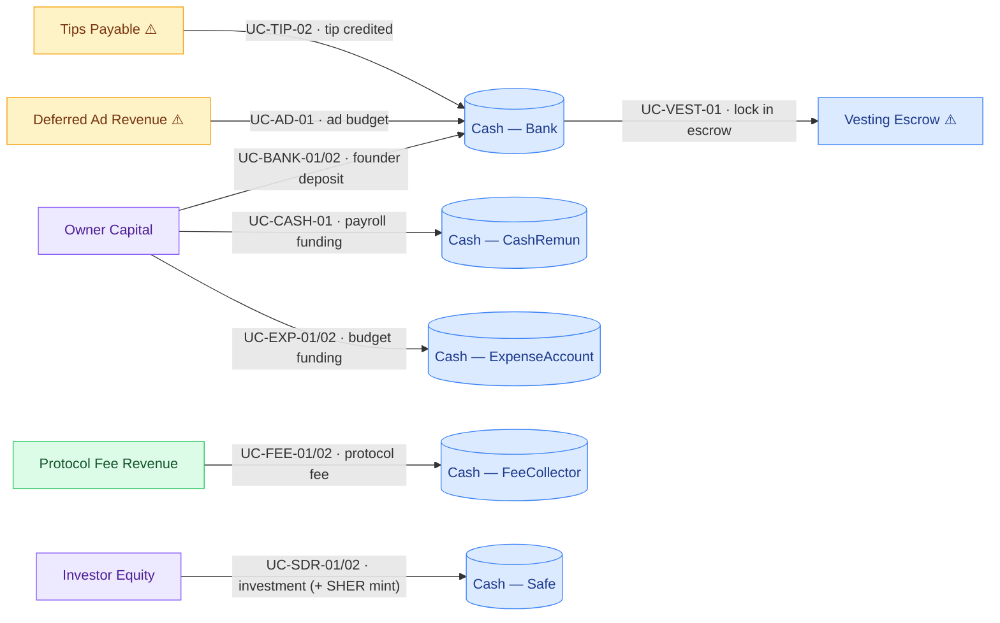
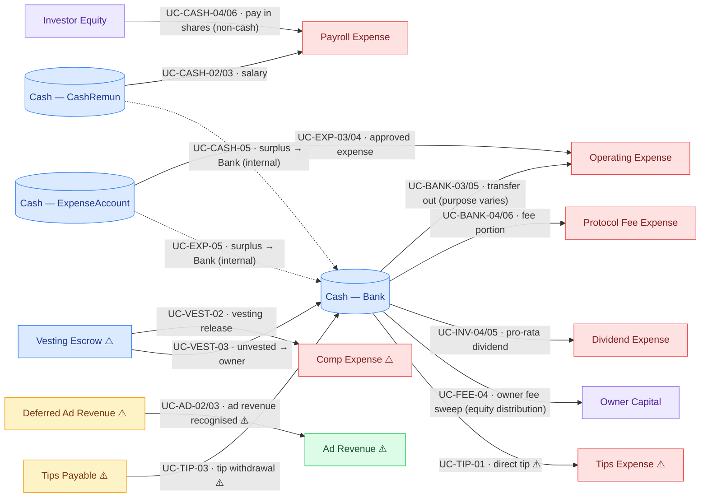
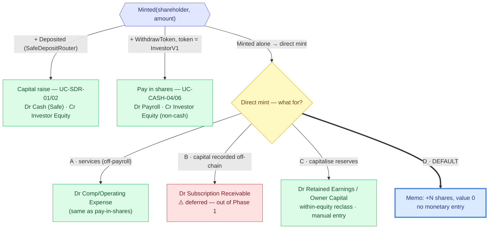
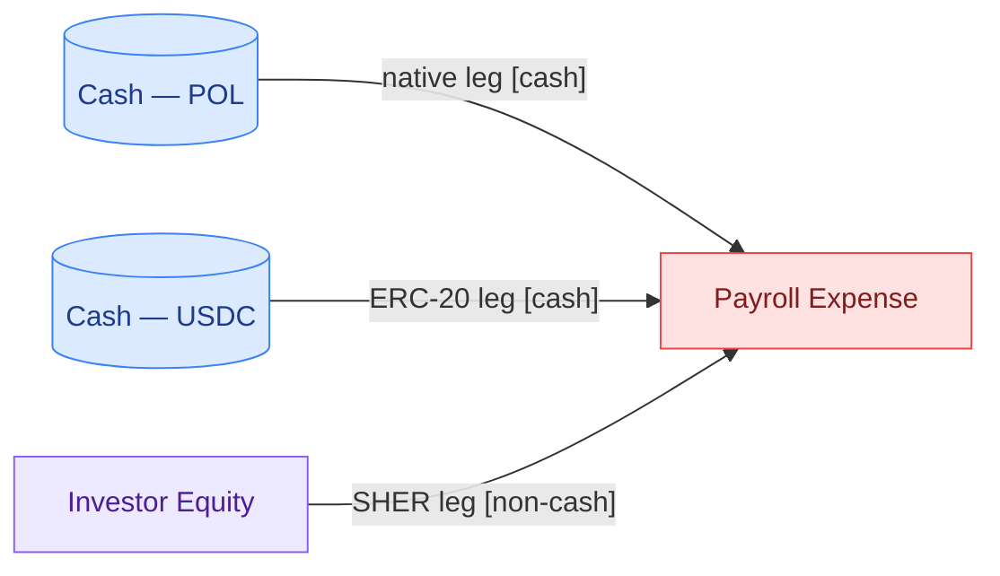
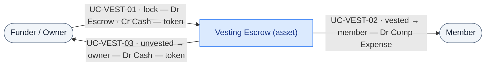

# CNC — Complete Money-Flow Catalogue & Accounting Reconciliation

**Status:** Draft (completeness check)
**Companion doc:** [`functional-specification.md`](./functional-specification.md) — the accounting spec this catalogue checks against.
**Context:** The CNC accounting pipeline records each smart contract into the books one by one. Before we trust the resulting financial statements, this document does the opposite, top-down check: it lists **every way money can move** across the CNC contracts, so we can prove nothing the CNC actually does is missing from the books.

> **v1.1 (2026-06-14)** — Added after a contract review: §3.3 consolidated recap of SHER share issuance (**Default D** for plain mints), UC-CASH-04 restated as _share-based pay_ at the SafeDepositRouter's fixed price, new **UC-CASH-06** (a single claim paid in several assets), §3.4 vesting split into two cases (cash vs SHER), and the reconciliation note "count SHER in shares, not in value".

---

## Glossary (read this first)

Plain-English meaning of the terms used throughout, so anyone on the team can follow.

| Term                         | Meaning                                                                                                                                                                        |
| ---------------------------- | ------------------------------------------------------------------------------------------------------------------------------------------------------------------------------ |
| **Use case (UC)**            | One specific way money moves, with an ID like `UC-BANK-01`. The ID is reused in implementation tickets and tests.                                                              |
| **Debit (Dr) / Credit (Cr)** | The two sides of every accounting entry. Every entry has equal debits and credits — that's what keeps the books balanced.                                                      |
| **Mint**                     | Creating new **SHER** units. SHER is the CNC ownership token (a share), issued by the `InvestorV1` contract.                                                                   |
| **Escrow**                   | Money locked inside a contract until conditions are met (e.g. a vesting schedule).                                                                                             |
| **Native vs ERC-20**         | _Native_ = the blockchain's own coin (ETH, or POL on Polygon). _ERC-20_ = a token such as USDC or USDT.                                                                        |
| **On-chain event**           | A record a contract emits when something happens (e.g. `Deposited`). Our indexer reads these to build the books.                                                               |
| **Ponder**                   | The tool that reads on-chain events and stores them so the app can use them. "Not indexed" = Ponder doesn't read that contract yet, so its activity is invisible to the books. |
| **GL / IS / BS**             | General ledger (the full journal) / income statement (profit & loss) / balance sheet.                                                                                          |
| **Equity**                   | The owners' stake in the CNC (founder capital, investor shares, retained earnings).                                                                                            |
| **Cash basis**               | We record a transaction at the moment money actually moves on-chain — not when it is merely promised or approved.                                                              |

---

## 0. Method — how this catalogue is built

Money in any company moves in **three stages**, and each stage maps to a step of the check:

| Stage                  | What it means                                    | Where the value sits                                   |
| ---------------------- | ------------------------------------------------ | ------------------------------------------------------ |
| **1 — Money comes in** | Funding and revenue entering the CNC             | Treasury accounts (Bank, FeeCollector, Expense, Safe…) |
| **2 — Money is held**  | The cash/asset accounts that hold the value      | "Where the money is" — the asset side                  |
| **3 — Money goes out** | Salaries, expenses, dividends, owner withdrawals | Expenses, equity distributions                         |

**The five steps:**

1. **List the contracts** — start from the actually deployed addresses (`app/src/artifacts/deployed_addresses/chain-*.json`), confirm the real list, not the theoretical one. → §1
2. **List the money interactions** — for each contract, every point that moves value (deposit, withdraw, transfer, claim, pay, mint, dividend, fee, tip, refund). → §2
3. **Write the use cases** — one per interaction. When an interaction has variants (native vs ERC-20, full vs partial, success vs failure/refund, single vs batch), each variant is its own use case. → §3
4. **Work out the accounting** — for each use case, the entry (debit/credit) aligned with the chart of accounts. → §3 + §4
5. **Reconcile coverage** — check every use case against the general ledger / income statement / balance sheet; flag any interaction with no home in the books, to either record it or consciously exclude it. → §5

---

## 1. Contract inventory (Step 1)

Source: `app/src/artifacts/deployed_addresses/chain-31337.json` + `contract/contracts/`. Confirmed against what's actually deployed.

| #   | Contract                   | Moves money? | Native | ERC-20 | Indexed by Ponder? | Inside CNC entity (spec §3) |
| --- | -------------------------- | :----------: | :----: | :----: | ------------------ | --------------------------- |
| 1   | **Bank**                   |      ✅      |   ✅   |   ✅   | ✅                 | CNC operating treasury      |
| 2   | **FeeCollector**           |      ✅      |   ✅   |   ✅   | ✅                 | Protocol fee treasury       |
| 3   | **CashRemunerationEIP712** |      ✅      |   ✅   |   ✅   | ✅                 | CNC payroll                 |
| 4   | **ExpenseAccountEIP712**   |      ✅      |   ✅   |   ✅   | ✅                 | CNC expense budget          |
| 5   | **InvestorV1**             |      ✅      |   ✅   |   ✅   | ✅                 | CNC equity / dividends      |
| 6   | **SafeDepositRouter**      |      ✅      |   ❌   |   ✅   | ✅ (topology only) | **Out of Phase 1 scope**    |

Deployed contracts that **do not move money** (governance / wiring, excluded from this catalogue): `BoardOfDirectors`, `Proposals`, `Elections`, `Officer`, `Proxies`/beacons, `Voting`. `Officer` is only read (fee lookup via `getFeeFor`); it holds no funds.

**Step 1 result:** 6 contracts move money. 5 are already covered by the accounting pipeline. **4 are not** (SafeDepositRouter) — these are the heart of the completeness check.

---

## 2. Money interactions per contract (Step 2)

Direction: **IN** (money in), **OUT** (money out), **INT** (internal transfer between CNC accounts), **MINT** (creates new shares).

### 2.1 Bank — treasury

| Function                      | Asset  | Direction                      | Caller | Fee?               | Event                           |
| ----------------------------- | ------ | ------------------------------ | ------ | ------------------ | ------------------------------- |
| `receive()`                   | native | IN                             | anyone | no                 | `Deposited`                     |
| `depositToken()`              | ERC-20 | IN                             | anyone | no                 | `TokenDeposited`                |
| `transfer()`                  | native | OUT (+ fee)                    | owner  | yes → FeeCollector | `Transfer` + `FeePaid`          |
| `transferToken()`             | ERC-20 | OUT (+ fee on eligible tokens) | owner  | yes (USDC/USDT)    | `TokenTransfer` + `FeePaid`     |
| `distributeNativeDividends()` | native | INT → InvestorV1               | owner  | no                 | `DividendDistributionTriggered` |
| `distributeTokenDividends()`  | ERC-20 | INT → InvestorV1               | owner  | no                 | `DividendDistributionTriggered` |

### 2.2 FeeCollector — protocol fees

| Function        | Asset           | Direction         | Caller           | Event                         |
| --------------- | --------------- | ----------------- | ---------------- | ----------------------------- |
| `payFee()`      | native          | IN                | billing contract | `FeePaid`                     |
| `payFeeToken()` | ERC-20          | IN                | billing contract | `FeePaid`                     |
| `receive()`     | native          | IN                | anyone           | —                             |
| `withdraw()`    | native + ERC-20 | OUT → beneficiary | owner            | `Withdrawn`, `TokenWithdrawn` |

### 2.3 CashRemunerationEIP712 — payroll

| Function                   | Asset                                       | Direction  | Caller                  | Event                               |
| -------------------------- | ------------------------------------------- | ---------- | ----------------------- | ----------------------------------- |
| `receive()`                | native                                      | IN         | anyone                  | `Deposited`                         |
| `withdraw()`               | native **or** ERC-20 **or** InvestorV1 mint | OUT / MINT | employee (signed claim) | `Withdraw` / `WithdrawToken`        |
| `ownerWithdrawAllToBank()` | native + ERC-20                             | INT → Bank | owner                   | `OwnerTreasuryWithdrawNative/Token` |

### 2.4 ExpenseAccountEIP712 — expense budget

| Function                   | Asset                | Direction  | Caller                           | Event                               |
| -------------------------- | -------------------- | ---------- | -------------------------------- | ----------------------------------- |
| `receive()`                | native               | IN         | anyone                           | `Deposited`                         |
| `depositToken()`           | ERC-20               | IN         | anyone                           | `TokenDeposited`                    |
| `transfer()`               | native **or** ERC-20 | OUT        | approved spender (signed budget) | `Transfer` / `TokenTransfer`        |
| `ownerWithdrawAllToBank()` | native + ERC-20      | INT → Bank | owner                            | `OwnerTreasuryWithdrawNative/Token` |

### 2.5 InvestorV1 — equity & dividends

| Function                      | Asset       | Direction             | Caller      | Event                                 |
| ----------------------------- | ----------- | --------------------- | ----------- | ------------------------------------- |
| `receive()`                   | native      | IN (dividend funding) | anyone/Bank | —                                     |
| `distributeMint()`            | SHER shares | MINT (batch)          | owner       | `Minted`                              |
| `individualMint()`            | SHER shares | MINT (single)         | MINTER_ROLE | `Minted`                              |
| `distributeNativeDividends()` | native      | OUT (pro-rata)        | Bank        | `DividendDistributed`, `DividendPaid` |
| `distributeTokenDividends()`  | ERC-20      | OUT (pro-rata)        | Bank        | `DividendDistributed`, `DividendPaid` |

### 2.6 SafeDepositRouter — invest → SHER mint

| Function                | Asset  | Direction                                 | Caller | Event             |
| ----------------------- | ------ | ----------------------------------------- | ------ | ----------------- |
| `deposit()`             | ERC-20 | IN → Safe + MINT SHER                     | anyone | `Deposited`       |
| `depositWithSlippage()` | ERC-20 | IN → Safe + MINT SHER (with `minSherOut`) | anyone | `Deposited`       |
| `recoverERC20()`        | ERC-20 | OUT (recovery)                            | owner  | `TokensRecovered` |

|

---

## 3. Use cases + accounting entries (Steps 3 + 4)

Entries follow the chart of accounts in §4. Amounts are in the token's own unit (USD memo optional). **CNC = the protocol entity** (spec §3): the "Owner Capital" and "Investor Equity" accounts are the CNC's.

> Legend: `Dr` = debit, `Cr` = credit. The **Cash — {token}** account exists per token (ETH / USDC / USDT / Other).

### 3.1 Money coming in (treasury / asset funding)

> **How to read the graph:** the arrow goes from the **credited** account (where the value comes from) to the **debited** account (where it lands) — that's the direction of the money. Colour = account type: 🟦 Asset · 🟪 Equity · 🟩 Income · 🟥 Expense · 🟨 Liability (Asset/Liability/Equity → **Balance sheet**; Expense/Income → **Income statement**). `⚠️` = account still to be created (§4.2). Edge label = `UC · interaction`.

> `UC-INV-02/03` (plain mint) is **not** shown above: it's **Default D**, no money moves (only the share count is tracked) — see §3.3.

### 3.2 Money going out (expenses, distributions, dividends, withdrawals)

> Same convention (credited → debited). A **dotted** arrow = an internal transfer between CNC accounts (cancels out when statements are consolidated).

> No money flow in the graph: `UC-INV-06` (failed dividend → **memo only**) and `UC-SDR-03` (`recoverERC20` → ⚪ out of Phase 1 scope).

**Variants to test** (each line above has several):

- **Asset:** native vs each whitelisted ERC-20 (USDC, USDT, USDCe, team token).
- **Outcome:** success vs **failure/refund** (e.g. `withdraw` above budget, `DividendPaymentFailed`).
- **Count:** single vs **batch** (`distributeMint`, multi-shareholder dividends, rounding dust given to the last shareholder).
- **Fee:** fee-eligible token (USDC/USDT) vs non-eligible (no fee charged).

---

### 3.3 SHER share issuance — consolidated recap (4 paths, 1 `Minted` event)

Every mint **always credits `Investor Equity` in shares**; what changes is the **debit** — what the CNC received in return. Four paths produce the same `Minted(shareholder, amount)` event; the indexer tells them apart by **what else happens in the same transaction**:

**Valuation (capital raise & pay-in-shares).** The SafeDepositRouter uses a **fixed price** (`multiplier`): `SHER minted = normalized(amount) × multiplier ÷ 10^sherDec`. So one SHER is worth (inverse) `sherAmount × 10^sherDec ÷ multiplier`. The pay-in-shares entry is **tagged non-cash / equity-settled** and **excluded from the PAYROLL_CASH identity** (no money actually left the treasury).

> **Phase 1 rule:** any direct `individualMint` / `distributeMint` → **Default D** (track the share count, no automatic money entry). Case **C** is a one-off manual entry, made the day the board actually capitalises reserves. **Never credit equity value without real value received.**

**UC-CASH-06 — one claim paid in several assets (compound entry).** A single `withdraw` loops over `Wage[]` and can pay POL + USDC + SHER in **one atomic transaction** (all succeed, or it all reverts). Indexer trap: USDC and SHER both emit the **same `WithdrawToken` event** — only `tokenAddress == InvestorV1` distinguishes a **share mint** (equity) from a **cash payout** (ERC-20).

Reconciliation is **split by leg**: POL + USDC → **PAYROLL_CASH**; SHER → **MINT_SHARES** (§5.2). One transaction feeds two different identities.

### 3.4 Vesting — two cases depending on the locked token

`Vesting` is a **pre-funded escrow**: `addVesting` moves the **whole** grant from the funder into the contract **up front** (`transferFrom(msg.sender, address(this), totalAmount)`). The expense is **not** recorded at the grant (nothing is earned yet) but **at `release`** (cash basis). The team's token (`teams[teamId].token`) decides the case — indexer check: `== InvestorV1` → Case 2, otherwise Case 1.

**Case 1 — CASH token (USDC…): deferred cash pay.**

_(Cr Cash at the grant = money leaving the treasury; or Owner Capital if the owner funds it from their own wallet.)_

**Case 2 — SHER token: deferred share-based pay (equity-settled).** The SHER was minted earlier (Default D, treasury shares with no value) then locked.

- **UC-VEST-01:** moving treasury shares → escrow = **memo only, no entry**.
- **UC-VEST-02** (_the recognition point_): `Dr Comp Expense · Cr Investor Equity` at the fixed price, **non-cash** — this is UC-CASH-04 triggered by `release`.
- **UC-VEST-03** unvested: shares go back to the treasury = **memo only**.

> **Blocking prerequisite:** `Vesting` is **not indexed** by Ponder (§1). None of these entries are possible until an indexer is added for `VestingCreated` / `TokensReleased` / `UnvestedWithdrawn` / `VestingStopped`.

---

## 4. Chart of accounts (Step 4) — reference and needed additions

### 4.1 Existing chart of accounts (from the spec)

ASSET: `Cash — ETH/USDC/USDT/Other`, `Protocol Fee Receivable` · EQUITY: `Investor Equity`, `Retained Earnings`, `Owner Capital / Treasury` · INCOME: `Protocol Fee Revenue` · EXPENSE: `Payroll Expense`, `Operating Expense`, `Infra Expense`, `Interest Expense`, `Dividend Expense`, `Protocol Fee Expense`.

**Consolidation note:** `bank_fee_paid` (an expense on the Bank side, UC-BANK-04/06) and `fee_collector_fee_paid` (revenue on the FeeCollector side, UC-FEE-01/02) are **the same economic event**. At the **protocol level**, recognise the **revenue at FeeCollector only**, and treat the Bank leg as an inter-account transfer (cancelled out on consolidation).

### 4.2 Accounts the completeness check shows are missing ⚠️

The current chart **does not cover** 4 contracts. Accounts to add (or an exclusion to formally accept):

| Proposed account                                         | Class     | Normal balance | Used by              |
| -------------------------------------------------------- | --------- | -------------- | -------------------- |
| **Tips Payable**                                         | LIABILITY | Credit         | UC-TIP-02, UC-TIP-03 |
| **Tips Expense**                                         | EXPENSE   | Debit          | UC-TIP-01            |
| **Deferred Ad Revenue** (revenue received in advance)    | LIABILITY | Credit         | UC-AD-01, UC-AD-03   |
| **Ad Revenue**                                           | INCOME    | Credit         | UC-AD-02, UC-AD-03   |
| **Vesting Escrow**                                       | ASSET     | Debit          | UC-VEST-01/02/03     |
| **Deferred Compensation** (optional, accrual accounting) | LIABILITY | Credit         | UC-VEST-01           |

> Today the chart has **no LIABILITY class at all** (Phase 1 balance sheet: "Liabilities = 0"). But `Tips.sendTip`, `AdCampaignManager.createAdCampaign` and vesting create **real obligations to other parties**. This is the main structural gap.

---

## 5. Coverage reconciliation (Step 5)

Each use case checked against the financial statement that should hold it. Status:
✅ **Booked** (indexed + rule in spec) · 🟡 **To book** (real, indexed interaction, but no explicit rule yet) · 🔴 **Gap** (not indexed → no home in the books) · ⚪ **Consciously excluded** (outside the CNC entity).

| UC               | Home account                      | GL  |  Income statement  | Balance sheet | Status                                                           |
| ---------------- | --------------------------------- | :-: | :----------------: | :-----------: | ---------------------------------------------------------------- |
| UC-FEE-01/02     | Protocol Fee Revenue              | ✅  |         ✅         |      ✅       | ✅ Booked                                                        |
| UC-FEE-04        | Owner Capital ↓                   | ✅  |         —          |      ✅       | ✅ Booked                                                        |
| UC-BANK-01/02    | Owner Capital                     | ✅  |         —          |      ✅       | ✅ Booked                                                        |
| UC-BANK-03/05    | Cash out                          | ✅  | depends on purpose |      ✅       | 🟡 Needs the purpose tagged                                      |
| UC-BANK-04/06    | Protocol Fee Expense              | ✅  |         ✅         |       —       | ✅ Booked (cancels on consolidation)                             |
| UC-BANK-07/08    | Dividend funding                  | ✅  |         —          |      ✅       | 🟡 To book (internal transfer to InvestorV1)                     |
| UC-CASH-01       | Owner Capital                     | ✅  |         —          |      ✅       | ✅ Booked                                                        |
| UC-CASH-02/03    | Payroll Expense                   | ✅  |         ✅         |      ✅       | ✅ Booked                                                        |
| UC-CASH-04 / 06  | Payroll Expense + Investor Equity | ✅  |         ✅         |      ✅       | 🟡 Share-based pay (non-cash, excluded from PAYROLL_CASH — §3.3) |
| UC-CASH-05       | Internal transfer → Bank          | ✅  |         —          |      ✅       | ✅ Booked (owner treasury withdraw)                              |
| UC-EXP-01/02     | Owner Capital                     | ✅  |         —          |      ✅       | ✅ Booked                                                        |
| UC-EXP-03/04     | Operating Expense                 | ✅  |         ✅         |      ✅       | ✅ Booked                                                        |
| UC-EXP-05        | Internal transfer → Bank          | ✅  |         —          |      ✅       | ✅ Booked                                                        |
| UC-INV-02/03     | Share-count memo (Default D)      | 🟡  |         —          |      🟡       | 🟡 Shares tracked, value not booked (Default D — §3.3)           |
| UC-INV-04/05     | Dividend Expense                  | ✅  |         ✅         |      ✅       | ✅ Booked                                                        |
| UC-INV-06        | Memo (failure)                    | 🟡  |         —          |       —       | 🟡 To record as a note                                           |
| UC-SDR-01/02/03  | Investor Equity / Cash            |  —  |         —          |      ✅       | ⚪ Excluded in Phase 1 (topology only)                           |
| UC-VEST-01/02/03 | Vesting Escrow / Comp Expense     | 🔴  |         🔴         |      🔴       | 🔴 **Gap — not indexed**                                         |
| UC-AD-01/02/03   | Ad Revenue / Deferred Ad Revenue  | 🔴  |         🔴         |      🔴       | 🔴 **Gap — not indexed**                                         |

### 5.1 Gaps to decide on

**non-fee revenue** stream → direct impact on the income statement if it's real.

1. **No LIABILITY class** in the chart of accounts — blocking for Tips, Ad, and accrual-based vesting.
2. **UC-BANK-03/05** (generic Bank transfers) — the purpose (expense? refund? transfer to another CNC contract?) can't be read from the event alone; needs a **purpose table** to decide the debit.

### 5.2 Reconciliation identities to add

On top of the spec's 8 identities, this catalogue adds:

- **AD_BUDGET:** Σ `createAdCampaign` − Σ (`claimPayment` + refunds) = the remaining on-chain budget of `AdCampaignManager`.
- **MINT_SHARES:** Σ `Minted` (InvestorV1) = the on-chain SHER total supply — **an identity in shares, not in value**. The booked `Investor Equity` value only includes mints with real value behind them (SDR investment, UC-CASH-04/06 pay, case C); Default-D plain mints track shares at **zero value**.

---

## 6. Conclusion — coverage scorecard

| Step                            | Coverage                                                                                                           |
| ------------------------------- | ------------------------------------------------------------------------------------------------------------------ |
| **1 — Contract inventory**      | ✅ 9 money-moving contracts identified vs deployed (§1)                                                            |
| **2 — Money interactions**      | ✅ ~30 in/out points listed (§2)                                                                                   |
| **3 — Use cases**               | ✅ ~40 `UC-*` use cases (incl. UC-CASH-06 multi-asset claim) + §3.3 mint recap (Default D) / §3.4 two-case vesting |
| **4 — Accounting entries**      | ✅ An entry per use case + 6 missing accounts identified (§3, §4)                                                  |
| **5 — Coverage reconciliation** | ✅ Every UC traced to GL/IS/BS; 3 contracts flagged as gaps + 3 new identities (§5)                                |

**Completeness verdict:** the accounting pipeline correctly covers Bank, FeeCollector, CashRemuneration, ExpenseAccount and InvestorV1. **Three contracts actually move money but have no home in the books today —** — and the chart of accounts is missing a LIABILITY class. These must be either indexed and booked, or explicitly excluded with a documented reason.
