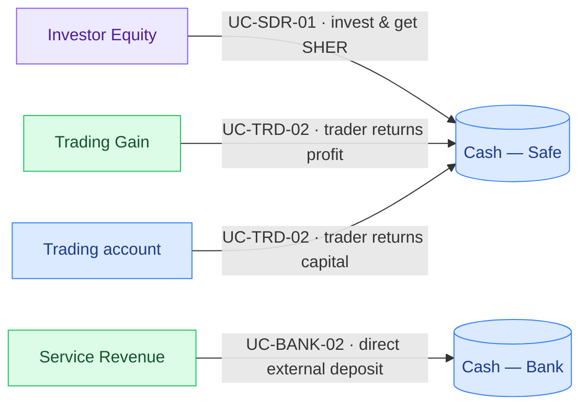
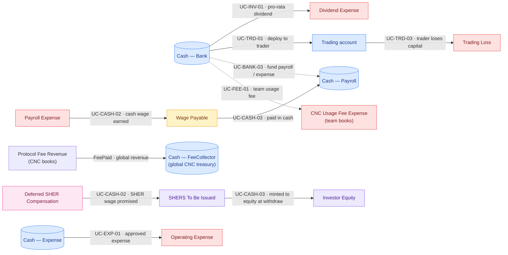
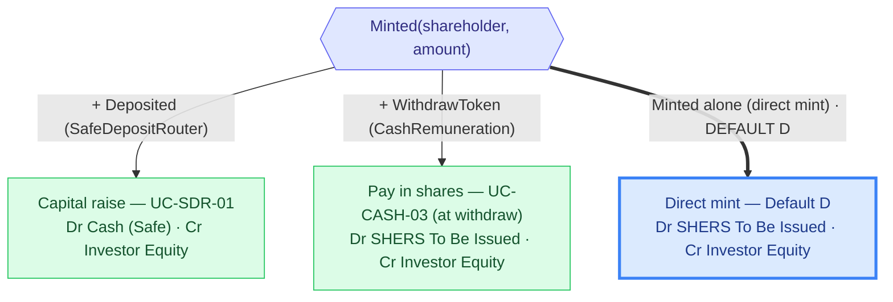

# CNC — Money-Flow Catalogue & Accounting Exercise

This document stands on its own. It lists **every way money can move** across the CNC contracts, maps each one to a journal entry, and then
runs a **full worked example** end to end: general ledger → T-accounts → trial balance → income statement → balance sheet.

> **Scope note.** Only the contracts the CNC actually uses today are catalogued; deployed-but-unused contracts are out of scope.

---

## Glossary (read this first)

Plain-English meaning of the terms used throughout, so anyone on the team can follow.

| Term                         | Meaning                                                                                                                                                                                                               |
| ---------------------------- | --------------------------------------------------------------------------------------------------------------------------------------------------------------------------------------------------------------------- |
| **Use case (UC)**            | One specific way money moves, with an ID like `UC-BANK-02`, reusable in tickets and tests.                                                                                                                            |
| **Debit (Dr) / Credit (Cr)** | The two sides of every entry. Every entry has equal debits and credits — that is what keeps the books balanced.                                                                                                       |
| **Account types**            | **Asset** (what the CNC owns), **Liability** (what it owes), **Equity** (the owners' stake), **Contra-equity** (reduces equity — e.g. deferred compensation), **Income** (revenue/gains), **Expense** (costs/losses). |
| **Normal balance**           | Assets, Expenses & Contra-equity sit on the **debit** side; Liabilities, Equity & Income sit on the **credit** side.                                                                                                  |
| **Mint**                     | Creating new **SHER** units. SHER is the CNC ownership token (a share), issued by `InvestorV1`.                                                                                                                       |
| **Native vs ERC-20**         | _Native_ = the chain's own coin (POL on Polygon). _ERC-20_ = a token such as USDC or USDT.                                                                                                                            |
| **Cash basis vs accrual**    | _Cash basis_ = recorded when money actually moves on-chain. _Accrual_ = recorded when earned/owed (used for payroll, via a `Wage Payable` liability).                                                                 |
| **GL / IS / BS**             | General ledger (the journal) / income statement (profit & loss) / balance sheet.                                                                                                                                      |

---

## 1. The CNC entity

The CNC "company" is the **protocol entity**: its global fee treasury plus its equity contract. Each team also has its own operational
contract set and books. The shared `FeeCollector` is not a team's pocket: every team pays its CNC usage fees into that global treasury, and
the CNC recognises the corresponding protocol-fee revenue.

| Inside the CNC books         | On-chain home            |
| ---------------------------- | ------------------------ |
| Operating treasury           | `Bank`                   |
| Global protocol fee treasury | `FeeCollector`           |
| Payroll                      | `CashRemunerationEIP712` |
| Expense budget               | `ExpenseAccountEIP712`   |
| Equity / dividends           | `InvestorV1` (SHER)      |
| Capital raises → Safe        | `SafeDepositRouter`      |

---

## 2. Contracts that move money (Step 1)

Source: `app/src/artifacts/deployed_addresses/chain-31337.json` + `contract/contracts/`. Confirmed against what is actually deployed **and
used**.

| #   | Contract                   | Native | ERC-20 | Role                                                                         |
| --- | -------------------------- | :----: | :----: | ---------------------------------------------------------------------------- |
| 1   | **Bank**                   |   ✅   |   ✅   | Operating treasury (deposits, transfers, dividend funding)                   |
| 2   | **FeeCollector**           |   ✅   |   ✅   | Collects protocol fees on Bank transfers                                     |
| 3   | **CashRemunerationEIP712** |   ✅   |   ✅   | Payroll — signed wage claims (cash and/or SHER)                              |
| 4   | **ExpenseAccountEIP712**   |   ✅   |   ✅   | Expense budget — signed payouts                                              |
| 5   | **InvestorV1**             |   ✅   |   ✅   | Equity (SHER mints) and dividend distribution                                |
| 6   | **SafeDepositRouter**      |   ❌   |   ✅   | "Invest & get SHER" — deposits land in the Safe, mints SHER at a fixed price |

Deployed contracts that **do not move money** (governance / wiring, out of scope): `BoardOfDirectors`, `Proposals`, `Elections`, `Officer`,
proxies/beacons, `Voting`. `Officer` is only read (fee lookup via `getFeeFor`); it holds no funds.

---

## 3. Monetary interactions per contract (Step 2)

Direction: **IN** (money in), **OUT** (money out), **INT** (internal transfer within one team's accounts), **FEE** (team-to-CNC protocol
payment), **MINT** (creates new shares).

### 3.1 Bank — treasury

| Function                      | Asset  | Direction                      | Caller | Fee?               | Event                           |
| ----------------------------- | ------ | ------------------------------ | ------ | ------------------ | ------------------------------- |
| `receive()`                   | native | IN                             | anyone | no                 | `Deposited`                     |
| `depositToken()`              | ERC-20 | IN                             | anyone | no                 | `TokenDeposited`                |
| `transfer()`                  | native | OUT (+ fee)                    | owner  | yes → FeeCollector | `Transfer` + `FeePaid`          |
| `transferToken()`             | ERC-20 | OUT (+ fee on eligible tokens) | owner  | yes (USDC/USDT)    | `TokenTransfer` + `FeePaid`     |
| `distributeNativeDividends()` | native | INT → InvestorV1               | owner  | no                 | `DividendDistributionTriggered` |
| `distributeTokenDividends()`  | ERC-20 | INT → InvestorV1               | owner  | no                 | `DividendDistributionTriggered` |

### 3.2 FeeCollector — protocol fees

| Function                     | Asset           | Direction         | Caller                      | Event                         |
| ---------------------------- | --------------- | ----------------- | --------------------------- | ----------------------------- |
| `payFee()` / `payFeeToken()` | native / ERC-20 | IN                | team contract (e.g. `Bank`) | `FeePaid`                     |
| `withdraw()`                 | native + ERC-20 | OUT → beneficiary | owner                       | `Withdrawn`, `TokenWithdrawn` |

### 3.3 CashRemunerationEIP712 — payroll

| Function                   | Asset                                       | Direction  | Caller                  | Event                        |
| -------------------------- | ------------------------------------------- | ---------- | ----------------------- | ---------------------------- |
| `receive()`                | native                                      | IN         | anyone                  | `Deposited`                  |
| `withdraw()`               | native **or** ERC-20 **or** InvestorV1 mint | OUT / MINT | employee (signed claim) | `Withdraw` / `WithdrawToken` |
| `ownerWithdrawAllToBank()` | native + ERC-20                             | INT → Bank | owner                   | `OwnerTreasuryWithdraw*`     |

### 3.4 ExpenseAccountEIP712 — expense budget

| Function                       | Asset                | Direction  | Caller                           | Event                          |
| ------------------------------ | -------------------- | ---------- | -------------------------------- | ------------------------------ |
| `receive()` / `depositToken()` | native / ERC-20      | IN         | anyone                           | `Deposited` / `TokenDeposited` |
| `transfer()`                   | native **or** ERC-20 | OUT        | approved spender (signed budget) | `Transfer` / `TokenTransfer`   |
| `ownerWithdrawAllToBank()`     | native + ERC-20      | INT → Bank | owner                            | `OwnerTreasuryWithdraw*`       |

### 3.5 InvestorV1 — equity & dividends

| Function                                                     | Asset           | Direction      | Caller              | Event                                 |
| ------------------------------------------------------------ | --------------- | -------------- | ------------------- | ------------------------------------- |
| `distributeMint()` / `individualMint()`                      | SHER shares     | MINT           | owner / MINTER_ROLE | `Minted`                              |
| `distributeNativeDividends()` / `distributeTokenDividends()` | native / ERC-20 | OUT (pro-rata) | Bank                | `DividendDistributed`, `DividendPaid` |

A distribution emits one `DividendPaid` per shareholder, so the canonical journal books one posting per shareholder (UC-INV-01, one token —
distributions are mono-currency). The general-ledger **view** folds those legs into one entry — one debit line per beneficiary under
Dividend Expense, then a single aggregated credit out of Cash — Bank — since the whole distribution is one on-chain transaction. This is
presentation-only: the underlying postings, the statements, the trial balance, and the per-line drill-down are unchanged.

### 3.6 SafeDepositRouter — invest → SHER mint

| Function                              | Asset  | Direction             | Caller | Event       |
| ------------------------------------- | ------ | --------------------- | ------ | ----------- |
| `deposit()` / `depositWithSlippage()` | ERC-20 | IN → Safe + MINT SHER | anyone | `Deposited` |

---

## 4. Chart of accounts (Step 4)

The accounts used across the use cases and the worked example.

| Account                                                   | Type      | Normal balance | Notes                                                                                                                                             |
| --------------------------------------------------------- | --------- | -------------- | ------------------------------------------------------------------------------------------------------------------------------------------------- |
| **Cash — Bank / Safe / Payroll / Expense / FeeCollector** | Asset     | Debit          | Team pockets plus the global FeeCollector treasury; report them separately before any consolidation                                               |
| **Trading account**                                       | Asset     | Debit          | Capital deployed to an external trader, carried at cost                                                                                           |
| **Wage Payable**                                          | Liability | Credit         | Payroll earned but not yet paid (accrual)                                                                                                         |
| **SHERS To Be Issued**                                    | Equity    | Credit         | SHER earned but not yet taken; floats at the current multiplier while pending, then clears into Investor Equity frozen at the withdraw-date value |
| **Deferred SHER Compensation**                            | Contra-eq | Debit          | SHER wages recognised but not yet settled — reduces total equity until issuance                                                                   |
| **Owner Capital**                                         | Equity    | Credit         | Founder deposits with no shares in return                                                                                                         |
| **Investor Equity**                                       | Equity    | Credit         | SHER share capital — capital raises, wages paid in shares, and direct mints                                                                       |
| **Retained Earnings**                                     | Equity    | Credit         | Cumulative net income                                                                                                                             |
| **Service Revenue**                                       | Income    | Credit         | Payment from a client for a service                                                                                                               |
| **Protocol Fee Revenue**                                  | Income    | Credit         | CNC usage fees paid by teams into the global FeeCollector                                                                                         |
| **Trading Gain**                                          | Income    | Credit         | Profit returned by the trader                                                                                                                     |
| **Payroll Expense**                                       | Expense   | Debit          | Wages earned                                                                                                                                      |
| **Operating Expense**                                     | Expense   | Debit          | Approved expense payouts                                                                                                                          |
| **CNC Usage Fee Expense**                                 | Expense   | Debit          | Fees paid by a team for using CNC services                                                                                                        |
| **Trading Loss**                                          | Expense   | Debit          | Loss on capital deployed to the trader                                                                                                            |
| **Dividend Expense**                                      | Expense   | Debit          | Dividend distributed to shareholders                                                                                                              |

> **Fees.** A fee on a team's Bank transfer is paid to the shared global `FeeCollector`. In the team's books it is `CNC Usage Fee Expense`;
> in the CNC protocol's books it is `Protocol Fee Revenue` and an increase in `Cash — FeeCollector`. It is not an internal move within the
> paying team.

### Currency & valuation (rate of record)

Every entry is reported in **USD**. The **quantity** of each currency is what actually moved on-chain and never changes; only its USD
equivalence does. How each currency is converted:

| Currency         | Rate of record                                                         | Behaviour when the rate moves                                                                                                                                                                                             |
| ---------------- | ---------------------------------------------------------------------- | ------------------------------------------------------------------------------------------------------------------------------------------------------------------------------------------------------------------------- |
| **USDC / USDT**  | pegged **$1.00**                                                       | never moves                                                                                                                                                                                                               |
| **POL (native)** | the **current live price** (CoinGecko)                                 | The POL quantity is fixed; only its USD value moves. **Every** POL posting — past and present — is shown at **today's** price, so the whole POL book re-values together and stays balanced (no per-date historical rate). |
| **SHER**         | the router **compensation multiplier** (1 SHER = `1 / multiplier` USD) | **Realization model** — a _taken_ leg freezes, a _pending_ leg floats (see below).                                                                                                                                        |

**SHER — freeze at withdrawal, float while pending.** A wage is a **fixed quantity of SHER** (e.g. 10 h × 5 SHER/h = 50 SHER, whatever the
multiplier is); the multiplier only changes its USD value, never the number of SHER minted. So:

- a **withdrawal / mint** (UC-CASH-03 / Default D) is **frozen at the multiplier of its own date** — the value at which the shares were
  _taken_ — and never moves again;
- a **pending accrual** (SHER earned but not yet withdrawn, held in `SHERS To Be Issued` / `Deferred SHER Compensation`, UC-CASH-02)
  **floats at the current multiplier** — re-valued every time the multiplier moves, until it is withdrawn.

When a withdrawal settles an accrual, both legs carry the **withdrawal-date** value, so `SHERS To Be Issued` nets to zero with no
revaluation account. A partly-withdrawn accrual is quantity-weighted: the withdrawn part frozen, the rest still floating.

A **vesting grant** (UC-VEST-01, §5.6) follows the same rule as an accrual: the released quantity freezes at its release date and the
cancelled quantity at its stop date, while whatever is still promised floats at the current multiplier. A member's wage promises and their
vesting grants are settled **separately** — a wage withdrawal never consumes a vesting grant, and a release never consumes a wage accrual.

> **Why POL and SHER differ.** Pending SHER is _deferred compensation_ the company has committed to (contra-equity), so marking it to the
> current rate just restates what is committed; once withdrawn it is _realized_ equity and locks. POL is cash the company _holds_ — its
> dollar-equivalence is simply recomputed at the current price, and because both sides of every POL entry move together the books never fall
> out of balance.

---

## 5. Use cases + journal entries (Step 3)

**How to read the graphs:** the arrow goes from the **credited** account (where the value comes from) to the **debited** account (where it
lands) — the direction of the money. Colour = account type: 🟦 Asset · 🟪 Equity · 🟩 Income · 🟥 Expense · 🟨 Liability. A **dotted** arrow
= an internal transfer between CNC pockets.

### 5.1 Money coming in


```mermaid
flowchart LR
  invEq[Investor Equity]:::equity
  svcRev[Service Revenue]:::income
  tradeGain[Trading Gain]:::income

  bank[("Cash — Bank")]:::asset
  safe[("Cash — Safe")]:::asset
  trading[Trading account]:::asset

  svcRev -->|"UC-BANK-02 · direct external deposit"| bank
  invEq -->|"UC-SDR-01 · invest & get SHER"| safe
  tradeGain -->|"UC-TRD-02 · trader returns profit"| safe
  trading -->|"UC-TRD-02 · trader returns capital"| safe

  classDef asset fill:#dbeafe,stroke:#3b82f6,color:#1e3a8a;
  classDef equity fill:#ede9fe,stroke:#8b5cf6,color:#4c1d95;
  classDef income fill:#dcfce7,stroke:#22c55e,color:#14532d;
```

| UC             | Interaction                             | Journal entry                                                            |
| -------------- | --------------------------------------- | ------------------------------------------------------------------------ |
| **UC-BANK-02** | direct external treasury deposit        | Dr Cash — Bank / Safe · Cr Service Revenue                               |
| **UC-SDR-01**  | invest & get SHER (owner **or** member) | Dr Cash — Safe · Cr Investor Equity                                      |
| **UC-TRD-02**  | trader returns capital + profit         | Dr Cash — Safe · Cr Trading account (capital) · Cr Trading Gain (profit) |

> **Direct deposit vs investment.** A direct external deposit always credits Service Revenue, regardless of the sender. An operation routed
> through SafeDepositRouter that issues SHER credits Investor Equity, because it has dedicated investment evidence.

### 5.2 Money going out


```mermaid
flowchart LR
  bank[("Cash — Bank")]:::asset
  payCash[("Cash — Payroll")]:::asset
  expCash[("Cash — Expense")]:::asset
  feeCash[("Cash — FeeCollector<br/>(global CNC treasury)")]:::asset
  trading[Trading account]:::asset
  invEq[Investor Equity]:::equity
  wagePay[Wage Payable]:::liability
  shersIssue[SHERS To Be Issued]:::equity
  deferSher[Deferred SHER Compensation]:::contraeq

  payroll[Payroll Expense]:::expense
  opex[Operating Expense]:::expense
  divExp[Dividend Expense]:::expense
  tradeLoss[Trading Loss]:::expense

  payroll -->|"UC-CASH-02 · cash wage earned"| wagePay
  deferSher -->|"UC-CASH-02 · SHER wage promised"| shersIssue
  wagePay -->|"UC-CASH-03 · paid in cash"| payCash
  shersIssue -->|"UC-CASH-03 · minted to equity at withdraw"| invEq
  expCash -->|"UC-EXP-01 · approved expense"| opex
  bank -->|"UC-INV-01 · pro-rata dividend"| divExp
  bank -->|"UC-TRD-01 · deploy to trader"| trading
  trading -->|"UC-TRD-03 · trader loses capital"| tradeLoss

  bank -.->|"UC-BANK-03 · fund payroll / expense"| payCash
  feeExpense["CNC Usage Fee Expense<br/>(team books)"]:::expense
  protocolFee["Protocol Fee Revenue<br/>(CNC books)"]:::income
  bank -.->|"UC-FEE-01 · team usage fee"| feeExpense
  protocolFee -->|"FeePaid · global revenue"| feeCash

  classDef asset fill:#dbeafe,stroke:#3b82f6,color:#1e3a8a;
  classDef equity fill:#ede9fe,stroke:#8b5cf6,color:#4c1d95;
  classDef expense fill:#fee2e2,stroke:#ef4444,color:#7f1d1d;
  classDef liability fill:#fef3c7,stroke:#f59e0b,color:#78350f;
  classDef contraeq fill:#fce7f3,stroke:#ec4899,color:#831843;
```

| UC             | Interaction                        | Journal entry                                                                                                        |
| -------------- | ---------------------------------- | -------------------------------------------------------------------------------------------------------------------- |
| **UC-CASH-02** | wage earned (accrual, at claim)    | Dr Payroll Expense · Cr Wage Payable (cash part) · Dr Deferred SHER Compensation · Cr SHERS To Be Issued (SHER part) |
| **UC-CASH-03** | wage paid (at withdraw)            | Dr Wage Payable · Cr Cash — Payroll · Dr SHERS To Be Issued · Cr Investor Equity (SHER minted)                       |
| **UC-EXP-01**  | approved expense paid (cash basis) | Dr Operating Expense · Cr Cash — Expense                                                                             |
| **UC-INV-01**  | dividend paid pro-rata             | Dr Dividend Expense · Cr Cash — Bank                                                                                 |
| **UC-BANK-03** | fund payroll/expense from Bank     | Dr Cash — Payroll/Expense · Cr Cash — Bank                                                                           |
| **UC-FEE-01**  | team pays CNC usage fee            | Team: Dr CNC Usage Fee Expense · Cr Cash — Bank; CNC: Dr Cash — FeeCollector · Cr Protocol Fee Revenue               |
| **UC-TRD-01**  | deploy capital to trader           | Dr Trading account · Cr Cash — Bank                                                                                  |
| **UC-TRD-03**  | trader loses part of the capital   | Dr Cash (returned) · Dr Trading Loss · Cr Trading account                                                            |

### 5.3 Payroll is accrual; expense is cash basis

Payroll is recognised **when earned** (the claim), against a `Wage Payable` liability, then settled at the withdraw. Expense is recognised
**only when paid**. The SHER part of a wage is **not** booked to equity at the claim: the contract only mints (`individualMint`) when the
employee calls `withdraw()`. So the SHER promised sits in `SHERS To Be Issued` (equity) from claim to withdraw, offset by
`Deferred SHER Compensation` (contra-equity), and becomes `Investor Equity` **only at withdraw** — matching the on-chain `WithdrawToken` /
`Minted` events. It never touches `Wage Payable` or the income statement.

```
CLAIM    Dr Payroll Expense             (cash + POL part)
            Cr Wage Payable
         Dr Deferred SHER Compensation  (SHER part — contra-equity)
            Cr SHERS To Be Issued
WITHDRAW Dr Wage Payable             (cash + POL part)
            Cr Cash — Payroll
         Dr SHERS To Be Issued       (SHER part)
            Cr Investor Equity          (minted at withdraw)
```

### 5.4 SHER mints — three paths, one `Minted` event

Every mint **credits `Investor Equity` in shares**; what changes is the **debit** (what the CNC received):


```mermaid
flowchart TD
  minted{{"Minted(shareholder, amount)"}}:::evt
  minted -->|"+ Deposited (SafeDepositRouter)"| cap["Capital raise — UC-SDR-01<br/>Dr Cash (Safe) · Cr Investor Equity"]:::ok
  minted -->|"+ WithdrawToken (CashRemuneration)"| pay["Pay in shares — UC-CASH-03 (at withdraw)<br/>Dr SHERS To Be Issued · Cr Investor Equity"]:::ok
  minted ==>|"Minted alone (direct mint) · DEFAULT D"| d["Direct mint — Default D<br/>Dr SHERS To Be Issued · Cr Investor Equity"]:::def

  classDef evt fill:#e0e7ff,stroke:#6366f1,color:#312e81;
  classDef ok fill:#dcfce7,stroke:#22c55e,color:#14532d;
  classDef def fill:#dbeafe,stroke:#3b82f6,color:#1e3a8a,stroke-width:3px;
```

> **Default D.** A direct `individualMint` / `distributeMint` issues shares straight to equity — **Dr SHERS To Be Issued · Cr Investor
> Equity**, valued at the SHER rate frozen at the mint date. When the mint corresponds to earlier wage accruals it clears them out of
> `SHERS To Be Issued`; a mint with **no accrual behind it** debits `SHERS To Be Issued` into a **contra (negative) balance** — a known edge
> to reconcile (`Σ Minted` = on-chain supply, checked against the value in `Investor Equity`).

### 5.5 Legacy manual classification of eligible Bank & Safe withdrawals

Direct deposits and company-pocket transfers are determined by source evidence (§5.1–§5.2), not a manual category. A direct external deposit
is always `Dr Cash · Cr Service Revenue`; a transfer between CNC-owned pockets is always internal. A legacy category stored with either
operation is ignored by journal assembly.

A company owner can still classify an eligible external Bank or Safe withdrawal. The classification is keyed to the transaction's stable
on-chain identity (`${txHash}-${logIndex}`), persisted, and shared across the company. Native and ERC-20 withdrawals are covered
identically.

A classification re-resolves the two balanced legs deterministically: the chosen counter-account is debited and the cash pocket is credited.

| Classification       | Withdrawal (cash out)          |
| -------------------- | ------------------------------ |
| **Expense**          | Dr Operating Expense · Cr Cash |
| **Payroll**          | Dr Payroll Expense · Cr Cash   |
| **Interest**         | Dr Interest Expense · Cr Cash  |
| **Dividend**         | Dr Dividend Expense · Cr Cash  |
| **Owner Capital**    | Dr Owner Capital · Cr Cash     |
| **Shareholder Loan** | Dr Loan Payable · Cr Cash      |

- **Evidence wins.** Direct deposits and company-pocket transfers cannot be reclassified. This keeps a treasury sweep from being misread as
  revenue or a cost and prevents a persisted deposit category from replacing Service Revenue.
- **Not exposed for manual pick.** `Investor Equity` must track SHER shares, so only a mint can book it. The `Trading` lines remain owned by
  the deferred trading integration.
- **Reversible.** Removing an eligible external-withdrawal classification restores its address-inferred fallback. Reclassifying updates the
  General Ledger, Income Statement, and Balance Sheet consistently.
- **Authorization.** Only the company owner may create, edit, or remove a classification; everyone else sees it read-only. The backend
  enforces this independently of the UI.

### 5.6 Share vesting — grant, release, stop

Share vesting is booked as a **restricted-stock grant** on the SHER structure: the whole award is recognised the moment the schedule is
defined, and every later event settles that grant. No tokens move at creation — the shares (the team's Investor/SHER share token) are minted
on demand, capped to what has actually vested, when the member calls `release` (or when the owner `stopVesting`s) — so the grant is credited
to the interim `SHERS To Be Issued` and `Investor Equity` is credited only at a real mint. Nothing reaches the income statement (§4,
share-based compensation is an equity transaction, never an expense):

| Event (on-chain)                  | Use case       | Entry                                                                          |
| --------------------------------- | -------------- | ------------------------------------------------------------------------------ |
| `VestingCreated` (grant)          | **UC-VEST-01** | Dr Deferred SHER Compensation · Cr SHERS To Be Issued (**full award**)         |
| `TokensReleased` (release / stop) | **UC-VEST-02** | Dr SHERS To Be Issued · Cr Investor Equity (minted amount)                     |
| `VestingStopped` (stop)           | **UC-VEST-03** | Dr SHERS To Be Issued · Cr Deferred SHER Compensation (**unvested remainder**) |

The grant is the SHER-wage **accrual** booked upfront for the whole award, and the release is its **issuance**: the contra-equity debit
(`Deferred SHER Compensation`) offsets the promised shares from day one, so net book equity is unchanged before, during and after the
release — nothing on the income statement, nothing in cash.

`stopVesting` mints whatever has vested and drops the rest, emitting **both** a `TokensReleased` and a `VestingStopped`. The minted part is
already booked by its own `UC-VEST-02`, so `UC-VEST-03` reverses only what is forfeited. `VestingStopped` carries no amount, so that
remainder is reconstructed as the schedule's granted award minus everything released up to the stop; a schedule whose `VestingCreated` is
outside the read window was never booked and its stop reverses nothing.

> **No double count.** A `release` mints through the same Investor `individualMint`, so it also emits a `Minted` event in the **same
> transaction**. That mint is recognised as **backed** (§5.4) by the member + amount of the `TokensReleased` and is **not** re-booked as a
> direct mint (Default D) — which would credit `Investor Equity` twice and clear `SHERS To Be Issued` twice for one issuance.

The full treatment, with the source model it follows and its worked netting, is in
[Share Vesting Accounting — Restricted-Stock grant](./vesting-accounting-restricted-stock.md).

---

## 6. Worked example — a full period

This is the scenario in the companion spreadsheet, booked end to end for **one team**. Amounts in USD — POL at its current price, SHER at
the router multiplier (see [Currency & valuation](#currency--valuation-rate-of-record)). This period has **no rate change**, so every SHER
is valued at $1 and every POL amount is stable; the realization/float rules only bite once a rate moves. Team usage fees are expenses in
this ledger; the corresponding CNC revenue entry is shown in §6.7.

### 6.1 The events

The period runs **1 – 28 March 2026**. Each transaction is dated below, and the same dates drive the general-ledger journal in §6.2.

| #   | Date       | Event                                         |
| --- | ---------- | --------------------------------------------- |
| 1   | 2026-03-01 | Ravi invests $100 & gets SHER                 |
| 2   | 2026-03-01 | Geor invests $10 & gets SHER                  |
| 3   | 2026-03-03 | Client pays $100 (service)                    |
| 4   | 2026-03-04 | Deploy $30 to trader                          |
| 5   | 2026-03-10 | Trader returns $30 + $15 profit               |
| 6   | 2026-03-11 | Transfer $71.75 Safe → Bank (fund operations) |
| 7   | 2026-03-12 | Ravi funds payroll $50.02 (fee $0.02)         |
| 8   | 2026-03-12 | Ravi funds payroll 22 POL (fee $0.01)         |
| 9   | 2026-03-13 | Geor claims $40 + 10 POL + 10 SHER            |
| 10  | 2026-03-15 | Geor withdraws the same                       |
| 11  | 2026-03-16 | Ravi funds expense $50 (fee $0.20)            |
| 12  | 2026-03-17 | Geor withdraws $20 expense                    |
| 13  | 2026-03-18 | Redeploy $30 to trader                        |
| 14  | 2026-03-24 | Trader returns $10 & loses $20                |
| 15  | 2026-03-25 | HR invests $10 & gets SHER                    |
| 16  | 2026-03-25 | GRG invests $8 & gets SHER                    |
| 17  | 2026-03-26 | Ravi mints 30 SHER for himself (Default D)    |
| 18  | 2026-03-28 | Ravi pays $20 dividend                        |

> **Claim vs withdraw timing.** Geor's wage claim (#9, 13 Mar) and withdrawal (#10, 15 Mar) are two days apart. The cash + POL owed sits in
> `Wage Payable` and the SHER promised sits in `SHERS To Be Issued` (offset by `Deferred SHER Compensation`) until the withdrawal settles
> both — see §5.3.

### 6.2 General ledger (journal)

| Date       | Flux                                   | Account                          |      Debit |     Credit |
| ---------- | -------------------------------------- | -------------------------------- | ---------: | ---------: |
| 2026-03-01 | Ravi invests $100 & gets SHER          | Cash — Safe                      |        100 |            |
|            |                                        | Investor Equity                  |            |        100 |
| 2026-03-01 | Geor invests $10 & gets SHER           | Cash — Safe                      |         10 |            |
|            |                                        | Investor Equity                  |            |         10 |
| 2026-03-03 | Client pays $100 (service)             | Cash — Bank                      |        100 |            |
|            |                                        | Service Revenue                  |            |        100 |
| 2026-03-04 | Deploy $30 to trader                   | Trading account                  |         30 |            |
|            |                                        | Cash — Bank                      |            |         30 |
| 2026-03-10 | Trader returns $30 + $15 profit        | Cash — Safe                      |         45 |            |
|            |                                        | Trading account                  |            |         30 |
|            |                                        | Trading Gain                     |            |         15 |
| 2026-03-11 | Transfer Safe → Bank (fund operations) | Cash — Bank                      |      71.75 |            |
|            |                                        | Cash — Safe                      |            |      71.75 |
| 2026-03-12 | Ravi funds payroll $50.02              | Cash — Payroll                   |         50 |            |
|            |                                        | CNC Usage Fee Expense            |       0.02 |            |
|            |                                        | Cash — Bank                      |            |      50.02 |
| 2026-03-12 | Ravi funds payroll 22 POL              | Cash — Payroll                   |       1.72 |            |
|            |                                        | CNC Usage Fee Expense            |       0.01 |            |
|            |                                        | Cash — Bank                      |            |       1.73 |
| 2026-03-13 | Geor claims $40 + 10 POL + 10 SHER     | Payroll Expense                  |       40.8 |            |
|            |                                        | Wage Payable                     |            |       40.8 |
|            |                                        | Deferred SHER Compensation       |         10 |            |
|            |                                        | SHERS To Be Issued (10 SHER)     |            |         10 |
| 2026-03-15 | Geor withdraws $40 + 10 POL + 10 SHER  | Wage Payable                     |       40.8 |            |
|            |                                        | Cash — Payroll                   |            |       40.8 |
|            |                                        | SHERS To Be Issued               |         10 |            |
|            |                                        | Investor Equity (10 SHER minted) |            |         10 |
| 2026-03-16 | Ravi funds expense $50                 | Cash — Expense                   |       49.8 |            |
|            |                                        | CNC Usage Fee Expense            |        0.2 |            |
|            |                                        | Cash — Bank                      |            |         50 |
| 2026-03-17 | Geor withdraws $20 expense             | Operating Expense                |         20 |            |
|            |                                        | Cash — Expense                   |            |         20 |
| 2026-03-18 | Redeploy $30 to trader                 | Trading account                  |         30 |            |
|            |                                        | Cash — Bank                      |            |         30 |
| 2026-03-24 | Trader returns $10 & loses $20         | Cash — Bank                      |         10 |            |
|            |                                        | Trading Loss                     |         20 |            |
|            |                                        | Trading account                  |            |         30 |
| 2026-03-25 | HR invests $10 & gets SHER             | Cash — Safe                      |         10 |            |
|            |                                        | Investor Equity                  |            |         10 |
| 2026-03-25 | GRG invests $8 & gets SHER             | Cash — Safe                      |          8 |            |
|            |                                        | Investor Equity                  |            |          8 |
| 2026-03-26 | Ravi mints 30 SHER (Default D)         | SHERS To Be Issued (30 SHER)     |         30 |            |
|            |                                        | Investor Equity                  |            |         30 |
| 2026-03-28 | Ravi pays $20 dividend                 | Dividend Expense                 |         20 |            |
|            |                                        | Cash — Bank                      |            |         20 |
| **TOTAL**  |                                        |                                  | **708.10** | **708.10** |

> **Ravi's direct mint (#17).** It has **no wage accrual behind it** (Ravi never claimed those 30 SHER), so the `Dr SHERS To Be Issued` has
> nothing to cancel: `SHERS To Be Issued` is pushed to a **−30 debit balance** and `Investor Equity` rises by 30. The books still balance
> (the entry is 30 = 30); this is the known unbacked-direct-mint edge from [§5.4](#54-sher-mints--three-paths-one-minted-event).

### 6.3 T-accounts (per account)

Each posting is tagged with the transaction number `#N` from §6.1 / §6.2, so every line traces back to a journal entry (Dr = left, Cr =
right).

```
Cash — Safe (Asset)
Dr                       | Cr
#1  Ravi invest      100 | #6  → Bank          71.75
#2  Geor invest       10 |
#5  Trader return     45 |
#15 HR invest         10 |
#16 GRG invest         8 |
Solde (Dr)        101.25 |

Cash — Bank (Asset)
Dr                       | Cr
#3  Client (service) 100 | #4  → trader           30
#6  from Safe      71.75 | #7  → payroll       50.02
#14 Trader return     10 | #8  → payroll POL    1.73
                         | #11 → expense          50
                         | #13 → trader (rede.)   30
                         | #18 dividend           20
Solde                  0 |

Cash — Payroll (Asset)
Dr                       | Cr
#7  from Bank         50 | #10 Geor withdraw   40.8
#8  from Bank POL   1.72 |
Solde              10.92 |

CNC Usage Fee Expense (Expense)
Dr                       | Cr
#7  fee payroll     0.02 |
#8  fee POL         0.01 |
#11 fee expense      0.2 |
Solde (Dr)          0.23 |

Cash — Expense (Asset)
Dr                       | Cr
#11 from Bank       49.8 | #12 Geor expense       20
Solde               29.8 |

Trading account (Asset)
Dr                       | Cr
#4  deploy            30 | #5  return capital     30
#13 redeploy          30 | #14 loss writeoff      30
Solde                  0 |

Investor Equity (Equity)
Dr | Cr
   | #1  Ravi              100
   | #2  Geor               10
   | #10 Geor wage mint     10
   | #15 HR                 10
   | #16 GRG                 8
   | #17 Ravi direct mint   30
   | Solde (Cr)            168

Service Revenue (Income)
Dr | Cr
   | #3  Client            100
   | Solde (Cr)            100

Trading Gain (Income)
Dr | Cr
   | #5  Trader profit      15
   | Solde (Cr)             15

Wage Payable (Liability)
Dr                       | Cr
#10 Geor withdraw   40.8 | #9  Geor claim       40.8
Solde                  0 |

SHERS To Be Issued (Equity)
Dr                       | Cr
#10 Geor withdraw     10 | #9  Geor claim (SHER)  10
#17 Ravi direct mint  30 |
Solde (Dr, contra)    30 |   (unbacked direct mint — see #17)

Deferred SHER Compensation (Contra-equity)
Dr                       | Cr
#9  Geor claim (SHER) 10 |
Solde (Dr)             10 |

Payroll Expense   (Dr) 40.8  — #9 (cash + POL only)
Operating Expense (Dr) 20    — #12
Trading Loss      (Dr) 20    — #14
Dividend Expense  (Dr) 20    — #18
CNC Usage Fee Expense (Dr) 0.23 — #7, #8, #11
Owner Capital          0     (empty — everyone got shares or it was revenue)
```

### 6.4 Trial balance

| Account                    | Type      |      Debit |     Credit |
| -------------------------- | --------- | ---------: | ---------: |
| Cash                       | Asset     |     141.97 |            |
| Trading account            | Asset     |          0 |            |
| Owner Capital              | Equity    |            |          0 |
| Investor Equity            | Equity    |            |        168 |
| SHERS To Be Issued         | Equity    |      30.00 |            |
| Deferred SHER Compensation | Contra-eq |      10.00 |            |
| Service Revenue            | Income    |            |        100 |
| Trading Gain               | Income    |            |         15 |
| Wage Payable               | Liability |          0 |          0 |
| Payroll Expense            | Expense   |      40.80 |            |
| Operating Expense          | Expense   |         20 |            |
| CNC Usage Fee Expense      | Expense   |       0.23 |            |
| Trading Loss               | Expense   |         20 |            |
| Dividend Expense           | Expense   |         20 |            |
| **TOTAL**                  |           | **283.00** | **283.00** |

### 6.5 Income statement

|                         |           $ |
| ----------------------- | ----------: |
| Service Revenue         |     +100.00 |
| Trading Gain            |      +15.00 |
| **Total revenue**       | **+115.00** |
| Payroll Expense         |      −40.80 |
| Operating Expense       |      −20.00 |
| CNC Usage Fee Expense   |       −0.23 |
| Trading Loss            |      −20.00 |
| Dividend Expense        |      −20.00 |
| **Total expenses**      | **−101.03** |
| **Net income (profit)** |  **+13.97** |

> **SHER compensation off the income statement.** The SHER part of Geor's wage ($10) is booked as `Deferred SHER Compensation`
> (contra-equity), not an expense. It reduces total equity directly and never appears in revenue, expenses, or net income.

### 6.6 Balance sheet

|                                                   |                          $ |
| ------------------------------------------------- | -------------------------: |
| **ASSETS**                                        |                            |
| Cash (USDC + POL)                                 |                     141.97 |
| Trading account (at cost)                         |                       0.00 |
| **Total assets**                                  |                 **141.97** |
| **LIABILITIES**                                   |                            |
| Wage Payable (settled)                            |                       0.00 |
| **Total liabilities**                             |                   **0.00** |
| **EQUITY**                                        |                            |
| Owner capital                                     |                       0.00 |
| Investor equity (SHER)                            |                     168.00 |
| SHERS To Be Issued (unbacked direct mint, contra) |                     −30.00 |
| Deferred SHER Compensation (contra-equity)        |                     −10.00 |
| Retained earnings (net profit)                    |                      13.97 |
| **Total equity**                                  |                 **141.97** |
| **Assets = Liabilities + Equity**                 | **141.97 = 0 + 141.97** ✅ |

### 6.7 Global CNC fee ledger

The team ledger above records the $0.23 of usage fees as `CNC Usage Fee Expense` and reduces the team's cash accordingly. The shared CNC
`FeeCollector` records the other side in the protocol ledger:

```
Dr Cash — FeeCollector       0.23
   Cr Protocol Fee Revenue   0.23
```

The `FeePaid` event links this CNC revenue to the paying team through its `payer` address and the `TeamContract` mapping. The two entries
belong to different reporting layers; the fee is not an internal transfer within the team.

---

## 7. Reconciliation & notes

- **It balances at every level:** journal 708.10 = 708.10 · trial balance 283 = 283 · assets 141.97 = liabilities 0 + equity 141.97.
- **Internal transfers don't touch the statements.** Funding payroll/expense from Bank, and the Safe → Bank transfer, only move cash between
  pockets — no effect on the income statement, balance-sheet totals, or net trial balance. The Safe → Bank transfer of 71.75 exists only
  because operating payments (payroll, expense, dividend, trader) leave from Bank while the funding (investments) lands in Safe.
- **Fees are cross-entity charges.** The team books $0.23 of `CNC Usage Fee Expense`, reducing team cash to $141.97 and team net income to
  $13.97. The CNC protocol separately books $0.23 of `Protocol Fee Revenue` and `Cash — FeeCollector` in §6.7.
- **Shares vs value.** `Investor Equity` ($168) counts capital raises ($100 + $10 + $10 + $8), the SHER paid as a wage ($10) and Ravi's
  direct mint ($30). Ravi's mint (**Default D**) issues 30 SHER straight to equity; because he never accrued them, the offsetting
  `Dr SHERS To Be Issued` has nothing to cancel and pushes that equity account to a **−30 debit balance** — the known unbacked-direct-mint
  edge. Still reconcile shares (`Σ Minted` = on-chain supply) against the value in `Investor Equity`.
- **SHER compensation is contra-equity, not an expense.** The SHER part of a wage is booked as `Deferred SHER Compensation` (contra-equity)
  against `SHERS To Be Issued` (equity). This keeps SHER off the income statement entirely — net income reflects only cash operations. From
  the claim until the withdrawal, the SHER compensation **floats at the current multiplier**. Only at `withdraw()` does `individualMint`
  fire and the value move into `Investor Equity`, **frozen at the withdraw-date multiplier**. The withdraw nets `SHERS To Be Issued` to $0,
  but `Deferred SHER Compensation` remains as the cost of committed SHER; in a period where a claim is open without a matching withdrawal,
  both accounts carry the promised SHER, re-valued at the current multiplier.
- **Owner Capital is $0** in this period: every direct treasury deposit is Service Revenue, while capital raised through the investment
  route is Investor Equity.

### Coverage scorecard

| Step                          | Coverage                                                                     |
| ----------------------------- | ---------------------------------------------------------------------------- |
| 1 — Contracts that move money | ✅ 6 used contracts (§2)                                                     |
| 2 — Monetary interactions     | ✅ listed per contract (§3)                                                  |
| 3 — Use cases + entries       | ✅ UC-BANK / SDR / CASH / EXP / INV / TRD + manual classification (§5, §5.5) |
| 4 — Chart of accounts         | ✅ asset / liability / equity / income / expense (§4)                        |
| 5 — Reconciliation            | ✅ full worked example, balanced at every level (§6–§7)                      |
