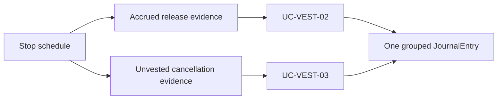

# Vesting Accounting Policy

**Status:** Implemented

**Scope:** Restricted-stock treatment of a SHER vesting grant, release, and cancellation

**Last reviewed:** Not yet reviewed

The Vesting feature owns the [transaction user stories](../vesting/README.md). The
[Accounting use-case catalogue](./journal-entry-catalogue.md#shareholder-and-vesting-use-cases) owns the processing and General Ledger
representation. This policy explains the accounting decision behind those rules.

## Policy

A vesting grant is recorded when its schedule is created, even though the Vesting contract mints no shares at grant. CNC therefore uses
`SHERS To Be Issued` as the interim promised-share account and credits `Investor Equity` only when SHER is actually minted.

Vesting remains entirely within equity:

| Use case     | Economic event           | Debit                        | Credit                       |
| ------------ | ------------------------ | ---------------------------- | ---------------------------- |
| `UC-VEST-01` | Full grant committed     | `Deferred SHER Compensation` | `SHERS To Be Issued`         |
| `UC-VEST-02` | Vested shares released   | `SHERS To Be Issued`         | `Investor Equity`            |
| `UC-VEST-03` | Unvested grant cancelled | `SHERS To Be Issued`         | `Deferred SHER Compensation` |

No Vesting entry reaches the income statement. At grant, the promised shares and contra-equity offset each other. At release, promised
shares become issued equity. At cancellation, only the unvested promise is reversed.

## Stop Processing

Stopping a schedule can release its accrued shares and cancel its unvested remainder in the same transaction:

The stop event does not carry a cancellation amount. Accounting reconstructs the remainder from that schedule's grant and releases. If the
grant is outside the available feed, no reversal is invented. If the schedule is fully released, there is no cancellation posting.

## Valuation and Reconciliation

- Each released quantity is frozen at its release-date SHER rate; each cancelled quantity is frozen at its stop-date rate.
- A still-promised quantity follows the current SHER multiplier, like an open SHER wage accrual.
- Partially realized grants retain separate quantity-and-rate slices. Accounting does not replace them with a rounded weighted average.
- The matching Investor `Minted` event is supporting evidence for `UC-VEST-02`, not a second issuance entry.
- Payroll and Vesting promises settle independently; neither can consume the other's accrual.
- `Investor Equity` is credited only for an actual mint, so it remains reconcilable with on-chain SHER supply.

## Implementation Evidence

**Implementation evidence reviewed against:** `99b6b283d84f1b5013ff5d19707a8df638968a89`

- [Vesting source mapper](../../../app/src/utils/accounting/mappers/vesting.ts)
- [SHER realization settlement](../../../app/src/utils/accounting/sherIssuance.ts)
- [Investor source mapper](../../../app/src/utils/accounting/mappers/investor.ts)
- [Vesting event feed](../../../app/src/composables/vesting/useVestingEventsViaLogs.ts)
- [Vesting accounting tests](../../../app/src/utils/accounting/__tests__/vesting.spec.ts)

## Related Documentation

- [Accounting user stories](./README.md)
- [Accounting use cases and journal entries](./journal-entry-catalogue.md)
- [Vesting user stories](../vesting/README.md)
- [Vesting contract behaviour](../../contracts/features/vesting/README.md)
