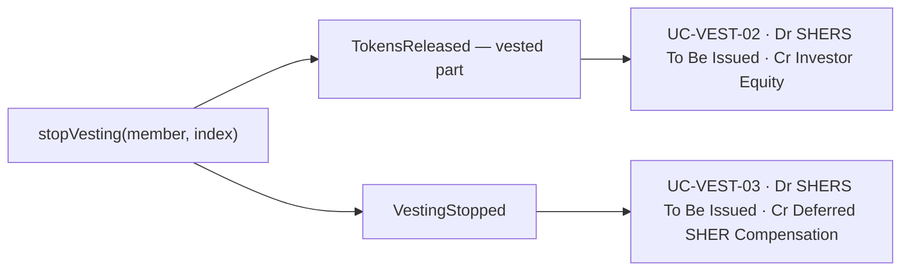

# Share Vesting Accounting — Restricted-Stock grant on the SHER structure

**Status:** ✅ Implemented — the booking rule the engine applies today\
**Scope:** how the books record a share vesting schedule, from its definition to its release or cancellation

This use case combines the **Restricted-Stock grant** from the
[WallStreetPrep _Restricted Stock Journal Entry Example_](https://www.wallstreetprep.com/knowledge/stock-based-compensation-sbc/) — an entry
is booked **the moment the vesting is defined** — with the **SHER accounting structure** already used for wages paid in shares (issue
#2458): the compensation is a non-cash **equity** transaction and never touches the income statement.

The product journey these entries follow is [Vesting — User Stories](../vesting/README.md); this document owns only their accounting
treatment.

## Why this is the right fit

The article records the award at grant because, in its example, the shares are legally **issued at grant** (`Common Stock & APIC` rises
immediately) and a contra-equity account offsets them until they are earned. The CNC's SHER wage cycle already works exactly this way — only
the account names differ:

| Article (restricted stock)     | CNC SHER structure                        |
| ------------------------------ | ----------------------------------------- |
| Contra-equity — Unearned Comp. | `Deferred SHER Compensation` (contra)     |
| Common Stock & APIC (issued)   | `Investor Equity` (minted shares)         |
| —                              | `SHERS To Be Issued` (promised, unminted) |

The one adaptation: the `Vesting` contract mints **nothing** at grant ([`Vesting.sol`](../../../contract/contracts/Vesting.sol) —
_"agreement only, no tokens move when it is created"_), so the grant credits the interim **`SHERS To Be Issued`** instead of
`Investor Equity`. `Investor Equity` — which must equal the on-chain SHER supply — is credited only at the **actual mint** (release/stop).
This is precisely the SHER wage lifecycle (accrue → settle), with the **grant playing the role of the accrual, booked upfront for the whole
award** (the restricted-stock part).

## User story

**As a** team owner\
**I want** a vesting schedule to be recorded in the books the moment it is defined, and settled as shares are released, entirely within
equity\
**So that** the committed share compensation is visible from day one, without ever touching the team's profit — consistent with how wages
paid in shares are booked.

## Actions and journal entries

**IS** = income statement, **BS** = balance sheet. Amounts follow the SHER rate of record, like the wage legs.

| Use case       | Action                     | Trigger          | Journal entry                                                                  | Effect                                                             |
| -------------- | -------------------------- | ---------------- | ------------------------------------------------------------------------------ | ------------------------------------------------------------------ |
| **UC-VEST-01** | **Define vesting** (grant) | `VestingCreated` | Dr Deferred SHER Compensation · Cr SHERS To Be Issued (**full award**)         | BS: equity ↑↓, net **0**; no IS — full award booked, unminted      |
| **UC-VEST-02** | **Release** (mint vested)  | `TokensReleased` | Dr SHERS To Be Issued · Cr Investor Equity (released amount)                   | BS: committed → issued; `Investor Equity` = on-chain supply; no IS |
| **UC-VEST-03** | **Stop** (forfeit)         | `VestingStopped` | Dr SHERS To Be Issued · Cr Deferred SHER Compensation (**unvested remainder**) | BS: the unvested grant is unwound; no IS                           |

This is the **same three events** as before, but `UC-VEST-01` now books the whole award (it was a memo), `UC-VEST-02` clears
`SHERS To Be Issued` (it used to clear `Deferred SHER Compensation`), and `UC-VEST-03` reverses the unvested grant (it was a memo).

### The stop books only what is forfeited

`stopVesting` mints whatever has already vested and drops the rest, emitting **both** a `TokensReleased` and a `VestingStopped` in the same
transaction. The minted part is therefore already booked by its own `UC-VEST-02` posting, and `UC-VEST-03` books **only** the cancellation
of the remainder:

The `VestingStopped` event carries no amount, so the unvested remainder is **reconstructed** from the schedule's own history: its granted
award minus everything released up to and including the stop. A schedule whose `VestingCreated` is not in the read window was never booked,
so its stop books nothing — it stays a memo line.

### How it nets out

- **Fully vested and released** (award `X`): `Deferred SHER Compensation` = `X` (contra, −`X`), `SHERS To Be Issued` = 0, `Investor Equity`
  = +`X`. **Net equity 0, nothing on the income statement** — identical to a SHER wage fully paid in shares.
- **Stopped** with vested `V`, unvested `U` (`X = V + U`): the vested part is minted (`Investor Equity` +`V`) and the unvested grant is
  unwound (`Deferred SHER Compensation` and `SHERS To Be Issued` both drop by `U`). End state carries only `V` — the forfeited remainder
  leaves no trace, the article's forfeiture behaviour.

### Valuation

SHER has no market price: it is valued from the compensation multiplier of the day (see the spec's rate of record). Vesting follows the same
realization rule as SHER wages, so each promise is settled at the value it actually realized:

- the **released** quantity is frozen at its release-date rate, so `UC-VEST-01` and `UC-VEST-02` cancel each other exactly in
  `SHERS To Be Issued`;
- the **cancelled** quantity is frozen at the stop-date rate, so `UC-VEST-03` cancels its share of the grant exactly;
- whatever is still promised and unminted floats at the **current** multiplier, like an open wage accrual.

A member's wage promises and their vesting grants are settled **separately**: a wage withdrawal never consumes a vesting grant, and a
release never consumes a wage accrual.

## Acceptance criteria

### Happy path

- [x] Defining a vesting schedule immediately books the grant entry (`UC-VEST-01`) for the **full promised award**, valued at the SHER rate
      of record, with **no income-statement impact** and **no net equity change**.
- [x] Releasing vested shares moves them from `SHERS To Be Issued` to `Investor Equity` (`UC-VEST-02`), and `Investor Equity` still equals
      the on-chain SHER supply.
- [x] Stopping a schedule mints any vested-but-unreleased part and reverses the grant for the unvested remainder (`UC-VEST-03`).
- [x] No entry ever hits the income statement — share vesting is entirely an equity transaction.
- [x] All three actions remain visible in the books after a refresh.

### Business rules

- [x] Every entry is balanced and the books balance at every level (`Assets = Liabilities + Equity`).
- [x] `Investor Equity` is credited **only** at an actual on-chain mint (release/stop), never at grant — so it always reconciles to the
      on-chain supply.
- [x] The full award sits in `Deferred SHER Compensation` (contra-equity) from grant, exactly offsetting the promised shares, so total
      equity is unchanged until — and after — they are minted.
- [x] The same share issuance is never counted twice: the `Minted` event emitted in the release transaction is recognized as backed and not
      re-booked as a direct mint.
- [x] A stop reverses only its own schedule's remainder, never another schedule held by the same member.

### Edge & error cases

- [x] Stopping before anything vests reverses the **entire** grant entry, leaving no `Deferred SHER Compensation` or `SHERS To Be Issued`
      balance for that schedule.
- [x] Stopping a schedule that has already been fully released reverses nothing and leaves the released shares in `Investor Equity`.
- [x] A member who never calls `release` keeps the full award in `Deferred SHER Compensation` / `SHERS To Be Issued` (promised, unminted) —
      never in `Investor Equity`.
- [x] Re-reading a schedule after a full release shows `SHERS To Be Issued` cleared to 0 and `Investor Equity` raised by the released
      amount.
- [x] A stop whose grant is outside the read window books no reversal, so an unbooked grant is never unwound.

## Relationship to the two source models

- **vs. the previous settlement-basis rule (catalogue §5.6 before this change):** the grant was memo-only and the release booked
  `Dr Deferred SHER Compensation · Cr Investor Equity`. Now the grant books the full award upfront and the release only clears
  `SHERS To Be Issued` — so the books show the committed compensation from day one.
- **vs. pure restricted stock (article):** the article additionally amortizes the award into an **income-statement expense** over the
  vesting period (`Dr SBC Expense · Cr Contra-equity`). We deliberately **omit** that step to respect the SHER structure (#2458): the cost
  stays in equity as a permanent `Deferred SHER Compensation` contra, never as a profit-and-loss charge. If the team ever wants vesting to
  reduce reported profit, that single expense-recognition step is the only addition needed.

## Dependencies

- The `Vesting` contract's `VestingCreated` / `TokensReleased` / `VestingStopped` events (read via getLogs —
  [`useVestingEventsViaLogs.ts`](../../../app/src/composables/vesting/useVestingEventsViaLogs.ts)).
- The existing SHER accounts in the chart of accounts (`Deferred SHER Compensation`, `SHERS To Be Issued`, `Investor Equity`) — no new
  account required.

## Implementation Evidence

- [Vesting source mapper](../../../app/src/utils/accounting/mappers/vesting.ts) — the three journal entries and the reconstructed remainder
- [SHER realization settlement](../../../app/src/utils/accounting/mappers/sherIssuance.ts) — the wage and vesting lanes and their valuation
- [Investor source mapper](../../../app/src/utils/accounting/mappers/investor.ts) — the backed-mint rule that prevents the double count
- [Share-vesting event feed (getLogs)](../../../app/src/composables/vesting/useVestingEventsViaLogs.ts)
- [Vesting accounting tests](../../../app/src/utils/accounting/__tests__/vesting.spec.ts)

## Related Documentation

- [Accounting — User Stories](./README.md)
- [Money Flow Catalogue §5.6](./money-flow-catalogue.md)
- [Accounting Specification and Scope §4](./cnc-accounting-spec.md)
- [Vesting — User Stories](../vesting/README.md)
- [Vesting V2 contract behaviour](../../contracts/features/vesting/README.md)
