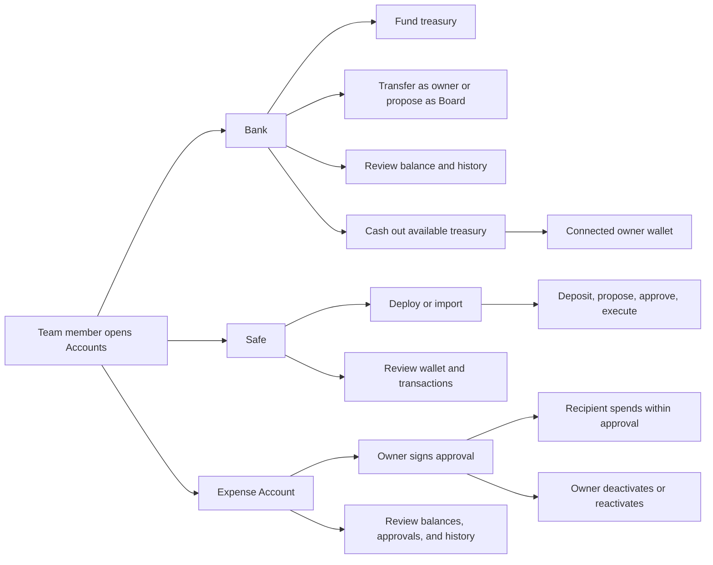

# Accounts — User Stories

**Scope:** The complete Bank, Safe, Expense Account, and treasury cash-out journey exposed by the portal

**Last reviewed:** Not yet reviewed

These acceptance criteria follow the
[feature documentation review contract](../../platform/feature-specification-guide.md#human-review-contract).

## Product Model

- **Bank** is the team's primary on-chain treasury. Members can inspect it, while the contract owner or the Board of Directors controls
  outgoing transfers.
- **Safe** is an optional shared multi-signature wallet. Team ownership and Safe signer permissions are separate concepts.
- **Expense Account** lets the current contract owner grant signed spending approvals. A recipient spends against the approval without
  receiving custody of the whole account.
- Bank and Expense Account actions use the current contracts selected for the team. Safe actions use the Safe registered to the team on the
  active network.
- A Bank owner can cash out available treasury funds by first consolidating Cash Remuneration and Expense Account balances into the Bank,
  then moving the Bank's held assets to the connected wallet. A historic generation can instead forward its available funds to the team's
  current Bank.
- Token administration, dividends, payroll, and community-credit repayments are owned by their respective features even when funds move
  through an account.

## Lifecycle

## Status Overview

| User Story  | Title                                      | Actor                   | Status         |
| ----------- | ------------------------------------------ | ----------------------- | -------------- |
| US-BANK-001 | Fund the Bank                              | Team member             | 🧪 Validation  |
| US-BANK-002 | Transfer Bank funds                        | Owner / Board member    | 🧪 Validation  |
| US-BANK-003 | Review the Bank position and history       | Team member             | 🚧 In Progress |
| US-BANK-004 | Cash out available treasury funds          | Bank owner              | 🧪 Validation  |
| US-SAFE-001 | Set up a Safe                              | Team owner              | 🧪 Validation  |
| US-SAFE-002 | Inspect Safe details                       | Team member             | 🧪 Validation  |
| US-SAFE-003 | Manage Safe funds                          | Safe owner              | 🧪 Validation  |
| US-SAFE-004 | Manage Safe signers and threshold          | Safe owner              | 🧪 Validation  |
| US-SAFE-005 | Review Safe transactions                   | Team member             | 🧪 Validation  |
| US-SAFE-006 | Approve and execute a Safe transaction     | Safe owner              | 🧪 Validation  |
| US-EXP-001  | Grant a signed spending approval           | Expense Account owner   | 🧪 Validation  |
| US-EXP-002  | Spend from the Expense Account             | Approved recipient      | 🚧 In Progress |
| US-EXP-003  | Deactivate or reactivate an approval       | Expense Account owner   | 🚧 In Progress |
| US-EXP-004  | Review the Expense Account and its history | Team member / recipient | 🧪 Validation  |

## US-BANK-001: Fund the Bank

**As a** team member\
**I want to** deposit assets into the Bank\
**So that** the team treasury has funds for its operations

### Acceptance Criteria

#### Happy Path

- [x] A member can deposit the native token into the Bank.
- [x] A member can deposit a supported ERC-20 token into the Bank.
- [x] A successful deposit increases the corresponding Bank balance.

#### Business Rules

- [x] A deposit amount must be positive and cannot exceed the connected wallet balance.
- [x] An ERC-20 deposit can use no more than six decimal places.
- [x] The Bank accepts only ERC-20 tokens supported by its current configuration. _(contract)_
- [x] An ERC-20 deposit authorizes the Bank only when the existing allowance is insufficient.

#### Edge & Error Cases

- [x] An archived team cannot initiate a deposit.
- [x] Cancelling or rejecting a deposit leaves the Bank balance unchanged.
- [x] A failed deposit leaves the Bank balance unchanged.

**Dependencies:** Current Bank contract and a connected wallet

## US-BANK-002: Transfer Bank Funds

**As a** Bank owner or Board member\
**I want to** transfer assets from the Bank\
**So that** the team can use its treasury for authorized payments

### Acceptance Criteria

#### Happy Path

- [x] The Bank owner can transfer a held native or supported ERC-20 balance to a valid recipient.
- [x] A Board member can submit the same transfer as a Board action for approval.
- [x] A successful transfer decreases the Bank balance and delivers the requested net amount to the recipient.

#### Business Rules

- [x] Only the Bank owner can execute a direct transfer. _(contract)_
- [x] A transfer amount must be positive and cannot exceed the available balance after protocol fees.
- [x] A transfer recipient cannot be the zero address. _(contract)_
- [x] SHER transfers are not available through the Bank transfer journey.
- [x] Fee-bearing transfers include the protocol fee in the amount deducted from the Bank.

#### Edge & Error Cases

- [x] An archived team cannot initiate a transfer or Board action.
- [x] A paused Bank rejects outgoing transfers. _(contract)_
- [x] Cancelling, rejecting, or failing a transfer leaves the Bank balance unchanged.

**Dependencies:** US-BANK-001 and the Board action capability for non-owner proposals

## US-BANK-003: Review the Bank Position and History

**As a** team member\
**I want to** inspect the Bank's holdings and activity\
**So that** I can understand the team's treasury position

### Acceptance Criteria

#### Happy Path

- [x] A team member can inspect the Bank address, native balance, token holdings, and local-currency value.
- [x] Bank history exposes each transaction's date, type, counterparty, value, and transaction hash when available.
- [x] A team member can filter Bank history by date and transaction type.

#### Business Rules

- [x] Every team member can inspect Bank balances and history regardless of transfer permission.
- [x] Grouped events from one transaction remain attributable to the same transaction hash.

#### Edge & Error Cases

- [x] A history filter with no matching events returns an empty result.
- [ ] A failed history read is distinguishable from a successfully loaded empty history.

**Dependencies:** Current Bank contract and an available chain event provider

## US-BANK-004: Cash Out Available Treasury Funds

**As a** Bank owner\
**I want to** cash out the team's available treasury funds\
**So that** I can move them to my connected wallet or the team's current Bank

### How It Works

1. The owner reviews the funded accounts and the destination before confirming the run.
2. When available, Cash Remuneration and Expense Account funds move into their generation's Bank first.
3. The Bank then forwards its native and supported token balances to the destination. A historic generation forwards its available funds to
   the team's current Bank.

### Acceptance Criteria

#### Happy Path

- [x] The Bank owner can consolidate available Cash Remuneration and Expense Account funds into the current Bank, then transfer each held
      native or supported ERC-20 asset to the connected wallet.
- [x] The owner of a historic contract generation can forward its available Bank funds to the team's current Bank, including eligible
      source-account sweeps.

#### Business Rules

- [x] Only the relevant Bank owner can start a cash-out run, and an archived current team cannot start one.
- [x] Each Bank transfer reads balances after the source-account steps, so zero-balance assets do not create transactions.
- [x] Historic generations without source-account withdrawal support can transfer only their Bank balance and identify the funds that remain
      in their source accounts.

#### Edge & Error Cases

- [x] A failed step stops the sequence, leaves later steps pending, and lets the owner retry from the failed step.
- [x] Rejecting a wallet request leaves the remaining steps unrun and identifies the rejected step to the owner.
- [x] A cash-out run does not start when no eligible funded account is available.

**Dependencies:** US-BANK-001, US-BANK-002, and the current Cash Remuneration and Expense Account contracts

## US-SAFE-001: Set Up a Safe

**As a** team owner\
**I want to** deploy a new Safe or import an existing Safe\
**So that** my team has a shared multi-signature wallet in CNC

### Acceptance Criteria

#### Happy Path

- [x] A team without a registered Safe can deploy a new Safe.
- [x] A team without a registered Safe can import an existing Safe from the active network.
- [x] A newly deployed or imported Safe is registered to the team.

#### Business Rules

- [x] Only the team owner can deploy, import, or register a Safe for the team.
- [x] A newly deployed Safe starts with the team owner as its only signer and a threshold of one.
- [x] Importing a Safe preserves its owners, threshold, assets, and on-chain configuration.
- [x] An imported address must resolve to a Safe on the active network before registration.

#### Edge & Error Cases

- [x] The team owner can continue team creation without setting up a Safe.
- [x] If registration fails after deployment, the deployed Safe remains available for a registration retry.
- [x] An archived team cannot deploy, import, or retry Safe registration.

**Dependencies:** Current team and active network

## US-SAFE-002: Inspect Safe Details

**As a** team member\
**I want to** inspect the Safe's current details\
**So that** I understand the shared wallet and who controls it

### Acceptance Criteria

#### Happy Path

- [x] A team member can inspect the Safe address, balances, token holdings, owners, and signature threshold.
- [x] A team member can inspect incoming native-token, ERC-20, and ERC-721 transfers.
- [x] Safe information refreshes after an account action succeeds.

#### Business Rules

- [x] Inspecting Safe details does not require Safe signer permission.
- [x] The registered Safe address identifies the wallet whose balances, owners, and threshold are reported.

#### Edge & Error Cases

- [x] A Safe with no incoming transfers returns an empty deposit history.
- [x] A failed Safe information read is reported without hiding unaffected Safe information.
- [x] A failed Safe information read can be retried without registering another Safe.

**Dependencies:** US-SAFE-001

## US-SAFE-003: Manage Safe Funds

**As a** Safe owner\
**I want to** deposit and transfer assets through the Safe\
**So that** the team can fund and use its shared treasury

### Acceptance Criteria

#### Happy Path

- [x] A user can deposit the native token or a supported token into the Safe.
- [x] A Safe owner can propose a transfer of an asset held by the Safe.
- [x] A completed transfer refreshes the Safe balances and transaction state.

#### Business Rules

- [x] Only a current Safe owner can propose an outgoing Safe transfer.
- [x] Team membership alone does not grant Safe signer permission.
- [x] An outgoing transfer follows the Safe's current approval threshold.

#### Edge & Error Cases

- [x] A proposal below the approval threshold remains pending without moving funds.
- [x] A rejected or failed proposal leaves Safe balances unchanged.
- [x] An archived team cannot initiate a Safe deposit or transfer.

**Dependencies:** US-SAFE-001 and US-SAFE-006

## US-SAFE-004: Manage Safe Signers and Threshold

**As a** Safe owner\
**I want to** change the Safe's signers and approval threshold\
**So that** its control rules match the team's current governance

### Acceptance Criteria

#### Happy Path

- [x] A Safe owner can propose adding a signer.
- [x] A Safe owner can propose removing a signer.
- [x] A Safe owner can propose changing the approval threshold.
- [x] A completed change refreshes the reported owners and threshold.

#### Business Rules

- [x] Only a current Safe owner can propose signer or threshold changes.
- [x] Signer and threshold changes follow the Safe's current approval threshold.
- [x] A signer change cannot leave the Safe with an invalid threshold.

#### Edge & Error Cases

- [x] A user without Safe signer permission cannot propose a control change.
- [x] A rejected or failed change preserves the current signers and threshold.

**Dependencies:** US-SAFE-006

## US-SAFE-005: Review Safe Transactions

**As a** team member\
**I want to** review Safe transactions\
**So that** I understand pending and completed team actions

### Acceptance Criteria

#### Happy Path

- [x] Safe transactions expose their action, recipient, value, approval progress, status, and last update.
- [x] A team member can inspect transaction details and the on-chain hash when available.
- [x] A team member can filter transactions by approval, execution, conflict, and completion state.

#### Business Rules

- [x] Reviewing transaction details does not require Safe signer permission.
- [x] Pending approval, ready to execute, conflicting, executed, and invalid transactions remain distinct states.
- [x] The available next action is derived from the transaction state and the connected signer's approvals.

#### Edge & Error Cases

- [x] A Safe with no matching transactions returns an empty result.
- [x] A failed transaction read is distinguishable from a successfully loaded empty result.
- [x] A failed transaction read can be retried without hiding unaffected Safe information.

**Dependencies:** US-SAFE-001

## US-SAFE-006: Approve and Execute a Safe Transaction

**As a** Safe owner\
**I want to** approve and execute a Safe transaction\
**So that** the team can carry out an action after enough signers agree

### Acceptance Criteria

#### Happy Path

- [x] A Safe owner can approve a pending transaction they have not already approved.
- [x] A Safe owner can execute a transaction after it reaches the required threshold.
- [x] Execution refreshes the transaction state and affected Safe information.

#### Business Rules

- [x] Only current Safe owners can approve or execute a Safe transaction.
- [x] One signer cannot approve the same transaction twice.
- [x] Approval and execution remain separate actions after the threshold is reached.
- [x] Executed and stale-nonce transactions cannot be approved or executed again.

#### Edge & Error Cases

- [x] Before approving a threshold-reaching transaction or executing a transaction while another valid transaction is pending, the Safe
      owner sees a warning that names the pending action and can cancel or continue.
- [x] A rejected or failed approval does not increase the approval count.
- [x] A rejected or failed execution leaves the transaction unexecuted.

**Dependencies:** US-SAFE-001

## US-EXP-001: Grant a Signed Spending Approval

**As an** Expense Account owner\
**I want to** grant a member a signed spending approval\
**So that** they can pay authorized expenses without controlling the whole account

### Acceptance Criteria

#### Happy Path

- [x] The current Expense Account owner can grant a spending approval to a recipient.
- [x] A valid approval records its recipient, token, amount, schedule, expiry, and signature domain.
- [x] A successfully granted approval becomes available to its recipient and the team.

#### Business Rules

- [x] Only the current Expense Account owner can create a valid approval.
- [x] An approval is bound to the current Expense Account contract and active network.
- [x] The persisted approval signer must recover to the connected owner. _(API)_
- [x] The signed Expense Account must match the team's current Expense Account. _(API)_

#### Edge & Error Cases

- [x] An archived team cannot grant a spending approval.
- [x] An invalid or mismatched signature is rejected without creating an approval.
- [x] Cancelling or rejecting the signature leaves the recipient's approvals unchanged.

**Dependencies:** Current Expense Account contract and connected contract owner

## US-EXP-002: Spend From the Expense Account

**As an** approved recipient\
**I want to** spend within my approval\
**So that** I can pay an authorized expense from the team's funds

### Acceptance Criteria

#### Happy Path

- [x] An approved recipient can transfer the authorized token to a valid destination.
- [x] A successful spend decreases both the available approval amount and the Expense Account balance.
- [x] A recurring approval remains available while it has remaining allowance in its active period.

#### Business Rules

- [x] A spend cannot exceed the lower of the approval remainder and the Expense Account balance.
- [x] A spend must use the approval's recipient, token, contract, network, and recovered owner signature.
- [x] A one-time approval cannot be spent more than once. _(contract)_
- [ ] Every ERC-20 spend, including a one-time approval, requires a supported token. _(contract)_

#### Edge & Error Cases

- [x] An archived team cannot initiate a spend.
- [ ] A paused Expense Account rejects spending. _(contract)_
- [x] An expired or exhausted approval rejects spending.
- [x] A mismatched or unverifiable approval rejects spending without changing balances.
- [x] A failed balance read prevents spending until the available amount can be verified.

**Dependencies:** US-EXP-001 and a funded Expense Account

## US-EXP-003: Deactivate or Reactivate an Approval

**As an** Expense Account owner\
**I want to** deactivate or reactivate a spending approval\
**So that** I can control whether the recipient may continue spending

### Acceptance Criteria

#### Happy Path

- [x] The current Expense Account owner can deactivate an enabled approval.
- [x] The current Expense Account owner can reactivate a disabled approval.
- [x] A successful state change is reflected in the team and recipient approval records.

#### Business Rules

- [x] Only the current Expense Account owner can change an approval's active state.
- [ ] A deactivated approval cannot authorize a spend. _(contract)_
- [x] Reactivation preserves the approval's original signed limits and expiry.

#### Edge & Error Cases

- [x] An archived team cannot deactivate or reactivate an approval.
- [x] A failed state change preserves the approval's prior reported state.
- [x] Expired and exhausted approvals remain unavailable after state synchronization.

**Dependencies:** US-EXP-001

## US-EXP-004: Review the Expense Account and Its History

**As a** team member or approved recipient\
**I want to** inspect Expense Account funds, approvals, and activity\
**So that** I understand what can be spent and what has already happened

### Acceptance Criteria

#### Happy Path

- [x] A team member can inspect the Expense Account address, balances, monthly spend, and approved total.
- [x] A recipient can inspect approvals granted to their connected wallet.
- [x] A team member can inspect team approvals and their current enabled, disabled, expired, or exhausted state.
- [x] Expense history exposes transaction dates, types, counterparties, values, and transaction hashes when available.
- [x] A team member can filter Expense history by date and transaction type.

#### Business Rules

- [x] Approval availability reflects on-chain usage, current time, and active-state synchronization.
- [x] One recipient sees only approvals issued to their connected wallet in their personal approval scope.
- [x] Every team member can inspect the shared Expense Account history.

#### Edge & Error Cases

- [x] A scope with no approvals or transactions returns an empty result.
- [x] A failed approval read is distinguishable from a successfully loaded empty approval scope.
- [x] A failed transaction read is distinguishable from a successfully loaded empty history.

**Dependencies:** Current Expense Account contract and available API and chain providers

## Known Gaps

- Bank history does not distinguish a failed event read from a successfully loaded empty history (`US-BANK-003`).
- A one-time Expense approval can spend an unsupported ERC-20 token held by the contract (`US-EXP-002`).
- Pausing the Expense Account does not prevent spending (`US-EXP-002`).
- Deactivating an Expense approval changes its recorded state but does not prevent that signature from authorizing a spend (`US-EXP-003`).

## Implementation Evidence

- [Accounts routes](../../../app/src/router/index.ts) and [Accounts navigation](../../../app/src/composables/useSidebarNavItems.ts). The
  Community Credit round-detail view parameter does not alter Accounts entry points.
- [Bank page](../../../app/src/views/team/%5Bid%5D/Accounts/BankView.vue), [Bank writes](../../../app/src/composables/bank/writes.ts),
  [Bank transaction feed](../../../app/src/composables/bank/useBankEventsViaLogs.ts),
  [Bank event queries](../../../app/src/queries/ponder/bank.queries.ts), and
  [Bank contract](../../../contract/contracts/Bank.sol)
- [Bank component tests](../../../app/src/components/sections/BankView/__tests__) and
  [Bank contract tests](../../../contract/test/Bank.spec.ts)
- [Current treasury cash-out action](../../../app/src/components/sections/DashboardView/CashOutAllAction.vue),
  [historic-generation withdrawal action](../../../app/src/components/sections/ContractManagementView/LegacyGenerationWithdrawAction.vue),
  and [cash-out orchestration](../../../app/src/composables/cashOut/useCashOutAll.ts)
- [Cash-out composable tests](../../../app/src/composables/cashOut/__tests__/useCashOutAll.spec.ts),
  [current-treasury action tests](../../../app/src/components/sections/DashboardView/__tests__/CashOutAllAction.spec.ts), and
  [historic-generation action tests](../../../app/src/components/sections/ContractManagementView/__tests__/LegacyGenerationWithdrawAction.spec.ts)
- [Safe page](../../../app/src/views/team/%5Bid%5D/Accounts/SafeView.vue),
  [Safe deposit form](../../../app/src/components/forms/DepositSafeForm.vue), [Safe composables](../../../app/src/composables/safe/), and
  [Safe transaction state](../../../app/src/utils/safeTransactionState.ts)
- [Safe transaction queue](../../../app/src/components/sections/SafeView/SafeTransactions.vue),
  [Safe transaction table](../../../app/src/components/sections/SafeView/SafeTransactionsTable.vue), and
  [Safe mobile transaction list](../../../app/src/components/sections/SafeView/SafeTransactionMobileList.vue),
  [Safe transaction mutations](../../../app/src/queries/safe.mutations.ts),
  [Safe transaction state and conflict rules](../../../app/src/utils/safeTransactionState.ts), and
  [Safe conflict warning](../../../app/src/components/sections/SafeView/SafeTransactionsWarning.vue)
- [Safe component tests](../../../app/src/components/sections/SafeView/__tests__) and
  [Safe composable tests](../../../app/src/composables/safe/__tests__)
- [Safe transaction queue tests](../../../app/src/components/sections/SafeView/__tests__/SafeTransactions.spec.ts),
  [Safe transaction state tests](../../../app/src/utils/__tests__/safeTransactionState.spec.ts), and
  [Safe conflict warning tests](../../../app/src/components/sections/SafeView/__tests__/SafeTransactionsWarning.spec.ts)
- [Expense Account page](../../../app/src/views/team/%5Bid%5D/Accounts/ExpenseAccountView.vue),
  [Expense API controller](../../../backend/src/controllers/expenseController.ts), and
  [Expense Account contract](../../../contract/contracts/expense-account/ExpenseAccountEIP712.sol)
- [Expense component tests](../../../app/src/components/sections/ExpenseAccountView/__tests__),
  [Expense API tests](../../../backend/src/controllers/__tests__/expenseController.test.ts), and
  [Expense contract tests](../../../contract/test/ExpenseAccountEIP712.spec.ts)

## Related Documentation

- [Client Navigation implementation](../../implementation/client-navigation/README.md)
- [Bank contract](../../contracts/features/bank/README.md)
- [Expense Account contract](../../contracts/features/expense-account/README.md)
- [Safe Deposit Router contract](../../contracts/features/safe-deposit-router/README.md)
- [Accounting](../accounting/README.md)
- [Payroll & Cash Remuneration](../payroll/README.md)
- [Community Credit](../community-credit/README.md)

_[← Back to feature inventory](../README.md)_
