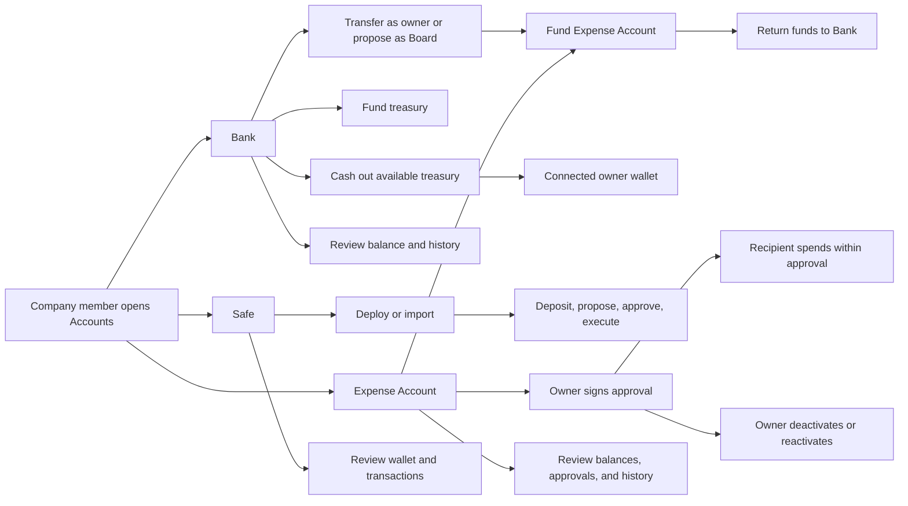

# Accounts — User Stories

**Scope:** The complete Bank, Safe, Expense Account, and treasury cash-out journey exposed by the portal

**Last reviewed:** Not yet reviewed

These acceptance criteria follow the
[feature documentation review contract](../../platform/feature-specification-guide.md#human-review-contract).

## Product Model

- **Bank** is the company's primary on-chain treasury. Members can inspect it, while the contract owner or the Board of Directors controls
  outgoing transfers.
- **Safe** is an optional shared multi-signature wallet. Company ownership and Safe signer permissions are separate concepts.
- **Expense Account** lets the current contract owner grant signed spending approvals. A recipient spends against the approval without
  receiving custody of the whole account.
- A wallet can fund an account directly, while a Bank-origin payment is initiated under the Bank transfer story. The destination account
  owns the credited balance and its availability. The [Accounting UC scenarios](../accounting/journal-entry-catalogue.md#use-case-overview)
  link all participating stories and their roles.
- Bank and Expense Account actions use the current contracts selected for the company. Safe actions use the Safe registered to the company
  on the active network.
- A Bank transfer with a positive `BANK` fee sends that fee to the FeeCollector deployed for its contract generation. Native transfers
  assess the configured rate, while ERC-20 transfers are fee-bearing only when the token is supported by that FeeCollector. Activity feeds
  retain fees from every supported Bank generation for Accounting.
- A Bank owner can cash out available treasury funds by first consolidating Cash Remuneration and Expense Account balances into the Bank,
  then moving the Bank's held assets to the connected wallet. A historic generation can instead forward its available funds to the company's
  current Bank.
- Token administration, dividends, payroll, and community-credit repayments are owned by their respective features even when funds move
  through an account.

The [direct asset movement product contract](../accounting/direct-movement-policy.md) defines company custody, unsolicited receipts,
historical coverage, classification, and reconciliation across domains. Its target behaviour remains pending implementation; new ACs are
unchecked.

### Proposed token expansion

Treat token onboarding as a shared capability with a per-network eligibility matrix. For each proposed asset, record its address, decimals,
symbol, pricing source, and whether Bank, Expense, Payroll, and Accounting can each handle it. A contract's `getSupportedTokens()` result
controls its current on-chain eligibility; the product catalogue supplies trusted display and amount metadata. New approval or transfer
choices require both. A token becomes available in a journey only after its destination contract, write path, balance and activity views,
and Accounting classification have representative proof. Roll out each network and domain explicitly rather than assuming that adding a
token to one contract enables it everywhere. This is a proposal for product review; no additional token is enabled by this document.

## Lifecycle

```mermaid
flowchart LR
    Member[Company member opens Accounts] --> Bank[Bank]
    Member --> Safe[Safe]
    Member --> Expense[Expense Account]

    Bank --> FundBank[Fund treasury]
    Bank --> TransferBank[Transfer as owner or propose as Board]
    TransferBank --> ExpenseFunding[Fund Expense Account]
    Bank --> ReviewBank[Review balance and history]
    Bank --> CashOut[Cash out available treasury]
    CashOut --> OwnerWallet[Connected owner wallet]

    Safe --> SetupSafe[Deploy or import]
    SetupSafe --> OperateSafe[Deposit, propose, approve, execute]
    Safe --> ReviewSafe[Review wallet and transactions]

    Expense --> Grant[Owner signs approval]
    Expense --> ExpenseFunding
    ExpenseFunding --> ReturnExpense[Return funds to Bank]
    Grant --> Spend[Recipient spends within approval]
    Grant --> Manage[Owner deactivates or reactivates]
    Expense --> ReviewExpense[Review balances, approvals, and history]
```

## Status Overview

| User Story  | Title                                      | Actor                      | Status         |
| ----------- | ------------------------------------------ | -------------------------- | -------------- |
| US-BANK-001 | Fund the Bank                              | Company member             | 🧪 Validation  |
| US-BANK-002 | Transfer Bank funds                        | Owner / Board member       | 🧪 Validation  |
| US-BANK-003 | Review the Bank position and history       | Company member             | 🚧 In Progress |
| US-BANK-004 | Cash out available treasury funds          | Bank owner                 | 🧪 Validation  |
| US-EXP-001  | Grant a signed spending approval           | Expense Account owner      | 🧪 Validation  |
| US-EXP-002  | Spend from the Expense Account             | Approved recipient         | 🚧 In Progress |
| US-EXP-003  | Deactivate or reactivate an approval       | Expense Account owner      | 🧪 Validation  |
| US-EXP-004  | Review the Expense Account and its history | Company member / recipient | 🚧 In Progress |
| US-EXP-005  | Fund the Expense Account                   | Account funder             | 🚧 In Progress |
| US-EXP-006  | Return Expense Account funds to Bank       | Authorized treasury actor  | 🚧 In Progress |
| US-SAFE-001 | Set up a Safe                              | Company owner              | 🧪 Validation  |
| US-SAFE-002 | Inspect Safe details                       | Company member             | 🚧 In Progress |
| US-SAFE-003 | Manage Safe funds                          | Safe owner                 | 🧪 Validation  |
| US-SAFE-004 | Manage Safe signers and threshold          | Safe owner                 | 🧪 Validation  |
| US-SAFE-005 | Review Safe transactions                   | Company member             | 🧪 Validation  |
| US-SAFE-006 | Approve and execute a Safe transaction     | Safe owner                 | 🧪 Validation  |

## Test Coverage Overview

Coverage targets compare each criterion's required evidence with direct `AC-US-*` references in tracked tests. They do not represent the
latest pass/fail result, which belongs to CI or the generated local report. Gaps identify criteria whose required evidence is missing or
insufficient; the detailed evidence distribution remains available in the generated report instead of being repeated here.

The main-journey column distinguishes a complete integrated path, a partial integrated path, a planned integrated path, and a deliberately
mocked browser path for the external Safe Transaction Service boundary.

| User Story  | Main Journey  | Coverage Target | Gaps                                                                                                                                       |
| ----------- | ------------- | --------------- | ------------------------------------------------------------------------------------------------------------------------------------------ |
| US-BANK-001 | ✅ Integrated | ⚠️ 9/10         | `AC-US-BANK-001-03`                                                                                                                        |
| US-BANK-002 | ✅ Integrated | ⚠️ 11/13        | `AC-US-BANK-002-01`, `AC-US-BANK-002-02`                                                                                                   |
| US-BANK-003 | ✅ Integrated | ⚠️ 7/9 met      | `AC-US-BANK-003-08`, `AC-US-BANK-003-09`                                                                                                   |
| US-BANK-004 | 🚧 Partial    | ⚠️ 6/8          | `AC-US-BANK-004-01`, `AC-US-BANK-004-02`                                                                                                   |
| US-EXP-001  | ✅ Integrated | ⚠️ 13/15        | `AC-US-EXP-001-01`, `AC-US-EXP-001-02`                                                                                                     |
| US-EXP-002  | 🚧 Partial    | ⚠️ 12/16        | `AC-US-EXP-002-01`, `AC-US-EXP-002-02`, `AC-US-EXP-002-07`, `AC-US-EXP-002-09`                                                             |
| US-EXP-003  | ✅ Integrated | ✅ 9/9          | —                                                                                                                                          |
| US-EXP-004  | ✅ Integrated | ⚠️ 12/13 met    | `AC-US-EXP-004-13`                                                                                                                         |
| US-EXP-005  | 🚧 Partial    | ⚠️ 3/7          | `AC-US-EXP-005-03`, `AC-US-EXP-005-04`, `AC-US-EXP-005-06`, `AC-US-EXP-005-07`                                                             |
| US-EXP-006  | 🚧 Partial    | ⚠️ 1/8          | `AC-US-EXP-006-01`, `AC-US-EXP-006-02`, `AC-US-EXP-006-03`, `AC-US-EXP-006-04`, `AC-US-EXP-006-05`, `AC-US-EXP-006-07`, `AC-US-EXP-006-08` |
| US-SAFE-001 | 🚧 Partial    | ⚠️ 8/11         | `AC-US-SAFE-001-02`, `AC-US-SAFE-001-03`, `AC-US-SAFE-001-06`                                                                              |
| US-SAFE-002 | 🧪 Mocked     | ⚠️ 6/9 met      | `AC-US-SAFE-002-01`, `AC-US-SAFE-002-02`, `AC-US-SAFE-002-09`                                                                              |
| US-SAFE-003 | 📋 Planned    | ⚠️ 6/11         | 5 — `AC-US-SAFE-003-01`, `AC-US-SAFE-003-02`, `AC-US-SAFE-003-03`, `AC-US-SAFE-003-06`, `AC-US-SAFE-003-07`                                |
| US-SAFE-004 | 📋 Planned    | ⚠️ 4/9          | 5 — `AC-US-SAFE-004-01`, `AC-US-SAFE-004-02`, `AC-US-SAFE-004-03`, `AC-US-SAFE-004-04`, `AC-US-SAFE-004-07`                                |
| US-SAFE-005 | 🧪 Mocked     | ✅ 9/9          | —                                                                                                                                          |
| US-SAFE-006 | 🧪 Mocked     | ✅ 10/10        | —                                                                                                                                          |

Proof obligations use the [shared proof-strategy registry](../../testing/proof-strategies.md). Multiple IDs for one AC are cumulative.

## US-BANK-001: Fund the Bank

**As a** company member\
**I want to** deposit assets into the Bank\
**So that** the company treasury has funds for its operations

### Acceptance Criteria

#### Happy Path

- [x] `AC-US-BANK-001-01` A member can deposit the native token into the Bank.
- [x] `AC-US-BANK-001-02` A member can deposit a supported ERC-20 token into the Bank.
- [x] `AC-US-BANK-001-03` A successful deposit increases the corresponding Bank balance.

#### Business Rules

- [x] `AC-US-BANK-001-04` A deposit amount must be positive and cannot exceed the connected wallet balance.
- [x] `AC-US-BANK-001-05` An ERC-20 deposit can use no more than six decimal places.
- [x] `AC-US-BANK-001-06` The Bank accepts only ERC-20 tokens supported by its current configuration. _(contract)_
- [x] `AC-US-BANK-001-07` An ERC-20 deposit authorizes the Bank only when the existing allowance is insufficient.

#### Edge & Error Cases

- [x] `AC-US-BANK-001-08` An archived company cannot initiate a deposit.
- [x] `AC-US-BANK-001-09` Cancelling or rejecting a deposit leaves the Bank balance unchanged.
- [x] `AC-US-BANK-001-10` A failed deposit leaves the Bank balance unchanged.

### Test Coverage

| Acceptance Criterion | Proof Strategy        | Current Evidence                     | Status          |
| -------------------- | --------------------- | ------------------------------------ | --------------- |
| `AC-US-BANK-001-01`  | `PS-CHAIN-INTEGRATED` | Integrated E2E + Frontend + Contract | ✅ Met          |
| `AC-US-BANK-001-01`  | `PS-CONTRACT`         | Integrated E2E + Frontend + Contract | ✅ Met          |
| `AC-US-BANK-001-02`  | `PS-CHAIN-INTEGRATED` | Integrated E2E + Contract            | ✅ Met          |
| `AC-US-BANK-001-02`  | `PS-CONTRACT`         | Integrated E2E + Contract            | ✅ Met          |
| `AC-US-BANK-001-03`  | `PS-CHAIN-INTEGRATED` | Integrated E2E                       | ✅ Met          |
| `AC-US-BANK-001-03`  | `PS-CONTRACT`         | Integrated E2E                       | ⚠️ Insufficient |
| `AC-US-BANK-001-04`  | `PS-BROWSER`          | Mocked browser + Contract            | ✅ Met          |
| `AC-US-BANK-001-04`  | `PS-CONTRACT`         | Mocked browser + Contract            | ✅ Met          |
| `AC-US-BANK-001-05`  | `PS-BROWSER`          | Mocked browser                       | ✅ Met          |
| `AC-US-BANK-001-06`  | `PS-CONTRACT`         | Contract                             | ✅ Met          |
| `AC-US-BANK-001-07`  | `PS-FRONTEND`         | Frontend                             | ✅ Met          |
| `AC-US-BANK-001-08`  | `PS-BROWSER`          | Mocked browser                       | ✅ Met          |
| `AC-US-BANK-001-09`  | `PS-BROWSER`          | Mocked browser                       | ✅ Met          |
| `AC-US-BANK-001-10`  | `PS-BROWSER`          | Mocked browser                       | ✅ Met          |

**Accounting:** An external receipt is booked by [`UC-BANK-02`](../accounting/journal-entry-catalogue.md#uc-bank-02--external-cash-receipt).
A receipt from another known company pocket is an internal transfer instead.

**Dependencies:** Current Bank contract and a connected wallet

**Shared accounting scenarios:**

Each row identifies the responsibilities shared with other stories for one accounting operation. Existing acceptance and evidence statuses
remain as recorded above.

| Scenario and accounting use case                                                                                                                                          | This story's responsibility                   | Other participating stories                                                                                 |
| ------------------------------------------------------------------------------------------------------------------------------------------------------------------------- | --------------------------------------------- | ----------------------------------------------------------------------------------------------------------- |
| A direct Bank transfer funds another known Bank generation. [UC-TREASURY-001](../accounting/journal-entry-catalogue.md#uc-treasury-001--internal-company-pocket-transfer) | Receives the funding in the destination Bank. | [US-BANK-002](#us-bank-002-transfer-bank-funds) — initiates the transfer                                    |
| Safe funds Bank. [UC-TREASURY-001](../accounting/journal-entry-catalogue.md#uc-treasury-001--internal-company-pocket-transfer)                                            | Receives the Bank funding.                    | [US-SAFE-003](#us-safe-003-manage-safe-funds) — initiates the Safe transfer                                 |
| An approved Expense payout reaches Bank. [UC-TREASURY-001](../accounting/journal-entry-catalogue.md#uc-treasury-001--internal-company-pocket-transfer)                    | Receives the Bank funding.                    | [US-EXP-002](#us-exp-002-spend-from-the-expense-account) — executes the approved payout to a company pocket |

### Direct Movement Scenarios

Target behaviour follows the [direct movement policy](../accounting/direct-movement-policy.md). Each row represents the same evidenced
movement across the participating stories.

| Scenario                                                                                                                                                                                         | This story owns        | Related stories and roles                                                                                                                                                                                                                                                                                                                                                                                                                                                                   |
| ------------------------------------------------------------------------------------------------------------------------------------------------------------------------------------------------ | ---------------------- | ------------------------------------------------------------------------------------------------------------------------------------------------------------------------------------------------------------------------------------------------------------------------------------------------------------------------------------------------------------------------------------------------------------------------------------------------------------------------------------------- |
| External wallet funds Bank without established purpose or facture evidence. [UC-TREASURY-002](../accounting/journal-entry-catalogue.md#uc-treasury-002--external-receipt-pending-classification) | Owns received funding. | [US-BANK-003](README.md#us-bank-003-review-the-bank-position-and-history) — owns Bank history; [US-PAYGATE-004](../payment-gate/README.md#us-paygate-004-review-payment-history) — keeps unmatched receipts outside invoice history; [US-ACCT-007](../accounting/README.md#us-acct-007-review-direct-treasury-movements) — owns movement evidence and identity; [US-ACCT-010](../accounting/README.md#us-acct-010-classify-direct-external-receipts) — owns eligible receipt classification |

## US-BANK-002: Transfer Bank Funds

**As a** Bank owner or Board member\
**I want to** transfer assets from the Bank\
**So that** the company can use its treasury for authorized payments

### Acceptance Criteria

#### Happy Path

- [x] `AC-US-BANK-002-01` The Bank owner can transfer a held native or supported ERC-20 balance to a valid recipient.
- [x] `AC-US-BANK-002-02` A Board member can submit the same transfer as a Board action for approval.
- [x] `AC-US-BANK-002-03` A successful transfer decreases the Bank balance and delivers the requested net amount to the recipient.

#### Business Rules

- [x] `AC-US-BANK-002-04` Only the Bank owner can execute a direct transfer. _(contract)_
- [x] `AC-US-BANK-002-05` A Board-submitted transfer identifies its approval requirement before submission.
- [x] `AC-US-BANK-002-06` A transfer amount must be positive and cannot exceed the available balance after protocol fees.
- [x] `AC-US-BANK-002-07` A transfer recipient cannot be the zero address. _(contract)_
- [x] `AC-US-BANK-002-08` SHER transfers are not available through the Bank transfer journey.
- [x] `AC-US-BANK-002-09` A native Bank transfer with a positive `BANK` rate pays its calculated fee to its generation's FeeCollector and
      delivers the net amount to the recipient. _(contract)_
- [x] `AC-US-BANK-002-10` An ERC-20 Bank transfer with a positive `BANK` rate pays its calculated fee to its generation's FeeCollector only
      when that token is FeeCollector-supported; otherwise it delivers the full amount to the recipient. _(contract)_

#### Edge & Error Cases

- [x] `AC-US-BANK-002-11` An archived company cannot initiate a transfer or Board action.
- [x] `AC-US-BANK-002-12` A paused Bank rejects outgoing transfers. _(contract)_
- [x] `AC-US-BANK-002-13` Cancelling, rejecting, or failing a transfer leaves the Bank balance unchanged.

### Test Coverage

| Acceptance Criterion | Proof Strategy        | Current Evidence          | Status          |
| -------------------- | --------------------- | ------------------------- | --------------- |
| `AC-US-BANK-002-01`  | `PS-CHAIN-INTEGRATED` | Integrated E2E + Frontend | ✅ Met          |
| `AC-US-BANK-002-01`  | `PS-CONTRACT`         | Integrated E2E + Frontend | ⚠️ Insufficient |
| `AC-US-BANK-002-02`  | `PS-CHAIN-INTEGRATED` | Mocked browser + Frontend | ⚠️ Insufficient |
| `AC-US-BANK-002-02`  | `PS-CONTRACT`         | Mocked browser + Frontend | ⚠️ Insufficient |
| `AC-US-BANK-002-03`  | `PS-CHAIN-INTEGRATED` | Integrated E2E + Contract | ✅ Met          |
| `AC-US-BANK-002-03`  | `PS-CONTRACT`         | Integrated E2E + Contract | ✅ Met          |
| `AC-US-BANK-002-04`  | `PS-CONTRACT`         | Contract                  | ✅ Met          |
| `AC-US-BANK-002-05`  | `PS-BROWSER`          | Mocked browser + Frontend | ✅ Met          |
| `AC-US-BANK-002-06`  | `PS-FRONTEND`         | Frontend + Contract       | ✅ Met          |
| `AC-US-BANK-002-06`  | `PS-CONTRACT`         | Frontend + Contract       | ✅ Met          |
| `AC-US-BANK-002-07`  | `PS-CONTRACT`         | Contract                  | ✅ Met          |
| `AC-US-BANK-002-08`  | `PS-FRONTEND`         | Frontend                  | ✅ Met          |
| `AC-US-BANK-002-09`  | `PS-CHAIN-INTEGRATED` | Integrated E2E + Contract | ✅ Met          |
| `AC-US-BANK-002-09`  | `PS-CONTRACT`         | Integrated E2E + Contract | ✅ Met          |
| `AC-US-BANK-002-10`  | `PS-CHAIN-INTEGRATED` | Integrated E2E + Contract | ✅ Met          |
| `AC-US-BANK-002-10`  | `PS-CONTRACT`         | Integrated E2E + Contract | ✅ Met          |
| `AC-US-BANK-002-11`  | `PS-BROWSER`          | Mocked browser + Frontend | ✅ Met          |
| `AC-US-BANK-002-12`  | `PS-CONTRACT`         | Mocked browser + Contract | ✅ Met          |
| `AC-US-BANK-002-13`  | `PS-BROWSER`          | Mocked browser            | ✅ Met          |

**Accounting:** The destination determines the rule: company-pocket funding uses
[`UC-BANK-03`](../accounting/journal-entry-catalogue.md#uc-bank-03--bank-funds-a-company-pocket), an external payment uses
[`CASH-OUT`](../accounting/journal-entry-catalogue.md#cash-out--external-bank-or-safe-payment), and any matched protocol fee is attached
through [`FEE`](../accounting/journal-entry-catalogue.md#fee--transaction-fee-component).

**Dependencies:** US-BANK-001 and the Board action capability for non-owner proposals

**Cross-domain relationship:** A transfer into Expense or Payroll is a handoff to `US-EXP-005` or `US-PAYROLL-003`. This story owns the
source authorization, transfer amount, and fee; each destination story owns the credited and usable funds.

**Shared accounting scenarios:**

Each row identifies the responsibilities shared with other stories for one accounting operation. Existing acceptance and evidence statuses
remain as recorded above.

| Scenario and accounting use case                                                                                                                                                                                   | This story's responsibility                                          | Other participating stories                                                                                                                                                                                      |
| ------------------------------------------------------------------------------------------------------------------------------------------------------------------------------------------------------------------ | -------------------------------------------------------------------- | ---------------------------------------------------------------------------------------------------------------------------------------------------------------------------------------------------------------- |
| Bank funds Payroll. [UC-TREASURY-001](../accounting/journal-entry-catalogue.md#uc-treasury-001--internal-company-pocket-transfer)                                                                                  | Initiates the transfer and owns Bank authorization, amount, and fee. | [US-PAYROLL-003](../payroll/README.md#us-payroll-003-fund-the-payroll-contract) — owns the credited Payroll balance and payment availability                                                                     |
| Bank funds the Expense Account. [UC-TREASURY-001](../accounting/journal-entry-catalogue.md#uc-treasury-001--internal-company-pocket-transfer)                                                                      | Initiates the transfer and owns Bank authorization, amount, and fee. | [US-EXP-005](#us-exp-005-fund-the-expense-account) — owns the credited Expense balance and spending availability                                                                                                 |
| Bank funds Safe. [UC-TREASURY-001](../accounting/journal-entry-catalogue.md#uc-treasury-001--internal-company-pocket-transfer)                                                                                     | Initiates the transfer and owns the Bank fee.                        | [US-SAFE-003](#us-safe-003-manage-safe-funds) — receives the Safe funding                                                                                                                                        |
| A direct Bank transfer funds another known Bank generation. [UC-TREASURY-001](../accounting/journal-entry-catalogue.md#uc-treasury-001--internal-company-pocket-transfer)                                          | Initiates the transfer.                                              | [US-BANK-001](#us-bank-001-fund-the-bank) — receives the funding in the destination Bank                                                                                                                         |
| A historical-generation cash-out run forwards Bank funds to the current Bank. [UC-TREASURY-001](../accounting/journal-entry-catalogue.md#uc-treasury-001--internal-company-pocket-transfer)                        | Owns the Bank transfer and fee.                                      | [US-BANK-004](#us-bank-004-cash-out-available-treasury-funds) — orchestrates the forwarding step; [US-BANK-003](#us-bank-003-review-the-bank-position-and-history) — owns the receiving Bank balance and history |
| A cash-out run makes its final external Bank payment without an established purpose. [UC-TREASURY-003](../accounting/journal-entry-catalogue.md#uc-treasury-003--external-payment-pending-classification)          | Owns the Bank transfer, authorization, amount, and fee.              | [US-BANK-004](#us-bank-004-cash-out-available-treasury-funds) — orchestrates the final payment                                                                                                                   |
| A cash-out run makes its final external Bank payment with valid operating-expense evidence or classification. [UC-EXPENSE-001](../accounting/journal-entry-catalogue.md#uc-expense-001--operating-expense-payment) | Owns the Bank transfer, authorization, amount, and fee.              | [US-BANK-004](#us-bank-004-cash-out-available-treasury-funds) — orchestrates the final payment                                                                                                                   |

## US-BANK-003: Review the Bank Position and History

**As a** company member\
**I want to** inspect the Bank's holdings and activity\
**So that** I can understand the company's treasury position

### Acceptance Criteria

#### Happy Path

- [x] `AC-US-BANK-003-01` A company member can inspect the Bank address, native balance, token holdings, and local-currency value.
- [x] `AC-US-BANK-003-02` Bank history exposes each transaction's date, type, counterparty, value, and transaction hash when available.
- [x] `AC-US-BANK-003-03` A company member can filter Bank history by date and transaction type.
- [ ] `AC-US-BANK-003-09` Bank history includes evidenced direct native movements without a Bank event and exposes their shared Accounting
      movement reference.

#### Business Rules

- [x] `AC-US-BANK-003-04` Every company member can inspect Bank balances and history regardless of transfer permission.
- [x] `AC-US-BANK-003-05` Grouped events from one transaction remain attributable to the same transaction hash.
- [x] `AC-US-BANK-003-06` Bank history surfaces money that arrives at or leaves the Bank by a direct token transfer, even when the Bank
      emitted no event of its own — for example, the funds swept in when a Community Credit round is funded. A movement a Bank event already
      records is not shown a second time.

#### Edge & Error Cases

- [x] `AC-US-BANK-003-07` A history filter with no matching events returns an empty result.
- [ ] `AC-US-BANK-003-08` A failed history read is distinguishable from a successfully loaded empty history.

### Test Coverage

| Acceptance Criterion | Proof Strategy             | Current Evidence          | Status     |
| -------------------- | -------------------------- | ------------------------- | ---------- |
| `AC-US-BANK-003-01`  | `PS-CHAIN-INTEGRATED`      | Integrated E2E + Frontend | ✅ Met     |
| `AC-US-BANK-003-02`  | `PS-CHAIN-INTEGRATED`      | Integrated E2E + Frontend | ✅ Met     |
| `AC-US-BANK-003-03`  | `PS-BROWSER`               | Mocked browser + Frontend | ✅ Met     |
| `AC-US-BANK-003-04`  | `PS-BROWSER`               | Mocked browser            | ✅ Met     |
| `AC-US-BANK-003-05`  | `PS-FRONTEND`              | Frontend                  | ✅ Met     |
| `AC-US-BANK-003-06`  | `PS-FRONTEND`              | Mocked browser + Frontend | ✅ Met     |
| `AC-US-BANK-003-07`  | `PS-BROWSER`               | Mocked browser            | ✅ Met     |
| `AC-US-BANK-003-08`  | `PS-BROWSER`               | None linked               | ❌ Missing |
| `AC-US-BANK-003-09`  | `PS-BACKEND`               | None linked               | ❌ Missing |
| `AC-US-BANK-003-09`  | `PS-FULL-STACK-INTEGRATED` | None linked               | ❌ Missing |

**Dependencies:** Current Bank contract and an available chain event provider

**Shared accounting scenarios:**

Each row identifies the responsibilities shared with other stories for one accounting operation. Existing acceptance and evidence statuses
remain as recorded above.

| Scenario and accounting use case                                                                                                                                                            | This story's responsibility                  | Other participating stories                                                                                                                                                                                                           |
| ------------------------------------------------------------------------------------------------------------------------------------------------------------------------------------------- | -------------------------------------------- | ------------------------------------------------------------------------------------------------------------------------------------------------------------------------------------------------------------------------------------- |
| Expense funds return directly to their generation's Bank. [UC-TREASURY-001](../accounting/journal-entry-catalogue.md#uc-treasury-001--internal-company-pocket-transfer)                     | Owns the receiving Bank balance and history. | [US-EXP-006](#us-exp-006-return-expense-account-funds-to-bank) — initiates the source-account return                                                                                                                                  |
| Payroll funds return directly to their generation's Bank. [UC-TREASURY-001](../accounting/journal-entry-catalogue.md#uc-treasury-001--internal-company-pocket-transfer)                     | Owns the receiving Bank balance and history. | [US-PAYROLL-014](../payroll/README.md#us-payroll-014-return-payroll-funds-to-bank) — initiates the source-account return                                                                                                              |
| A cash-out run returns Expense funds to their generation's Bank. [UC-TREASURY-001](../accounting/journal-entry-catalogue.md#uc-treasury-001--internal-company-pocket-transfer)              | Owns the receiving Bank balance and history. | [US-BANK-004](#us-bank-004-cash-out-available-treasury-funds) — orchestrates the step and owns sequence recovery; [US-EXP-006](#us-exp-006-return-expense-account-funds-to-bank) — owns the source-account return                     |
| A cash-out run returns Payroll funds to their generation's Bank. [UC-TREASURY-001](../accounting/journal-entry-catalogue.md#uc-treasury-001--internal-company-pocket-transfer)              | Owns the receiving Bank balance and history. | [US-BANK-004](#us-bank-004-cash-out-available-treasury-funds) — orchestrates the step and owns sequence recovery; [US-PAYROLL-014](../payroll/README.md#us-payroll-014-return-payroll-funds-to-bank) — owns the source-account return |
| A historical-generation cash-out run forwards Bank funds to the current Bank. [UC-TREASURY-001](../accounting/journal-entry-catalogue.md#uc-treasury-001--internal-company-pocket-transfer) | Owns the receiving Bank balance and history. | [US-BANK-004](#us-bank-004-cash-out-available-treasury-funds) — orchestrates the forwarding step; [US-BANK-002](#us-bank-002-transfer-bank-funds) — owns the Bank transfer and fee                                                    |

### Direct Movement Scenarios

Target behaviour follows the [direct movement policy](../accounting/direct-movement-policy.md). Each row represents the same evidenced
movement across the participating stories.

| Scenario                                                                                                                                                                                         | This story owns    | Related stories and roles                                                                                                                                                                                                                                                                                                                                                                                                                                                |
| ------------------------------------------------------------------------------------------------------------------------------------------------------------------------------------------------ | ------------------ | ------------------------------------------------------------------------------------------------------------------------------------------------------------------------------------------------------------------------------------------------------------------------------------------------------------------------------------------------------------------------------------------------------------------------------------------------------------------------ |
| External wallet funds Bank without established purpose or facture evidence. [UC-TREASURY-002](../accounting/journal-entry-catalogue.md#uc-treasury-002--external-receipt-pending-classification) | Owns bank history. | [US-BANK-001](README.md#us-bank-001-fund-the-bank) — owns received funding; [US-PAYGATE-004](../payment-gate/README.md#us-paygate-004-review-payment-history) — keeps unmatched receipts outside invoice history; [US-ACCT-007](../accounting/README.md#us-acct-007-review-direct-treasury-movements) — owns movement evidence and identity; [US-ACCT-010](../accounting/README.md#us-acct-010-classify-direct-external-receipts) — owns eligible receipt classification |

## US-BANK-004: Cash Out Available Treasury Funds

**As a** Bank owner\
**I want to** cash out the company's available treasury funds\
**So that** I can move them to my connected wallet or the company's current Bank

### How It Works

1. The owner reviews the funded accounts and the destination before confirming the run. Funded-account eligibility comes from raw on-chain
   balances, so a temporarily unavailable fiat valuation does not block withdrawal.
2. When available, Cash Remuneration and Expense Account funds move into their generation's Bank first.
3. The Bank then forwards its native and supported token balances to the destination. A historic generation forwards its available funds to
   the company's current Bank.

### Acceptance Criteria

#### Happy Path

- [x] `AC-US-BANK-004-01` The Bank owner can consolidate available Cash Remuneration and Expense Account funds into the current Bank, then
      transfer each held native or supported ERC-20 asset to the connected wallet.
- [x] `AC-US-BANK-004-02` The owner of a historic contract generation can forward its available Bank funds to the company's current Bank,
      including eligible source-account sweeps.

#### Business Rules

- [x] `AC-US-BANK-004-03` Only the relevant Bank owner can start a cash-out run, and an archived current company cannot start one.
- [x] `AC-US-BANK-004-04` Each Bank transfer reads balances after the source-account steps, so zero-balance assets do not create
      transactions.
- [x] `AC-US-BANK-004-05` Historic generations without source-account withdrawal support can transfer only their Bank balance and identify
      the funds that remain in their source accounts.

#### Edge & Error Cases

- [x] `AC-US-BANK-004-06` A failed step stops the sequence, leaves later steps pending, and lets the owner retry from the failed step.
- [x] `AC-US-BANK-004-07` Rejecting a wallet request leaves the remaining steps unrun and identifies the rejected step to the owner.
- [x] `AC-US-BANK-004-08` A cash-out run does not start when no eligible funded account is available.

### Test Coverage

| Acceptance Criterion | Proof Strategy        | Current Evidence          | Status          |
| -------------------- | --------------------- | ------------------------- | --------------- |
| `AC-US-BANK-004-01`  | `PS-CHAIN-INTEGRATED` | Integrated E2E + Frontend | ✅ Met          |
| `AC-US-BANK-004-01`  | `PS-CONTRACT`         | Integrated E2E + Frontend | ⚠️ Insufficient |
| `AC-US-BANK-004-02`  | `PS-CHAIN-INTEGRATED` | Frontend                  | ⚠️ Insufficient |
| `AC-US-BANK-004-02`  | `PS-CONTRACT`         | Frontend                  | ⚠️ Insufficient |
| `AC-US-BANK-004-03`  | `PS-BROWSER`          | Mocked browser + Frontend | ✅ Met          |
| `AC-US-BANK-004-04`  | `PS-FRONTEND`         | Frontend                  | ✅ Met          |
| `AC-US-BANK-004-05`  | `PS-FRONTEND`         | Frontend                  | ✅ Met          |
| `AC-US-BANK-004-06`  | `PS-BROWSER`          | Mocked browser + Frontend | ✅ Met          |
| `AC-US-BANK-004-06`  | `PS-FRONTEND`         | Mocked browser + Frontend | ✅ Met          |
| `AC-US-BANK-004-07`  | `PS-BROWSER`          | Mocked browser + Frontend | ✅ Met          |
| `AC-US-BANK-004-07`  | `PS-FRONTEND`         | Mocked browser + Frontend | ✅ Met          |
| `AC-US-BANK-004-08`  | `PS-BROWSER`          | Mocked browser + Frontend | ✅ Met          |
| `AC-US-BANK-004-08`  | `PS-FRONTEND`         | Mocked browser + Frontend | ✅ Met          |

**Accounting:** Source-account sweeps are [`INTERNAL`](../accounting/journal-entry-catalogue.md#internal--other-company-pocket-transfer).
The final wallet payment is [`CASH-OUT`](../accounting/journal-entry-catalogue.md#cash-out--external-bank-or-safe-payment) with any matched
[`FEE`](../accounting/journal-entry-catalogue.md#fee--transaction-fee-component).

**Dependencies:** US-BANK-001, US-BANK-002, and the current Cash Remuneration and Expense Account contracts

**Cross-domain relationship:** This journey orchestrates the direct source-account returns in `US-EXP-006` and `US-PAYROLL-014` before the
Bank's final wallet transfer. Its retry and partial-failure criteria apply to the sequence as a whole.

**Shared accounting scenarios:**

Each row identifies the responsibilities shared with other stories for one accounting operation. Existing acceptance and evidence statuses
remain as recorded above.

| Scenario and accounting use case                                                                                                                                                                                   | This story's responsibility                       | Other participating stories                                                                                                                                                                                                         |
| ------------------------------------------------------------------------------------------------------------------------------------------------------------------------------------------------------------------ | ------------------------------------------------- | ----------------------------------------------------------------------------------------------------------------------------------------------------------------------------------------------------------------------------------- |
| A cash-out run returns Expense funds to their generation's Bank. [UC-TREASURY-001](../accounting/journal-entry-catalogue.md#uc-treasury-001--internal-company-pocket-transfer)                                     | Orchestrates the step and owns sequence recovery. | [US-EXP-006](#us-exp-006-return-expense-account-funds-to-bank) — owns the source-account return; [US-BANK-003](#us-bank-003-review-the-bank-position-and-history) — owns the receiving Bank balance and history                     |
| A cash-out run returns Payroll funds to their generation's Bank. [UC-TREASURY-001](../accounting/journal-entry-catalogue.md#uc-treasury-001--internal-company-pocket-transfer)                                     | Orchestrates the step and owns sequence recovery. | [US-PAYROLL-014](../payroll/README.md#us-payroll-014-return-payroll-funds-to-bank) — owns the source-account return; [US-BANK-003](#us-bank-003-review-the-bank-position-and-history) — owns the receiving Bank balance and history |
| A historical-generation cash-out run forwards Bank funds to the current Bank. [UC-TREASURY-001](../accounting/journal-entry-catalogue.md#uc-treasury-001--internal-company-pocket-transfer)                        | Orchestrates the forwarding step.                 | [US-BANK-002](#us-bank-002-transfer-bank-funds) — owns the Bank transfer and fee; [US-BANK-003](#us-bank-003-review-the-bank-position-and-history) — owns the receiving Bank balance and history                                    |
| A cash-out run makes its final external Bank payment without an established purpose. [UC-TREASURY-003](../accounting/journal-entry-catalogue.md#uc-treasury-003--external-payment-pending-classification)          | Orchestrates the final payment.                   | [US-BANK-002](#us-bank-002-transfer-bank-funds) — owns the Bank transfer, authorization, amount, and fee                                                                                                                            |
| A cash-out run makes its final external Bank payment with valid operating-expense evidence or classification. [UC-EXPENSE-001](../accounting/journal-entry-catalogue.md#uc-expense-001--operating-expense-payment) | Orchestrates the final payment.                   | [US-BANK-002](#us-bank-002-transfer-bank-funds) — owns the Bank transfer, authorization, amount, and fee                                                                                                                            |

## US-EXP-001: Grant a Signed Spending Approval

**As an** Expense Account owner\
**I want to** grant a member a signed spending approval\
**So that** they can pay authorized expenses without controlling the whole account

### Acceptance Criteria

#### Happy Path

- [x] `AC-US-EXP-001-01` The current Expense Account owner can grant a spending approval to a recipient.
- [x] `AC-US-EXP-001-02` A valid approval records its recipient, token, amount, schedule, expiry, and signature domain.
- [x] `AC-US-EXP-001-03` A successfully granted approval becomes available to its recipient and the company.

#### Business Rules

- [x] `AC-US-EXP-001-04` Only the current Expense Account owner can create a valid approval.
- [x] `AC-US-EXP-001-05` An approval is bound to the current Expense Account contract and active network.
- [x] `AC-US-EXP-001-06` The persisted approval signer must recover to the connected owner. _(API)_
- [x] `AC-US-EXP-001-07` The signed Expense Account must match the company's current Expense Account. _(API)_
- [x] `AC-US-EXP-001-14` A new approval offers the native asset and only product-recognized ERC-20 assets enabled by the current Expense
      Account contract.

#### Edge & Error Cases

- [x] `AC-US-EXP-001-08` An archived company cannot grant a spending approval.
- [x] `AC-US-EXP-001-09` An invalid or mismatched signature is rejected without creating an approval.
- [x] `AC-US-EXP-001-10` Cancelling or rejecting the signature leaves the recipient's approvals unchanged.
- [x] `AC-US-EXP-001-11` An approval start date cannot be earlier than the current date.
- [x] `AC-US-EXP-001-12` An approval end date must be later than its start date.
- [x] `AC-US-EXP-001-13` A custom-frequency approval requires a positive period length.
- [x] `AC-US-EXP-001-15` An unavailable token-support read prevents an ERC-20 approval instead of relying on a fixed token list.

### Test Coverage

| Acceptance Criterion | Proof Strategy      | Current Evidence         | Status          |
| -------------------- | ------------------- | ------------------------ | --------------- |
| `AC-US-EXP-001-01`   | `PS-API-INTEGRATED` | Integrated E2E           | ✅ Met          |
| `AC-US-EXP-001-01`   | `PS-BACKEND`        | Integrated E2E           | ⚠️ Insufficient |
| `AC-US-EXP-001-02`   | `PS-API-INTEGRATED` | Integrated E2E           | ✅ Met          |
| `AC-US-EXP-001-02`   | `PS-BACKEND`        | Integrated E2E           | ⚠️ Insufficient |
| `AC-US-EXP-001-03`   | `PS-API-INTEGRATED` | Integrated E2E + Backend | ✅ Met          |
| `AC-US-EXP-001-03`   | `PS-BACKEND`        | Integrated E2E + Backend | ✅ Met          |
| `AC-US-EXP-001-04`   | `PS-BACKEND`        | Backend                  | ✅ Met          |
| `AC-US-EXP-001-05`   | `PS-CONTRACT`       | Contract                 | ✅ Met          |
| `AC-US-EXP-001-06`   | `PS-BACKEND`        | Backend                  | ✅ Met          |
| `AC-US-EXP-001-07`   | `PS-BACKEND`        | Backend                  | ✅ Met          |
| `AC-US-EXP-001-08`   | `PS-BROWSER`        | Mocked browser           | ✅ Met          |
| `AC-US-EXP-001-09`   | `PS-BACKEND`        | Backend                  | ✅ Met          |
| `AC-US-EXP-001-10`   | `PS-BROWSER`        | Mocked browser           | ✅ Met          |
| `AC-US-EXP-001-11`   | `PS-FRONTEND`       | Frontend                 | ✅ Met          |
| `AC-US-EXP-001-12`   | `PS-FRONTEND`       | Frontend                 | ✅ Met          |
| `AC-US-EXP-001-13`   | `PS-FRONTEND`       | Frontend                 | ✅ Met          |
| `AC-US-EXP-001-14`   | `PS-FRONTEND`       | Frontend                 | ✅ Met          |
| `AC-US-EXP-001-15`   | `PS-FRONTEND`       | Frontend                 | ✅ Met          |

**Accounting:** Creating an approval moves no money and creates no journal entry. A later spend owns the accounting operation.

**Dependencies:** Current Expense Account contract and connected contract owner

## US-EXP-002: Spend From the Expense Account

**As an** approved recipient\
**I want to** spend within my approval\
**So that** I can pay an authorized expense from the company's funds

### Acceptance Criteria

#### Happy Path

- [x] `AC-US-EXP-002-01` An approved recipient can transfer the authorized token to a valid destination.
- [x] `AC-US-EXP-002-02` A successful spend decreases both the available approval amount and the Expense Account balance.
- [x] `AC-US-EXP-002-03` A recurring approval remains available while it has remaining allowance in its active period.

#### Business Rules

- [x] `AC-US-EXP-002-04` A spend cannot exceed the lower of the approval remainder and the Expense Account balance.
- [x] `AC-US-EXP-002-05` A spend must use the approval's recipient, token, contract, network, and recovered owner signature.
- [x] `AC-US-EXP-002-06` A one-time approval cannot be spent more than once. _(contract)_
- [ ] `AC-US-EXP-002-07` Every ERC-20 spend, including a one-time approval, requires a supported token. _(contract)_
- [x] `AC-US-EXP-002-13` A daily approval resets after each 24-hour interval measured from its signed start timestamp. _(contract)_
- [x] `AC-US-EXP-002-14` A weekly approval resets each Monday at 00:00 UTC, including after a partial first week. _(contract)_
- [x] `AC-US-EXP-002-15` A monthly approval resets on the first day of each calendar month at 00:00 UTC, including after a partial first
      month. _(contract)_
- [x] `AC-US-EXP-002-16` A custom approval resets after each positive signed interval measured from its start timestamp. _(contract)_

#### Edge & Error Cases

- [x] `AC-US-EXP-002-08` An archived company cannot initiate a spend.
- [ ] `AC-US-EXP-002-09` A paused Expense Account rejects spending. _(contract)_
- [x] `AC-US-EXP-002-10` An expired or exhausted approval rejects spending.
- [x] `AC-US-EXP-002-11` A mismatched or unverifiable approval rejects spending without changing balances.
- [x] `AC-US-EXP-002-12` A failed balance read prevents spending until the available amount can be verified.

### Test Coverage

| Acceptance Criterion | Proof Strategy        | Current Evidence          | Status          |
| -------------------- | --------------------- | ------------------------- | --------------- |
| `AC-US-EXP-002-01`   | `PS-CHAIN-INTEGRATED` | Integrated E2E            | ✅ Met          |
| `AC-US-EXP-002-01`   | `PS-CONTRACT`         | Integrated E2E            | ⚠️ Insufficient |
| `AC-US-EXP-002-02`   | `PS-CHAIN-INTEGRATED` | Integrated E2E            | ✅ Met          |
| `AC-US-EXP-002-02`   | `PS-CONTRACT`         | Integrated E2E            | ⚠️ Insufficient |
| `AC-US-EXP-002-03`   | `PS-CONTRACT`         | Contract                  | ✅ Met          |
| `AC-US-EXP-002-04`   | `PS-FRONTEND`         | Frontend + Contract       | ✅ Met          |
| `AC-US-EXP-002-04`   | `PS-CONTRACT`         | Frontend + Contract       | ✅ Met          |
| `AC-US-EXP-002-05`   | `PS-FRONTEND`         | Frontend + Contract       | ✅ Met          |
| `AC-US-EXP-002-05`   | `PS-CONTRACT`         | Frontend + Contract       | ✅ Met          |
| `AC-US-EXP-002-06`   | `PS-CONTRACT`         | Mocked browser + Contract | ✅ Met          |
| `AC-US-EXP-002-07`   | `PS-CONTRACT`         | None linked               | ❌ Missing      |
| `AC-US-EXP-002-08`   | `PS-BROWSER`          | Mocked browser            | ✅ Met          |
| `AC-US-EXP-002-09`   | `PS-CONTRACT`         | None linked               | ❌ Missing      |
| `AC-US-EXP-002-10`   | `PS-CONTRACT`         | Mocked browser + Contract | ✅ Met          |
| `AC-US-EXP-002-11`   | `PS-CONTRACT`         | Contract                  | ✅ Met          |
| `AC-US-EXP-002-12`   | `PS-FRONTEND`         | Frontend                  | ✅ Met          |
| `AC-US-EXP-002-13`   | `PS-CONTRACT`         | Contract                  | ✅ Met          |
| `AC-US-EXP-002-14`   | `PS-CONTRACT`         | Contract                  | ✅ Met          |
| `AC-US-EXP-002-15`   | `PS-CONTRACT`         | Contract                  | ✅ Met          |
| `AC-US-EXP-002-16`   | `PS-CONTRACT`         | Contract                  | ✅ Met          |

**Accounting:** An external payout is booked by [`UC-EXP-01`](../accounting/journal-entry-catalogue.md#uc-exp-01--approved-expense-payout);
a transfer to another known company pocket is
[`INTERNAL`](../accounting/journal-entry-catalogue.md#internal--other-company-pocket-transfer).

**Dependencies:** US-EXP-001 and US-EXP-005

**Shared accounting scenarios:**

Each row identifies the responsibilities shared with other stories for one accounting operation. Existing acceptance and evidence statuses
remain as recorded above.

| Scenario and accounting use case                                                                                                                                                   | This story's responsibility                              | Other participating stories                                                                                                                  |
| ---------------------------------------------------------------------------------------------------------------------------------------------------------------------------------- | -------------------------------------------------------- | -------------------------------------------------------------------------------------------------------------------------------------------- |
| An approved Expense payout reaches Bank. [UC-TREASURY-001](../accounting/journal-entry-catalogue.md#uc-treasury-001--internal-company-pocket-transfer)                             | Executes the approved payout to a company pocket.        | [US-BANK-001](#us-bank-001-fund-the-bank) — receives the Bank funding                                                                        |
| An approved Expense payout reaches Payroll. [UC-TREASURY-001](../accounting/journal-entry-catalogue.md#uc-treasury-001--internal-company-pocket-transfer)                          | Executes the approved payout to a company pocket.        | [US-PAYROLL-003](../payroll/README.md#us-payroll-003-fund-the-payroll-contract) — owns the credited Payroll balance and payment availability |
| An approved Expense payout reaches Safe. [UC-TREASURY-001](../accounting/journal-entry-catalogue.md#uc-treasury-001--internal-company-pocket-transfer)                             | Executes the approved payout to a company pocket.        | [US-SAFE-003](#us-safe-003-manage-safe-funds) — receives the Safe funding                                                                    |
| An approved Expense payout reaches another known Expense deployment. [UC-TREASURY-001](../accounting/journal-entry-catalogue.md#uc-treasury-001--internal-company-pocket-transfer) | Executes the approved payout from the source deployment. | [US-EXP-005](#us-exp-005-fund-the-expense-account) — owns the credited balance and spending availability in the destination deployment       |

## US-EXP-003: Deactivate or Reactivate an Approval

**As an** Expense Account owner\
**I want to** deactivate or reactivate a spending approval\
**So that** I can control whether the recipient may continue spending

### Acceptance Criteria

#### Happy Path

- [x] `AC-US-EXP-003-01` The current Expense Account owner can deactivate an enabled approval.
- [x] `AC-US-EXP-003-02` The current Expense Account owner can reactivate a disabled approval.
- [x] `AC-US-EXP-003-03` A successful state change is reflected in the company and recipient approval records.

#### Business Rules

- [x] `AC-US-EXP-003-04` Only the current Expense Account owner can change an approval's active state.
- [x] `AC-US-EXP-003-05` A deactivated approval cannot authorize a spend. _(contract)_
- [x] `AC-US-EXP-003-06` Reactivation preserves the approval's original signed limits and expiry.

#### Edge & Error Cases

- [x] `AC-US-EXP-003-07` An archived company cannot deactivate or reactivate an approval.
- [x] `AC-US-EXP-003-08` A failed state change preserves the approval's prior reported state.
- [x] `AC-US-EXP-003-09` Expired and exhausted approvals remain unavailable after state synchronization.

### Test Coverage

| Acceptance Criterion | Proof Strategy        | Current Evidence                     | Status |
| -------------------- | --------------------- | ------------------------------------ | ------ |
| `AC-US-EXP-003-01`   | `PS-CHAIN-INTEGRATED` | Integrated E2E + Frontend + Contract | ✅ Met |
| `AC-US-EXP-003-01`   | `PS-CONTRACT`         | Integrated E2E + Frontend + Contract | ✅ Met |
| `AC-US-EXP-003-02`   | `PS-CHAIN-INTEGRATED` | Integrated E2E + Frontend + Contract | ✅ Met |
| `AC-US-EXP-003-02`   | `PS-CONTRACT`         | Integrated E2E + Frontend + Contract | ✅ Met |
| `AC-US-EXP-003-03`   | `PS-API-INTEGRATED`   | Integrated E2E + Frontend + Backend  | ✅ Met |
| `AC-US-EXP-003-03`   | `PS-BACKEND`          | Integrated E2E + Frontend + Backend  | ✅ Met |
| `AC-US-EXP-003-04`   | `PS-BACKEND`          | Backend + Contract                   | ✅ Met |
| `AC-US-EXP-003-04`   | `PS-CONTRACT`         | Backend + Contract                   | ✅ Met |
| `AC-US-EXP-003-05`   | `PS-CONTRACT`         | Integrated E2E + Contract            | ✅ Met |
| `AC-US-EXP-003-06`   | `PS-CONTRACT`         | Contract                             | ✅ Met |
| `AC-US-EXP-003-07`   | `PS-BROWSER`          | Mocked browser                       | ✅ Met |
| `AC-US-EXP-003-08`   | `PS-BROWSER`          | Mocked browser                       | ✅ Met |
| `AC-US-EXP-003-09`   | `PS-FRONTEND`         | Frontend                             | ✅ Met |

**Accounting:** Changing an approval's active state moves no money and creates no journal entry.

**Dependencies:** US-EXP-001

## US-EXP-004: Review the Expense Account and Its History

**As a** company member or approved recipient\
**I want to** inspect Expense Account funds, approvals, and activity\
**So that** I understand what can be spent and what has already happened

### Acceptance Criteria

#### Happy Path

- [x] `AC-US-EXP-004-01` A company member can inspect the Expense Account address, balances, monthly spend, and approved total.
- [x] `AC-US-EXP-004-02` A recipient can inspect approvals granted to their connected wallet.
- [x] `AC-US-EXP-004-03` A company member can inspect company approvals and their current enabled, disabled, expired, or exhausted state.
- [x] `AC-US-EXP-004-04` Expense history exposes transaction dates, types, counterparties, values, and transaction hashes when available.
- [x] `AC-US-EXP-004-05` A company member can filter Expense history by date and transaction type.
- [ ] `AC-US-EXP-004-13` Expense history includes direct native-token and ERC-20 movements without an Expense business event, using the same
      movement evidence as Accounting.

#### Business Rules

- [x] `AC-US-EXP-004-06` Approval availability reflects on-chain usage, current time, and active-state synchronization.
- [x] `AC-US-EXP-004-07` One recipient sees only approvals issued to their connected wallet in their personal approval scope.
- [x] `AC-US-EXP-004-08` Every company member can inspect the shared Expense Account history.

#### Edge & Error Cases

- [x] `AC-US-EXP-004-09` A scope with no approvals or transactions returns an empty result.
- [x] `AC-US-EXP-004-10` A failed approval read is distinguishable from a successfully loaded empty approval scope.
- [x] `AC-US-EXP-004-11` A failed transaction read is distinguishable from a successfully loaded empty history.
- [x] `AC-US-EXP-004-12` When a previous-month baseline exists, the Expense Account summary reports the direction and percentage change in
      monthly spending without inventing a comparison when no baseline exists.

### Test Coverage

| Acceptance Criterion | Proof Strategy             | Current Evidence          | Status     |
| -------------------- | -------------------------- | ------------------------- | ---------- |
| `AC-US-EXP-004-01`   | `PS-CHAIN-INTEGRATED`      | Integrated E2E + Frontend | ✅ Met     |
| `AC-US-EXP-004-02`   | `PS-CHAIN-INTEGRATED`      | Integrated E2E            | ✅ Met     |
| `AC-US-EXP-004-03`   | `PS-BROWSER`               | Mocked browser + Frontend | ✅ Met     |
| `AC-US-EXP-004-03`   | `PS-FRONTEND`              | Mocked browser + Frontend | ✅ Met     |
| `AC-US-EXP-004-04`   | `PS-CHAIN-INTEGRATED`      | Integrated E2E + Frontend | ✅ Met     |
| `AC-US-EXP-004-05`   | `PS-BROWSER`               | Mocked browser            | ✅ Met     |
| `AC-US-EXP-004-06`   | `PS-BROWSER`               | Mocked browser            | ✅ Met     |
| `AC-US-EXP-004-07`   | `PS-FRONTEND`              | Frontend                  | ✅ Met     |
| `AC-US-EXP-004-08`   | `PS-BROWSER`               | Mocked browser            | ✅ Met     |
| `AC-US-EXP-004-09`   | `PS-FRONTEND`              | Frontend                  | ✅ Met     |
| `AC-US-EXP-004-10`   | `PS-FRONTEND`              | Frontend                  | ✅ Met     |
| `AC-US-EXP-004-11`   | `PS-FRONTEND`              | Frontend                  | ✅ Met     |
| `AC-US-EXP-004-12`   | `PS-FRONTEND`              | Frontend                  | ✅ Met     |
| `AC-US-EXP-004-13`   | `PS-BACKEND`               | None linked               | ❌ Missing |
| `AC-US-EXP-004-13`   | `PS-FULL-STACK-INTEGRATED` | None linked               | ❌ Missing |

**Dependencies:** Current Expense Account contract and available API and chain providers

### Direct Movement Scenarios

Target behaviour follows the [direct movement policy](../accounting/direct-movement-policy.md). Each row represents the same evidenced
movement across the participating stories.

| Scenario                                                                                                                                                                                 | This story owns                    | Related stories and roles                                                                                                                                                                                                                                                                                                                                             |
| ---------------------------------------------------------------------------------------------------------------------------------------------------------------------------------------- | ---------------------------------- | --------------------------------------------------------------------------------------------------------------------------------------------------------------------------------------------------------------------------------------------------------------------------------------------------------------------------------------------------------------------- |
| External wallet funds Expense without established business purpose. [UC-TREASURY-002](../accounting/journal-entry-catalogue.md#uc-treasury-002--external-receipt-pending-classification) | Owns expense position and history. | [US-EXP-005](README.md#us-exp-005-fund-the-expense-account) — owns received funding and spending availability; [US-ACCT-007](../accounting/README.md#us-acct-007-review-direct-treasury-movements) — owns movement evidence and identity; [US-ACCT-010](../accounting/README.md#us-acct-010-classify-direct-external-receipts) — owns eligible receipt classification |

## US-EXP-005: Fund the Expense Account

**As an** account funder\
**I want to** add assets to the company's Expense Account\
**So that** approved recipients have funds available for expenses

The funder may use a connected wallet directly or an authorized Bank transfer. The initiating Bank permissions, fees, and transfer failure
rules remain in `US-BANK-002`; this story owns the receiving account's result.

### Acceptance Criteria

#### Happy Path

- [x] `AC-US-EXP-005-01` Native currency sent from a wallet to the Expense Account increases its native balance. _(contract)_
- [x] `AC-US-EXP-005-02` A supported ERC-20 deposited through the Expense Account increases that token's balance. _(contract)_
- [x] `AC-US-EXP-005-03` A successful Bank transfer to the Expense Account increases the corresponding destination balance by the net amount
      received.
- [x] `AC-US-EXP-005-04` A funded balance is available to an otherwise valid spending approval.

#### Business Rules

- [x] `AC-US-EXP-005-05` The Expense Account deposit action rejects a zero amount or an ERC-20 that is not currently supported.
- [ ] `AC-US-EXP-005-06` A Bank funding action offers an ERC-20 destination only when the receiving Expense Account supports that token.

#### Edge & Error Cases

- [ ] `AC-US-EXP-005-07` An ERC-20 sent directly from a wallet without the Expense deposit action is identifiable in the account's history
      even when the Expense contract emits no deposit event.

### Test Coverage

| Acceptance Criterion | Proof Strategy        | Current Evidence | Status          |
| -------------------- | --------------------- | ---------------- | --------------- |
| `AC-US-EXP-005-01`   | `PS-CONTRACT`         | Contract         | ✅ Met          |
| `AC-US-EXP-005-02`   | `PS-CONTRACT`         | Contract         | ✅ Met          |
| `AC-US-EXP-005-03`   | `PS-CHAIN-INTEGRATED` | Integrated E2E   | ✅ Met          |
| `AC-US-EXP-005-03`   | `PS-CONTRACT`         | Integrated E2E   | ⚠️ Insufficient |
| `AC-US-EXP-005-04`   | `PS-CHAIN-INTEGRATED` | None linked      | ❌ Missing      |
| `AC-US-EXP-005-04`   | `PS-CONTRACT`         | None linked      | ❌ Missing      |
| `AC-US-EXP-005-05`   | `PS-CONTRACT`         | Contract         | ✅ Met          |
| `AC-US-EXP-005-06`   | `PS-FRONTEND`         | None linked      | ❌ Missing      |
| `AC-US-EXP-005-06`   | `PS-CONTRACT`         | None linked      | ❌ Missing      |
| `AC-US-EXP-005-07`   | `PS-CHAIN-INTEGRATED` | None linked      | ❌ Missing      |

**Cross-domain relationship:** Transfer handoff from `US-BANK-002` for Bank-origin funding; direct wallet funding has no Bank initiation
story. [Accounting #2878](https://github.com/globe-and-citizen/cnc-portal/issues/2878) owns direct-movement discovery and reconciliation.

**Dependencies:** Current Expense Account contract, connected wallet or `US-BANK-002`, and `US-EXP-001` for approved spending

**Shared accounting scenarios:**

Each row identifies the responsibilities shared with other stories for one accounting operation. Existing acceptance and evidence statuses
remain as recorded above.

| Scenario and accounting use case                                                                                                                                                   | This story's responsibility                                                        | Other participating stories                                                                                           |
| ---------------------------------------------------------------------------------------------------------------------------------------------------------------------------------- | ---------------------------------------------------------------------------------- | --------------------------------------------------------------------------------------------------------------------- |
| Bank funds the Expense Account. [UC-TREASURY-001](../accounting/journal-entry-catalogue.md#uc-treasury-001--internal-company-pocket-transfer)                                      | Owns the credited Expense balance and spending availability.                       | [US-BANK-002](#us-bank-002-transfer-bank-funds) — initiates the transfer and owns Bank authorization, amount, and fee |
| Safe funds the Expense Account. [UC-TREASURY-001](../accounting/journal-entry-catalogue.md#uc-treasury-001--internal-company-pocket-transfer)                                      | Owns the credited Expense balance and spending availability.                       | [US-SAFE-003](#us-safe-003-manage-safe-funds) — initiates the Safe transfer                                           |
| An approved Expense payout reaches another known Expense deployment. [UC-TREASURY-001](../accounting/journal-entry-catalogue.md#uc-treasury-001--internal-company-pocket-transfer) | Owns the credited balance and spending availability in the destination deployment. | [US-EXP-002](#us-exp-002-spend-from-the-expense-account) — executes the approved payout from the source deployment    |

### Direct Movement Scenarios

Target behaviour follows the [direct movement policy](../accounting/direct-movement-policy.md). Each row represents the same evidenced
movement across the participating stories.

| Scenario                                                                                                                                                                                 | This story owns                                  | Related stories and roles                                                                                                                                                                                                                                                                                                                                                 |
| ---------------------------------------------------------------------------------------------------------------------------------------------------------------------------------------- | ------------------------------------------------ | ------------------------------------------------------------------------------------------------------------------------------------------------------------------------------------------------------------------------------------------------------------------------------------------------------------------------------------------------------------------------- |
| External wallet funds Expense without established business purpose. [UC-TREASURY-002](../accounting/journal-entry-catalogue.md#uc-treasury-002--external-receipt-pending-classification) | Owns received funding and spending availability. | [US-EXP-004](README.md#us-exp-004-review-the-expense-account-and-its-history) — owns Expense position and history; [US-ACCT-007](../accounting/README.md#us-acct-007-review-direct-treasury-movements) — owns movement evidence and identity; [US-ACCT-010](../accounting/README.md#us-acct-010-classify-direct-external-receipts) — owns eligible receipt classification |

## US-EXP-006: Return Expense Account Funds to Bank

**As an** authorized treasury actor\
**I want to** return available Expense Account funds to Bank\
**So that** the company can manage unused liquidity in its treasury

This direct account action is distinct from the multi-account `US-BANK-004` cash-out run. A Board member can propose the action, while only
the Expense Account owner executes the contract write directly or after approved governance.

### Acceptance Criteria

#### Happy Path

- [x] `AC-US-EXP-006-01` The Expense Account owner can return its native balance to the Bank of the same contract generation.
- [x] `AC-US-EXP-006-02` The Expense Account owner can return balances of its currently supported ERC-20 assets to that Bank.
- [x] `AC-US-EXP-006-03` An eligible Board member can submit the same return as a proposal requiring approval.
- [x] `AC-US-EXP-006-04` A successful return decreases the source balance and increases the destination Bank balance for each moved asset.

#### Business Rules

- [x] `AC-US-EXP-006-05` Only the Expense Account owner can execute a direct return. _(contract)_
- [x] `AC-US-EXP-006-06` Before confirmation, the actor is informed that existing spending approvals remain valid but may lack funds after
      the return.

#### Edge & Error Cases

- [ ] `AC-US-EXP-006-07` An asset outside the contract's current supported-token set is not reported as returned when its balance remains in
      the Expense Account.
- [x] `AC-US-EXP-006-08` Cancelling or rejecting the return leaves the account and Bank balances unchanged.

### Test Coverage

| Acceptance Criterion | Proof Strategy        | Current Evidence | Status          |
| -------------------- | --------------------- | ---------------- | --------------- |
| `AC-US-EXP-006-01`   | `PS-CHAIN-INTEGRATED` | None linked      | ❌ Missing      |
| `AC-US-EXP-006-01`   | `PS-CONTRACT`         | None linked      | ❌ Missing      |
| `AC-US-EXP-006-02`   | `PS-CHAIN-INTEGRATED` | None linked      | ❌ Missing      |
| `AC-US-EXP-006-02`   | `PS-CONTRACT`         | None linked      | ❌ Missing      |
| `AC-US-EXP-006-03`   | `PS-BROWSER`          | Frontend         | ⚠️ Insufficient |
| `AC-US-EXP-006-04`   | `PS-CHAIN-INTEGRATED` | None linked      | ❌ Missing      |
| `AC-US-EXP-006-04`   | `PS-CONTRACT`         | None linked      | ❌ Missing      |
| `AC-US-EXP-006-05`   | `PS-CONTRACT`         | None linked      | ❌ Missing      |
| `AC-US-EXP-006-06`   | `PS-FRONTEND`         | Frontend         | ✅ Met          |
| `AC-US-EXP-006-07`   | `PS-BROWSER`          | None linked      | ❌ Missing      |
| `AC-US-EXP-006-07`   | `PS-CONTRACT`         | None linked      | ❌ Missing      |
| `AC-US-EXP-006-08`   | `PS-BROWSER`          | None linked      | ❌ Missing      |

**Accounting:** A source-account return is an [`INTERNAL`](../accounting/journal-entry-catalogue.md#internal--other-company-pocket-transfer)
movement, not an operating expense.

**Cross-domain relationship:** `US-BANK-004` may orchestrate this source action as one step of a larger cash-out run. Bank owns its later
wallet transfer, while this story owns the source-account return.

**Dependencies:** Current or eligible historical Expense Account, its generation's Bank, and a connected authorized wallet

**Shared accounting scenarios:**

Each row identifies the responsibilities shared with other stories for one accounting operation. Existing acceptance and evidence statuses
remain as recorded above.

| Scenario and accounting use case                                                                                                                                               | This story's responsibility          | Other participating stories                                                                                                                                                                                                      |
| ------------------------------------------------------------------------------------------------------------------------------------------------------------------------------ | ------------------------------------ | -------------------------------------------------------------------------------------------------------------------------------------------------------------------------------------------------------------------------------- |
| Expense funds return directly to their generation's Bank. [UC-TREASURY-001](../accounting/journal-entry-catalogue.md#uc-treasury-001--internal-company-pocket-transfer)        | Initiates the source-account return. | [US-BANK-003](#us-bank-003-review-the-bank-position-and-history) — owns the receiving Bank balance and history                                                                                                                   |
| A cash-out run returns Expense funds to their generation's Bank. [UC-TREASURY-001](../accounting/journal-entry-catalogue.md#uc-treasury-001--internal-company-pocket-transfer) | Owns the source-account return.      | [US-BANK-004](#us-bank-004-cash-out-available-treasury-funds) — orchestrates the step and owns sequence recovery; [US-BANK-003](#us-bank-003-review-the-bank-position-and-history) — owns the receiving Bank balance and history |

## US-SAFE-001: Set Up a Safe

**As a** company owner\
**I want to** deploy a new Safe or import an existing Safe\
**So that** my company has a shared multi-signature wallet in CNC

### Acceptance Criteria

#### Happy Path

- [x] `AC-US-SAFE-001-01` A company without a registered Safe can deploy a new Safe.
- [x] `AC-US-SAFE-001-02` A company without a registered Safe can import an existing Safe from the active network.
- [x] `AC-US-SAFE-001-03` A newly deployed or imported Safe is registered to the company.

#### Business Rules

- [x] `AC-US-SAFE-001-04` Only the company owner can deploy, import, or register a Safe for the company.
- [x] `AC-US-SAFE-001-05` A newly deployed Safe starts with the company owner as its only signer and a threshold of one.
- [x] `AC-US-SAFE-001-06` Importing a Safe preserves its owners, threshold, assets, and on-chain configuration.
- [x] `AC-US-SAFE-001-07` An imported address must resolve to a Safe on the active network before registration.
- [x] `AC-US-SAFE-001-08` Every valid registered Safe address is checksum-normalized before routing, reads, writes, SDK initialization, or
      transaction-service requests.

#### Edge & Error Cases

- [x] `AC-US-SAFE-001-09` The company owner can continue company creation without setting up a Safe.
- [x] `AC-US-SAFE-001-10` If registration fails after deployment, the deployed Safe remains available for a registration retry.
- [x] `AC-US-SAFE-001-11` An archived company cannot deploy, import, or retry Safe registration.

### Test Coverage

| Acceptance Criterion | Proof Strategy        | Current Evidence                           | Status          |
| -------------------- | --------------------- | ------------------------------------------ | --------------- |
| `AC-US-SAFE-001-01`  | `PS-CHAIN-INTEGRATED` | Integrated E2E                             | ✅ Met          |
| `AC-US-SAFE-001-02`  | `PS-CHAIN-INTEGRATED` | Mocked browser                             | ⚠️ Insufficient |
| `AC-US-SAFE-001-03`  | `PS-API-INTEGRATED`   | Integrated E2E + Mocked browser + Frontend | ✅ Met          |
| `AC-US-SAFE-001-03`  | `PS-BACKEND`          | Integrated E2E + Mocked browser + Frontend | ⚠️ Insufficient |
| `AC-US-SAFE-001-04`  | `PS-FRONTEND`         | Frontend                                   | ✅ Met          |
| `AC-US-SAFE-001-05`  | `PS-CHAIN-INTEGRATED` | Integrated E2E + Contract                  | ✅ Met          |
| `AC-US-SAFE-001-05`  | `PS-CONTRACT`         | Integrated E2E + Contract                  | ✅ Met          |
| `AC-US-SAFE-001-06`  | `PS-CHAIN-INTEGRATED` | Mocked browser                             | ⚠️ Insufficient |
| `AC-US-SAFE-001-07`  | `PS-FRONTEND`         | Frontend                                   | ✅ Met          |
| `AC-US-SAFE-001-08`  | `PS-FRONTEND`         | Frontend                                   | ✅ Met          |
| `AC-US-SAFE-001-09`  | `PS-FRONTEND`         | Frontend                                   | ✅ Met          |
| `AC-US-SAFE-001-10`  | `PS-FRONTEND`         | Frontend                                   | ✅ Met          |
| `AC-US-SAFE-001-11`  | `PS-BROWSER`          | Mocked browser                             | ✅ Met          |

**Dependencies:** Current company and active network

## US-SAFE-002: Inspect Safe Details

**As a** company member\
**I want to** inspect the Safe's current details\
**So that** I understand the shared wallet and who controls it

### Acceptance Criteria

#### Happy Path

- [x] `AC-US-SAFE-002-01` A company member can inspect the Safe address, balances, token holdings, owners, and signature threshold.
- [x] `AC-US-SAFE-002-02` A company member can inspect incoming native-token, ERC-20, and ERC-721 transfers.
- [x] `AC-US-SAFE-002-03` Safe information refreshes after an account action succeeds.
- [ ] `AC-US-SAFE-002-09` Safe asset history includes actual outgoing native-token and ERC-20 movements, including movements inside executed
      multi-action transactions, using the same evidence as Accounting.

#### Business Rules

- [x] `AC-US-SAFE-002-04` Inspecting Safe details does not require Safe signer permission.
- [x] `AC-US-SAFE-002-05` The registered Safe address identifies the wallet whose balances, owners, and threshold are reported.

#### Edge & Error Cases

- [x] `AC-US-SAFE-002-06` A Safe with no incoming transfers returns an empty deposit history.
- [x] `AC-US-SAFE-002-07` A failed Safe information read is reported without hiding unaffected Safe information.
- [x] `AC-US-SAFE-002-08` A failed Safe information read can be retried without registering another Safe.

### Test Coverage

| Acceptance Criterion | Proof Strategy             | Current Evidence          | Status          |
| -------------------- | -------------------------- | ------------------------- | --------------- |
| `AC-US-SAFE-002-01`  | `PS-CHAIN-INTEGRATED`      | Mocked browser + Frontend | ⚠️ Insufficient |
| `AC-US-SAFE-002-02`  | `PS-CHAIN-INTEGRATED`      | Mocked browser + Frontend | ⚠️ Insufficient |
| `AC-US-SAFE-002-03`  | `PS-BROWSER`               | Mocked browser            | ✅ Met          |
| `AC-US-SAFE-002-04`  | `PS-BROWSER`               | Mocked browser            | ✅ Met          |
| `AC-US-SAFE-002-05`  | `PS-FRONTEND`              | Frontend                  | ✅ Met          |
| `AC-US-SAFE-002-06`  | `PS-BROWSER`               | Mocked browser            | ✅ Met          |
| `AC-US-SAFE-002-07`  | `PS-BROWSER`               | Mocked browser            | ✅ Met          |
| `AC-US-SAFE-002-08`  | `PS-BROWSER`               | Mocked browser            | ✅ Met          |
| `AC-US-SAFE-002-09`  | `PS-BACKEND`               | None linked               | ❌ Missing      |
| `AC-US-SAFE-002-09`  | `PS-FULL-STACK-INTEGRATED` | None linked               | ❌ Missing      |

**Dependencies:** US-SAFE-001

### Direct Movement Scenarios

Target behaviour follows the [direct movement policy](../accounting/direct-movement-policy.md). Each row represents the same evidenced
movement across the participating stories.

| Scenario                                                                                                                                                                                            | This story owns              | Related stories and roles                                                                                                                                                                                                                                                                                                     |
| --------------------------------------------------------------------------------------------------------------------------------------------------------------------------------------------------- | ---------------------------- | ----------------------------------------------------------------------------------------------------------------------------------------------------------------------------------------------------------------------------------------------------------------------------------------------------------------------------- |
| External wallet funds Safe without established purpose or investment evidence. [UC-TREASURY-002](../accounting/journal-entry-catalogue.md#uc-treasury-002--external-receipt-pending-classification) | Owns safe asset history.     | [US-SAFE-003](README.md#us-safe-003-manage-safe-funds) — owns funding; [US-ACCT-007](../accounting/README.md#us-acct-007-review-direct-treasury-movements) — owns movement evidence and identity; [US-ACCT-010](../accounting/README.md#us-acct-010-classify-direct-external-receipts) — owns eligible receipt classification |
| Owner-authorized Router recovery moves held tokens to the same company Safe. [UC-TREASURY-001](../accounting/journal-entry-catalogue.md#uc-treasury-001--internal-company-pocket-transfer)          | Owns receiving safe history. | [US-SHER-003](../shareholder-management/README.md#us-sher-003-review-shareholder-position-and-activity) — traces the Router receipt and recovery; [US-ACCT-007](../accounting/README.md#us-acct-007-review-direct-treasury-movements) — correlates source and destination without a second receipt or SHER issuance           |

## US-SAFE-003: Manage Safe Funds

**As a** Safe owner\
**I want to** deposit and transfer assets through the Safe\
**So that** the company can fund and use its shared treasury

### Acceptance Criteria

#### Happy Path

- [x] `AC-US-SAFE-003-01` A user can deposit the native token or a supported token into the Safe.
- [x] `AC-US-SAFE-003-02` A Safe owner can propose a transfer of an asset held by the Safe.
- [x] `AC-US-SAFE-003-03` A completed transfer refreshes the Safe balances and transaction state.

#### Business Rules

- [x] `AC-US-SAFE-003-04` Only a current Safe owner can propose an outgoing Safe transfer.
- [x] `AC-US-SAFE-003-05` Company membership alone does not grant Safe signer permission.
- [x] `AC-US-SAFE-003-06` An outgoing transfer follows the Safe's current approval threshold.
- [x] `AC-US-SAFE-003-10` Assets acquired outside CNC retain their contract identity, currency and exact quantity in Safe holdings without
      expanding CNC payment permissions.

#### Edge & Error Cases

- [x] `AC-US-SAFE-003-07` A proposal below the approval threshold remains pending without moving funds.
- [x] `AC-US-SAFE-003-08` A rejected or failed proposal leaves Safe balances unchanged.
- [x] `AC-US-SAFE-003-09` An archived company cannot initiate a Safe deposit or transfer.
- [x] `AC-US-SAFE-003-11` An unavailable discovered balance or valuation keeps the wallet total explicitly incomplete.

### Test Coverage

| Acceptance Criterion | Proof Strategy        | Current Evidence          | Status          |
| -------------------- | --------------------- | ------------------------- | --------------- |
| `AC-US-SAFE-003-01`  | `PS-CHAIN-INTEGRATED` | Mocked browser + Frontend | ⚠️ Insufficient |
| `AC-US-SAFE-003-02`  | `PS-CHAIN-INTEGRATED` | Mocked browser + Frontend | ⚠️ Insufficient |
| `AC-US-SAFE-003-03`  | `PS-CHAIN-INTEGRATED` | Mocked browser + Frontend | ⚠️ Insufficient |
| `AC-US-SAFE-003-04`  | `PS-BROWSER`          | Mocked browser + Frontend | ✅ Met          |
| `AC-US-SAFE-003-04`  | `PS-FRONTEND`         | Mocked browser + Frontend | ✅ Met          |
| `AC-US-SAFE-003-05`  | `PS-BROWSER`          | Mocked browser            | ✅ Met          |
| `AC-US-SAFE-003-06`  | `PS-CHAIN-INTEGRATED` | Mocked browser            | ⚠️ Insufficient |
| `AC-US-SAFE-003-07`  | `PS-CHAIN-INTEGRATED` | Mocked browser            | ⚠️ Insufficient |
| `AC-US-SAFE-003-08`  | `PS-BROWSER`          | Mocked browser            | ✅ Met          |
| `AC-US-SAFE-003-09`  | `PS-BROWSER`          | Mocked browser            | ✅ Met          |
| `AC-US-SAFE-003-10`  | `PS-FRONTEND`         | Frontend                  | ✅ Met          |
| `AC-US-SAFE-003-11`  | `PS-FRONTEND`         | Frontend                  | ✅ Met          |

**Accounting:** A confirmed transfer is classified as
[`UC-BANK-02`](../accounting/journal-entry-catalogue.md#uc-bank-02--external-cash-receipt),
[`CASH-OUT`](../accounting/journal-entry-catalogue.md#cash-out--external-bank-or-safe-payment), or
[`INTERNAL`](../accounting/journal-entry-catalogue.md#internal--other-company-pocket-transfer) from its counterparty evidence. Transfers
between Safe and known company contracts such as Bank, Payroll, and Expense are internal movements and do not incur a Safe protocol fee.
Bank transfers can incur the Bank's configured protocol fee; Accounting adds a matched fee to the Bank journal entry. See the
[Accounting test script](../accounting/accounting-test-script.md#treasury-scenarios).

Evidenced external exchanges use [`SAFE-SWAP`](../accounting/journal-entry-catalogue.md#safe-swap--evidenced-safe-asset-exchange); ambiguous
movements remain incomplete until classified. See the [Safe exchange review script](../accounting/safe-swap-test-script.md).

**Dependencies:** US-SAFE-001 and US-SAFE-006

**Shared accounting scenarios:**

Each row identifies the responsibilities shared with other stories for one accounting operation. Existing acceptance and evidence statuses
remain as recorded above.

| Scenario and accounting use case                                                                                                                       | This story's responsibility  | Other participating stories                                                                                                                  |
| ------------------------------------------------------------------------------------------------------------------------------------------------------ | ---------------------------- | -------------------------------------------------------------------------------------------------------------------------------------------- |
| Bank funds Safe. [UC-TREASURY-001](../accounting/journal-entry-catalogue.md#uc-treasury-001--internal-company-pocket-transfer)                         | Receives the Safe funding.   | [US-BANK-002](#us-bank-002-transfer-bank-funds) — initiates the transfer and owns the Bank fee                                               |
| Safe funds Bank. [UC-TREASURY-001](../accounting/journal-entry-catalogue.md#uc-treasury-001--internal-company-pocket-transfer)                         | Initiates the Safe transfer. | [US-BANK-001](#us-bank-001-fund-the-bank) — receives the Bank funding                                                                        |
| Safe funds Payroll. [UC-TREASURY-001](../accounting/journal-entry-catalogue.md#uc-treasury-001--internal-company-pocket-transfer)                      | Initiates the Safe transfer. | [US-PAYROLL-003](../payroll/README.md#us-payroll-003-fund-the-payroll-contract) — owns the credited Payroll balance and payment availability |
| Safe funds the Expense Account. [UC-TREASURY-001](../accounting/journal-entry-catalogue.md#uc-treasury-001--internal-company-pocket-transfer)          | Initiates the Safe transfer. | [US-EXP-005](#us-exp-005-fund-the-expense-account) — owns the credited Expense balance and spending availability                             |
| An approved Expense payout reaches Safe. [UC-TREASURY-001](../accounting/journal-entry-catalogue.md#uc-treasury-001--internal-company-pocket-transfer) | Receives the Safe funding.   | [US-EXP-002](#us-exp-002-spend-from-the-expense-account) — executes the approved payout to a company pocket                                  |

### Direct Movement Scenarios

Target behaviour follows the [direct movement policy](../accounting/direct-movement-policy.md). Each row represents the same evidenced
movement across the participating stories.

| Scenario                                                                                                                                                                                            | This story owns | Related stories and roles                                                                                                                                                                                                                                                                                                                   |
| --------------------------------------------------------------------------------------------------------------------------------------------------------------------------------------------------- | --------------- | ------------------------------------------------------------------------------------------------------------------------------------------------------------------------------------------------------------------------------------------------------------------------------------------------------------------------------------------- |
| External wallet funds Safe without established purpose or investment evidence. [UC-TREASURY-002](../accounting/journal-entry-catalogue.md#uc-treasury-002--external-receipt-pending-classification) | Owns funding.   | [US-SAFE-002](README.md#us-safe-002-inspect-safe-details) — owns Safe asset history; [US-ACCT-007](../accounting/README.md#us-acct-007-review-direct-treasury-movements) — owns movement evidence and identity; [US-ACCT-010](../accounting/README.md#us-acct-010-classify-direct-external-receipts) — owns eligible receipt classification |

## US-SAFE-004: Manage Safe Signers and Threshold

**As a** Safe owner\
**I want to** change the Safe's signers and approval threshold\
**So that** its control rules match the company's current governance

### Acceptance Criteria

#### Happy Path

- [x] `AC-US-SAFE-004-01` A Safe owner can propose adding a signer.
- [x] `AC-US-SAFE-004-02` A Safe owner can propose removing a signer.
- [x] `AC-US-SAFE-004-03` A Safe owner can propose changing the approval threshold.
- [x] `AC-US-SAFE-004-04` A completed change refreshes the reported owners and threshold.

#### Business Rules

- [x] `AC-US-SAFE-004-05` Only a current Safe owner can propose signer or threshold changes.
- [x] `AC-US-SAFE-004-06` Signer and threshold changes follow the Safe's current approval threshold.
- [x] `AC-US-SAFE-004-07` A signer change cannot leave the Safe with an invalid threshold.

#### Edge & Error Cases

- [x] `AC-US-SAFE-004-08` A user without Safe signer permission cannot propose a control change.
- [x] `AC-US-SAFE-004-09` A rejected or failed change preserves the current signers and threshold.

### Test Coverage

| Acceptance Criterion | Proof Strategy        | Current Evidence          | Status          |
| -------------------- | --------------------- | ------------------------- | --------------- |
| `AC-US-SAFE-004-01`  | `PS-CHAIN-INTEGRATED` | Mocked browser + Frontend | ⚠️ Insufficient |
| `AC-US-SAFE-004-02`  | `PS-CHAIN-INTEGRATED` | Mocked browser + Frontend | ⚠️ Insufficient |
| `AC-US-SAFE-004-03`  | `PS-CHAIN-INTEGRATED` | Mocked browser + Frontend | ⚠️ Insufficient |
| `AC-US-SAFE-004-04`  | `PS-CHAIN-INTEGRATED` | Mocked browser            | ⚠️ Insufficient |
| `AC-US-SAFE-004-05`  | `PS-FRONTEND`         | Frontend                  | ✅ Met          |
| `AC-US-SAFE-004-06`  | `PS-FRONTEND`         | Frontend                  | ✅ Met          |
| `AC-US-SAFE-004-07`  | `PS-CONTRACT`         | None linked               | ❌ Missing      |
| `AC-US-SAFE-004-08`  | `PS-FRONTEND`         | Frontend                  | ✅ Met          |
| `AC-US-SAFE-004-09`  | `PS-BROWSER`          | Mocked browser            | ✅ Met          |

**Dependencies:** US-SAFE-006

## US-SAFE-005: Review Safe Transactions

**As a** company member\
**I want to** review Safe transactions\
**So that** I understand pending and completed company actions

### Acceptance Criteria

#### Happy Path

- [x] `AC-US-SAFE-005-01` Safe transactions expose their action, recipient, value, approval progress, status, and last update.
- [x] `AC-US-SAFE-005-02` A company member can inspect transaction details and the on-chain hash when available.
- [x] `AC-US-SAFE-005-03` A company member can filter transactions by approval, execution, conflict, and completion state.

#### Business Rules

- [x] `AC-US-SAFE-005-04` Reviewing transaction details does not require Safe signer permission.
- [x] `AC-US-SAFE-005-05` Pending approval, ready to execute, conflicting, executed, and invalid transactions remain distinct states.
- [x] `AC-US-SAFE-005-06` The available next action is derived from the transaction state and the connected signer's approvals.

#### Edge & Error Cases

- [x] `AC-US-SAFE-005-07` A Safe with no matching transactions returns an empty result.
- [x] `AC-US-SAFE-005-08` A failed transaction read is distinguishable from a successfully loaded empty result.
- [x] `AC-US-SAFE-005-09` A failed transaction read can be retried without hiding unaffected Safe information.

### Test Coverage

| Acceptance Criterion | Proof Strategy | Current Evidence | Status |
| -------------------- | -------------- | ---------------- | ------ |
| `AC-US-SAFE-005-01`  | `PS-BROWSER`   | Mocked browser   | ✅ Met |
| `AC-US-SAFE-005-02`  | `PS-BROWSER`   | Mocked browser   | ✅ Met |
| `AC-US-SAFE-005-03`  | `PS-BROWSER`   | Mocked browser   | ✅ Met |
| `AC-US-SAFE-005-04`  | `PS-BROWSER`   | Mocked browser   | ✅ Met |
| `AC-US-SAFE-005-05`  | `PS-FRONTEND`  | Frontend         | ✅ Met |
| `AC-US-SAFE-005-06`  | `PS-FRONTEND`  | Frontend         | ✅ Met |
| `AC-US-SAFE-005-07`  | `PS-FRONTEND`  | Frontend         | ✅ Met |
| `AC-US-SAFE-005-08`  | `PS-FRONTEND`  | Frontend         | ✅ Met |
| `AC-US-SAFE-005-09`  | `PS-FRONTEND`  | Frontend         | ✅ Met |

**Dependencies:** US-SAFE-001

## US-SAFE-006: Approve and Execute a Safe Transaction

**As a** Safe owner\
**I want to** approve and execute a Safe transaction\
**So that** the company can carry out an action after enough signers agree

### Acceptance Criteria

#### Happy Path

- [x] `AC-US-SAFE-006-01` A Safe owner can approve a pending transaction they have not already approved.
- [x] `AC-US-SAFE-006-02` A Safe owner can execute a transaction after it reaches the required threshold.
- [x] `AC-US-SAFE-006-03` Execution refreshes the transaction state and affected Safe information.

#### Business Rules

- [x] `AC-US-SAFE-006-04` Only current Safe owners can approve or execute a Safe transaction.
- [x] `AC-US-SAFE-006-05` One signer cannot approve the same transaction twice.
- [x] `AC-US-SAFE-006-06` Approval and execution remain separate actions after the threshold is reached.
- [x] `AC-US-SAFE-006-07` Executed and stale-nonce transactions cannot be approved or executed again.

#### Edge & Error Cases

- [x] `AC-US-SAFE-006-08` Before approving a threshold-reaching transaction or executing a transaction while another valid transaction is
      pending, the Safe owner sees a warning that names the pending action and can cancel or continue.
- [x] `AC-US-SAFE-006-09` A rejected or failed approval does not increase the approval count.
- [x] `AC-US-SAFE-006-10` A rejected or failed execution leaves the transaction unexecuted.

### Test Coverage

| Acceptance Criterion | Proof Strategy | Current Evidence | Status |
| -------------------- | -------------- | ---------------- | ------ |
| `AC-US-SAFE-006-01`  | `PS-BROWSER`   | Mocked browser   | ✅ Met |
| `AC-US-SAFE-006-02`  | `PS-BROWSER`   | Mocked browser   | ✅ Met |
| `AC-US-SAFE-006-03`  | `PS-BROWSER`   | Mocked browser   | ✅ Met |
| `AC-US-SAFE-006-04`  | `PS-FRONTEND`  | Frontend         | ✅ Met |
| `AC-US-SAFE-006-05`  | `PS-FRONTEND`  | Frontend         | ✅ Met |
| `AC-US-SAFE-006-06`  | `PS-BROWSER`   | Mocked browser   | ✅ Met |
| `AC-US-SAFE-006-07`  | `PS-FRONTEND`  | Frontend         | ✅ Met |
| `AC-US-SAFE-006-08`  | `PS-FRONTEND`  | Frontend         | ✅ Met |
| `AC-US-SAFE-006-09`  | `PS-BROWSER`   | Mocked browser   | ✅ Met |
| `AC-US-SAFE-006-10`  | `PS-BROWSER`   | Mocked browser   | ✅ Met |

**Dependencies:** US-SAFE-001

## Known Gaps

- New Bank, Expense, and Safe movement-history criteria require shared direct-movement evidence and eventless movement coverage. Existing
  history criteria and their test references retain their current scope; the new criteria have no representative proof yet.

- Bank history does not distinguish a failed event read from a successfully loaded empty history (`US-BANK-003`).
- A one-time Expense approval can spend an unsupported ERC-20 token held by the contract (`US-EXP-002`).
- Pausing the Expense Account does not prevent spending (`US-EXP-002`).
- A wallet-origin direct ERC-20 transfer to Expense emits no Expense deposit event and is absent from the current incoming-transfer feed,
  which reads Bank-origin transfers only (`US-EXP-005`). Accounting discovery is planned in
  [#2878](https://github.com/globe-and-citizen/cnc-portal/issues/2878).
- A Bank transfer can select an asset supported by Bank but not by the destination Expense Account. The Bank contract does not check the
  recipient's support set (`US-EXP-005`).
- The direct return action does not yet explain how outstanding approvals may become unfunded, and an unsupported ERC-20 balance can remain
  after the supported-token sweep (`US-EXP-006`).
- The selected approval end date is currently sent as local midnight. The product decision about whether that date includes the whole day
  remains open; the confirmed period-reset rules do not decide this separately signed expiry instant.

## Implementation Evidence

**Implementation evidence reviewed against:** `797fed20b7b30559623db8c12631b8341b75b5ed`

- [Bank deposit modal](../../../app/src/components/sections/BankView/forms/DepositModal.vue),
  [Bank transfer modal](../../../app/src/components/sections/BankView/forms/TransferModal.vue),
  [remaining Bank components](../../../app/src/components/sections/BankView/),
  [Expense Account components](../../../app/src/components/sections/ExpenseAccountView/),
  [Safe components](../../../app/src/components/sections/SafeView/), and
  [owner treasury withdrawal](../../../app/src/components/sections/OwnerTreasuryWithdrawAction.vue)
- [Token amount input](../../../app/src/components/ui/inputs/TokenAmountInput.vue) and
  [Safe transaction send orchestration](../../../app/src/composables/transactions/useSafeSendTransaction.ts)
- [Accounts routes](../../../app/src/router/index.ts) and [Accounts navigation](../../../app/src/composables/useSidebarNavItems.ts). The
  Community Credit round-detail view parameter does not alter Accounts entry points.
- [Bank page](../../../app/src/views/team/%5Bid%5D/Accounts/BankView.vue), [Bank writes](../../../app/src/composables/bank/writes.ts),
  [Bank transaction feed](../../../app/src/composables/bank/useBankEventsViaLogs.ts),
  [version-aware Bank fee normalization](../../../app/src/composables/bank/bankFees.ts),
  [incoming Bank transfer feed](../../../app/src/composables/bank/useIncomingBankTokenTransfersViaLogs.ts), and
  [Bank contract](../../../contract/contracts/Bank.sol)
- [Bank component tests](../../../app/src/components/sections/BankView/__tests__) and
  [Bank contract tests](../../../contract/test/Bank.spec.ts)
- [Bank transfer form](../../../app/src/components/forms/TransferForm.vue)
- [Current treasury cash-out action](../../../app/src/components/sections/DashboardView/CashOutAllAction.vue),
  [historic-generation withdrawal action](../../../app/src/components/sections/ContractManagementView/LegacyGenerationWithdrawAction.vue),
  and [cash-out orchestration](../../../app/src/composables/cashOut/useCashOutAll.ts)
- [Cash-out composable tests](../../../app/src/composables/cashOut/__tests__/useCashOutAll.spec.ts),
  [cash-out planning tests](../../../app/src/composables/cashOut/__tests__/plan.spec.ts), and
  [current-treasury action tests](../../../app/src/components/sections/DashboardView/__tests__/CashOutAllAction.spec.ts)
- [Safe page](../../../app/src/views/team/%5Bid%5D/Accounts/SafeView.vue),
  [Safe deposit form](../../../app/src/components/sections/SafeView/forms/DepositSafeForm.vue),
  [Safe deployment](../../../app/src/composables/safe/useSafeDeployment.ts),
  [Safe import](../../../app/src/composables/safe/useSafeImport.ts),
  [Safe signer role](../../../app/src/composables/safe/useSafeSignerRole.ts),
  [Safe SDK boundary](../../../app/src/composables/safe/useSafeSdk.ts),
  [Safe address normalization](../../../app/src/utils/safe/address.ts),
  [Safe transaction helpers](../../../app/src/lib/safe/transactions.ts), and
  [Safe transaction state](../../../app/src/utils/safe/transactionState.ts)
- [Safe transaction queue](../../../app/src/components/sections/SafeView/SafeTransactions.vue),
  [Safe transaction table](../../../app/src/components/sections/SafeView/SafeTransactionsTable.vue), and
  [Safe mobile transaction list](../../../app/src/components/sections/SafeView/SafeTransactionMobileList.vue),
  [Safe queries and cache keys](../../../app/src/queries/safe.queries.ts),
  [Safe transaction mutations](../../../app/src/queries/safe.mutations.ts),
  [Safe transaction state and conflict rules](../../../app/src/utils/safe/transactionState.ts), and
  [Safe conflict warning](../../../app/src/components/sections/SafeView/SafeTransactionsWarning.vue)
- [Safe component tests](../../../app/src/components/sections/SafeView/__tests__),
  [Safe deployment tests](../../../app/src/composables/safe/__tests__/useSafeDeployment.spec.ts),
  [Safe import tests](../../../app/src/composables/safe/__tests__/useSafeImport.spec.ts), and
  [Safe signer-role tests](../../../app/src/composables/safe/__tests__/useSafeSignerRole.spec.ts)
- [Safe transaction queue tests](../../../app/src/components/sections/SafeView/__tests__/SafeTransactions.spec.ts),
  [Safe address normalization tests](../../../app/src/utils/safe/__tests__/address.spec.ts),
  [Safe transaction state tests](../../../app/src/utils/safe/__tests__/transactionState.spec.ts), and
  [Safe conflict warning tests](../../../app/src/components/sections/SafeView/__tests__/SafeTransactionsWarning.spec.ts)
- [Expense Account page](../../../app/src/views/team/%5Bid%5D/Accounts/ExpenseAccountView.vue),
  [expense approval form](../../../app/src/components/sections/ExpenseAccountView/forms/ApproveUsersEIP712Form.vue),
  [member and token selector](../../../app/src/components/ui/inputs/SelectMemberWithTokenInput.vue),
  [Expense support-set read](../../../app/src/composables/expenseAccount/reads.ts),
  [approval token policy](../../../app/src/utils/expenses/tokenPolicy.ts),
  [approval token amounts and balances](../../../app/src/utils/expenses/model.ts),
  [Expense API controller](../../../backend/src/controllers/expenseController.ts), and
  [Expense Account contract](../../../contract/contracts/expense-account/ExpenseAccountEIP712.sol)
- [Expense component tests](../../../app/src/components/sections/ExpenseAccountView/__tests__),
  [Expense API tests](../../../backend/src/controllers/__tests__/expenseController.test.ts), and
  [Expense contract tests](../../../contract/test/ExpenseAccountEIP712.spec.ts) and
  [Expense lifecycle tests](../../../contract/test/ExpenseAccountEIP712V2.spec.ts)
- [Payroll account page](../../../app/src/views/team/%5Bid%5D/Accounts/PayrollView.vue)

### Test-suite ownership

- [Bank write tests](../../../app/src/composables/bank/__tests__/bankWrites.spec.ts),
  [cash-out orchestration tests](../../../app/src/composables/cashOut/__tests__/useCashOutAll.spec.ts), and
  [cash-out planning tests](../../../app/src/composables/cashOut/__tests__/plan.spec.ts)
- [Transfer-form tests](../../../app/src/components/forms/__tests__/TransferForm.spec.ts),
  [company-creation Safe setup tests](../../../app/src/components/sections/TeamView/forms/__tests__/AddTeamForm.safe-setup.spec.ts),
  [owner-withdrawal tests](../../../app/src/components/sections/__tests__/OwnerTreasuryWithdrawAction.spec.ts),
  [Safe account view tests](../../../app/src/views/team/%5Bid%5D/Accounts/__tests__/), and
  [Bank view tests](../../../app/src/views/team/%5Bid%5D/__tests__/BankView.spec.ts)
- [Safe schema tests](../../../app/src/types/__tests__/safe.schemas.spec.ts)
- [Expense calendar-period tests](../../../contract/test/ExpenseAccountEIP712V2.calendarBasedPeriods.spec.ts),
  [Expense custom-frequency tests](../../../contract/test/ExpenseAccountEIP712V2.customFrequency.spec.ts), and
  [Expense period-boundary tests](../../../contract/test/ExpenseAccountEIP712V2.isNewPeriod.spec.ts)

## Discovered Safe assets

Registry-confirmed counterfeit token events are excluded from incoming history and holdings discovery. The current registry covers two
audited USDC imitations on Polygon; other tokens retain their existing behaviour, including unavailable balances or prices. Raw events
remain in the browser query cache for inspection. The
[shared confirmed-spam policy](../../implementation/client-data-access/README.md#confirmed-safe-spam) also protects Accounting and preserves
other movements in the same transaction. Evidence: [policy tests](../../../app/src/utils/safe/__tests__/confirmedSpam.spec.ts) and
[cached and paginated query tests](../../../app/src/queries/__tests__/safe.queries.integration.spec.ts). Live product review remains
pending.

The Safe account displays only the balances returned by the Safe Client Gateway in one holdings table, including assets acquired outside CNC
such as WETH. Provider order, token names, symbols, decimals and logos are retained. Returned zero balances remain visible; absent tokens
are not inserted from the CNC supported-token list. Before a response is available, no placeholder currencies are shown; an empty response
produces an empty holdings table. Contract identity is preserved by network and address rather than symbol, so WETH and AWETH remain
separate assets.

A token recognized elsewhere in CNC, such as USDT/USDT0, appears only when returned by the Gateway. A missing market price does not hide a
returned token. This read-only display does not add that token to payment allowlists or change its Accounting identity.

Deposits without ERC-20 metadata remain visible as `Token amount unavailable`: the raw value cannot be converted reliably without the
token's decimals. Their raw transfer objects retain the contract address and transaction hash for inspection. The transfer's `from` field is
the indexed event sender, not proof of who signed the outer transaction. Incoming assets do not require Safe signer approval, and a
displayed name or symbol does not establish a token's authenticity.

Bank, Payroll, Expense Account, and Safe use the same presentation-only holdings component. Their pages pass prepared rows and loading
state; Safe also passes valuation completeness. The original `Token Holding` presentation is retained, with `RANK`, `Token`, `Amount`,
`Coin Price`, and `Balance` columns. Additional assets use the same compact valuation format and unit-price suffix as the supported
currencies. Token identities show their symbol on one line (for example, DAI), with the full name and contract address available on hover.
Amounts show up to four decimal places with trailing zeros trimmed; the exact quantity remains available on hover. A positive quantity below
the displayed precision reads `<0.0001` rather than zero. All tokens use logos from Safe Client metadata. Missing or failed images use a
neutral initial.

Each holding retains its currency, exact quantity, contract identity, and available current valuation in the selected display currency
independently of the tokens allowed in CNC payment forms. An unavailable balance or price remains explicit, including while the first
balance read is pending. A missing or zero provider price for a nonzero holding makes its fiat total incomplete. A confirmed zero balance
has zero value without requiring a price. Token discovery does not enable an asset for payroll, deposits, or transfers proposed by CNC.

The portfolio refreshes periodically; the holdings section has no manual refresh button. Provider failures remain retryable. The Safe Client
Gateway supplies token quantities, current prices and values directly in the selected fiat currency. A nonzero holding with a zero or
missing provider price remains explicitly unpriced; no value is invented. Provider spam filtering and reviewed contract exclusions apply to
holdings. The overview retains its USD total, so a non-USD display uses an additional fiat query. See the
[Accounting read model](../../implementation/accounting-read-model/README.md) for swap treatment.

Safe balances refresh approximately every minute while their page is active. Complete transfer histories and Safe information refresh
approximately every five minutes; pending transactions refresh every minute when the queue contains an unexecuted transaction and every five
minutes otherwise. Safe and current-price queries inherit one-minute freshness from the moderate preset; verified historical-transfer token
metadata uses the once preset with 24-hour retention; unused regular query data stays in the browser cache for 30 minutes. Each query
configures its own refresh and retry options; background tabs and window focus do not trigger extra polling. Safe and market query modules
call the external Axios client. [Safe request admission](../../../app/src/queries/safe.requests.ts) serializes Transaction Service reads
with at least one second between starts and shares a pause after HTTP 429, honoring at least one minute or a longer `Retry-After` even on
manual retry. These requests use the direct production service and send the optional `VITE_APP_SAFE_API_KEY` only to that service. Keys must
be issued by `developer.safe.global`; staging keys do not establish a production quota. The approval queue identifies rate limiting instead
of reporting a connection problem. Gateway keeps its own balance cadence. See
[Client Data Access](../../implementation/client-data-access/README.md#browser-request-coordination) for recovery and session boundaries.

Confirmed Safe transaction execution and directly executed transfers use one invalidation helper for all Safe service queries and the wallet
balance prefix shared by Gateway holdings in every queried fiat currency. A proposal refreshes the transaction queue without treating it as
a completed transfer. Histories can remain behind the chain until the Safe Transaction Service indexes the operation, and Gateway holdings
can lag until its balance provider updates; periodic refreshes continue to reconcile them. Existing balance invalidations also reach Gateway
holdings through the canonical balance-key prefix. Other account surfaces retain their existing balance cadence.

Executable evidence: [discovered holdings tests](../../../app/src/components/ui/__tests__/TokenHoldingsSection.safe.spec.ts),
[overview tests](../../../app/src/components/sections/SafeView/__tests__/SafeBalanceSection.rendering.spec.ts), and
[Gateway query tests](../../../app/src/queries/__tests__/safeClient.queries.spec.ts) and
[cache-sharing tests](../../../app/src/queries/__tests__/safeClient.queries.integration.spec.ts).

Implementation: [Safe Client balances](../../../app/src/queries/safeClient.queries.ts),
[Safe movement queries](../../../app/src/queries/safe.queries.ts),
[shared balance reads](../../../app/src/composables/useContractBalance.ts),
[unified asset holdings](../../../app/src/components/ui/TokenHoldingsSection.vue),
[holdings presentation](../../../app/src/utils/safe/portfolio.ts),
[holdings presentation tests](../../../app/src/utils/safe/__tests__/portfolio.spec.ts), and
[contract asset identities](../../../app/src/utils/tokens/assets.ts). Human validation of external swaps remains pending.

## Related Documentation

- [Client Navigation implementation](../../implementation/client-navigation/README.md)
- [Date Picker implementation](../../implementation/date-picker/README.md)
- [Transaction History implementation](../../implementation/transaction-history/README.md)
- [Bank contract](../../contracts/features/bank/README.md)
- [Expense Account contract](../../contracts/features/expense-account/README.md)
- [Safe Deposit Router contract](../../contracts/features/safe-deposit-router/README.md)
- [Backoffice Micropayments](../backoffice/micropayments/README.md)
- [Accounting](../accounting/README.md)
- [Payroll & Cash Remuneration](../payroll/README.md)
- [Community Credit](../community-credit/README.md)

_[← Back to feature inventory](../README.md)_
