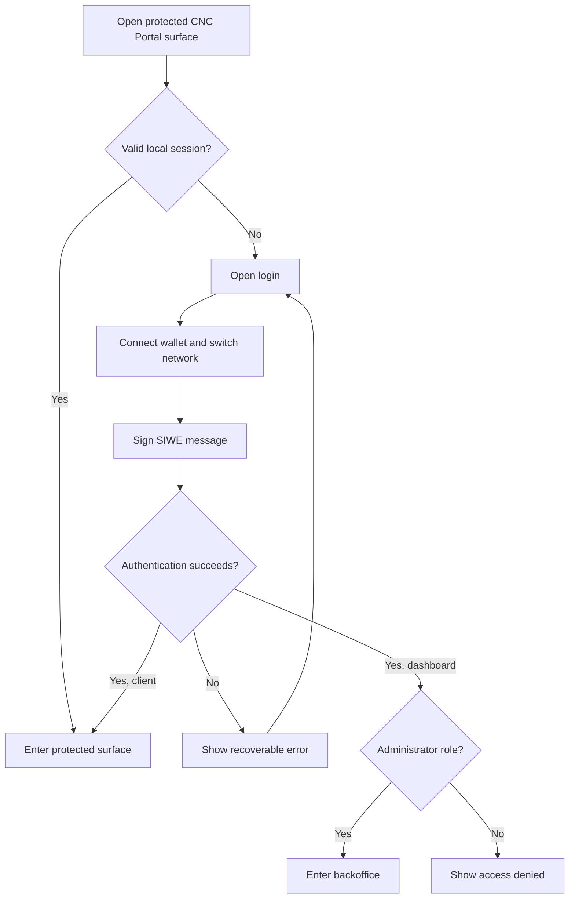

# Authentication — User Stories

**Scope:** Wallet-based sign-in and protected entry for the client and administrator dashboard

**Last reviewed:** Not yet reviewed

These acceptance criteria follow the
[feature documentation review contract](../../platform/feature-specification-guide.md#human-review-contract).

## Product Model

CNC Portal uses Sign-In with Ethereum. The user connects a wallet, switches to the configured network, and signs a message. Signing in does
not submit an on-chain transaction and does not consume gas.

The client accepts an authenticated portal user. The dashboard additionally requires a persisted administrator role. Authentication proves
wallet ownership; authorization decides which product surface the user may enter.

## Lifecycle

## Status Overview

| User Story  | Title                             | Actor                  | Status         |
| ----------- | --------------------------------- | ---------------------- | -------------- |
| US-AUTH-001 | Sign in to the client             | Portal user            | 🧪 Validation  |
| US-AUTH-002 | Sign in to the backoffice         | Platform administrator | 🧪 Validation  |
| US-AUTH-003 | Recover from an interrupted login | Portal user            | 🚧 In Progress |

## US-AUTH-001: Sign in to the Client

**As a** portal user\
**I want to** authenticate by signing a message with my wallet\
**So that** I can access my companies without submitting a blockchain transaction

### Acceptance Criteria

#### Happy Path

- [x] `AC-US-AUTH-001-01` A portal user can authenticate by signing a SIWE message and access their companies.
- [x] `AC-US-AUTH-001-02` An unknown wallet address receives a default portal user account after successful authentication.

#### Business Rules

- [x] `AC-US-AUTH-001-03` The wallet is connected and switched to the configured network before the SIWE message is signed.
- [x] `AC-US-AUTH-001-04` The SIWE message binds the wallet address, nonce, chain, domain, URI, and protocol version.
- [x] `AC-US-AUTH-001-05` The backend verifies the message signature and current nonce before authenticating the user.
- [x] `AC-US-AUTH-001-06` Successful authentication rotates the nonce and issues a JWT valid for 24 hours.
- [x] `AC-US-AUTH-001-07` Authentication signs a message without submitting an on-chain transaction or consuming gas.

#### Edge & Error Cases

- [x] `AC-US-AUTH-001-08` A portal user without a valid local session is redirected from protected client routes, including parameterized
      detail routes, to login.
- [x] `AC-US-AUTH-001-09` An invalid SIWE message or signature is rejected without authenticating the user.

## US-AUTH-002: Sign in to the Backoffice

**As a** platform administrator\
**I want to** authenticate with my wallet and persisted administrator role\
**So that** I can access protected backoffice capabilities

### Acceptance Criteria

#### Happy Path

- [x] `AC-US-AUTH-002-01` A platform administrator can connect a wallet, sign a SIWE message, and access the backoffice.
- [x] `AC-US-AUTH-002-02` Wallet connection can be completed before the authentication message is signed.

#### Business Rules

- [x] `AC-US-AUTH-002-03` Protected backoffice capabilities require an authenticated user with an administrator or super-administrator role.
- [x] `AC-US-AUTH-002-04` Successful backoffice authentication persists the access token and authenticated wallet address.
- [x] `AC-US-AUTH-002-05` Logging out clears the persisted session, disconnects the wallet, and returns the user to login.

#### Edge & Error Cases

- [x] `AC-US-AUTH-002-06` A missing access token or wallet address redirects the user to login.
- [x] `AC-US-AUTH-002-07` An authenticated user without an administrator role is denied access to protected backoffice capabilities.
- [x] `AC-US-AUTH-002-08` A failed token or user validation clears the persisted backoffice session and redirects the user to login.

## US-AUTH-003: Recover from an Interrupted Login

**As a** portal user\
**I want to** understand which login step failed and retry safely\
**So that** I can recover without an ambiguous or partially authenticated session

### Acceptance Criteria

#### Happy Path

- [x] `AC-US-AUTH-003-01` A user can retry authentication after an unsuccessful login attempt.

#### Business Rules

- [x] `AC-US-AUTH-003-02` Rejecting wallet connection, network switching, or message signing does not authenticate the user.
- [x] `AC-US-AUTH-003-03` A nonce, authentication, or profile request failure does not set the client authentication state.
- [x] `AC-US-AUTH-003-04` The client classifies wallet connection, network switching, signature, and backend failures separately.
- [x] `AC-US-AUTH-003-05` The backoffice classifies rejected signatures, network mismatches, backend failures, and connectivity failures
      separately.
- [ ] `AC-US-AUTH-003-06` The client removes an issued access token when the following profile request fails.

#### Edge & Error Cases

- [x] `AC-US-AUTH-003-07` A missing wallet provider leaves the user unauthenticated.
- [x] `AC-US-AUTH-003-08` An unsuccessful login attempt does not provide access to a protected product surface.

## Known Gaps

- The client persists the issued access token if the following profile request fails, although the local authentication state remains false.

## Implementation Evidence

**Implementation evidence reviewed against:** `8b231a2e0ccf81bf988ee73a26f8a53512d15f18`

- [Client login page](../../../app/src/views/LoginView.vue)
- [Client SIWE orchestration](../../../app/src/composables/useSiwe.ts)
- [Client SIWE tests](../../../app/src/composables/__tests__/useSiwe.spec.ts)
- [Dashboard login page](../../../dashboard/app/pages/login.vue)
- [Dashboard SIWE orchestration](../../../dashboard/app/composables/useSiwe.ts)
- [Dashboard route guard](../../../dashboard/app/middleware/auth.global.ts)
- [Dashboard login error classification](../../../dashboard/app/utils/loginError.ts)
- [Backend SIWE controller](../../../backend/src/controllers/authController.ts)
- [Backend authentication middleware](../../../backend/src/middleware/authMiddleware.ts)
- [Backend authentication tests](../../../backend/src/controllers/__tests__/authController.test.ts)

## Related Documentation

- [Client Navigation implementation](../../implementation/client-navigation/README.md)
- [Authentication implementation](../../implementation/authentication/README.md)
- [RBAC implementation](../../implementation/rbac/README.md)
- [Security Standards](../../platform/security.md)
