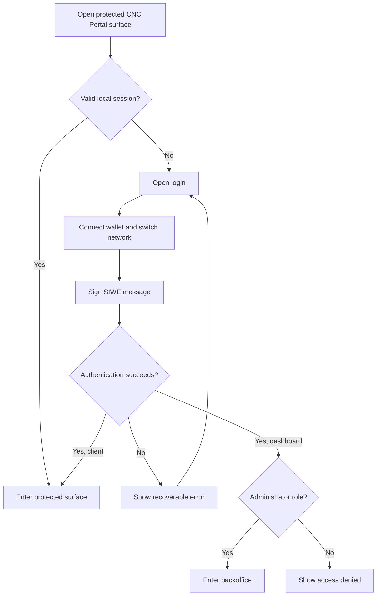

# Authentication — User Stories

**Scope:** Wallet-based sign-in and protected entry for the client and administrator dashboard

**Last reviewed:** Not yet reviewed

These acceptance criteria follow the
[feature documentation review contract](../../platform/feature-specification-guide.md#human-review-contract).

## Product Model

CNC Portal uses Sign-In with Ethereum. The user connects a wallet, switches to the configured
network, and signs a message. Signing in does not submit an on-chain transaction and does not
consume gas.

The client accepts an authenticated portal user. The dashboard additionally requires a persisted
administrator role. Authentication proves wallet ownership; authorization decides which product
surface the user may enter.

## Lifecycle

## Status Overview

| User Story  | Title                             | Actor                  | Status        | Priority | Effort |
| ----------- | --------------------------------- | ---------------------- | ------------- | :------: | ------ |
| US-AUTH-001 | Sign in to the client             | Portal user            | 🧪 Validation |    P1    | M      |
| US-AUTH-002 | Sign in to the backoffice         | Platform administrator | 🧪 Validation |    P1    | M      |
| US-AUTH-003 | Recover from an interrupted login | Portal user            | 🧪 Validation |    P1    | S      |

## US-AUTH-001: Sign in to the Client

**As a** portal user\
**I want to** authenticate by signing a message with my wallet\
**So that** I can access my companies without submitting a blockchain transaction

### Acceptance Criteria

- [ ] The login page identifies Sign-In with Ethereum as the authentication action.
- [ ] The journey connects the wallet and requests the configured network before signing.
- [ ] The wallet message can be reviewed and rejected without sending a transaction or consuming
      gas.
- [ ] A successful signature and backend verification open the Companies surface.
- [ ] A protected client route redirects a user without a valid session to login.

**Priority:** P1 (Critical) · **Effort:** M · **Status:** 🧪 Validation

## US-AUTH-002: Sign in to the Backoffice

**As a** platform administrator\
**I want to** authenticate with my wallet and persisted administrator role\
**So that** I can access protected backoffice capabilities

### Acceptance Criteria

- [ ] The dashboard separates wallet connection from message signing.
- [ ] The connected wallet address is visible before the user signs in.
- [ ] A successful administrator login opens the backoffice Overview.
- [ ] An authenticated user without an administrator role reaches Access Denied rather than a
      protected module.
- [ ] Logging out clears the session and returns the user to login.

**Priority:** P1 (Critical) · **Effort:** M · **Status:** 🧪 Validation

## US-AUTH-003: Recover from an Interrupted Login

**As a** portal user\
**I want to** understand which login step failed and retry safely\
**So that** I can recover without an ambiguous or partially authenticated session

### Acceptance Criteria

- [ ] Rejecting wallet connection, network switching, or message signing leaves the user logged out.
- [ ] A nonce, authentication, or profile request failure leaves the protected surface inaccessible.
- [ ] The client identifies the failed login stage with a user-facing error.
- [ ] The dashboard displays a recoverable login error and allows another attempt.
- [ ] A failed attempt does not expose a protected route or persist a valid session.

**Priority:** P1 (Critical) · **Effort:** S · **Status:** 🧪 Validation

## Implementation Evidence

- [Client login page](../../../app/src/views/LoginView.vue)
- [Client SIWE orchestration](../../../app/src/composables/useSiwe.ts)
- [Client SIWE tests](../../../app/src/composables/__tests__/useSiwe.spec.ts)
- [Dashboard login page](../../../dashboard/app/pages/login.vue)
- [Dashboard SIWE orchestration](../../../dashboard/app/composables/useSiwe.ts)
- [Dashboard route guard](../../../dashboard/app/middleware/auth.global.ts)
- [Backend authentication tests](../../../backend/src/controllers/__tests__/authController.test.ts)

## Related Documentation

- [Authentication implementation](../../implementation/authentication/README.md)
- [RBAC implementation](../../implementation/rbac/README.md)
- [Security Standards](../../platform/security.md)
