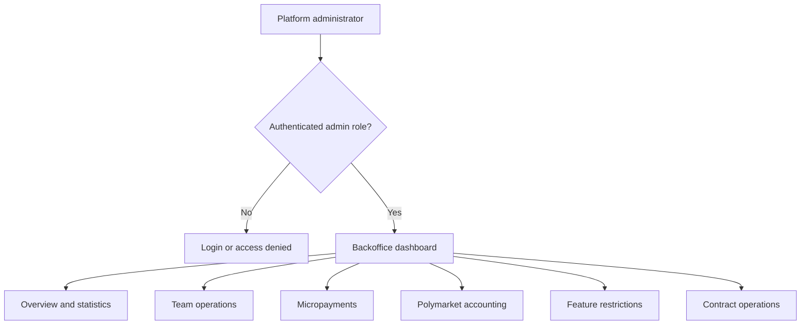

# Backoffice — Feature Inventory

**Scope:** Administrator-only capabilities exposed by the Nuxt dashboard

**Last verified:** 2026-08-21

The backoffice is one product surface containing several administrator capabilities. This README owns their grouping and navigation. Each
capability can gain its own canonical user stories under `docs/features/backoffice/<capability>/README.md` as it is migrated to the current
documentation model.

Access requires an authenticated user with `ROLE_ADMIN` or `ROLE_SUPER_ADMIN`. Authentication and role guards are entry conditions, not
separate backoffice features.

## Current Capabilities

| Capability              | User-visible outcome                                                                           | Routes                                      | Documentation                                         |
| ----------------------- | ---------------------------------------------------------------------------------------------- | ------------------------------------------- | ----------------------------------------------------- |
| Overview and statistics | Inspect platform, team, user, claim, wage, expense, contract, governance, and activity metrics | `/`, `/stats`                               | [Statistics references](./statistics/README.md)       |
| Team operations         | Inspect teams, their members, balances, contracts, and Officer generations                     | `/teams`, `/teams/:id`                      | Alignment due                                         |
| Micropayments           | Inspect FeeCollector versions and withdraw collected fees                                      | `/micropayments`                            | Alignment due                                         |
| Polymarket accounting   | Reconstruct a wallet's statements, activity, and positions                                     | `/accounting`                               | Alignment due                                         |
| Feature restrictions    | Manage global feature states and team overrides                                                | `/features`, `/features/:id`                | [Canonical stories](./feature-restrictions/README.md) |
| Contract operations     | Inspect deployment history and synchronize Officer version metadata                            | `/contracts/history`, `/contracts/versions` | Alignment due                                         |

`Alignment due` means that the product surface exists but no canonical feature README has yet been reviewed under the current model. It is
not a delivery-status claim.

## Routes That Do Not Define Backoffice Features

| Route or area              | Why it is excluded                                           |
| -------------------------- | ------------------------------------------------------------ |
| `/login`, `/access-denied` | Authentication and authorization states                      |
| `/date-picker-demo`        | Development playground                                       |
| `/contracts`               | Placeholder landing page; no administrator outcome yet       |
| `/customers`, `/inbox`     | Nuxt dashboard template screens backed by fixture data       |
| `/settings*`               | Template profile, member, notification, and security screens |

These routes can become features only after CNC Portal provides a real user journey through them. Their presence in the filesystem or router
is not sufficient.

## Current Evidence

- [Dashboard navigation and module entry points](../../../dashboard/app/layouts/default.vue)
- [Administrator access guard](../../../dashboard/app/middleware/auth.global.ts)
- [Overview and statistics page](../../../dashboard/app/pages/index.vue)
- [Team operations](../../../dashboard/app/pages/teams/index.vue)
- [Micropayments](../../../dashboard/app/pages/micropayments.vue)
- [Polymarket accounting](../../../dashboard/app/pages/accounting.vue)
- [Feature restrictions](../../../dashboard/app/pages/features/index.vue)
- [Contract history](../../../dashboard/app/pages/contracts/history.vue)
- [Officer version synchronization](../../../dashboard/app/pages/contracts/versions.vue)

## Related Documentation

- [Product Feature Inventory](../README.md)
- [Feature Documentation Guide](../../platform/feature-specification-guide.md)
- [Feature flag evaluation](../../implementation/feature-flags/README.md)
- [Security Standards](../../platform/security.md)
- [Testing Strategy](../../platform/testing-strategy.md)
