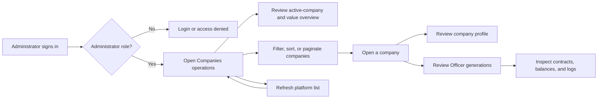

# Backoffice Companies Operations — User Stories

**Scope:** Read-only administrator oversight of platform companies, their current profile, Officer generations, contracts, and supported
on-chain balances from the technical `/teams` and `/teams/:id` routes

**Last reviewed:** 2026-08-27

These acceptance criteria follow the
[feature documentation review contract](../../../platform/feature-specification-guide.md#human-review-contract).

## Product Model

- A **company** is the product term for the technical `team` record and its `/teams` routes. This document uses _company_ for the
  administrator's outcome and uses _team_ only when identifying a technical API or source artifact.
- **Companies operations** is the administrator dashboard's read-only oversight capability. It does not create, edit, archive, delete, or
  change a company's membership; those workspace actions belong to [Companies and workspace](../../companies/README.md).
- Dashboard navigation and the platform-wide company-list API both require an authenticated `ROLE_ADMIN` or `ROLE_SUPER_ADMIN` user.
- The default platform list includes active companies only. It exposes a membership count, not the identities of individual company members,
  and it does not provide a control to include archived companies.
- An **Officer generation** is one deployed Officer for a company. The current generation is the head of its succession chain; older
  generations remain visible for operational history. Contracts not associated with an Officer generation are shown as shared,
  version-independent contracts.
- Balance views cover the native token and the supported stablecoins held by the supported value-holding contract types. The stablecoin
  total is an approximate dollar value; the native-token balance is displayed separately and is not priced into that total.

## Lifecycle

## Status Overview

| User Story      | Title                                      | Actor                  | Status  |
| --------------- | ------------------------------------------ | ---------------------- | ------- |
| US-TEAM-OPS-001 | Access and inspect platform companies      | Platform administrator | ✅ Done |
| US-TEAM-OPS-002 | Inspect a company profile                  | Platform administrator | ✅ Done |
| US-TEAM-OPS-003 | Investigate Officer contracts and balances | Platform administrator | ✅ Done |

## US-TEAM-OPS-001: Access and Inspect Platform Companies

**As a** platform administrator\
**I want to** access and inspect the active companies across the platform\
**So that** I can identify the company that needs operational follow-up

### Acceptance Criteria

#### Happy Path

- [x] An authenticated administrator or super administrator can open Companies operations and load the active platform company list.
- [x] The overview reports the number of listed companies, their combined membership count, the number with a current Officer, and the
      average members per listed company.
- [x] An administrator can inspect the supported on-chain value held by listed companies and the current versus legacy Officer-beacon
      summary.
- [x] An administrator can filter the list by company name, sort the available operational columns, paginate the filtered result, and open a
      selected company.

#### Business Rules

- [x] A visitor without a session is redirected to sign in, and an authenticated user without an administrator role is sent to access denied
      before using the dashboard journey.
- [x] The default platform list excludes archived companies.
- [x] The list exposes each company's membership count rather than individual member identities.
- [x] The platform-wide company-list API, implemented by the technical `/teams` endpoint, independently restricts unfiltered results to
      administrator roles. _(API)_

#### Edge & Error Cases

- [x] A failed company-list request is reported as a loading error instead of being presented as a successful refresh.
- [x] A platform with no active companies produces an empty list and zero-valued company summary.
- [x] An administrator can request a fresh platform company list after an earlier load.

**Dependencies:** Dashboard authentication and administrator roles

## US-TEAM-OPS-002: Inspect a Company Profile

**As a** platform administrator\
**I want to** open a company and inspect its current identity and ownership\
**So that** I can establish the operational context before investigating its contracts

### Acceptance Criteria

#### Happy Path

- [x] An administrator can open a listed company and inspect its name, identifier, description when present, owner, creation date, and
      current Officer version when one exists.
- [x] An administrator can return from the company profile to the platform company list.

#### Business Rules

- [x] The company-detail API permits an administrator to inspect a company even when the administrator is not a member of that company.
- [x] The dashboard exposes no administrator controls for creating, editing, archiving, deleting, or changing a company's membership.

#### Edge & Error Cases

- [x] Loading a company profile displays a pending state until its details are available.
- [x] An unavailable or failed company-detail request reports that the company could not be loaded.

**Dependencies:** US-TEAM-OPS-001

## US-TEAM-OPS-003: Investigate Officer Contracts and Balances

**As a** platform administrator\
**I want to** inspect a company's Officer generations, contracts, balances, and event history\
**So that** I can investigate its deployed operational surface and held value

### Acceptance Criteria

#### Happy Path

- [x] An administrator can inspect the current and legacy Officer generations associated with a listed company.
- [x] An administrator can inspect contracts grouped by their Officer generation and separately identify shared, version-independent
      contracts.
- [x] Each displayed contract exposes its type, address, deployer, and event-log history.
- [x] Supported value-holding contracts expose their current native-token and supported-stablecoin balances, including an explicit zero when
      no supported balance is held.

#### Business Rules

- [x] A generation is identified as current only when it has no successor in that company's Officer sequence.
- [x] Contracts that do not hold supported value are not assigned a balance in the contract detail view.
- [x] Stablecoin totals remain an approximate dollar value, while native-token balances remain outside that dollar total.

#### Edge & Error Cases

- [x] A company with no deployed Officer contracts reports that no contracts are available rather than implying a deployment.
- [x] A failed Officer-generation request reports that contract versions could not be loaded.
- [x] A failed event-log request reports the retrieval failure instead of presenting an empty event history as successful.

**Dependencies:** US-TEAM-OPS-002 and available backend and chain data

## Human Validation

Validated on 2026-08-27 against the administrator access boundary, company-list and company-profile journeys, Officer and balance
investigation, and the independent API role enforcement described below.

## Implementation Evidence

- [Dashboard navigation](../../../../dashboard/app/layouts/default.vue),
  [administrator route guard](../../../../dashboard/app/middleware/auth.global.ts), and
  [Companies operations entry page](../../../../dashboard/app/pages/teams/index.vue)
- [Company list, filtering, sorting, pagination, and value overview](../../../../dashboard/app/components/teams/TeamsList.vue),
  [company-list integration](../../../../dashboard/app/composables/useTeams.ts), and
  [supported balance recap](../../../../dashboard/app/composables/useTeamsBalanceRecaps.ts)
- [Company profile](../../../../dashboard/app/pages/teams/%5Bid%5D.vue),
  [Officer and contract grouping](../../../../dashboard/app/components/teams/TeamContractGroups.vue),
  [contract balances](../../../../dashboard/app/components/teams/ContractBalance.vue), and
  [contract logs](../../../../dashboard/app/components/teams/ContractLogs.vue)
- [Company routes](../../../../backend/src/routes/teamRoutes.ts),
  [company controller](../../../../backend/src/controllers/teamController.ts), and
  [company-controller coverage](../../../../backend/src/controllers/__tests__/teamController.test.ts)

## Related Documentation

- [Companies and workspace](../../companies/README.md)
- [Backoffice Feature Inventory](../README.md)
- [Product Feature Inventory](../../README.md)

_[← Back to feature inventory](../../README.md)_
