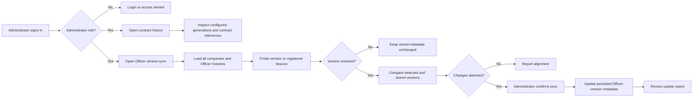

# Backoffice Contract Operations — User Stories

**Scope:** Administrator inspection of the versioned contract registry and synchronization of stored company Officer-version metadata at
`/contracts/history` and `/contracts/versions`

**Last reviewed:** Not yet reviewed

These acceptance criteria follow the
[feature documentation review contract](../../../platform/feature-specification-guide.md#human-review-contract).

## Product Model

- Backoffice Contract Operations is a platform-wide administrator capability. The dashboard guard and the synchronization API require an
  authenticated `ROLE_ADMIN` or `ROLE_SUPER_ADMIN` user.
- Contract history is a read-only view of the version registry bundled with the dashboard. It lists deployment generations and the
  configured beacon, implementation, Officer, and upgrade-authority references for each contract.
- An Officer is the on-chain contract suite attached to a company. The persisted `TeamOfficer` record is the technical company-Officer
  model; it stores the detected version for the company and its historical generations.
- Version synchronization probes every stored current and historical Officer. It first reads `version()` and, for older Officers, falls back
  to the proxy beacon matched against the version registry. The operation changes only the persisted version metadata; it does not deploy,
  upgrade, pause, or otherwise alter a contract.
- An unresolved Officer is kept unchanged rather than receiving a guessed version. The resulting report distinguishes updated, unchanged,
  and unresolved records.

## Lifecycle

## Status Overview

| User Story          | Title                                    | Actor                  | Status         |
| ------------------- | ---------------------------------------- | ---------------------- | -------------- |
| US-CONTRACT-OPS-001 | Inspect the contract deployment registry | Platform administrator | 🧪 Validation  |
| US-CONTRACT-OPS-002 | Audit stored Officer-version metadata    | Platform administrator | 🚧 In Progress |
| US-CONTRACT-OPS-003 | Synchronize Officer-version metadata     | Platform administrator | 🧪 Validation  |

## US-CONTRACT-OPS-001: Inspect the Contract Deployment Registry

**As a** platform administrator\
**I want to** inspect the configured contract deployment generations and their upgrade history\
**So that** I can understand which contract references belong to each recorded platform generation

### Acceptance Criteria

#### Happy Path

- [x] An authenticated administrator can open the contract-history journey.
- [x] The journey lists each configured generation with its version, deployment date, source revision, supported on-chain version range, and
      Officer reference.
- [x] The journey groups each configured contract's generation history and identifies its proxy type, beacon reference when present,
      implementation reference, and current-generation status.
- [x] An administrator can inspect the configured upgrade authority for a contract reference.

#### Business Rules

- [x] Contract history is read-only and does not modify a contract, deployment record, or company metadata.
- [x] A current generation is distinguished from historical generations in the registry view.
- [x] A contract is included in the history when it has an implementation entry in at least one configured generation.

#### Edge & Error Cases

- [x] A generation without a configured beacon remains represented as a transparent-proxy contract rather than as a missing contract.
- [x] A missing configured address is presented as unavailable rather than as a fabricated address.

**Dependencies:** Dashboard authentication, administrator role, and the bundled version registry

## US-CONTRACT-OPS-002: Audit Stored Officer-Version Metadata

**As a** platform administrator\
**I want to** preview which company Officer-version records differ from their detected on-chain generation\
**So that** I can decide whether a platform-wide metadata synchronization is needed

### Acceptance Criteria

#### Happy Path

- [x] An authenticated administrator can open the Officer-version synchronization journey.
- [x] The audit includes archived companies and every stored current and historical Officer record.
- [x] The audit compares each persisted version with a direct Officer `version()` result, falling back to its recognized proxy beacon when
      necessary.
- [x] The preview identifies the company, Officer address, current or historical generation, stored version, detected version, detection
      source, and proposed change for every loaded Officer.
- [x] An administrator can limit the visible preview to records that would change or inspect all loaded records.

#### Business Rules

- [x] A directly reported Officer version takes precedence over a version inferred from a recognized beacon.
- [x] An Officer whose version cannot be resolved is reported as unresolved and is not proposed for update.
- [x] A preview is read-only until an administrator explicitly confirms the synchronization.

#### Edge & Error Cases

- [x] A platform with no stored Officers reports that no records are available for the audit.
- [ ] A failed company-list or Officer-history read is reported as a data-load failure instead of a completed empty audit.
- [ ] An unavailable version and beacon probe is distinguished from an Officer whose generation is genuinely unrecognized.

**Dependencies:** US-CONTRACT-OPS-001, dashboard authentication, administrator role, company Officer records, and on-chain read access

## US-CONTRACT-OPS-003: Synchronize Officer-Version Metadata

**As a** platform administrator\
**I want to** apply the reviewed Officer-version changes after confirmation\
**So that** stored company metadata remains aligned with the detected contract generation

### Acceptance Criteria

#### Happy Path

- [x] An administrator can start synchronization only after the preview detects at least one update and the administrator confirms it.
- [x] The synchronization scans every stored Officer record and returns counts and per-record results for updated, unchanged, and unresolved
      records.
- [x] A resolved version difference updates only the persisted Officer-version metadata.
- [x] The dashboard refreshes affected company and Officer caches after a successful synchronization.

#### Business Rules

- [x] The synchronization API requires an authenticated administrator in addition to the dashboard route guard. _(API)_
- [x] An unresolved Officer remains unchanged rather than receiving a default or guessed version. _(API)_
- [x] Historical Officer generations are included in the synchronization as well as current generations. _(API)_
- [x] The synchronization does not deploy, upgrade, pause, or otherwise modify any on-chain contract.

#### Edge & Error Cases

- [x] A failed synchronization reports failure without presenting the run as complete.
- [x] When the server resolves a version differently from the dashboard preview, the journey reports that divergence.
- [x] A synchronization request with no detected changes completes without rewriting an Officer record. _(API)_

**Dependencies:** US-CONTRACT-OPS-002, dashboard authentication, administrator role, and on-chain read access

## Known Gaps

- Contract history is a bundled registry view. It does not independently verify every historical deployment reference against the chain at
  viewing time (`US-CONTRACT-OPS-001`).
- A failed company-list or Officer-history request can appear as an empty audit because the audit composable has no distinct query-error
  state (`US-CONTRACT-OPS-002`).
- An unreachable version or beacon probe and an unrecognized Officer both appear as unresolved, so an administrator cannot distinguish the
  source of that result (`US-CONTRACT-OPS-002`).
- The dashboard has no dedicated automated tests for contract-history display or the Officer-version synchronization interaction. Backend
  controller and version-resolution tests exist; human validation remains required.

## Implementation Evidence

- [Dashboard navigation](../../../../dashboard/app/layouts/default.vue),
  [administrator route guard](../../../../dashboard/app/middleware/auth.global.ts),
  [contract history page](../../../../dashboard/app/pages/contracts/history.vue), and
  [Officer-version synchronization page](../../../../dashboard/app/pages/contracts/versions.vue)
- [Version registry integration](../../../../dashboard/app/composables/useContractRegistry.ts) and
  [contract-history card](../../../../dashboard/app/components/contracts/ContractHistoryCard.vue), whose deployment dates use the
  [canonical dashboard formatter](../../../../dashboard/app/utils/format/)
- [Officer-version audit](../../../../dashboard/app/composables/useOfficerVersionAudit.ts),
  [version synchronization mutation](../../../../dashboard/app/queries/contract.query.ts), and
  [Officer-version table](../../../../dashboard/app/components/contracts/OfficerVersionTable.vue)
- [Synchronization API client](../../../../dashboard/app/api/contract.ts),
  [administrator route registration](../../../../backend/src/config/serverConfig.ts),
  [synchronization route](../../../../backend/src/routes/officerVersionRoutes.ts), and
  [synchronization controller](../../../../backend/src/controllers/officerVersionController.ts)
- [Officer-version resolution](../../../../backend/src/utils/officerVersion.ts),
  [controller tests](../../../../backend/src/controllers/__tests__/officerVersionController.test.ts), and
  [version-resolution tests](../../../../backend/src/utils/__tests__/officerVersion.test.ts)

## Related Documentation

- [Backoffice Feature Inventory](../README.md)
- [Product Feature Inventory](../../README.md)
- [Contract feature documentation](../../../contracts/features/README.md)
- [Contract Management](../../contract-management/README.md)

_[← Back to feature inventory](../../README.md)_
