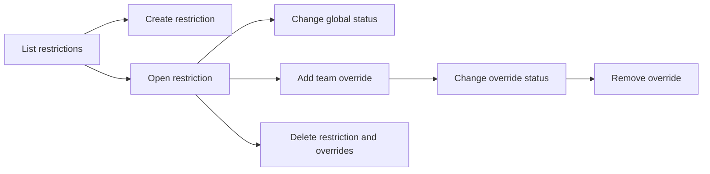

# Feature Restrictions — User Stories

**Scope:** Administrator management of global feature states and team-specific overrides

**Last reviewed:** Not yet reviewed

These acceptance criteria follow the
[feature documentation review contract](../../../platform/feature-specification-guide.md#human-review-contract).

## Product Model

A feature restriction has a stable function name and one global status: `enabled`, `disabled`, or `beta`. An administrator can add a team
override so that one team uses a different status from the global value. The consuming product feature decides what each status means for
its user journey.

Only authenticated administrators can access this backoffice capability.

## Lifecycle

## Status Overview

| User Story  | Title                        | Actor                  | Status        | Priority | Effort |
| ----------- | ---------------------------- | ---------------------- | ------------- | :------: | ------ |
| US-FLAG-001 | Manage global restrictions   | Platform administrator | 🧪 Validation |    P1    | M      |
| US-FLAG-002 | Manage team overrides        | Platform administrator | 🧪 Validation |    P1    | M      |
| US-FLAG-003 | Remove obsolete restrictions | Platform administrator | 🧪 Validation |    P2    | S      |

## US-FLAG-001: Manage Global Restrictions

**As a** platform administrator\
**I want to** create restrictions and change their global status\
**So that** I can control the default behaviour used by consuming product features

### Acceptance Criteria

- [ ] The list shows every restriction with its function name and global status.
- [ ] The administrator can create a restriction using a valid function name and status.
- [ ] Duplicate or invalid function names are rejected with a visible error.
- [ ] The administrator can change an existing global status to enabled, disabled, or beta.
- [ ] A failed update preserves the previously displayed persisted state.

**Priority:** P1 (Critical) · **Effort:** M · **Status:** 🧪 Validation

## US-FLAG-002: Manage Team Overrides

**As a** platform administrator\
**I want to** assign a team-specific status to a restriction\
**So that** one team can use behaviour different from the global default

### Acceptance Criteria

- [ ] The restriction detail shows its current team overrides.
- [ ] The administrator can add an override for an existing team.
- [ ] A duplicate override for the same team and restriction is rejected.
- [ ] The administrator can update an override to enabled, disabled, or beta.
- [ ] Removing an override returns that team to the global status.

**Priority:** P1 (Critical) · **Effort:** M · **Status:** 🧪 Validation

## US-FLAG-003: Remove Obsolete Restrictions

**As a** platform administrator\
**I want to** delete a restriction that is no longer used\
**So that** the backoffice does not expose obsolete configuration

### Acceptance Criteria

- [ ] The administrator is asked to confirm the destructive action.
- [ ] Cancelling confirmation leaves the restriction and its overrides unchanged.
- [ ] Confirming deletion removes the restriction from the list.
- [ ] Deleting a restriction also removes its team overrides.
- [ ] A failed deletion remains visible as an error rather than success.

**Priority:** P2 (High) · **Effort:** S · **Status:** 🧪 Validation

## Implementation Evidence

- [Feature list page](../../../../dashboard/app/pages/features/index.vue)
- [Feature detail page](../../../../dashboard/app/pages/features/[id].vue)
- [Global restriction component](../../../../dashboard/app/components/features/FeatureGlobalRestriction.vue)
- [Team override component](../../../../dashboard/app/components/features/TeamOverridesSection.vue)
- [Feature queries](../../../../dashboard/app/queries/feature.query.ts)
- [Backend controller tests](../../../../backend/src/controllers/__tests__/featureController.test.ts)

## Related Documentation

- [Feature flag evaluation](../../../implementation/feature-flags/README.md)
- [Backoffice Feature Inventory](../README.md)
- [RBAC implementation](../../../implementation/rbac/README.md)
