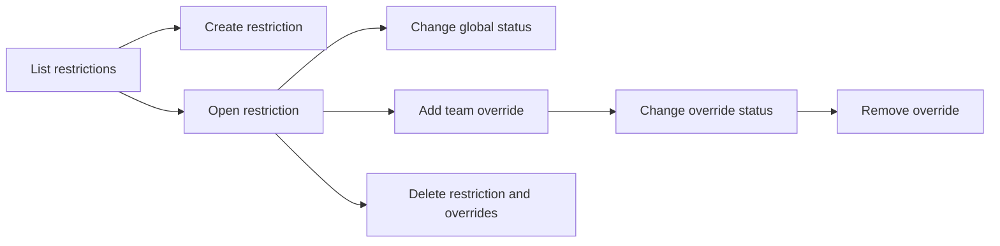

# Feature Restrictions — User Stories

**Scope:** Administrator management of global feature states and team-specific overrides

**Last reviewed:** Not yet reviewed

These acceptance criteria follow the
[feature documentation review contract](../../../platform/feature-specification-guide.md#human-review-contract).

## Product Model

A feature restriction has a stable function name and one global status: `enabled`, `disabled`, or `beta`. An administrator can add a team
override so that one team uses a different status from the global value. The consuming product feature decides what each status means for
its user journey.

Only authenticated administrators can access this backoffice capability.

## Lifecycle

## Status Overview

| User Story  | Title                        | Actor                  | Status         |
| ----------- | ---------------------------- | ---------------------- | -------------- |
| US-FLAG-001 | Manage global restrictions   | Platform administrator | 🧪 Validation  |
| US-FLAG-002 | Manage team overrides        | Platform administrator | 🚧 In Progress |
| US-FLAG-003 | Remove obsolete restrictions | Platform administrator | 🚧 In Progress |

## US-FLAG-001: Manage Global Restrictions

**As a** platform administrator\
**I want to** create restrictions and change their global status\
**So that** I can control the default behaviour used by consuming product features

### Acceptance Criteria

#### Happy Path

- [x] An administrator can list every restriction with its function name and global status.
- [x] An administrator can create an available predefined restriction with an initial status.
- [x] An administrator can change an existing restriction's global status.

#### Business Rules

- [x] Only authenticated administrators can manage feature restrictions.
- [x] A restriction status must be `enabled`, `disabled`, or `beta`.
- [x] A restriction function name contains only uppercase letters and underscores.
- [x] Each restriction function name is unique.

#### Edge & Error Cases

- [x] An invalid or duplicate restriction is rejected without creating a record.
- [x] Updating a missing restriction is rejected without creating a record.
- [x] An invalid global status update is rejected without changing the persisted restriction.

## US-FLAG-002: Manage Team Overrides

**As a** platform administrator\
**I want to** assign a team-specific status to a restriction\
**So that** one team can use behaviour different from the global default

### Acceptance Criteria

#### Happy Path

- [ ] Restriction details include every configured team override.
- [x] An administrator can add an override for an existing team.
- [x] An administrator can change an override's status.
- [x] Removing an override returns the team to the restriction's global status.

#### Business Rules

- [x] A team can have at most one override for each restriction.
- [x] An override status must be `enabled`, `disabled`, or `beta`.
- [x] A team's override takes precedence over the restriction's global status.
- [x] An override can reference only an existing restriction and team.

#### Edge & Error Cases

- [x] A duplicate override is rejected without changing the existing override.
- [x] Updating a missing override is rejected without creating one.
- [x] Removing a missing override is rejected without changing other overrides.
- [x] An invalid override status is rejected without changing the persisted override.

## US-FLAG-003: Remove Obsolete Restrictions

**As a** platform administrator\
**I want to** delete a restriction that is no longer used\
**So that** the backoffice does not expose obsolete configuration

### Acceptance Criteria

#### Happy Path

- [x] An administrator can delete an existing restriction.
- [x] Successful deletion removes the restriction and all its team overrides.

#### Business Rules

- [x] Only authenticated administrators can delete a restriction.

#### Edge & Error Cases

- [x] Cancelling deletion leaves the restriction and its overrides unchanged.
- [x] Deleting a missing restriction is rejected.
- [x] A failed deletion is reported as a failure rather than success.
- [ ] A failed deletion leaves the restriction and all its team overrides unchanged.

## Known Gaps

- Restriction details return at most 100 team overrides, so additional overrides are omitted.
- Restriction deletion removes overrides before deleting the restriction without a database transaction, so a partial failure can remove
  overrides while preserving the restriction.

## UI/UX Notes

- The backoffice asks for confirmation before deleting a restriction and allows the administrator to cancel that confirmation.

## Implementation Evidence

- [Feature list page](../../../../dashboard/app/pages/features/index.vue)
- [Feature detail page](../../../../dashboard/app/pages/features/[id].vue)
- [Global restriction component](../../../../dashboard/app/components/features/FeatureGlobalRestriction.vue)
- [Team override component](../../../../dashboard/app/components/features/TeamOverridesSection.vue)
- [Feature queries](../../../../dashboard/app/queries/feature.query.ts)
- [Backend feature controller](../../../../backend/src/controllers/featureController.ts)
- [Backend feature validation](../../../../backend/src/validation/featureValidation.ts)
- [Backend feature persistence](../../../../backend/src/utils/featureUtils.ts)
- [Backend controller tests](../../../../backend/src/controllers/__tests__/featureController.test.ts)

## Related Documentation

- [Feature flag evaluation](../../../implementation/feature-flags/README.md)
- [Backoffice Feature Inventory](../README.md)
- [RBAC implementation](../../../implementation/rbac/README.md)
