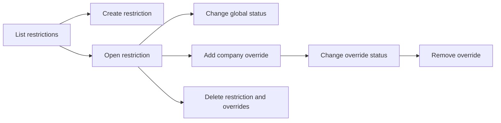

# Feature Restrictions — User Stories

**Scope:** Administrator management of global feature states and company-specific overrides

**Last reviewed:** Not yet reviewed

These acceptance criteria follow the
[feature documentation review contract](../../../platform/feature-specification-guide.md#human-review-contract).

## Product Model

A feature restriction has a stable function name and one global status: `enabled`, `disabled`, or `beta`. An administrator can add a company
override so that one company uses a different status from the global value. The consuming product feature decides what each status means for
its user journey.

Only authenticated administrators can access this backoffice capability.

## Lifecycle

```mermaid
flowchart LR
  list[List restrictions] --> create[Create restriction]
  list --> detail[Open restriction]
  detail --> global[Change global status]
  detail --> add[Add company override]
  add --> update[Change override status]
  update --> remove[Remove override]
  detail --> delete[Delete restriction and overrides]
```

## Status Overview

| User Story  | Title                        | Actor                  | Status         |
| ----------- | ---------------------------- | ---------------------- | -------------- |
| US-FLAG-001 | Manage global restrictions   | Platform administrator | 🧪 Validation  |
| US-FLAG-002 | Manage company overrides     | Platform administrator | 🚧 In Progress |
| US-FLAG-003 | Remove obsolete restrictions | Platform administrator | 🚧 In Progress |

## Test Coverage Overview

Coverage targets compare each criterion with its required representative evidence. Static references are not a current passing run; the
generated coverage report and CI retain file-level and execution evidence. Known assertion gaps remain insufficient even when a static
reference has the expected layer label.

| User Story  | Main Journey | Coverage Target | Gaps                   |
| ----------- | ------------ | --------------- | ---------------------- |
| US-FLAG-001 | Not required | ❌ 0/10 met     | `AC-US-FLAG-001-01–10` |
| US-FLAG-002 | Not required | ❌ 0/12 met     | `AC-US-FLAG-002-01–12` |
| US-FLAG-003 | Not required | ❌ 0/7 met      | `AC-US-FLAG-003-01–07` |

## Proof Strategy Reference

| Strategy      | Responsibilities    | Required Evidence   | Proof Rationale                                                        |
| ------------- | ------------------- | ------------------- | ---------------------------------------------------------------------- |
| `PS-FL-READ`  | Dashboard + Backend | Dashboard + Backend | List and detail payloads must match the visible dashboard state.       |
| `PS-FL-WRITE` | Dashboard + Backend | Dashboard + Backend | A saved change must persist and refresh the administrator view.        |
| `PS-FL-GUARD` | Dashboard + Backend | Dashboard + Backend | Dashboard guard and independent API authorization can fail separately. |
| `PS-FL-RULE`  | Backend             | Backend             | The server owns validation, uniqueness, precedence, and atomicity.     |
| `PS-FL-UI`    | Dashboard           | Dashboard           | Cancellation must not send a mutation.                                 |
| `PS-FL-FAIL`  | Dashboard + Backend | Dashboard + Backend | A failed delete must not be reported as a completed change.            |

## US-FLAG-001: Manage Global Restrictions

**As a** platform administrator\
**I want to** create restrictions and change their global status\
**So that** I can control the default behaviour used by consuming product features

### Acceptance Criteria

#### Happy Path

- [x] `AC-US-FLAG-001-01` An administrator can list every restriction with its function name and global status.
- [x] `AC-US-FLAG-001-02` An administrator can create an available predefined restriction with an initial status.
- [x] `AC-US-FLAG-001-03` An administrator can change an existing restriction's global status.

#### Business Rules

- [x] `AC-US-FLAG-001-04` Only authenticated administrators can manage feature restrictions.
- [x] `AC-US-FLAG-001-05` A restriction status must be `enabled`, `disabled`, or `beta`.
- [x] `AC-US-FLAG-001-06` A restriction function name contains only uppercase letters and underscores.
- [x] `AC-US-FLAG-001-07` Each restriction function name is unique.

#### Edge & Error Cases

- [x] `AC-US-FLAG-001-08` An invalid or duplicate restriction is rejected without creating a record.
- [x] `AC-US-FLAG-001-09` Updating a missing restriction is rejected without creating a record.
- [x] `AC-US-FLAG-001-10` An invalid global status update is rejected without changing the persisted restriction.

### Test Coverage

| Acceptance Criterion | Proof Strategy | Current Evidence | Status          |
| -------------------- | -------------- | ---------------- | --------------- |
| `AC-US-FLAG-001-01`  | `PS-FL-READ`   | Backend          | ⚠️ Insufficient |
| `AC-US-FLAG-001-02`  | `PS-FL-WRITE`  | Backend          | ⚠️ Insufficient |
| `AC-US-FLAG-001-03`  | `PS-FL-WRITE`  | Backend          | ⚠️ Insufficient |
| `AC-US-FLAG-001-04`  | `PS-FL-GUARD`  | None linked      | ❌ Missing      |
| `AC-US-FLAG-001-05`  | `PS-FL-RULE`   | None linked      | ❌ Missing      |
| `AC-US-FLAG-001-06`  | `PS-FL-RULE`   | None linked      | ❌ Missing      |
| `AC-US-FLAG-001-07`  | `PS-FL-RULE`   | None linked      | ❌ Missing      |
| `AC-US-FLAG-001-08`  | `PS-FL-RULE`   | Backend          | 🔎 Unverified   |
| `AC-US-FLAG-001-09`  | `PS-FL-RULE`   | Backend          | 🔎 Unverified   |
| `AC-US-FLAG-001-10`  | `PS-FL-RULE`   | None linked      | ❌ Missing      |

## US-FLAG-002: Manage Company Overrides

**As a** platform administrator\
**I want to** assign a company-specific status to a restriction\
**So that** one company can use behaviour different from the global default

### Acceptance Criteria

#### Happy Path

- [ ] `AC-US-FLAG-002-01` Restriction details include every configured company override.
- [x] `AC-US-FLAG-002-02` An administrator can add an override for an existing company.
- [x] `AC-US-FLAG-002-03` An administrator can change an override's status.
- [x] `AC-US-FLAG-002-04` Removing an override returns the company to the restriction's global status.

#### Business Rules

- [x] `AC-US-FLAG-002-05` A company can have at most one override for each restriction.
- [x] `AC-US-FLAG-002-06` An override status must be `enabled`, `disabled`, or `beta`.
- [x] `AC-US-FLAG-002-07` A company's override takes precedence over the restriction's global status.
- [x] `AC-US-FLAG-002-08` An override can reference only an existing restriction and company.

#### Edge & Error Cases

- [x] `AC-US-FLAG-002-09` A duplicate override is rejected without changing the existing override.
- [x] `AC-US-FLAG-002-10` Updating a missing override is rejected without creating one.
- [x] `AC-US-FLAG-002-11` Removing a missing override is rejected without changing other overrides.
- [x] `AC-US-FLAG-002-12` An invalid override status is rejected without changing the persisted override.

### Test Coverage

| Acceptance Criterion | Proof Strategy | Current Evidence | Status          |
| -------------------- | -------------- | ---------------- | --------------- |
| `AC-US-FLAG-002-01`  | `PS-FL-READ`   | None linked      | ❌ Missing      |
| `AC-US-FLAG-002-02`  | `PS-FL-WRITE`  | Backend          | ⚠️ Insufficient |
| `AC-US-FLAG-002-03`  | `PS-FL-WRITE`  | Backend          | ⚠️ Insufficient |
| `AC-US-FLAG-002-04`  | `PS-FL-WRITE`  | Backend          | ⚠️ Insufficient |
| `AC-US-FLAG-002-05`  | `PS-FL-RULE`   | None linked      | ❌ Missing      |
| `AC-US-FLAG-002-06`  | `PS-FL-RULE`   | None linked      | ❌ Missing      |
| `AC-US-FLAG-002-07`  | `PS-FL-RULE`   | Backend          | 🔎 Unverified   |
| `AC-US-FLAG-002-08`  | `PS-FL-RULE`   | Backend          | 🔎 Unverified   |
| `AC-US-FLAG-002-09`  | `PS-FL-RULE`   | Backend          | 🔎 Unverified   |
| `AC-US-FLAG-002-10`  | `PS-FL-RULE`   | Backend          | 🔎 Unverified   |
| `AC-US-FLAG-002-11`  | `PS-FL-RULE`   | Backend          | 🔎 Unverified   |
| `AC-US-FLAG-002-12`  | `PS-FL-RULE`   | None linked      | ❌ Missing      |

## US-FLAG-003: Remove Obsolete Restrictions

**As a** platform administrator\
**I want to** delete a restriction that is no longer used\
**So that** the backoffice does not expose obsolete configuration

### Acceptance Criteria

#### Happy Path

- [x] `AC-US-FLAG-003-01` An administrator can delete an existing restriction.
- [x] `AC-US-FLAG-003-02` Successful deletion removes the restriction and all its company overrides.

#### Business Rules

- [x] `AC-US-FLAG-003-03` Only authenticated administrators can delete a restriction.

#### Edge & Error Cases

- [x] `AC-US-FLAG-003-04` Cancelling deletion leaves the restriction and its overrides unchanged.
- [x] `AC-US-FLAG-003-05` Deleting a missing restriction is rejected.
- [x] `AC-US-FLAG-003-06` A failed deletion is reported as a failure rather than success.
- [ ] `AC-US-FLAG-003-07` A failed deletion leaves the restriction and all its company overrides unchanged.

### Test Coverage

| Acceptance Criterion | Proof Strategy | Current Evidence | Status          |
| -------------------- | -------------- | ---------------- | --------------- |
| `AC-US-FLAG-003-01`  | `PS-FL-WRITE`  | Backend          | ⚠️ Insufficient |
| `AC-US-FLAG-003-02`  | `PS-FL-WRITE`  | Backend          | ⚠️ Insufficient |
| `AC-US-FLAG-003-03`  | `PS-FL-GUARD`  | None linked      | ❌ Missing      |
| `AC-US-FLAG-003-04`  | `PS-FL-UI`     | None linked      | ❌ Missing      |
| `AC-US-FLAG-003-05`  | `PS-FL-RULE`   | Backend          | 🔎 Unverified   |
| `AC-US-FLAG-003-06`  | `PS-FL-FAIL`   | Backend          | ⚠️ Insufficient |
| `AC-US-FLAG-003-07`  | `PS-FL-RULE`   | None linked      | ❌ Missing      |

## Known Gaps

- Restriction details return at most 100 company overrides, so additional overrides are omitted.
- Restriction deletion removes overrides before deleting the restriction without a database transaction, so a partial failure can remove
  overrides while preserving the restriction.
- `AC-US-FLAG-002-04` has separate mocked-delete and fallback references, but no representative delete-to-fallback transition. The
  `AC-US-FLAG-003-02` reference checks mocked deletion calls rather than durable all-or-nothing deletion; neither closes the atomicity gap
  in `AC-US-FLAG-003-07`.

## Implementation Evidence

- [Feature list page](../../../../dashboard/app/pages/features/index.vue)
- [Feature detail page](../../../../dashboard/app/pages/features/[id].vue)
- [Global restriction component](../../../../dashboard/app/components/features/FeatureGlobalRestriction.vue)
- [Company override component](../../../../dashboard/app/components/features/TeamOverridesSection.vue)
- [Canonical dashboard formatter](../../../../dashboard/app/utils/format/) for the feature and override timestamps
- [Feature queries](../../../../dashboard/app/queries/feature.query.ts)
- [Backend feature controller](../../../../backend/src/controllers/featureController.ts)
- [Backend feature validation](../../../../backend/src/validation/featureValidation.ts)
- [Backend feature persistence](../../../../backend/src/utils/featureUtils.ts)
- [Backend controller tests](../../../../backend/src/controllers/__tests__/featureController.test.ts)

## Related Documentation

- [Feature flag evaluation](../../../implementation/feature-flags/README.md)
- [Backoffice Feature Inventory](../README.md)
- [RBAC implementation](../../../implementation/rbac/README.md)
