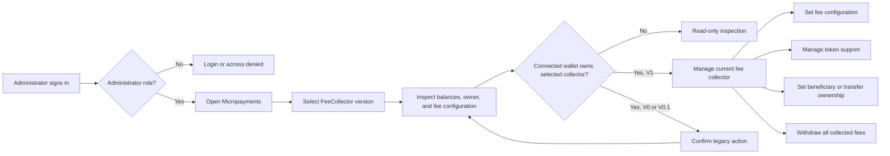

# Backoffice Micropayments — User Stories

**Scope:** Administrator access to the versioned global FeeCollector deployments at `/micropayments`, including read-only inspection and
owner-controlled fee management

**Last reviewed:** Not yet reviewed

These acceptance criteria follow the
[feature documentation review contract](../../../platform/feature-specification-guide.md#human-review-contract).

## Product Model

- Micropayments is a platform-wide administrator capability. It manages the global FeeCollector deployments; it is not scoped to one
  company.
- An authenticated `ROLE_ADMIN` or `ROLE_SUPER_ADMIN` user can enter the dashboard route. FeeCollector writes require the connected wallet
  to be the owner of the selected deployment; dashboard administrator access alone does not grant on-chain control.
- The version selector defaults to the registry's current deployment and can select the historical V0 and V0.1 deployments. Each panel binds
  its reads and writes to that version's ABI and deployment rather than adapting one ABI at runtime.
- The current V1 panel shows an approximate USD total of the recognized holdings, the owner, the fee beneficiary, token holdings, and fee
  configurations. The displayed beneficiary is the owner when the stored beneficiary is unset.
- V1 withdrawals sweep the native balance and every supported ERC-20 balance to the configured beneficiary, or to the owner when no
  beneficiary is configured. A withdrawal has no per-token or partial-amount control.
- A company Bank transfer with a positive `BANK` fee is a FeeCollector funding source. The company payment journey owns the detailed
  transfer and fee-applicability rules.
- V0 and V0.1 are historical deployments. Their panels warn about that status and expose the functionality available in their historical
  ABI, including separate native and token withdrawals; they do not expose V1 beneficiary management.

## Lifecycle

## Status Overview

| User Story           | Title                                        | Actor                  | Status         |
| -------------------- | -------------------------------------------- | ---------------------- | -------------- |
| US-MICROPAYMENTS-001 | Inspect FeeCollector deployments             | Platform administrator | 🧪 Validation  |
| US-MICROPAYMENTS-002 | Configure current FeeCollector fees          | FeeCollector owner     | 🧪 Validation  |
| US-MICROPAYMENTS-003 | Manage current FeeCollector token support    | FeeCollector owner     | 🚧 In Progress |
| US-MICROPAYMENTS-004 | Set the current FeeCollector fee beneficiary | FeeCollector owner     | 🧪 Validation  |
| US-MICROPAYMENTS-005 | Transfer current FeeCollector ownership      | FeeCollector owner     | 🧪 Validation  |
| US-MICROPAYMENTS-006 | Withdraw current FeeCollector funds          | FeeCollector owner     | 🧪 Validation  |
| US-MICROPAYMENTS-007 | Manage a legacy FeeCollector deployment      | FeeCollector owner     | 🧪 Validation  |

## US-MICROPAYMENTS-001: Inspect FeeCollector Deployments

**As a** platform administrator\
**I want to** select and inspect each available FeeCollector deployment\
**So that** I can understand its balances, ownership, and fee configuration before taking an operational action

### Acceptance Criteria

#### Happy Path

- [x] `AC-US-MICROPAYMENTS-001-01` An authenticated administrator or super administrator can open Micropayments and select V1, V0, or V0.1.
- [x] `AC-US-MICROPAYMENTS-001-02` The current deployment is identified in the selector and is selected by default.
- [x] `AC-US-MICROPAYMENTS-001-03` The V1 panel shows recognized holding balances, an approximate USD total, the owner, the effective fee
      beneficiary, and fee configurations.
- [x] `AC-US-MICROPAYMENTS-001-04` The V0 and V0.1 panels show their native balance, owner, fee configurations, and an explicit
      historical-deployment warning.

#### Business Rules

- [x] `AC-US-MICROPAYMENTS-001-05` Dashboard administrator access is enforced before the route is entered; every selected version binds to
      its own static ABI and deployment.
- [x] `AC-US-MICROPAYMENTS-001-06` A dashboard administrator who is not the selected FeeCollector owner can inspect its state but cannot see
      management controls.
- [x] `AC-US-MICROPAYMENTS-001-07` An unset V1 beneficiary is displayed as an owner fallback because the contract sends withdrawals to the
      owner in that state.
- [x] `AC-US-MICROPAYMENTS-001-08` A native company Bank transfer with a positive `BANK` rate pays the calculated fee to the global
      FeeCollector and emits `FeePaid`. _(contract)_
- [x] `AC-US-MICROPAYMENTS-001-09` An ERC-20 company Bank transfer pays a positive `BANK` fee to the global FeeCollector only when that
      token is FeeCollector-supported; otherwise it delivers the full amount to the recipient. _(contract)_

#### Edge & Error Cases

- [x] `AC-US-MICROPAYMENTS-001-10` Loading state is shown while the displayed balances, owner, beneficiary, or configurations are being
      read.
- [x] `AC-US-MICROPAYMENTS-001-11` Failed balance, owner, beneficiary, or configuration reads are reported as failures instead of successful
      empty values.
- [x] `AC-US-MICROPAYMENTS-001-12` A FeeCollector with no fee configurations shows an explicit empty state.

**Dependencies:** Dashboard authentication, administrator roles, and the selected FeeCollector deployment

## US-MICROPAYMENTS-002: Configure Current FeeCollector Fees

**As the** current FeeCollector owner\
**I want to** add or update its fee configuration by contract type\
**So that** supported fee-paying contracts apply the intended fee policy

### Acceptance Criteria

#### Happy Path

- [x] `AC-US-MICROPAYMENTS-002-01` The owner can add a fee configuration for an available contract type and edit an existing configuration.
- [x] `AC-US-MICROPAYMENTS-002-02` The panel lists each configured contract type with its fee in basis points and percentage.
- [x] `AC-US-MICROPAYMENTS-002-03` A successful write refreshes the FeeCollector reads used by the panel.

#### Business Rules

- [x] `AC-US-MICROPAYMENTS-002-04` Only the on-chain FeeCollector owner can set a fee. _(contract)_
- [x] `AC-US-MICROPAYMENTS-002-05` The current panel accepts fees from 0% through 100% in 0.01% increments and submits their basis-point
      equivalent.
- [x] `AC-US-MICROPAYMENTS-002-06` The add form excludes contract types already configured; the contract updates an existing entry rather
      than creating a duplicate.

#### Edge & Error Cases

- [x] `AC-US-MICROPAYMENTS-002-07` An empty contract type, a fee outside 0–100%, or a value requiring more than two decimal places is
      rejected before a write is requested.
- [x] `AC-US-MICROPAYMENTS-002-08` Cancelling the form leaves the current configuration unchanged.
- [x] `AC-US-MICROPAYMENTS-002-09` A rejected fee transaction is reported in the form rather than treated as a successful update.

**Dependencies:** US-MICROPAYMENTS-001 and ownership of V1

## US-MICROPAYMENTS-003: Manage Current FeeCollector Token Support

**As the** current FeeCollector owner\
**I want to** manage the ERC-20 tokens supported by the FeeCollector\
**So that** fee-paying contracts can use supported tokens and withdrawals sweep the intended assets

### Acceptance Criteria

#### Happy Path

- [x] `AC-US-MICROPAYMENTS-003-01` The owner can add a valid, non-zero ERC-20 address that is not already supported.
- [x] `AC-US-MICROPAYMENTS-003-02` The owner can remove a recognized non-native token shown in the V1 holdings table.
- [ ] `AC-US-MICROPAYMENTS-003-03` The owner can inspect and remove every non-native ERC-20 returned by the selected FeeCollector's
      supported-token list.

#### Business Rules

- [x] `AC-US-MICROPAYMENTS-003-04` Only the on-chain FeeCollector owner can add or remove token support. _(contract)_
- [x] `AC-US-MICROPAYMENTS-003-05` The contract rejects zero-address, duplicate, and missing token-support changes. _(contract)_
- [x] `AC-US-MICROPAYMENTS-003-06` Native currency is always received by the FeeCollector and cannot be removed as a supported ERC-20 token.

#### Edge & Error Cases

- [x] `AC-US-MICROPAYMENTS-003-07` The add form rejects an invalid, zero, or already-supported address before a write is requested.
- [x] `AC-US-MICROPAYMENTS-003-08` Removing a token with a non-zero displayed balance warns that the balance will no longer be swept;
      cancellation leaves support unchanged.
- [x] `AC-US-MICROPAYMENTS-003-09` Failed support-change transactions are surfaced in the corresponding modal.

**Dependencies:** US-MICROPAYMENTS-001 and ownership of V1

## US-MICROPAYMENTS-004: Set the Current FeeCollector Fee Beneficiary

**As the** current FeeCollector owner\
**I want to** set the address that receives swept fees\
**So that** collected funds reach the intended recipient

### Acceptance Criteria

#### Happy Path

- [x] `AC-US-MICROPAYMENTS-004-01` The owner can set a valid beneficiary address for V1.
- [x] `AC-US-MICROPAYMENTS-004-02` The owner can clear the beneficiary, causing the next withdrawal to fall back to the FeeCollector owner.
- [x] `AC-US-MICROPAYMENTS-004-03` The panel refreshes and displays the effective beneficiary after a successful write.

#### Business Rules

- [x] `AC-US-MICROPAYMENTS-004-04` Only the on-chain FeeCollector owner can change the beneficiary. _(contract)_
- [x] `AC-US-MICROPAYMENTS-004-05` The zero address means no configured beneficiary; it does not receive swept fees because the contract
      falls back to the owner. _(contract)_

#### Edge & Error Cases

- [x] `AC-US-MICROPAYMENTS-004-06` An invalid address is rejected before a write is requested.
- [x] `AC-US-MICROPAYMENTS-004-07` Cancelling the modal leaves the configured beneficiary unchanged.
- [x] `AC-US-MICROPAYMENTS-004-08` A rejected beneficiary transaction is reported in the modal.

**Dependencies:** US-MICROPAYMENTS-001 and ownership of V1

## US-MICROPAYMENTS-005: Transfer Current FeeCollector Ownership

**As the** current FeeCollector owner\
**I want to** transfer on-chain ownership to another address\
**So that** fee configuration and withdrawal control can be handed over deliberately

### Acceptance Criteria

#### Happy Path

- [x] `AC-US-MICROPAYMENTS-005-01` The owner can transfer V1 ownership to a different valid address after an explicit irreversible-action
      confirmation.
- [x] `AC-US-MICROPAYMENTS-005-02` After a successful transfer, the former owner no longer qualifies for owner-only FeeCollector writes and
      the new owner does. _(contract)_

#### Business Rules

- [x] `AC-US-MICROPAYMENTS-005-03` Only the on-chain FeeCollector owner can transfer ownership. _(contract)_
- [x] `AC-US-MICROPAYMENTS-005-04` The destination cannot be the zero address or the current owner.

#### Edge & Error Cases

- [x] `AC-US-MICROPAYMENTS-005-05` The transfer cannot be submitted until the owner confirms the irreversible action.
- [x] `AC-US-MICROPAYMENTS-005-06` Cancelling the modal does not request a transfer.
- [x] `AC-US-MICROPAYMENTS-005-07` A rejected ownership-transfer transaction is reported in the modal.

**Dependencies:** US-MICROPAYMENTS-001 and ownership of V1

## US-MICROPAYMENTS-006: Withdraw Current FeeCollector Funds

**As the** current FeeCollector owner\
**I want to** sweep collected current-version funds\
**So that** the configured beneficiary receives every available supported balance

### Acceptance Criteria

#### Happy Path

- [x] `AC-US-MICROPAYMENTS-006-01` The owner can review the non-zero recognized balances included in a V1 sweep before confirming it.
- [x] `AC-US-MICROPAYMENTS-006-02` One successful V1 withdrawal sends the full native balance and every non-zero balance of every supported
      ERC-20 to the effective beneficiary. _(contract)_
- [x] `AC-US-MICROPAYMENTS-006-03` Successful withdrawals refresh the FeeCollector reads and show a success message.

#### Business Rules

- [x] `AC-US-MICROPAYMENTS-006-04` Only the on-chain FeeCollector owner can withdraw. _(contract)_
- [x] `AC-US-MICROPAYMENTS-006-05` V1 does not provide a partial-amount or per-token withdrawal control; it sweeps all non-zero supported
      balances in one transaction. _(contract)_
- [x] `AC-US-MICROPAYMENTS-006-06` A zero native balance and zero balances for all supported tokens make the contract withdrawal a no-op;
      the UI disables confirmation when no recognized balance is available. _(contract)_

#### Edge & Error Cases

- [x] `AC-US-MICROPAYMENTS-006-07` The confirmation lists an explicit empty state when there is no recognized balance to withdraw.
- [x] `AC-US-MICROPAYMENTS-006-08` Cancelling the confirmation does not submit a withdrawal.
- [x] `AC-US-MICROPAYMENTS-006-09` A failed withdrawal transaction is surfaced in the confirmation modal.

**Dependencies:** US-MICROPAYMENTS-001 and ownership of V1

## US-MICROPAYMENTS-007: Manage a Legacy FeeCollector Deployment

**As the** owner of a historical FeeCollector deployment\
**I want to** perform the actions supported by that deployment's ABI\
**So that** I can safely operate historical funds and configuration without applying V1 assumptions

### Acceptance Criteria

#### Happy Path

- [x] `AC-US-MICROPAYMENTS-007-01` The owner can select V0 or V0.1 and access its native withdrawal, token withdrawal, fee, token-support,
      and ownership-transfer actions.
- [x] `AC-US-MICROPAYMENTS-007-02` The legacy native-withdrawal confirmation describes a full withdrawal to the current owner.
- [x] `AC-US-MICROPAYMENTS-007-03` Every legacy action is bound to the selected historical deployment rather than the V1 contract.

#### Business Rules

- [x] `AC-US-MICROPAYMENTS-007-04` Legacy management controls are hidden from a connected wallet that does not own the selected historical
      deployment.
- [x] `AC-US-MICROPAYMENTS-007-05` Each legacy action carries a warning that it acts directly on a historical deployment and is
      irreversible.
- [x] `AC-US-MICROPAYMENTS-007-06` Legacy fee input is expressed in basis points; the historical contract is the final validity boundary for
      that value.

#### Edge & Error Cases

- [x] `AC-US-MICROPAYMENTS-007-07` Invalid addresses and an empty legacy fee type cannot be submitted from the legacy action modal.
- [x] `AC-US-MICROPAYMENTS-007-08` Cancelling an open legacy action leaves the historical deployment unchanged.
- [x] `AC-US-MICROPAYMENTS-007-09` A rejected legacy transaction is shown in the action modal.

**Dependencies:** US-MICROPAYMENTS-001, ownership of V0 or V0.1, and the selected historical deployment

## Known Gaps

- The V1 panel only renders the native token and ERC-20s known to its local token registry. It detects supported ERC-20 addresses outside
  that registry but does not show them in the holdings table, so an owner cannot inspect or remove every supported token from the dashboard
  (`US-MICROPAYMENTS-003`).
- The dashboard has no dedicated automated test for the Micropayments version selector or its management modals. Contract coverage verifies
  the current FeeCollector's on-chain behaviour, but the administrator and wallet journeys still require human validation.

## Implementation Evidence

- [Dashboard navigation](../../../../dashboard/app/layouts/default.vue),
  [administrator route guard](../../../../dashboard/app/middleware/auth.global.ts), and
  [Micropayments page and version selector](../../../../dashboard/app/pages/micropayments.vue)
- [Versioned FeeCollector registry](../../../../dashboard/app/artifacts/feeCollectorRegistry.ts) and
  [version selection state](../../../../dashboard/app/composables/FeeCollector/useFeeCollectorVersion.ts)
- [V1 management panel](../../../../dashboard/app/components/sections/FeeCollectorView/FeeCollectorPanelV1.vue),
  [current holdings and withdrawal](../../../../dashboard/app/components/sections/FeeCollectorView/TokenHoldingsTable.vue),
  [owner and beneficiary controls](../../../../dashboard/app/components/sections/FeeCollectorView/FeeCollectorStats.vue),
  [fee configuration form](../../../../dashboard/app/components/sections/FeeCollectorView/FeeConfigFormModal.vue), and
  [fee configuration list](../../../../dashboard/app/components/sections/FeeCollectorView/FeeConfigList.vue)
- [Legacy V0 panel](../../../../dashboard/app/components/sections/FeeCollectorView/legacy/FeeCollectorPanelV0.vue),
  [legacy V0.1 panel](../../../../dashboard/app/components/sections/FeeCollectorView/legacy/FeeCollectorPanelV01.vue), and
  [legacy actions](../../../../dashboard/app/components/sections/FeeCollectorView/legacy/FeeCollectorLegacyActions.vue)
- [FeeCollector contract](../../../../contract/contracts/FeeCollector.sol),
  [token-support guards](../../../../contract/contracts/base/TokenSupport.sol), and
  [FeeCollector contract tests](../../../../contract/test/FeeCollector.spec.ts)

## Related Documentation

- [Backoffice Feature Inventory](../README.md)
- [Product Feature Inventory](../../README.md)
- [FeeCollector contract documentation](../../../contracts/features/fee-collector/README.md)
- [Bank transfer journey](../../accounts/README.md#us-bank-002-transfer-bank-funds)

_[← Back to feature inventory](../../README.md)_
