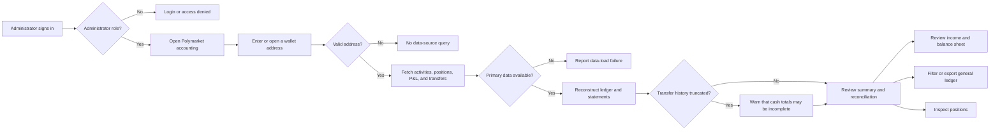

# Backoffice Polymarket Accounting — User Stories

**Scope:** Administrator reconstruction and inspection of a public Polymarket wallet's financial summary, statements, ledger, and positions
at `/accounting`

**Last reviewed:** Not yet reviewed

These acceptance criteria follow the
[feature documentation review contract](../../../platform/feature-specification-guide.md#human-review-contract).

## Product Model

- Polymarket accounting is a read-only, platform-wide administrator capability. It analyzes a supplied public wallet address; it does not
  create transactions, move assets, or establish ownership of that wallet.
- An authenticated `ROLE_ADMIN` or `ROLE_SUPER_ADMIN` user can enter the dashboard route. A valid address can be analyzed even when it is
  not associated with a CNC Portal user or company.
- The address is shareable in the route query and retained as a browser default. A route address takes precedence, so separate browser tabs
  can analyze different wallets.
- The dashboard reconstructs accounting information from Polymarket activity and position feeds, a best-effort profile P&L feed, and a
  server-side on-chain USD-token transfer feed. It treats matching activity and transfer hashes as one settlement rather than two cash
  movements.
- Summary and balance-sheet historical snapshots carry open contracts at cost because no historical market-price feed is available. Live
  market value, unrealized P&L, and profile P&L apply only to the current snapshot.
- The results are a reconstructed operational view. Data-source availability, history limits, and reconciliation differences can affect the
  reported figures and are surfaced where the current journey supports them.

## Lifecycle

## Status Overview

| User Story             | Title                                      | Actor                  | Status         |
| ---------------------- | ------------------------------------------ | ---------------------- | -------------- |
| US-POLY-ACCOUNTING-001 | Access and select a public wallet          | Platform administrator | 🚧 In Progress |
| US-POLY-ACCOUNTING-002 | Reconstruct and reconcile a wallet summary | Platform administrator | 🚧 In Progress |
| US-POLY-ACCOUNTING-003 | Review reconstructed financial statements  | Platform administrator | 🧪 Validation  |
| US-POLY-ACCOUNTING-004 | Investigate and export the activity ledger | Platform administrator | 🧪 Validation  |
| US-POLY-ACCOUNTING-005 | Inspect Polymarket positions               | Platform administrator | 🧪 Validation  |

## US-POLY-ACCOUNTING-001: Access and Select a Public Wallet

**As a** platform administrator\
**I want to** open the Polymarket accounting capability and select a public wallet\
**So that** I can begin an operational analysis of that wallet's activity

### Acceptance Criteria

#### Happy Path

- [x] An authenticated administrator or super administrator can open Polymarket accounting.
- [x] An administrator can enter a valid wallet address and load its accounting analysis.
- [x] A valid wallet address is represented in the route query, enabling a separate browser tab to analyze a different address.

#### Business Rules

- [x] Dashboard authentication and administrator-role authorization are enforced before the journey is entered.
- [x] The journey reads any valid public wallet address; it does not require the address to be owned by, or linked to, the administrator, a
      portal user, or a company.
- [x] An empty or invalid address does not start upstream accounting queries.

#### Edge & Error Cases

- [x] An administrator who has not supplied an address is prompted to enter one before the statement views have data to show.
- [ ] An invalid non-empty address produces a clear validation outcome instead of rendering empty reconstructed figures.
- [x] A valid address can be opened on its Polymarket profile for a direct source comparison.

**Dependencies:** Dashboard authentication and administrator roles

## US-POLY-ACCOUNTING-002: Reconstruct and Reconcile a Wallet Summary

**As a** platform administrator\
**I want to** review a reconstructed wallet summary and its accounting checks\
**So that** I can understand capital, returns, and data-quality exceptions before investigating details

### Acceptance Criteria

#### Happy Path

- [x] The analysis combines wallet activity, positions, and on-chain USD-token transfers into deposits, withdrawals, cash, returns, rewards,
      fees, and position values.
- [x] The summary exposes accounting identities for cash, capital, balance sheet, cost basis, P&L, lot tracking, trial balance, and
      statement consistency.
- [x] The all-time profile P&L is used when available and the reconstructed summary remains available when that best-effort feed fails.
- [x] An administrator can refresh all source feeds for the selected wallet.

#### Business Rules

- [x] Transfers sharing a transaction hash with a Polymarket activity are reconciled as a single settlement instead of being counted as an
      external deposit or withdrawal.
- [x] A difference between the on-chain settlement and activity cash flow is represented as a reconciliation adjustment rather than being
      silently discarded.
- [x] When the transfer-history source reaches its safety limit, the journey warns that deposit and withdrawal totals may be incomplete.

#### Edge & Error Cases

- [x] A failure of activity, position, or transfer data is reported as an accounting data-load failure.
- [ ] The journey reports when the activity or position history reaches its 10,000-row client fetch limit instead of presenting the partial
      history as complete.
- [ ] When a summary is viewed as of a past date, its accounting-identity checks use the same historical snapshot rather than current
      all-time aggregates.

**Dependencies:** US-POLY-ACCOUNTING-001 and availability of the external activity, position, profile, and transfer sources

## US-POLY-ACCOUNTING-003: Review Reconstructed Financial Statements

**As a** platform administrator\
**I want to** review the reconstructed income statement and balance sheet for a reporting date or period\
**So that** I can assess realized performance, open exposure, and the accounting position

### Acceptance Criteria

#### Happy Path

- [x] An administrator can review realized wins, losses, rewards, net income, and comprehensive income for a selected reporting period.
- [x] The income statement derives realized results by replaying activity with weighted-average-cost lot accounting, including resolved
      worthless positions that have no redemption transaction.
- [x] An administrator can review a balance sheet with cash, open contracts at cost, owner capital, retained earnings, and the balance
      identity.
- [x] An administrator can select a historical reporting date for the summary and balance sheet.

#### Business Rules

- [x] Historical snapshots carry open contracts at cost; current market value, unrealized P&L, and the profile P&L are unavailable for a
      historical date.
- [x] The balance sheet records no liabilities for the reconstructed Polymarket wallet and checks that assets equal liabilities plus equity.
- [x] The income statement distinguishes realized income from unrealized changes on open positions.

#### Edge & Error Cases

- [x] A period without matching activity reports zero realized results and no trade rows.
- [x] When Polymarket-reported realized P&L differs from the reconstructed lot result, the statement exposes the reconciliation difference.
- [x] Missing live position pricing does not cause a historical snapshot to use today's price retroactively.

**Dependencies:** US-POLY-ACCOUNTING-002

## US-POLY-ACCOUNTING-004: Investigate and Export the Activity Ledger

**As a** platform administrator\
**I want to** investigate and export the reconstructed general ledger\
**So that** I can trace the wallet's accounting entries and share a filtered audit record

### Acceptance Criteria

#### Happy Path

- [x] The ledger exposes dated activity and corresponding debit and credit lines for deposits, withdrawals, trades, settlements, rewards,
      and other reconstructed categories.
- [x] An administrator can constrain the ledger by reporting period, categories, text search, and page size, then navigate the resulting
      pages.
- [x] An administrator can choose visible ledger columns without changing the underlying accounting entries.
- [x] An administrator can export the currently filtered ledger rows as CSV.
- [x] The trial balance reports total debits, total credits, and whether they balance for the selected period.

#### Business Rules

- [x] A search match on any journal line retains the complete activity bundle for that entry, rather than presenting an isolated line
      without its corresponding posting.
- [x] Ledger pagination is tied to the current route so the selected page and page size can be shared and reloaded.
- [x] An on-chain transfer and Polymarket activity remain distinguishable sources in the ledger.

#### Edge & Error Cases

- [x] A filter combination with no matching entries produces an empty result rather than stale prior entries.
- [x] Clearing all categories produces no ledger rows until a category is selected again.
- [x] A missing market link or transaction hash does not prevent the corresponding ledger entry from being reviewed or exported.

**Dependencies:** US-POLY-ACCOUNTING-002

## US-POLY-ACCOUNTING-005: Inspect Polymarket Positions

**As a** platform administrator\
**I want to** inspect the selected wallet's Polymarket positions\
**So that** I can relate open and closed exposure to the reconstructed accounting results

### Acceptance Criteria

#### Happy Path

- [x] An administrator can inspect every loaded position's market, outcome, shares, average and current price, cost basis, current value,
      unrealized P&L, and realized P&L.
- [x] The position feed includes zero-size closed positions as well as current exposure for accounting purposes.
- [x] An administrator can search positions, paginate the matching result, and open a linked market when a market reference is available.

#### Business Rules

- [x] Position values and P&L are supplied by the current Polymarket position feed, not inferred from the dashboard's presentation state.
- [x] Changing a position search resets its pagination to the first matching page.

#### Edge & Error Cases

- [x] A wallet with no loaded positions reports an empty position result.
- [x] A position without a market reference remains reviewable without an external link.
- [x] A failed position source is reported by the accounting journey rather than presented as a successful empty portfolio.

**Dependencies:** US-POLY-ACCOUNTING-002

## Known Gaps

- An invalid non-empty wallet address starts no query but lacks an explicit validation error; statement components can instead render empty
  reconstructed values (`US-POLY-ACCOUNTING-001`).
- Activity and position fetches stop after 20 pages of 500 rows. The journey does not flag that a history beyond 10,000 rows is incomplete
  (`US-POLY-ACCOUNTING-002`).
- The Summary's historical date selector does not scope the adjacent Accounting Identities card, which continues to use current all-time
  aggregates (`US-POLY-ACCOUNTING-002`).
- The dashboard has no dedicated automated tests for the Polymarket accounting route, source-query orchestration, or statement and ledger
  interactions. Human validation against representative wallets remains required.

## Implementation Evidence

- [Dashboard navigation](../../../../dashboard/app/layouts/default.vue),
  [administrator route guard](../../../../dashboard/app/middleware/auth.global.ts), and
  [Polymarket accounting page](../../../../dashboard/app/pages/accounting.vue)
- [Wallet-address state](../../../../dashboard/app/composables/useWalletAddress.ts),
  [accounting orchestration](../../../../dashboard/app/composables/useAccounting.ts), and
  [source queries](../../../../dashboard/app/queries/polymarket.queries.ts)
- [Polymarket activity, positions, and P&L client](../../../../dashboard/app/api/polymarket.ts),
  [server-side transfer route](../../../../dashboard/server/api/polygonscan/transfers.get.ts), and
  [transfer-history pagination](../../../../dashboard/server/utils/etherscan.ts)
- [Ledger reconstruction](../../../../dashboard/app/utils/accounting.ts),
  [lot accounting](../../../../dashboard/app/utils/incomeStatement.ts),
  [balance-sheet reconstruction](../../../../dashboard/app/utils/balanceSheet.ts), and
  [general-ledger reconstruction](../../../../dashboard/app/utils/generalLedger.ts)
- [Summary](../../../../dashboard/app/components/accounting/AccountingSummary.vue),
  [income statement](../../../../dashboard/app/components/accounting/AccountingIncomeStatement.vue),
  [balance sheet](../../../../dashboard/app/components/accounting/AccountingBalanceSheet.vue),
  [activity ledger](../../../../dashboard/app/components/accounting/AccountingLedger.vue), and
  [positions](../../../../dashboard/app/components/accounting/AccountingPositions.vue)

## Related Documentation

- [Backoffice Feature Inventory](../README.md)
- [Product Feature Inventory](../../README.md)
- [Accounting](../../accounting/README.md)

_[← Back to feature inventory](../../README.md)_
