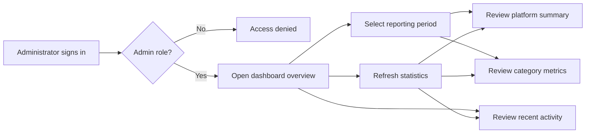

# Backoffice Statistics — User Stories

**Scope:** The platform Statistics journey exposed on the administrator dashboard overview

**Last reviewed:** Not yet reviewed

These acceptance criteria follow the
[feature documentation review contract](../../../platform/feature-specification-guide.md#human-review-contract).

## Product Model

- Statistics is a platform-wide administrator capability exposed on the dashboard overview.
- `ROLE_ADMIN` and `ROLE_SUPER_ADMIN` users can access the dashboard and statistics API; other users are denied.
- Period-based metrics use the last 7, 30, or 90 days, or all recorded time. Project TVL is a current on-chain value and is independent of
  the selected database period.
- The overview combines companies, users, claims, wages, expenses, contracts, Board actions, notifications, and recent activity.
- A dashboard section is not considered complete merely because its API returns more fields than the administrator can inspect.
- The unlinked `/stats` route duplicates the overview implementation and is not treated as a separate product feature.

## Lifecycle

## Status Overview

| User Story   | Title                                   | Actor         | Status         |
| ------------ | --------------------------------------- | ------------- | -------------- |
| US-STATS-001 | Access administrator statistics         | Administrator | 🧪 Validation  |
| US-STATS-002 | Review the platform overview and trends | Administrator | 🚧 In Progress |
| US-STATS-003 | Explore category statistics             | Administrator | 🚧 In Progress |
| US-STATS-004 | Review recent platform activity         | Administrator | 🚧 In Progress |

## US-STATS-001: Access Administrator Statistics

**As an** administrator\
**I want to** access protected platform statistics\
**So that** sensitive operational metrics are available only to authorized roles

### Acceptance Criteria

#### Happy Path

- [x] `AC-US-STATS-001-01` An authenticated administrator can access the dashboard overview and its statistics.
- [x] `AC-US-STATS-001-02` An authenticated super administrator can access the same statistics.
- [x] `AC-US-STATS-001-03` Authorized statistics requests return the requested aggregate data.

#### Business Rules

- [x] `AC-US-STATS-001-04` Every statistics API endpoint requires an authenticated user. _(API)_
- [x] `AC-US-STATS-001-05` Every statistics API endpoint requires `ROLE_ADMIN` or `ROLE_SUPER_ADMIN`. _(API)_
- [x] `AC-US-STATS-001-06` Client-side route protection and API authorization independently enforce administrator access.

#### Edge & Error Cases

- [x] `AC-US-STATS-001-07` A user without an authenticated session is redirected to sign in.
- [x] `AC-US-STATS-001-08` An authenticated non-administrator is denied access to the dashboard.
- [x] `AC-US-STATS-001-09` An authenticated non-administrator receives a forbidden response from the statistics API.
- [x] `AC-US-STATS-001-10` An expired statistics session is cleared before further protected data is requested.

**Dependencies:** Dashboard authentication and administrator roles

## US-STATS-002: Review the Platform Overview and Trends

**As an** administrator\
**I want to** review platform totals and trends for a reporting period\
**So that** I can monitor adoption and operational activity

### Acceptance Criteria

#### Happy Path

- [x] `AC-US-STATS-002-01` The overview reports company, member, claim, contract, expense, action, notification, and worked-time metrics.
- [x] `AC-US-STATS-002-02` The overview reports growth for companies, members, and claims over a selected finite period.
- [x] `AC-US-STATS-002-03` The overview reports the current project-wide TVL from supported company accounts.
- [x] `AC-US-STATS-002-04` An administrator can use 7-day, 30-day, 90-day, and all-time reporting periods.
- [x] `AC-US-STATS-002-05` Refreshing the overview requests fresh values for every statistics section.

#### Business Rules

- [x] `AC-US-STATS-002-06` Finite-period totals include records whose creation date falls within the selected period.
- [x] `AC-US-STATS-002-07` Finite-period growth compares the selected period with the immediately preceding period of equal length.
- [x] `AC-US-STATS-002-08` Percentage metrics return zero rather than dividing by zero when the comparison population is empty.
- [x] `AC-US-STATS-002-09` Project TVL reflects current supported on-chain balances and does not change its scope with the database
      reporting period.
- [ ] `AC-US-STATS-002-10` Active-company totals include companies with qualifying activity in the period regardless of when the company was
      created.
- [ ] `AC-US-STATS-002-11` The all-time overview does not present a finite-period growth comparison as an all-time trend.

#### Edge & Error Cases

- [x] `AC-US-STATS-002-12` A reporting period without matching records returns zero totals and empty distributions.
- [x] `AC-US-STATS-002-13` An invalid reporting period is rejected without running an aggregate query. _(API)_
- [x] `AC-US-STATS-002-14` A failed statistics request is reported without fabricating overview values.

**Dependencies:** US-STATS-001 and available database and chain providers

## US-STATS-003: Explore Category Statistics

**As an** administrator\
**I want to** explore statistics by platform category\
**So that** I can identify the companies and behaviours behind the overview totals

### Acceptance Criteria

#### Happy Path

- [x] `AC-US-STATS-003-01` An administrator can inspect headline metrics for companies, users, claims, wages, expenses, contracts, and Board
      actions.
- [x] `AC-US-STATS-003-02` Changing the reporting period reloads every period-based category.
- [ ] `AC-US-STATS-003-03` Each category exposes the available distributions, averages, statuses, rankings, and company breakdowns returned
      for that category.
- [ ] `AC-US-STATS-003-04` An administrator can scope supported category statistics to one company.
- [ ] `AC-US-STATS-003-05` An administrator can access every page of a paginated category result.

#### Business Rules

- [x] `AC-US-STATS-003-06` Claims report worked time from claim minutes for the selected period.
- [x] `AC-US-STATS-003-07` Wage statistics aggregate the supported rate types recorded in current wage data.
- [x] `AC-US-STATS-003-08` Expense statistics group approvals by their persisted status.
- [x] `AC-US-STATS-003-09` Board-action execution rates use executed actions divided by total actions for the selected scope.
- [ ] `AC-US-STATS-003-10` Top-company ranking is calculated across the complete selected population before pagination.

#### Edge & Error Cases

- [x] `AC-US-STATS-003-11` Invalid page and limit values are rejected before category aggregation. _(API)_
- [x] `AC-US-STATS-003-12` An empty category returns zero totals and empty breakdowns.
- [ ] `AC-US-STATS-003-13` Every displayed category metric maps to a field returned by its current API response.
- [x] `AC-US-STATS-003-14` A failed category request is reported without replacing the failed result with fabricated data.

**Dependencies:** US-STATS-001 and US-STATS-002

## US-STATS-004: Review Recent Platform Activity

**As an** administrator\
**I want to** review recent activity across the platform\
**So that** I can understand what companies have done most recently

### Acceptance Criteria

#### Happy Path

- [x] `AC-US-STATS-004-01` Recent activity combines weekly claims, expenses, Board actions, and contract deployments.
- [x] `AC-US-STATS-004-02` Each activity identifies its type, description, company, status, and creation time.
- [x] `AC-US-STATS-004-03` Activities from different sources are ordered from newest to oldest before the result limit is applied.

#### Business Rules

- [x] `AC-US-STATS-004-04` The requested activity limit applies to the combined ordered feed.
- [x] `AC-US-STATS-004-05` An activity limit must be between 1 and 100. _(API)_
- [ ] `AC-US-STATS-004-06` The selected dashboard reporting period constrains recent activity consistently with the other sections.

#### Edge & Error Cases

- [x] `AC-US-STATS-004-07` A platform without matching activity returns an empty activity feed.
- [x] `AC-US-STATS-004-08` An invalid activity limit is rejected without querying activity sources. _(API)_
- [x] `AC-US-STATS-004-09` A failed activity request is reported without creating synthetic activity.

**Dependencies:** US-STATS-001

## Known Gaps

- Active-company totals exclude older companies even when they have qualifying activity in the selected period (`US-STATS-002`).
- All-time growth compares all recorded activity with a synthetic pre-epoch period and can report a misleading trend (`US-STATS-002`).
- Category sections expose only headline values while their API responses contain additional breakdowns (`US-STATS-003`).
- Wage, Expense, and Contract sections reference response fields that their APIs do not return (`US-STATS-003`).
- Company filtering and pagination are not available in the administrator journey (`US-STATS-003`).
- The top-companies endpoint paginates before sorting by membership and therefore does not guarantee a platform-wide ranking
  (`US-STATS-003`).
- The selected reporting period does not constrain recent activity (`US-STATS-004`).

## Implementation Evidence

- [Dashboard navigation](../../../../dashboard/app/layouts/default.vue),
  [administrator route guard](../../../../dashboard/app/middleware/auth.global.ts), and
  [dashboard overview](../../../../dashboard/app/pages/index.vue)
- [Statistics integration](../../../../dashboard/app/composables/useStats.ts),
  [statistics sections](../../../../dashboard/app/components/stats),
  [canonical dashboard formatter](../../../../dashboard/app/utils/format/), and
  [statistics types](../../../../dashboard/app/types/index.d.ts)
- [Statistics routes](../../../../backend/src/routes/statsRoute.ts),
  [administrator API guard](../../../../backend/src/config/serverConfig.ts), and
  [statistics controller](../../../../backend/src/controllers/statsController.ts)
- [Statistics validation](../../../../backend/src/validation/schemas/stats.ts) and
  [controller tests](../../../../backend/src/controllers/__tests__/statsController.test.ts)

## Related Documentation

- [Historical Functional Specification](./functional-specification.md)
- [Historical API Reference](./stats-api.md)
- [Historical Dashboard Integration Guide](./stats-dashboard-integration.md)
- [Backoffice Feature Inventory](../README.md)

_[← Back to feature inventory](../../README.md)_
