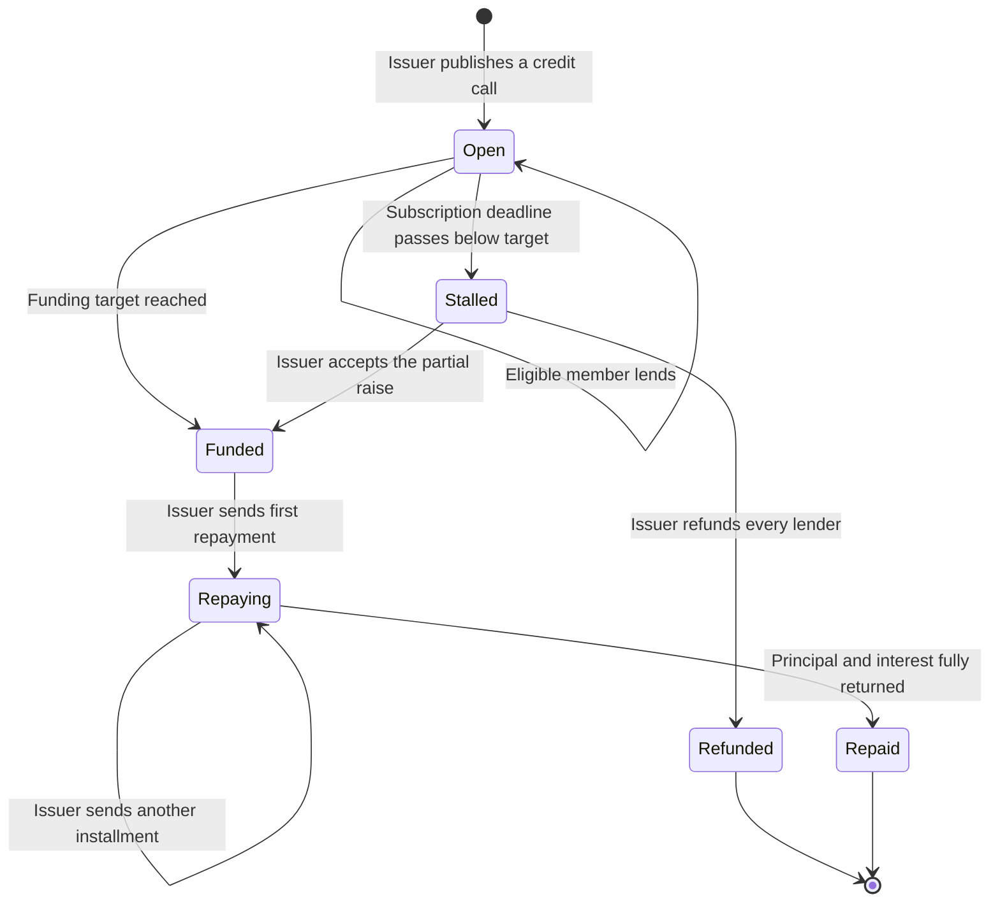

# Community Credit — User Stories

**Scope:** Team credit rounds from issuer creation through member lending, deadline resolution, refund, and repayment

**Last reviewed:** Not yet reviewed

These acceptance criteria follow the
[feature documentation review contract](../../platform/feature-specification-guide.md#human-review-contract).

## Product Model

Community Credit lets a team raise working capital from its members. The portal calls one on-chain `FixedReturn` lending offer a **round**
and the team's deployed `FixedReturn` instance its **Credit Account**. The current contract reports version `3.0.0`.

Each round defines an ERC-20 token, funding target, flat interest rate for the complete term, subscription deadline, maturity date, and
either general or restricted lender access. The **issuer** is the Credit Account owner. A **lender** is an eligible team member; the issuer
can also lend when the round's access rules allow it.

Deposits remain in the Credit Account while a round is raising. Reaching the target, or accepting a partial raise after the deadline, moves
the principal to the team Bank. Refunds and repayments are pushed to every lender by an issuer transaction; lenders do not claim them
individually. The round name and purpose are stored off-chain, while its financial terms and settlement state remain on-chain.

## Lifecycle

`Stalled` and `Repaid` are portal statuses derived from contract state, time, and repayment totals; the contract does not transition
automatically when a deadline or maturity date passes.

## Status Overview

| User Story | Title                      | Actor       | Status         | Priority | Effort |
| ---------- | -------------------------- | ----------- | -------------- | :------: | ------ |
| US-CC-001  | Inspect the Credit Account | Team member | 🚧 In Progress |    P1    | M      |
| US-CC-002  | Publish a credit call      | Team issuer | 🚧 In Progress |    P1    | L      |
| US-CC-003  | Lend to an open round      | Team member | 🚧 In Progress |    P1    | M      |
| US-CC-004  | Resolve a stalled round    | Team issuer | 🧪 Validation  |    P1    | M      |
| US-CC-005  | Repay lenders              | Team issuer | 🚧 In Progress |    P1    | L      |

## US-CC-001: Inspect the Credit Account

**As a** team member\
**I want to** inspect the team's credit rounds and their current state\
**So that** I can understand what is raising, awaiting action, or settled

### Acceptance Criteria

#### Happy Path

- [x] Each round exposes its purpose, token, target, amount raised, flat rate, access mode, dates, and current status.
- [ ] A lender can distinguish their own deposited and expected-return positions from the issuer's total debt figures.
- [x] An opened round exposes its lender breakdown, settlement progress, and matching on-chain activity.

#### Business Rules

- [ ] Rounds that still require an issuer action remain accessible separately from settled rounds.

#### Edge & Error Cases

- [x] A team without a deployed Credit Account receives the missing prerequisite instead of an empty round result.
- [x] The Credit Account journey distinguishes loading, read-failure, no-round, and populated outcomes.

**Priority:** P1 (Critical) · **Effort:** M · **Status:** 🚧 In Progress

## US-CC-002: Publish a Credit Call

**As a** team issuer\
**I want to** publish a credit round with its funding terms and lender access\
**So that** eligible members can provide working capital to the team

### Acceptance Criteria

#### Happy Path

- [x] The issuer can define a round name of at least three characters and an optional purpose.
- [x] The issuer can select an ERC-20 token supported by the team's Credit Account.
- [x] The issuer can define a positive funding target.
- [x] The issuer can define a flat interest rate from 0% to 100% for the complete term.
- [x] The issuer can define a future subscription deadline and a positive term of at most 30 years.
- [x] Successful publication creates one on-chain round, persists its metadata, and exposes the round through subsequent Credit Account
      reads.

#### Business Rules

- [x] A general-access round can apply an optional positive per-lender cap that does not exceed the funding target.
- [x] A restricted round requires at least one lender and rejects duplicate lender addresses.
- [x] Every capped restricted lender requires a positive allocation.
- [x] Fully capped restricted allocations must total at least the funding target.
- [x] The subscription deadline is validated again immediately before publication.
- [ ] Off-chain metadata is associated with the exact offer identifier emitted by the on-chain creation transaction.

#### Edge & Error Cases

- [x] Invalid round terms are rejected before an on-chain transaction is requested.
- [x] Rejecting or failing the on-chain creation leaves the Credit Account unchanged and returns a failure outcome.
- [ ] Once the on-chain round exists, a metadata failure can be retried without creating a second round.

**Priority:** P1 (Critical) · **Effort:** L · **Status:** 🚧 In Progress

## US-CC-003: Lend to an Open Round

**As a** team member\
**I want to** lend an allowed amount to an open credit round\
**So that** I can fund the team and receive the stated fixed return

### Acceptance Criteria

#### Happy Path

- [x] An eligible member can lend to a round while it is open and before its subscription deadline.
- [x] A successful lend increases both the round's funded amount and the lender's deposited position.
- [x] A successful lend refreshes the round and the lender's position before another lending decision.
- [ ] A successful lend refreshes the lender's token balance and the matching activity feed before another decision.

#### Business Rules

- [x] A restricted round accepts funds only from a member with a non-zero allocation.
- [x] The lender's available amount is the lower of the remaining funding target and their remaining cap or allocation.
- [x] A lending amount must be greater than 0.
- [x] A lending amount cannot exceed the lender's available amount.
- [x] Token approval is requested only when the current allowance is insufficient.

#### Edge & Error Cases

- [x] Rejecting approval, rejecting the lending transaction, or an on-chain failure leaves the round unchanged and returns a recoverable
      failure outcome.

**Priority:** P1 (Critical) · **Effort:** M · **Status:** 🚧 In Progress

## US-CC-004: Resolve a Stalled Round

**As a** team issuer\
**I want to** refund lenders or accept a partial raise after the deadline\
**So that** an underfunded round reaches an explicit financial outcome

### Acceptance Criteria

#### Happy Path

- [x] The issuer can refund a stalled round, returning every lender's principal in one transaction.
- [x] The issuer can accept a positive partial raise and continue the round using the actual funded amount.
- [x] Accepting a partial raise transfers the raised principal to the team Bank.
- [x] A successful resolution refreshes the round and lender data.

#### Business Rules

- [x] A round below target remains on-chain as open after its subscription deadline until the issuer resolves it.
- [x] Refund and partial acceptance are mutually exclusive final decisions for a stalled round.

#### Edge & Error Cases

- [x] A partial raise of 0 cannot be accepted.
- [x] A failed resolution leaves the round unchanged and returns a failure outcome.

**Priority:** P1 (Critical) · **Effort:** M · **Status:** 🧪 Validation

## US-CC-005: Repay Lenders

**As a** team issuer\
**I want to** repay principal and fixed interest from the team treasury\
**So that** every lender receives their proportional entitlement

### Acceptance Criteria

#### Happy Path

- [x] The issuer can repay a funded, partially repaid, or overdue round from the team Bank.
- [x] An installment distributes each lender's cumulative proportional entitlement without overpaying the round or leaving rounding dust.
- [x] A successful installment refreshes repayment progress and lender settlement data.
- [ ] A successful installment refreshes lender token balances, the Bank token balance, and the matching activity feed.
- [x] Repaying the complete obligation settles the round and prevents further repayment.

#### Business Rules

- [x] A repayment amount must be greater than 0.
- [x] A repayment amount cannot exceed the outstanding obligation.
- [x] A repayment amount cannot exceed the Bank's token balance.
- [x] The Bank rejects repayment from an account other than its current owner.
- [x] A paused Bank rejects repayment.
- [ ] The product journey offers repayment only to the current Bank owner while the Bank is not paused.

#### Edge & Error Cases

- [x] A round that is still raising cannot be repaid.
- [x] A settled round cannot be repaid again.
- [x] Rejecting or failing a repayment preserves the outstanding amount and returns a recoverable failure outcome.

**Priority:** P1 (Critical) · **Effort:** L · **Status:** 🚧 In Progress

## Known Gaps

The following gaps were rechecked against the current feature entry points on 2026-08-21. Their technical evidence and remediation
directions remain in the [detailed flow and implementation analysis](./user-flow-analysis.md#8-findings).

### Functional Gaps

- Publishing still infers the new offer ID from the total offer count and can repeat the on-chain write after a metadata failure.
- Rounds that require an issuer action are grouped with settled history.
- Lenders cannot review their personal deposited and expected-return positions separately from the team's debt.
- Lending and repayment refresh domain aggregates but not every affected token balance or activity feed.
- Repayment availability follows the Credit Account owner instead of the Bank owner and pause state enforced by the transaction.

### UI/UX Notes

- Repayment remains coupled to a global **Layout exploration** variant rather than a stable route, and that state leaks between rounds.

## Implementation Evidence

- [Community Credit routes](../../../app/src/router/index.ts)
- [Credit Account page](../../../app/src/views/team/[id]/CommunityCredit/IndexView.vue)
- [Credit-call wizard](../../../app/src/views/team/[id]/CommunityCredit/NewView.vue)
- [Round detail](../../../app/src/views/team/[id]/CommunityCredit/RoundView.vue)
- [Community Credit store](../../../app/src/stores/communityCredit.ts)
- [Lending modal](../../../app/src/components/sections/CommunityCreditView/CreditLendModal.vue)
- [Repayment panel](../../../app/src/components/sections/CommunityCreditView/CreditRepayPanel.vue)
- [FixedReturn contract](../../../contract/contracts/FixedReturn.sol)
- [Contract behaviour tests](../../../contract/test/FixedReturn.spec.ts)
- [Metadata controller tests](../../../backend/src/controllers/__tests__/fixedReturnOfferingController.test.ts)
- [Frontend feature tests](../../../app/src/views/team/[id]/CommunityCredit/__tests__/communityCreditViews.spec.ts)

## Related Documentation

- [Detailed flow and implementation analysis](./user-flow-analysis.md)
- [Community Credit accounting rules](../accounting/cnc-accounting-spec.md)
- [Product Feature Inventory](../README.md)
