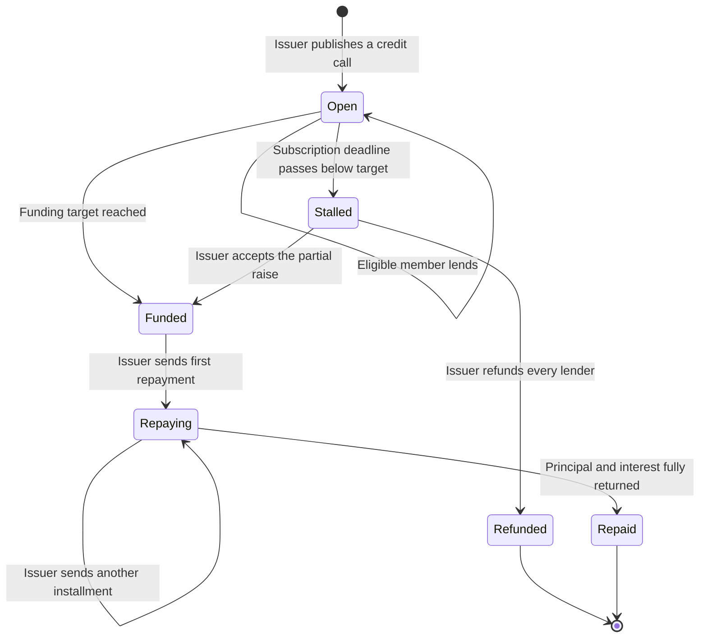

# Community Credit — User Stories

**Scope:** Team credit rounds from issuer creation through member lending, deadline resolution,
refund, and repayment

**Last reviewed:** Not yet reviewed

These acceptance criteria follow the
[feature documentation review contract](../../platform/feature-specification-guide.md#human-review-contract).

## Product Model

Community Credit lets a team raise working capital from its members. The portal calls one on-chain
`FixedReturn` lending offer a **round** and the team's deployed `FixedReturn` instance its **Credit
Account**. The current contract reports version `3.0.0`.

Each round defines an ERC-20 token, funding target, flat interest rate for the complete term,
subscription deadline, maturity date, and either general or restricted lender access. The **issuer**
is the Credit Account owner. A **lender** is an eligible team member; the issuer can also lend when
the round's access rules allow it.

Deposits remain in the Credit Account while a round is raising. Reaching the target, or accepting a
partial raise after the deadline, moves the principal to the team Bank. Refunds and repayments are
pushed to every lender by an issuer transaction; lenders do not claim them individually. The round
name and purpose are stored off-chain, while its financial terms and settlement state remain
on-chain.

## Lifecycle

`Stalled` and `Repaid` are portal statuses derived from contract state, time, and repayment totals;
the contract does not transition automatically when a deadline or maturity date passes.

## Status Overview

| User Story | Title                      | Actor       | Status         | Priority | Effort |
| ---------- | -------------------------- | ----------- | -------------- | :------: | ------ |
| US-CC-001  | Inspect the Credit Account | Team member | 🚧 In Progress |    P1    | M      |
| US-CC-002  | Publish a credit call      | Team issuer | 🚧 In Progress |    P1    | L      |
| US-CC-003  | Lend to an open round      | Team member | 🚧 In Progress |    P1    | M      |
| US-CC-004  | Resolve a stalled round    | Team issuer | 🧪 Validation  |    P1    | M      |
| US-CC-005  | Repay lenders              | Team issuer | 🚧 In Progress |    P1    | L      |

## US-CC-001: Inspect the Credit Account

**As a** team member\
**I want to** inspect the team's credit rounds and their current state\
**So that** I can understand what is raising, awaiting action, or settled

### Acceptance Criteria

- [x] A team without a deployed Credit Account sees the missing prerequisite rather than an empty
      round list.
- [x] Loading, read failure, no-round, and populated states are visibly distinct.
- [x] Each round exposes its purpose, token, target, amount raised, flat rate, access mode, dates,
      and current status.
- [ ] Raising, action-required, and settled rounds are grouped without describing pending issuer
      work as history.
- [ ] A lender can distinguish their own deposited and expected-return positions from the issuer's
      total debt figures.
- [x] Opening a round shows its lender breakdown, settlement progress, and matching on-chain
      activity.

**Priority:** P1 (Critical) · **Effort:** M · **Status:** 🚧 In Progress

## US-CC-002: Publish a Credit Call

**As a** team issuer\
**I want to** publish a credit round with its funding terms and lender access\
**So that** eligible members can provide working capital to the team

### Acceptance Criteria

- [ ] The issuer defines a name, purpose, supported ERC-20 token, positive target, flat rate, future
      subscription deadline, and term.
- [x] General access can apply an optional per-lender cap that does not exceed the target.
- [x] Restricted access rejects duplicate members, non-positive capped allocations, and a fully
      capped allocation total below the target.
- [x] Every wizard step keeps its visible validation errors and the deadline is checked again before
      publication.
- [x] Successful publication creates one on-chain round, persists its title and purpose, refreshes
      the list, and returns the issuer to the Credit Account.
- [ ] Once the on-chain round exists, a metadata failure cannot invite the issuer to publish a
      second round or associate metadata with a different round.
- [ ] Rejected or failed publication remains recoverable with a visible error.

**Priority:** P1 (Critical) · **Effort:** L · **Status:** 🚧 In Progress

## US-CC-003: Lend to an Open Round

**As a** team member\
**I want to** lend an allowed amount to an open credit round\
**So that** I can fund the team and receive the stated fixed return

### Acceptance Criteria

- [x] Lending is offered only while the round is open and before its subscription deadline.
- [x] A restricted round offers lending only to a member with a non-zero allocation.
- [x] The modal shows the lower of the round's remaining target and the lender's remaining cap or
      allocation.
- [x] The amount must be positive and cannot exceed that personal lending ceiling.
- [x] The portal requests token approval only when the current allowance is insufficient.
- [ ] A successful lend refreshes the round, lender position, token balances, and activity before
      another decision is made.
- [x] Rejected approval, rejected lending, or an on-chain failure leaves the round unchanged and
      displays a recoverable error.

**Priority:** P1 (Critical) · **Effort:** M · **Status:** 🚧 In Progress

## US-CC-004: Resolve a Stalled Round

**As a** team issuer\
**I want to** refund lenders or accept a partial raise after the deadline\
**So that** an underfunded round reaches an explicit financial outcome

### Acceptance Criteria

- [x] A round below target becomes visibly stalled after its subscription deadline without implying
      that an automatic transaction occurred.
- [x] The issuer can refund a stalled round, returning every lender's principal in one transaction.
- [x] The issuer can accept partial funding only when the stalled round raised a positive amount.
- [x] Accepting partial funding moves the raised principal to the team Bank and continues the round
      using the actual funded amount.
- [x] Refund and partial acceptance are mutually exclusive final decisions for the stalled state.
- [x] Success refreshes the round and lender data; failure leaves the previous state visible with an
      error.

**Priority:** P1 (Critical) · **Effort:** M · **Status:** 🧪 Validation

## US-CC-005: Repay Lenders

**As a** team issuer\
**I want to** repay principal and fixed interest from the team treasury\
**So that** every lender receives their proportional entitlement

### Acceptance Criteria

- [x] Repayment is available for funded, partially repaid, or overdue rounds, but not while a round
      is still raising or after settlement.
- [ ] The repayment entry point is a stable product action rather than a layout-exploration control
      whose state leaks between rounds.
- [ ] Authorization and availability match the Bank owner and pause state used by the repayment
      transaction.
- [x] The amount is positive and cannot exceed either the outstanding obligation or the Bank's token
      balance.
- [x] Installments distribute cumulative proportional entitlements without overpaying the round or
      leaving rounding dust behind.
- [ ] A successful installment refreshes repayment progress, lender balances, treasury balance, and
      activity; full settlement returns to the round detail.
- [x] A rejected or failed repayment preserves the outstanding amount and displays a recoverable
      error.

**Priority:** P1 (Critical) · **Effort:** L · **Status:** 🚧 In Progress

## Known Gaps

The following gaps were rechecked against the current feature entry points on 2026-08-21. Their
technical evidence and remediation directions remain in the
[detailed flow and implementation analysis](./user-flow-analysis.md#8-findings).

- Publishing still infers the new offer ID from the total offer count and can repeat the on-chain
  write after a metadata failure.
- The list puts funded, repaying, overdue, and stalled rounds under **History**, even when the
  issuer still has an action to perform.
- The account hero presents issuer debt figures to lenders without a personal-position summary.
- Repayment remains coupled to a global **Layout exploration** variant rather than a stable route.
- Lending and repayment refresh domain aggregates but do not refresh every affected token balance
  and activity feed.
- Repayment visibility follows the Credit Account owner even though the write is authorized by the
  Bank owner and pause state.

## Implementation Evidence

- [Community Credit routes](../../../app/src/router/index.ts)
- [Credit Account page](../../../app/src/views/team/[id]/CommunityCredit/IndexView.vue)
- [Credit-call wizard](../../../app/src/views/team/[id]/CommunityCredit/NewView.vue)
- [Round detail](../../../app/src/views/team/[id]/CommunityCredit/RoundView.vue)
- [Community Credit store](../../../app/src/stores/communityCredit.ts)
- [Lending modal](../../../app/src/components/sections/CommunityCreditView/CreditLendModal.vue)
- [Repayment panel](../../../app/src/components/sections/CommunityCreditView/CreditRepayPanel.vue)
- [FixedReturn contract](../../../contract/contracts/FixedReturn.sol)
- [Contract behaviour tests](../../../contract/test/FixedReturn.spec.ts)
- [Metadata controller tests](../../../backend/src/controllers/__tests__/fixedReturnOfferingController.test.ts)
- [Frontend feature tests](../../../app/src/views/team/[id]/CommunityCredit/__tests__/communityCreditViews.spec.ts)

## Related Documentation

- [Detailed flow and implementation analysis](./user-flow-analysis.md)
- [Community Credit accounting rules](../accounting/cnc-accounting-spec.md)
- [Product Feature Inventory](../README.md)
