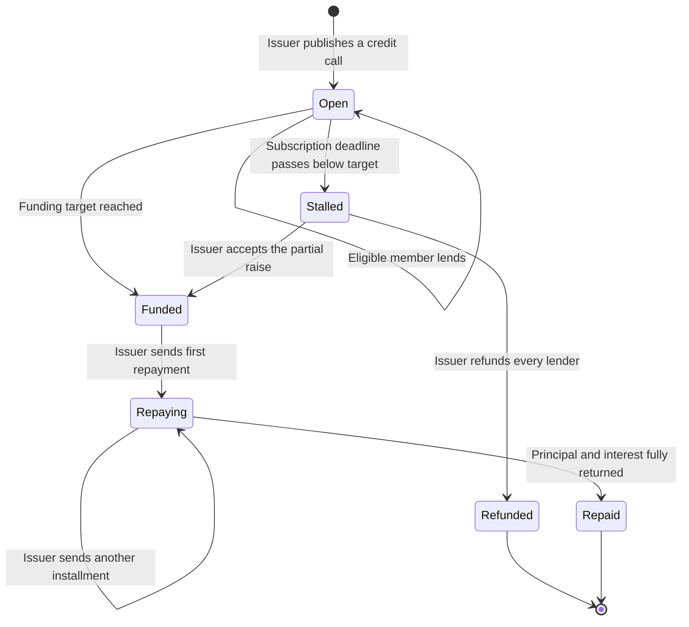

# Community Credit — User Stories

**Scope:** Company credit rounds from issuer creation through member lending, deadline resolution, refund, and repayment

**Last reviewed:** Not yet reviewed

These acceptance criteria follow the
[feature documentation review contract](../../platform/feature-specification-guide.md#human-review-contract).

## Product Model

Community Credit lets a company raise working capital from its members. The portal calls one on-chain `FixedReturn` lending offer a
**round** and the company's deployed `FixedReturn` instance its **Credit Account**. The current contract reports version `3.0.0`.

Each round defines an ERC-20 token, funding target, flat interest rate for the complete term, subscription deadline, maturity date, and
either general or restricted lender access. The **issuer** is the Credit Account owner. A **lender** is an eligible company member; the
issuer can also lend when the round's access rules allow it.

Deposits remain in the Credit Account while a round is raising. Reaching the target, or accepting a partial raise after the deadline, moves
the principal to the company Bank. Refunds and repayments are pushed to every lender by an issuer transaction; lenders do not claim them
individually. The round name and purpose are stored off-chain, while its financial terms and settlement state remain on-chain.

## Lifecycle

```mermaid
stateDiagram-v2
  [*] --> Open: Issuer publishes a credit call
  Open --> Open: Eligible member lends
  Open --> Funded: Funding target reached
  Open --> Stalled: Subscription deadline passes below target
  Stalled --> Refunded: Issuer refunds every lender
  Stalled --> Funded: Issuer accepts the partial raise
  Funded --> Repaying: Issuer sends first repayment
  Repaying --> Repaying: Issuer sends another installment
  Repaying --> Repaid: Principal and interest fully returned
  Refunded --> [*]
  Repaid --> [*]
```

`Stalled` and `Repaid` are portal statuses derived from contract state, time, and repayment totals; the contract does not transition
automatically when a deadline or maturity date passes.

## Status Overview

| User Story | Title                      | Actor              | Status         |
| ---------- | -------------------------- | ------------------ | -------------- |
| US-CC-001  | Inspect the Credit Account | Company member     | 🚧 In Progress |
| US-CC-002  | Publish a credit call      | Company issuer     | 🚧 In Progress |
| US-CC-003  | Lend to an open round      | Company member     | 🚧 In Progress |
| US-CC-004  | Resolve a stalled round    | Company issuer     | 🧪 Validation  |
| US-CC-005  | Repay lenders              | Current Bank owner | 🚧 In Progress |

## Test Coverage Overview

Coverage targets compare each criterion with its required representative evidence. Static references are not a current passing run; the
generated coverage report and CI retain file-level and execution evidence. Known assertion gaps remain insufficient even when a static
reference has the expected layer label.

| User Story | Main Journey  | Coverage Target | Gaps                                                                                                                                                                                                                                                                                                                              |
| ---------- | ------------- | --------------- | --------------------------------------------------------------------------------------------------------------------------------------------------------------------------------------------------------------------------------------------------------------------------------------------------------------------------------- |
| US-CC-001  | ✅ Integrated | ❌ 0/7 met      | `AC-US-CC-001-01–07`                                                                                                                                                                                                                                                                                                              |
| US-CC-002  | ✅ Integrated | ⚠️ 2/18         | `AC-US-CC-002-01`, `AC-US-CC-002-02`, `AC-US-CC-002-03`, `AC-US-CC-002-04`, `AC-US-CC-002-05`, `AC-US-CC-002-06`, `AC-US-CC-002-07`, `AC-US-CC-002-08`, `AC-US-CC-002-09`, `AC-US-CC-002-10`, `AC-US-CC-002-11`, `AC-US-CC-002-12`, `AC-US-CC-002-16`, `AC-US-CC-002-13`, `AC-US-CC-002-14`, `AC-US-CC-002-15`                    |
| US-CC-003  | ✅ Integrated | ❌ 0/12         | `AC-US-CC-003-01`, `AC-US-CC-003-02`, `AC-US-CC-003-03`, `AC-US-CC-003-04`, `AC-US-CC-003-05`, `AC-US-CC-003-06`, `AC-US-CC-003-07`, `AC-US-CC-003-08`, `AC-US-CC-003-09`, `AC-US-CC-003-10`, `AC-US-CC-003-12`, `AC-US-CC-003-11`                                                                                                |
| US-CC-004  | ✅ Integrated | ❌ 0/8          | `AC-US-CC-004-01`, `AC-US-CC-004-02`, `AC-US-CC-004-03`, `AC-US-CC-004-04`, `AC-US-CC-004-05`, `AC-US-CC-004-06`, `AC-US-CC-004-07`, `AC-US-CC-004-08`                                                                                                                                                                            |
| US-CC-005  | ✅ Integrated | ❌ 0/17         | `AC-US-CC-005-01`, `AC-US-CC-005-02`, `AC-US-CC-005-03`, `AC-US-CC-005-04`, `AC-US-CC-005-05`, `AC-US-CC-005-06`, `AC-US-CC-005-07`, `AC-US-CC-005-08`, `AC-US-CC-005-09`, `AC-US-CC-005-10`, `AC-US-CC-005-11`, `AC-US-CC-005-12`, `AC-US-CC-005-13`, `AC-US-CC-005-14`, `AC-US-CC-005-15`, `AC-US-CC-005-16`, `AC-US-CC-005-17` |

The integrated main journeys belong to [E2E-PATH-09 and E2E-PATH-10](../../testing/e2e-paths.md#g4--community-credit-lifecycle). They do not
prove every criterion or replace direct, assertion-reviewed AC evidence.

Proof obligations use the [shared proof-strategy registry](../../testing/proof-strategies.md). Multiple IDs for one AC are cumulative.

## US-CC-001: Inspect the Credit Account

**As a** company member\
**I want to** inspect the company's credit rounds and their current state\
**So that** I can understand what is raising, awaiting action, or settled

### Acceptance Criteria

#### Happy Path

- [x] `AC-US-CC-001-01` Each round exposes its purpose, token, target, amount raised, flat rate, access mode, dates, and current status.
- [ ] `AC-US-CC-001-02` A lender can distinguish their own deposited and expected-return positions from the issuer's total debt figures.
- [x] `AC-US-CC-001-03` An opened round exposes its lender breakdown, settlement progress, and matching on-chain activity.

#### Business Rules

- [ ] `AC-US-CC-001-04` Rounds that still require an issuer action remain accessible separately from settled rounds.
- [x] `AC-US-CC-001-05` Account-level statistics (outstanding principal, interest due, lifetime raised, lifetime repaid) are grouped and
      displayed per token; amounts from different tokens are never summed into a single figure.

#### Edge & Error Cases

- [x] `AC-US-CC-001-06` A company without a deployed Credit Account receives the missing prerequisite instead of an empty round result.
- [x] `AC-US-CC-001-07` The Credit Account journey distinguishes loading, an unavailable read with recovery, a confirmed missing round, and
      populated outcomes.

### Test Coverage

| Acceptance Criterion | Proof Strategy             | Current Evidence | Status          |
| -------------------- | -------------------------- | ---------------- | --------------- |
| `AC-US-CC-001-01`    | `PS-FULL-STACK-INTEGRATED` | None linked      | ❌ Missing      |
| `AC-US-CC-001-02`    | `PS-BROWSER`               | None linked      | ❌ Missing      |
| `AC-US-CC-001-03`    | `PS-CHAIN-INTEGRATED`      | None linked      | ❌ Missing      |
| `AC-US-CC-001-04`    | `PS-BROWSER`               | None linked      | ❌ Missing      |
| `AC-US-CC-001-05`    | `PS-FRONTEND`              | Frontend         | ⚠️ Insufficient |
| `AC-US-CC-001-06`    | `PS-BROWSER`               | None linked      | ❌ Missing      |
| `AC-US-CC-001-07`    | `PS-BROWSER`               | Frontend         | ⚠️ Insufficient |

## US-CC-002: Publish a Credit Call

**As a** company issuer\
**I want to** publish a credit round with its funding terms and lender access\
**So that** eligible members can provide working capital to the company

### Acceptance Criteria

#### Happy Path

- [x] `AC-US-CC-002-01` The issuer can define a round name of at least three characters and an optional purpose.
- [x] `AC-US-CC-002-02` The issuer can select an ERC-20 token supported by the company's Credit Account.
- [x] `AC-US-CC-002-03` The issuer can define a positive funding target.
- [x] `AC-US-CC-002-04` The issuer can define a flat interest rate from 0% to 100% for the complete term.
- [x] `AC-US-CC-002-05` The issuer can define a future subscription deadline and a positive term of at most 30 years. The deadline date
      starts empty and must be picked explicitly; only the time is pre-filled (end of day, local time).
- [x] `AC-US-CC-002-06` Successful publication creates one on-chain round, persists its metadata, and exposes the round through subsequent
      Credit Account reads.

#### Business Rules

- [x] `AC-US-CC-002-07` A general-access round can apply an optional positive per-lender cap that does not exceed the funding target.
- [x] `AC-US-CC-002-08` A restricted round requires at least one lender and rejects duplicate lender addresses.
- [x] `AC-US-CC-002-09` Every capped restricted lender requires a positive allocation.
- [x] `AC-US-CC-002-10` Fully capped restricted allocations must total at least the funding target.
- [x] `AC-US-CC-002-11` The subscription deadline is validated again immediately before publication.
- [x] `AC-US-CC-002-12` Off-chain metadata is associated with the exact offer identifier emitted by the on-chain creation transaction.
- [x] `AC-US-CC-002-16` Saving metadata is idempotent on (team, offer identifier): retrying with the same title and purpose leaves the
      stored record unchanged, and retrying with edited values overwrites it with whatever is currently in the form — there is no separate
      conflict check against the original save.
- [x] `AC-US-CC-002-17` Metadata cannot be saved for an offer identifier that does not yet exist on the connected Credit Account.
- [x] `AC-US-CC-002-18` Only the current Credit Account owner can save metadata for a round.

#### Edge & Error Cases

- [x] `AC-US-CC-002-13` Invalid round terms are rejected before an on-chain transaction is requested.
- [x] `AC-US-CC-002-14` Rejecting or failing the on-chain creation leaves the Credit Account unchanged and returns a failure outcome.
- [x] `AC-US-CC-002-15` Once the on-chain round exists, a metadata save failure can be retried any number of times with identical or edited
      values without creating a duplicate round or a conflict error; going back only reaches the name and purpose, since target, token,
      terms and access are fixed on-chain.

### Test Coverage

| Acceptance Criterion | Proof Strategy             | Current Evidence          | Status          |
| -------------------- | -------------------------- | ------------------------- | --------------- |
| `AC-US-CC-002-01`    | `PS-FRONTEND`              | Frontend                  | ⚠️ Insufficient |
| `AC-US-CC-002-02`    | `PS-FRONTEND`              | None linked               | ❌ Missing      |
| `AC-US-CC-002-02`    | `PS-CONTRACT`              | None linked               | ❌ Missing      |
| `AC-US-CC-002-03`    | `PS-FRONTEND`              | Frontend                  | ⚠️ Insufficient |
| `AC-US-CC-002-04`    | `PS-FRONTEND`              | Frontend                  | ⚠️ Insufficient |
| `AC-US-CC-002-05`    | `PS-FRONTEND`              | Frontend                  | ⚠️ Insufficient |
| `AC-US-CC-002-06`    | `PS-FULL-STACK-INTEGRATED` | Integrated E2E + Frontend | ✅ Met          |
| `AC-US-CC-002-06`    | `PS-BACKEND`               | Integrated E2E + Frontend | ⚠️ Insufficient |
| `AC-US-CC-002-06`    | `PS-CONTRACT`              | Integrated E2E + Frontend | ⚠️ Insufficient |
| `AC-US-CC-002-07`    | `PS-FRONTEND`              | Frontend                  | ✅ Met          |
| `AC-US-CC-002-07`    | `PS-CONTRACT`              | Frontend                  | ⚠️ Insufficient |
| `AC-US-CC-002-08`    | `PS-FRONTEND`              | Frontend                  | ✅ Met          |
| `AC-US-CC-002-08`    | `PS-CONTRACT`              | Frontend                  | ⚠️ Insufficient |
| `AC-US-CC-002-09`    | `PS-FRONTEND`              | Frontend                  | ✅ Met          |
| `AC-US-CC-002-09`    | `PS-CONTRACT`              | Frontend                  | ⚠️ Insufficient |
| `AC-US-CC-002-10`    | `PS-FRONTEND`              | Frontend                  | ✅ Met          |
| `AC-US-CC-002-10`    | `PS-CONTRACT`              | Frontend                  | ⚠️ Insufficient |
| `AC-US-CC-002-11`    | `PS-FRONTEND`              | None linked               | ❌ Missing      |
| `AC-US-CC-002-12`    | `PS-FULL-STACK-INTEGRATED` | None linked               | ❌ Missing      |
| `AC-US-CC-002-12`    | `PS-BACKEND`               | None linked               | ❌ Missing      |
| `AC-US-CC-002-16`    | `PS-BACKEND`               | Backend                   | ⚠️ Insufficient |
| `AC-US-CC-002-17`    | `PS-BACKEND`               | Backend                   | ✅ Met          |
| `AC-US-CC-002-18`    | `PS-BACKEND`               | Backend                   | ✅ Met          |
| `AC-US-CC-002-13`    | `PS-FRONTEND`              | None linked               | ❌ Missing      |
| `AC-US-CC-002-14`    | `PS-BROWSER`               | None linked               | ❌ Missing      |
| `AC-US-CC-002-14`    | `PS-CONTRACT`              | None linked               | ❌ Missing      |
| `AC-US-CC-002-15`    | `PS-BROWSER`               | Frontend                  | ⚠️ Insufficient |
| `AC-US-CC-002-15`    | `PS-BACKEND`               | Frontend                  | ⚠️ Insufficient |

**Accounting:** Publishing terms moves no company funds and creates no journal entry.

## US-CC-003: Lend to an Open Round

**As a** company member\
**I want to** lend an allowed amount to an open credit round\
**So that** I can fund the company and receive the stated fixed return

### Acceptance Criteria

#### Happy Path

- [x] `AC-US-CC-003-01` An eligible member can lend to a round while it is open and before its subscription deadline.
- [x] `AC-US-CC-003-02` A successful lend increases both the round's funded amount and the lender's deposited position.
- [x] `AC-US-CC-003-03` A successful lend refreshes the round and the lender's position before another lending decision.
- [x] `AC-US-CC-003-04` A successful lend refreshes the matching activity feed before another decision.
- [ ] `AC-US-CC-003-05` A successful lend refreshes the lender's token balance before another decision.

#### Business Rules

- [x] `AC-US-CC-003-06` A restricted round accepts funds only from a member with a non-zero allocation.
- [x] `AC-US-CC-003-07` The lender's available amount is the lower of the remaining funding target and their remaining cap or allocation.
- [x] `AC-US-CC-003-08` A lending amount must be greater than 0.
- [x] `AC-US-CC-003-09` A lending amount cannot exceed the lender's available amount.
- [x] `AC-US-CC-003-10` Token approval is requested only when the current allowance is insufficient.
- [x] `AC-US-CC-003-12` A failed read of the connected member's whitelist allocation or deposited amount is presented as unavailable with a
      retry, never as a confirmed zero — a transient read failure must not look like "not eligible" or "nothing deposited yet."

#### Edge & Error Cases

- [x] `AC-US-CC-003-11` Rejecting approval, rejecting the lending transaction, or an on-chain failure leaves the round unchanged and returns
      a recoverable failure outcome.

### Test Coverage

| Acceptance Criterion | Proof Strategy        | Current Evidence | Status          |
| -------------------- | --------------------- | ---------------- | --------------- |
| `AC-US-CC-003-01`    | `PS-CHAIN-INTEGRATED` | Integrated E2E   | ✅ Met          |
| `AC-US-CC-003-01`    | `PS-CONTRACT`         | Integrated E2E   | ⚠️ Insufficient |
| `AC-US-CC-003-02`    | `PS-CHAIN-INTEGRATED` | Integrated E2E   | ✅ Met          |
| `AC-US-CC-003-02`    | `PS-CONTRACT`         | Integrated E2E   | ⚠️ Insufficient |
| `AC-US-CC-003-03`    | `PS-BROWSER`          | None linked      | ❌ Missing      |
| `AC-US-CC-003-04`    | `PS-BROWSER`          | None linked      | ❌ Missing      |
| `AC-US-CC-003-05`    | `PS-BROWSER`          | None linked      | ❌ Missing      |
| `AC-US-CC-003-06`    | `PS-CONTRACT`         | Frontend         | ⚠️ Insufficient |
| `AC-US-CC-003-07`    | `PS-FRONTEND`         | None linked      | ❌ Missing      |
| `AC-US-CC-003-07`    | `PS-CONTRACT`         | None linked      | ❌ Missing      |
| `AC-US-CC-003-08`    | `PS-FRONTEND`         | None linked      | ❌ Missing      |
| `AC-US-CC-003-08`    | `PS-CONTRACT`         | None linked      | ❌ Missing      |
| `AC-US-CC-003-09`    | `PS-FRONTEND`         | None linked      | ❌ Missing      |
| `AC-US-CC-003-09`    | `PS-CONTRACT`         | None linked      | ❌ Missing      |
| `AC-US-CC-003-10`    | `PS-BROWSER`          | Frontend         | ⚠️ Insufficient |
| `AC-US-CC-003-12`    | `PS-BROWSER`          | Frontend         | ⚠️ Insufficient |
| `AC-US-CC-003-11`    | `PS-BROWSER`          | None linked      | ❌ Missing      |
| `AC-US-CC-003-11`    | `PS-CONTRACT`         | None linked      | ❌ Missing      |

**Accounting:** A contribution remains source evidence while the round is open. When the round becomes funded, Accounting books principal
through [`UC-CREDIT-01`](../accounting/journal-entry-catalogue.md#uc-credit-01--funded-principal) and fixed return through
[`UC-CREDIT-05`](../accounting/journal-entry-catalogue.md#uc-credit-05--fixed-return-recognized).

## US-CC-004: Resolve a Stalled Round

**As a** company issuer\
**I want to** refund lenders or accept a partial raise after the deadline\
**So that** an underfunded round reaches an explicit financial outcome

### Acceptance Criteria

#### Happy Path

- [x] `AC-US-CC-004-01` The issuer can refund a stalled round, returning every lender's principal in one transaction.
- [x] `AC-US-CC-004-02` The issuer can accept a positive partial raise and continue the round using the actual funded amount.
- [x] `AC-US-CC-004-03` Accepting a partial raise transfers the raised principal to the company Bank.
- [x] `AC-US-CC-004-04` A successful resolution refreshes the round and lender data.

#### Business Rules

- [x] `AC-US-CC-004-05` A round below target remains on-chain as open after its subscription deadline until the issuer resolves it.
- [x] `AC-US-CC-004-06` Refund and partial acceptance are mutually exclusive final decisions for a stalled round.

#### Edge & Error Cases

- [x] `AC-US-CC-004-07` A partial raise of 0 cannot be accepted.
- [x] `AC-US-CC-004-08` A failed resolution leaves the round unchanged and returns a failure outcome.

### Test Coverage

| Acceptance Criterion | Proof Strategy        | Current Evidence | Status          |
| -------------------- | --------------------- | ---------------- | --------------- |
| `AC-US-CC-004-01`    | `PS-CHAIN-INTEGRATED` | Frontend         | ⚠️ Insufficient |
| `AC-US-CC-004-01`    | `PS-CONTRACT`         | Frontend         | ⚠️ Insufficient |
| `AC-US-CC-004-02`    | `PS-CHAIN-INTEGRATED` | Frontend         | ⚠️ Insufficient |
| `AC-US-CC-004-02`    | `PS-CONTRACT`         | Frontend         | ⚠️ Insufficient |
| `AC-US-CC-004-03`    | `PS-CHAIN-INTEGRATED` | None linked      | ❌ Missing      |
| `AC-US-CC-004-03`    | `PS-CONTRACT`         | None linked      | ❌ Missing      |
| `AC-US-CC-004-04`    | `PS-BROWSER`          | None linked      | ❌ Missing      |
| `AC-US-CC-004-05`    | `PS-CONTRACT`         | None linked      | ❌ Missing      |
| `AC-US-CC-004-06`    | `PS-CONTRACT`         | None linked      | ❌ Missing      |
| `AC-US-CC-004-07`    | `PS-CONTRACT`         | None linked      | ❌ Missing      |
| `AC-US-CC-004-08`    | `PS-BROWSER`          | None linked      | ❌ Missing      |
| `AC-US-CC-004-08`    | `PS-CONTRACT`         | None linked      | ❌ Missing      |

**Accounting:** Accepting a partial raise activates `UC-CREDIT-01` and `UC-CREDIT-05`. Refunding lenders returns funds that never entered
the company's books and creates no journal entry.

## US-CC-005: Repay Lenders

**As a** current company Bank owner\
**I want to** repay principal and fixed interest from the company treasury\
**So that** every lender receives their proportional entitlement

### How It Works

1. The selected round exposes its current obligation, Bank balance, and each lender's settlement progress before the current Bank owner
   submits an installment.
2. The portal validates the requested amount in token base units and waits for the Bank balance before submitting an installment.
3. A full repayment returns to that round's default detail after the settlement data refreshes; a partial repayment keeps the Bank owner in
   the repayment view with refreshed figures.

### Acceptance Criteria

#### Happy Path

- [x] `AC-US-CC-005-01` The current Bank owner can repay a funded, partially repaid, or overdue round from the company Bank.
- [x] `AC-US-CC-005-02` An installment distributes each lender's cumulative proportional entitlement without overpaying the round or leaving
      rounding dust.
- [x] `AC-US-CC-005-03` A successful installment refreshes repayment progress and lender settlement data.
- [x] `AC-US-CC-005-04` A successful installment refreshes the matching activity feed before another decision.
- [ ] `AC-US-CC-005-05` A successful installment refreshes lender token balances and the Bank token balance before another decision.
- [x] `AC-US-CC-005-06` Repaying the complete obligation settles the round and prevents further repayment.

#### Business Rules

- [x] `AC-US-CC-005-07` A repayment amount must be greater than 0.
- [x] `AC-US-CC-005-08` A repayment amount cannot exceed the outstanding obligation.
- [x] `AC-US-CC-005-09` A repayment amount cannot exceed the Bank's token balance.
- [x] `AC-US-CC-005-10` The portal does not submit a repayment until the Bank balance is available and the amount passes the exact
      token-unit limits.
- [x] `AC-US-CC-005-11` The Bank rejects repayment from an account other than its current owner.
- [x] `AC-US-CC-005-12` A paused Bank rejects repayment.
- [x] `AC-US-CC-005-13` The repayment action is unavailable to a wallet other than the current Bank owner.
- [x] `AC-US-CC-005-14` The repayment action is unavailable while the Bank is paused.

#### Edge & Error Cases

- [x] `AC-US-CC-005-15` A round that is still raising cannot be repaid.
- [x] `AC-US-CC-005-16` A settled round cannot be repaid again.
- [x] `AC-US-CC-005-17` Rejecting or failing a repayment preserves the outstanding amount and returns a recoverable failure outcome.

### Test Coverage

| Acceptance Criterion | Proof Strategy        | Current Evidence | Status          |
| -------------------- | --------------------- | ---------------- | --------------- |
| `AC-US-CC-005-01`    | `PS-CHAIN-INTEGRATED` | None linked      | ❌ Missing      |
| `AC-US-CC-005-01`    | `PS-CONTRACT`         | None linked      | ❌ Missing      |
| `AC-US-CC-005-02`    | `PS-CONTRACT`         | None linked      | ❌ Missing      |
| `AC-US-CC-005-03`    | `PS-BROWSER`          | None linked      | ❌ Missing      |
| `AC-US-CC-005-04`    | `PS-BROWSER`          | None linked      | ❌ Missing      |
| `AC-US-CC-005-05`    | `PS-BROWSER`          | None linked      | ❌ Missing      |
| `AC-US-CC-005-06`    | `PS-CHAIN-INTEGRATED` | Frontend         | ⚠️ Insufficient |
| `AC-US-CC-005-06`    | `PS-CONTRACT`         | Frontend         | ⚠️ Insufficient |
| `AC-US-CC-005-07`    | `PS-FRONTEND`         | None linked      | ❌ Missing      |
| `AC-US-CC-005-07`    | `PS-CONTRACT`         | None linked      | ❌ Missing      |
| `AC-US-CC-005-08`    | `PS-FRONTEND`         | Frontend         | ✅ Met          |
| `AC-US-CC-005-08`    | `PS-CONTRACT`         | Frontend         | ⚠️ Insufficient |
| `AC-US-CC-005-09`    | `PS-FRONTEND`         | Frontend         | ✅ Met          |
| `AC-US-CC-005-09`    | `PS-CONTRACT`         | Frontend         | ⚠️ Insufficient |
| `AC-US-CC-005-10`    | `PS-FRONTEND`         | Frontend         | ✅ Met          |
| `AC-US-CC-005-10`    | `PS-BROWSER`          | Frontend         | ⚠️ Insufficient |
| `AC-US-CC-005-11`    | `PS-CONTRACT`         | None linked      | ❌ Missing      |
| `AC-US-CC-005-12`    | `PS-CONTRACT`         | Frontend         | ⚠️ Insufficient |
| `AC-US-CC-005-13`    | `PS-BROWSER`          | Frontend         | ⚠️ Insufficient |
| `AC-US-CC-005-14`    | `PS-BROWSER`          | None linked      | ❌ Missing      |
| `AC-US-CC-005-15`    | `PS-CONTRACT`         | Frontend         | ⚠️ Insufficient |
| `AC-US-CC-005-16`    | `PS-CONTRACT`         | None linked      | ❌ Missing      |
| `AC-US-CC-005-17`    | `PS-BROWSER`          | None linked      | ❌ Missing      |
| `AC-US-CC-005-17`    | `PS-CONTRACT`         | None linked      | ❌ Missing      |

**Accounting:** Each repayment settles principal and interest through
[`UC-CREDIT-03`](../accounting/journal-entry-catalogue.md#uc-credit-03--principal-and-interest-repaid). Lender payments from the same
transaction remain one General Ledger entry.

## Known Gaps

The following verified gaps have technical evidence and remediation directions in the
[detailed flow and implementation analysis](./user-flow-analysis.md#8-findings).

### Functional Gaps

- Rounds that require an issuer action are grouped with settled history.
- Lenders cannot review their personal deposited and expected-return positions separately from the company's debt.
- Lending, repayment, refunding, and accepting partial funding now invalidate the cached balance/allowance reads for the round's own token
  (so a widget that renders them would pick up the change on its next read), but no Community Credit surface currently renders a lender's
  own token balance — the matching activity feed still doesn't refresh every affected balance visibly.
- `AC-US-CC-001-05` has a component marker for separately labelled symbols, but the store groups by display symbol rather than token
  address. Different token contracts sharing one symbol can be summed; the criterion is not fully established by that test.
- The marked read-state and repayment tests cover narrower branches than the complete route, partial-acceptance, installment and
  multi-lender outcomes in `001-07`, `002-12`, `004-02–03`, and `005-02`. These remain proof gaps even where contract or frontend support
  exists.
- The marked publish-form tests omit optional-purpose retention, positive target propagation, flat-rate conversion, and some deadline
  defaults (`002-01`, `03–05`). The `002-16` backend tests mock an upsert result rather than proving a persisted identical or edited retry;
  one purported retry performs only one request. These markers remain insufficient.

## Implementation Evidence

**Implementation evidence reviewed against:** `81ea764c11b24df295de4242056f6b69255a49cc`

- [Credit Account page](../../../app/src/views/team/[id]/CommunityCredit/IndexView.vue)
- [Credit-call wizard](../../../app/src/views/team/[id]/CommunityCredit/NewView.vue)
- [Round detail](../../../app/src/views/team/[id]/CommunityCredit/RoundView.vue)
- [Credit round header](../../../app/src/components/sections/CommunityCreditView/CreditRoundHeader.vue)
- [Credit round actions](../../../app/src/components/sections/CommunityCreditView/CreditRoundActions.vue)
- [Credit round detail section](../../../app/src/components/sections/CommunityCreditView/CreditRoundDetailSection.vue)
- [Credit round read states](../../../app/src/components/sections/CommunityCreditView/CreditRoundReadState.vue)
- [Community Credit store](../../../app/src/stores/communityCredit.ts)
- [Community Credit reads](../../../app/src/composables/fixedReturn/reads.ts)
- [FixedReturn query-key factory](../../../app/src/composables/fixedReturn/keys.ts)
- [FixedReturn mutation cache invalidation](../../../app/src/composables/fixedReturn/invalidation.ts)
- [Connected lender's live offering derivation](../../../app/src/composables/fixedReturn/useMyLenderOffering.ts)
- [Bank reads (owner and paused state, gating repayment)](../../../app/src/composables/bank/reads.ts)
- [Repayment amount validation](../../../app/src/types/communityCredit.schemas.ts)
- [Repayment lifecycle status](../../../app/src/utils/communityCredit/roundStatus.ts)
- [Credit-call access step](../../../app/src/components/sections/CommunityCreditView/CreditCallAccessStep.vue)
- [Credit-call terms step](../../../app/src/components/sections/CommunityCreditView/CreditCallTermsStep.vue)
- [Credit Account transaction history](../../../app/src/components/sections/CommunityCreditView/CreditAccountTransactions.vue)
- [Credit round history](../../../app/src/components/sections/CommunityCreditView/CreditHistoryTable.vue)
- [Lending modal](../../../app/src/components/sections/CommunityCreditView/CreditLendModal.vue)
- [Repayment panel](../../../app/src/components/sections/CommunityCreditView/CreditRepayPanel.vue)
- [Repayment breakdown](../../../app/src/components/sections/CommunityCreditView/CreditRepayBreakdownTable.vue)
- [Repayment panel component tests](../../../app/src/components/sections/CommunityCreditView/__tests__/CreditRepayPanel.spec.ts)
- [Credit round ledger](../../../app/src/components/sections/CommunityCreditView/CreditRoundLedger.vue)
- [Whitelist allocation editor](../../../app/src/components/sections/CommunityCreditView/CreditWhitelistEditor.vue)
- [FixedReturn contract](../../../contract/contracts/FixedReturn.sol)
- [Metadata controller](../../../backend/src/controllers/fixedReturnOfferingController.ts)
- [Metadata route](../../../backend/src/routes/fixedReturnOfferingRoute.ts)
- [Metadata controller tests](../../../backend/src/controllers/__tests__/fixedReturnOfferingController.test.ts)
- [Frontend feature tests](../../../app/src/views/team/[id]/CommunityCredit/__tests__/communityCreditViews.spec.ts)

## Related Documentation

- [Community Credit read-model implementation](../../implementation/community-credit-read-model/README.md)
- [FixedReturn contract behaviour](../../contracts/features/fixed-return/README.md)
- [Async UI State Framework](../../platform/async-ui-state-framework.md)
- [Client Navigation implementation](../../implementation/client-navigation/README.md)
- [Date Picker implementation](../../implementation/date-picker/README.md)
- [Transaction History implementation](../../implementation/transaction-history/README.md)
- [Detailed flow and implementation analysis](./user-flow-analysis.md)
- [Accounting use cases, posting rules, and journal entries](../accounting/journal-entry-catalogue.md)
- [Product Feature Inventory](../README.md)
