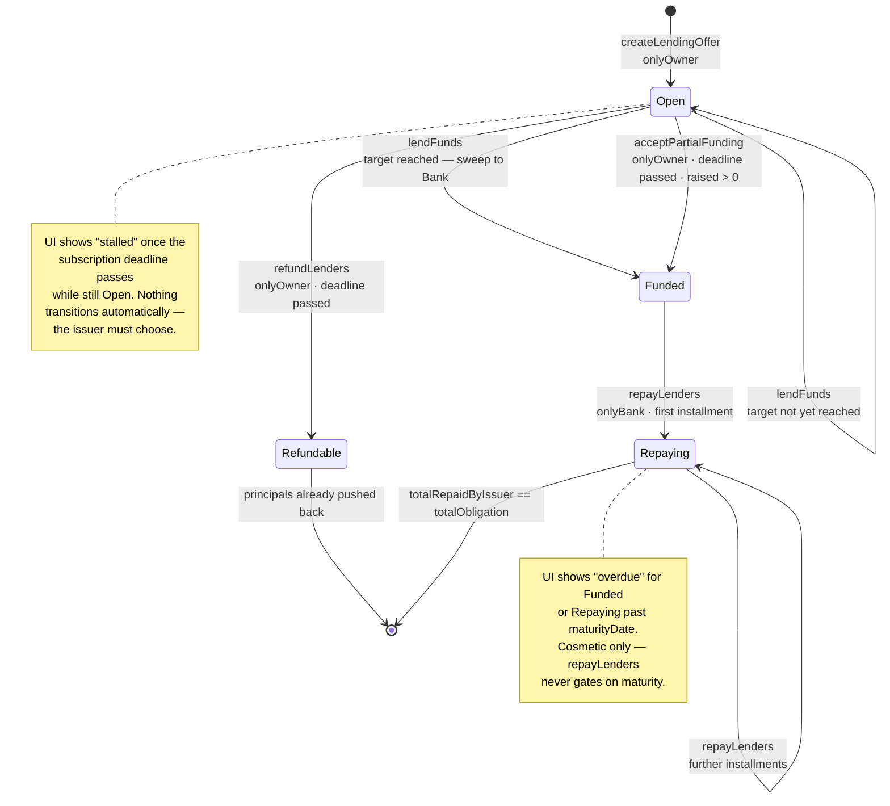
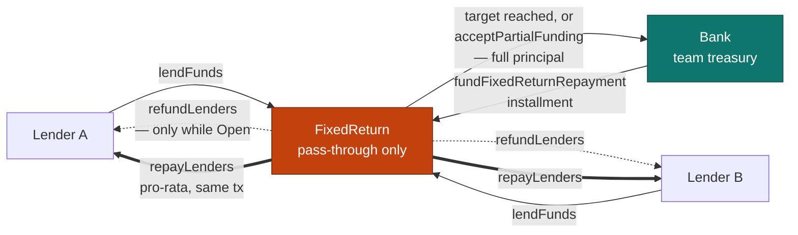
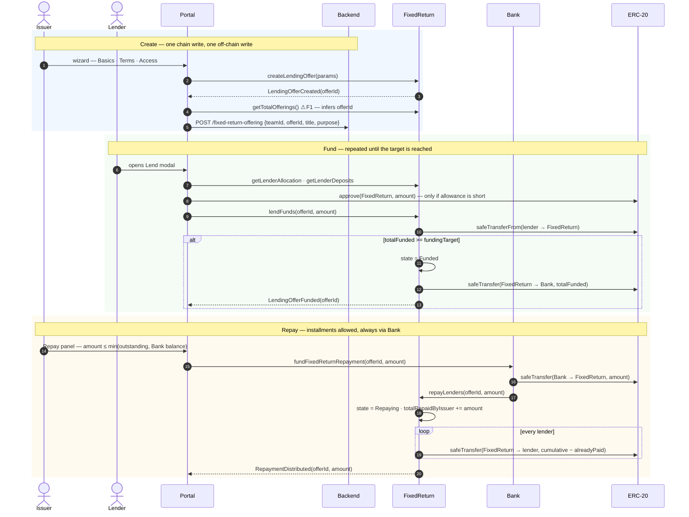
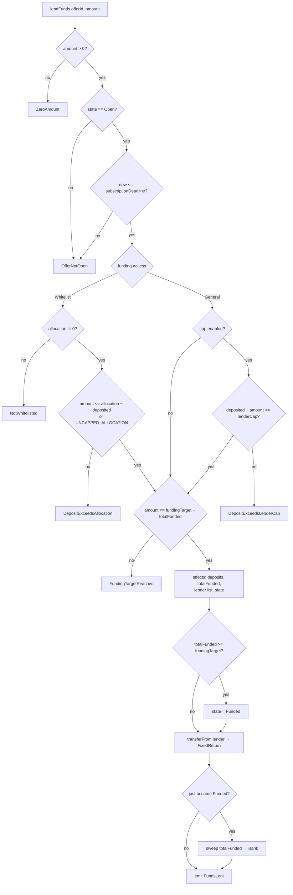

# Community Credit — Detailed Flow and Implementation Analysis

**Analysis date:** 2026-08-03 · **Original scope:** `develop` · **Observed contract version:** `FixedReturn` v1.3.0

> This is a dated technical snapshot, not the canonical feature contract. Start with the current
> [Community Credit User Stories](./README.md). The current contract reports version `3.0.0`; verify implementation
> details against current source before changing behaviour.

A read of the whole feature end to end — Solidity, frontend, backend — describing what a user actually did at the
analysis date, what the contract enforced, and where the two drifted apart.

---

## 1. Naming

There are three names for one thing, which is the first source of confusion:

| Name                 | Where it appears                                              |
| -------------------- | ------------------------------------------------------------- |
| **FixedReturn**      | the contract, the ABI, every composable and query key         |
| **Community Credit** | the product name — sidebar, routes, page titles               |
| **Credit Account**   | the UI's word for _this team's deployed FixedReturn instance_ |

And one more, internal to the mapping layer: an on-chain **lending offer** is rendered as a **round** in the UI
(`offerId` ⇄ `round.id`, same number).

Throughout this document: **issuer** = the FixedReturn owner (the team), **lender** = a member who funds a round.

---

## 2. What the feature is

A team raises working capital from its own members. Each **round** has a funding target, a **flat** interest rate over
the whole term (not annualised), a subscription deadline, and a maturity date. Members lend ERC-20 tokens before the
deadline; if the target is reached the principal is swept into the team treasury; at maturity the team repays
principal + interest, pushed back to every lender pro-rata.

Two things follow from this design and explain most of the UI:

- **Everything is push, never pull.** A lender never claims, never withdraws, never signs anything after lending.
  Refunds and repayments are transactions the _issuer_ sends, which fan out to every lender in the same call. So the
  lender-facing surface is deliberately thin.
- **FixedReturn is a pass-through, not a vault.** It holds lender deposits only while a round is still raising. The
  moment the target is hit, the whole principal leaves for the Bank. See §6.

---

## 3. Architecture map

| Layer          | Location                                                                                                                                                    | Responsibility                                       |
| -------------- | ----------------------------------------------------------------------------------------------------------------------------------------------------------- | ---------------------------------------------------- |
| Contract       | [`contract/contracts/FixedReturn.sol`](../../../contract/contracts/FixedReturn.sol) (731 l.)                                                                | offers, deposits, refunds, repayment fan-out         |
| Repayment rail | [`Bank.sol:308`](../../../contract/contracts/Bank.sol:308) `fundFixedReturnRepayment`                                                                       | the only caller allowed into `repayLenders`          |
| Routes         | [`app/src/router/index.ts:152-169`](../../../app/src/router/index.ts:152)                                                                                   | `community-credit`, `-new`, `-round/:roundId`        |
| Views          | [`app/src/views/team/[id]/CommunityCredit/`](../../../app/src/views/team/[id]/CommunityCredit)                                                              | `IndexView`, `NewView`, `RoundView`                  |
| Components     | [`CommunityCreditView/`](../../../app/src/components/sections/CommunityCreditView)                                                                          | 18 components                                        |
| Store          | [`stores/communityCredit.ts`](../../../app/src/stores/communityCredit.ts)                                                                                   | read-only projection + the `variant` toggle          |
| Chain access   | [`composables/fixedReturn/reads.ts`](../../../app/src/composables/fixedReturn/reads.ts) · [`writes.ts`](../../../app/src/composables/fixedReturn/writes.ts) |                                                      |
| Backend        | [`fixedReturnOfferingController.ts`](../../../backend/src/controllers/fixedReturnOfferingController.ts)                                                     | **title + purpose only** — nothing else is off-chain |

The backend's role is worth stating plainly: `createLendingOffer` deliberately does **not** take a title or description,
so the portal persists them in Postgres keyed by `(teamId, offerId)`. Everything else a user sees is read from the
chain.

---

## 4. Roles

Derived, never toggled:

```ts
isOwner = userStore.address === FixedReturn.owner(); // stores/communityCredit.ts:88
isLender = !isOwner;
```

The issuer is also a member, so they can lend to their own rounds — but on a restricted round they need a whitelist
allocation like anybody else, owner included. Both `CreditRoundCard` and `RoundView` hide the Lend action when
`lenderAllocation == 0`, rather than showing a button guaranteed to revert.

Ownership at deploy time: `Officer` initialises `FixedReturn` with the team owner address
([`FixedReturn.sol:324`](../../../contract/contracts/FixedReturn.sol:324)), the same address that owns the Bank. That
coincidence matters — see finding **F7**.

---

## 5. State machine

The contract has **four** states. The UI shows **seven**. The extra three are derived from the clock and from repayment
progress, and exist only in the frontend.

| `OfferState`     | + condition                         | UI `RoundStatus` | Meaning to the user                       |
| ---------------- | ----------------------------------- | ---------------- | ----------------------------------------- |
| `Open` (0)       | before deadline                     | `open`           | accepting deposits                        |
| `Open` (0)       | deadline passed                     | `stalled`        | missed the target — issuer must decide    |
| `Funded` (1)     | before maturity                     | `funded`         | raised, waiting to be repaid              |
| `Funded` (1)     | past maturity                       | `overdue`        | badge only — nothing is enforced on-chain |
| `Repaying` (3)   | partially repaid, before maturity   | `active`         | repayment in progress                     |
| `Repaying` (3)   | partially repaid, past maturity     | `overdue`        | badge only                                |
| `Repaying` (3)   | `totalRepaidByIssuer >= obligation` | `repaid`         | settled                                   |
| `Refundable` (2) | —                                   | `refunded`       | principals already returned               |

Resolved in [`offerStateToRoundStatus`](../../../app/src/utils/communityCreditUtil.ts:267).

Two subtleties that are easy to get wrong:

- **`Refundable` does not mean "a refund is pending".** `refundLenders` flips the state _and_ pushes every principal
  back in the same transaction. By the time a client can observe `Refundable`, the money is already home. Hence the UI
  label `refunded`, not `refundable`.
- **`overdue` is cosmetic.** `maturityDate` is validated once at creation (must be after the deadline) and never checked
  again. `repayLenders` does not gate on it. Nothing on-chain happens when a round matures.

**Clock choice.** Status is computed against the _chain's_ `block.timestamp`
([`useBlockTimestamp`](../../../app/src/composables/useBlockTimestamp.ts)), not the browser clock. Without this, a round
could render as lendable right up to the instant the transaction it accepted reverts with `OfferNotOpen`.

---

## 6. Custody model

Where the tokens physically sit is the clearest way to understand the contract:

| Phase                    | Token location                                        | Moved by                                        |
| ------------------------ | ----------------------------------------------------- | ----------------------------------------------- |
| Offer created            | nothing has moved                                     | —                                               |
| Raising                  | in **FixedReturn**, accumulating                      | `lendFunds` — `safeTransferFrom(lender → this)` |
| Target reached           | swept in full to **Bank**, same transaction           | `lendFunds` — `safeTransfer(this → Bank)`       |
| Partial funding accepted | swept in full to **Bank**                             | `acceptPartialFunding`                          |
| Refund                   | back to **each lender** from FixedReturn              | `refundLenders`                                 |
| Repayment installment    | **Bank → FixedReturn → each lender**, one transaction | `Bank.fundFixedReturnRepayment`                 |

Invariant the contract states explicitly: _no owner-callable function moves token balances out_
([`FixedReturn.sol:344`](../../../contract/contracts/FixedReturn.sol:344)). The issuer can configure an offer and
trigger refunds/repayments, but can never drain the contract. This is also why `Bank.fundFixedReturnRepayment` resolves
the token from the offer itself rather than trusting a caller-supplied address: a wrong-token transfer into FixedReturn
would be stranded there permanently.

Refunds are only reachable from `Open`, which is exactly when FixedReturn still holds the funds. There is no path where
a refund is requested after the sweep.

---

## 7. The flows

### 7.0 Prerequisite gate

`hasContract` is simply "does this team have a `FixedReturn` address"
([`useFixedReturnAddress`](../../../app/src/composables/fixedReturn/reads.ts:23)). The contract is optional — it is only
deployed on networks where its beacon exists
([`contractDeploymentUtil.ts:244`](../../../app/src/utils/contractDeploymentUtil.ts:244)).

Without one the page shows a dashed empty state saying a FixedReturn "has to be deployed", with **no path to deploying
one** and no indication of who could. Dead end for anyone who lands there.

### 7.1 Issuer — create a credit call

[`NewView.vue`](../../../app/src/views/team/[id]/CommunityCredit/NewView.vue) — a 3-step wizard with a live summary card
beside it.

| Step       | Fields                                                     | Validation                                                                |
| ---------- | ---------------------------------------------------------- | ------------------------------------------------------------------------- |
| **Basics** | name, purpose, target, token                               | `creditCallBasicsSchema`; token list restricted to `getSupportedTokens()` |
| **Terms**  | rate %, subscription deadline (date + time, **UTC**), term | `createCreditCallTermsSchema`                                             |
| **Access** | everyone / restricted + whitelist, optional per-lender cap | `createCreditCallAccessSchema`                                            |

Each step validates on "Continue" via a shared `applyZodFieldErrors` helper. Two details worth keeping:

- **The deadline is re-checked immediately before publishing**
  ([`NewView.vue:245`](../../../app/src/views/team/[id]/CommunityCredit/NewView.vue:245)), because `CreditCallTermsStep`
  is unmounted once you move past it, and a deadline chosen minutes earlier can have gone stale while the user filled in
  Access. The contract reverts `InvalidDeadline` on a non-future deadline, so this saves a wasted transaction.
- **Deadlines are formatted in UTC on purpose.** The wizard treats the typed clock time as UTC
  ([`toUnixSeconds`](../../../app/src/utils/communityCreditOfferUtil.ts)), so rendering it back in local time would
  silently shift it by the viewer's offset.

The term is normalised to whole minutes and added onto the deadline to produce `maturityDate` — a round has a single
date where subscription closes and the loan starts.

**On publish**, in order:

1. `createLendingOffer(params)` — awaited to receipt.
2. `getTotalOfferings()` re-read; the new `offerId` is assumed to be that count.
3. `POST /fixed-return-offering` with `{ teamId, offerId, title, purpose }`.
4. Invalidate `['fixedReturnAllOffers']`, toast, redirect to the list.

Steps 2 and 3 are where this flow breaks — see **F1**.

Contract-side validation of `createLendingOffer`, for reference:

- token must be supported by **both** FixedReturn and Bank (checked upfront so an offer can't be created that would fail
  at fund or repay time)
- `subscriptionDeadline > block.timestamp`
- `maturityDate > subscriptionDeadline`
- General + cap: `lenderCap <= fundingTarget`
- Whitelist: array lengths match · no duplicate address · allocations sum ≥ target **unless** at least one lender is
  `UNCAPPED_ALLOCATION` (that lender can always absorb the rest)

### 7.2 Lender — lend to a round

[`CreditLendModal.vue`](../../../app/src/components/sections/CommunityCreditView/CreditLendModal.vue). Sequence:
`refetch allowance` → `approve` if short → `lendFunds`.

The interesting part is how "how much can I lend" is computed. The round's own `cap` field is unreliable for this — it
only ever carries the General-mode `lenderCap`, never a whitelist allocation, and `lenders` is empty when the modal is
opened from the list. So the modal reads the live per-lender position (`getLenderAllocation` + `getLenderDeposits`) and
shows the **tighter** of:

- the round's remaining funding gap, and
- this lender's own remaining allocation or cap.

The 25% / 50% / Max presets are fractions of _that_ ceiling. This was a real bug once: taking fractions of the
round-level gap and clamping afterwards collapsed all three presets to the same number whenever the personal cap was
binding — a $500 allocation on a $10,000 round gave $500 / $500 / $500.

`UNCAPPED_ALLOCATION` is `type(uint256).max` used as a sentinel; the modal special-cases it to "no cap" rather than
rendering an astronomically large ceiling.

On-chain guards in `lendFunds`, in order: non-zero amount → state is `Open` → before deadline → whitelisted with
allocation left, _or_ under the general cap → does not exceed the remaining funding target. State is updated **before**
any transfer (strict CEI), and if this deposit reaches the target the entire accumulated principal is swept to Bank in
the same call.

### 7.3 Deadline passes

Two mutually exclusive issuer decisions, both requiring `state == Open` and a passed deadline — whichever is called
first wins. Both are on [`RoundView.vue:236-290`](../../../app/src/views/team/[id]/CommunityCredit/RoundView.vue:236).

| Action                 | Effect                                                           | Extra condition   |
| ---------------------- | ---------------------------------------------------------------- | ----------------- |
| `refundLenders`        | → `Refundable`; pushes every principal back in one tx            | —                 |
| `acceptPartialFunding` | → `Funded`; sweeps what was raised to Bank, proceed as if funded | `totalFunded > 0` |

The UI mirrors that second condition (`canAcceptPartialFunding` requires `raised > 0`) so the button doesn't appear on a
round that raised nothing.

Repayment maths keys off `totalFunded`, not `fundingTarget`, so a partially funded round needs no special handling
downstream.

**Nothing happens automatically.** A missed deadline leaves the round sitting in `Open` forever until the issuer acts.
The UI surfaces this as `stalled`.

### 7.4 Issuer — repay

[`CreditRepayPanel.vue`](../../../app/src/components/sections/CommunityCreditView/CreditRepayPanel.vue). The write is
`Bank.fundFixedReturnRepayment(offerId, amount)` — `repayLenders` is `onlyBank` and is deliberately not exposed as a
frontend composable, since a direct wallet call would always revert with `NotBank`.

Repayment supports **installments**. The panel prefills the full outstanding amount (so the first click behaves exactly
like a one-shot repay) but leaves it editable, bounded by the lower of outstanding and the Bank's token balance.

The distribution maths is cumulative, not per-installment:

```
totalObligation      = totalFunded + totalFunded * interestRateBps / 10_000
cumulativeEntitlement(lender) = totalRepaidByIssuer * deposit(lender) / totalFunded
share this call      = cumulativeEntitlement - alreadyPaid(lender)
```

The last lender in deposit order absorbs the rounding remainder at the _cumulative_ level, which means proportions stay
exact regardless of how the issuer splits the installments. Overpayment is blocked by `ExceedsRepaymentObligation`.

The panel gates submission on `['funded', 'active', 'overdue']`, mirroring the contract's own `Funded || Repaying` check
— without it the tab was submittable on a still-raising round, burning a transaction on a guaranteed `OfferNotFunded`
revert that the error classifier cannot even decode into a friendly message (it only loads Bank's ABI, not
FixedReturn's).

**Known caveat, documented in the code:** both `refundLenders` and `repayLenders` loop over the full lender array
unbounded. A single lender whose token receipt reverts blocks everyone else in that offer. Accepted at current scale.

---

## 8. Findings

Ranked by consequence. Each is: what · where · why it matters · direction.

### F1 — `publish()` is not idempotent, and the `offerId` is inferred by a race

**Where:** [`NewView.vue:302-321`](../../../app/src/views/team/[id]/CommunityCredit/NewView.vue:302)

```ts
await createOfferResult.mutateAsync({ args: [params] }); // offer now exists on-chain
const total = await readContract(config, { functionName: "getTotalOfferings" });
const offerId = Number(total); // assumes no concurrent create
await createMetadataResult.mutateAsync({
  body: { teamId, offerId, title, purpose },
});
```

Two coupled problems:

1. **The metadata POST failing leaves the user on the wizard, with a Publish button.** The offer already exists
   on-chain. Clicking Publish again sends a _second_ `createLendingOffer` — a second real round, with real terms, that
   members can lend to. There is no other place in the app that retries the metadata write, so the first round stays
   permanently untitled.
2. **`getTotalOfferings()` is a proxy for "my offer's id".** It is only correct if no other `createLendingOffer` landed
   in between — another owner session, another tab, a queued transaction. When it is wrong, the title is attached to
   somebody else's round, and because `(teamId, offerId)` is unique in Postgres, the write may instead 500 on a
   constraint violation.

**Why it matters:** this is the only place in the feature that can produce a wrong or duplicated _on-chain_ state from
ordinary user behaviour (a flaky network).

**Direction:** `mutateAsync` already resolves to `{ hash, receipt }`
([`useContractWritesV3.ts:239`](../../../app/src/composables/contracts/useContractWritesV3.ts:239)) and the contract
emits `LendingOfferCreated(offerId, …)`. Decoding the event from the receipt removes the race entirely. Separately, the
two writes need to stop being one atomic-looking step: once the chain write succeeds the round exists, and the metadata
write should become a retryable follow-up (the UI can navigate to the round and offer "add a title") rather than an
error that invites re-publishing.

### F2 — The repayment flow is reached through a design-prototype widget

**Where:**
[`CreditLayoutSwitcher.vue`](../../../app/src/components/sections/CommunityCreditView/CreditLayoutSwitcher.vue)

The round page renders a dashed box labelled **"Layout exploration"** with four pills: `Ledger` · `Gauge` · `Timeline` ·
`Repay`. The first three are alternative mockups of the same information. The fourth is a business action. And the
page's own "Repay round" button does nothing but `store.setVariant('repay')`
([`RoundView.vue:263`](../../../app/src/views/team/[id]/CommunityCredit/RoundView.vue:263)).

**Why it matters:** a layout comparison tool is shipped to production users, and the money-moving flow is entangled with
it. Removing the prototype is currently impossible without also removing the way to repay.

**Direction:** disentangle first — give repayment its own route — then delete the switcher, or gate it behind a dev flag
if the layouts are still being evaluated.

### F3 — `variant` is global persistent state instead of a URL

**Where:** [`communityCredit.ts:37`](../../../app/src/stores/communityCredit.ts:37)

`variant` lives on the store, so it is shared by every round. Consequences:

- open one round in Repay mode, and **every** subsequent round opens in Repay mode
- the repay screen cannot be linked, bookmarked or shared
- a page refresh silently drops back to `ledger`

**Direction:** `/teams/:id/community-credit/:roundId/repay` as a real route. This also fixes the back-button behaviour,
which currently cannot distinguish the two screens.

### F4 — "Open & active rounds" contains only _open_ rounds

**Where:** [`communityCredit.ts:100-101`](../../../app/src/stores/communityCredit.ts:100) ·
[`communityCreditUtil.ts:338`](../../../app/src/utils/communityCreditUtil.ts:338)

```ts
activeRounds = rounds.filter((r) => r.fundable);
historyRounds = rounds.filter((r) => !r.fundable);
fundable = state === Open && now <= subscriptionDeadline;
```

So `funded`, `active`, `overdue` and `stalled` rounds all land under **"History"** — including every round the issuer
still owes money on, and every round awaiting a refund decision. The issuer's outstanding work is filed under history.

Verified side effect: `CreditRoundCard` is only rendered for `activeRounds`, so its `Repay` and `View` CTA branches
([`CreditRoundCard.vue:157-190`](../../../app/src/components/sections/CommunityCreditView/CreditRoundCard.vue:157)) are
unreachable, and `goRepay` in [`IndexView.vue:158`](../../../app/src/views/team/[id]/CommunityCredit/IndexView.vue:158)
is dead code with it.

**Direction:** three buckets rather than two — _Raising_ (`open`), _Needs action_ (`stalled` / `funded` / `active` /
`overdue`), _Settled_ (`repaid` / `refunded`). The store's own `outstandingRounds` computed already encodes almost
exactly that middle bucket.

### F5 — No lender-facing view

The hero shows `outstandingPrincipal`, `interestDue`, `raisedLifetime`, `repaidLifetime`, `nextMaturity`
([`CreditAccountHero.vue`](../../../app/src/components/sections/CommunityCreditView/CreditAccountHero.vue)). These are
the _team's debt_ figures, shown identically to a lender, for whom they mean the opposite. A lender has no way to see
what they have lent, what they are owed, or when.

**Why it matters:** lenders are the larger audience — every member can lend, only one address can issue.

**Direction:** `useFixedReturnMyLenderPositions` already fetches allocation + deposits for every offer, and is currently
used only to hide buttons. A "my positions" panel needs no new read.

### F6 — Token balances and the activity feed are never invalidated

Already catalogued in [`INVALIDATION_MAP.md:68,114-115`](../../../app/src/composables/contracts/INVALIDATION_MAP.md:68).
The three domain aggregates (`fixedReturnAllOffers`, `fixedReturnOfferLenders`, `fixedReturnMyLenderPositions`) are
invalidated correctly in all four components — the map calls this "the most disciplined domain in the app". What is
missed after `lendFunds` and after a repayment: `balanceOf(token, user)`, `balanceOf(token, bank)`,
`balanceOf(token, fixedReturn)`, and the `fixed-return-events-logs` feed.

**Direction:** a per-domain invalidation helper, which is the conclusion the map itself reaches.

### F7 — The Repay CTA is gated on the wrong owner

`store.isOwner` compares against `FixedReturn.owner()`, but the transaction is `Bank.fundFixedReturnRepayment`, which is
`onlyOwner` **on Bank** and additionally `whenNotPaused`. Officer initialises both with the same team-owner address, so
today this is inert. It diverges the moment Bank ownership is transferred (to a multisig or the BoD) or the Bank is
paused — the button stays visible and the transaction reverts.

**Direction:** gate on the Bank owner and the pause flag for the repay action specifically. Low priority, worth a
comment at minimum.

---

## 9. What is solid

Worth recording so it does not get refactored away:

- **Chain clock, not browser clock**, for every deadline-sensitive display.
- **Token decimals resolved per offer** rather than assumed — including the subtle case where `zeroAddress` is a _valid_
  18-decimal entry in `SUPPORTED_TOKENS`, so a query firing before the real token resolves would cache wrong-decimals
  data forever. Guarded by including the token in the query key and gating `enabled` on it.
- **UI gates mirror contract reverts** rather than duplicating their logic: `isRepayable` mirrors `Funded || Repaying`,
  `canLend` mirrors the whitelist check, `canAcceptPartialFunding` mirrors `NoFundsRaised`.
- **Metadata writes are authorised against the on-chain owner**, not against a team role
  ([`fixedReturnOfferingController.ts:28-36`](../../../backend/src/controllers/fixedReturnOfferingController.ts:28)).
- **The contract's own comments** document accepted tradeoffs (unbounded loops, cosmetic maturity) rather than leaving
  them implicit.

---

## 10. Contract logic — diagrams

### 10.1 Offer lifecycle

The four on-chain states and every transition. `Repaid` is **not** a state — it is the frontend observing
`totalRepaidByIssuer >= totalObligation` while still in `Repaying`.



### 10.2 Where the money is



FixedReturn holds lender funds **only** between the first deposit and the target being reached. Refunds are reachable
exclusively from `Open`, which is exactly the window where it still holds them — there is no path where a refund is owed
after the sweep.

### 10.3 Happy path, end to end



### 10.4 `lendFunds` guards

The order matters — every check runs before any state change, and every state change before any transfer (strict CEI).



---

## 11. Summary

The contract layer and the read layer are in good shape: the custody model is deliberate and constrained, the status
derivation is single-sourced and uses the right clock, and the UI gates mirror on-chain reverts instead of re-deriving
them.

The debt is in navigation and write orchestration:

| #   | Finding                                            | Impact                                      |
| --- | -------------------------------------------------- | ------------------------------------------- |
| F1  | `publish()` not idempotent · `offerId` inferred    | can create duplicate on-chain rounds        |
| F2  | repay reached via a "Layout exploration" prototype | prototype shipped to production             |
| F3  | `variant` is global state, not a route             | leaks between rounds · unlinkable           |
| F4  | funded/active/overdue filed under "History"        | issuer's pending work is hidden · dead CTAs |
| F5  | no lender-facing view                              | issuer metrics shown to lenders             |
| F6  | token balances and feed not invalidated            | stale figures after lend/repay              |
| F7  | Repay gated on FixedReturn owner, not Bank owner   | latent — inert today                        |

**F1** is the only one that can produce incorrect on-chain state from ordinary use, and should be addressed first.
