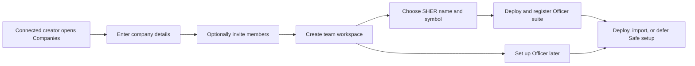

# Companies and Workspace — User Stories

**Scope:** Creating a team workspace and completing its initial Officer-contract setup from the Companies journey

**Last reviewed:** Not yet reviewed

These acceptance criteria follow the
[feature documentation review contract](../../platform/feature-specification-guide.md#human-review-contract).

## Product Model

- A **team workspace** is created from the Companies route with a required company name, an optional description, and optional member
  invitations.
- The connected creator becomes the team owner and is added to the team's members. A team can share a display name with another team; the
  backend assigns a unique slug for routing and storage.
- Initial **Officer-contract setup** is separate from team creation. The owner supplies the SHER name and symbol, deploys the Officer suite,
  and registers the resulting Officer generation with the team.
- The owner may defer Officer setup or Safe setup. Safe deployment and import are documented by
  [US-SAFE-001](../accounts/README.md#us-safe-001-set-up-a-safe).
- The shared `/teams/:id/...` route namespace also hosts feature-specific child routes. Community Credit's optional round-view segment is
  specified in the [Community Credit documentation](../community-credit/README.md).

## Lifecycle

## Status Overview

| User Story       | Title                                     | Actor        | Status        | Priority | Effort |
| ---------------- | ----------------------------------------- | ------------ | ------------- | :------: | ------ |
| US-COMPANIES-001 | Create a team workspace                   | Team creator | 🧪 Validation |    P1    | S      |
| US-COMPANIES-002 | Deploy the initial Officer contract suite | Team owner   | 🧪 Validation |    P1    | M      |

## US-COMPANIES-001: Create a Team Workspace

**As a** team creator\
**I want to** create a workspace and choose its initial members\
**So that** I can begin managing my company in CNC Portal

### Acceptance Criteria

#### Happy Path

- [x] A creator can enter a required company name and an optional description.
- [x] A creator can invite zero or more members by wallet address before creating the workspace.
- [x] A successful creation adds the creator as owner and member, persists the workspace, and advances to initial Officer setup.

#### Business Rules

- [x] A company name is required before the form can advance or submit.
- [x] Every selected member address must be a valid wallet address before the workspace can be created.
- [x] Teams with the same display name remain distinguishable by a generated unique slug.

#### Edge & Error Cases

- [x] Returning to the previous setup step preserves the entered company details.
- [x] A failed create request leaves the setup form available and reports that the company was not created.

**Priority:** P1 (Critical) · **Effort:** S · **Status:** 🧪 Validation

**Dependencies:** Connected user with a portal account

## US-COMPANIES-002: Deploy the Initial Officer Contract Suite

**As a** team owner\
**I want to** deploy and register the initial Officer contract suite\
**So that** my team can use CNC Portal's contract-backed features

### Acceptance Criteria

#### Happy Path

- [x] A team owner can enter the initial SHER name and symbol after the workspace is created.
- [x] A successful deployment registers the deployed Officer address and deployment metadata with the team.
- [x] After registration, the portal refreshes Officer data and continues to the Safe-setup step.

#### Business Rules

- [x] Both the SHER name and symbol are required before deployment can start.
- [x] An archived team cannot start the deployment.
- [x] The owner can defer the Officer deployment and return to it later.

#### Edge & Error Cases

- [x] A failed on-chain deployment is shown in the deployment step without advancing the setup flow.
- [x] A failed Officer registration is shown separately from a failed deployment and does not report setup success.

**Priority:** P1 (Critical) · **Effort:** M · **Status:** 🧪 Validation

**Dependencies:** US-COMPANIES-001, a connected wallet, and the active network

## Implementation Evidence

- [Companies and child-feature routes](../../../app/src/router/index.ts) and
  [team-creation form](../../../app/src/components/forms/AddTeamForm.vue)
- [Team creation endpoint](../../../backend/src/controllers/teamController.ts) and
  [request validation](../../../backend/src/validation/schemas/team.ts)
- [Initial Officer setup](../../../app/src/components/sections/TeamView/forms/InvestorContractStep.vue) and
  [Officer deployment composable](../../../app/src/composables/contracts/useOfficerDeployment.ts)
- [Team-creation form tests](../../../app/src/components/forms/__tests__/AddTeamForm.spec.ts) and
  [initial Officer setup tests](../../../app/src/components/sections/TeamView/forms/__tests__/InvestorContractStep.spec.ts)

## Related Documentation

- [Accounts](../accounts/README.md)
- [Contract Management](../contract-management/README.md)
- [Product feature inventory](../README.md)

_[← Back to feature inventory](../README.md)_
